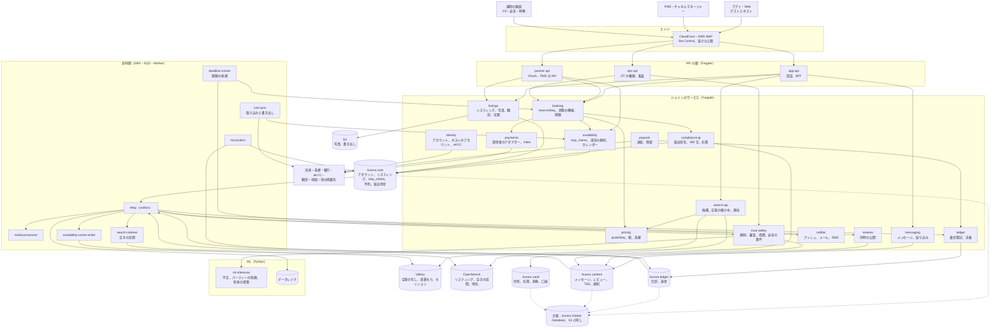

# Architecture: Airbnb

全体像と横断的な方針。領域ごとの設計は、同じディレクトリに領域ごとのファイルとして置く（まだない。計画は 7 節）。品質の戦略は [quality.md](../quality.md)、Epic と Story は [roadmap.md](../roadmap.md)、SLO と運用は [runbooks/](../runbooks/README.md) にある。

## 1. 全体構成

### 1.1 コンテキスト

```
 ゲスト（iOS・Android のアプリ、Web。多言語）              ホスト・共同ホスト（アプリ、Web）
      │ HTTPS <brand>.<domain>、API（X-<Brand>-Client）              │            PMS・チャネルマネージャー
      ▼                                                              ▼             │ OAuth、API、Webhook
┌──── 本システム（宿泊のマーケットプレイスと API、運用の画面）────────────────────────────┐
│  アカウントとホストのアカウント、リスティングと内容、位置と地名、空室とカレンダー、         │
│  カレンダーの同期、検索と順位付け、料金と税、予約と仮押さえ、キャンセルと変更、            │
│  決済と為替、台帳と送金、損害の請求、メッセージと通知、レビュー、T&S、本人確認、          │
│  日本の法令の対応（届出番号、180 日、宿泊者名簿）                                       │
└──────────────────────────────────────────────────────────────────────┘
   ▲ 運用の画面（ops.<brand>.<domain>）       │ 外向き
   │ CS・安全の窓口・T&S・財務                 ▼
         決済の提供者（カード、財布型、Webhook）、為替の相場の提供者、提携銀行・国際送金の提供者、
         eKYC の提供者、翻訳の提供者、地図のタイル・住所の検索の提供者、他の掲載先の iCal のアドレス、
         SMS、APNs・FCM、メールの送信、自治体・観光庁・警察の照会
```

### 1.2 コンテナ



| コンテナ | 責務 |
| --- | --- |
| エッジ（CloudFront、AWS WAF） | TLS の終端、ボットと速さの上限、写真の配信（`img.<brand>.<domain>`）、カレンダーの書き出し（`cal.<brand>.<domain>`）、Web の静的な資産 |
| `app-api` | アプリと Web の入口。セッションの検証、`actor_id` とホストのアカウントの決定、画面ごとの集約（BFF）、表示の言語と通貨 |
| `partner-api` | PMS 向けの API。OAuth のアプリ、範囲（scope）、速さの上限、Webhook の購読（host-tools-and-api の領域） |
| `ops-api` | 運用の画面の入口。JIT の権限、理由の入力、全操作の監査ログ（security の領域） |
| `identity` | アカウント、ホストのアカウントと共同ホスト、eKYC の提供者の連携と確認の水準（accounts、identity-verification の各領域、[ADR-0007](../decisions/0007-tenancy-host-accounts-and-rls.md)） |
| `listings` | リスティングの作成と編集、写真、設備、ハウスルール、多言語の内容と翻訳、位置（正確な位置は vault、ずらした位置は core）、公開の審査の呼び出し、`listingVisible()` |
| `availability` | `stay_claims`（予約・仮押さえ・リクエスト・ブロック・取り込み）、排他の制約、滞在の規則（`checkStayRules`）、カレンダーの設定、物件のタイムゾーン（[ADR-0002](../decisions/0002-availability-representation-and-double-booking.md)） |
| `search-api` | 地図・地名・日付・人数・価格の検索。OpenSearch の候補 → Valkey の空室の写しでの確かめ → 料金 → 順位（[ADR-0003](../decisions/0003-search-for-date-range-availability.md)） |
| `pricing` | `quoteStay`：泊ごとの料金、割引、料金、サービス料、税、為替。見積もりの写し（`quotes`）（pricing-and-fees、taxes の各領域、[ADR-0008](../decisions/0008-multi-currency-and-fx.md)） |
| `booking` | `reserveStay`・`alterReservation`・`cancelReservation`、予約の状態の機械、期限（[ADR-0004](../decisions/0004-booking-state-machine-and-holds.md)） |
| `payments` | 決済の提供者のアダプター、冪等キー、Webhook の inbox、照会、返金、チャージバック（[ADR-0005](../decisions/0005-payments-hold-capture-and-ledger.md)） |
| `ledger` | 通貨ごとの複式簿記の仕訳、預かりと決着、手数料、税の預かり、為替の口座（[ADR-0005](../decisions/0005-payments-hold-capture-and-ledger.md)） |
| `payouts` | 送金の口座、振り替えの後の送金の束、提携銀行・国際送金の提供者、送金の保留と失敗の戻し |
| `messaging` | 問い合わせと予約のメッセージ、連絡先の絞り込み、通報（messaging の領域） |
| `reviews` | レビューの受け付け、同時の公開、ホストの返答（reviews の領域） |
| `trust-safety` | 規則のエンジン、信号の受け取り、審査の待ち行列、措置（`moderation_actions`）、安全の事故の案件、異議（[ADR-0009](../decisions/0009-trust-and-safety-and-ml-boundary.md)） |
| `compliance-jp` | 届出住宅（`regulated_properties`）、届出番号・許可番号、180 日の数え（`regulated_nights`）、自治体の規則の表、宿泊者名簿、定期報告の書き出し（[ADR-0006](../decisions/0006-regulatory-night-cap-enforcement.md)） |
| `notifier` | プッシュ・メール・SMS、言語ごとの文、配信の設定 |
| `relay` | outbox を読み、SNS へ流す |
| `media-processor` | 写真の検査、位置情報（EXIF の GPS）の除去、縮小と変換、知覚ハッシュ |
| `search-indexer` | リスティングと空きの区間（`free_ranges`）を OpenSearch に入れる（リスティングのバージョンを外部のバージョンにする） |
| `availability-cache-writer` | リスティングごとの空室の写し（2 年分の泊のビット列と規則の要約）を Valkey に書く（バージョンで古い書き込みを捨てる） |
| `ical-sync` | 取り込む iCal の定期の取得と差分、書き出しの生成、食い違いの検出（calendar-sync の領域） |
| `deadline-runner` | 仮押さえ・リクエスト・見積もりの期限、送金の振り替えの時刻、レビューの期限を 1 分ごとに拾う |
| `reconcilers` | stay_claims の内部の照合、予約と台帳、台帳と提供者・銀行（3 者）、180 日の数えの照合 |
| `ml-inference` | 不正の点、パーティーの危険の点、偽のリスティングの点、料金の提案。点と理由のコードだけを返す（[ADR-0009](../decisions/0009-trust-and-safety-and-ml-boundary.md)） |
| Aurora core | アカウント、ホストのアカウント、リスティング、`stay_claims`、カレンダーの設定、見積もり、予約、届出住宅と `regulated_nights`、outbox。FORCE RLS（[ADR-0007](../decisions/0007-tenancy-host-accounts-and-rls.md)） |
| Aurora ledger | 口座、仕訳、送金、照合の結果。`ledger`・`payouts` だけが書く |
| Aurora content | メッセージ、レビュー、T&S の案件と措置、通報、通知 |
| Aurora vault | 正確な住所と位置、宿泊者名簿、旅券の番号と画像の参照、送金の口座、本人確認の結果。封筒の暗号化（security の領域） |
| Valkey | 空室の写し、見積もりの写し、セッション、速さの上限。失ってよい（正本にしない） |
| OpenSearch | リスティングの索引（ずらした位置、空きの区間、料金の要約、多言語の文）、地名の索引。正本にしない |
| S3 | 写真、書き出し、旅券の画像（vault の鍵で暗号化。Object Lock なし、期限で消す） |

原則は 7 つ。

- **同じ夜は 1 つの行の集まりで決める。** 予約・仮押さえ・リクエスト・ブロック・取り込みは、すべて `stay_claims` の行で、`(listing_id, claim_group, block_span)` の排他の制約が、異なる組の重なりを DB で拒む。検索・写し・PMS の書き込みのどれも、この制約を越えられない（[ADR-0002](../decisions/0002-availability-representation-and-double-booking.md)）。
- **日付は現地の日付、瞬間は UTC。** 泊は物件の現地の日付の `daterange`、締め切り・期限・送金の時刻は物件のタイムゾーンで UTC に直した瞬間で持つ。直す関数は 1 か所（Google Calendar の題材の [ADR-0002](../../../google-calendar/docs/decisions/0002-time-representation.md) の考え方）。
- **検索は候補を絞るだけ。** OpenSearch の空きの区間と Valkey の写しは遅れうる。正しさは予約の時の DB の確かめで守り、検索の誤りの率を SLI で見る（[ADR-0003](../decisions/0003-search-for-date-range-availability.md)）。
- **予約の流れと、お金の正本を分ける。** 予約の状態は core、お金は ledger の追記だけの仕訳が正本である。2 つは outbox と冪等キーでつなぎ、照合で食い違いを必ず見つける（[ADR-0005](../decisions/0005-payments-hold-capture-and-ledger.md)）。
- **法令の上限は予約と同じトランザクションで守る。** 届出住宅の 180 日の数えと自治体の規則は、`stay_claims` の挿入と同じトランザクションで確かめる。法令の解釈は `legal.*` の値に分ける（[ADR-0006](../decisions/0006-regulatory-night-cap-enforcement.md)）。
- **場所と身元は金庫に閉じる。** 正確な住所・位置・名簿・旅券・口座は vault にだけ置き、検索・通知・ログに流さない。
- **外部は遅れ、重なり、入れ替わる。** 決済の提供者・銀行の通知は inbox で重複を除き、照会で確かめ、状態を前にだけ進める。他の掲載先の iCal は遅れて食い違うものとして扱う。

### 1.3 主要な流れ

**A. リスティングを出して検索に出る**

1. ホストが住所を入れる。`listings` は住所の検索の提供者で位置を求め、ホストが地図でピンを直す。正確な位置は vault に、ずらした位置（`approx_point`）を core に書く。ずらした位置は、正確な位置から半径 300〜800 m の中で、リスティングの ID と秘密の値から決まる点で、作り直さない（作り直すたびに違う点を出すと、重ねて真の位置を推せるため）。
2. 写真を S3 の署名つきの URL で上げる。`media-processor` が位置情報を消し、変換し、知覚ハッシュを計算する。
3. 日本の物件は、届出番号・許可番号・特定認定の番号と、確かめの書類を求める。`compliance-jp` が番号の形と、同じ番号の他のホストでの使用を確かめ、届出住宅（`regulated_properties`）にリスティングを結ぶ（[ADR-0006](../decisions/0006-regulatory-night-cap-enforcement.md)）。
4. 公開の審査（写真の使い回し、禁止の語、番号の確かめ、ホストの本人確認）を通れば `listed` にし、outbox に `listing.published` を書く。
5. `search-indexer` がずらした位置・空きの区間・料金の要約を入れ、`availability-cache-writer` が空室の写しを作る。公開から検索に出るまで p95 60 秒。

**B. 地図と日付で探す（中心の難しさ）**

1. ゲストが地図の範囲（か地名）・チェックインとチェックアウト・人数・価格の範囲・条件を送る。地名は地名の索引で、範囲の多角形か点と半径に直す。
2. `search-api` は OpenSearch に、ずらした位置の範囲、定員、条件、そして **空きの区間（`free_ranges`、`date_range` の欄）に `[check_in, check_out)` を含む区間がある** ことを問う。価格は、リスティングの「その月の泊の料金の最小と最大」で粗く絞る。結果は粗い順位で上位 300 件（ステージ 1）。
3. 300 件の空室の写しを Valkey から一度に取る。各件で、泊のビット列（2 年分）、最短・最長の泊数、曜日の規則、締め切り、予約できる期間、準備の日を `checkStayRules` と同じ関数で確かめる（ステージ 2）。写しのバージョンが古ければ、そのまま使い、古さを計測する。
4. 残った件で `quoteStay` の要約（総額、表示の通貨）を求め、価格の範囲で正しく絞り、順位の式で並べ、1 ページ（18 件）と地図の点を返す。件数は「300 件以上」のように粗く出す。
5. 日付を決めない検索（「週末」「1 週間」「この月の中で」）は、ステージ 1 を日付なしで行い、ステージ 2 で各件の写しから条件に合う最初の日程を探す（[ADR-0003](../decisions/0003-search-for-date-range-availability.md)）。

**C. 即時予約（`reserveStay`）**

1. 確認の画面を開くと、`pricing` が見積もり（`quote_id`、15 分）を作る。見積もりは料金の規則・キャンセルポリシー・税の表・為替の相場の ID とバージョン、各行の額を固定する。
2. ゲストが支払いの方法を選び、`Idempotency-Key` と `quote_id` を送る。`booking` は 1 つの core のトランザクションで、次を行う。
   1. 同じ冪等キーの予約があれば、それを返す。
   2. 見積もりの期限と金額を確かめる。
   3. 届出住宅に結んだリスティングなら、`regulated_properties` の行をロックする（ロックの順は、届出住宅 → リスティング）。
   4. リスティングの行をロックし、`checkStayRules` で滞在の規則を確かめる。
   5. 同じリスティングの期限の切れた仮押さえを `released` にする。
   6. `stay_claims` に `kind = 'hold'`、`status = 'active'`、`claim_group = reservation_id`、`hold_expires_at = now() + 10 分` の行を挿入する。排他の制約に当たれば 409 `dates_unavailable`。
   7. 届出住宅なら、`regulated_nights` に泊の日を挿入し、年度の数を増やす。上限の CHECK に当たれば 409 `regulatory_cap_reached`。自治体の規則で禁じた日なら 409 `regulatory_day_blocked`。
   8. 予約（`state = 'pending_payment'`）と outbox を書く。
3. `payments` が提供者に、冪等キー `<reservation_id>:capture` でオーソリと売上の確定を依頼する（3-D セキュアが要れば画面に戻す）。成功で予約を `confirmed` にし、行を `kind = 'reservation'` に変えて仮押さえの期限を消す。失敗・期限切れなら `cancelled`（`payment_failed`）にし、`stay_claims` と `regulated_nights` を同じトランザクションで戻す（[ADR-0004](../decisions/0004-booking-state-machine-and-holds.md)）。
4. `ledger` は `reservation.confirmed` を受け、「借方 提供者への未収／貸方 ゲストの預かり（`guest_funds_held:<reservation_id>`）」を書く。

**D. 予約のリクエスト**

1. 即時予約でないリスティングでは、`reserveStay` が `stay_claims` を `kind = 'request'`、期限 24 時間で挿入し、届出住宅の泊も数える。予約は `requested`。
2. `payments` はオーソリだけを取る（売上を確定しない）。ホストが 24 時間の間に承認すれば、`booking` が予約を `confirmed`、`stay_claims` を `reservation` にし、`payments` が売上を確定する。断り・期限切れなら、`stay_claims` と泊の数を戻し、オーソリを取り消す（[ADR-0004](../decisions/0004-booking-state-machine-and-holds.md)、[ADR-0005](../decisions/0005-payments-hold-capture-and-ledger.md)）。
3. リクエストの間、その日付は他のゲストに空いて見えない。本家の振る舞いは**未検証**で、本システムはホストの承認の後の食い違いをなくすほうを選んだ。

**E. 外部のカレンダーの取り込みと食い違い**

1. `ical-sync` が取り込むアドレスを 15 分ごとに、`If-None-Match`・`If-Modified-Since` つきで取る（取得は egress の経路で、私的なアドレスを拒む）。内容のハッシュが同じなら何もしない（Google Calendar の題材の [ADR-0025](../../../google-calendar/docs/decisions/0025-ics-subscriptions-both-directions.md) の考え方）。
2. 予定を泊の範囲に直し（終日の `DTSTART;VALUE=DATE` はそのまま、時刻つきは物件のタイムゾーンで日付に直す）、前回の取り込みとの差分を `stay_claims` に `kind = 'ical_block'` で書く。
3. 挿入が排他の制約に当たったら、外部と本システムで同じ夜が売れている。`calendar_conflicts` に記録し、5 分以内にホストに知らせ、運用の待ち行列に入れる。本システムの予約は自動で取り消さない（どちらの予約が先かを本システムは知れないため）。
4. 書き出しは、`stay_claims` の変化の outbox から 1 分以内に作り直し、`cal.<brand>.<domain>` の秘密のアドレスで出す。相手の取得の間隔は相手が決めるので、相手側の遅れは本システムでは縮められない。PMS の API を使うホストは、Webhook で p95 10 秒で知る（NFR-003）。

**F. チェックインの後の送金**

1. 予約が `confirmed` になると、`booking` は `payout_release_at` = チェックインの日の物件の現地のチェックインの時刻 + 24 時間（UTC に直した瞬間）を書く。
2. `deadline-runner` がその時刻を過ぎた予約を拾い、`ledger` に release を依頼する。仕訳は「借方 ゲストの預かり／貸方 ホストへの支払い（`host_payable`）・サービス料の収益・税の預かり」。冪等キーは `(reservation_id, settlement_seq, release)`。
3. `payouts` は毎営業日の決めた時刻（提携銀行の締めの前）に、ホストごとの `host_payable` を束にして送金を依頼する。保留（不正の疑い、本人確認の未了、損害の請求の審査）のホストは除く（[ADR-0005](../decisions/0005-payments-hold-capture-and-ledger.md)）。
4. 照合が 5 分ごとに、`payout_release_at` を過ぎたのに release のない予約を探す。

**G. キャンセルと返金**

1. ゲストがキャンセルを押すと、`booking` は予約の時に固定したキャンセルポリシーのバージョンと、物件の現地の時刻での「チェックインまでの時間」から、返金・ホストの取り分・サービス料の扱いを決定表で求める（cancellations-and-changes の領域）。
2. 1 つのトランザクションで予約を `cancelled` にし、`stay_claims` と未来の `regulated_nights` を戻す。
3. `ledger` は 1 つの settle の仕訳で預かりを、ゲストへの返金・ホストへの支払い・収益に分ける。`payments` が返金を依頼する。release の後のキャンセル（滞在中）は、ホストへの支払いからの戻しの仕訳になる。

**H. レビューの同時の公開**

1. チェックアウトの日の現地の時刻を過ぎると、`reviews` は予約ごとに `review_pairs` の行を作り、期限 = チェックアウトの時刻 + 14 日を書く。
2. 片方が出しても、`revealed_at` は空のまま。相手と他の人の読み出しは、RLS とビューで `revealed_at IS NOT NULL` に限る。
3. 2 人目が出したトランザクションで `revealed_at` を書く。期限が来たら `deadline-runner` が `revealed_at` を書く。どちらの経路も同じ関数で、片方だけを公開する経路はない。

### 1.4 本家の形（確かめたこと）

| 項目 | 本家 | 出典 |
| --- | --- | --- |
| 規模 | ホスト 550 万人超、有効なリスティング 900 万件超、220 以上の国・地域 | [About us](https://news.airbnb.com/about-us/) |
| 予約の量 | 2026 年第 2 四半期の Nights and Seats Booked 1 億 4,830 万、GBV 272 億ドル | [株主への手紙（Form 8-K の別紙 99.1）](https://www.sec.gov/Archives/edgar/data/0001559720/000119312526337928/d70413dex991.htm) |
| サービス料 | 分担の型（ホスト 3%、ゲスト 14.1〜16.5%）と、ホストだけの型（多くは 15.5%）。分担の型はなくしていく途中 | [ヘルプの記事 1857](https://www.airbnb.com/help/article/1857) |
| キャンセルポリシー | 柔軟・中程度・限定・厳格など。7 日以上前に確定した予約は確定から 24 時間は全額の返金 | [ヘルプの記事 475](https://www.airbnb.com/help/article/475) |
| レビュー | チェックアウトから 14 日。両者が出すか期間の終わりの早いほうで公開 | [ヘルプの記事 13](https://www.airbnb.com/help/article/13) |
| カレンダーの同期 | iCal。自動の更新は 3 時間ごと、2 年先まで取り込む | [ヘルプの記事 99](https://www.airbnb.com/help/article/99) |
| 位置 | 予約の確定の前はおおよその範囲。番地と部屋の番号は確定した予約のゲストだけ | [ヘルプの記事 2141](https://www.airbnb.com/help/article/2141) |
| 予約のリクエスト | ホストの応答は 24 時間。過ぎると期限切れ | [Reservation requests](https://www.airbnb.com/help/topic/1340) |
| 損害の請求 | チェックアウトから 14 日以内。ゲストは 24 時間で応じる | [ヘルプの記事 279](https://www.airbnb.com/help/article/279) |
| 日本の届出番号 | 日本のリスティングは届出番号・許可番号の表示が必須。確かめの書類を上げる | [ヘルプの記事 2177](https://www.airbnb.com/help/article/2177)、[ヘルプの記事 2274](https://www.airbnb.com/help/article/2274) |
| 送金の時期 | チェックインの予定の時刻から約 24 時間の後（各国語のヘルプの要約だけで確かめた） | **未検証**（[ヘルプの記事 425](https://www.airbnb.com/help/article/425)） |
| 検索・空室の内部、順位付け、料金の提案の方式、パーティーの防止の方式、本家の SLA | 公式の資料で確かめられなかった | **未検証** |

いずれも 2026-10-10 に確認。この設計は振る舞いを参考にするが、本家のコード・本家が公開したライブラリ・データ・モデルは使わない（[リポジトリ共通の ADR-0007](../../../../docs/decisions/0007-no-reuse-of-original-implementation.md)）。

**本家との意図した違い**：

| 項目 | 本家 | 本システム | 理由・根拠 |
| --- | --- | --- | --- |
| iCal の取り込みの間隔 | 3 時間ごと | 15 分ごと（条件つきの取得） | 外部との食い違いの窓を縮める（NFR-003） |
| 予約のリクエストの間の日付 | **未検証** | 他のゲストに空いて見せない（仮押さえと同じ） | ホストの承認の後の食い違いをなくす（[ADR-0004](../decisions/0004-booking-state-machine-and-holds.md)） |
| サービス料の型 | 分担の型とホストだけの型 | MVP はホストだけの型。ゲストに見せる額は総額 | 日本の総額の表示に合わせやすい（法務の L4） |
| 保証金 | 預かりはない（損害の保護の仕組みで扱う。**未検証**の部分あり） | MVP は損害の請求だけ。保証金の預かりは MVP の後 | オーソリの期限と予約の長さが合わない（法務の L12） |
| キャンセルポリシー | 6 つ以上 | MVP は柔軟・中程度・厳格の 3 つ | 決定表と性質を小さく保つ。他は表の行を足して出す |
| 送金の時期 | 約 24 時間の後（**未検証**） | チェックインの予定の時刻 + 24 時間に振り替え、次の銀行の締めで送る | 本家に寄せた既定値。値は設定 |
| 位置の秘匿 | おおよその範囲（方式は**未検証**） | 決まった点にずらし、検索の索引にも正確な位置を入れない | 範囲の問い合わせでの割り出しを防ぐ |
| ヘッダー・ドメイン・iCal の `PRODID` | 本家の名前を含む | `<Brand>`・`<brand>` | リポジトリ共通の ADR-0006 |
| データの所在 | **未検証** | すべて日本（東京、DR は大阪） | 日本を最初の市場にする（法務の L8） |

## 2. 規模の段階

| 段階 | 有効なリスティング | 泊の予約 | 予約の件数 | 検索の最大 | 予約の最大（全体） | 人気の 1 リスティング・日付への予約の試み | 取り込む iCal | 構成 |
| --- | --- | --- | --- | --- | --- | --- | --- | --- |
| S1（MVP。日本） | 10 万 | 2 万泊/日 | 6,000 件/日 | 500 件/秒 | 10 件/秒 | 50 件/秒 | 3 万のアドレス（15 分ごと、約 35 件/秒） | 東京の 1 リージョン・3 AZ。Aurora は core・ledger・content・vault の 4 クラスタ。大阪に Aurora Global Database と S3 の写し |
| S2（日本とアジア） | 100 万 | 20 万泊/日 | 6 万件/日 | 5,000 件/秒 | 80 件/秒 | 300 件/秒 | 30 万（約 350 件/秒） | core の読み出しの写しを増やす。OpenSearch を地域ごとの索引に分ける。空室の写しを Valkey のクラスタで分ける。1 リスティングの複数の同じ部屋を足す |
| S3（世界） | 1,000 万 | 160 万泊/日 | 45 万件/日 | 2 万件/秒 | 600 件/秒 | 1,000 件/秒 | 300 万（約 3,500 件/秒） | core を `listing_id` のハッシュで分ける（リスティング・stay_claims・予約・届出住宅を同じ分け先に置く）。ledger を口座の持ち主のハッシュで分ける |

- 数値は本システムの想定。S3 の泊は本家の 2026 年第 2 四半期の 1 億 4,830 万（91 日で 1 日あたり約 163 万。体験の席を含む）に、リスティングは本家の 900 万件超に合わせた（[出典](https://www.sec.gov/Archives/edgar/data/0001559720/000119312526337928/d70413dex991.htm)、[About us](https://news.airbnb.com/about-us/)）。検索・予約の最大の値は、本家の公式の値を確かめられなかった（**未検証**）ので、本システムの推定である。
- 1 予約の平均を 3.5 泊と見込んだ（本システムの推定）。S3 の 45 万件/日は平均 5.2 件/秒である。
- 予約の最大は、繁忙期（年末年始、ゴールデンウィーク、夏の休み、桜の時期）の予約が集まる日の夕方の 1 分の平均を、普段の平均の 100 倍と見込んだ。大きな催し（花火大会、祭り、国際的な大会）の日程の発表の直後に、同じ都市の同じ日付へ予約が集まる。
- 人気の 1 リスティング・日付への予約の試みは、催しの日程の発表の直後の 1 秒に、1 つのリスティングの同じ日付へ集まる押下を見込んだ。成功は 1 件だけで、残りは負けの応答になる（NFR-004）。
- 検索は、地図を動かすたびに 1 件と数える。予約 1 件あたり 400〜1,000 件の検索と見込んだ。ステージ 2 で 1 件の検索が 300 件の空室の写しを確かめるので、S3 の最大では 1 秒 600 万件の写しの確かめになる（capacity の領域で確かめる）。
- 取り込む iCal は、リスティングの 30% が 1 件の取り込みを持つと見込んだ。
- 段階を上げる基準と部品の大きさは infrastructure の領域、負荷と費用のモデルは capacity の領域で決める。

### 2.1 費用のモデル

予約 1 件と、検索 1,000 件の原価を、次の和で見る。単価は capacity の領域で、AWS の東京の公開の価格から入れる。

```
予約あたりの原価 = 見積もりと予約（Fargate、Aurora core の書き込み、排他の制約の索引）
                ＋ 台帳（仕訳 3〜5 件、Aurora ledger）
                ＋ 通知（プッシュ 5〜10 通、メール 3〜5 通、SMS 0〜1 通）
                ＋ 外部（決済の提供者の手数料、為替の差、送金の手数料、本人確認の提供者）
検索 1,000 件の原価 = OpenSearch（地図と空きの区間の問い合わせ）
                    ＋ Valkey（300 件 × 1,000 の空室の写しの読み出し）
                    ＋ 料金の要約の計算（Fargate）
                    ＋ 地図のタイルの提供者（アプリが直接取る分は除く）
```

- 最も大きいのは、決済の提供者の手数料と為替の差（予約の額に比例）、検索のステージ 2 と料金の要約の計算、写真の配信、翻訳の提供者と見込む。ステージ 1 の候補の数（300）と、料金の要約の写しの使い回しが主な制御の手段になる。
- 予約あたりの原価（決済の提供者の手数料と為替を除く）を S1 で 30 円以下にする（本システムの想定。capacity の領域で公開の価格に置き換える）。

## 3. 非機能要件

| ID | 項目 | S1 の目標 | 備考 |
| --- | --- | --- | --- |
| NFR-001 | 検索の速さ | 地図・地名・日付・人数・価格の検索 p95 300ms・p99 800ms。日付を決めない検索 p95 600ms。地名の候補（入力の補完）p95 100ms | [ADR-0003](../decisions/0003-search-for-date-range-availability.md) |
| NFR-002 | 空室の鮮度 | 予約・仮押さえ・ブロック・カレンダーの設定の変更から、検索の索引と空室の写しに効くまで p95 10 秒・p99 60 秒。検索の結果に、その日付に泊まれないリスティングが混ざる割合 0.5% 未満（抜き取りの再判定） | [ADR-0003](../decisions/0003-search-for-date-range-availability.md) |
| NFR-003 | 外部のカレンダーの鮮度 | 取り込む iCal を 15 分ごとに取り、取得から `stay_claims` に効くまで p95 1 分（外部の変更から反映まで p95 20 分）。PMS の API の書き込みは同期で効く。本システムの変化から書き出しの作り直しまで p95 1 分、Webhook の送信まで p95 10 秒。外部と本システムの重なりを、取り込みから 5 分以内にホストに知らせる | calendar-sync の領域 |
| NFR-004 | 予約の速さ | 即時予約の `reserveStay` の確定 p99 1.5 秒（提供者の時間を除く）。見積もり p99 500ms。人気のリスティング・日付で負けた要求への応答 p99 300ms | [ADR-0004](../decisions/0004-booking-state-machine-and-holds.md) |
| NFR-005 | 二重の予約なし | 1 つのリスティングの同じ夜に有効な `stay_claims` が 2 つになった件数 0。Valkey の障害、DB のフェイルオーバー、PMS と画面の同時の書き込みのときも 0 | [ADR-0002](../decisions/0002-availability-representation-and-double-booking.md) |
| NFR-006 | 法令の上限 | 届出住宅の年度の泊の日数が上限を超えた件数 0。自治体の規則で禁じた日の泊 0。届出番号のない日本の物件の公開 0 | [ADR-0006](../decisions/0006-regulatory-night-cap-enforcement.md) |
| NFR-007 | 台帳の正しさ | 通貨ごとに釣り合わない仕訳 0。全口座の残高の和 0（通貨ごと）。1 つの予約の預かりの決着の重複 0、和の不一致 0。台帳・提供者の精算・銀行の明細の説明のつかない差を 3 営業日で 0 にする | [ADR-0005](../decisions/0005-payments-hold-capture-and-ledger.md) |
| NFR-008 | 送金の時期 | チェックインの前の release 0。`payout_release_at` から release まで p99 5 分、最大 1 時間（保留を除く）。release から提携銀行への依頼まで、次の銀行の締め（営業日）以内 | [ADR-0005](../decisions/0005-payments-hold-capture-and-ledger.md) |
| NFR-009 | レビューの公開 | 片方だけの公開・期限の前の公開 0。2 人目の提出と同時、または期限から 1 分以内に両方を公開 | reviews の領域 |
| NFR-010 | 可用性 | 予約と決済 月間 99.95%、検索とリスティングの閲覧 月間 99.9%、メッセージ 月間 99.9%、PMS の API 月間 99.9%、運用の画面 月間 99.5% | 本家の SLA は確かめなかった（**未検証**） |
| NFR-011 | 耐久性 | 確定した予約・仕訳の消失 0。AZ の障害で RPO 0・RTO 5 分。リージョンの障害で RPO 1 分・RTO 1 時間 | infrastructure の領域 |
| NFR-012 | メッセージと通知 | メッセージの送信から相手の端末への依頼まで p95 5 秒。予約の通知（確定、リクエスト、キャンセル）p95 10 秒。連絡先の絞り込み p95 100ms | messaging の領域 |
| NFR-013 | 安全 | 緊急の安全の連絡に人が応じるまで p90 2 分（24 時間 365 日）。安全の事故の報告からホスト・ゲストの保護の措置（予約の停止、代わりの宿の手配の開始）まで p95 30 分 | trust-and-safety の領域 |
| NFR-014 | 時刻の正しさ | 締め切り・期限・送金・レビューの時刻を、物件のタイムゾーンと tz データベースのバージョンで計算した値と違える件数 0。夏時間のある国の物件も同じ | [ADR-0002](../decisions/0002-availability-representation-and-double-booking.md) |
| NFR-015 | 総額の一致 | 見積もりの総額と請求の額（通貨を含む）の違い 0。見積もりの有効期限 15 分 | [ADR-0004](../decisions/0004-booking-state-machine-and-holds.md)、[ADR-0008](../decisions/0008-multi-currency-and-fx.md) |
| NFR-016 | 位置と個人のデータ | 正確な住所・位置が、確定した予約のゲスト・ホストのアカウント・権限のある運用者の外に出た事象 0。名簿・旅券・口座が他の利用者に出た事象 0 | [ADR-0007](../decisions/0007-tenancy-host-accounts-and-rls.md)、location-and-geo の領域 |

## 4. 技術スタック

| 層 | 選定 | 理由 |
| --- | --- | --- |
| 言語（サービス） | TypeScript（Hono＋Zod）。ドメインごとのパッケージを持つ 1 つのコードベースを、入口・Worker ごとのサービスとして出す | 他の題材と同じ（[ADR-0001](../decisions/0001-platform-and-stack.md)） |
| 言語（ML） | Python（学習と `ml-inference`） | [ADR-0001](../decisions/0001-platform-and-stack.md)。共通の基盤からの外れ |
| DB | Aurora PostgreSQL 18。core・ledger・content・vault の 4 クラスタ。`btree_gist` の排他の制約、FORCE RLS と `SET LOCAL`、ID は UUIDv7、transactional outbox | [ADR-0002](../decisions/0002-availability-representation-and-double-booking.md)、[ADR-0007](../decisions/0007-tenancy-host-accounts-and-rls.md) |
| キャッシュ | ElastiCache Valkey（空室の写し、見積もりの写し、セッション） | 他の題材と同じ。失ってよい部品 |
| 非同期 | outbox → SNS・SQS | 他の題材と同じ |
| 検索 | Amazon OpenSearch Service（`geo_point`、`date_range`、Sudachi と ICU、言語ごとの解析器）。順位付けは自前の式 | [ADR-0003](../decisions/0003-search-for-date-range-availability.md) |
| 地理 | PostGIS（境界の多角形、地名の範囲）、OpenSearch の `geo_point`。地図のタイルと住所の検索は提供者 | location-and-geo の領域。Uber の題材の格子は日本だけの平面なので使わない（[ADR-0003](../decisions/0003-search-for-date-range-availability.md)） |
| 時刻 | IANA の tz データベース（バージョンを固定して配る）、`packages/stay-time` | Google Calendar の題材の [ADR-0002](../../../google-calendar/docs/decisions/0002-time-representation.md) |
| エッジ | CloudFront、AWS WAF（Bot Control） | 他の題材と同じ |
| 実行基盤 | ECS Fargate | [ADR-0001](../decisions/0001-platform-and-stack.md) |
| オブジェクトストレージ | S3（写真、書き出し、旅券の画像）。写真の変換は sharp | listings-and-content の領域 |
| データレイク | S3、Glue のカタログ、Athena。個人のデータを除く・仮名にした事象 | [ADR-0009](../decisions/0009-trust-and-safety-and-ml-boundary.md) |
| 外部 | 決済の提供者、為替の相場の提供者、提携銀行の API（予備に全銀の形式のファイル）、国際送金の提供者（MVP の後）、eKYC の提供者、翻訳の提供者、地図の提供者、SMS、APNs・FCM、Amazon SES | [ADR-0005](../decisions/0005-payments-hold-capture-and-ledger.md)、[ADR-0008](../decisions/0008-multi-currency-and-fx.md) |
| アプリ | iOS・Android は React Native（TypeScript）、Web は React | 他の題材（Mercari、Uber）と同じ形。accounts の領域で ADR にする |
| IaC | Terraform | infrastructure の領域 |
| 可観測性 | OpenTelemetry（ADOT）→ CloudWatch・AMP・Managed Grafana | observability の領域 |
| フラグ | AWS AppConfig（`release.*`、`ops.*`、`legal.*`） | 他の題材と同じ |
| テスト | Vitest・fast-check、pytest・Hypothesis、自前の参照の実装（空室、料金、台帳、キャンセルの精算）、Testcontainers（PostgreSQL 18、Valkey、OpenSearch）、LocalStack、提供者の模型、iCal の模型、仮想の時計、k6 と自前の負荷の生成器、Playwright・Maestro | [quality.md](../quality.md) |

## 5. 主な決定

どれも `accepted`。0001〜0009 は最初の設計の起票。状態の一覧は [decisions/README.md](../decisions/README.md)。

| ADR | 決定 |
| --- | --- |
| [0001](../decisions/0001-platform-and-stack.md) | 共通の基盤を引き継ぎ、ドメインごとのパッケージを持つ 1 つのコードベースを入口・Worker ごとのサービスで出す。Aurora は core・ledger・content・vault の 4 クラスタ。ML だけ Python。検索は OpenSearch を汎用の部品として使う |
| [0002](../decisions/0002-availability-representation-and-double-booking.md) | 空室の正本を、予約・仮押さえ・リクエスト・ブロック・取り込みをまとめた `stay_claims` の泊の範囲の行にし、`(listing_id, block_span)` の排他の制約で重なりを DB で 0 にする。準備の日は各予約の後ろの範囲に含める。泊ごとの行はカレンダーの設定（料金、規則の上書き）にだけ使う。日付は物件の現地の日付 |
| [0003](../decisions/0003-search-for-date-range-availability.md) | 日付の範囲の検索は 2 段にする。OpenSearch に空きの区間を `date_range` の欄で入れて「範囲を含む区間がある」で候補を 300 件に絞り、Valkey の空室の写し（2 年分の泊のビット列と規則の要約）で滞在の規則を確かめる。価格は粗く絞り、料金の要約で正しく絞る。正しさは予約の時の DB で守る |
| [0004](../decisions/0004-booking-state-machine-and-holds.md) | 予約を明示の状態の機械にし、作成を `reserveStay` の 1 つの関数と 1 つのトランザクション（見積もりの確かめ、規則、排他の制約、180 日の数え）に集める。仮押さえは 10 分、リクエストは 24 時間の期限つきの `stay_claims`。冪等キーと見積もりの一意で予約を 1 回に限る。日程の変更は同じ予約の組（`claim_group`）の行で、相手の受諾の時に入れ替える |
| [0005](../decisions/0005-payments-hold-capture-and-ledger.md) | 決済は提供者に任せ、即時予約は確定の時に売上を確定する。リクエストはオーソリだけを取り、承認で確定する。お金は予約ごとの預かりの口座を持つ通貨ごとの複式簿記の台帳で持ち、チェックインの予定の時刻 + 24 時間にホストへの支払いへ振り替える。決着は冪等キーで 1 回 |
| [0006](../decisions/0006-regulatory-night-cap-enforcement.md) | 届出住宅を `regulated_properties` として持ち、泊の日を `regulated_nights`（届出住宅 × 日）に予約と同じトランザクションで挿入し、年度の数を CHECK 制約で守る。自治体の規則はバージョンの付いた表。数え方の解釈と他の掲載先の泊の扱いは `legal.*` に置く |
| [0007](../decisions/0007-tenancy-host-accounts-and-rls.md) | テナントは 1 つ。本人の表は本人、ホストの表はホストのアカウント（共同ホストの役割）、予約の表はゲストとホストのアカウントの 2 者の FORCE RLS にする。PMS は OAuth のアプリとしてホストのアカウントの範囲で動く。リスティングの見える範囲は `listingVisible()` の 1 つの関数 |
| [0008](../decisions/0008-multi-currency-and-fx.md) | リスティングの価格はホストの通貨の整数で持つ。表示と支払いはゲストの通貨にでき、換算は見積もりの時の相場の写し（ID つき）で 1 回だけ行う。台帳の仕訳は 1 つの通貨に閉じ、通貨の間は為替の口座で結ぶ。ホストへは自分の通貨で送る |
| [0009](../decisions/0009-trust-and-safety-and-ml-boundary.md) | T&S は、同期の検査・規則のエンジン・人の審査・措置の記録の段に分ける。不正・パーティーの危険・偽のリスティングの ML は点と理由のコードだけを出す。料金の提案はホストが決めた範囲でだけ効き、順位付けの ML は影の評価の後。保護される属性を特徴に使わない |

領域ごとの ADR は、7 節の番号の範囲で起票する。リポジトリ共通の決定（開発プロセス、ブランチモデル、本家の名前・接頭辞を使わない規則の [ADR-0006](../../../../docs/decisions/0006-brand-neutral-identifiers.md)、本家の実装を核に使わない規則の [ADR-0007](../../../../docs/decisions/0007-no-reuse-of-original-implementation.md)）は、ルートの [docs/decisions/](../../../../docs/decisions/README.md) にある。

関係する他の題材の設計（参照するだけで、設計し直さない）：

| 題材 | 参照するもの |
| --- | --- |
| Google Calendar | 壁時計の時刻と TZID の持ち方（[ADR-0002](../../../google-calendar/docs/decisions/0002-time-representation.md)）、tz データベースの更新と計算し直し（[ADR-0012](../../../google-calendar/docs/decisions/0012-tzdb-update-recompute-and-propagation.md)）、ICS の購読の両方向（[ADR-0025](../../../google-calendar/docs/decisions/0025-ics-subscriptions-both-directions.md)）、予約の枠の計算（[ADR-0032](../../../google-calendar/docs/decisions/0032-booking-slot-computation.md)）、予約の排他の制約と仮押さえ（[ADR-0033](../../../google-calendar/docs/decisions/0033-booking-creation-and-exclusion.md)） |
| Uber | 地理の格子の考え方（[ADR-0002](../../../uber/docs/decisions/0002-hex-grid-geospatial-model.md)。日本だけの平面なので、世界の検索には使わない）、住所の検索の提供者と乗降の地点（[ADR-0034](../../../uber/docs/decisions/0034-geocoding-provider-and-pickup-points.md)）、預り金の収納代行の既定と法務の門（[ADR-0024](../../../uber/docs/decisions/0024-fare-collection-model.md)） |
| Mercari | 預かりと複式簿記の台帳（[ADR-0003](../../../mercari/docs/decisions/0003-escrow-and-double-entry-ledger.md)）、資金決済法の型の分け方（[ADR-0004](../../../mercari/docs/decisions/0004-proceeds-model-under-payment-services-act.md)）、T&S のパイプライン（[ADR-0009](../../../mercari/docs/decisions/0009-trust-and-safety-pipeline-boundary.md)）、送る時の悪用の絞り込みと通信の秘密（[ADR-0047](../../../mercari/docs/decisions/0047-send-time-abuse-filter-and-scan-modes.md)）、完了まで隠す相互の評価（[ADR-0049](../../../mercari/docs/decisions/0049-mutual-ratings-sealed-until-completion.md)）、eKYC の水準（[ADR-0056](../../../mercari/docs/decisions/0056-ekyc-provider-and-verification-levels.md)） |
| Stripe | 複式簿記の台帳（[ADR-0003](../../../stripe/docs/decisions/0003-double-entry-ledger.md)）、冪等（[ADR-0004](../../../stripe/docs/decisions/0004-idempotency.md)）、保留中と利用可能の口座（[ADR-0015](../../../stripe/docs/decisions/0015-chart-of-accounts-and-balance-transactions.md)）、3 者の照合（[ADR-0017](../../../stripe/docs/decisions/0017-three-way-reconciliation-with-suspense.md)）、提携銀行での送金（[ADR-0018](../../../stripe/docs/decisions/0018-payout-execution-via-banking-partner.md)） |
| Shopify | 期限つきの引き当てと確定（[ADR-0004](../../../shopify/docs/decisions/0004-inventory-reservation-model.md)）、決済の提供者のアダプター（[ADR-0006](../../../shopify/docs/decisions/0006-payments-via-providers.md)）、通貨と丸め（[ADR-0015](../../../shopify/docs/decisions/0015-markets-currencies-and-rounding.md)）、消費税の計算と丸め（[ADR-0017](../../../shopify/docs/decisions/0017-consumption-tax-calculation-and-rounding.md)）、売上の確定の時期とオーソリの期限（[ADR-0038](../../../shopify/docs/decisions/0038-capture-timing-and-authorization-expiry.md)）、日本語の検索の索引（[ADR-0052](../../../shopify/docs/decisions/0052-search-index-per-pod-and-japanese-analysis.md)） |

## 6. リスクと未解決事項

品質の面のリスクの順位と対策は [quality.md](../quality.md) の 1 節にある。ここは設計の面のリスクを書く。

- **二重の予約**：予約の経路が多い（即時予約、リクエストの承認、日程の変更、PMS の API、運用の代わりの予約、iCal の取り込み、ホストのブロック）。どの経路も `stay_claims` の 1 つの排他の制約を通すことで、経路の数に依らずに止める（[ADR-0002](../decisions/0002-availability-representation-and-double-booking.md)）。
- **外部のカレンダーとの食い違い**：iCal は引くだけで、相手の変更を即時に知れない。窓を 15 分に縮め、重なりを検出して知らせ、PMS の API を勧める。本システムの側だけでは 0 にできないことを、利用規約と画面で明らかにする。
- **熱い日付**：催しの日程の発表の直後、同じリスティングの同じ日付に予約が集まると、リスティングの行のロックの待ちが伸びる。Valkey の先着の印（`claim:{listing_id}:{check_in}` の 15 秒）で DB に届く要求を絞る。値は `hot-dates-booking-poc` で確かめる。
- **届出住宅の行の待ち**：同じ届出住宅の複数の部屋に同時に予約が来ると、`regulated_properties` の行のロックで直列になる。S1 の量では問題にならない見込み（1 届出住宅に数室）。
- **検索の誤り**：空きの区間と写しの遅れで、泊まれないリスティングが出る、泊まれるのに出ない。予約の時に DB で確かめ、誤りの率を抜き取りで計る（[ADR-0003](../decisions/0003-search-for-date-range-availability.md)）。
- **料金の検索の不正確さ**：総額は日付・人数・割引・税で変わり、索引の要約では正確に絞れない。ステージ 2 で正しく絞り、ステージ 1 の粗い絞りに余裕（±30%）を持たせる。
- **時刻の誤り**：物件のタイムゾーン、日付の境、夏時間、tz データベースの更新、日をまたぐ締め切り（「当日の 18 時まで」）。1 つの関数と仮想の時計の試験で抑える。
- **お金の食い違い**：予約と台帳の非同期の間の欠け、提供者の結果の不明、キャンセルと release の競合、日程の変更の差分、為替。冪等キー、一意の制約、照合、仮勘定で抑える（[ADR-0005](../decisions/0005-payments-hold-capture-and-ledger.md)）。
- **法令の解釈が後で変わる**：180 日の数え方、他の掲載先の泊、条例の読み取り、名簿の作成者。データの型と `legal.*` に分け、数え直しの手順を用意する（[ADR-0006](../decisions/0006-regulatory-night-cap-enforcement.md)）。
- **位置の割り出し**：地図の範囲を細かく変える問い合わせ、写真の位置情報、レビュー・メッセージの文。ずらした位置だけを索引に入れ、写真の位置情報を消し、確定の前のメッセージで住所を絞る。
- **不正とパーティー**：盗んだカードでの予約、偽のリスティングの前払いの詐欺、乗っ取り、近くに住むゲストの 1 泊の週末の大人数の予約。規則のエンジン、本人確認、予約の時の点、ホストへの送金の保留で抑える（[ADR-0009](../decisions/0009-trust-and-safety-and-ml-boundary.md)）。
- **差別**：ホストの断りの偏り、順位付けの偏り。保護される属性を特徴に使わず、確定の前に写真を見せず、断りの率を属性の代わりの値なしで見る（法務の L11）。
- **通信の秘密**：予約の前のメッセージを機械で調べる範囲（法務の L9）。結論まで、送る時の決定的な検査だけにする（Mercari の題材の [ADR-0047](../../../mercari/docs/decisions/0047-send-time-abuse-filter-and-scan-modes.md) と同じ形）。
- **法令**：法務の確認待ちの事項がある（[intent.md](../intent.md) の「法務の確認待ち」の L1〜L14）。結論が出るまで、そこに挙げた Story の spec を承認しない。

### 決定（2026-10-10、既定案）

PM の方針（本家に寄せ、判断が要るところは推奨の既定案で進める）により、最初の設計で次のとおり決めた。法務の判断が要るものは決めず、[intent.md](../intent.md) の「法務の確認待ち」に残した。どれも領域の文書の工程と E1〜E20 の PoC・試験で覆りうる。

- **空室の持ち方**：泊の範囲の `stay_claims` と排他の制約。泊ごとの行で空室を持つ案は、日程の変更・長い滞在・準備の日で行の数と更新の数が増え、二重の予約を一意の制約で止められても準備の日を表しにくいので外した（[ADR-0002](../decisions/0002-availability-representation-and-double-booking.md)）。
- **準備の日**：予約の後ろに 0〜2 泊。`block_span = [check_in, check_out + prep_nights)`。前後の両方の間が、各予約の後ろの間だけで守られる（Google Calendar の題材の [ADR-0033](../../../google-calendar/docs/decisions/0033-booking-creation-and-exclusion.md) と同じ考え方）。
- **検索**：OpenSearch の `date_range` の空きの区間と Valkey の空室の写しの 2 段。ステージ 1 の候補は 300 件（[ADR-0003](../decisions/0003-search-for-date-range-availability.md)）。
- **仮押さえ**：確認の画面の支払いの間 10 分、リクエストは 24 時間。どちらも `stay_claims` の行で、期限の切れた行は次の挿入と 1 分ごとの処理で外す（[ADR-0004](../decisions/0004-booking-state-machine-and-holds.md)）。
- **売上の確定**：即時予約は確定の時。リクエストはオーソリを取り、承認で確定（24 時間はオーソリの期限の中）。分割払いは MVP の後（[ADR-0005](../decisions/0005-payments-hold-capture-and-ledger.md)）。
- **送金の時期**：チェックインの予定の時刻 + 24 時間に release し、次の銀行の締めで送る（本家に寄せた既定値。本家は**未検証**）。28 泊以上の月ごとの送金は MVP の後。
- **サービス料**：ホストだけの型。既定 15%（本家の多くのホストは 15.5%。本システムの値は設定）。ゲストに見せる額は総額。
- **キャンセルポリシー**：MVP は柔軟（チェックインの 24 時間前まで全額）、中程度（5 日前まで全額、以後は 50%）、厳格（30 日前まで全額、7〜30 日前は 50%、7 日未満は返金なし）と、7 日以上前に確定した予約の確定から 24 時間の全額の返金。本家の表（[ヘルプの記事 475](https://www.airbnb.com/help/article/475)）に寄せた。違約金の妥当さは法務の L7。
- **レビュー**：チェックアウトから 14 日、同時の公開（本家に寄せる）。公開の前は直せる、公開の後は直せない。
- **iCal**：取り込みは 15 分ごと、2 年先まで、1 リスティング 5 件まで。書き出しは秘密のアドレス（作り直すと古いアドレスは 404）。
- **位置**：ずらした位置は半径 300〜800 m（人口の密度で変える）の中の決まった点。正確な住所はチェックインの 48 時間前ではなく、確定の時にゲストへ出す（本家の時期は**未検証**。予約の確定の後にゲストが場所を確かめられるほうを選んだ）。
- **180 日の上限**：本システムの予約・仮押さえ・リクエストの泊を、予約と同じトランザクションで数える。他の掲載先の泊は、ホストの申告と取り込んだ予定を `legal.minpaku_count_external_nights` の値に従って数えに足す。値の本番での有効化は法務の L1 の後（[ADR-0006](../decisions/0006-regulatory-night-cap-enforcement.md)）。
- **通貨**：表示は主な 10 通貨。支払いは提供者が対応する通貨でゲストの通貨、他は円。ホストへの送金は MVP は円だけ（[ADR-0008](../decisions/0008-multi-currency-and-fx.md)）。
- **税**：消費税・宿泊税・入湯税の計算の枠と税の表を作る。本システムが預かり納めるかは法務の L4 の後。既定は「ホストが納める。本システムは額を出して明細に書く」。
- **保証金**：MVP は持たない。損害の請求（チェックアウトから 14 日）で扱う。
- **本人確認**：ホストは公開の前に必須。ゲストは、日本の物件の名簿のため、チェックインの前に名簿の項目と旅券（日本に住所のない外国人）を入れる。eKYC の確認は規則で求める（初めての予約、高額、危険の点）。
- **メッセージの絞り込み**：予約の前は電話番号・メールアドレス・URL・外部のサービスの ID・外部の支払いへの誘導を伏せる。確定の後は外部の支払いへの誘導だけを止める。範囲は `legal.message_scan_mode`（法務の L9）。
- **ログイン**：パスキーを勧め、メールの一時コードと外部の ID の提供者。パスワードは持たない（accounts の領域で ADR にする）。
- **本家の名前**：識別子は `<Brand>`・`<brand>`（リポジトリ共通の ADR-0006）。

持ち越し（法務、計測・PoC・選定で決めるもの）：

| 項目 | いつ・どう決めるか |
| --- | --- |
| 法務の確認待ち（L1〜L14） | [intent.md](../intent.md) の「法務の確認待ち」。結論まで、そこに挙げた Story の spec を承認しない |
| ステージ 1 の候補の数、空きの区間の作り方、写しの大きさ | E7 の前の `availability-search-poc` |
| 熱い日付の先着の印、届出住宅のロックの待ち | E9 の前の `hot-dates-booking-poc` |
| 地名の辞書の出どころとライセンス、住所の検索の提供者 | E4 の前の `place-dictionary-poc` |
| iCal の取り込みの間隔と量、相手の対応 | E6 の前の `ical-import-poc` |
| 決済の提供者、為替の相場の提供者、提携銀行、eKYC の提供者、翻訳の提供者、地図の提供者 | E11・E12・E17・E3・E4 の選定の Story |
| core を分ける時期と分け方の鍵、1 リスティングの複数の同じ部屋 | infrastructure・capacity・availability-and-calendars の各領域 |
| 本家の振る舞いで未確認のもの（送金の時期、リクエストの間の日付、正確な住所の時期、料金の提案の方式） | 各領域の文書で公式の資料で確かめる。確かめられなければ未検証のまま、本システムの値を使う |

## 7. 領域の文書（計画）

各領域の文書は、まだない。領域の担当は、下の表の番号の範囲の中で ADR を採番する（範囲の外に出るときは、この表を先に更新する）。持ち主は、どれも Dev が書き、下の「レビュー」の列のロールが確認する。

| ファイル | 範囲 | ADR | レビュー | 関わる Epic |
| --- | --- | --- | --- | --- |
| `listings-and-content.md` | リスティングの状態とバージョン、物件の種類・定員・設備・ハウスルール、写真の処理と知覚ハッシュ、多言語の内容と翻訳の印、公開の審査の呼び出し、`listingVisible()`、表示の規則（法務の L13） | 0010–0013 | QA | E3 |
| `location-and-geo.md` | 住所の入力と確かめ、正確な位置の金庫、ずらした位置の決め方と割り出しの防止、地名の辞書（日本語と外国語の名前、かなとローマ字の揺れ）、地図の範囲と多角形、住所の検索と地図の提供者 | 0014–0016 | QA、セキュリティ | E4 |
| `availability-and-calendars.md` | `stay_claims` と排他の制約、滞在の規則（最短・最長、曜日、締め切り、予約できる期間、準備の日）、泊ごとのカレンダーの設定、ブロック、物件のタイムゾーンと `packages/stay-time`、tz データベースの更新、1 リスティングの複数の同じ部屋（S2） | 0017–0020 | QA | E5 |
| `calendar-sync.md` | iCal の取り込み（取得、差分、正規化、上限、egress）、書き出し（秘密のアドレス、`UID`）、食い違いの検出と知らせ、PMS の API との優先、ホストの申告の外部の泊 | 0021–0023 | QA、セキュリティ | E6 |
| `search-and-ranking.md` | 索引の形（ずらした位置、空きの区間、料金の要約、多言語の欄）、ステージ 1 と 2、空室の写し、価格の絞り込み、日付を決めない検索、地図の点の集め方、順位の式 v1、検索の誤りの率の計測 | 0024–0028 | QA | E7 |
| `pricing-and-fees.md` | 泊の料金の規則（基本、週末、季節、日付の上書き）、長期の割引、清掃料・追加のゲスト・ペットの料金、サービス料、`quoteStay` と見積もりの写し、総額の表示、割引の表示（法務の L13） | 0029–0031 | QA、財務 | E8 |
| `taxes.md` | 税の表（消費税、宿泊税、入湯税）と自治体の区域、免除、端数、明細、預かりと納付の型（法務の L4） | 0032–0034 | QA、財務、法務 | E8、E12 |
| `booking-and-holds.md` | `reserveStay`、状態と遷移の決定表、仮押さえとリクエストの期限、熱い日付の先着の印、予約の一回性、確認の画面（法務の L7）、予約のリクエストの断り（法務の L2・L11）、チェックインの案内 | 0035–0038 | QA、法務 | E9 |
| `cancellations-and-changes.md` | キャンセルポリシーの表とバージョン、返金の決定表、ホストのキャンセルと罰、運用のキャンセル（事故、災害）、日程・人数の変更と差分の見積もり、変更のリクエスト | 0039–0041 | QA、財務、法務 | E10 |
| `payments-and-fx.md` | 提供者のアダプターの契約、カードと財布型、オーソリと売上の確定、3-D セキュア、Webhook の inbox と照会、返金、チャージバック、為替の相場の写しと上乗せ（法務の L5・L6） | 0042–0045 | QA、セキュリティ、法務 | E11 |
| `ledger-and-payouts.md` | 勘定科目、仕訳の型、預かりと決着、release の時刻、送金の束と実行、失敗の戻し、送金の保留、税の預かり、3 者の照合、手数料の請求書（法務の L4・L5） | 0046–0049 | QA、財務、法務 | E12 |
| `deposits-and-claims.md` | 損害の請求の受け付けと期限、ゲストの応答、運用の判断、ゲストへの請求、補償の記録、保証金（MVP の後）（法務の L12） | 0050–0051 | QA、財務、法務 | E13 |
| `messaging.md` | 問い合わせと予約のメッセージ、連絡先の絞り込みと段（確定の前と後）、翻訳、決まった文の返信、通報、通知の種類と配信（プッシュ、メール、SMS）、通信の秘密（法務の L9） | 0052–0054 | QA、法務 | E14 |
| `reviews.md` | `review_pairs`、期限と同時の公開、項目ごとの点、ホストの返答、集計と表示、操作の検出、削除の基準（法務の L13） | 0055–0056 | QA、法務 | E15 |
| `trust-and-safety.md` | 規則のエンジン、信号、審査の待ち行列、措置と異議、偽のリスティング、決済の不正、乗っ取り、パーティーの危険、安全の事故と 24 時間の窓口、差別の禁止（法務の L11）、開示の請求（法務の L14） | 0057–0061 | QA、セキュリティ、法務 | E16 |
| `identity-verification.md` | eKYC の提供者の連携、確認の水準、確認を求める規則、旅券の読み取り、書類の保存と削除（法務の L3・L8） | 0062–0063 | セキュリティ、法務 | E17 |
| `regulatory-compliance-japan.md` | 届出住宅・許可・特定認定の型、番号の確かめと表示、`regulated_nights` と年度、自治体の規則の表、宿泊者名簿の電子の名簿、定期報告の書き出し、行政の要請への対応（法務の L1・L2・L3・L10） | 0064–0067 | QA、法務 | E18 |
| `host-tools-and-api.md` | 複数のリスティングの管理、一括の変更、共同ホストの役割、PMS の API（OAuth、範囲、速さの上限、冪等）、Webhook の署名と配信、API のバージョン | 0068–0070 | QA、セキュリティ | E19 |
| `accounts.md` | ログイン（パスキー、一時コード、外部の ID）、セッション、端末、言語と通貨の設定、ホストのアカウントの作り方、退会とデータの削除（法務の L8）、アプリの形 | 0071–0072 | セキュリティ | E2 |
| `security.md` | 脅威モデル、vault と鍵、運用者の JIT の権限と監査、個人のデータの扱い、漏えいの対応、越境の移転（法務の L8） | 0073–0075 | セキュリティ | E1、E20 |
| `data-model.md` | データモデルの索引（core・ledger・content・vault の表、S3 のパス、SNS・SQS の話題、OpenSearch の索引、Valkey の鍵、データレイクの形） | なし（各領域の ADR を参照する） | QA | 全 Epic |
| `infrastructure.md` | AWS のアカウントとネットワーク、4 つの Aurora、OpenSearch、Valkey、egress（提供者、銀行、iCal の取得）、DR（大阪）、段階を上げる基準と分け方 | 0076–0078 | Ops | E1、E20 |
| `observability.md` | ログ・メトリクス・トレース、SLI の計測、検索の誤りの率の抜き取り、合成監視、照合の指標、外部送信規律（法務の L9） | 0079–0080 | Ops | E1、E20 |
| `capacity.md` | 負荷のモデル（検索、ステージ 2、予約、熱い日付、iCal の取り込み、繁忙期）、部品ごとの必要量、費用のモデル、負荷試験 | 0081 | Ops | E20 |
| `delivery.md` | CI/CD、段階のデプロイ、スキーマの変更、フラグ（`release.*`・`ops.*`・`legal.*`）、料金・ポリシー・税・自治体の規則の表の出し方、アプリのリリースと最小のバージョン、ML のモデルの出し方 | 0082–0083 | QA、Ops | E1、E20 |

- 次に採番する ADR は 0084。

## 8. Epic

Epic と Story の計画は [roadmap.md](../roadmap.md) にある（PM が持つ）。E1〜E20 が MVP（S1）。各 Epic の品質の重点と合否基準は [quality.md](../quality.md) の 5 節にある。

| Epic | 目的 |
| --- | --- |
| E1 | 基盤：AWS・Terraform・CI、4 つの Aurora と RLS、outbox、フラグ、監査ログ、運用の画面の骨格、大阪の骨格 |
| E2 | アカウント：ログイン、セッション、端末、言語と通貨、ホストのアカウントと共同ホスト、退会 |
| E3 | リスティングと内容：リスティング、写真、設備、ハウスルール、多言語と翻訳、公開の審査 |
| E4 | 位置と地名：住所と位置の金庫、ずらした位置、地名の辞書、地図 |
| E5 | 空室とカレンダー：`stay_claims`、排他の制約、滞在の規則、カレンダーの設定、物件のタイムゾーン |
| E6 | カレンダーの同期：iCal の取り込みと書き出し、食い違いの検出 |
| E7 | 検索と順位付け：索引、2 段の空室の絞り込み、価格、日付を決めない検索、順位の式 |
| E8 | 料金・手数料・税：料金の規則、割引、料金、サービス料、税の表、`quoteStay` |
| E9 | 予約と仮押さえ：`reserveStay`、状態の機械、即時予約、リクエスト、熱い日付、確認の画面 |
| E10 | キャンセルと変更：ポリシーの表、返金の計算、ホストのキャンセル、日程の変更 |
| E11 | 決済と為替：提供者の連携、売上の確定、返金、チャージバック、相場の写し |
| E12 | 台帳と送金：仕訳、預かりと決着、release、送金、保留、照合 |
| E13 | 損害の請求 |
| E14 | メッセージと通知：メッセージ、連絡先の絞り込み、プッシュ・メール・SMS |
| E15 | レビュー：同時の公開、点、返答 |
| E16 | T&S：規則、審査、措置、不正、パーティーの危険、安全の窓口、差別の禁止 |
| E17 | 本人確認（eKYC と旅券） |
| E18 | 日本の法令の対応：届出番号、180 日、自治体の規則、宿泊者名簿、定期報告 |
| E19 | ホストの道具と API：複数のリスティング、一括の変更、PMS の API、Webhook |
| E20 | 本番の準備と GA の判定：繁忙期の負荷試験、DR の訓練、外部のペンテスト |
| E21 以降（MVP の後） | 保証金、分割払い、料金の提案と順位付けの ML、体験、複数の同じ部屋、長期の滞在、海外のホスト |
