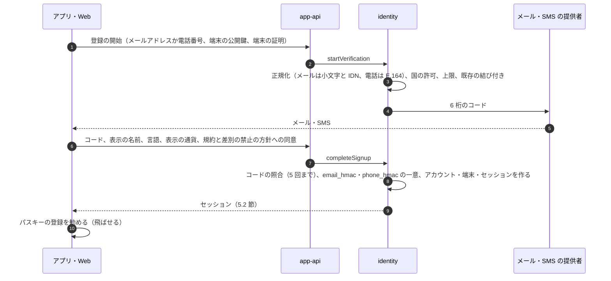
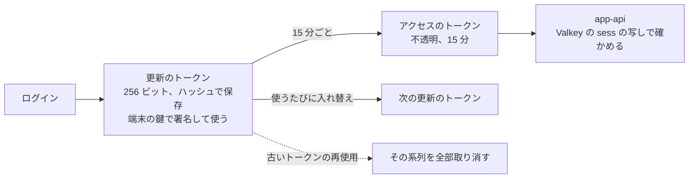
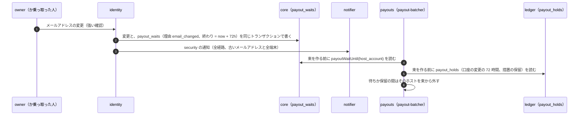
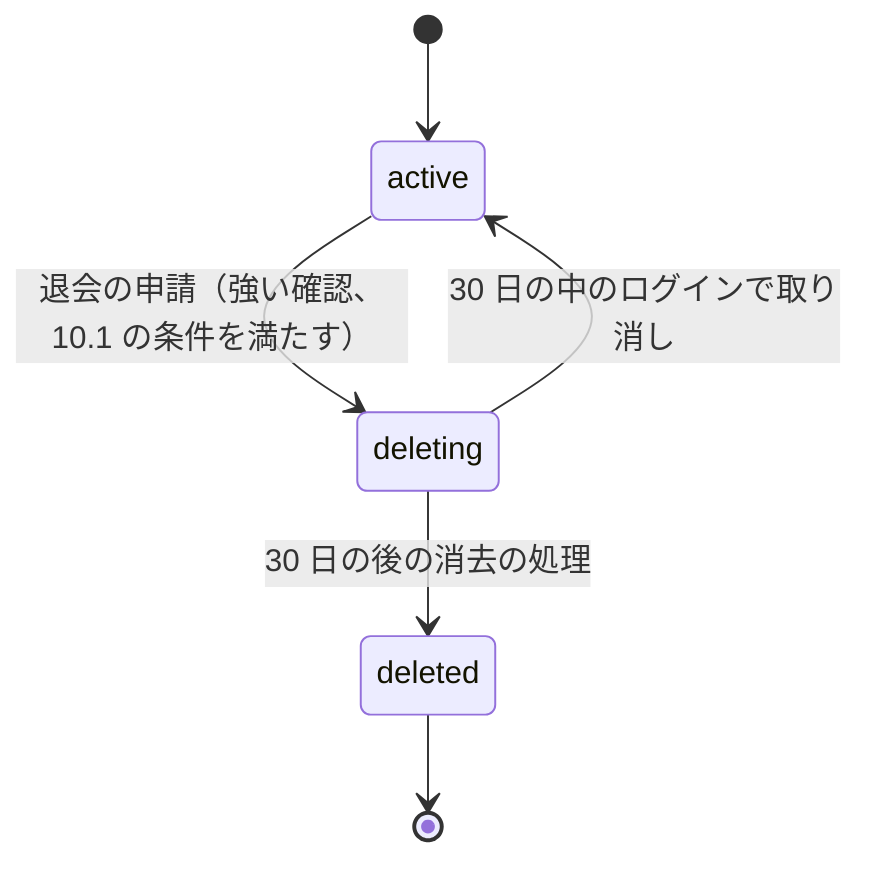

# Accounts: Airbnb

アカウントの登録、ログイン（パスキー、メールと SMS の一時コード、外部の ID の提供者）、セッション、端末、ゲストとホストのプロフィール、言語と通貨の設定、ホストのアカウントの作り方、送金の乗っ取りを狙う攻撃への守り（大事な操作の強い確認と、変更の後の送金の待ち）、予約の残る退会、アプリの形を決める。

前提となる決定は次のとおり。

- 本人の表は FORCE RLS と `SET LOCAL app.actor_id`。ホストの表はホストのアカウントと共同ホストの役割。送金の口座の変更、共同ホストの追加、届出住宅の登録は `owner` だけで、送金の口座の変更から 72 時間は送金を保留する（[ADR-0007](../decisions/0007-tenancy-host-accounts-and-rls.md)）
- 預かりは予約ごとに 1 回だけ決着し、ホストへの支払いはチェックインの予定の時刻 + 24 時間に振り替える（[ADR-0005](../decisions/0005-payments-hold-capture-and-ledger.md)）
- ML と規則の点は信号で、アカウントの停止は人の審査を通す（[ADR-0009](../decisions/0009-trust-and-safety-and-ml-boundary.md)）
- ログインはパスキーを勧め、メールの一時コードと外部の ID の提供者。パスワードは持たない（[architecture/README.md](README.md) の 6 節の決定）

この文書で決めたことは次の ADR にある。

| ADR | 決定 |
| --- | --- |
| [0071](../decisions/0071-sign-in-sessions-devices-and-profiles.md) | 登録はメールアドレスか電話番号か外部の ID の提供者（Apple、Google）で始め、予約の前に確認済みのメールアドレスと電話番号の両方を求める。ログインはパスキーを第一にし、メールか SMS の一時コード、外部の ID の提供者も受ける。パスワードとメールのログイン用のリンクは持たない。パスキーを登録したアカウントは、一時コードだけで新しい端末に入ると強さの低いセッション（`otp`）になり、大事な操作に強い確認を求める。アプリのセッションは端末の鍵で署名する入れ替えの更新のトークンと 15 分のアクセスのトークンで持ち、取り消しは 5 秒で効く。SMS は国ごとの許可の一覧と上限で送る。ゲストのプロフィールは、予約の確定の前のホストに名前と顔の写真を見せない（`legal.prebooking_guest_identity_display`、既定 `none`）。アプリは React Native、Web は React |
| [0072](../decisions/0072-sensitive-operations-payout-holds-and-account-deletion.md) | 送金の口座の登録と変更、メールアドレス・電話番号・パスキー・外部の ID の結び付きの変更、共同ホストと PMS の許可、届出住宅の登録を「大事な操作」とし、直近 10 分の強い確認（パスキー、なければメールと SMS の 2 つのコード）を求める。送金の口座の変更、メールアドレス・電話番号の変更、回復、最後のパスキーの削除から 72 時間は、そのホストのアカウントの送金の実行を待たせる（口座の変更は ledger の `payout_holds`、他は core の `payout_waits`。措置ではなく決まった待ち）。「これは私ではない」で `locked` にし、送金の口座を待ちの前の口座に戻す。退会は、進行中・未来の予約、チェックアウトから 14 日の中の予約、送金の残り、開いた損害の請求・T&S の案件があれば受け付けず、受け付けたら 30 日の `deleting` の後に仮名にする。名簿と台帳と予約の記録は残す（期間は法務の確認待ち：L3・L8） |

鍵と金庫と運用者のアクセスは [security.md](security.md)、本人確認は [identity-verification.md](identity-verification.md)、不正の規則は [trust-and-safety.md](trust-and-safety.md)、送金の実行は [ledger-and-payouts.md](ledger-and-payouts.md)、共同ホストの役割の表と PMS の同意は [host-tools-and-api.md](host-tools-and-api.md)、通知の経路は [messaging.md](messaging.md)、アプリのリリースは [delivery.md](delivery.md) にある。

## 1. 範囲

| 含む | 含まない（置き場所） |
| --- | --- |
| 登録、メールアドレスと電話番号の確認、外部の ID の提供者 | eKYC と確認の水準、旅券の読み取り（[identity-verification.md](identity-verification.md)） |
| ログイン、回復、セッション、端末 | 不正の規則のエンジンと審査（[trust-and-safety.md](trust-and-safety.md)） |
| 大事な操作の強い確認と、変更の後の送金の待ち | 送金の束と実行、不正の疑いの送金の保留（[ledger-and-payouts.md](ledger-and-payouts.md)） |
| ゲストとホストのプロフィール、言語と通貨と表示のタイムゾーンの設定 | 表示の通貨の換算（[ADR-0008](../decisions/0008-multi-currency-and-fx.md)、[pricing-and-fees.md](pricing-and-fees.md)） |
| ホストのアカウントの作り方（個人・事業者） | 共同ホストの役割の表、PMS（[host-tools-and-api.md](host-tools-and-api.md)） |
| 退会とデータの消し方の流れ | データの区分と保持の期間（[security.md](security.md) の 7 節） |
| アプリの形、端末の鍵、端末の証明 | アプリのリリースと最小のバージョン（[delivery.md](delivery.md) の 6 節） |

## 2. 要件

| 出どころ | 要件 | この文書の答え |
| --- | --- | --- |
| [intent.md](../intent.md) の MVP | メールアドレスと電話番号の確認、パスキー・メールと SMS の一時コード・外部の ID の提供者、セッション、端末、プロフィール、言語と通貨、退会 | 4〜6、8、10 節 |
| [intent.md](../intent.md) の MVP（ホストのアカウント） | 個人・事業者、送金の口座 | 9 節 |
| NFR-016 | 本人のデータ、送金の口座が他の利用者に出ない | 本人の FORCE RLS。口座は vault（[security.md](security.md)） |
| NFR-010 | 予約と決済 月間 99.95% | ログインの部品が落ちても、発行済みのセッションで予約できる（11 節） |
| [architecture/README.md](README.md) の 6 節 | 乗っ取り、送金の口座の書き換え | 7 節（ADR-0072） |
| [ADR-0007](../decisions/0007-tenancy-host-accounts-and-rls.md) | 送金の口座の変更から 72 時間の保留 | 7.3 節 |
| [quality.md](../quality.md) の 5 節 E2 | ログイン、セッションの取り消し、ホストのアカウントと役割。決定表と性質が緑 | 14 節 |
| 法務の L8 | 退会の後の保持 | 10 節。期間は法務の確認待ち |
| 法務の L11 | 予約の前にゲストの写真・氏名を見せない方針の範囲 | 8.1 節。既定は見せない |

## 3. 本家の形（確かめたこと）

| 項目 | 事実 | この設計 |
| --- | --- | --- |
| パスキー | 端末の指紋・顔・PIN で、パスワードや一時コードの代わりに使える。作った端末でログインに使う。送金の方法の追加などの操作の確かめにも使う。欧州経済領域のホストは 2 段階の認証を求められることがある（[ヘルプの記事 4094](https://www.airbnb.com/help/article/4094)、2026-10-10 に確認） | パスキーを第一にし、大事な操作の確かめに使う（5・7 節） |
| ログインの方法 | パスワード、Apple でのサインイン、2 段階の認証の記事がある（[ヘルプの記事 3530](https://www.airbnb.com/help/article/3530)、[2678](https://www.airbnb.com/help/article/2678)、[2842](https://www.airbnb.com/help/article/2842)。2026-10-10 に検索で見つけた。本文の細部は確かめていない：**未検証**） | パスワードを持たない（本家との違い） |
| 退会の条件、送金の口座の変更の後の待ち、乗っ取りの対策の中身 | 公式の資料で確かめられなかった（**未検証**） | 本システムの値 |

## 4. 登録と確認（ADR-0071）

### 4.1 流れ

- 外部の ID の提供者（Apple、Google の OpenID Connect）の登録は、提供者の確かめたメールアドレスを確認済みとして受ける。提供者の「メールを隠す」中継のアドレスもそのまま受ける。
- 差別の禁止の方針への同意は、登録の必須の段にする（[trust-and-safety.md](trust-and-safety.md)。方針の文は法務の確認待ち：L11）。同意の文のバージョンと時刻を記録する。

### 4.2 規則

| 項目 | 値 |
| --- | --- |
| コード | 6 桁、10 分で失効、照合 5 回で失効 |
| 送り直し | 60 秒の後。1 宛先 1 日 5 通、1 IP 1 時間 10 通、1 端末 1 日 10 通 |
| SMS の国 | 国ごとの許可の一覧（`ops.sms_allowed_countries`。S1 は日本と、主な海外のゲストの国の 20 前後）。一覧の外の番号は SMS を送らず、メールのコードで確かめる |
| SMS の国ごとの上限 | 1 国 1 時間の送信の上限（`ops.sms_country_hourly_cap`）。SMS の料金の詐取（同じ国の番号への大量の送信）を絞る |
| 1 つのメール・電話番号のアカウント | 有効なアカウント（`active`・`restricted`・`locked`）は 1 つ。`email_hmac`・`phone_hmac` に部分一意の索引 |
| 平文の持ち方 | `identity` の封筒の暗号化の列（`kms-contact-pii`。[security.md](security.md) の 5 節）。引くのは HMAC |
| 予約の前に求めるもの | 確認済みのメールアドレスと電話番号の両方（予約・安全の SMS と、確定の後のホストとの連絡の経路のため） |
| ホストになる前に求めるもの | 上に加えて、パスキーの登録（強く勧め、送金の口座の登録の前は必須）と、本人確認（[identity-verification.md](identity-verification.md)） |

- **番号の再利用**：携帯の番号は解約の後に別の人へ回る。すでに別のアカウント X に結び付いた番号を新しい人が確かめたとき、X がその番号で 365 日 SMS を受けておらず、X の最後のログインが 365 日より前なら、新しい登録を許し、X の番号を外す（X はパスキーかメールのコードで入り、新しい番号を足す）。それ以外は「この番号は使われています」と CS の窓口を出す（Mercari の題材の [accounts-and-devices.md](../../../mercari/docs/architecture/accounts-and-devices.md) の 4.2 節と同じ値）。
- SMS とメールの提供者は E2 の選定で決める。SMS は 2 社目を予備に持つ（`ops.sms_provider`）。

## 5. ログインとセッション（ADR-0071）

### 5.1 方式と強さ

| 方式 | 使えるとき | 得る強さ |
| --- | --- | --- |
| パスキー（WebAuthn、RP ID `<brand>.<domain>`、`userVerification = required`、見つけられる資格情報） | パスキーを登録したアカウント | `strong` |
| 外部の ID の提供者 | 結び付けたアカウント | `federated` |
| メールか SMS の一時コード | すべて | `otp` |
| メールと SMS の 2 つのコード | パスキーのないアカウントの大事な操作 | `otp2`（強い確認として扱う） |
| 回復（メールと SMS の 2 つのコード、パスキーの端末を失ったとき） | パスキーのあるアカウント | `recovery`（7.4 節の 72 時間の制限） |

- パスキーを登録したアカウントが、`otp`・`federated` で新しい端末に入ったときは、セッションの強さが `otp`・`federated` のままになり、大事な操作（7.2 節）でパスキーか回復を求める。送金の乗っ取りの多くは、一時コードの詐取から始まるため。
- パスキーは 1 アカウント 10 まで。最後の 1 つを消すには、別のパスキーを足すか、回復を通す（消すと 72 時間の送金の待ち）。
- 外部の ID の提供者の結び付けは 1 アカウントに提供者ごと 1 つ。外すには、パスキーか確認済みのメールアドレスが残ることを求める。
- パスワードは持たない。メールのログイン用のリンクも持たない（メールのリンクの詐取を避け、端末の自動の入力が効くコードに揃える）。

### 5.2 アプリのセッション

- 端末は登録の時に取り出せない P-256 の鍵（iOS の Secure Enclave、Android の Keystore）を作り、公開鍵を `devices` に置く。更新の要求は、サーバーの nonce と時刻を端末の鍵で署名する。
- 更新のトークンは使うたびに入れ替える。古いトークンが 2 秒の外で再び使われたら、その系列を全部取り消し、`security` の通知を送る。2 秒の中の同じトークンの要求は同じ応答を返す（重なった要求を盗難とみなさない）。
- 期限：使わない 90 日で失効、ログインから 1 年で再ログイン。ホストのアカウントの `owner` のセッションは、使わない 30 日で失効（送金の口座を持つため、短くする）。
- アクセスのトークンは不透明な 15 分の値。`app-api` は Valkey の `sess:{token_hash}` で、利用者、端末、強さ、ログインの時刻、ホストのアカウントの成員の一覧を引く。写しがなければ core の読み出しの写しで引く。
- 取り消し（ログアウト、端末の取り消し、`locked`、再使用の検出、成員を外す）は `sessions` を書き、同じ処理で Valkey の写しを消す。5 秒以内に効く。

### 5.3 Web のセッション

- `__Host-session` の Cookie（`HttpOnly`、`Secure`、`SameSite=Lax`）。使わない 14 日、ログインから 30 日で失効。
- 状態を変える要求は、CSRF のトークンの見出しを求める。Web のパスキーは、その端末の資格情報か、登録した電話で QR を読む方式（WebAuthn の他の端末の認証）。

### 5.4 セッションの一覧

- 利用者は、端末ごとのセッション（端末の名前、OS、アプリのバージョン、最後の利用、おおよその国と地域）を見て、1 つずつか「この端末の他をすべて」取り消せる。IP そのものは出さない。

## 6. 端末（ADR-0071）

| 欄 | 内容 |
| --- | --- |
| `device_id` | サーバーが出す UUIDv7。端末の Keychain・Keystore に置く。機械の固有の ID を使わない |
| `platform`、`os_version`、`app_version`、`model_class` | 表示と最小のバージョンの判定（[delivery.md](delivery.md) の 6 節） |
| `device_pubkey` | 更新のトークンの署名の検証 |
| `attestation` | App Attest・Play Integrity の結果の要約。信号だけで、通さない理由にしない |
| `push_token`、`push_permission`、`locale` | プッシュと通知の言語 |
| `first_seen_at`、`last_seen_at`、`revoked_at` | 一覧と整理 |

- 1 人 20 台まで。21 台目で、最後の利用の古い端末を取り消す。180 日使わない端末はプッシュのトークンを消し、1 年で取り消す。
- 端末の事象（`device.registered`・`device.revoked`）を outbox に書く。T&S の兆し（[trust-and-safety.md](trust-and-safety.md)）が受ける。

## 7. 送金の乗っ取りへの守り（ADR-0072）

### 7.1 狙われるもの

乗っ取りの価値は、ホストの `host_payable` を自分の口座へ送らせることにある。チェックインの後に振り替わるお金は、繁忙期の後に大きく溜まる。入口は、一時コードの詐取（偽のメッセージ・偽のサイト）、SIM の乗っ取り、番号の再利用、外部の ID の提供者のアカウントの乗っ取り、共同ホストの乗っ取り、盗んだ端末。ゲストのアカウントの乗っ取りは、保存したカードでの不正な予約と、予約の住所・入り方の閲覧に使われる。

### 7.2 大事な操作（DT-ACC-001 の草案）

上から順に評価し、最初に一致した行を使う。「強い確認」は、パスキーがあればパスキー、なければメールと SMS の 2 つのコード（`otp2`）。直近 10 分の中のものを使える。

| # | 操作 | 条件 | 求めること | 待ち |
| --- | --- | --- | --- | --- |
| 1 | どれでも | アカウントが `locked`・`suspended`・`deleting` | 拒む（403） | — |
| 2 | 送金の口座の登録・変更 | `owner` | 強い確認。パスキーのない `owner` はここでパスキーの登録を求める | 72 時間の送金の待ち |
| 3 | メールアドレスの変更 | — | 強い確認＋新しいアドレスのコード。古いアドレスへ知らせる | 72 時間の送金の待ち（ホストのアカウントの `owner` のとき） |
| 4 | 電話番号の変更 | — | 強い確認＋新しい番号のコード | 同上 |
| 5 | パスキーの追加 | — | `strong`（最初の 1 つは `otp` から足してよい） | なし |
| 6 | パスキーの削除 | 最後の 1 つ | 回復と同じ確認 | 72 時間の送金の待ち |
| 7 | 外部の ID の提供者の結び付け・外す | — | 強い確認 | なし（知らせる） |
| 8 | 共同ホストの招待・役割の変更、PMS の許可、届出住宅の登録、住所の変更 | `owner` | 強い確認 | なし（`owner` に全経路で知らせる） |
| 9 | 即時予約・リクエスト | 新しい端末の最初の 24 時間、かつ保存したカード | 3-D セキュアか強い確認（T&S の規則が上書きしうる） | なし |
| 10 | 確定した予約の住所・入り方の閲覧 | 新しい端末の最初の 24 時間の `otp` のセッション | 強い確認 | なし |
| 11 | それ以外 | — | セッションだけ | なし |

- 判定は `packages/identity` の `requireStepUp(session, action)` の 1 つの関数で行う。決定表は spec に置き、表駆動テストで全行を確かめる。

### 7.3 送金の待ち

- **送金の口座の変更**の 72 時間は、口座を持つ `payouts` が ledger の `payout_holds`（理由 `payout_account_changed`）で持つ（[ledger-and-payouts.md](ledger-and-payouts.md) の 7.1・7.3 節、[ADR-0007](../decisions/0007-tenancy-host-accounts-and-rls.md)）。
- **それ以外の変更**（メールアドレス・電話番号の変更、回復、最後のパスキーの削除）の 72 時間は、`identity` が core の `payout_waits` に、変更と同じトランザクションで書く。`payouts` の `payout-batcher` は束を作る前に `identity.payoutWaitUntil(host_account)` を読み、待ちのホストを外す。重なったら、最も遅い終わりを使う。
- どちらも、本人の操作に結び付く決まった待ちで、規則のエンジンや ML の判定による措置の保留（[ADR-0009](../decisions/0009-trust-and-safety-and-ml-boundary.md) の人の審査を要るもの）ではない。`payout_waits` は仕訳を動かさない（release は `host_payable` に溜まり、待ちの後の束で送る）。
- 待ちの間も、release（`guest_funds_held` → `host_payable`）は時刻どおりに行う（NFR-008 は release の時刻の目標で、送金の実行は束の規則）。
- 新しい口座への最初の送金は、口座の名義とホストの本人確認の名前の照合（銀行の API で確かめられるか**未検証**。[ledger-and-payouts.md](ledger-and-payouts.md)）を通す。
- 本家の待ちの値は確かめられなかった（**未検証**）。72 時間は [ADR-0007](../decisions/0007-tenancy-host-accounts-and-rls.md) の値。

### 7.4 回復と「これは私ではない」

- **回復**（パスキーの端末を失った）：メールと SMS の 2 つのコードで `recovery` のセッションを得て、新しいパスキーを登録できる。72 時間は、送金の口座・メール・電話番号の変更ができず、送金を待つ。他の端末のセッションに「回復が始まりました」を出し、72 時間の間に「これは私ではない」で取り消せる。メールか電話番号を失った利用者は、CS の窓口と本人確認（[identity-verification.md](identity-verification.md)）を通す。
- **「これは私ではない」**（`security` の通知とセッションの一覧から押せる）：アカウントを `locked` にし、全セッションを取り消し、ホストのアカウントの送金を止め、送金の口座を待ちの前の口座に戻す（待ちの間に限る。待ちの後の変更は CS の案件）。進行中と未来の予約は続ける（ゲストを守るため。メッセージとチェックインの案内は共同ホストか CS が代わりに進める）。
- `locked` を解くのは、パスキーと CS の確認か、本人確認（eKYC）と CS の確認。

### 7.5 危険の兆し

| 兆し | 使い方 |
| --- | --- |
| 新しい端末、端末の証明の失敗 | 7.2 節の「新しい端末」。T&S の兆しへ |
| IP の種類（データセンター、匿名の中継）、普段と違う国 | `otp` のログインに 2 つ目のコードを求める |
| コードの要求の多さ（宛先、IP、端末、国） | 4.2 節の上限。超えたら WAF の規則とチャレンジ |
| 変更の直後の送金の口座の変更、回復の直後の口座の変更 | 72 時間の待ち（7.3 節） |
| 同じ口座が多くのホストのアカウントに登録される | T&S の兆し（口座の HMAC で数える） |

- 兆しは `fraud_signals` として T&S に渡す。錠（`locked`）は、本人の操作か T&S の人の判定でだけかける。危険の点だけでかけない（[ADR-0009](../decisions/0009-trust-and-safety-and-ml-boundary.md)）。

## 8. プロフィールと設定（ADR-0071）

### 8.1 ゲストのプロフィール

| 欄 | 誰に見えるか |
| --- | --- |
| 表示の名前（名だけ）、顔の写真 | 確定した予約のホストのアカウント。予約の前（問い合わせ、リクエスト）のホストには `legal.prebooking_guest_identity_display`（`none`・`first_name`・`first_name_and_photo`。既定 `none`）に従う。**法務の確認待ち：L11** |
| 本人確認の印、登録の年、レビューの数と点、話す言語（本人が選ぶ） | 予約の前のホストにも見える |
| 自己紹介 | 同上（連絡先の絞り込みを通す。[messaging.md](messaging.md)） |
| メールアドレス、電話番号、生年月日、住所 | 本人だけ。ホストには出さない（連絡はメッセージで） |

- 予約の前に名前と顔の写真を見せないのは、[ADR-0009](../decisions/0009-trust-and-safety-and-ml-boundary.md) の「確定の前に顔の写真を見せない」を名前にも広げた既定である。本家の振る舞いは確かめられなかった（**未検証**）。

### 8.2 ホストの公開のプロフィール

- 表示の名前、写真、自己紹介、話す言語、応答の率と時間、レビューの集計、登録の年、本人確認の印、ホストしているリスティングの一覧。
- 事業者のホストの表示の項目（名称、所在地など）は [host-tools-and-api.md](host-tools-and-api.md) の 4.4 節（法務の確認待ち：L7・L14）。

### 8.3 設定

| 設定 | 値 |
| --- | --- |
| 言語 | `ja`、`en`、`zh-Hans`、`zh-Hant`、`ko` と、翻訳の提供者が対応する言語。通知と画面に使う |
| 表示の通貨 | 主な 10 通貨（[ADR-0008](../decisions/0008-multi-currency-and-fx.md)） |
| 表示のタイムゾーン | 端末から。泊の日付と締め切りは物件の現地で表示し、端末のタイムゾーンでは変えない（[ADR-0002](../decisions/0002-availability-representation-and-double-booking.md)） |
| 通知の設定 | 種類と経路ごと（[messaging.md](messaging.md)）。予約と安全の通知は止められない |

## 9. ホストのアカウント

- 利用者は「ホストを始める」で、`host_accounts`（`kind = individual | business`、通貨は MVP で円）を作り、自分を `owner` にする（[ADR-0007](../decisions/0007-tenancy-host-accounts-and-rls.md)）。1 人が `owner` になれるホストのアカウントは 1 つ（MVP。運用の判断で増やせる）。共同ホストとして他のホストのアカウントに入るのは何個でもよい。
- リスティングの公開の前に、ホストの本人確認（[identity-verification.md](identity-verification.md)）と、送金の口座の登録の前のパスキー（4.2 節）を求める。
- `owner` の移し替え（事業の売り渡しなど）は MVP に持たない。CS の手順で、新しいホストのアカウントを作り、リスティングを移す（届出住宅の扱いは [regulatory-compliance-japan.md](regulatory-compliance-japan.md)）。

## 10. 退会（ADR-0072）

### 10.1 受け付けの条件

次のどれかがあれば退会を受け付けず、理由と次の手順を出す。

| 条件 | 理由 |
| --- | --- |
| ゲストとして `requested`・`pending_payment`・`confirmed`・`in_stay` の予約 | ゲストが自分でキャンセルする（ポリシーで返金）か、終わるのを待つ |
| ゲストとしてチェックアウトから 14 日の中の予約 | レビューと損害の請求の窓（[reviews.md](reviews.md)、[deposits-and-claims.md](deposits-and-claims.md)） |
| ホストのアカウントの `owner` で、未来・進行中の予約 | ゲストを残さない。ホストのキャンセル（罰を含む。[cancellations-and-changes.md](cancellations-and-changes.md)）か、終わるのを待つ |
| ホストのアカウントの `host_payable`・`host_payable_hold` が 0 円でない、送金の途中 | お金の行き先 |
| 開いた損害の請求、チャージバック、T&S の案件、`suspended`・`locked` | 回収の相手、措置の逃れ |
| ホストのアカウントの他の成員（共同ホスト）がいる | 先に外す（`owner` の移し替えを持たないため） |

- 共同ホストとしての成員の資格は、退会の流れで外す。
- 公開中のリスティングは、退会の流れの中でまとめて非公開にする。

### 10.2 流れ

- `deleting`：全セッションを取り消し、プロフィールとリスティングを非公開にし、通知を止め、PMS の同意を取り消す。30 日の間はログインで取り消せる。
- `deleted` への処理（`account-eraser`。冪等で、段ごとに記録する）：
  1. 公開のプロフィールを消し、名前を「退会した利用者」にする。
  2. リスティングを検索から外し、写真は保持の規則で消す（[listings-and-content.md](listings-and-content.md)）。正確な住所と位置の金庫の鍵を破棄する（[security.md](security.md) の 5.3 節）。
  3. メールアドレス・電話番号の平文を消し、HMAC は再登録の制限と不正の照合のために残す（期間は法務の確認待ち：L8）。
  4. 端末、設定、保存した検索、通知を消す。送金の口座の鍵を破棄する。
  5. **残すもの**：台帳の仕訳、予約の記録、措置の記録、監査ログ（会計と法令の保持。期間は法務の確認待ち：L8）。宿泊者名簿は、名簿を作る義務者（ホスト）の記録として、ゲストが退会しても法令の期間まで残す（住宅宿泊事業者は作成日から 3 年保存。観光庁の [住宅宿泊事業者の義務](https://www.mlit.go.jp/kankocho/minpaku/business/host/index.html)、2026-10-10 に [intent.md](../intent.md) で確認。本システムが代わりに持つことの整理は**法務の確認待ち：L3**）。
  6. 予約の相手から見たメッセージとレビューは、相手のデータとして保持の期間まで残し、名前を「退会した利用者」にする。
- 本人確認の書類と結果は [identity-verification.md](identity-verification.md) の保持の規則（法務の確認待ち：L3・L8）。
- 再登録：退会が終わったメールアドレスと番号は再び登録できる。T&S の措置で `suspended` のまま退会したアカウントのものは、HMAC で登録を拒む（期間は法務の確認待ち：L8）。

## 11. 失敗と回復

| 事象 | 影響 | 扱い |
| --- | --- | --- |
| SMS の提供者の障害 | SMS のコードが届かない | 2 社目へ（`ops.sms_provider`）。メールのコードとパスキーは影響なし |
| メールの提供者の障害 | メールのコードが届かない | SMS のコードとパスキーで入れる。大事な操作の `otp2` はできない（パスキーを勧める理由の 1 つ） |
| 外部の ID の提供者の障害 | その方式のログインができない | 他の方式。結び付けた方式だけのアカウントは、確認済みのメールのコードで入れる |
| `identity` の障害 | 新しいログインと更新ができない | アクセスのトークンは Valkey の写しで 15 分は使える。アプリは後退して再試行 |
| Valkey の障害 | セッションの写しがない | core の読み出しの写しで引く（遅れる） |
| 乗っ取りの波 | 多くの送金の口座の変更 | 72 時間の待ちが効く。`account-takeover.md` の手順（E2 で作る）で、必要なら `ops.payouts_enabled` で送金を止める |
| 消去の処理の途中の失敗 | 一部だけ消えた | 段ごとの記録から再開する。`deleted` は全段の後に付ける |

## 12. 上限

| 対象 | 値 | 持ち場所 |
| --- | --- | --- |
| コード | 6 桁、10 分、照合 5 回 | ADR-0071 |
| コードの送信 | 1 宛先 1 日 5 通、1 IP 1 時間 10 通、1 端末 1 日 10 通、国ごとの 1 時間の上限 | ADR-0071 |
| パスキー、端末 | 10、20 | ADR-0071 |
| アプリのセッション | 使わない 90 日（`owner` は 30 日）、最長 1 年 | ADR-0071 |
| Web のセッション | 使わない 14 日、最長 30 日 | ADR-0071 |
| アクセスのトークン、取り消しの効き | 15 分、5 秒 | ADR-0071 |
| 強い確認の有効な間 | 10 分 | ADR-0072 |
| 送金の待ち | 72 時間 | ADR-0072、[ADR-0007](../decisions/0007-tenancy-host-accounts-and-rls.md) |
| 退会の取り消しの期間、予約の後の窓 | 30 日、チェックアウトから 14 日 | ADR-0072 |

**本家との意図した違い**（[architecture/README.md](README.md) の 1.4 節に足す）：パスワードを持たない。予約の前のホストにゲストの名前と顔の写真を見せない（既定）。全部の権限の共同ホストは送金・成員に触れない（[host-tools-and-api.md](host-tools-and-api.md)）。

## 13. data-model への項目

| 置き場所 | 中身 | 鍵・索引 | 節 |
| --- | --- | --- | --- |
| core：`users` | `id`、`status`（`active`・`restricted`・`locked`・`suspended`・`deleting`・`deleted`）、`email_hmac`、`email_ct`、`email_verified_at`、`phone_hmac`、`phone_ct`、`phone_verified_at`、`display_first_name`、`locale`、`display_currency`、`policy_consent_version`・`policy_consented_at`、`deleting_until`。本人の FORCE RLS | `email_hmac`・`phone_hmac` の部分一意（有効な状態） | 4、10 |
| core：`guest_profiles` | 写真の鍵、自己紹介、話す言語。本人の FORCE RLS。ホストへの公開は関数を通す | `user_id` | 8.1 |
| core：`host_profiles` | 公開のプロフィール（RLS の外の公開の列はビューで出す） | `host_account_id` | 8.2 |
| core：`passkeys` | 資格情報の ID、公開鍵、署名の数、AAGUID、作成・最後の利用 | `(user_id)`、資格情報の ID の一意 | 5.1 |
| core：`federated_identities` | 提供者、`sub` の HMAC、結び付けの時刻 | `(provider, sub_hmac)` の一意 | 5.1 |
| core：`sessions`、`refresh_tokens` | 系列の ID、アクセスのトークンのハッシュ、`device_id`、強さ、ログインの時刻、最後の利用、取り消し | `access_token_hash` の一意、`refresh_tokens.token_hash` の一意 | 5.2 |
| core：`devices` | 6 節の欄 | `(user_id, last_seen_at)` | 6 |
| core：`verifications` | 宛先の HMAC、種類（メール・SMS）、国、コードのハッシュ、試行の数、期限。24 時間で消す | `(target_hmac, created_at)` | 4.2 |
| core：`step_ups` | 強い確認の記録（方式、時刻、操作）。90 日 | `(session_id, created_at)` | 7.2 |
| core：`payout_waits` | `host_account_id`、理由（`email_changed`・`phone_changed`・`recovery`・`last_passkey_removed`）、始まり、終わり、元の操作の ID。口座の変更の待ちは ledger の `payout_holds`（[ledger-and-payouts.md](ledger-and-payouts.md) が持つ） | `(host_account_id, ends_at)` | 7.3 |
| core：`account_erasure_jobs` | 退会の消去の段と結果 | `user_id` | 10.2 |
| vault：`payout_accounts`（[ledger-and-payouts.md](ledger-and-payouts.md) が持つ） | 変更の履歴（前の口座の ID）を持つ。「これは私ではない」で戻すため | — | 7.4 |
| Valkey | `sess:{token_hash}`（15 分）、コードの送信の数え（宛先、IP、端末、国） | — | 5.2、4.2 |
| outbox の事象 | `account.*`、`device.*`、`session.revoked`、`payout_wait.started`、`account.locked` | — | 6、7 |
| AppConfig | `ops.sms_provider`、`ops.sms_allowed_countries`、`ops.sms_country_hourly_cap`、`legal.prebooking_guest_identity_display` | — | 4.2、8.1 |

## 14. テストと性質

| ID（草案） | 内容 | テスト |
| --- | --- | --- |
| DT-ACC-001 | 7.2 節の表の全行 | 表駆動 |
| PROP-ACC-001 | 任意の登録・変更・退会・再利用の列で、1 つの `email_hmac`・`phone_hmac` に有効なアカウントは 0 か 1 | 性質ベース（並行） |
| PROP-ACC-002 | 取り消したセッション・端末・外した成員のトークンは、取り消しの 5 秒後から、どの API でも 401 か、ホストの権限なし | 性質ベース（取り消しと要求の並行） |
| PROP-ACC-003 | 更新のトークンの系列で、古いトークンの再使用（2 秒の外）の後、系列のどのトークンも使えない | 性質ベース |
| PROP-ACC-004 | 任意の操作の列と時刻で、`payout_waits` と口座の変更の `payout_holds` の終わりの前に、そのホストのアカウントの送金が実行されない。release は時刻どおり | 性質ベース（`payouts` と結合、仮想の時計） |
| PROP-ACC-005 | 10.1 節の条件のどれかを満たすアカウントは `deleting` にならない。`deleted` のアカウントのメール・電話番号の平文と金庫の鍵が残らない。名簿の行は残る | 性質ベースと消去の後の走査 |
| PROP-ACC-006 | パスキーのあるアカウントの `otp`・`federated` のセッションは、7.2 節の 2〜4・6・8 の操作を強い確認なしに行えない | 性質ベース |
| — | 端末の鍵の署名のない更新の要求、別の端末の鍵の署名は 401 | 結合 |
| — | SMS の国の許可と国ごとの上限 | 表駆動 |
| — | 漏れの経路：予約の前のホストの画面と API に、ゲストの名前・顔の写真・連絡先が出ない（既定 `none`）（[quality.md](../quality.md) の 2.2.1 節 H） | E2E |

## 15. Story の候補

| Epic | Story | 中身 |
| --- | --- | --- |
| E2 | `sign-in-and-sessions` | 4・5 節（ADR-0071）。パスキー、コード、外部の ID の提供者 |
| E2 | `sms-and-email-provider-selection` | 4.2 節。SMS の 2 社目、国の許可の一覧 |
| E2 | `devices-and-preferences` | 6・8.3 節 |
| E2 | `guest-and-host-profiles` | 8.1・8.2 節。`legal.prebooking_guest_identity_display` は法務：L11 |
| E2 | `host-accounts-and-cohosts`（[host-tools-and-api.md](host-tools-and-api.md) と共同） | 9 節 |
| E2 | `account-takeover-signals` | 7 節（ADR-0072）。DT-ACC-001、`payout_waits` |
| E2 | `account-deletion` | 10 節（ADR-0072）。法務：L3・L8 |
| E12 | `release-after-check-in`・`payout-accounts-and-execution`（[ledger-and-payouts.md](ledger-and-payouts.md) と共同） | `payoutWaitUntil()` の読み出し |

## 16. 未解決の問い

### 決定（2026-10-10、既定案）

- **ログイン**：パスキーが第一、メールと SMS のコード、Apple と Google。パスワードとメールのリンクなし（ADR-0071）。
- **予約の前の確認**：確認済みのメールと電話番号の両方（ADR-0071）。
- **SMS**：国の許可の一覧と国ごとの上限。一覧の外はメールで確かめる（ADR-0071）。
- **セッション**：端末の鍵の入れ替えの更新のトークン、15 分、取り消し 5 秒。`owner` は使わない 30 日（ADR-0071）。
- **大事な操作**：DT-ACC-001、強い確認 10 分、変更の後の 72 時間の送金の待ち（仕訳は動かさない）（ADR-0072）。
- **退会**：予約・お金・案件が残れば受け付けない。30 日の `deleting`。名簿・台帳・予約の記録は残す（ADR-0072）。

### 持ち越し

| 問い | いつ・どう決めるか |
| --- | --- |
| 予約の前にホストへ見せるゲストの名前と写真 | **法務の確認待ち：L11** |
| 退会の後の保持の期間、HMAC を残す期間 | **法務の確認待ち：L8** |
| ゲストが退会した後の名簿の扱い、本システムが名簿を持つことの整理 | **法務の確認待ち：L3** |
| 口座の名義の照合の API | E12 の提携銀行の選定（**未検証**） |
| SMS の国の許可の一覧と料金 | E2 の `sms-and-email-provider-selection`（**未検証**） |
| 本家のログインの方法、退会の条件、送金の待ちの値 | **未検証**。確かめられなければ本システムの値のまま |

## 出典

いずれも 2026-10-10 に確認。

- Airbnb, [ヘルプの記事 4094（How passkeys work）](https://www.airbnb.com/help/article/4094)：パスキーは指紋・顔・PIN で使い、パスワードや一時コードの代わりになる。送金の方法の追加などの操作の確かめにも使う
- Airbnb, [ヘルプの記事 3530（Log in to your Airbnb account）](https://www.airbnb.com/help/article/3530)、[2678（Sign in with Apple）](https://www.airbnb.com/help/article/2678)、[2842（two-factor authentication）](https://www.airbnb.com/help/article/2842)：記事の存在を検索で確かめた。本文の細部は**未検証**
- 観光庁, [住宅宿泊事業者の義務](https://www.mlit.go.jp/kankocho/minpaku/business/host/index.html)：宿泊者名簿は作成日から 3 年保存する（[intent.md](../intent.md) の出典と同じ）
- W3C, [Web Authentication Level 3](https://www.w3.org/TR/webauthn-3/)
- OpenID Foundation, [OpenID Connect Core 1.0](https://openid.net/specs/openid-connect-core-1_0.html)
