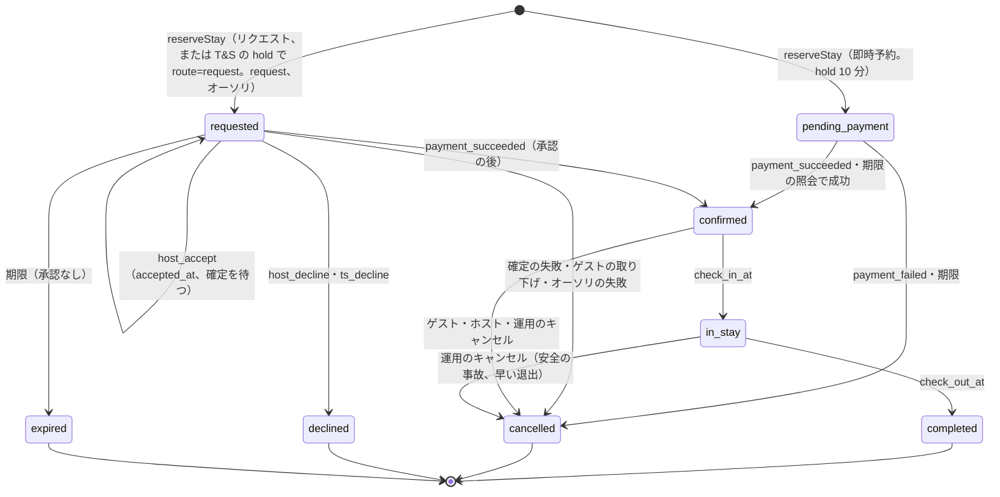
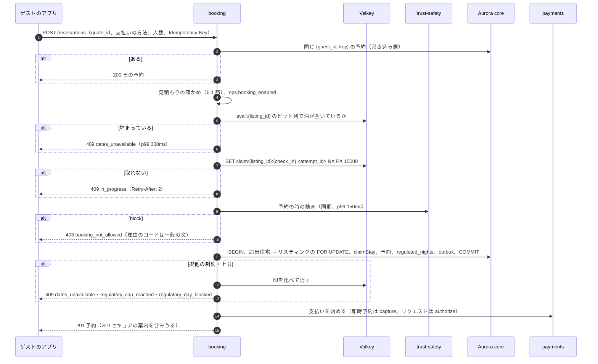

# Booking and Holds: Airbnb

予約を決める。見積もりの固定と 1 回の使用、冪等、`reserveStay` の手順、予約の時の T&S の判定の結果の扱い、予約の状態と遷移の決定表 DT-BKG-001、仮押さえ（10 分）とリクエスト（24 時間）の期限、`deadline-runner`、熱い日付の受け入れ、仮押さえの乱用の上限、予約のリクエストの承認と断り、確認の画面の枠、チェックインの案内を出す時期、予約と `stay_claims` の照合を扱う。

前提となる決定は次のとおり。

- 作成は `reserveStay` の 1 つの関数と core の 1 つのトランザクション（見積もり、滞在の規則、排他の制約、180 日の数え）。仮押さえは 10 分、リクエストは 24 時間の期限つきの `stay_claims`。冪等キーと見積もりの一意で予約を 1 回に限る（[ADR-0004](../decisions/0004-booking-state-machine-and-holds.md)）
- 空室は `stay_claims` と排他の制約、規則は `checkStayRules`（[ADR-0002](../decisions/0002-availability-representation-and-double-booking.md)。[availability-and-calendars.md](availability-and-calendars.md)）
- 即時予約は確定の時に売上を確定し、リクエストはオーソリを取って承認で確定する（[ADR-0005](../decisions/0005-payments-hold-capture-and-ledger.md)。[payments-and-fx.md](payments-and-fx.md)）
- 見積もりは `quoteStay` が作り、相場の写しを固定する（[ADR-0008](../decisions/0008-multi-currency-and-fx.md)。pricing-and-fees の領域）
- 予約の表はゲストとホストのアカウントの 2 者の RLS（[ADR-0007](../decisions/0007-tenancy-host-accounts-and-rls.md)）

この文書で決めたことは次の ADR にある。

| ADR | 決定 |
| --- | --- |
| [0035](../decisions/0035-booking-decision-table-and-deadlines.md) | DT-BKG-001 を 35 行で確定する（T&S の `hold` の 4 行を含む）。リクエストの承認は `accepted_at` を書いて売上の確定を待つ段を持ち、確定の結果で `confirmed` か `cancelled` にする。期限は 8 つの列と `next_deadline_at` で持ち、照会の結果が不明なら 2 分ずつ 3 回まで延ばす。運用の保留は送金の振り替えだけを止める |
| [0036](../decisions/0036-hot-date-admission-and-hold-limits.md) | 熱い日付は、Valkey の空室の写しの確かめ → 先着の印 `claim:{listing_id}:{check_in}` → DB の順に絞る。印は予約の取り消しで比べて消す。Valkey がないときはリスティングごと・タスクごとの同時実行 4 と `lock_timeout` 200ms。1 人の有効な仮押さえは 2、リクエストは 5、同じリスティングで支払いの失敗が 24 時間に 3 回なら 24 時間そのリスティングを予約させない |
| [0037](../decisions/0037-quote-binding-and-idempotency.md) | 見積もりは 15 分、1 回だけ、見積もりを作ったゲストだけが使える。料金の上書きの変化では見積もりを無効にせず、リスティング・規則・ポリシーのバージョンの変化で無効にする。`Idempotency-Key` は `(guest_id, key)` で一意、要求の本文のハッシュが違えば 422 |
| [0038](../decisions/0038-booking-requests-and-arrival-info-release.md) | リクエストの期限は「作成から 24 時間」と「チェックインの時刻の 2 時間前」の早いほう。断りは決まった理由のコードで受け、保護される属性に関わる理由を選べない。正確な住所は確定の時、入り方（暗証番号など）はチェックインの 48 時間前から出す。届出住宅は宿泊者名簿の入力の後に入り方を出す（法務の確認待ち：L3） |

## 1. 範囲

- 扱う：
  - 見積もりの固定（`quote_id`）と 1 回の使用、`Idempotency-Key`
  - `reserveStay`（即時予約、リクエスト）の手順とロックの順
  - 予約の状態、事象、遷移の関数 `transition`、決定表 DT-BKG-001
  - 期限の列、`next_deadline_at`、`deadline-runner`、照会の不明のときの延長
  - 熱い日付の受け入れ（写し、先着の印、同時実行の上限）と仮押さえの乱用の上限
  - 予約の時の T&S の判定の結果（`allow`・`step_up`・`review`・`hold`・`block`）の扱いと、`hold` のリクエストへの回し（[ADR-0057](../decisions/0057-ts-decision-points-and-outcomes.md)）
  - 予約のリクエストの承認と断り（法務の確認待ち：L2・L11）
  - 確認の画面の枠（法務の確認待ち：L7）
  - チェックインの案内（正確な住所、入り方）を出す時期
  - 予約と `stay_claims` の照合
- 扱わない：
  - `stay_claims` の制約と規則の判定（[availability-and-calendars.md](availability-and-calendars.md)）
  - キャンセルの精算と日程の変更の中身（[cancellations-and-changes.md](cancellations-and-changes.md)）。ここは遷移の行だけを決める
  - 提供者の呼び出しと結果（[payments-and-fx.md](payments-and-fx.md)）
  - 見積もりの額の計算（pricing-and-fees、taxes の各領域）
  - 180 日の数えの中身（[regulatory-compliance-japan.md](regulatory-compliance-japan.md)）
  - 不正の点・パーティーの危険の規則（[trust-and-safety.md](trust-and-safety.md)）。ここは `reserveStay` が呼ぶ入口と、結果ごとの予約の振る舞いを決める
  - レビューの組の作成（reviews の領域）

## 2. 要件

| 要件 | 目標 | NFR |
| --- | --- | --- |
| 二重の予約なし | 1 つのリスティングの同じ夜に有効な予約・仮押さえ・リクエストは 1 つ。Valkey の停止、DB のフェイルオーバーでも | NFR-005、K1 |
| 1 回の予約 | 同じ冪等キー・同じ見積もりから予約は 1 つ | intent の「守るべき振る舞い」 |
| 見せた額で請求 | 請求の額（通貨を含む）= 見積もりの総額 | NFR-015、K5 |
| 予約の速さ | 即時予約の `reserveStay` の確定 p99 1.5 秒（提供者の時間を除く）。熱い日付で負けた要求への応答 p99 300ms（Valkey の停止の間は 1 秒） | NFR-004、K4 |
| 期限 | 期限の時刻から遷移まで p99 1 分。期限より前に働かない | NFR-014 |
| 送金の時刻 | `payout_release_at` の期限から release の依頼まで p99 5 分 | NFR-008 |
| 可用性 | 予約と決済 月間 99.95% | NFR-010、K11 |
| 住所の秘匿 | 正確な住所・入り方が、確定した予約のゲスト・ホスト・権限のある運用者の外に出ない | NFR-016 |

## 3. 本家の形（確かめたこと）

- 本家は即時予約と予約のリクエストを持つ。リクエストへのホストの応答は 24 時間で、過ぎると期限切れになる（[Reservation requests](https://www.airbnb.com/help/topic/1340)、2026-10-10 に確認。[intent.md](../intent.md) の出典）。
- 番地と部屋の番号は確定した予約のゲストにだけ出す（[ヘルプの記事 2141](https://www.airbnb.com/help/article/2141)、同）。正確な住所を出す時期は資料の間で食い違う（**未検証**）。
- リクエストの間に同じ日付を他のゲストが予約できるか、支払いの間の仮押さえの長さ、熱い日付の受け入れの方式、断りの理由の扱いは、公式の資料で確かめられなかった（**未検証**）。本システムの値を使う。

## 4. 状態と事象

### 4.1 状態



- [ADR-0004](../decisions/0004-booking-state-machine-and-holds.md) の図に、承認の後に売上の確定を待つ段（`requested` のまま `accepted_at` を書く）を足した（[ADR-0035](../decisions/0035-booking-decision-table-and-deadlines.md)）。状態は増やさない。
- `completed` は、送金の振り替えの期限（1 泊の滞在ではチェックアウトの後に来る）と運用の事象だけを受ける。お金の後の動き（滞在の後の返金、損害の請求）は、予約の状態を変えずに別の表で扱う（[cancellations-and-changes.md](cancellations-and-changes.md)、[deposits-and-claims.md](deposits-and-claims.md)）。
- 日程・人数の変更は状態を変えない。`reservation_alterations` の行と、同じ組の `hold` の行で表す（[cancellations-and-changes.md](cancellations-and-changes.md) の 7 節）。

### 4.2 事象

| 事象 | 主体 | 出す所 | 引数 |
| --- | --- | --- | --- |
| `payment_succeeded`・`payment_failed`・`payment_action_required` | system | `payments`（照会で確かめた結果） | 試行の ID、種類（`authorize`・`capture`） |
| `host_accept`・`host_decline` | ホスト・共同ホスト（`full`・`calendar_and_reservations`） | 画面・PMS の API | 断りの理由のコード |
| `guest_withdraw` | ゲスト | 画面 | — |
| `cancel` | ゲスト・ホスト・運用者 | 画面・PMS の API・`ops-api` | 理由のコード（[cancellations-and-changes.md](cancellations-and-changes.md) の 4 節） |
| `deadline` | system | `deadline-runner` | 期限の列の名前 |
| `alteration_propose`・`alteration_accept`・`alteration_decline`・`alteration_withdraw` | ゲスト・ホスト | 画面・PMS の API | 変更の ID |
| `ops_hold`・`ops_release` | 運用者、T&S（措置の関数） | `ops-api`、`trust-safety` の `applyModerationAction` | 案件の ID、理由 |
| `ts_clear`・`ts_decline` | T&S（審査員の判定の後、措置の関数） | `trust-safety` の `applyModerationAction`（`moderation_actions` を書いた後） | 案件の ID、措置の ID |
| `chargeback_opened` | system | `payments` | チャージバックの ID |

- 運用者の事象は、案件に結び付けた JIT の権限と理由のコードを持つ（security の領域）。T&S の事象（`ops_hold`・`ts_clear`・`ts_decline`）は、措置の記録を先に書いてから送る（[ADR-0057](../decisions/0057-ts-decision-points-and-outcomes.md)）。運用の画面にも、遷移の関数を通らない予約の書き換えはない。

## 5. 見積もりと冪等

[ADR-0037](../decisions/0037-quote-binding-and-idempotency.md) で決めた。

### 5.1 見積もり

- 確認の画面を開くと、`pricing` の `quoteStay` が見積もりを作り、`quotes` に写しを書く。期限は作成から 15 分。
- 見積もりの写しが持つもの：`guest_id`、`listing_id`、`listing_version`、`rules_version`、`cancellation_policy_version`、日付、人数の内訳、各行の額（リスティングの通貨と請求の通貨の両方）、請求の通貨、料金の規則・税の表・サービス料の表・相場の写しの ID とバージョン、即時予約かリクエストか、`expires_at`。
- `reserveStay` は次を確かめる。違えば予約を作らない。

| # | 確かめ | 違うとき |
| --- | --- | --- |
| 1 | 見積もりがある、`guest_id` = 要求の主体 | 404 `quote_not_found`（他人の見積もりの有無を推測させない） |
| 2 | `now < expires_at` | 409 `quote_expired`（新しい見積もりを返す） |
| 3 | `reservations.quote_id` に使われていない | 409 `quote_used`（同じゲストなら、その予約の ID を返す） |
| 4 | `listing_version`・`rules_version`・`cancellation_policy_version` がリスティングの今の値と同じ | 409 `quote_expired`（新しい見積もりを返す） |
| 5 | 要求の総額と通貨（画面が送る）= 見積もりの総額と通貨 | 409 `amount_mismatch`（画面の誤りを見つける） |

- 料金の上書き（`calendar_days`）の変化では見積もりを無効にしない。15 分の間は見積もりの額で予約できる（ゲストが見た額で払う。ホストが値上げした分は次の見積もりから効く）。
- 届出住宅の上限・自治体の規則・空室は、見積もりで約束しない。予約の時に DB で確かめる。

### 5.2 `Idempotency-Key`

- `POST /reservations` は `Idempotency-Key`（UUID の形）を必須にする。
- `reservations` に一意の索引 `(guest_id, idempotency_key)`。同じ鍵の 2 回目は、その予約を 200 で返す。
- 予約を作らなかった要求（409 など）は鍵を記録しない。同じ鍵の再送は、もう一度同じ判定をする（結果が同じなら冪等）。
- 鍵と一緒に要求の本文のハッシュを持ち、同じ鍵で本文が違えば 422 `idempotency_key_reuse`。
- 同じ画面から鍵を変えて 2 回押しても、見積もりの一意（5.1 節の 3）で 2 つ目は 409 `quote_used` になる。アプリは返った予約の ID を開く。

## 6. `reserveStay`

### 6.1 手順



### 6.1.1 予約の時の T&S の判定

予約の時の T&S の検査（判定の点 `booking.create`。不正の点、パーティーの危険の規則）は `trust-safety` の同期の入口である。判定は確認の画面を開く時（見積もりの時）に 1 回行い、結果を見積もりに結ぶ（`ts_decision_id`）。`reserveStay` の直前は、見積もりからの事実の変化（支払いの手段の変更）があったときだけやり直す（[trust-and-safety.md](trust-and-safety.md) の 5.2 節）。点そのものは決定ではない（[ADR-0009](../decisions/0009-trust-and-safety-and-ml-boundary.md)）。

| 結果 | `reserveStay` の振る舞い |
| --- | --- |
| `allow` | 進める（`route` は即時予約なら `instant`、リクエストのリスティングなら `request`） |
| `step_up` | 403 `verification_required`。本人確認・3-D セキュア・ハウスルールの明示の同意の画面へ進め、済んだ後に同じ見積もりで再送させる（見積もりの期限の中で） |
| `review` | 進める。確定の後に T&S が `ops_hold`（主体 T&S、案件の ID）を送り、ホストへの支払いの release を判定まで止める。判定で `ops_release` |
| `hold` | 即時予約のリスティングでも、`kind = 'request'` の行と `requested` の予約を作る（`route = 'request_by_ts'`）。`payments` はオーソリだけを取る。T&S の案件（`booking_hold`）を開き、`ts_review_due_at` = 作成 + 4 時間（`request_expires_at` より後なら `request_expires_at`）を書く。ゲストには「ホストの確認が要る予約になりました」と出し、T&S の規則は示さない（[ADR-0057](../decisions/0057-ts-decision-points-and-outcomes.md)） |
| `block` | 403 `booking_not_allowed`（理由のコードは一般の文）。予約を作らない。決定的な一致の規則だけが `block` を出せる |

- **150ms で応えないとき**（`trust-safety` の遅れ・停止）：`booking` のプロセスの中の写し（盗難のカードの指紋など、`block` の規則の一覧。1 分ごとにバージョンを確かめて読み直す）で決定的な一致だけを確かめる。当たれば `block`、当たらなければ `allow` として進める。予約の後に `trust-safety` が全部の規則で評価し直し、`allow` でなければ `review` と同じ扱い（`ops_hold` と案件）にする。予約の可用性を T&S の障害で落とさない。この規則は [trust-and-safety.md](trust-and-safety.md) の 14 節と同じ。
- `hold` の予約は、T&S の判定（`ts_clear`）か `ts_review_due_at` の期限が来るまで、ホストの承認を受けない（DT-BKG-001 の行 13a）。ホストの断りとゲストの取り下げはいつでも受ける。T&S が断るときは `ts_decline`（行 21a）。期限までに判定が出なければ、T&S の断りをせず、ホストの判定に任せる（行 21c）。

### 6.2 トランザクション

```sql
-- one core transaction (READ COMMITTED)
SET LOCAL lock_timeout = '200ms';
SET LOCAL statement_timeout = '2s';
-- 1. regulated property first (if linked), then listing: same order on every path
SELECT ... FROM regulated_properties WHERE id = $rp FOR UPDATE;      -- only if linked
SELECT l.listing_version, l.cancellation_policy_code, l.time_zone, l.instant_book, r.rules_version
  FROM listings l JOIN listing_rules r ON r.listing_id = l.id
 WHERE l.id = $listing FOR UPDATE OF l;
-- 2. checkStayRules in app code (pure), then expire stale holds for this listing
UPDATE stay_claims SET status = 'released', released_reason = 'expired', released_at = now()
 WHERE listing_id = $listing AND status = 'active'
   AND kind IN ('hold','request') AND hold_expires_at < now();
-- 3. reservation row
INSERT INTO reservations (id, guest_id, listing_id, host_account_id, quote_id, idempotency_key,
       request_hash, state, version, check_in, check_out, guests, charge_currency, charge_total,
       listing_currency, listing_total, cancellation_policy_version, hold_expires_at,
       request_expires_at, next_deadline_at, tzdata_version, ...)
VALUES (uuidv7(), ..., 'pending_payment', 1, ...);
-- 4. claim
INSERT INTO stay_claims (id, listing_id, kind, status, nights, prep_nights, block_span,
       hold_expires_at, reservation_id, claim_group, version, ...)
VALUES (uuidv7(), $listing, 'hold', 'active', daterange($ci, $co), $prep,
        daterange($ci, $co + $prep), $hold_expires, $rid, $rid, 1, ...)
ON CONFLICT ON CONSTRAINT stay_claims_no_overlap DO NOTHING
RETURNING id;
-- 0 rows -> ROLLBACK, 409 dates_unavailable
-- 5. regulated nights (if linked) -> CHECK violation -> ROLLBACK, 409 regulatory_cap_reached
-- 6. reservation_events, listings.calendar_version + 1, outbox(reservation.created, listing.calendar_changed)
```

- 予約の行を `stay_claims` の前に入れるのは、`stay_claims.reservation_id` の外部キーのため。重なれば全体を戻すので、負けた要求は行を残さない。
- `regulated_nights` の挿入と上限の確かめは [regulatory-compliance-japan.md](regulatory-compliance-japan.md) の 5.3 節の関数を呼ぶ。
- ロックの順は、届出住宅 → リスティング → 予約。キャンセル・日程の変更・期限の処理も同じ順で取る（[ADR-0004](../decisions/0004-booking-state-machine-and-holds.md)）。

## 7. 遷移と期限

### 7.1 遷移の関数

```
transition(reservation_id, event, actor, expected_version?) -> {state, version, effects[]}
```

1. 遷移が `stay_claims`・`regulated_nights` に触れうるなら、届出住宅 → リスティングの行を `FOR UPDATE`。
2. 予約の行を `FOR UPDATE`。
3. DT-BKG-001 を上から評価し、最初に一致した行を使う。
4. 状態・期限の列・`version + 1` を更新し、`reservation_events` に 1 行（事象、主体、理由のコード、前と後の状態、決定表の行の番号）を足し、行の効果を同じトランザクションで書く。
5. outbox の事象：`reservation.created`・`confirmed`・`declined`・`expired`・`cancelled`・`checked_in`・`completed`・`altered`・`payout_release_due`・`on_hold`・`hold_released`。お金の事象（`confirmed`・`cancelled`・`altered`・`payout_release_due`）は `ledger` が消費する（[ledger-and-payouts.md](ledger-and-payouts.md)）。

- 画面の操作は `Idempotency-Key` を持ち、`reservation_events (reservation_id, idempotency_key)` の一意の制約で 2 回目は前の結果を返す。`payments` の事象は inbox の ID を冪等キーにする。

### 7.2 DT-BKG-001

上から評価し、最初に一致した行を採用する（[ADR-0035](../decisions/0035-booking-decision-table-and-deadlines.md)）。「戻す」は `releaseClaims` と、まだ来ていない泊の `regulated_nights` の取り消し（[ADR-0006](../decisions/0006-regulatory-night-cap-enforcement.md)）。

| # | 今の状態 | 事象 | 条件 | → 次の状態 | 効果 |
| --- | --- | --- | --- | --- | --- |
| 1 | `cancelled`・`declined`・`expired` | どれでも | — | そのまま | 200 で今の状態。遅れた支払いの成功は `payments` が返金する（[payments-and-fx.md](payments-and-fx.md) の 6.4 節） |
| 2 | どれでも | どれでも | `expected_version` があり、違う | そのまま | 409 `version_conflict` |
| 3 | 終わっていない | `ops_hold` | `on_hold = false` | そのまま | `on_hold = true`。`payout_release_at` を `next_deadline_at` から外す |
| 4 | 終わっていない | `ops_release` | `on_hold = true` | そのまま | `on_hold = false`。`next_deadline_at` を計算し直す（過ぎた送金の期限はすぐ拾う） |
| 5 | どれでも | `deadline` | その期限の列が `now()` より後か NULL | そのまま | 何もしない（古い起動） |
| 6 | `pending_payment` | `payment_succeeded`（`capture`） | — | `confirmed` | `confirmClaim`。`check_in_at`・`check_out_at`・`payout_release_at` を書く。印を消す |
| 7 | `pending_payment` | `payment_action_required` | — | そのまま | 3-D セキュアの案内を返す。期限は延ばさない |
| 8 | `pending_payment` | `payment_failed` | — | `cancelled`（`payment_failed`） | 戻す。印を消す |
| 9 | `pending_payment` | `deadline`（`hold_expires_at`） | 照会で成功、`claimStay` のやり直しが入る | `confirmed` | 行 6 と同じ |
| 10 | `pending_payment` | `deadline`（`hold_expires_at`） | 照会で成功、`claimStay` のやり直しが重なる | `cancelled`（`dates_lost`） | 全額の返金を依頼。ゲストとホストに知らせる |
| 11 | `pending_payment` | `deadline`（`hold_expires_at`） | 照会で失敗・未開始、または取り消しに成功 | `cancelled`（`payment_expired`） | 提供者に取り消しを依頼。戻す。印を消す |
| 12 | `pending_payment`・`requested` | `deadline`（`hold_expires_at`） | 照会の結果が不明、`inquiry_extensions < 3` | そのまま | `hold_expires_at` と `stay_claims.hold_expires_at` を 2 分延ばす、`inquiry_extensions + 1` |
| 13 | `pending_payment`・`requested` | `deadline`（`hold_expires_at`） | 照会の結果が不明、`inquiry_extensions = 3` | `cancelled`（`payment_unresolved`） | 戻す。後で成功が分かれば `payments` が返金する。チケット |
| 13a | `requested` | `host_accept` | `route = 'request_by_ts'` かつ `ts_cleared_at IS NULL` | そのまま | 409 `ts_review_pending`（ホストの画面は「確認中」と出し、承認の操作を出さない） |
| 14 | `requested` | `host_accept` | `accepted_at IS NULL`、`request_expires_at > now()`、オーソリが有効 | そのまま | `accepted_at = now()`、`hold_expires_at = now() + 10 分`（`stay_claims` も）、`request_expires_at = NULL`。売上の確定を依頼 |
| 15 | `requested` | `host_accept` | オーソリが無効（期限・取り消し） | そのまま | 422 `authorization_invalid`。ゲストに支払いの方法の更新を求める |
| 16 | `requested` | `payment_succeeded`（`capture`） | `accepted_at IS NOT NULL` | `confirmed` | 行 6 と同じ |
| 17 | `requested` | `payment_failed`（`capture`） | `accepted_at IS NOT NULL` | `cancelled`（`payment_failed`） | 戻す。両者に知らせる |
| 18 | `requested` | `deadline`（`hold_expires_at`） | `accepted_at IS NOT NULL`、照会で成功 | `confirmed` | 行 6 と同じ |
| 19 | `requested` | `deadline`（`hold_expires_at`） | `accepted_at IS NOT NULL`、照会で失敗 | `cancelled`（`payment_failed`） | 戻す |
| 20 | `requested` | `payment_failed`（`authorize`） | `accepted_at IS NULL` | `cancelled`（`payment_failed`） | 戻す |
| 21 | `requested` | `host_decline` | `accepted_at IS NULL`、理由のコードがある | `declined` | オーソリの取り消し。戻す。理由を記録（9 節） |
| 21a | `requested` | `ts_decline` | `route = 'request_by_ts'`、`accepted_at IS NULL`、措置（`moderation_actions`）の ID がある | `declined`（`ts_declined`） | オーソリの取り消し。戻す。ゲストには一般の文で知らせる。ホストの応答の率に数えない |
| 21b | `requested` | `ts_clear` | `route = 'request_by_ts'`、`ts_cleared_at IS NULL` | そのまま | `ts_cleared_at = now()`、`ts_clear_cause = 'reviewed'`。ホストに承認の依頼を知らせる |
| 21c | `requested` | `deadline`（`ts_review_due_at`） | `ts_cleared_at IS NULL` | そのまま | `ts_cleared_at = now()`、`ts_clear_cause = 'timeout'`（T&S の断りをしない。ホストの判定に任せる） |
| 22 | `requested` | `deadline`（`request_expires_at`） | `accepted_at IS NULL` | `expired` | オーソリの取り消し。戻す。ホストの応答の率に数える |
| 23 | `requested` | `guest_withdraw` | `accepted_at IS NULL` | `cancelled`（`guest_withdrew`） | オーソリの取り消し。戻す |
| 24 | `confirmed` | `cancel` | — | `cancelled` | DT-CXL-001 で精算（[cancellations-and-changes.md](cancellations-and-changes.md)）。戻す（未来の泊だけ） |
| 25 | `confirmed` | `deadline`（`check_in_at`） | — | `in_stay` | — |
| 26 | `in_stay` | `cancel` | 主体が運用者 | `cancelled` | DT-CXL-001（滞在の後の行）。今日より後の泊だけ戻す |
| 27 | `in_stay` | `deadline`（`check_out_at`） | — | `completed` | レビューの組の作成（reviews の領域） |
| 28 | `confirmed`・`in_stay`・`completed` | `deadline`（`payout_release_at`） | `on_hold = false`、まだ release していない | そのまま | outbox `reservation.payout_release_due`、`payout_released_at` を書く |
| 29 | `confirmed`・`in_stay` | `alteration_*`・`deadline`（`alteration_expires_at`） | — | そのまま | [cancellations-and-changes.md](cancellations-and-changes.md) の DT-ALT-001 |
| 30 | 終わっていない | `chargeback_opened` | — | そのまま | 両者に知らせない（ゲストの不正の疑いがありうる）。運用の案件。[payments-and-fx.md](payments-and-fx.md) の 7 節 |
| 31 | どれでも | 上のどれにも当たらない | — | そのまま | 422（理由のコード） |

- [ADR-0004](../decisions/0004-booking-state-machine-and-holds.md) の草案の 16 行との対応：草案の行 1〜16 は、それぞれ上の行 1、2、6、8、9、11、14 と 16、17、21、22、23、24、25、26、27、31 に当たる。意味を変えた行はない。足したのは、保留、古い起動、3-D セキュア、照会の不明、仮押さえが外れた後の成功、承認の後の確定の待ち、オーソリの無効、送金の振り替え、日程の変更、チャージバックの行と、統合の工程（2026-10-10）で足した T&S の `hold` の行 13a・21a・21b・21c（[ADR-0057](../decisions/0057-ts-decision-points-and-outcomes.md)）である。全部で 35 行。
- 行 9・10：仮押さえの期限の後に支払いの成功が分かったとき、行はすでに外れていることがある（[availability-and-calendars.md](availability-and-calendars.md) の 4.6 節）。`claimStay` をやり直し、入れば確定し、他の予約が入っていれば取り消して全額を返す。照会の延長（行 12）があるので、10 分 + 最大 6 分の間はふつう行が残る。

### 7.3 期限の列

| 列 | 設定する時 | 値 | 期限で起きること |
| --- | --- | --- | --- |
| `hold_expires_at` | `pending_payment`、`requested` の承認（行 14） | 10 分（照会の不明で 2 分 × 3 回まで延長） | 行 9〜13、18・19 |
| `request_expires_at` | `requested` | `min(作成 + 24 時間, check_in_at − 2 時間)`（[ADR-0038](../decisions/0038-booking-requests-and-arrival-info-release.md)） | 行 22 |
| `ts_review_due_at` | `requested`（`route = 'request_by_ts'`） | `min(作成 + 4 時間, request_expires_at)`（[ADR-0057](../decisions/0057-ts-decision-points-and-outcomes.md)） | 行 21c |
| `check_in_at` | `confirmed` | チェックインの日の物件の現地のチェックインの時刻（開始の時刻） | 行 25 |
| `check_out_at` | `confirmed` | チェックアウトの日の物件の現地のチェックアウトの時刻 | 行 27 |
| `payout_release_at` | `confirmed` | `check_in_at + 24 時間`（[ADR-0005](../decisions/0005-payments-hold-capture-and-ledger.md)） | 行 28 |
| `alteration_expires_at` | 変更の提案 | 24 時間（[cancellations-and-changes.md](cancellations-and-changes.md)） | DT-ALT-001 |
| `arrival_info_at` | `confirmed` | `check_in_at − 48 時間`（知らせだけ。遷移ではない） | 入り方の知らせ（10 節） |

- 瞬間は `packages/stay-time` で物件のタイムゾーンから求め、`tzdata_version` を書く（[availability-and-calendars.md](availability-and-calendars.md) の 8 節）。

```
next_deadline_at = min(その状態で生きている期限の列)
  pending_payment : hold_expires_at
  requested       : accepted_at IS NULL ? min(request_expires_at, (ts_cleared_at IS NULL ? ts_review_due_at : -)) : hold_expires_at
  confirmed       : check_in_at, alteration_expires_at, (on_hold ? - : payout_release_at)
  in_stay         : check_out_at, alteration_expires_at, (on_hold ? - : payout_release_at)
  completed       : (on_hold or released ? NULL : payout_release_at)
  その他          : NULL
```

### 7.4 `deadline-runner`

```sql
-- every minute; workers loop until fewer than 100 rows
SELECT id FROM reservations
 WHERE next_deadline_at <= now()
 ORDER BY next_deadline_at
 LIMIT 100 FOR UPDATE SKIP LOCKED;
-- then, per row, in its own transaction: transition(id, deadline(<column>), system)
```

- 索引：`CREATE INDEX reservations_due ON reservations (next_deadline_at) WHERE next_deadline_at IS NOT NULL`。
- 拾う所と遷移を別のトランザクションにする。拾った後に利用者の操作が先に遷移させても、行 5 か状態の違いで何もしない。
- 期限の照会（行 9〜13）は `payments` の照会の API を同期で呼ぶ（2 秒で打ち切り、不明として行 12）。
- S1 の量：期限の遷移は予約 1 件あたり 3〜4 回で、1 日 2.4 万件ほど。チェックインの時刻（15:00 が多い）に `in_stay` への遷移が集まる。S1 の 1 日 6,000 件のチェックインが 15:00 の 1 分に来ても、ワーカー 4 で 1 秒 100 件の遷移なら 1 分で掃ける。S2 では 14:59 にワーカーを 20 に増やす（capacity の領域）。
- 遅れの SLI：遷移の時刻 − 期限の時刻（runbooks の期限の遅れ）。

### 7.5 例：即時予約の 1 件（日本時間）

前提：リスティング L（チェックイン 15:00、チェックアウト 10:00）、ゲスト G、12/30〜1/2 の 3 泊、総額 69,200 円。

| 時刻 | 事象 | 状態 | 期限 |
| --- | --- | --- | --- |
| 10/10 20:00:00 | 見積もり Q（15 分） | — | Q の期限 20:15:00 |
| 10/10 20:03:10 | `reserveStay`（Q） | `pending_payment` | `hold_expires_at` 20:13:10 |
| 10/10 20:03:40 | 3-D セキュアの案内（行 7） | 同じ | 同じ |
| 10/10 20:04:30 | `payment_succeeded`（行 6） | `confirmed` | `check_in_at` 12/30 15:00、`payout_release_at` 12/31 15:00 |
| 12/28 15:00 | `arrival_info_at`（入り方の知らせ） | 同じ | 同じ |
| 12/30 15:00:20 | `deadline`（`check_in_at`。行 25） | `in_stay` | `check_out_at` 1/2 10:00 |
| 12/31 15:00:30 | `deadline`（`payout_release_at`。行 28） | 同じ | release（[ledger-and-payouts.md](ledger-and-payouts.md) の 6 節） |
| 1/2 10:00:15 | `deadline`（`check_out_at`。行 27） | `completed` | — |

- 仮押さえの境：20:13:09 の `payment_succeeded` は行 6。20:13:10 以降に `deadline-runner` が拾えば、照会（行 9〜13）。

## 8. 熱い日付

[ADR-0036](../decisions/0036-hot-date-admission-and-hold-limits.md) で決めた。Mercari の題材の [ADR-0026](../../../mercari/docs/decisions/0026-hot-listing-purchase-admission.md) と同じ形。

### 8.1 受け入れの段

1. Valkey の空室の写し `avail:{listing_id}` のビット列で、要求の泊が埋まっていれば即座に 409 `dates_unavailable`。写しは outbox で p95 10 秒以内に直る（[ADR-0003](../decisions/0003-search-for-date-range-availability.md)）。
2. 空いていれば `SET claim:{listing_id}:{check_in} <attempt_id> NX PX 15000`。取れなければ 409 `in_progress`（`Retry-After: 2`）。
3. 印の持ち主だけが T&S の検査と DB に進む。
4. 予約が `cancelled`（支払いの失敗、期限）になったら、コミットの後に印を「値が自分の試行の ID のときだけ消す」（Lua）。成功の後は消さず 15 秒で消える。
5. Valkey が使えないときは、1・2 を飛ばし、`booking` のタスクの中のリスティングごとのセマフォ（4。100ms 待てなければ 409 `busy`）を通す。

- 印の鍵はチェックインの日ごとなので、重なる別の日程（12/30〜と 12/31〜）は別の印を取り、両方が DB に届く。DB のリスティングの行のロックで直列になり、後のほうが排他の制約で負ける。

### 8.2 例：催しの日程の発表の直後

前提（[quality.md](../quality.md) の 2.2.1 節 J の S1 の模型）：リスティング L の 8/1〜8/3 に、発表の直後の 1 秒に 50 件。うち 30% は同じゲストの連打、10% は古い見積もり。`booking` のタスクは 8。

| 時刻 | 起きること | DB に届く数 |
| --- | --- | --- |
| t=0 | 写しの 8/1・8/2 は空き | — |
| 0〜0.01 秒 | 最初の 5 件が印を試す。1 件（G1）が取る。残りは 409 `in_progress` | 0 |
| 0.01〜0.03 秒 | G1 が T&S の検査（p99 150ms の中で 20ms）、DB で `hold` を入れてコミット（ロックの保持 5ms ほど） | 1 |
| 0.03〜1 秒 | 残り 45 件。連打の 15 件は同じ `Idempotency-Key` の合流で G1 の応答を待つ。古い見積もりの 5 件は 409 `quote_expired`。他は写しが `hold` を反映するまで（〜10 秒）印で 409 `in_progress`、反映の後は写しで 409 `dates_unavailable` | 0 |
| t=0.5 | G1 の支払いが成功 → `confirmed` | — |

- **G1 の支払いが失敗した場合**：`cancelled` で印を比べて消す。写しは outbox で直る。次の要求から 2 回目の取り合いになる。
- **Valkey の停止の場合**：8 タスク × 4 = 32 件まで DB に届き、リスティングの行のロックで並ぶ。1 件目のコミットの後は排他の制約で 0 行の挿入になり、409 `dates_unavailable`。1 件の DB の時間は 5〜20ms で、32 件は 0.6 秒以内に掃ける。負けの応答は p99 1 秒以内。二重の予約は制約が止める。
- `booking` のタスクの最大を 12 にし、Valkey の停止の時の 1 リスティングへの同時の DB の接続を 48 までに保つ（capacity の領域で確かめる。`hot-dates-booking-poc`）。

### 8.3 仮押さえの乱用の上限

ボットが仮押さえを繰り返して日付を塞ぐ攻撃を抑える（[ADR-0004](../decisions/0004-booking-state-machine-and-holds.md) の「引き受けるコスト」）。

| 対象 | 上限 | 超えたとき |
| --- | --- | --- |
| 1 ゲストの有効な `pending_payment` | 2 | 429 `too_many_holds` |
| 1 ゲストの有効な `requested` | 5 | 429 `too_many_requests` |
| 1 ゲストの仮押さえの作成 | 1 時間に 10 | 429 |
| 同じゲスト × リスティングの支払いの失敗・期限切れ | 24 時間に 3 | そのリスティングを 24 時間予約できない（403 `booking_cooldown`）。T&S に信号を送る |
| 1 端末（端末の ID）の仮押さえの作成 | 1 時間に 20 | 429。T&S に信号 |

- 値は `ops.*` の設定で、T&S が調べた結果で変える（trust-and-safety の領域）。

## 9. 予約のリクエスト

[ADR-0038](../decisions/0038-booking-requests-and-arrival-info-release.md) で決めた。

- 即時予約でないリスティング（`route = 'request'`）と、T&S の判定が `hold` の予約（`route = 'request_by_ts'`。6.1.1 節）では、`reserveStay` が `kind = 'request'` の行と `requested` の予約を作り、`payments` がオーソリだけを取る。
- リクエストの期限は `min(作成 + 24 時間, check_in_at − 2 時間)`。チェックインが近いリクエストで、ホストが応える前にチェックインの時刻が来ることを防ぐ。締め切り（DT-AVL-001 の行 6）を通ったリクエストだけが作られるので、期限が作成より前になることはない（作成から 2 時間を切るリクエストは 422 `request_too_late` にして、即時予約できないことを示す）。
- リクエストの間、その日付は他のゲストに空いて見えない（[ADR-0004](../decisions/0004-booking-state-machine-and-holds.md)）。
- ホストの承認（行 14）は売上の確定を待つ。確定の結果で `confirmed` か `cancelled` になる。承認の後の確定の失敗はゲストとホストの両方に知らせ、日付を戻す。
- **断り**（行 21）：理由のコードを必須にする。

| 理由のコード | 意味 |
| --- | --- |
| `dates_not_available` | 他の予約・掲載先で塞がっている、私用 |
| `group_size` | 人数・構成が合わない（ハウスルールの範囲） |
| `house_rules_conflict` | ゲストの書いた予定がハウスルールに合わない（イベント、ペットなど） |
| `maintenance` | 修繕・清掃の都合 |
| `other` | その他（自由な文は `request_declines` に持ち、差別の語の辞書で調べる。ゲストに送るメッセージにも書ける） |

- 理由のコードの一覧の正本はこの表（[ADR-0061](../decisions/0061-non-discrimination-enforcement.md) と [trust-and-safety.md](trust-and-safety.md) の 11 節はこれを参照する）。

- 理由のコードに、ゲストの国籍・言語・氏名・写真など保護される属性とその代わりの値に関わるものを置かない。ホストの断りの率と理由の分布を、属性の代わりの値なしで見る（trust-and-safety の領域）。断りを本システムが制限することの法的な根拠と範囲は **法務の確認待ち（L11）**。
- 旅館業の施設・特区民泊の施設では、宿泊の拒否の制限（旅館業法第 5 条）とリクエストの断りの関係が **法務の確認待ち（L2）**。結論まで、`legal.request_decline_mode_ryokan` を `unrestricted`（既定。本番で無効の印を付けて出さない）にし、該当のリスティングは即時予約だけにする案を既定にする（リクエストを受けない）。結論が「理由を限る」なら、理由のコードの許す集合を `legal.*` で持つ。

## 10. チェックインの案内

| 情報 | 出す時 | 出す相手 | 関数 |
| --- | --- | --- | --- |
| 正確な住所と地図の位置 | `confirmed` から `check_out_at + 7 日` まで（[ADR-0007](../decisions/0007-tenancy-host-accounts-and-rls.md)） | 予約のゲストと共同の宿泊者、ホストのアカウント | `exactLocationVisible(viewer, listing)`（location-and-geo の領域） |
| 入り方（暗証番号、鍵の場所、Wi-Fi） | `arrival_info_at`（`check_in_at − 48 時間`。ホストが 0〜7 日で変えられる）から `check_out_at` まで | 同上 | `arrivalInfoVisible(viewer, reservation)` |
| ホストの電話番号 | `confirmed` から `check_out_at + 14 日` まで | 予約のゲスト | 同上 |

- 正確な住所を確定の時に出すのは [README.md](README.md) の 6 節の決定（本家の時期は**未検証**）。
- 届出住宅（`regime = minpaku`）では、`arrivalInfoVisible` は宿泊者名簿の入力が済んだ予約だけを真にする（[regulatory-compliance-japan.md](regulatory-compliance-japan.md) の 8 節）。名簿の作成の義務と本人確認の方法との関係は **法務の確認待ち（L3）** で、`legal.registry_gate_arrival_info` の値で持つ（開発・検証の既定は `true`。本番の値は L3 の後）。
- `cancelled` の後は、どれも出さない（取り消しのトランザクションのコミットの後の読み出しから）。通知の本文に住所・暗証番号を入れず、アプリの画面へのリンクだけを送る（[quality.md](../quality.md) の 2.2.1 節 H）。

## 11. 確認の画面（法務の確認待ち：L7・L1）

- 確認の画面は、総額（請求の通貨）、内訳（泊、割引、清掃料、追加のゲスト、税）、リスティングの通貨での総額と換算の注（請求の通貨が違うとき）、キャンセルポリシーとその境の日時（物件の現地の日時と、ゲストの端末の時刻の両方）、即時予約かリクエストか、支払いの時期、ハウスルール、事業者のホストの表示、日本の物件の届出番号・許可番号、宿泊者名簿の入力の求めを出す。
- 出す事項と文言は **法務の確認待ち（L7。最終確認の画面の規定、違約金の表示。L1。届出番号の表示）** で、確定は `booking-confirmation-screen` の spec で行う。
- 本システムは、画面に出した `quote_id` と総額と通貨を予約の要求に持たせ、5.1 節で一致を確かめる。画面の内容と予約の内容が違う予約は作らない。

## 12. 予約と `stay_claims` の照合

`reservation-claims-reconciler`（5 分ごと。繁忙期は 1 分ごと）。読み出しの写しで、1 つのスナップショットの中で比べる。

| # | 比べるもの | 外れたとき |
| --- | --- | --- |
| B1 | `confirmed`・`in_stay` の予約に、有効な `reservation` の行がちょうど 1 つ（変更の応答の間は加えて `hold` が 1 つ） | page。そのリスティングの予約を止める |
| B2 | `pending_payment`・`requested` の予約に、有効な `hold`・`request` の行が 1 つ（期限の処理の 2 分を除く） | ticket |
| B3 | 終わった状態の予約に有効な行がない | page |
| B4 | 予約の `charge_total`・`charge_currency` = 見積もりの総額と通貨 | page（NFR-015） |
| B5 | `next_deadline_at` が生きている期限の最小と一致 | ticket |
| B6 | `payout_release_at` を 10 分過ぎて `payout_released_at` がない（保留を除く） | page（NFR-008） |

- 直しは遷移の関数（運用の介入）でだけ行う。行を手で書き換えない（[double-booking-or-cap-violation.md](../runbooks/double-booking-or-cap-violation.md)）。

## 13. 障害のときの振る舞い

| 障害 | 影響 | 振る舞い |
| --- | --- | --- |
| Valkey の停止 | 写しと印がない | セマフォ（4）と `lock_timeout` で DB を守る。二重の予約なし。負けの応答 p99 1 秒（8.2 節） |
| Aurora の書き込みの交代 | `reserveStay`・遷移のトランザクションが戻る | 冪等キーで再送。コミット済みなら 5.2 節で返す |
| `payments`・提供者の停止 | `pending_payment` から進まない | 10 分の期限で照会、不明なら 2 分 × 3 回延ばし、最後は `cancelled`（行 13）。成功が後で分かれば返金 |
| `trust-safety` の遅れ | 予約の検査が遅れる | 150ms を過ぎたら、プロセスの中の写しで決定的な一致だけを確かめ、当たらなければ進めて事後に評価する（6.1.1 節） |
| `deadline-runner` の停止 | 期限が働かない | 再開で溜まった予約を全部拾う。遅れの SLI で page（p99 10 分）。送金の期限は B6 で見る |
| `ledger` の消費者の停止 | お金の仕訳が遅れる | 予約の状態は進む。予約と台帳の照合が欠けを見つけ、事象を出し直す（[ledger-and-payouts.md](ledger-and-payouts.md) の 9 節） |
| 長いトランザクション | リスティングの行のロックを持ち続ける | `statement_timeout` 2 秒、`idle_in_transaction_session_timeout` 5 秒 |

## 14. 上限

| 対象 | 値 |
| --- | --- |
| 見積もりの有効期限 | 15 分、1 回だけ |
| 仮押さえ | 10 分（照会の不明で 2 分 × 3 回まで） |
| リクエスト | `min(24 時間, check_in_at − 2 時間)` |
| 先着の印 | 15 秒（取り消しで比べて消す） |
| リスティングごと・タスクごとの同時実行（Valkey の停止の時） | 4（`hot-dates-booking-poc` で見直す） |
| `booking` のタスクの最大 | 12 |
| 予約のトランザクションの `lock_timeout`・`statement_timeout` | 200ms・2 秒 |
| T&S の同期の検査 | 150ms（過ぎたら決定的な一致だけで判定し、事後に評価。6.1.1 節） |
| T&S の `hold` の判定 | 4 時間（`request_expires_at` を超えない） |
| 仮押さえ・リクエストの数 | 8.3 節 |
| `deadline-runner` | 1 分ごと、100 件ずつ、ワーカー 4 |
| `Idempotency-Key` | `(guest_id, key)` で一意。予約の行と同じ期間残る |

## 15. data-model への項目

| 表・置き場 | 中身 | 主キー・索引 | 節 |
| --- | --- | --- | --- |
| `reservations`（core、2 者の RLS） | ゲスト、リスティング、ホストのアカウント、`quote_id`、`idempotency_key`、`request_hash`、状態、`version`、日付、人数、請求の通貨と総額、リスティングの通貨と総額、`cancellation_policy_code`・`cancellation_policy_version`、期限の 8 列（`arrival_info_at` を含む）、`current_quote_id`、`settlement_seq`、`next_deadline_at`、`accepted_at`、`inquiry_extensions`、`on_hold`、`payout_released_at`、`tzdata_version`、`cancel_reason`、`route`（`instant`・`request`・`request_by_ts`）、`ts_decision_id`、`ts_review_due_at`、`ts_cleared_at`、`ts_clear_cause` | `id`。一意 `quote_id`、一意 `(guest_id, idempotency_key)`、`(next_deadline_at) WHERE next_deadline_at IS NOT NULL`、`(listing_id, check_in)`、`(guest_id, state)`、`(host_account_id, state, check_in)` | 5、6、7 |
| `reservation_events`（core、2 者の RLS、追記だけ） | 事象、主体の種類と ID、理由のコード、前と後の状態、決定表の行、冪等キー、案件の ID | `(reservation_id, seq)`、一意 `(reservation_id, idempotency_key)` | 7.1 |
| `quotes`（core、本人の RLS） | 5.1 節の写し | `id`、`(guest_id, created_at)`。使われなかった写しは 90 日で消す（予約に使った見積もりは残す。[pricing-and-fees.md](pricing-and-fees.md) の 6.2 節） | 5.1 |
| `request_declines`（core、2 者の RLS） | 予約、理由のコード（9 節）、`other` の自由な文、主体、時刻。T&S の断りの率の見張りもこの表を読む（[trust-and-safety.md](trust-and-safety.md) の 11 節） | `reservation_id` | 9 |
| `arrival_instructions`（vault、ホストのアカウントの RLS） | 入り方の文（封筒の暗号化） | `listing_id` | 10 |
| Valkey | `claim:{listing_id}:{check_in}`（15 秒）、合流の `idem:{guest_id}:{key}`（60 秒） | 失ってよい | 8 |
| outbox の事象 | `reservation.*`（7.1 節の一覧） | — | 7.1 |

## 16. テスト

- **PROP-BKG-001（二重の予約なし）**：任意の並行の操作（即時予約、リクエスト、承認、断り、取り下げ、期限、決済の成功・失敗・不明、キャンセル、日程の変更、ブロック、取り込み）で、異なる組の有効な `block_span` は重ならない。Valkey の有無を切り替える（[quality.md](../quality.md) の 2.2.1 節 A）。
- **PROP-BKG-002（1 回の予約）**：同じ冪等キー・同じ見積もりから予約は 1 つ。
- **PROP-BKG-003（見せた額）**：請求の額と通貨 = 見積もりの総額と通貨。
- **PROP-BKG-004（期限は前に働かない）**：任意の事象と時刻の列で、期限の遷移は期限の時刻より前に起きない。保留の間に送金の振り替えは起きない。
- **PROP-BKG-005（行と状態の一致）**：各トランザクションの後に 12 節の B1〜B5。
- **PROP-BKG-006（チェックインの前の release なし）**：行 28 は `check_in_at + 24 時間` より前に起きない。
- **PROP-BKG-007（参照との一致）**：`booking-ref`（1 つのロックで直列）に同じ操作の列を流したとき、成功する予約の数と最後の状態が一致する。
- **PROP-BKG-008（住所の秘匿）**：任意の主体と予約の状態で、`exactLocationVisible`・`arrivalInfoVisible` は 10 節の表の通り（同 H）。
- **表駆動**：DT-BKG-001 の全 35 行、5.1 節の確かめ、7.3 節の期限の表、8.3 節の上限、9 節の理由のコード。
- **仮想の時計**（`clock-sim`、同 D）：7.5 節の例、仮押さえの境、照会の延長、リクエストの期限（24 時間とチェックインの 2 時間前の早いほう）、送金の期限、`deadline-runner` の 2 時間の停止。
- **負荷**：8.2 節の場面（50 件/秒の 1 リスティング・日付、Valkey あり・なし、決済の失敗 5%）で、二重の予約 0、負けの応答 p99 300ms（なしは 1 秒）、DB の接続 70% 以下（同 J）。

## 17. Story の候補

| Epic | Story | 中身 |
| --- | --- | --- |
| E9 | `hot-dates-booking-poc` | 8 節の見込み（セマフォ 4、`lock_timeout`、写しの更新の遅れ、届出住宅のロックの待ち） |
| E9 | `reserve-stay` | 5・6 節（ADR-0037。PROP-BKG-001・002・003） |
| E9 | `booking-state-machine` | 4・7 節（ADR-0035。表駆動、PROP-BKG-004・006） |
| E9 | `booking-requests` | 9 節（ADR-0038）。断りの理由は法務：L2・L11 |
| E9 | `booking-confirmation-screen` | 11 節。法務：L7・L1 |
| E9 | `check-in-instructions` | 10 節（ADR-0038。PROP-BKG-008）。名簿の門は法務：L3 |
| E9 | `hot-date-admission` | 8 節（ADR-0036） |
| E9 | `reservation-claims-reconciler` | 12 節（PROP-BKG-005） |
| E9 | `load-generator` | 8.2 節の場面 |

## 18. 未解決の問い

### 決定

2026-10-10 の既定案。

- **決定表**：DT-BKG-001 を 35 行で確定（ADR-0035。T&S の `hold` の 4 行を含む。ADR-0057）。
- **T&S の判定**：`allow`・`step_up`・`review`・`hold`・`block` の扱い（6.1.1 節）。`hold` はリクエストに回し、4 時間で T&S が判定、期限を過ぎたらホストに任せる。150ms を過ぎたら決定的な一致だけで判定し、事後に評価する。
- **承認の後の確定**：状態を増やさず、`accepted_at` と 10 分の確定の期限で待つ（ADR-0035）。
- **照会の不明**：2 分 × 3 回延ばし、最後は取り消して後の成功を返金（ADR-0035）。
- **熱い日付**：写し → 印 → DB。Valkey の停止の時はセマフォ 4（ADR-0036）。
- **見積もり**：料金の上書きの変化では無効にしない（ADR-0037）。
- **リクエストの期限**：24 時間とチェックインの 2 時間前の早いほう（ADR-0038）。
- **入り方**：チェックインの 48 時間前から（ADR-0038）。

### 持ち越し

| 問い | いつ・どう決めるか |
| --- | --- |
| セマフォの値（4）、`lock_timeout`、写しの更新の遅れ、`booking` のタスクの最大 | E9 の前の `hot-dates-booking-poc` |
| 確認の画面に出す事項 | 法務の確認待ち（L7・L1） |
| リクエストの断りの制限と、旅館業の施設の扱い | 法務の確認待ち（L2・L11） |
| 宿泊者名簿の入力を入り方の条件にするか | 法務の確認待ち（L3） |
| 本家のリクエストの間の日付、正確な住所を出す時期 | 公式の資料で確かめられなかった（**未検証**）。本システムの値を使う |
