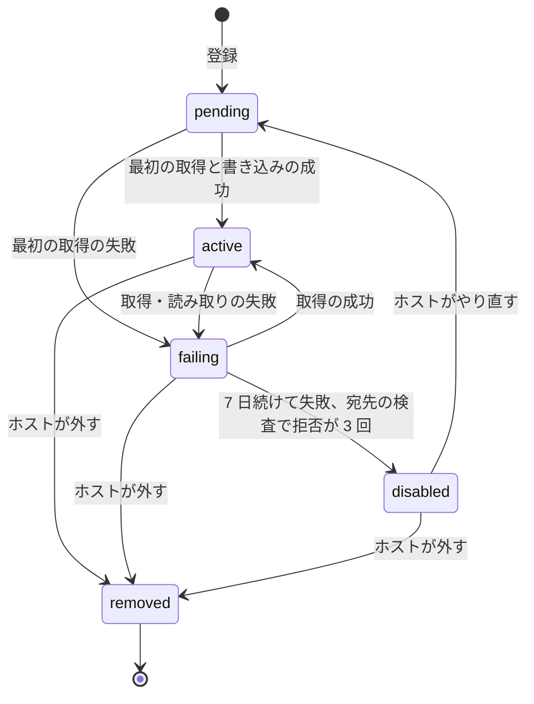
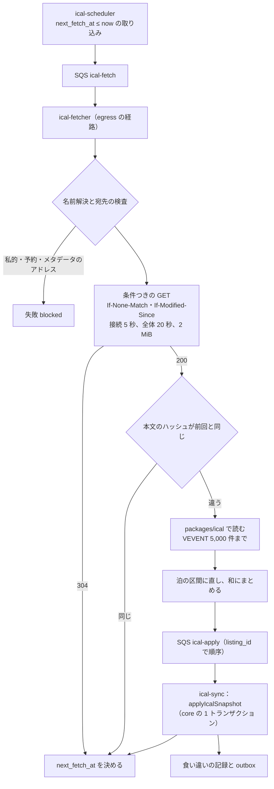
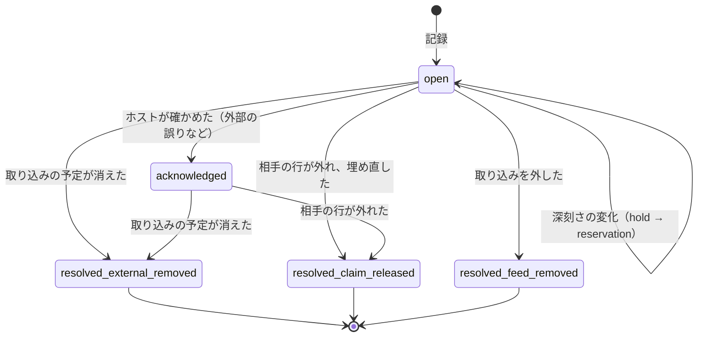

# Calendar Sync: Airbnb

外部のカレンダーとの同期を決める。iCal の取り込み（取り込むアドレスの登録、15 分ごとの条件つきの取得、egress の検査、上限、正規化、泊への直し方、差分の書き込み、急な消失の確かめ）、取り込みと本システムの行の重なり（食い違い）の分け方と知らせ、重なりの後の自動の見直し、iCal の書き出し（秘密のアドレス、中身、`UID`・`PRODID`）、PMS の API との関係、ホストが申告する外部の泊を扱う。

前提となる決定は次のとおり。

- 取り込んだ予定は `stay_claims` の `ical_block` の行で、同じ排他の制約に入る（[ADR-0002](../decisions/0002-availability-representation-and-double-booking.md)。行の形は [availability-and-calendars.md](availability-and-calendars.md) の 4 節）
- 取り込みは 15 分ごと、2 年先まで、1 リスティング 5 件まで。書き出しは秘密のアドレスで、作り直すと古いアドレスは 404（[architecture/README.md](README.md) の 6 節の決定）
- 外部と本システムで同じ夜が売れていても、本システムの予約を自動で取り消さない（[architecture/README.md](README.md) の 1.3 節 E）
- 外部のカレンダーは信用しない入力として扱う（[AGENTS.md](../../AGENTS.md)）
- 取り込む向きと公開する向きの ICS の形は、Google Calendar の題材の [ADR-0025](../../../google-calendar/docs/decisions/0025-ics-subscriptions-both-directions.md) を参照し、宿泊の泊に合わせて自前で書く

この文書で決めたことは次の ADR にある。

| ADR | 決定 |
| --- | --- |
| [0021](../decisions/0021-ical-import-pipeline-and-safety.md) | 取り込みは `ical-fetcher` が egress の経路から 15 分ごとに条件つきで取り、1 つの取り込みの予定を泊の区間の和にまとめ、前回との区間の差分だけを `applyIcalSnapshot` で書く。上限を超えた入力・壊れた入力は既存の行を消さない。未来の泊の半分以上が一度に消える取得は、2 回続けて同じ内容を得るまで書かない |
| [0022](../decisions/0022-ical-conflict-clipping-and-reevaluation.md) | 取り込みの区間が本システムの行と重なったら、重ならない部分だけを `ical_block` で入れ、重なりを `calendar_conflicts` に記録する。重なった相手の種類で深刻さを分け（DT-ICS-001）、確定した予約との重なりは 5 分以内にホストへ知らせ運用の待ち行列に入れる。相手の行が外れたら、取り込みの区間の欠けを自動で埋め直す。本システムの予約は自動で取り消さない |
| [0023](../decisions/0023-ical-export-secret-url-and-contents.md) | 書き出しは `https://cal.<brand>.<domain>/l/<token>.ics`（160 ビットの乱数。DB にはハッシュ）で、有効な行の `block_span`（準備の日を含む）を終日の VEVENT で出し、氏名・住所・連絡先を出さない。`UID` は `<claim_group>@<brand>.<domain>`。取り込みで同じ領域の `UID` は自分の書き出しの戻りとして捨てる |

## 1. 範囲

- 扱う：
  - 取り込むアドレス（`ical_feeds`）の登録、検査、状態
  - 取得（間隔、揺らぎ、条件つきの取得、egress、時間切れ、失敗の後の間隔）
  - 読み取りと正規化（VEVENT、終日と時刻つき、`TZID`、`RRULE`、`STATUS`、`UID`）と泊への直し方
  - 差分の書き込み（`applyIcalSnapshot`）、急な消失の確かめ
  - 食い違いの分け方（DT-ICS-001）、知らせ、運用の待ち行列、自動の見直し
  - 書き出し（秘密のアドレス、中身、キャッシュ、速さの上限）
  - PMS の API と iCal の併用、ホストが申告する外部の泊
- 扱わない：
  - `stay_claims` の制約と書き込みの関数（[availability-and-calendars.md](availability-and-calendars.md)）
  - PMS の API の形、Webhook の署名と配信（host-tools-and-api の領域）
  - 外部の泊の 180 日の数えへの反映（[regulatory-compliance-japan.md](regulatory-compliance-japan.md)。法務の確認待ち：L1）
  - egress のネットワークの構成（infrastructure の領域）
  - 知らせの文と配信（messaging の領域）

## 2. 要件

| 要件 | 目標 | NFR |
| --- | --- | --- |
| 取り込みの鮮度 | 取り込むアドレスを 15 分ごとに取り、取得から `stay_claims` に効くまで p95 1 分。外部の変更から反映まで p95 20 分 | NFR-003 |
| 食い違いの知らせ | 取り込みが本システムの確定した予約と重なったら、取り込みから 5 分以内にホストへ知らせる。割合 100% | NFR-003、K2 |
| 書き出しの鮮度 | 本システムの空室の変化から、書き出しの作り直しまで p95 1 分 | NFR-003 |
| 二重の予約なし | 取り込みの書き込みも排他の制約を通る。取り込みで本システムの行を外さない | NFR-005 |
| 壊れた入力に強い | 上限を超えた・壊れた・急に空になった取得で、既存の `ical_block` を消さない | [quality.md](../quality.md) の 2.2.1 節 G |
| 私的なアドレスへの接続 | 0 件 | security の領域 |
| 漏れ | 書き出しに、ゲストの氏名・連絡先・住所・予約の金額を出さない | NFR-016 |

## 3. 本家の形と標準（確かめたこと）

- 本家の取り込むアドレスは `.ics` で終わる。自動の更新は 3 時間ごとで、手動の更新もある。取り込むのは 2 年先まで。取り込みは一時停止できない（[ヘルプの記事 99](https://www.airbnb.com/help/article/99)、2026-10-10 に確認。[intent.md](../intent.md) の出典）。本システムは 15 分ごとにする（[README.md](README.md) の 1.4 節の「本家との意図した違い」）。
- RFC 5545 の 3.6.1 節：VEVENT の `DTEND` は予定の終わりを含まない（non-inclusive）。`DTSTART` が DATE の型で、`DTEND` も `DURATION` もない予定は、長さを 1 日とする（[RFC 5545](https://datatracker.ietf.org/doc/html/rfc5545#section-3.6.1)、2026-10-10 に確認）。
- 取り込みの相手（他の掲載先）の書き出しの形（`UID` の安定さ、`SUMMARY` の中身、予約とブロックの区別、`ETag` の対応）は、相手ごとに違い、公式の資料で確かめていない（**未検証**）。`ical-import-poc` で、主な相手の実際の形を合成の予約で確かめる。

## 4. 取り込むアドレス

### 4.1 登録

| 項目 | 決定 |
| --- | --- |
| 数 | 1 リスティング 5 件まで |
| 形 | `https`・`http`・`webcal`（`webcal` はまず `https`、だめなら `http`）。2,048 文字まで。`.ics` で終わらなくてもよい（本家は `.ics` で終わることを求める。相手が終わりに拡張子を付けないことがある。[README.md](README.md) の 1.4 節） |
| 保存 | アドレスは相手の秘密の値を含むので、封筒の暗号化で持ち（security の領域）、画面では先頭と末尾だけを出す。ログには `feed_id` と、相手の名前解決の先のホスト名のハッシュだけを書く |
| 扱い（`treat_as`） | `blocked`（既定。準備の日なし）か `external_reservation`（リスティングの準備の日を `block_span` に足す。届出住宅の外部の泊の入力になる。7 節） |
| 主体 | ホストのアカウントの `owner`・`full`・`calendar_and_reservations` の役割（[ADR-0007](../decisions/0007-tenancy-host-accounts-and-rls.md)） |
| 最初の取得 | 登録の直後に 1 回取る。読めなければ登録を `failing` で残し、画面に理由を出す |

### 4.2 状態



- `removed` にすると、その取り込みの有効な `ical_block` を同じトランザクションで外し（`released_reason = 'ical_removed'`）、開いた食い違いを `resolved_feed_removed` で閉じる。
- `failing` と `disabled` の間は、前に取れた `ical_block` を残す。外部で消えた予定が本システムで残るほうが、外部で入った予定を見逃すより安全である（空いて見えないだけで、二重には売らない）。
- 最後に成功した取得の時刻（`last_success_at`）を、ホストのカレンダーの画面に出す。1 時間を超えて成功がなければ、ホストに知らせる（1 日 1 回まで）。

## 5. 取得と読み取り

### 5.1 流れ



- `ical-fetcher` は `untrusted-egress` のサブネットの専用のタスクで、本体の DB に接続しない（[ADR-0076](../decisions/0076-accounts-network-and-egress-with-ssrf-controls.md)）。読み取った結果（泊の区間の集合と、予定ごとの鍵のハッシュ）を SQS の `ical-apply`（FIFO、メッセージのグループは `listing_id`）に入れ、`ical-sync` が core に書く。外部の入力を読む部品と、DB を書く部品を分ける（Google Calendar の題材の [ADR-0025](../../../google-calendar/docs/decisions/0025-ics-subscriptions-both-directions.md) と同じ形）。
- 本文のハッシュが前回と同じなら、何も書かない。304 も同じ。S1 では取得の大半がここで終わる見込み（`ical-import-poc` で測る）。

### 5.2 宛先の検査と取得

| 項目 | 決定 |
| --- | --- |
| 名前解決 | 解決した全部の IP が、私的・予約・リンクローカル・ループバック・メタデータ（`169.254.169.254` など）・本システムの VPC の範囲でないこと。検査した IP に接続する（DNS の再束縛を避ける） |
| リダイレクト | 3 回まで。行き先ごとに同じ検査。`https` から `http` への格下げは拒む |
| 時間 | 接続 5 秒、全体 20 秒 |
| 大きさ | 応答 2 MiB（展開の後）。超えたら `too_large` で失敗 |
| 条件つきの取得 | 前回の `ETag`・`Last-Modified` を送る |
| 相手ごとの上限 | 名前解決の先のホスト名ごとに同時 20、1 秒 10 件（相手への負荷を抑える） |
| `User-Agent` | `<Brand>-CalendarSync/1.0 (+https://<brand>.<domain>/calendar-sync)` |

### 5.3 間隔と揺らぎ

- 既定 15 分。`next_fetch_at = 前回の取得の時刻 + 15 分`。取り込みの ID のハッシュから決まる 0〜14 分の揺らぎを最初の 1 回にだけ足し、毎時 0・15・30・45 分に集まらないようにする。
- 応答の `REFRESH-INTERVAL`（RFC 7986）は使わない（相手の値が長くても 15 分で取る。短くても 15 分より短くしない）。
- ホストの「今すぐ更新」は 1 取り込み 10 分に 1 回まで。
- 失敗の後は 15 分・30 分・1 時間・2 時間・4 時間と倍にし、最大 4 時間。成功で 15 分に戻す。
- S1 の量：3 万のアドレスを 15 分で 1 周、約 33 件/秒（[README.md](README.md) の 2 節）。1 件の本文を平均 30 KiB と見込むと、egress は約 1 MB/秒（`ical-import-poc` で確かめる）。

### 5.4 読み取りと泊への直し方

`packages/ical` が RFC 5545 を読む。外部のライブラリを使ってよいが、泊への直し方は自前で書く（核の一部）。

| 入力 | 扱い |
| --- | --- |
| VEVENT 以外（VTODO、VJOURNAL、VFREEBUSY） | 捨てる |
| `STATUS:CANCELLED` | 捨てる |
| `TRANSP:TRANSPARENT` | 捨てる（空きとして示した予定） |
| `DTSTART;VALUE=DATE` | 泊 `[DTSTART, DTEND)`。`DTEND` がなければ `DURATION`、どちらもなければ 1 泊（RFC 5545 の 3.6.1 節） |
| `DTEND ≤ DTSTART`（DATE） | 1 泊として扱い、`malformed_range` を数える |
| 時刻つき（UTC の `Z`、`TZID`、浮動） | 物件のタイムゾーンの現地の時刻に直す。泊 = `[現地の開始の日付, 現地の終わりの日付)`。終わりの日付が開始の日付と同じなら `[開始, 開始 + 1)` |
| 時刻つきで 4 時間未満 | 捨てる（`short_timed_event`。清掃・内見の予定で夜を塞がないため） |
| 未知の `TZID` | 物件のタイムゾーンとして扱い、`unknown_tzid` を数える |
| `RRULE`・`RDATE`・`EXDATE` | 取り込みの範囲の中に展開する。1 予定 500 回まで。超えた回は捨て、`rrule_truncated` を数える |
| 範囲 | `[物件の現地の昨日, 今日 + 730 日)` に切る。過ぎた泊は書かない |
| 予定の鍵 | `(UID, RECURRENCE-ID)`。`UID` がなければ `sha256(DTSTART, DTEND, 正規化した SUMMARY)` |
| 同じ鍵が 2 つ | 後に現れたほうを使い、`duplicate_uid` を数える |
| `UID` が `@<brand>.<domain>` で終わる | 本システムの書き出しの戻りとして捨てる（`echo_uid`。9.3 節） |
| 文字 | 行の折り返しを解き、UTF-8 として読めない行は捨てる。`SUMMARY`・`DESCRIPTION` は保存しない（氏名・電話番号を含みうる） |

**例：時刻つきの予定**（物件 `Asia/Tokyo`）

| 予定 | 泊 |
| --- | --- |
| `DTSTART:20261230T060000Z`（15:00）、`DTEND:20270102T010000Z`（10:00） | [12/30, 1/2) |
| `DTSTART;TZID=America/New_York:20261229T230000`（日本の 12/30 13:00）、`DTEND;TZID=America/New_York:20261230T200000`（日本の 12/31 10:00） | [12/30, 12/31) |
| `DTSTART:20261230T010000Z`（10:00）、`DTEND:20261230T030000Z`（12:00） | 捨てる（2 時間） |
| `DTSTART;VALUE=DATE:20261230`（`DTEND` なし） | [12/30, 12/31) |

### 5.5 和にまとめる

- 1 つの取り込みの予定の泊を、区間の和にまとめる（重なる・隣り合う区間を 1 つにする）。同じ取り込みの予定どうしは、本システムでは別の組になるので、まとめないと互いに排他の制約に当たるため。
- まとめた区間を「望む区間」（`desired`）と呼ぶ。区間ごとに、元の予定の鍵のハッシュの一覧を持つ（どの予定がどの区間を作ったかを、ホストの画面で示すため）。
- `treat_as = external_reservation` のときだけ、予定ごとに準備の日を足してから和にまとめる（隣の外部の予約との間が、準備の日で埋まる）。

## 6. 書き込みと食い違い

### 6.1 `applyIcalSnapshot`

```
applyIcalSnapshot(tx, feed, desired[], fetched_at) -> {inserted, released, conflicts}
```

core の 1 つのトランザクションで次を行う（[ADR-0021](../decisions/0021-ical-import-pipeline-and-safety.md)）。

1. 取り込みの行（`ical_feeds`）を `FOR UPDATE` で取り、`fetched_at` が前回の書き込みより古ければ何もしない（遅れて届いたメッセージ）。
2. リスティングの行を `FOR UPDATE` で取る（[availability-and-calendars.md](availability-and-calendars.md) の 4.5 節）。
3. 今の区間の集合 `current` = その取り込みの `ical_intervals` の有効な行。
4. 急な消失の確かめ（6.2 節）。当たれば、書かずに `pending_confirmation` にして終える。
5. `current − desired` の区間：その区間の `ical_block` の行を外し（`ical_removed`）、区間を外し、その区間の開いた食い違いを `resolved_external_removed` で閉じる。
6. `desired − current` の区間：`ical_intervals` に入れ、6.3 節で `ical_block` の行を入れる。
7. `desired ∩ current` で開いた食い違いのある区間：6.4 節で欠けを埋め直す。
8. 書き込みがあれば `calendar_version` を上げ、outbox に `listing.calendar_changed` を書く。新しい食い違いがあれば `calendar.conflict_detected` を書く。

- 区間の同じさは `(feed_id, nights)` で決める。区間が 1 日でも伸び縮みすれば、別の区間として外して入れ直す。
- 1 回の書き込みの上限は区間 500。超えたら `too_many_intervals` で失敗させ、既存の行を残す。

### 6.2 急な消失の確かめ

相手の障害で、空の・途中で切れた iCal が 200 で返ることがある。これで全部の予定を外すと、外部で売れた夜が本システムで空いて見え、二重の予約を作る。

- 次の 2 つを両方満たす取得は、すぐに書かない：
  - `current` の未来の泊の数が 10 泊以上
  - 新しい `desired` で、未来の泊が `current` の 50% 以上減る
- 当たったら、内容のハッシュを `pending_hash` に持ち、15 分後の次の取得で同じハッシュを得たら書く（2 回続けて同じ内容なら、相手の本当の変更とみなす）。違えば新しい内容で同じ確かめをやり直す。
- 確かめの間（最大 30 分）は、外部で取り消された予定も本システムで塞がったまま残る。空いて見えるのが遅れるだけで、二重には売らない。
- 本文が `BEGIN:VCALENDAR` で始まらない・`END:VCALENDAR` がない取得は、壊れた取得として失敗にする（`malformed_calendar`）。消失の確かめには進まない。

### 6.3 重なりの切り取り

[ADR-0022](../decisions/0022-ical-conflict-clipping-and-reevaluation.md) で決めた。

- 新しい区間 `iv` を、まず `INSERT ... ON CONFLICT ON CONSTRAINT stay_claims_no_overlap DO NOTHING` で入れる。入れば終わり。
- 入らなければ、`iv` と重なる有効な行（他の組）を読み、`iv` から各行の `block_span` を引いた残りの区間（`pieces`）を `ical_block` で入れる。残りは複数の区間になりうる。各片は `ical_interval_id` で元の区間を指す。
- 重なった部分（`iv ∩ block_span`）は、重なった相手の行ごとに `calendar_conflicts` に 1 行を書く。
- 同じリスティングの書き込みはリスティングの行のロックで直列なので、読んだ重なりは書く時まで変わらない。

**例**（[availability-and-calendars.md](availability-and-calendars.md) の 4.7 節の続き）：外部の予定 `[12/30, 1/2)`、本システムの `hold` の `block_span [12/31, 1/4)`。

| 段 | 結果 |
| --- | --- |
| 区間 | `ical_intervals`：`[12/30, 1/2)` |
| 入れた片 | `ical_block [12/30, 12/31)` |
| 食い違い | `[12/31, 1/2)` × `hold`（予約 R）。深刻さ `pending`（DT-ICS-001 の行 3） |
| G の支払いが成功（R が `confirmed`） | 食い違いの相手が `reservation` になる。深刻さを `double_booking` に上げ、知らせる（6.5 節） |
| G の支払いが失敗（R が `cancelled`） | R の行が外れる。6.4 節で `[12/31, 1/2)` を埋め直し、食い違いを `resolved_claim_released` で閉じる |

### 6.4 自動の見直し

- 開いた食い違いのある区間は、次の 2 つの時に欠けを埋め直す：
  - 同じ取り込みの次の書き込み（7 の段）
  - 食い違いの相手の行が外れた時（`stay_claims` の `released` の outbox を `ical-sync` が受け、その日付の開いた食い違いを持つ取り込みに、取り込みの書き込みを 1 回依頼する。取得はしない。前回の `desired` を使う）
- 埋め直しは、区間 − 有効な片の和 を求め、6.3 節と同じく入れる。埋まった部分の食い違いは `resolved_claim_released` で閉じる。
- 相手の行の深刻さが変わったとき（`hold` → `reservation`）は、`confirmed` への遷移の outbox を `ical-sync` が受けて、食い違いの深刻さを書き直し、必要なら知らせる。

### 6.5 DT-ICS-001（食い違いの深刻さ）

上から評価し、最初に一致した行を使う。

| # | 重なった相手の行 | 条件 | 深刻さ | 知らせ |
| --- | --- | --- | --- | --- |
| 1 | `reservation` | 取り込みの予定の泊が、その予約の泊とちょうど同じで、その予約を書き出しで出していた | `possible_echo` | ホストの画面だけ（相手の掲載先が `UID` を付け替えて戻した疑い） |
| 2 | `reservation` | — | `double_booking` | ホスト（プッシュとメール、5 分以内）、運用の待ち行列（優先 高）、ゲストには出さない |
| 3 | `hold` | — | `pending` | 何もしない（支払いの結果で行 2 か解消。10 分の内に決まる） |
| 4 | `request` | — | `request_overlap` | ホスト（プッシュ）：「この日程は他の掲載先で塞がっています。リクエストを断れます」 |
| 5 | `host_block`・`api_block`・`ops_block` | — | `covered` | 何もしない（どちらも塞がっている） |
| 6 | `ical_block`（他の取り込み） | 両方の取り込みが `external_reservation` | `external_double_booking` | ホスト（プッシュとメール） |
| 7 | `ical_block`（他の取り込み） | それ以外 | `covered` | 何もしない |

- 行 2 の知らせは、`calendar_conflicts` の挿入と同じトランザクションの outbox から notifier が送る。取り込みの書き込みの時刻から知らせの依頼まで p99 5 分を SLI にする（NFR-003）。
- ゲストの予約を本システムが自動で取り消さない。どちらの予約が先かを本システムは知れず、外部の予約が誤り（古い予定）であることもある。ホストが外部で取り消すか、本システムの予約をホストのキャンセル（[cancellations-and-changes.md](cancellations-and-changes.md) の 6 節）で取り消す。
- 運用の待ち行列の行 2 は、チェックインまでの時間で並べる。チェックインの 72 時間前を切っても開いていれば、CS がホストに電話で確かめる（[double-booking-or-cap-violation.md](../runbooks/double-booking-or-cap-violation.md) の外部との食い違いの節）。

### 6.6 食い違いの状態



- `acknowledged` は、ホストが「本システムの予約を守る（外部を取り消す・外部は誤り）」と押した状態。知らせを止めるが、重なりが続く間は開いたものとして数える。
- `possible_echo` を 3 回以上同じ取り込みで記録したら、その取り込みに「相手が本システムの書き出しを戻している」の印を付け、ホストに取り込みの設定を見直すよう案内する。

## 7. 外部の泊（180 日の数えへの入力）

- 届出住宅のリスティングで、`treat_as = external_reservation` の取り込みの泊と、ホストが申告した泊（`external_stay_declarations`）は、[regulatory-compliance-japan.md](regulatory-compliance-japan.md) の 6 節の外部の泊の入力になる。
- 申告は、ホストのカレンダーの画面か PMS の API で、区間と出どころ（`other_platform`・`direct`）を送る。申告は `stay_claims` に書かない（日を塞ぎたいなら別にブロックする）。数えへの反映（`legal.minpaku_count_external_nights`）は法務の確認待ち（L1）で、本番の既定は `none`（[ADR-0006](../decisions/0006-regulatory-night-cap-enforcement.md)）。

## 8. PMS の API との関係

- PMS の API の書き込み（`api_block`、料金、規則）は同期で効く（範囲の状態を宣言する `PUT`。[ADR-0069](../decisions/0069-pms-availability-and-price-push-and-bulk-operations.md)）。iCal を使わずに済むので、PMS を使うホストには iCal の取り込みを外すよう画面で勧める。
- 両方を使ってもよい。PMS のブロックと取り込みの区間が重なれば DT-ICS-001 の行 5 で `covered` になり、知らせない。
- 本システムの変化は、PMS の Webhook で p95 10 秒で届く（NFR-003。host-tools-and-api の領域）。

## 9. 書き出し

[ADR-0023](../decisions/0023-ical-export-secret-url-and-contents.md) で決めた。

### 9.1 アドレス

| 項目 | 決定 |
| --- | --- |
| URL | `https://cal.<brand>.<domain>/l/<token>.ics`。`token` は 160 ビットの乱数を base32 にしたもの。DB にはハッシュ（SHA-256）だけを持つ |
| 数 | リスティングに 1 つ。作り直すと古いアドレスは 404 |
| 出す人 | ホストのアカウントの `owner`・`full`・`calendar_and_reservations` の役割 |
| 認証 | 付けない（他の掲載先の取り込みは認証に対応しないことが多い）。画面で「このアドレスを知る人はだれでも日付を見られます」を示す |
| 速さの上限 | 1 つのアドレスに 1 時間 120 回。超えたら 429 |
| ヘッダー | `Content-Type: text/calendar; charset=utf-8`、`ETag`（`calendar_version`）、`Cache-Control: private, max-age=60`、`X-Robots-Tag: noindex`。`If-None-Match` で 304 |
| 記録 | アドレスごとの最後の利用の時刻と 1 日の要求の数（IP は記録しない） |

### 9.2 中身

```
BEGIN:VCALENDAR
VERSION:2.0
PRODID:-//<Brand>//Calendar//EN
CALSCALE:GREGORIAN
METHOD:PUBLISH
BEGIN:VEVENT
UID:0192f3a4-...@<brand>.<domain>
DTSTAMP:20261010T083000Z
DTSTART;VALUE=DATE:20261231
DTEND;VALUE=DATE:20270104
SUMMARY:Reserved
END:VEVENT
END:VCALENDAR
```

| 項目 | 決定 |
| --- | --- |
| 出す行 | 有効な `stay_claims` の全種類（`reservation`・`hold`・`request`・各ブロック・他の取り込みの `ical_block`） |
| 日付 | `DTSTART` = `lower(block_span)`、`DTEND` = `upper(block_span)`（準備の日を含む。他の掲載先で準備の日に予約を入れさせない） |
| 範囲 | 物件の現地の昨日から、予約できる期間の端まで。範囲の外を全部閉じたいホストは、ブロックで閉じる |
| `UID` | `<claim_group>@<brand>.<domain>`（予約の行の組は予約の ID。日程の変更の後も同じ `UID` で日付が変わる）。ブロックと取り込みの片は行の ID |
| `SUMMARY` | `Reserved`（予約・仮押さえ・リクエスト）か `Not available`（ブロック・取り込み） |
| 出さないもの | ゲストの氏名・連絡先・人数・金額・予約のコード・住所・`DESCRIPTION`・`ATTENDEE` |
| 1 つの区間の和 | 和にまとめない（`UID` を安定させるため） |

- 作り直しは、`listing.calendar_changed` の outbox を受けて 1 分以内に S3 に置き、要求には S3 の写しを返す（`calendar_version` を `ETag` にする）。写しが古ければ（`calendar_version` が DB より小さい）、その場で作る。

### 9.3 自分の戻り

- 取り込みの相手が本システムの書き出しを読み、自分の書き出しにそのまま含めて戻すと、本システムの予約が `ical_block` として戻って重なり、偽の食い違いになる。
- `UID` が `@<brand>.<domain>` で終わる予定は捨てる（5.4 節）。相手が `UID` を付け替えて戻したら、DT-ICS-001 の行 1 の `possible_echo` で深刻さを下げる。

## 10. 障害のときの振る舞い

| 障害 | 影響 | 振る舞い |
| --- | --- | --- |
| 相手の 5xx・時間切れ | 取り込みが古くなる | 失敗の後の間隔で再試行。前の `ical_block` を残す。1 時間で知らせ、7 日で `disabled` |
| 相手が空・途中で切れた iCal を返す | 全部の日が空いて見える恐れ | 6.2 節の確かめで書かない |
| 相手が `UID` を毎回変える | 予定の鍵が毎回変わる | 区間の和で差分を取るので、日付が同じなら書き込みはない（`UID` の変化は書き込みにならない） |
| `ical-fetcher` の停止 | 取得が止まる | `next_fetch_at` が過ぎた取り込みを、再開で揺らぎを付けて取り直す（全部を一度に取らない。1 秒 100 件まで） |
| `ical-apply` の遅れ | 反映が遅れる | FIFO のグループで順序を守る。遅れたメッセージは 6.1 節の手順 1 で捨てる |
| core のフェイルオーバー | 書き込みが戻る | SQS の再配送で同じ書き込みをやり直す（差分の書き込みは冪等） |
| 書き出しの S3 の写しの遅れ | 古い書き出し | 要求の時に `calendar_version` を比べ、古ければその場で作る |
| 秘密のアドレスの漏えい | 第三者が日付を読む | ホストが作り直す。1 日の要求が前の 7 日の平均の 10 倍を超えたら知らせる |

## 11. 上限

| 対象 | 値 |
| --- | --- |
| 1 リスティングの取り込み | 5 件 |
| 取得の間隔 | 15 分（失敗の後は最大 4 時間）。手動の更新は 10 分に 1 回 |
| 取得の時間 | 接続 5 秒、全体 20 秒 |
| 応答の大きさ | 2 MiB（展開の後） |
| VEVENT | 5,000 件。`RRULE` の展開は 1 予定 500 回 |
| 取り込みの範囲 | 物件の現地の昨日から 730 日 |
| 1 回の書き込みの区間 | 500 |
| 急な消失の確かめ | 未来の 10 泊以上が 50% 以上減る取得は、2 回続けて同じ内容まで書かない |
| 相手のホスト名ごと | 同時 20、1 秒 10 件 |
| 書き出しの要求 | 1 アドレス 1 時間 120 回 |
| `disabled` | 7 日続けて失敗 |

## 12. data-model への項目

| 表・置き場 | 中身 | 主キー・索引 | 節 |
| --- | --- | --- | --- |
| `ical_feeds`（core、ホストのアカウントの RLS） | `listing_id`、暗号化したアドレス、`treat_as`、状態、`etag`、`last_modified`、`content_hash`、`pending_hash`、`next_fetch_at`、`last_success_at`、`consecutive_failures`、最後の失敗の理由のコード、`last_applied_fetched_at` | `id`。`(next_fetch_at) WHERE status IN ('pending','active','failing')`、`(listing_id)` | 4、5 |
| `ical_intervals`（core、同） | `feed_id`、`listing_id`、`nights`、元の予定の鍵のハッシュの一覧、状態 | `id`。一意 `(feed_id, nights) WHERE active` | 5.5、6 |
| `stay_claims` の列 | `ical_block` の片の `source_ref` = `ical_interval_id` | — | 6.3 |
| `calendar_conflicts`（core、同） | `listing_id`、`feed_id`、`ical_interval_id`、重なりの区間、相手の `stay_claims` の ID と種類、予約の ID、深刻さ、状態、知らせた時刻、閉じた時刻と理由 | `id`。`(listing_id, status)`、`(status, severity, check_in)` | 6.4〜6.6 |
| `ical_exports`（core、同） | `listing_id`、トークンのハッシュ、作成の時刻、無効の時刻、最後の利用の時刻、1 日の要求の数 | `listing_id`、一意 `token_hash` | 9.1 |
| `external_stay_declarations`（core、同） | `listing_id`、区間、出どころ、主体 | `id`、`(listing_id, nights)` | 7 |
| S3 | `ical-exports/<listing_id>/<calendar_version>.ics`（SSE-KMS、7 日で消す） | — | 9.2 |
| SQS | `ical-fetch`（標準）、`ical-apply`（FIFO、グループ = `listing_id`） | — | 5.1 |
| outbox の事象 | `calendar.conflict_detected`、`calendar.conflict_resolved`、`ical_feed.failing`、`ical_feed.disabled` | — | 6、4.2 |

## 13. テスト

- **PROP-ICS-001（最後の内容と一致）**：任意の取得の列（`ical-sim` の追加・削除・日付の変更・`UID` の付け替え・重複・304・5xx）で、書き込みの後の取り込みの区間の集合は、最後に書いた取得の `desired` と一致する（差分の積み重ねで食い違わない）。
- **PROP-ICS-002（重なりは入らない）**：本システムの行と重なる取り込みの泊は `stay_claims` に入らず、重なりごとに `calendar_conflicts` が 1 行ある。重ならない泊はすべて入る。
- **PROP-ICS-003（自動の見直し）**：食い違いの相手の行が外れた後、次の書き込みか見直しで、取り込みの区間は全部埋まり、食い違いは閉じる。
- **PROP-ICS-004（壊れた入力）**：上限を超えた・壊れた・急に空になった取得で、既存の `ical_block` は 1 行も外れない（急に空の取得は、2 回続けて同じときだけ外れる）。
- **PROP-ICS-005（私的なアドレス）**：任意の名前解決とリダイレクトの組で、私的・予約・メタデータの IP への接続は 0。
- **PROP-ICS-006（書き出し）**：書き出しは RFC 5545 の検証の道具で読め、有効な行の `block_span` の集合と一致し、ゲストの氏名・連絡先を含まない。
- **表駆動**：5.4 節の入力の表と例、DT-ICS-001 の全 7 行、6.6 節の遷移。
- **仮想の時計**：知らせの 5 分、15 分の間隔と揺らぎ、失敗の後の間隔、7 日の `disabled`、急な消失の 2 回の確かめ。
- **負荷**：S1 の 3 万のアドレスを 15 分で取り、1% を 5xx・時間切れにする（[quality.md](../quality.md) の 2.2.1 節 J）。

## 14. Story の候補

| Epic | Story | 中身 |
| --- | --- | --- |
| E6 | `ical-import-poc` | 5.3 節の量、主な相手の形（`UID` の安定さ、`ETag`、時刻つきの予定）、6.2 節の閾値 |
| E6 | `ical-export` | 9 節（ADR-0023。PROP-ICS-006） |
| E6 | `ical-import` | 4・5・6.1・6.2 節（ADR-0021。PROP-ICS-001・004・005、`ical-sim`） |
| E6 | `calendar-conflicts` | 6.3〜6.6 節（ADR-0022。PROP-ICS-002・003、DT-ICS-001） |
| E6 | `external-nights-declaration` | 7 節。数えへの反映は法務：L1 |

## 15. 未解決の問い

### 決定

2026-10-10 の既定案。

- **取り込みの書き込み**：区間の和の差分。予定ごとの行にしない（ADR-0021）。
- **急な消失**：未来の 10 泊以上が 50% 以上減る取得は、2 回続けて同じ内容まで書かない（ADR-0021）。
- **時刻つきの予定**：物件のタイムゾーンの日付で泊に直す。4 時間未満は捨てる（ADR-0021）。
- **重なり**：切り取って入れ、重なりを記録する。相手の行が外れたら埋め直す（ADR-0022）。
- **知らせ**：確定した予約との重なりだけを 5 分以内にホストと運用へ。仮押さえとの重なりは結果を待つ（ADR-0022）。
- **書き出し**：`block_span`（準備の日を含む）を終日の予定で出す。氏名を出さない（ADR-0023）。

### 持ち越し

| 問い | いつ・どう決めるか |
| --- | --- |
| 取得の量、相手の応答の速さと条件つきの取得の対応、急な消失の閾値 | E6 の前の `ical-import-poc` |
| 主な相手が本システムの `UID` を戻すか、付け替えるか | 同上。付け替えが多ければ、`possible_echo` の判定を強める（書き出した予約との区間の一致の割合で取り込みに印を付ける） |
| 外部の泊を 180 日に数えるか | 法務の確認待ち（L1） |
| 本家の取り込みの形の細部（時刻つきの予定の扱い、空の取得の扱い） | 公式の資料で確かめられなかった（**未検証**）。本システムの値を使う |

## 出典

いずれも 2026-10-10 に確認。

- Airbnb, [ヘルプの記事 99（カレンダーの同期）](https://www.airbnb.com/help/article/99)：[intent.md](../intent.md) の出典のとおり
- IETF, [RFC 5545 の 3.6.1 節](https://datatracker.ietf.org/doc/html/rfc5545#section-3.6.1)：`DTEND` は終わりを含まない。DATE の `DTSTART` だけの予定は 1 日
