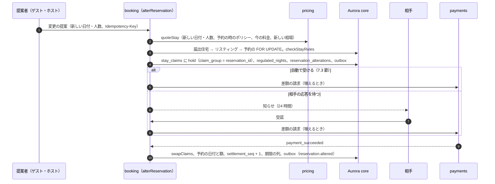

# Cancellations and Changes: Airbnb

キャンセルと予約の変更を決める。キャンセルポリシーの表とバージョン、返金の決定表 DT-CXL-001、返金とホストの取り分とサービス料の計算（`packages/cancellation` の `computeSettlement`）と端数、円と外国の通貨の計算の例、ホストのキャンセルと罰、運用のキャンセル（安全の事故、災害、早い退出）、日程・人数の変更（`claim_group` の入れ替え、差分の見積もり、`settlement_seq`）と変更の決定表 DT-ALT-001 を扱う。

前提となる決定は次のとおり。

- キャンセルは予約の遷移（DT-BKG-001 の行 24・26）で、精算の額は遷移ではなくこの領域の決定表が決める（[ADR-0004](../decisions/0004-booking-state-machine-and-holds.md)。[booking-and-holds.md](booking-and-holds.md)）
- 返金は予約の時に固定したキャンセルポリシーのバージョンで計算する（[AGENTS.md](../../AGENTS.md)）
- 預かりの決着は `(reservation_id, settlement_seq)` で 1 回。日程の変更は新しい `settlement_seq` の差分の仕訳（[ADR-0005](../decisions/0005-payments-hold-capture-and-ledger.md)。仕訳は [ledger-and-payouts.md](ledger-and-payouts.md)）
- 返金はゲストが払った通貨と額をもとに、見積もりの各行の請求の通貨の按分の額に割合を当てる（[ADR-0008](../decisions/0008-multi-currency-and-fx.md)）
- サービス料はホストだけの型で、既定 15%（[README.md](README.md) の 6 節）
- 日程の変更は同じ予約の組（`claim_group`）の行で入れ替える（[ADR-0002](../decisions/0002-availability-representation-and-double-booking.md)、[ADR-0004](../decisions/0004-booking-state-machine-and-holds.md)）

この文書で決めたことは次の ADR にある。

| ADR | 決定 |
| --- | --- |
| [0039](../decisions/0039-cancellation-policy-table-and-refund-decision-table.md) | ポリシーの表の v1（柔軟・中程度・厳格と確定から 24 時間の全額の返金）を DT-CXL-001 の 12 行で確定する。境はチェックインの時刻からの時間で測る。返金は泊・清掃料・税の行ごとに、請求の通貨とリスティングの通貨の両方で計算し、端数はゲストに有利にする。税は泊まらなかった泊の分を返す。サービス料はホストが受け取る額の 15% |
| [0040](../decisions/0040-host-and-ops-cancellations.md) | ホストのキャンセルはゲストに全額を返し、ホストに罰の料金（チェックインまでの時間で 10・25・50%）を次の送金から差し引き、日付を `ops_block` で閉じる。運用のキャンセル（安全の事故、災害、規則の違反）は理由のコードで精算の行を選び、罰を課さない。代わりの宿の差額の補償は運用が決める |
| [0041](../decisions/0041-alterations-with-claim-group-and-delta-settlement.md) | 日程・人数の変更は DT-ALT-001 の 17 行。新しい日付は同じ組の `hold` で取り、相手の受諾と差額の支払いの後に入れ替える。増える差額は請求し、減る差額は全額の返金の期間の中か相手の同意があるときだけ返す。お金の動く変更は `settlement_seq` を 1 つ上げる。滞在中はチェックアウトの日だけを変えられる |

## 1. 範囲

- 扱う：
  - キャンセルの入口（ゲスト、ホスト、運用者）と理由のコード
  - キャンセルポリシーの表とバージョン、DT-CXL-001
  - `computeSettlement`（返金、ホストの取り分、サービス料、端数、通貨）
  - ホストのキャンセルの罰と日付の閉じ方
  - 運用のキャンセル（安全の事故、災害・やむをえない事情、規則の違反、早い退出）
  - 日程・人数の変更、DT-ALT-001、差分の見積もり、変更と `settlement_seq`
  - キャンセルと変更の照合
- 扱わない：
  - 予約の状態の遷移そのもの（[booking-and-holds.md](booking-and-holds.md)）
  - 仕訳の形（[ledger-and-payouts.md](ledger-and-payouts.md)）。ここは仕訳に渡す額を決める
  - 提供者への返金の依頼（[payments-and-fx.md](payments-and-fx.md)）
  - 税の額の計算（taxes の領域）。ここは返す税の行を選ぶ
  - 損害の請求（[deposits-and-claims.md](deposits-and-claims.md)）
  - 違約金の妥当さ（**法務の確認待ち：L7**）

## 2. 要件

| 要件 | 目標 | NFR |
| --- | --- | --- |
| 和の一致 | 返金 + ホストの取り分 + 本システムの収益 = 払った額（通貨ごと、最小単位で 1 も違わない） | NFR-007、K7 |
| 返金の上限 | 返金 ≤ 払った額 | [ADR-0008](../decisions/0008-multi-currency-and-fx.md) |
| 単調 | 同じ予約で、キャンセルが遅いほど返金は多くならない | [quality.md](../quality.md) の 2.2.1 節 C |
| ポリシーの固定 | 予約の時のポリシーのバージョンで計算する。表を変えても既存の予約の額は変わらない | [AGENTS.md](../../AGENTS.md) |
| 時刻 | 境の判定は物件のタイムゾーンで求めたチェックインの瞬間で行う。境の 1 秒前・ちょうど・1 秒後を区別する | NFR-014 |
| 速さ | キャンセルの操作 p99 1 秒（提供者の時間を除く）。返金額の事前の表示 p99 300ms | NFR-004 の考え方 |
| 二重の予約なし | 日程の変更の間も、異なる組の有効な `block_span` は重ならない | NFR-005 |

## 3. 本家の形（確かめたこと）

[ヘルプの記事 475](https://www.airbnb.com/help/article/475)（2026-10-10 に確認）。28 泊未満の標準のポリシー。

- 全部のポリシーで、チェックインの 7 日以上前に確定した予約は、確定から 24 時間は税を含めて全額を返す（物件の現地の時刻）。
- 柔軟：チェックインの 24 時間前まで全額。その後は、ホストは泊まった泊と追加の 1 泊を受け取る。税は割合で返す。
- 中程度：5 日前まで全額。その後チェックインの前は、ホストは追加の 1 泊と、使わなかった泊の 50% を受け取る。税は全額を返す。チェックインの後は、泊まった泊と追加の 1 泊と、使わなかった泊の 50%。税は割合で返す。
- 限定（2025-10-01 以降の予約）：14 日前まで全額。7〜14 日前は 50%（税は全額を返す）、7 日未満は返金なし（税は返す）、チェックインの後は返金なし（税も返さない）。
- 厳格（Firm）：30 日前まで全額。7〜30 日前は 50%（税は全額を返す）、7 日未満は返金なし（税は返す）、チェックインの後は返金なし（税も返さない）。
- 厳しい（Strict。招待されたホストだけ）：確定から 24 時間の後は全額の返金がない。7 日以上前は 50%（税は全額を返す）、7 日未満は返金なし（税は返す）、チェックインの後は返金なし。
- 本システムの厳格は、[README.md](README.md) の 6 節で「30 日前まで全額、7〜30 日前は 50%、7 日未満は返金なし」と決めた。値は本家の厳格（Firm）と同じである（2026-10-10 に本家の表を取得し直して確かめた。最初の草案は本家の「厳しい（Strict）」と比べて違うと書いていた）。チェックインの後の税の返し方の違いを [README.md](README.md) の 1.4 節に書いた（統合の工程、2026-10-10）。
- 清掃料の返し方、ホストのキャンセルの罰の額、日程の変更の差額の扱いは、公式の資料で確かめていない（**未検証**）。本システムの値を使う。

## 4. キャンセルの入口と理由のコード

| 主体 | 状態 | 入口 | 理由のコード | 精算 |
| --- | --- | --- | --- | --- |
| ゲスト | `confirmed` | 画面 | `guest_changed_plans`・`guest_other` | DT-CXL-001（ポリシー） |
| ホスト・共同ホスト（`full`） | `confirmed` | 画面・PMS の API | `host_unavailable`・`host_calendar_error`・`host_safety_concern`・`host_other` | DT-CXL-001 の行 1（全額）。罰は 6.1 節 |
| 運用者 | `confirmed`・`in_stay` | `ops-api`（案件と JIT の権限） | `ops_safety_incident`・`ops_extenuating`・`ops_rules_violation_guest`・`ops_rules_violation_host`・`ops_listing_removed`・`ops_early_departure`・`ops_double_booking` | 6.2 節 |

- ゲストのキャンセルの前に、`GET /reservations/{id}/cancellation-preview` で返金の額（請求の通貨）と、次の境の日時を出す。プレビューは同じ `computeSettlement` を今の時刻で呼ぶ。プレビューの後に境を過ぎてから押した場合は、押した時刻で計算した額で精算し、画面で差を示す（プレビューの額は約束しない）。
- 滞在中（`in_stay`）のゲストのキャンセルは画面で受けない。早い退出は CS が受け、運用のキャンセル `ops_early_departure` で精算する（DT-BKG-001 の行 26）。

## 5. キャンセルポリシーと返金

### 5.1 ポリシーの表とバージョン

- `cancellation_policies`（`code`、`version`、`rules`（JSON）、`effective_from`）。予約は見積もりの時のポリシーの `(code, version)` を `reservations.cancellation_policy_version` に持つ。
- 表を変えるときは新しいバージョンを足す。古いバージョンを書き換えない。表の値は QA と法務の承認で出す（[roadmap.md](../roadmap.md) の「エージェントに任せないこと」）。
- MVP の表（v1）は柔軟・中程度・厳格の 3 つ。他のポリシー（限定、長期の滞在のポリシー）は表に行を足して出す（[README.md](README.md) の 1.4 節）。

### 5.2 言葉

| 言葉 | 意味 |
| --- | --- |
| `T` | `check_in_at`（チェックインの日の物件の現地のチェックインの時刻を UTC に直した瞬間） |
| `c` | キャンセルの瞬間（トランザクションの中の `now()`） |
| `booked_at` | 予約が `confirmed` になった瞬間 |
| 泊の始まり | 泊 `d` の始まり = `toInstant(d, チェックインの時刻, time_zone)` |
| 使った泊 | 始まりが `c` 以前の泊 |
| 使わなかった泊（`U`） | 始まりが `c` より後の泊。日付の順に並べる |
| 泊の行 | 泊の料金と、泊ごとの料金（追加のゲスト）。泊ごとに 1 行 |
| 滞在の行 | 清掃料、ペットの料金など、滞在に 1 回の料金 |
| 税の行 | 泊ごとの税（宿泊税）と、その他の税。税の行は泊に結び付く（taxes の領域） |

- 「24 時間前」「5 日前」「30 日前」「7 日前」は、`T` から 24・120・720・168 時間を引いた瞬間である。暦の日ではない。夏時間の物件でも絶対の時間で測る。

### 5.3 DT-CXL-001

上から評価し、最初に一致した行を使う（[ADR-0039](../decisions/0039-cancellation-policy-table-and-refund-decision-table.md)）。「残す」はホストが受け取る（返さない）割合。

| # | ポリシー | 条件 | 泊の行 | 滞在の行 | 税の行 |
| --- | --- | --- | --- | --- | --- |
| 1 | どれでも | 主体がホスト、または運用の理由が全額の返金（6.2 節） | 全部返す | 全部返す | 全部返す |
| 2 | どれでも | `booked_at ≤ T − 168h` かつ `c < booked_at + 24h` かつ `c < T` | 全部返す | 全部返す | 全部返す |
| 3 | 柔軟 | `c < T − 24h` | 全部返す | 全部返す | 全部返す |
| 4 | 柔軟 | それ以外 | 使った泊と `U` の最初の 1 泊を残し、他は返す | `c < T` なら返す、他は残す | 使わなかった泊の分を返す |
| 5 | 中程度 | `c < T − 120h` | 全部返す | 全部返す | 全部返す |
| 6 | 中程度 | それ以外 | 使った泊と `U` の最初の 1 泊を残し、`U` の残りは 50% を残す | `c < T` なら返す、他は残す | 使わなかった泊の分を返す |
| 7 | 厳格 | `c < T − 720h` | 全部返す | 全部返す | 全部返す |
| 8 | 厳格 | `T − 720h ≤ c < T − 168h` | 全部の泊の 50% を残す | 返す | 全部返す |
| 9 | 厳格 | `T − 168h ≤ c < T` | 全部残す | 返す | 全部返す |
| 10 | 厳格 | `c ≥ T` | 全部残す | 残す | 使わなかった泊の分を返す |
| 11 | どれでも | 運用の理由が「使わなかった泊を返す」（6.2 節） | 使った泊を残し、`U` を全部返す | `c < T` なら返す、他は残す | 使わなかった泊の分を返す |
| 12 | どれでも | 上のどれにも当たらない | — | — | 422（表の誤り。精算しない） |

- **キャンセルの税の規則（正本はこの表）**：税の行は泊ごとに、使わなかった泊の分を全部返し、使った泊の分を残す。ポリシーにも行にも依らない（宿泊税は泊まった泊に掛かるため）。チェックインの前のキャンセルは全部の泊が使わない泊なので、税の全額を返す。滞在中は `reservation_tax_nights` の泊ごとの額で、使わなかった泊の分を返す。[ADR-0034](../decisions/0034-tax-collection-model.md) と [taxes.md](taxes.md) の 8 節はこの規則を参照する。返す税・残す税の扱い（ホストが納めるか本システムが預かるか）は **法務の確認待ち（L4）** で、ここでは額だけを決める。本家は柔軟・中程度のチェックインの後の税を割合で返し、限定・厳格・厳しいではチェックインの後の税を返さない（3 節）。本システムは使わなかった泊の税を全部返す（本家との違い。[README.md](README.md) の 1.4 節）。
- 行 4・6 の「`U` の最初の 1 泊」は、`U` が空（全部の泊を使った）なら何も足さない。
- 行 4・6・10・11 の滞在の行は、チェックインの後は残す（清掃は行われる）。

### 5.4 計算（`computeSettlement`）

```
computeSettlement(quote_snapshot, policy_version, booked_at, c, actor, reason)
  -> lines[]: {line_id, kind, night?, charge: {paid, refund, retained}, listing: {paid, refund, retained}}
     totals: {refund_charge, retained_charge, retained_listing, service_fee_listing, host_listing}
```

1. DT-CXL-001 で行を選び、各行の「残す割合」`keep_bps`（0・5000・10000）を決める。
2. 行ごと・通貨ごとに `retained = floor(paid × keep_bps / 10000)`、`refund = paid − retained`。端数はゲストに有利（返金を多く）にする。
3. 請求の通貨の額は、見積もりの各行の請求の通貨の按分の額（[ADR-0008](../decisions/0008-multi-currency-and-fx.md) の大きい行から 1 単位ずつの規則で決めた値）を `paid` とする。リスティングの通貨の額は、見積もりのリスティングの通貨の行を `paid` とする。2 つを別に計算し、換算し直さない。
4. サービス料（リスティングの通貨）= `floor(残した泊の行と滞在の行の和 × service_fee_bps / 10000)`。`service_fee_bps` は見積もりの写しの値（既定 1500）。税の行にはサービス料を掛けない。
5. ホストの取り分（リスティングの通貨）= 残した泊の行と滞在の行の和 − サービス料 + 残した税の行（既定の「ホストが納める」のとき。法務の L4 の後に変わりうる）。
6. 確かめ：`refund_charge + retained_charge = paid_charge`、`host_listing + service_fee_listing = retained_listing`。違えば例外にし、精算しない。

- 純粋な関数で、`packages/cancellation` に置く。プレビュー、ゲストのキャンセル、ホストのキャンセル、運用のキャンセル、変更の減額（7.4 節）が同じ関数を呼ぶ。参照の実装 `refund-ref` はポリシーの文をそのまま書いた素直な関数で、性質ベーステストで比べる（[quality.md](../quality.md) の 2.2.1 節 C）。

### 5.5 例：円で払った予約

前提：リスティング L（`Asia/Tokyo`、チェックイン 15:00）、12/30〜1/2 の 3 泊、2 人。泊 20,000 円 × 3、清掃料 8,000 円、宿泊税 200 円 × 2 人 × 3 泊（泊ごとに 400 円）。総額 69,200 円。サービス料 15%。`booked_at` = 10/10 20:04、`T` = 12/30 15:00。

| 例 | ポリシー | `c` | 行 | 返金 | 残す（泊・滞在） | サービス料 | ホスト |
| --- | --- | --- | --- | --- | --- | --- | --- |
| a | 中程度 | 10/11 10:00 | 2（確定から 24 時間） | 69,200 | 0 | 0 | 0 |
| b | 中程度 | 12/25 14:59:59 | 5（`T − 120h` = 12/25 15:00 の前） | 69,200 | 0 | 0 | 0 |
| c | 中程度 | 12/27 15:00 | 6 | 泊 20,000 + 清掃 8,000 + 税 1,200 = 29,200 | 泊 20,000 + 10,000 × 2 = 40,000 | 6,000 | 34,000 |
| d | 柔軟 | 12/30 05:00 | 4 | 泊 40,000 + 清掃 8,000 + 税 1,200 = 49,200 | 20,000 | 3,000 | 17,000 |
| e | 厳格 | 12/20 15:00 | 8（10 日前） | 泊 30,000 + 清掃 8,000 + 税 1,200 = 39,200 | 30,000 | 4,500 | 25,500 |
| f | 厳格 | 12/25 15:00 | 9（5 日前） | 清掃 8,000 + 税 1,200 = 9,200 | 60,000 | 9,000 | 51,000 |
| g | 柔軟 | 12/31 11:00（運用、`ops_early_departure`） | 11 | 泊 40,000 + 税 800 = 40,800（使わなかった泊は 12/31 と 1/1） | 泊 20,000 + 清掃 8,000 = 28,000 | 4,200 | 23,800 + 税 400 = 24,200 |

- c の内訳：使った泊なし、`U` = 12/30・12/31・1/1。最初の 1 泊（12/30）を残し、12/31・1/1 は 50% を残す。泊の残す和 = 20,000 + 10,000 + 10,000 = 40,000。和：29,200 + 34,000 + 6,000 = 69,200。
- g の内訳：`c` = 12/31 11:00 は 12/31 の泊の始まり（15:00）の前なので、使った泊は 12/30 だけ。ホストの取り分 = 28,000 − 4,200 + 残した税 400 = 24,200。和：40,800 + 24,200 + 4,200 = 69,200。送金の振り替え（12/31 15:00）の前なので、精算は settle の 1 回（[ledger-and-payouts.md](ledger-and-payouts.md) の 5 節）。
- b と c の間で、返金は 69,200 から 29,200 に減り、増えることはない（単調）。

### 5.6 例：米ドルで払った予約

前提：5.5 節と同じ予約。ゲストは米ドルで払った。見積もりの相場の写し：仲値 0.006700 USD/JPY、上乗せ 2%（200 bp）、適用の相場 0.006834（[payments-and-fx.md](payments-and-fx.md) の 8 節）。

| 行 | 円 | 米ドル（セント） |
| --- | --- | --- |
| 泊 12/30・12/31・1/1 | 20,000 × 3 | 13,668 × 3 |
| 清掃料 | 8,000 | 5,468 |
| 宿泊税（泊ごと） | 400 × 3 | 273 × 3 |
| 総額 | 69,200 | 47,291（472.91 ドル） |

- 総額 69,200 × 0.006834 = 472.9128 → 472.91 ドル。行の按分は切り捨てで 47,287 になり、残りの 4 セントを大きい行（泊 3 行、清掃料）から 1 セントずつ足した（[ADR-0008](../decisions/0008-multi-currency-and-fx.md)）。

**中程度、12/27 15:00 にキャンセル（行 6）**：

| 行 | 残す割合 | 米ドルの残す | 米ドルの返金 | 円の残す |
| --- | --- | --- | --- | --- |
| 泊 12/30 | 100% | 13,668 | 0 | 20,000 |
| 泊 12/31 | 50% | 6,834 | 6,834 | 10,000 |
| 泊 1/1 | 50% | 6,834 | 6,834 | 10,000 |
| 清掃料 | 0% | 0 | 5,468 | 0 |
| 税 × 3 | 0% | 0 | 819 | 0 |
| 計 | | 27,336 | 19,955（199.55 ドル） | 40,000 |

- 和：27,336 + 19,955 = 47,291 セント。ゲストへの返金は 199.55 ドルで、為替の動きに依らない。
- ホストの取り分は円で 40,000 − 6,000 = 34,000 円（5.5 節の c と同じ）。ホストは為替の動きの影響を受けない。
- 残した 27,336 セントは、決着の時に見積もりの相場で 40,000 円に当たるとして `fx_clearing` に振り替える（27,336 / 0.006834 = 40,000）。仕訳は [ledger-and-payouts.md](ledger-and-payouts.md) の 5.3 節。
- 泊の 50% が奇数のセントになる行は、`floor` で残す額を切り捨て、返金を 1 セント多くする（ゲストに有利）。

## 6. ホストのキャンセルと運用のキャンセル

[ADR-0040](../decisions/0040-host-and-ops-cancellations.md) で決めた。

### 6.1 ホストのキャンセル

- ゲストには DT-CXL-001 の行 1 で全額を返す。
- 日付は同じトランザクションで `ops_block`（`source_ref = 'host_cancellation:<reservation_id>'`）にし、ホストは外せない。同じ日付を他の掲載先・他のゲストに高く売り直すことを防ぐ。運用は外せる。
- 罰の料金（`host_cancellation_fee_table` のバージョン v1。本家の値は**未検証**の本システムの値）：

| キャンセルの時 | 罰の料金（ホストが受け取るはずだった額 = 泊と滞在の行の和 − サービス料、に対する割合） |
| --- | --- |
| `c < T − 720h` | 10% |
| `T − 720h ≤ c < T − 168h` | 25% |
| `c ≥ T − 168h` | 50% |

- 罰は、過去 12 か月の最初の 1 回で、`c < T − 720h` なら免除する。理由が `host_safety_concern`・`host_calendar_error` で運用が認めたもの（安全の懸念、外部との二重の予約で外部が先だった証拠）も免除できる（運用の判断。T&S と CS の担当）。
- 罰は、そのホストの `host_payable` から差し引く（次の送金で）。足りなければ `host_receivable`（ホストからの未収）に残し、後の送金と相殺する（[ledger-and-payouts.md](ledger-and-payouts.md) の 4 節）。
- ホストのキャンセルの率は、順位付けと T&S の信号に送る（search-and-ranking、trust-and-safety の各領域）。
- ゲストへの支援：CS が代わりの宿を案内する。代わりの宿の差額の補償（`relocation_support`）は運用が額を決め、補償の記録と仕訳（`compensation_expense`）で払う。ホストへの請求はしない（補償の仕組みと保険業法の関係は **法務の確認待ち：L12**）。
- ホストの都合のキャンセルの扱い（消費者との契約の解除）は **法務の確認待ち（L7）**。

### 6.2 運用のキャンセル

| 理由のコード | 使う時 | DT-CXL-001 | ホストの罰 | 日付 |
| --- | --- | --- | --- | --- |
| `ops_safety_incident` | 安全の事故（パーティー、けが、違法な状態）で滞在を止める | `confirmed` は行 1、`in_stay` は行 11 | 原因がホストなら 6.1 節、ゲストなら なし | `ops_block` |
| `ops_extenuating` | 災害、交通の途絶、感染症などやむをえない事情（運用が事象ごとに範囲を決める） | 行 1 | なし | 解放 |
| `ops_rules_violation_guest` | ゲストの規則の違反（パーティーの禁止など）で取り消す | ポリシーの行（3〜10）。返金はポリシーどおり | なし | 解放 |
| `ops_rules_violation_host` | ホスト・リスティングの違反（偽のリスティング、届出の取り消し） | 行 1 | 6.1 節（運用が免除を判断） | `ops_block` |
| `ops_listing_removed` | リスティングの削除（措置） | 行 1 | なし | 解放（リスティングは非公開） |
| `ops_early_departure` | 滞在中のゲストの早い退出（CS が受ける） | 行 11 | なし | 今日より後の泊を解放 |
| `ops_double_booking` | 外部との二重の予約で本システムの予約を取り消す（[calendar-sync.md](calendar-sync.md) の 6.5 節） | 行 1 | 6.1 節（外部が先の証拠があれば免除） | 外部の取り込みが塞ぐ |

- 運用のキャンセルは案件（安全の事故、問い合わせ）に結び付け、JIT の権限と理由を `reservation_events` と監査ログに書く（security の領域）。
- `ops_extenuating` の事象の範囲（地域、期間）は `extenuating_events` の表に運用が書き、該当する予約のキャンセルの画面で全額の返金を示す。ゲストが自分で押せる（運用の手を介さない）。
- 運用のキャンセルの判断そのものは人が行う（[roadmap.md](../roadmap.md) の「エージェントに任せないこと」）。

## 7. 日程・人数の変更

[ADR-0041](../decisions/0041-alterations-with-claim-group-and-delta-settlement.md) で決めた。

### 7.1 流れ



### 7.2 差分の見積もり

- 新しい見積もりは、日付・人数を変えた全体の見積もり（今の料金の規則、今の相場の写し）。予約の時のキャンセルポリシーのバージョンは変えない。
- 差額 `Δ` = 新しい総額 − 今の総額（請求の通貨とリスティングの通貨の両方）。請求の通貨は予約の時と同じにする（通貨を変える変更はできない）。
- 新しい見積もりの行の請求の通貨の按分は、新しい見積もりの相場で行う。古い行の按分は変えない（返金の計算は、払った時の額で行う）。

### 7.3 DT-ALT-001

上から評価し、最初に一致した行を採用する。変更の状態：`pending_host`・`pending_guest`・`awaiting_payment`・`accepted`・`declined`・`withdrawn`・`expired`・`failed`・`superseded`。

| # | 変更の状態 | 事象 | 条件 | → 次の状態 | 効果 |
| --- | --- | --- | --- | --- | --- |
| 1 | 終わった状態 | どれでも | — | そのまま | 200 |
| 2 | （なし） | `alteration_propose` | 予約が `confirmed`・`in_stay` でない | — | 422 `not_alterable` |
| 3 | （なし） | `alteration_propose` | 同じ予約に開いた変更がある | — | 409 `alteration_pending` |
| 4 | （なし） | `alteration_propose` | 予約が `in_stay` で、チェックインの日か人数を変える | — | 422 `check_in_locked` |
| 5 | （なし） | `alteration_propose` | `checkStayRules` に合わない（新しい日程で） | — | 422（理由のコード） |
| 6 | （なし） | `alteration_propose` | 新しい泊の `hold` が他の組と重なる・上限に当たる | — | 409 `dates_unavailable`・`regulatory_cap_reached`・`regulatory_day_blocked` |
| 7 | （なし） | `alteration_propose` | 提案者がゲスト、即時予約のリスティング、`Δ ≥ 0`、人数が増えない | `awaiting_payment`（`Δ > 0`）か `accepted`（`Δ = 0`） | `alteration_expires_at = now + 10 分`（支払いの待ち） |
| 8 | （なし） | `alteration_propose` | 提案者がゲスト、`Δ < 0`、今がポリシーの全額の返金の期間の中（DT-CXL-001 の行 2・3・5・7 に当たる） | `accepted` | 減額を全額返す（7.4 節） |
| 9 | （なし） | `alteration_propose` | 提案者がゲスト（上のどれでもない） | `pending_host` | `alteration_expires_at = min(now + 24h, min(古い T, 新しい T) − 2h)` |
| 10 | （なし） | `alteration_propose` | 提案者がホスト | `pending_guest` | 同上 |
| 11 | `pending_host`・`pending_guest` | `alteration_accept` | 主体が相手、`Δ > 0` | `awaiting_payment` | 差額の請求を依頼。`alteration_expires_at = now + 10 分` |
| 12 | `pending_host`・`pending_guest` | `alteration_accept` | 主体が相手、`Δ ≤ 0` | `accepted` | 入れ替え。減額は全額返す（相手が同意した） |
| 13 | `awaiting_payment` | `payment_succeeded`（`alter`） | — | `accepted` | 入れ替え |
| 14 | `awaiting_payment` | `payment_failed`・`deadline` | — | `failed` | 新しい `hold` を外す |
| 15 | `pending_host`・`pending_guest` | `alteration_decline`（相手）・`alteration_withdraw`（提案者）・`deadline` | — | `declined`・`withdrawn`・`expired` | 新しい `hold` を外す、新しい泊だけの `regulated_nights` を戻す |
| 16 | 開いた状態 | 予約の `cancelled` | — | `superseded` | 新しい `hold` を外す（キャンセルのトランザクションの中で） |
| 17 | どれでも | 上のどれにも当たらない | — | そのまま | 422 |

- 入れ替え（行 7・8・12・13 の `accepted`）は 1 つのトランザクションで：`swapClaims`（古い `reservation` を `released`（`altered`）、新しい `hold` を `reservation`）、`regulated_nights` の差し替え（古いだけの未来の泊を戻す）、予約の日付・額・人数・期限の列（`check_in_at`、`check_out_at`、`payout_release_at`）の書き直し、`settlement_seq` を 1 つ上げる（お金が動くときだけ）、outbox の `reservation.altered`（`Δ`、新しい `settlement_seq`）。
- 人数だけの変更は泊が変わらないので、新しい `hold` を作らない。同じ表で、`hold` の挿入の効果を省く。
- 滞在中（`in_stay`）はチェックアウトの日だけを変えられる（延長と短縮）。短縮は運用の早い退出（6.2 節）と同じ結果になるので、ゲストの提案はホストの受諾を要する（行 9）。

### 7.4 減額の返し方

- 減額（`Δ < 0`）は、次のどちらかのときだけ受ける：
  - 今がポリシーの全額の返金の期間の中（行 8）。キャンセルして予約し直しても全額が返る期間なので、変更でも全額を返す。
  - 相手（ホスト）が同意した（行 12）。ホストが差額の返金を受け入れた。
- それ以外のゲストの減額の提案は、ホストの応答を待つ（行 9）。ホストが断れば変更しない。キャンセルポリシーを変更で迂回できないようにする。
- 返金の額は `|Δ|` の全額（請求の通貨）。請求の通貨の差額は、新旧の見積もりの請求の通貨の総額の差で決める（新しい見積もりの相場が予約の時と違っても、払った通貨の額で差を取る）。

### 7.5 例：日程の変更と `settlement_seq`

前提：5.5 節の予約（円、中程度、`settlement_seq` = 0、12/30〜1/2）。

| 時刻 | 事象 | `settlement_seq` | お金 |
| --- | --- | --- | --- |
| 10/10 20:04 | 確定 | 0 | hold 69,200 円 |
| 11/20 10:00 | ゲストが 1 泊の延長を提案（12/30〜1/3）。即時予約、`Δ` = 20,000 + 400 = 20,400 円 | — | 新しい `hold [12/30, 1/3)`（準備の日 1 なら `block_span [12/30, 1/4)`）、`awaiting_payment` |
| 11/20 10:00:40 | 差額の支払いの成功 → `accepted` | 1 | 追加の請求 20,400 円（`<reservation_id>:alter:1:capture`）。預かりは 89,600 円 |
| 12/31 15:00 | 送金の振り替え（`T` + 24h） | 1 | release：89,600 円を、ホスト 74,800 + 税 1,600 = 76,400 円、サービス料 13,200 円に（[ledger-and-payouts.md](ledger-and-payouts.md) の 5.4 節） |

- 延長が滞在中（release の後、1/1 に 1/3 までの延長）なら、`settlement_seq` = 1 の差分 20,400 円の預かりを、入れ替えの直後に release する（`payout_release_at` は過ぎているので、行 28 がすぐに拾う）。seq 0 の決着はそのまま残る。

## 8. 精算の受け渡し

- キャンセルの遷移（DT-BKG-001 の行 24・26）は、同じトランザクションで `computeSettlement` の結果を `reservation_settlements`（予約、`settlement_seq`、行ごとの額、ポリシーのバージョン、DT-CXL-001 の行の番号）に書き、outbox の `reservation.cancelled` に載せる。
- `ledger` はこの額で仕訳を書き、和を確かめる。`ledger` は額を計算し直さない（計算は 1 か所）。
- release の後のキャンセル（`in_stay` で送金の振り替えの後）は、`after_release = true` を付ける。`ledger` は返金の分をホストへの支払いとサービス料から戻す型で書く（[ledger-and-payouts.md](ledger-and-payouts.md) の 4.2 節の型 9）。

## 9. 照合

`cancellation-reconciler`（15 分ごと）。

| # | 比べるもの | 外れたとき |
| --- | --- | --- |
| C1 | `cancelled` の予約に `reservation_settlements` の行と、台帳の settle・refund がある | page（決着の欠け、15 分を超える） |
| C2 | 精算の行の和 = 払った額（通貨ごと） | page |
| C3 | 精算に使ったポリシーのバージョン = 予約の `cancellation_policy_version` | page |
| C4 | `accepted` の変更の `Δ` と、台帳の差額の仕訳の額が一致 | page |
| C5 | 開いた変更の `alteration_expires_at` を 10 分過ぎた | ticket |

## 10. 障害のときの振る舞い

| 障害 | 影響 | 振る舞い |
| --- | --- | --- |
| 提供者の停止 | 返金・差額の請求が遅れる | 精算と予約の遷移は進む。返金の依頼は `payments` が再試行する（[payments-and-fx.md](payments-and-fx.md) の 6 節）。差額の請求の待ちは 10 分で `failed` |
| `ledger` の消費者の停止 | 仕訳が遅れる | C1・C4 が 15 分で見つけ、事象を出し直す |
| ポリシーの表の誤り | DT-CXL-001 の行 12 | 精算しない。キャンセルの遷移も戻す（422）。ポリシーの表を直して再試行 |
| 物件のタイムゾーンの誤り | 境が 1 日ずれる | `packages/stay-time` と tz の試験ベクトルで防ぐ。ずれが見つかれば、運用が差額を補償で払う |

## 11. 上限

| 対象 | 値 |
| --- | --- |
| 変更の応答の期限 | `min(24 時間, min(古い T, 新しい T) − 2 時間)` |
| 差額の支払いの待ち | 10 分 |
| 1 予約の開いた変更 | 1 |
| 1 予約の受けた変更 | 10 回（超えたら運用へ） |
| 変更で変えられる通貨 | 変えられない |
| ホストの罰の免除 | 過去 12 か月の最初の 1 回（30 日より前のキャンセルだけ） |

## 12. data-model への項目

| 表・置き場 | 中身 | 主キー・索引 | 節 |
| --- | --- | --- | --- |
| `cancellation_policies`（core） | `code`、`version`、規則（JSON）、`effective_from`、承認の記録 | `(code, version)` | 5.1 |
| `host_cancellation_fee_tables`（core） | バージョン、境と割合 | `version` | 6.1 |
| `reservation_settlements`（core、2 者の RLS、追記だけ） | 予約、`settlement_seq`、種類（`cancel`・`alter`）、行ごとの額（請求の通貨とリスティングの通貨）、サービス料、ホストの取り分、ポリシーのバージョン、DT-CXL-001・DT-ALT-001 の行、`after_release` | `(reservation_id, settlement_seq)` | 5.4、8 |
| `reservation_alterations`（core、2 者の RLS） | 予約、提案者、状態、新しい日付と人数、新しい `quote_id`、`Δ`（2 つの通貨）、`alteration_expires_at`、新しい `hold` の行の ID | `id`。部分一意 `(reservation_id) WHERE state IN ('pending_host','pending_guest','awaiting_payment')` | 7 |
| `extenuating_events`（core） | 事象、地域（自治体のコード・多角形）、期間、作った運用者 | `id` | 6.2 |
| `reservations` の列（[booking-and-holds.md](booking-and-holds.md)） | `cancellation_policy_version`、`settlement_seq`、`cancel_reason`、`alteration_expires_at` | — | 5、7 |
| outbox の事象 | `reservation.cancelled`（精算の額）、`reservation.altered`（`Δ`、`settlement_seq`）、`host.cancellation_fee_assessed` | — | 8 |

## 13. テスト

- **PROP-CXL-001（和の一致）**：任意のポリシー・予約の時刻・キャンセルの時刻・物件のタイムゾーン・泊数（1〜27）・料金の行・通貨・相場で、`refund + retained = paid`（請求の通貨）、`host + service_fee = retained`（リスティングの通貨）。最小単位で 1 も違わない。
- **PROP-CXL-002（返金の上限）**：返金 ≤ 払った額。行ごとにも。
- **PROP-CXL-003（単調）**：同じ予約で `c1 < c2` なら、`refund(c1) ≥ refund(c2)`。境の 1 秒前・ちょうど・1 秒後を多めに生成する。
- **PROP-CXL-004（確定から 24 時間）**：`booked_at ≤ T − 168h` かつ `c < booked_at + 24h` なら返金は全額。
- **PROP-CXL-005（参照との一致）**：`refund-ref`（ポリシーの文の素直な実装）と行ごとに一致する。
- **PROP-CXL-006（ポリシーの固定）**：ポリシーの表に新しいバージョンを足しても、既存の予約の `computeSettlement` の結果は変わらない。
- **PROP-ALT-001（変更の間の重なり）**：任意の並行の変更の提案・受諾・断り・期限・キャンセルで、異なる組の有効な `block_span` は重ならず、同じ組の有効な行は 2 つまで。受諾の後は新しい行だけ、断りの後は古い行だけが有効（[quality.md](../quality.md) の 2.2.1 節 A）。
- **PROP-ALT-002（変更の和）**：変更の後の預かりの和 = 最初の請求 + 増額の請求 − 減額の返金。
- **表駆動**：DT-CXL-001 の全 12 行、DT-ALT-001 の全 17 行、5.5・5.6・7.5 節の例、6.1 節の罰の表。
- **仮想の時計**（同 D）：境（24・120・168・720 時間）の前後、夏時間の物件の境、確定から 24 時間の境。

## 14. Story の候補

| Epic | Story | 中身 |
| --- | --- | --- |
| E10 | `cancellation-policies` | 5.1〜5.4 節（ADR-0039。`refund-ref`、PROP-CXL-001〜006）。違約金の妥当さは法務：L7 |
| E10 | `guest-cancellation-and-refund` | 4・5 節、プレビュー |
| E10 | `host-cancellation` | 6.1 節（ADR-0040）。法務：L7・L12 |
| E10 | `ops-cancellation` | 6.2 節（ADR-0040） |
| E10 | `reservation-alterations` | 7 節（ADR-0041。PROP-ALT-001・002、DT-ALT-001） |
| E10 | `cancellation-reconciler` | 9 節 |

## 15. 未解決の問い

### 決定

2026-10-10 の既定案。

- **ポリシーの表 v1**：DT-CXL-001 の 12 行（ADR-0039）。柔軟・中程度は本家に寄せ、厳格は [README.md](README.md) の 6 節の値。
- **境**：チェックインの瞬間からの絶対の時間（ADR-0039）。
- **端数**：行ごと・通貨ごとに、残す額を切り捨てる（ゲストに有利）（ADR-0039）。
- **税**：使わなかった泊の分を返す。チェックインの前は全額。キャンセルの税の規則の正本は 5.3 節の DT-CXL-001（ADR-0039。2026-10-10 の統合で ADR-0034 から移した）。
- **ホストのキャンセル**：全額の返金、罰 10・25・50%、日付を閉じる（ADR-0040）。
- **変更**：同じ組の `hold`、差額の請求、減額は全額の返金の期間か相手の同意（ADR-0041）。

### 持ち越し

| 問い | いつ・どう決めるか |
| --- | --- |
| ポリシーの違約金が平均的な損害を超えないか、ホストの都合のキャンセルの扱い | 法務の確認待ち（L7）。結論まで E10 のポリシーの表の spec を承認しない |
| 返す税と残す税の扱い | 法務の確認待ち（L4） |
| 代わりの宿の補償と保険業法 | 法務の確認待ち（L12） |
| ホストの罰の額、清掃料の返し方、変更の差額の扱いの本家の値 | 公式の資料で確かめられなかった（**未検証**）。本システムの値を使う |

## 出典

- Airbnb, [ヘルプの記事 475（キャンセルポリシー）](https://www.airbnb.com/help/article/475)：2026-10-10 に確認。3 節の要約
