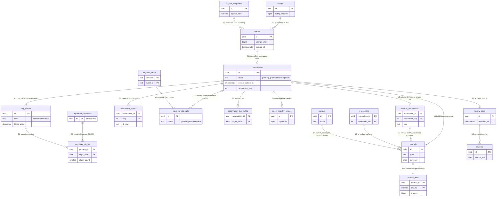

# Data model: Airbnb

データモデルの正本。規約、置き場所、全体の ER 図、滞在の道筋、横断の不変条件、この工程で決めたことを、ここに置く。領域ごとの表の目録（列・キー・索引・CHECK・RLS・分割・保持・量）と ER 図、Aurora の外の置き場所は [data-model/](data-model/) に置く。

- **列・制約・索引・置き場所の形の正本は、このファイルと `data-model/` の各ファイル**である。領域の文書は振る舞いの正本で、各文書の「data-model への項目」の節は提案の記録として残す。両者が食い違ったら、このデータモデルに合わせて領域の文書を直す。
- 実装の変更（開発リポジトリの `changes/`）でマイグレーションや形を変えるときは、同じ PR でここを更新する。移行の段（広げる → 移す → 縮める）と守る物は [delivery.md](delivery.md) の 5 節（[ADR-0082](../decisions/0082-pipeline-schema-ordering-and-config-governance.md)）。
- 方針の元は [ADR-0002](../decisions/0002-availability-representation-and-double-booking.md)（`stay_claims` と排他の制約）、[ADR-0004](../decisions/0004-booking-state-machine-and-holds.md)（予約のステートマシン）、[ADR-0005](../decisions/0005-payments-hold-capture-and-ledger.md)（預かりと複式簿記）、[ADR-0006](../decisions/0006-regulatory-night-cap-enforcement.md)（180 日の CHECK）、[ADR-0007](../decisions/0007-tenancy-host-accounts-and-rls.md)（単一のテナントと 3 種類の RLS）、[ADR-0008](../decisions/0008-multi-currency-and-fx.md)（通貨と為替）、[ADR-0073](../decisions/0073-key-layout-and-vault-envelope-encryption.md)（鍵と封筒の暗号化）、[ADR-0075](../decisions/0075-data-classes-and-retention.md)（データの区分と保持）、[ADR-0077](../decisions/0077-data-stores-layout-and-osaka-dr.md)（4 つの Aurora と大阪）。
- 「S1 の量」は S1（有効なリスティング 10 万、予約 6,000 件/日、検索 500 件/秒の最大、取り込む iCal 3 万）の**初期見積もり**である（[README.md](README.md) の 2 節、[capacity.md](capacity.md)）。登録の利用者は 300 万、ホストのアカウントは 4 万、届出住宅は 2 万と置いた。E20 の負荷試験で置き換える。
- 保持の期間の多くは**法務の確認待ち（L8。名簿と旅券は L3、本人確認は L3・L8、会計は L4・L5）**である。結論まで、表の「保持」は既定の値を書く。

2026-10-10 のデータモデルの工程で、索引だった文書を、表の目録と ER 図を持つ正本に書き直した（7 節）。

## 1. ファイルの構成

| ファイル | 領域 | 表の数 |
| --- | --- | --- |
| [data-model/accounts-hosts-and-cohosts.md](data-model/accounts-hosts-and-cohosts.md) | 利用者、プロフィール、パスキー、外部の ID、端末、セッションと更新のトークン、コードの確認、強い確認、送金の待ち、退会、ブロック、ホストのアカウント、成員と役割、リスティングの絞り、招待、事業者のホストの表示の情報（vault） | 18 |
| [data-model/listings-content-and-photos.md](data-model/listings-content-and-photos.md) | リスティング、改訂、状態の履歴、言語ごとの原文、機械翻訳、写真 | 6 |
| [data-model/location-and-places.md](data-model/location-and-places.md) | 正確な住所とピン（vault）、位置の組（vault）、行政の区域、税の区域、地名の辞書 | 6 |
| [data-model/availability-and-calendars.md](data-model/availability-and-calendars.md) | `stay_claims` と排他の制約（行の例）、保管の写し、滞在の規則、泊ごとの設定、複数の同じ部屋（S2）、tz データベース | 6 |
| [data-model/calendar-sync.md](data-model/calendar-sync.md) | 取り込む iCal、取り込みの区間、外部との食い違い、書き出しのアドレス、外部の泊の申告 | 5 |
| [data-model/search-and-snapshots.md](data-model/search-and-snapshots.md) | 順位の材料、区域の事前の値、混入の抜き取りの結果、保存した検索、閲覧の履歴 | 5 |
| [data-model/pricing-fees-and-taxes.md](data-model/pricing-fees-and-taxes.md) | 料金の規則、季節の規則、サービス料の表、税の表のバージョンと行、予約の泊ごとの税 | 6 |
| [data-model/bookings-and-quotes.md](data-model/bookings-and-quotes.md) | 見積もりの写し、予約、予約の事象、リクエストの断りの理由、入り方（vault） | 5 |
| [data-model/cancellations-and-changes.md](data-model/cancellations-and-changes.md) | キャンセルポリシーの表、ホストのキャンセルの罰の表、精算の記録、日程・人数の変更、やむをえない事情 | 5 |
| [data-model/payments-and-fx.md](data-model/payments-and-fx.md) | 決済の試行、支払いの方法、Webhook の inbox、返金、チャージバック、矛盾の記録、相場の写し、為替の上乗せ | 8 |
| [data-model/ledger-and-payouts.md](data-model/ledger-and-payouts.md) | 口座（22 の種類）、仕訳（31 の型）と行、残高、決着、為替の持ち高、送金と束と保留、営業日、明細、外部の明細、運用の返金、税の納付、送金の口座（vault）。米ドルの予約の仕訳の行の例 | 16 |
| [data-model/claims.md](data-model/claims.md) | 損害の請求、事象、証拠 | 3 |
| [data-model/regulatory-japan.md](data-model/regulatory-japan.md) | 届出住宅、書類、年度の数（CHECK）、泊の日、外部の泊、例外、自治体の規則、祝日、宿泊者名簿（vault） | 9 |
| [data-model/messaging-and-notifications.md](data-model/messaging-and-notifications.md) | スレッド、参加者、メッセージ、絞り込みの記録、訳文、雛形、予約の時刻に送る文、通報の証拠、通知と配信と設定 | 12 |
| [data-model/reviews.md](data-model/reviews.md) | レビューの組、レビュー、返答、公開のビュー、集計と冪等の記録 | 6（とビュー 1） |
| [data-model/trust-and-safety-and-kyc.md](data-model/trust-and-safety-and-kyc.md) | 規則と束と承認、評価の記録、案件、措置、異議、安全の事故、代わりの宿、方針への同意、禁止の一覧、本人確認のセッションと inbox、確認を求める表、本人確認の結果・同じ人の鍵・旅券の読み取りの結果（vault） | 18 |
| [data-model/pms-api-and-webhooks.md](data-model/pms-api-and-webhooks.md) | 開発者、PMS のアプリ、同意、トークン、`client_sequence`、冪等キー、一括のジョブ、API のバージョン、Webhook の購読・事象・配信・番号 | 13 |
| [data-model/security-audit-and-lifecycle.md](data-model/security-audit-and-lifecycle.md) | 主体の鍵、vault の読み出しの記録、監査の事象と鎖、保全の印、運用者の JIT の権限と見せた記録、照会と書き出し、保持と消し方の一覧 | 9（クラスタごとの写しを数えて 19） |
| [data-model/ops.md](data-model/ops.md) | outbox、スキーマの移行、デプロイ、アプリのバージョン、`legal.*` の変更、設定の表のバージョン、DR、キャパシティ、繁忙期、熱い日付、照合の実行と外れ、egress の拒否、見張りの利用者 | 14（同 22） |
| [data-model/stores.md](data-model/stores.md) | Aurora の外：Valkey の鍵、`avail:`・`prc:` の二進の形、S3、OpenSearch の対応表と `stay_ranges`、SNS・SQS と封筒、iCal の形、通知の中身、Webhook の本文、AppConfig と `legal.*` の全部、データレイク | — |

合計：Aurora の 188 表（名前の違う表は 170。`outbox`・`schema_migrations`・`audit_events`・`audit_chain_heads`・`legal_holds` は 4 つのクラスタに、`subject_keys` は vault と core に、`recon_runs`・`reconciliation_findings` は core と ledger にある）。core 111、ledger 22、content 39、vault 16。ER 図は 21 個（領域ごとに 19 個、4 節の全体図 1 個、5 節の滞在の道筋 1 個）。

## 2. 置き場所

| 置き場所 | 中身 | 見える範囲の分け方 | 詳細 |
| --- | --- | --- | --- |
| Aurora core（PostgreSQL 18、書き込み 1・読み出し 2。`btree_gist`・PostGIS） | アカウントとホストのアカウント、リスティング、位置から求めた値、地名、`stay_claims`、カレンダー、料金と税の表、見積もり、予約、キャンセルと変更、決済の試行、損害の請求、届出住宅と `regulated_nights`、PMS、レビューの集計、運用 | 本人・ホストのアカウント・予約の 2 者の FORCE RLS、公開の設定、サービス（3.3 節） | 3.1 節、各 `data-model/` |
| Aurora ledger（書き込み 1・読み出し 1。`rds.global_db_rpo = 60`） | 口座、仕訳、残高、決着、為替の持ち高、送金、送金の保留、照合 | ホストのアカウントは自分の口座の読み出しだけ。他はサービス。仕訳は `ledger_owner` が持ち追記だけ | 同上 |
| Aurora content（書き込み 1・読み出し 1） | メッセージ、通知、レビュー、T&S の規則・案件・措置、安全の事故、本人確認のセッション、Webhook、保存した検索と閲覧の履歴 | 本人・2 者・T&S と安全の役割・サービス | 同上 |
| Aurora vault（書き込み 1・読み出し 1。`vault` のサブネット） | 正確な住所と位置、位置の組、入り方、宿泊者名簿、旅券の読み取りの結果、本人確認の結果、同じ人の鍵、送金の口座、事業者のホストの表示の情報、主体の鍵、vault の読み出しの記録 | 持ち主のサービスの役割と用途の KMS の鍵。break-glass に含めない | 3.8 節 |
| Valkey | 空室と料金の写し、見積もりの写し、先着の印、セッションと PMS のトークンの写し、速さの数 | 失ってよい | [stores.md](data-model/stores.md) の 1・2 節 |
| OpenSearch | `listings_v<n>`（ずらした位置、`stay_ranges`、条件、価格の帯、順位の材料、言語ごとの文）、`places_v<n>`、`photo_hashes` | 索引に `hidden` の件と正確な位置を入れない。返す前に `listingVisible()` | 同 4 節 |
| S3 | 写真、メッセージの添付、書き出し、旅券の画像（`registry`）、書類、証拠、一括のジョブ、`records`、監査の写し（log-archive、Object Lock） | バケットと接頭辞ごとの KMS の鍵と役割 | 同 3 節 |
| SNS・SQS | クラスタごとの話題、消費者のキュー、`ledger-events.fifo` | 事象は ID・状態・数・金額だけ | 同 5 節 |
| AppConfig | `release.*`・`ops.*`・`legal.*`（別のアプリケーション）・`ts.*`・`models.*`・`rules.*`・辞書・提供者の能力 | `legal` は法務・財務の承認の記録つき | 同 9 節 |
| データレイク（data のアカウント） | outbox の事象の写し（V・C の欄と P の本文を落とし、ID を HMAC に）、`search_samples`、`rank_logs`、`ts_eval_sets`、モデルの登録簿 | 元の ID へ戻せない | 同 10 節 |

## 3. 規約

### 3.1 クラスタと表

DB の中のスキーマは `public` の 1 つ。表は持ち主のパッケージだけが書く（lint。[ADR-0001](../decisions/0001-platform-and-stack.md)）。見える範囲の記号は 3.3 節（**本** 本人、**ホ** ホストのアカウント、**2** 予約の 2 者、**公** 公開・公開の設定、**サ** サービス、**安** 安全・T&S の役割）、区分は 3.8 節。

**core（111）**

| 領域 | 表 | 見える範囲 | 区分 | ファイル |
| --- | --- | --- | --- | --- |
| アカウント | `users`、`guest_profiles`、`passkeys`、`federated_identities`、`devices`、`sessions`、`step_ups`、`user_blocks` | 本 | O・C | [accounts-hosts-and-cohosts.md](data-model/accounts-hosts-and-cohosts.md) |
| 同 | `refresh_tokens`、`verifications`、`account_erasure_jobs` | サ | S・C・M | 同 |
| ホストのアカウント | `host_accounts`、`host_members`、`host_member_listings`、`host_invitations`、`payout_waits` | ホ | O | 同 |
| 同 | `host_profiles` | 公（ビュー） | U | 同 |
| リスティング | `listings`、`listing_revisions`、`listing_texts`、`listing_photos`、`listing_events` | ホ（公開は `listings_public`） | U・O | [listings-content-and-photos.md](data-model/listings-content-and-photos.md) |
| 同 | `listing_translations` | サ（公開は関数） | U | 同 |
| 位置と地名 | `admin_areas`、`tax_zones`、`places`、`place_names` | 公 | U | [location-and-places.md](data-model/location-and-places.md) |
| 空室 | `stay_claims`、`listing_rules`、`calendar_days`、`listing_units` | ホ・2 | P・O・U | [availability-and-calendars.md](data-model/availability-and-calendars.md) |
| 同 | `stay_claims_archive` | サ | P | 同 |
| 同 | `tzdata_releases` | 公 | M | 同 |
| カレンダーの同期 | `ical_feeds`、`ical_intervals`、`calendar_conflicts`、`ical_exports`、`external_stay_declarations` | ホ | S・O・P | [calendar-sync.md](data-model/calendar-sync.md) |
| 検索 | `listing_daily_stats`、`area_stats`、`search_sample_checks` | サ | M | [search-and-snapshots.md](data-model/search-and-snapshots.md) |
| 料金と税 | `pricing_rules`、`seasonal_rules` | ホ | U | [pricing-fees-and-taxes.md](data-model/pricing-fees-and-taxes.md) |
| 同 | `service_fee_schedules`、`tax_table_versions`、`tax_rules` | 公 | F | 同 |
| 同 | `reservation_tax_nights` | 2 | P・F | 同 |
| 予約 | `quotes` | 本（ゲスト） | P・F | [bookings-and-quotes.md](data-model/bookings-and-quotes.md) |
| 同 | `reservations`、`reservation_events`、`request_declines` | 2 | P | 同 |
| キャンセルと変更 | `reservation_settlements`、`reservation_alterations` | 2 | F・P | [cancellations-and-changes.md](data-model/cancellations-and-changes.md) |
| 同 | `cancellation_policies`、`host_cancellation_fee_tables`、`extenuating_events` | 公 | U・F | 同 |
| 決済と為替 | `payment_attempts`、`refunds` | 2（`payment_attempts` はゲストだけ） | F | [payments-and-fx.md](data-model/payments-and-fx.md) |
| 同 | `payment_methods` | 本 | F・O | 同 |
| 同 | `payment_inbox`、`chargebacks`、`payment_anomalies` | サ | F | 同 |
| 同 | `fx_rate_snapshots`、`fx_markup_versions` | 公 | F | 同 |
| 損害の請求 | `damage_claims`、`damage_claim_events`、`damage_claim_evidence` | 2 | P | [claims.md](data-model/claims.md) |
| 日本の法令 | `regulated_properties`、`regulatory_documents`、`regulated_years`、`regulated_nights`、`regulated_external_nights`、`regulatory_exceptions` | ホ（数の書き込みはサ） | O・U | [regulatory-japan.md](data-model/regulatory-japan.md) |
| 同 | `municipal_rule_sets`、`jp_holidays` | 公 | U | 同 |
| レビューの集計 | `listing_review_stats`、`host_review_stats` | 公 | U | [reviews.md](data-model/reviews.md) |
| 同 | `review_stat_applications` | サ | M | 同 |
| 本人確認の表 | `kyc_gate_versions`、`kyc_gates` | 公 | U | [trust-and-safety-and-kyc.md](data-model/trust-and-safety-and-kyc.md) |
| PMS | `partner_developers`、`pms_apps`、`pms_grants`、`pms_grant_listings`、`bulk_jobs` | ホ・開発者 | O・S | [pms-api-and-webhooks.md](data-model/pms-api-and-webhooks.md) |
| 同 | `pms_tokens`、`pms_write_sequences`、`pms_idempotency_keys` | サ | S・M | 同 |
| 同 | `partner_api_versions` | 公 | U | 同 |
| 鍵と運用者 | `subject_keys`（`contact`）、`ops_grants`、`ops_reveals`、`legal_requests`、`legal_exports` | サ | S・A | [security-audit-and-lifecycle.md](data-model/security-audit-and-lifecycle.md) |
| 運用 | `deployments`、`app_versions`、`legal_config_changes`、`config_versions`、`dr_events`、`capacity_reviews`、`peak_season_plans`、`hot_date_events`、`egress_denials`、`sentinel_accounts`、`recon_runs`、`reconciliation_findings` | サ（`config_versions` は公） | M・A | [ops.md](data-model/ops.md) |
| 各クラスタに共通 | `outbox`、`schema_migrations`、`audit_events`、`audit_chain_heads`、`legal_holds` | サ | M・A | ops.md、security-audit-and-lifecycle.md |

**ledger（22）**

| 領域 | 表 | 見える範囲 | 区分 | ファイル |
| --- | --- | --- | --- | --- |
| 台帳 | `ledger_accounts`、`journal_lines`、`account_balances` | ホ（自分の支払いの口座の読み出し）・サ | F | [ledger-and-payouts.md](data-model/ledger-and-payouts.md) |
| 同 | `journals`、`escrow_settlements`、`fx_positions` | サ | F | 同 |
| 送金 | `payouts`、`payout_holds`、`host_statements` | ホ（読み出し）・サ | F | 同 |
| 同 | `payout_batches`、`external_statement_files`、`external_statement_lines`、`ops_refunds`、`tax_remittances` | サ | F | 同 |
| 同 | `bank_calendar` | 公 | U | 同 |
| 照合 | `recon_runs`、`reconciliation_findings` | サ | M | [ops.md](data-model/ops.md) |
| 各クラスタに共通 | `outbox`、`schema_migrations`、`audit_events`、`audit_chain_heads`、`legal_holds` | サ | M・A | 同 |

**content（39）**

| 領域 | 表 | 見える範囲 | 区分 | ファイル |
| --- | --- | --- | --- | --- |
| 検索 | `saved_searches`、`view_history` | 本 | O | [search-and-snapshots.md](data-model/search-and-snapshots.md) |
| メッセージ | `message_threads`、`thread_participants`、`messages`、`message_translations`、`scheduled_message_runs` | 2・参加者 | P | [messaging-and-notifications.md](data-model/messaging-and-notifications.md) |
| 同 | `message_templates`、`scheduled_messages` | ホ | O | 同 |
| 同 | `message_filter_events` | サ | M | 同 |
| 同 | `report_evidence` | 安 | P | 同 |
| 通知 | `notifications`、`notification_preferences` | 本 | O | 同 |
| 同 | `notification_deliveries` | サ | O | 同 |
| レビュー | `review_pairs`、`reviews`、`review_responses`（ビュー `reviews_public`） | 2・書いた本人（公開はビュー） | P・U | [reviews.md](data-model/reviews.md) |
| T&S | `ts_rules`、`ts_rule_bundles`、`ts_rule_approvals`、`rule_evaluations`、`ts_cases`、`moderation_actions`、`appeals`、`ts_blocklist_entries` | 安（本人は自分の措置と異議を関数で） | A | [trust-and-safety-and-kyc.md](data-model/trust-and-safety-and-kyc.md) |
| 安全 | `safety_incidents`、`rebooking_records` | 安 | P・A・F | 同 |
| 同意 | `policy_acknowledgements` | 本 | O | 同 |
| 本人確認 | `kyc_sessions` | 本 | O | 同 |
| 同 | `kyc_inbox` | サ | M | 同 |
| Webhook | `webhook_subscriptions`、`webhook_events`、`webhook_deliveries`、`webhook_listing_seqs` | 開発者・ホ（読み出し）・サ | S・M | [pms-api-and-webhooks.md](data-model/pms-api-and-webhooks.md) |
| 各クラスタに共通 | `outbox`、`schema_migrations`、`audit_events`、`audit_chain_heads`、`legal_holds` | サ | M・A | [ops.md](data-model/ops.md) |

**vault（16）**

| 領域 | 表 | 見える範囲 | 区分 | ファイル |
| --- | --- | --- | --- | --- |
| 位置 | `exact_locations`、`location_groups` | `readExactLocation` の関数（ホ・2 の確定の後） | V | [location-and-places.md](data-model/location-and-places.md) |
| 入り方 | `arrival_instructions` | `arrivalInfoVisible` の関数 | V | [bookings-and-quotes.md](data-model/bookings-and-quotes.md) |
| 名簿 | `guest_registry_entries`、`passport_capture_results` | ホ（`owner`・`full`・`registry_access`）・入力するゲスト | V | [regulatory-japan.md](data-model/regulatory-japan.md)、[trust-and-safety-and-kyc.md](data-model/trust-and-safety-and-kyc.md) |
| 本人確認 | `identity_verifications`、`person_keys` | サ（本人は水準だけ） | V | [trust-and-safety-and-kyc.md](data-model/trust-and-safety-and-kyc.md) |
| 送金の口座 | `payout_accounts` | ホ（`owner`）・サ（`payouts`） | V | [ledger-and-payouts.md](data-model/ledger-and-payouts.md) |
| 事業者 | `host_business_details` | ホ（`owner`）・サ | V | [accounts-hosts-and-cohosts.md](data-model/accounts-hosts-and-cohosts.md) |
| 鍵と監査 | `subject_keys`、`vault_access_log` | サ | S・A | [security-audit-and-lifecycle.md](data-model/security-audit-and-lifecycle.md) |
| 各クラスタに共通 | `outbox`、`schema_migrations`、`audit_events`、`audit_chain_heads`、`legal_holds` | サ | M・A | [ops.md](data-model/ops.md) |

- S3：core を `core-accounts`（利用者、セッション、端末、ホストのアカウント）と、置き場所の鍵（届出住宅に結んだリスティングは届出住宅の ID、他はリスティングの ID）のハッシュで 16 に分けた `core-stays`（リスティング、`stay_claims`、カレンダー、見積もり、予約、精算、届出住宅と `regulated_*`、PMS の書き込みの順序）に分ける。ledger は口座の持ち主のハッシュで分ける（[ADR-0078](../decisions/0078-stage-up-criteria-split-plan-and-unit-cost.md)。8 節）。

### 3.2 ID

| 種類 | 型 | 作り方 | 対象 |
| --- | --- | --- | --- |
| UUIDv7 | `uuid` | PostgreSQL 18 の `uuidv7()` | ほぼすべての行の ID。時刻の順に並び、分割の鍵にも使う |
| 乱数の UUID | `uuid` | `gen_random_uuid()` | `listing_photos.id`（写真の URL に出る。推測させない。D-3） |
| 口座の ID | `bigint` | `GENERATED ALWAYS AS IDENTITY` | `ledger_accounts.id`、`journal_lines.account_id` |
| 設定のバージョン | `integer` | 設定の表ごとの連番 | `service_fee_schedules.version`、`tax_table_versions.version`、`cancellation_policies.version`、`municipal_rule_sets.version`、`kyc_gate_versions.version`、`fx_markup_versions.version`、`ts_rule_bundles.rules_version` |
| 行のバージョン | `bigint` | 変化ごとに 1 | `listings.listing_version`・`calendar_version`・`search_version`、`listing_rules.rules_version`、`pricing_rules.pricing_version`、`reservations.version`、`stay_claims.version` |
| 秘密のハッシュ | `bytea`（32） | SHA-256 | セッション・更新のトークン、PMS のトークン、書き出しのトークン、招待のトークン |
| HMAC の引き | `bytea`（32） | HMAC-SHA256（Secrets Manager の鍵） | `email_hmac`、`phone_hmac`、`target_hmac`、`sub_hmac`、`bank_account_hmac`、`passport_number_hmac`、`address_hmac`、`url_host_hash`、`person_key` |
| 外の参照 | `text` | 外部の値 | 提供者の参照、`client_id`、`registration_number`、`municipality_code`（`char(6)`） |

- **主キーの列の名前は `id`**、他の表から指す列は `<単数形>_id`（`listing_id`、`reservation_id`、`quote_id`）。子の表は親の ID と連番の複合の主キー（`(reservation_id, seq)`）。領域の文書の `quote_id`（見積もりの主キー）は `quotes.id` と読む（D-2）。
- 外に見せる ID も UUIDv7 のまま（写真だけ乱数）。予約のコード（人が読む短い番号）は MVP に持たない。

### 3.3 見える範囲と RLS

単一のテナントで `tenant_id` を持たない（[ADR-0007](../decisions/0007-tenancy-host-accounts-and-rls.md)）。`app-api`・`partner-api`・`ops-api` は、トランザクションの初めに次の 4 つを必ず置く（ホストとして動かないときは、空の UUID `00000000-0000-0000-0000-000000000000` と `none`）。`current_setting` の `missing_ok` を使わない。

```sql
SET LOCAL app.actor_id        = '<user_id>';
SET LOCAL app.host_account_id = '<host_account_id or nil>';
SET LOCAL app.host_role       = '<owner|full|calendar_and_reservations|messages_only|pms|none>';
SET LOCAL app.pms_grant_id    = '<grant_id or nil>';
-- workers: SET LOCAL app.service = '<name>';
```

**全部の表で `ENABLE` と `FORCE ROW LEVEL SECURITY`**（表の持ち主の役割でも越えない。CI が `FORCE` のない表を拒む）。方針の型は 6 つ（D-19）。

```sql
-- 本人（本）
CREATE POLICY self_rw ON <t>
  USING      (<owner_col> = current_setting('app.actor_id')::uuid)
  WITH CHECK (<owner_col> = current_setting('app.actor_id')::uuid);

-- ホストのアカウント（ホ）。役割は DT-HST-001、リスティングの絞りは host_member_listings・pms_grant_listings
CREATE POLICY host_rw ON <t>
  USING      (host_account_id = current_setting('app.host_account_id')::uuid
              AND app_host_can(listing_id, '<action>'))
  WITH CHECK (host_account_id = current_setting('app.host_account_id')::uuid
              AND app_host_can(listing_id, '<action>'));

-- 予約の 2 者（2）
CREATE POLICY party_read ON <t> FOR SELECT
  USING (guest_id = current_setting('app.actor_id')::uuid
         OR (host_account_id = current_setting('app.host_account_id')::uuid
             AND app_host_can(listing_id, 'reservations_read')));

-- 公開の設定（公）。書き込みは config-loader の役割だけに GRANT
CREATE POLICY public_read ON <t> FOR SELECT USING (true);

-- サービス（サ）。表ごとの許可リストの役割だけ
CREATE POLICY svc_rw ON <t> TO <svc_role_1>, <svc_role_2> USING (true) WITH CHECK (true);

-- 安全・T&S（安）。JIT の権限を ops-api が確かめ、役割で絞る
CREATE POLICY ts_rw ON <t> TO ts_reviewer, safety_agent USING (true) WITH CHECK (true);
```

- `app_host_can(listing_id, action)` は `STABLE` の SQL の関数で、`app.host_role` と DT-HST-001 の表（[host-tools-and-api.md](host-tools-and-api.md) の 4.2 節）、成員の絞り（`host_member_listings`）、PMS の範囲と同意のリスティング（`pms_grant_listings`）を見る。アプリの `hostCan()` と同じ表を、表駆動テストで突き合わせる。
- RLS の列は行に持つ。子の表・関係の表は親の `host_account_id`・`guest_id` の**写し**を持つ（`stay_claims`、`reservation_events`、`reservation_tax_nights`、`calendar_days` など。D-15）。写しは作成の時に書き、変わらない。ホストのアカウントの移し替え（CS の手順）は、写しを同じトランザクションで書き直す。
- 公開の読み出しは、公開の列だけのビュー（`listings_public`、`host_profiles_public`、`reviews_public`）か関数を通す。`listings` を直接 `SELECT *` で公開しない。
- アプリの DB の役割は表の持ち主でなく、`BYPASSRLS` を持たない。`BYPASSRLS` はマイグレーションの役割だけ（ledger の仕訳の表は `ledger_owner` が持ち、`ledger_migrator` も書き換えられない）。
- 運用者は RLS を外さない。`ops-api` が案件に結んだ JIT の権限（`ops_grants`）を確かめ、持ち主のサービスの関数を呼ぶ（[ADR-0074](../decisions/0074-operator-access-reveal-and-audit-chain.md)）。
- [ADR-0007](../decisions/0007-tenancy-host-accounts-and-rls.md) の表の例の名前は、この文書の名前で読む：`payment_method_refs` → `payment_methods`、`check_in_instructions` → `arrival_instructions`（vault）。`guest_registry_entries` は本人でなく、[ADR-0067](../decisions/0067-guest-registry-in-vault.md) のホストのアカウントの名簿の権限（D-20）。

### 3.4 クラスタをまたぐ参照

- 別のクラスタの行を指す列には外部キーを張らない（論理の参照）。一致は outbox の冪等な消費と照合で守る（D-24）。

| 指す列 | 指される行 | 守り方 |
| --- | --- | --- |
| ledger の `journals.source_id`（予約・決済・送金）、`escrow_settlements.reservation_id`、`fx_positions` | core の `reservations`・`payment_attempts`・`refunds` | 予約と台帳の照合 R1〜R5（5 分） |
| core の `refunds.ledger_journal_id`、`payment_attempts` の結果 | ledger の `journals` | 照合 P2・R9 |
| ledger の `payouts.payout_account_id`、vault の `payout_accounts.host_account_id` | vault・core | `payouts` だけが読む。口座の変更は `payout_holds` の待ち |
| core の `reservations.ts_decision_id`、`quotes.ts_decision_id`、`listing_revisions.rule_evaluation_id`、`listing_events.moderation_action_id`、`reservation_events.moderation_action_id` | content の `rule_evaluations`・`moderation_actions` | 措置の適用の消費者（冪等）と照合 |
| content の `message_threads`・`review_pairs`・`webhook_subscriptions` の予約・リスティング・同意 | core の `reservations`・`listings`・`pms_grants` | 書く前に core で 2 者・範囲を確かめる |
| vault の `exact_locations`・`arrival_instructions`・`guest_registry_entries`・`host_business_details`・`identity_verifications` | core の `listings`・`reservations`・`host_accounts`・`users` | 読み出しの関数が core の可視性の判定の後に vault を読む |
| core の `stay_claims.source_ref`（`ical_block`・`api_block`） | 同じ core の `ical_intervals`・`pms_apps` | 文字の参照（同じクラスタでも種類で指す先が変わるため） |

### 3.5 日付と時刻

- **泊は物件の現地の日付**。`date` と `daterange` で持ち、タイムゾーンを持たない。泊の範囲は `daterange` の `[check_in, check_out)`（チェックインの日を含み、チェックアウトの日を含まない）。2026-12-30 にチェックインし 2027-01-02 に出る滞在は `[2026-12-30, 2027-01-02)` の 3 泊。
- `block_span = [check_in, check_out + prep_nights)`。準備の日は後ろにだけ持つ（[ADR-0002](../decisions/0002-availability-representation-and-double-booking.md)）。
- **瞬間は `timestamptz`（UTC）**。チェックイン・チェックアウトの時刻、締め切り、期限、送金の振り替え、キャンセルの境、レビューの期限は、`packages/stay-time` の 1 か所で `listings.time_zone`（IANA）から UTC に直し、計算に使った `tzdata_version` を同じ行に書く。存在しない現地の時刻は後ろへ、2 つある時刻は早いほう。
- 期限の判定は DB の `now()`。列の名前は時刻 `_at`、期限 `_due_at`・`_expires_at`・`_until`、日 `day`・`night_date`・`*_on`、長さは単位を付ける（`_minutes`、`_hours`、`_days`、`_bytes`、`_m`）。
- 180 日の数えの日 `night_date` は、正午から翌日の正午までの 1 日の始まりの日（[ADR-0065](../decisions/0065-regulated-nights-fiscal-year-and-external-overflow.md)）。年度は 4 月 1 日から。
- 運用の暦の日（`listing_daily_stats.day`、`bank_calendar.day`、送金の `business_day`）は日本時間。

### 3.6 金額と為替

- 金額は**通貨の最小単位の整数**の `bigint`（円は 1、米ドルはセント）。浮動小数点を使わない。どの金額の列も、同じ行の通貨の列（`currency`・`charge_currency`・`listing_currency`）と組で読む。小数の桁は ISO 4217（JPY 0、USD 2。3 桁の通貨は MVP で扱わない）。
- 率は基点の整数 `_bps`（1,500 = 15%。D-7）か百分率の整数 `_pct`。換算の相場は `numeric(20,10)`。
- **2 つの通貨**：リスティングの料金はホストのアカウントの通貨（MVP は円）。見積もりはリスティングの通貨で全部の行を計算して丸め、**合計だけ**を 1 回換算し、行は大きい行から 1 単位ずつの按分で決める（`packages/fx`）。見積もりと予約は両方の通貨の額を持つ（`listing_total`・`charge_total`、`quotes.lines` の行ごとの両方の額）。
- **相場の写し**：`fx_rate_snapshots`（ID、組、仲値、上乗せ、適用の相場、取得の時刻）。見積もりがその ID を固定し、15 分の間は変わらない。2 時間より古い写しは新しい見積もりに使わない（[ADR-0043](../decisions/0043-fx-rate-snapshots-markup-and-staleness.md)）。
- キャンセル・返金は払った通貨と額（見積もりの行の請求の通貨の按分の額）で計算し、換算し直さない。損害の請求は円で請求する。

### 3.7 台帳

- **複式簿記**：仕訳の行は借方を正、貸方を負で持ち、1 つの仕訳の行の和は 0（遅延の制約のトリガー）。**1 つの仕訳は 1 つの通貨**（行の口座の通貨 = 仕訳の通貨のトリガー）。通貨の間は `fx_clearing:<ccy>` の口座で結ぶ（[ADR-0008](../decisions/0008-multi-currency-and-fx.md)）。全口座の和は通貨ごとに 0。
- **追記だけ**：`journals`・`journal_lines`・`escrow_settlements` は `UPDATE`・`DELETE` できない（権限とトリガー）。誤りは仕訳の型（型 31、承認つきの `ops_adjustment`）で直す。
- **残高は射影**：`account_balances` は仕訳と同じトランザクションで更新し、負にならない口座は条件つきの更新で守る。直接書き換えない。
- **冪等**：`journals (source_type, source_id, seq, event, currency)` の一意。同じ事象を何度受けても仕訳は 1 つ（通貨の違う決着は同じ鍵の 2 つの仕訳。D-14）。
- **決着は番号ごとに 1 つ**：`escrow_settlements (reservation_id, settlement_seq)` の主キー。`settlement_seq` は `booking` が予約の行のロックの中で上げ、`ledger` は従うだけ（[ADR-0047](../decisions/0047-settlement-seq-and-escrow-settlement.md)）。
- 口座の種類 22 と仕訳の型 31 は固定（[ADR-0046](../decisions/0046-chart-of-accounts-and-journal-types.md)）。一覧は [ledger-and-payouts.md](data-model/ledger-and-payouts.md) の 2 節。型の追加は ADR の更新から。
- `legal.*` で動く仕訳（`tax_payable` への振り替え、型 30）は `journals.legal_config_version` を記録する。

### 3.8 区分と暗号化

区分（[ADR-0075](../decisions/0075-data-classes-and-retention.md)）：**S** 秘密、**V** 金庫、**C** 連絡先、**P** 2 者、**O** 本人、**U** 公開、**F** お金、**A** 監査、**M** 運用、**L** 分析。ログ・トレースに出してよいのは ID、状態、理由のコード、数、金額（F）まで。

**vault の行の封筒の暗号化**（`exact_locations`、`location_groups`、`arrival_instructions`、`guest_registry_entries`、`identity_verifications`、`payout_accounts`、`host_business_details`。[ADR-0073](../decisions/0073-key-layout-and-vault-envelope-encryption.md)）

| 列 | 形 |
| --- | --- |
| `ciphertext` | AES-256-GCM の暗号文と認証タグ。中身は欄の JSON |
| `nonce` | 行ごとの 96 ビットの乱数 |
| `key_version` | `subject_keys (purpose, subject_type, subject_id, key_version)` の主体の鍵 |
| `aad_version` | 追加の認証データの列の組のバージョン |
| 追加の認証データ | 用途、主体、行の ID、`aad_version`。行を別の主体の行へ写しても復号できない |

| 用途（`purpose`） | 主体 | KMS の鍵 | 復号できる役割 | 表 |
| --- | --- | --- | --- | --- |
| `location` | リスティング、位置の組 | `kms-vault-location` | `listings` | `exact_locations`、`location_groups`、`arrival_instructions`（D-33） |
| `registry` | 届出住宅 × 年度 | `kms-vault-registry` | `compliance-jp` | `guest_registry_entries`、S3 の `registry` |
| `kyc` | 利用者 | `kms-vault-kyc` | `identity` の本人確認の Worker | `identity_verifications` |
| `bank` | ホストのアカウント | `kms-vault-bank`（文脈 `payout-account`） | `payouts` | `payout_accounts` |
| `business_address` | ホストのアカウント | `kms-vault-bank`（文脈 `business-address`） | `identity` | `host_business_details` |
| `contact` | 利用者 | `kms-contact-pii` | `identity`、`notifier` | core の `users.email_ct`・`phone_ct` |

**列の暗号**（`*_ct`）：1 つの `bytea` に `0x01`（形のバージョン）‖ 鍵のバージョン（4 バイト）‖ nonce（12 バイト）‖ 暗号文と認証タグ を詰める。追加の認証データは（表、列、行の主キー）。`users.email_ct`・`phone_ct`（主体の鍵 `contact`）、`audit_events.reason_ct`・`ops_grants.reason_ct`（`kms-audit` で包んだクラスタの鍵）、`ical_feeds.url_ct`（`kms-pms-secrets`、文脈 `ical-url`。D-30）。

- **HMAC の引き**の列（3.2 節）は完全一致の検索だけに使う。
- **包んだ秘密**：Webhook の秘密（`webhook_subscriptions.secret_wrapped`、`kms-pms-secrets`）。
- **持たないもの**：カード番号とセキュリティコード（提供者のトークン、ブランド、下 4 桁、有効期限の年月、提供者のカードの指紋だけ）、パスワード、本人確認の書類と顔の画像（提供者だけ）、iCal の `SUMMARY`・`DESCRIPTION`。
- **消去は鍵の破棄**：主体の鍵の行の `wrapped_key` を消す。名簿は年度の鍵、位置はリスティングの鍵（[security-audit-and-lifecycle.md](data-model/security-audit-and-lifecycle.md) の 3 節）。

### 3.9 バージョンと番号

| 値 | 置き場所 | 進め方 | 使い方 |
| --- | --- | --- | --- |
| `listing_version` | `listings` | 改訂の入れ替え、チェックインの時刻、即時予約、キャンセルポリシー | 見積もりの確かめ（409 `quote_expired`） |
| `rules_version` | `listing_rules` | 規則の変更 | 同上 |
| `pricing_version` | `pricing_rules` | 料金の規則・季節・日付の上書き | 写しの古さ（見積もりを無効にしない） |
| `calendar_version` | `listings` | `stay_claims`・`calendar_days`・`listing_rules` の変化（一括でも 1 回） | `avail:` の写し、書き出しの `ETag`、照合 R6 |
| `search_version` | `listings` | 上のどれか・状態・順位の材料 | 索引の外部のバージョン（`external_gte`） |
| `reservations.version` | 予約 | 遷移ごとに 1 | `expected_version`、PMS の `If-Match` |
| `settlement_seq` | 予約、精算、台帳 | 変更の受諾・release の後のキャンセル | 決着の一意 |
| `cancellation_policy_code`・`_version` | ポリシーの表、見積もり、予約 | 表の新しいバージョン | 予約の時のバージョンで返金（D-4） |
| `tax_table_version`・`service_fee_schedule_version`・`fx_snapshot_id` | 見積もり | 表の新しいバージョン、1 時間ごとの相場 | 額の再現 |
| `legal_config_version` | AppConfig の `legal`、見積もり、予約、仕訳、`regulated_nights` | 配信ごと | 法令の値の記録 |
| `rules_version` | `ts_rule_bundles` | 束ごと | 規則の評価の再現 |
| `tzdata_version` | 瞬間の列のある行 | tz データベースの更新 | `tz-recompute` |
| `client_sequence` | `pms_write_sequences` | PMS が送る | 古い書き込みを拒む |
| `listing_seq` | `webhook_listing_seqs` | 事象ごと | Webhook の順序と飛びの検出 |
| `schema_version` | 事象の封筒 | 互換でない変更 | 消費者の読み分け |
| `key_version` | 主体の鍵 | 鍵を回すたび | 復号の鍵の選び |

- 空室・予約の状態・お金・法令の上限の規則をフラグにしない。コードのバージョンとして出す（[AGENTS.md](../../AGENTS.md)）。
- 設定の表（`service_fee_schedules`、`cancellation_policies`、`host_cancellation_fee_tables`、`tax_table_versions`・`tax_rules`、`municipal_rule_sets`、`fx_markup_versions`、`kyc_gate_versions`・`kyc_gates`）の行は変えない。誤りは新しいバージョンで直す（守る物）。

### 3.10 分割・保持・削除

| 表 | 分割の鍵（S1） | DB に置く期間 | その後 |
| --- | --- | --- | --- |
| `journal_lines` | `journal_id`（UUIDv7 の月の境） | 2 年 | `records` へ Parquet で写して `DETACH`（10 年） |
| `reservation_events` | `reservation_id`（月） | 2 年 | `records` へ写して `DROP`（10 年） |
| `messages` | `thread_id`（月） | 区切りの全部のスレッドの `retain_until`（チェックアウトから 3 年）まで | `DROP` |
| `stay_claims_archive` | `released_at`（月） | 10 年 | `records` へ写して `DROP` |
| `notifications`・`notification_deliveries` | `source_event_id`（日） | 90 日 | `DROP` |
| `refresh_tokens` | `issued_at`（日） | 30 日 | `DROP` |
| `rule_evaluations` | `id`（月） | 400 日 | `DROP` |
| `message_filter_events` | `id`（月） | 90 日 | `DROP` |
| `message_translations` | `created_at`（日） | 30 日 | `DROP` |
| `listing_daily_stats` | `day`（月） | 400 日 | `DROP` |
| `search_sample_checks` | `sampled_at`（日） | 30 日 | `DROP` |
| `webhook_events`・`webhook_deliveries` | `id`・`created_at`（日） | 7 日 | `DROP` |
| `audit_events`・`vault_access_log` | `id`（月） | 13 か月 | S3 の Object Lock に 7 年、区切りを `DROP` |
| `outbox` | `id`（日） | 送って 3 日 | `DROP` |
| 分割しない表 | — | 各表の「保持」 | `retention-sweeper` の日次の削除（`legal_holds` を飛ばす） |

- **親の ID の範囲で分ける**（D-21）：子の表の一意の制約が分割の鍵（親の UUIDv7）を含むので、冪等の一意を全期間に張れる。1 つの親の子は 1 つの区切りに入る。
- **分割しない表**：冪等の一意や排他の制約を全期間に効かせる表（`stay_claims`、`journals`、`payment_inbox`、`kyc_inbox`、`reservations`、`regulated_nights`、`pms_write_sequences`）。
- 分割は `pg_partman` で先に作る（日 14 個、月 3 個）。分割の表へは外部キーを張らない（`journal_lines → journals` は張る。親が分割でないため）。
- 論理の削除の列は状態で表すものだけ（`listings.state = 'archived'`、`users.status = 'deleted'`、`stay_claims.status = 'released'`、`reviews.removed_at`）。他は行を消すか、鍵を破棄する。
- 保持と消し方の一覧は [security-audit-and-lifecycle.md](data-model/security-audit-and-lifecycle.md) の 3 節。

### 3.11 命名と型

- 表は英語の複数形の `snake_case`、列は `snake_case`。SQL の予約語と関数名（`date`、`when`、`then`、`key`、`count`、`at`）を列の名前にしない（D-8）。
- 主体の列は `<役>_type`・`<役>_id`（`actor_type`・`actor_id`、`subject_type`・`subject_id`、`created_by_type`・`created_by_id`）。人だけを指す列は `*_by`・`*_id`（`approved_by`、`reviewer_id`、`recipient_id`、`sender_id`、`assignee_id`）。
- 状態の列は領域の文書の言葉（`state`：リスティング、予約、変更、損害の請求。`status`：`stay_claims`、利用者、送金、試行）。値は小文字の `snake_case`。
- 列挙は `text` と `CHECK (… IN (…))`（PostgreSQL の enum を使わない。値を足すマイグレーションを広げる段だけにするため）。
- 形の決まった入れ子で検索しないもの（`lines`、`rules`、`condition`、`basis`、`args`、`facts_snapshot`）は `jsonb`。形は開発リポジトリの Zod で検証してから書く。
- 配列は上限の小さい集合（曜日、設備のコード、写真の並び、範囲）だけ。
- 範囲は `daterange`（泊）、空間は PostGIS の `geography`（SRID 4326）。

## 4. 全体の ER 図

領域をまたぐ主な関係だけを描く。列は主キーと主な列だけで、詳細は各領域の図にある。クラスタをまたぐ線は論理の参照（3.4 節）。

- どの ER 図も、関係の記法は `||--o{`・`||--|{`・`}o--o{`・`|o--||`・`||--o|` の 5 つだけを使う。外部キーが NULL を許す関係（親のない子がありうる）は `||--o{`・`||--o|` で描き、名前に `(nullable)` と書く。作成と同じトランザクションで作る 1 対 1 の行は `||--o|` で描き、図の下の注に「実際は常に 1 つ」と書く。
- 属性は `型 名前 PK|FK|UK "注"` の形で、型は 1 語（配列は `text_array` のように書く）。主キーで外部キーでもある列は `PK "also FK"` と書く。

```mermaid
erDiagram
    users ||--o| host_accounts : "owns (MVP one)"
    host_accounts ||--|{ host_members : "members and roles"
    users ||--o{ host_members : "member of"
    host_accounts ||--o{ listings : "lists"
    regulated_properties ||--o{ listings : "registered as (Japan) (nullable)"
    listings ||--o| exact_locations : "exact pin (vault)"
    listings ||--|{ listing_revisions : "content"
    listings ||--o| listing_rules : "stay rules"
    listings ||--o| pricing_rules : "prices"
    listings ||--o{ stay_claims : "nights claimed"
    listings ||--o{ ical_feeds : "imports"
    listings ||--o{ quotes : "priced"
    quotes ||--o| reservations : "used once"
    users ||--o{ reservations : "books as guest"
    reservations ||--|{ stay_claims : "claim_group"
    regulated_properties ||--o{ regulated_nights : "counted days"
    regulated_properties ||--o{ regulated_years : "cap per fiscal year"
    reservations ||--o{ payment_attempts : "paid"
    reservations ||--o{ reservation_settlements : "cancel and alter amounts"
    reservations ||--o{ escrow_settlements : "settled once per seq (ledger)"
    journals ||--|{ journal_lines : "lines (ledger)"
    ledger_accounts ||--o{ journal_lines : "posted to (ledger)"
    host_accounts ||--o{ payouts : "paid out (ledger)"
    reservations ||--o| message_threads : "thread (content)"
    reservations ||--o| review_pairs : "reviews (content)"
    reservations ||--o{ guest_registry_entries : "registry (vault)"
    reservations ||--o{ damage_claims : "claims"
    moderation_actions ||--o{ listing_events : "applied as"
    pms_grants ||--o{ webhook_subscriptions : "subscribes (content)"
    host_accounts ||--o{ pms_grants : "consents"
    subject_keys ||--o{ guest_registry_entries : "wraps (vault)"

    users {
        uuid id PK
        text status
        bytea email_hmac UK "partial live"
    }
    host_accounts {
        uuid id PK
        uuid owner_user_id UK
    }
    host_members {
        uuid id PK
        text role
    }
    listings {
        uuid id PK
        text state
        bigint calendar_version
        text time_zone
    }
    regulated_properties {
        uuid id PK
        text regime
        text verification_status
    }
    exact_locations {
        uuid listing_id PK
        bytea ciphertext
    }
    listing_revisions {
        uuid id PK
        text state
    }
    listing_rules {
        uuid listing_id PK
        bigint rules_version
    }
    pricing_rules {
        uuid listing_id PK
        bigint pricing_version
    }
    stay_claims {
        uuid id PK
        daterange block_span "EXCLUDE"
        uuid claim_group
        text kind
    }
    ical_feeds {
        uuid id PK
    }
    quotes {
        uuid id PK
        timestamptz expires_at
    }
    reservations {
        uuid id PK
        uuid quote_id UK
        text state
        int settlement_seq
    }
    regulated_nights {
        uuid property_id PK
        date night_date PK
    }
    regulated_years {
        uuid property_id PK
        smallint fiscal_year PK
    }
    payment_attempts {
        uuid id PK
        text idempotency_key UK "with provider"
    }
    reservation_settlements {
        uuid reservation_id PK
        int settlement_seq PK
        text kind PK
    }
    escrow_settlements {
        uuid reservation_id PK
        int settlement_seq PK
    }
    journals {
        uuid id PK
        text source_type UK "idempotency key"
    }
    journal_lines {
        uuid journal_id PK
        smallint line_no PK
    }
    ledger_accounts {
        bigint id PK
        text kind
    }
    payouts {
        uuid id PK
        date business_day
    }
    message_threads {
        uuid id PK
        uuid reservation_id UK
    }
    review_pairs {
        uuid id PK
        uuid reservation_id UK
    }
    guest_registry_entries {
        uuid id PK
        int key_version
    }
    damage_claims {
        uuid id PK
        text state
    }
    moderation_actions {
        uuid id PK
        text kind
    }
    listing_events {
        uuid listing_id PK
        int seq PK
    }
    pms_grants {
        uuid id PK
    }
    webhook_subscriptions {
        uuid id PK
    }
    subject_keys {
        text purpose PK
        text subject_id PK
        int key_version PK
    }
```



- `quotes ||--o| reservations`：見積もりは 1 回だけ使える。使われない見積もりは 90 日で消える。
- `reservations ||--|{ stay_claims`：作成と同じトランザクションで `hold` か `request` の行を作る。変更の応答の間は同じ組の行が 2 つ有効。
- `reservations ||--o{ escrow_settlements`：決着は番号ごとに 0 か 1（進行中・支払いの前の取り消しは 0）。
- `listings ||--o| listing_rules`・`pricing_rules`：リスティングの作成と同じトランザクションで既定の行を作るので、実際は常に 1 つ。

## 5. 滞在の道筋

リスティングから、見積もり、仮押さえ、予約、支払い（オーソリと売上の確定、為替）、仕訳、チェックイン、release、送金、レビューまでで、どの表のどの行が、どのトランザクションで書かれるかを概念の図にする。線の名前の記号はトランザクションの順（Q は見積もり、C は core、L は ledger、V は vault、X は外部の事象、N は content）。180 日の数え（`regulated_nights`）は C1 の同じトランザクションで並んで書く。



| 段 | トランザクション | 書く行 | 守るもの |
| --- | --- | --- | --- |
| Q1 | core の 1 つ（`pricing`） | `quotes`（15 分、両方の通貨の行、`fx_snapshot_id`、各バージョン、`ts_decision_id`）。content の `rule_evaluations`（`booking.create`） | 見せた額で請求する（NFR-015） |
| 前 | Valkey | `avail:` を読み、`claim:{listing_id}:{check_in}` を `SET NX`（失ってよい） | DB に届く予約を絞る（[ADR-0036](../decisions/0036-hot-date-admission-and-hold-limits.md)） |
| C1 | core の 1 つ（`lock_timeout` 200ms） | `regulated_properties` を `FOR UPDATE` → `listings` を `FOR UPDATE` → 期限の切れた `stay_claims` を外す → `reservations`（`pending_payment`・`requested`、期限の列）→ `stay_claims`（`hold`・`request`）→ `regulated_nights`・`regulated_years` → `reservation_tax_nights` → `reservation_events` → `listings.calendar_version + 1` → `outbox`（`reservation.created`、`listing.calendar_changed`） | 排他の制約（409 `dates_unavailable`）、年度の CHECK（409 `regulatory_cap_reached`）、`(guest_id, idempotency_key)`・`quote_id` の一意 |
| C2 | core の 1 つ（`payments`） | `payment_attempts`（`pending`）をコミットしてから提供者へ。冪等キー `<reservation_id>:capture`（リクエストは `:authorize`） | 依頼は 1 回 |
| X1・C3 | core | `payment_inbox`（一意）→ 照会 → `payment_attempts`（`succeeded`）→ `transition(payment_succeeded)` → `reservations`（`confirmed`、`check_in_at`・`check_out_at`・`payout_release_at`）・`stay_claims`（`reservation`）・`reservation_events`・`outbox`（`reservation.confirmed`） | 結果は 1 回（`outcome_emitted_at`）。DT-BKG-001 の行 6 |
| L1 | ledger の 1 つ | `ledger_accounts`（`guest_funds_held:R` を作る）、`journals`（型 1 `hold`、請求の通貨）、`journal_lines`、`account_balances`、`fx_positions` | 冪等キー `(reservation, R, 0, hold, <ccy>)`、和 0 |
| X2・L | ledger | `external_statement_files`・`external_statement_lines`、`journals`（型 24 `psp_settlement`、2 つの通貨） | 3 者の照合 R9 |
| V1 | vault の 1 つ（届出住宅だけ） | `guest_registry_entries`（年度の主体の鍵）、S3 の `registry`、`passport_capture_results`、`vault_access_log`。core の `reservations.registry_status = 'complete'` | 名簿は vault だけ。完了まで入り方を出さない |
| C4 | core（`deadline-runner`） | `reservations`（`in_stay`、行 25）。`check_in_at + 24h` で行 28：`payout_released_at`、`outbox`（`reservation.payout_release_due`） | チェックインの前の release 0（NFR-008） |
| L2 | ledger の 1 つ | `journals`（型 3 `release` と型 7 `fx_conversion`）・`journal_lines`・`escrow_settlements`（`(R, seq)`）・`account_balances`・必要なら型 23 の相殺・`outbox`（`ledger.released`） | 決着は 1 回、決着の後の `guest_funds_held` は 0 |
| L3 | ledger（日次） | `journals`（型 25 `fx_realize`）、`fx_positions.realized_journal_id` | `fx_clearing` は通貨ごとに 0 に戻る |
| L4・L5 | ledger（銀行の営業日 09:00・09:30） | `payout_holds` と core の `payout_waits` を読む → `payout_batches`（`bank_request_ref` を先に保存）→ `payouts`（`pending`）・型 11 → 依頼 → `payouts`（`paid`）・型 12 | 1 ホストのアカウントに 1 日 1 つ、待ちと保留の間は送らない |
| C5・N1 | core と content | `reservations`（`completed`、行 27）→ `outbox` → `review_pairs`（`deadline_at` = 現地の日付で 14 日） | 組は予約に 1 つ |
| N2 | content の 1 つ | `reviews`（`submitted_at`）→ 2 人目なら `reveal_pair`（`revealed_at`）→ `outbox`（`review.revealed`）→ core の `listing_review_stats`（`review_stat_applications` で冪等） | 同時の公開、片方だけの公開 0（NFR-009） |

- キャンセル（release の前）は C の 1 つのトランザクションで、`reservations`（`cancelled`）、`stay_claims`（`released`）、未来の `regulated_nights` の取り消し、`reservation_settlements`（DT-CXL-001 の行と額）、`outbox`（`reservation.cancelled`）を書く。ledger は型 4 `settle`（と型 7）と `escrow_settlements` を 1 つのトランザクションで書き、`ledger.refund_due` で `refunds` を作る。
- 金額の例（円と米ドル）の行は [ledger-and-payouts.md](data-model/ledger-and-payouts.md) の 3 節、排他の制約の行の例は [availability-and-calendars.md](data-model/availability-and-calendars.md) の 3 節。

## 6. 横断の不変条件

| 不変条件 | 守り方（DB・形式・試験） | 根拠 |
| --- | --- | --- |
| **二重の予約なし**：同じリスティング（S2 は同じ部屋）の異なる組の有効な `block_span` は重ならない | `stay_claims_no_overlap` の `EXCLUDE USING gist (listing_id WITH =, claim_group WITH <>, block_span WITH &&) WHERE (status = 'active')`、`block_span` の CHECK、`claim_group` の CHECK。Valkey の印と索引は正本にしない。照合 R1（5 分）。守る物 | [ADR-0002](../decisions/0002-availability-representation-and-double-booking.md)、[ADR-0020](../decisions/0020-multi-unit-listings-per-unit-claims.md) |
| **準備の日を守る** | `block_span = [check_in, check_out + prep_nights)` の CHECK と排他の制約。ブロックは準備の日 0 | ADR-0002 |
| **予約を作るのは `reserveStay` だけ** | `stay_claims` の書き込みの権限は `availability_writer` だけ、`kind = 'reservation'` は `confirmClaim`・`swapClaims` だけが作る。照合 B1〜B3 | [ADR-0004](../decisions/0004-booking-state-machine-and-holds.md) |
| **予約は同じ操作から 1 つ、見せた額で請求する** | `reservations (guest_id, idempotency_key)`・`(quote_id)` の一意。`charge_total`・`charge_currency` = 見積もり（照合 B4、P5） | [ADR-0037](../decisions/0037-quote-binding-and-idempotency.md)、[ADR-0008](../decisions/0008-multi-currency-and-fx.md) |
| **予約の状態は遷移の関数と決定表だけ** | `reservation_events.dt_row`（DT-BKG-001 の 35 行）、`(reservation_id, idempotency_key)` の一意、状態の列の更新の権限 | [ADR-0035](../decisions/0035-booking-decision-table-and-deadlines.md) |
| **180 泊の上限を超えない** | `regulated_years` の `CHECK (nights_used + external_used <= cap)`、`regulated_nights (property_id, night_date)` の主キー、予約と同じトランザクション、届出住宅 → リスティングのロックの順。外部の泊の超過は `external_overflow`（CHECK の外）。照合 G1〜G4。守る物 | [ADR-0006](../decisions/0006-regulatory-night-cap-enforcement.md)、[ADR-0065](../decisions/0065-regulated-nights-fiscal-year-and-external-overflow.md) |
| **自治体の規則で禁じた泊に泊めない** | `municipal_rule_sets` のバージョンを泊の日ごとに当てる `checkMunicipalRules`（409 `regulatory_day_blocked`）。規則の変更は既存の予約を取り消さず `regulatory_exceptions` に一覧 | [ADR-0066](../decisions/0066-municipal-rule-sets.md) |
| **`settlement_seq` ごとに決着は 1 つ** | `escrow_settlements (reservation_id, settlement_seq)` の主キー、FIFO の事象、遅れた決着は `superseded`。照合 R3・R4。守る物 | [ADR-0047](../decisions/0047-settlement-seq-and-escrow-settlement.md) |
| **仕訳は通貨ごとに釣り合う、全口座の和 0** | `journal_lines` の遅延の制約のトリガー、通貨の一致のトリガー、`amount <> 0`。照合 R6 | [ADR-0005](../decisions/0005-payments-hold-capture-and-ledger.md)、[ADR-0046](../decisions/0046-chart-of-accounts-and-journal-types.md) |
| **仕訳は追記だけ、1 つの事象に 1 つの仕訳** | `ledger_owner` の表、`UPDATE`・`DELETE` の拒否、`journals` の冪等の一意 | ADR-0005、[ADR-0082](../decisions/0082-pipeline-schema-ordering-and-config-governance.md) |
| **チェックインの前に release しない** | release は `payout_release_at`（`check_in_at + 24h`）の後の行 28 だけ。照合 R5（SEV1 の候補） | [ADR-0048](../decisions/0048-release-payout-batching-and-holds.md) |
| **待ちと保留の間は送らない、1 日 1 回** | `payout_holds`（`wait`・`hold`）と core の `payout_waits` を束の前に読む。`payouts (host_account_id, business_day)` の一意 | ADR-0048、[ADR-0072](../decisions/0072-sensitive-operations-payout-holds-and-account-deletion.md) |
| **返金は払った通貨と額を超えない、決着の番号ごとに 1 回** | `reservation_settlements` の CHECK（`refund + retained = paid`）、`refunds (reservation_id, settlement_seq)` の部分一意、冪等キー `<reservation_id>:refund:<seq>` | [ADR-0039](../decisions/0039-cancellation-policy-table-and-refund-decision-table.md)、[ADR-0044](../decisions/0044-refunds-to-original-method.md) |
| **返金は予約の時のポリシーのバージョンで計算する** | `reservations.cancellation_policy_code`・`_version`、ポリシーの表の行を変えない。照合 C3 | ADR-0039 |
| **決済の結果は 1 回、照会で確かめてから** | `payment_inbox` の主キー、`payment_attempts (provider, idempotency_key)` の一意、終わった状態を動かさないトリガー、`outcome_emitted_at` | [ADR-0042](../decisions/0042-payment-adapter-contract-and-capture-timing.md) |
| **カード番号をどこにも持たない** | カード番号の列を作らない。inbox の本文はカードの情報を含まない形だけを `records` に置く。ログの検査 | ADR-0005 |
| **正確な住所は `readExactLocation` だけ** | `exact_locations` は vault で、`kms-vault-location` の `Decrypt` は `listings` の役割だけ。`exactLocationVisible()`（確定から `check_out_at + 7 日`）と `vault_access_log` を同じトランザクション。core・索引・通知・事象に正確な位置の列がない（スキーマの検査） | [ADR-0007](../decisions/0007-tenancy-host-accounts-and-rls.md)、[ADR-0014](../decisions/0014-approximate-location-offset.md)、[ADR-0016](../decisions/0016-geocoding-adapter-and-confirmed-pin.md) |
| **ずらした位置は作り直さない** | `location_groups.approx_lat`・`approx_lng` の更新を拒むトリガー、組の移動は 365 日に 3 回（`listings.location_group_moves` の CHECK） | ADR-0014 |
| **旅券の番号と画像は vault だけ** | 名簿の項目と旅券の画像は `guest_registry_entries` と S3 の `registry`（年度の主体の鍵）。`identity` の表・ログ・事象に残さない。署名つきの URL を出さない | [ADR-0063](../decisions/0063-passport-capture-for-guest-registry.md)、[ADR-0067](../decisions/0067-guest-registry-in-vault.md)、[ADR-0073](../decisions/0073-key-layout-and-vault-envelope-encryption.md) |
| **レビューは同時に公開する** | `reveal_pair` の 1 つの関数、組の行のロック、`revealed_at` の 1 回、公開の後の更新を拒むトリガー、`reviews` は書いた本人の RLS と `reviews_public` だけ | [ADR-0055](../decisions/0055-review-pairs-and-simultaneous-reveal.md) |
| **PMS の書き込みは `client_sequence` の順** | `pms_write_sequences (app_id, listing_id, stream)` の主キーと `WHERE last_sequence < $new` の更新（書き込みと同じトランザクション）。POST は `pms_idempotency_keys`。守る物 | [ADR-0069](../decisions/0069-pms-availability-and-price-push-and-bulk-operations.md) |
| **PMS は同意の範囲だけ** | `app.pms_grant_id` と `pms_grant_listings` の RLS、経路の `requiredScopes`、応答の欄の許可の一覧。取り消しは 5 秒 | [ADR-0068](../decisions/0068-pms-oauth-apps-scopes-and-rate-limits.md) |
| **Webhook はリスティングごとに順に、個人のデータなしで** | `webhook_deliveries` の（購読、リスティング）ごとの `in_flight` の部分一意、`listing_seq`、本文の欄の許可の一覧 | [ADR-0070](../decisions/0070-webhooks-signing-delivery-and-ordering.md) |
| **本人・ホスト・2 者のデータはその相手だけ** | 全表の FORCE RLS と `SET LOCAL`、CI の RLS の一覧の検査、RLS の性質ベーステスト | ADR-0007 |
| **措置は記録してから効く、ML は決定でない** | `moderation_actions` を書いた後に持ち主の関数を呼ぶ。`listing_events`・`reservation_events` の T&S の事象は `moderation_action_id` を持つ（CHECK）。`automated` の措置の CHECK | [ADR-0009](../decisions/0009-trust-and-safety-and-ml-boundary.md)、[ADR-0057](../decisions/0057-ts-decision-points-and-outcomes.md) |
| **予約の前にゲストの名前と顔を見せない** | `guest_profiles` は本人の RLS、ホストへは `guestProfileFor` の関数（`legal.prebooking_guest_identity_display`） | [ADR-0061](../decisions/0061-non-discrimination-enforcement.md)、[ADR-0071](../decisions/0071-sign-in-sessions-devices-and-profiles.md) |
| **1 つの宛先に有効なアカウントは 1 つ** | `users (email_hmac)`・`(phone_hmac)` の部分一意。守る物 | ADR-0071 |
| **監査は欠けず、書き換えられない** | 操作と同じトランザクションの `audit_events`・`vault_access_log`（INSERT だけ）、`audit_chain_heads` の鎖、Object Lock、日次の照合 | [ADR-0074](../decisions/0074-operator-access-reveal-and-audit-chain.md) |
| **`legal.*` は承認した PR でだけ変わり、使った値が残る** | `config/legal/<env>.json`、CODEOWNERS（法務と財務）、`approval_ref`、`legal_config_changes`、予約・見積もり・仕訳・`regulated_nights` の `legal_config_version` | ADR-0082 |
| **設定の表は変えずに足す** | 設定の表の `UPDATE`・`DELETE` を権限で禁止、`config_versions`、`effective_from` は 24 時間より後 | ADR-0082 |
| **時刻は物件のタイムゾーンで 1 回だけ計算する** | 瞬間の列と同じ行の `tzdata_version`、`tzdata_releases` と起動の確かめ、`tz-recompute`。泊の日付は変えない | [ADR-0019](../decisions/0019-tzdb-update-and-time-zone-recompute.md) |

## 7. この工程で決めたこと（2026-10-10）

領域の文書と ADR の間で、名前・列・置き場所が決まっていなかったところを、推奨の案で決めた。ADR の決定は変えていない。アーキテクチャに関わる決定（D-30 の iCal のアドレスの暗号化の鍵）は推奨の案で決め、[README.md](README.md) の 6 節の「決定（2026-10-10、データモデル）」に書いた。

| # | 決めたこと | 理由 |
| --- | --- | --- |
| D-1 | ledger の口座の表を `ledger_accounts` にした（領域の文書は `accounts`） | 利用者の `users`・`host_accounts` と、全体の ER 図と運用の画面で紛れる。Mercari の題材と同じ名前 |
| D-2 | 主キーの列は `id`、指す列は `<単数形>_id`。見積もりの主キーは `quotes.id`（領域の文書の `quote_id`） | 名前の揃え |
| D-3 | `listing_photos.id` だけを乱数の UUID にした（UUIDv7 の例外） | 写真の URL に出る ID を推測させない（[listings-and-content.md](listings-and-content.md) の 6.2 節） |
| D-4 | キャンセルポリシーは `(code, version)` で持ち、`listings.cancellation_policy_code`、`quotes`・`reservations` の `cancellation_policy_code`・`cancellation_policy_version` にした | 領域の文書は `cancellation_policy_version` の 1 列で、表の主キー `(code, version)` と合わなかった |
| D-5 | 予約の期限の列は 8 つ（`hold_expires_at`・`request_expires_at`・`ts_review_due_at`・`check_in_at`・`check_out_at`・`payout_release_at`・`alteration_expires_at`・`arrival_info_at`） | booking-and-holds の 15 節の「6 列」と README の「8 列」が食い違っていた |
| D-6 | 使われなかった見積もりは 90 日で消す | booking-and-holds（期限の 7 日後）と pricing-and-fees（90 日）が食い違っていた。表の持ち主の pricing-and-fees に合わせた |
| D-7 | 率の列の接尾は `_bps` に揃えた（`rate_bps`、`percent_bps`）。[ADR-0031](../decisions/0031-host-only-service-fee.md)・[ADR-0032](../decisions/0032-tax-rule-tables-by-jurisdiction.md) の `rate_bp`・`percent_bp` はこの名前で読む（決定の中身は変わらないので ADR は直さない） | `_bp` と `_bps` が混ざっていた（`markup_bps`・`fx_markup_bps` は `_bps`） |
| D-8 | 予約語・関数名と曖昧な名前を改めた：`date` → `day`・`night_date`、`when`・`then` → `condition`・`outcome`、`at` → `*_at`、鍵 → `idem_key`、`actor`・`subject`・`sender`・`recipient`・`reviewer`・`assignee` → `*_type`・`*_id`、`jp_registration_ref` → `regulated_property_id` | 引用符が要る名前と、型の分からない名前を避ける |
| D-9 | `jp_holidays` の持ち主を regulatory-compliance-japan の領域にし、列を `day` にした | pricing-and-fees と regulatory-compliance-japan の両方が持っていた |
| D-10 | S3 のバケットを `photos-incoming`・`photos`・`ical-exports` に揃えた | listings-and-content の `listing-uploads`・`listing-photos`、infrastructure の `ical-export` が食い違っていた |
| D-11 | core の混入の抜き取りの結果の表を `search_sample_checks` にした。データレイクの `search_samples` は抜き取りの入力 | 同じ名前で中身の違う 2 つの置き場所があった。指標の名前（`search_sample_checks_total`）に合わせた |
| D-12 | Webhook の購読・事象・配信は content に置き、秘密は `kms-pms-secrets` で包んで購読の行に置く | host-tools-and-api の 7.2 節（core）と 11 節（content）が食い違っていた |
| D-13 | `calendar_conflicts` に `source_kind`（`ical`・`pms`）、`pms_app_id`、`pms_ref` を足し、`feed_id`・`ical_interval_id` を NULL 可にした | PMS の `external_reservation` の重なりも同じ表に書く（host-tools-and-api の 6.2 節）のに、列がなかった |
| D-14 | 通貨の違う決着（型 3・4 と型 7）は、同じ冪等キーの 2 つの仕訳（通貨で分ける）にした。`journals` の一意は `currency` を含む | ledger-and-payouts の 4.2 節の型 7 の鍵（`:fx:<ccy>`）と 4.3 節の SQL が食い違っていた |
| D-15 | RLS の列（`host_account_id`・`guest_id`）を子の表・関係の表に写しで持つ | RLS の方針を表ごとの列で書き、結合の問い合わせを避ける（ADR-0007 の「問い合わせが重くなる」への対策） |
| D-16 | `regulated_nights.source` は、その日をどの数（`nights_used`・`external_used`）に入れたかを表す。本システムの泊が外部の日に来たら `claim_count` だけを増やし、入れ替えは `regulated-recount` が行う | ADR-0006 の `source` と ADR-0065 の `claim_count` の関係が決まっていなかった |
| D-17 | 置き場所のなかった表を最小の形で足した：`user_blocks`、`host_business_details`（vault）、`saved_searches`・`view_history`（content）、`ts_blocklist_entries`、`external_statement_files`・`external_statement_lines`、`ops_refunds`、`tax_remittances`、`webhook_listing_seqs` | `listingVisible()` の行 4、事業者のホストの所在地、security の O の区分、禁止の一覧、型 24・27・30 の冪等キーの元、`listing_seq` が参照するが表がなかった |
| D-18 | `recon_runs`・`reconciliation_findings` を core と ledger に同じ形で置き、ledger の外れを型 31 の `recon_break` の元にした | 照合が core（`stay_claims`・180 日・予約）と ledger（3 者）の両方にあり、型 31 の鍵の元がなかった |
| D-19 | 全表を FORCE RLS にし、行で絞らない表も役割ごとの `USING (true)` の方針で持つ（6 つの方針の型） | ADR-0007 の「すべての表で FORCE」と、サービスの表・公開の設定の表を両立させる |
| D-20 | ADR-0007 の表の例の名前を読み替えた（`payment_method_refs` → `payment_methods`、`check_in_instructions` → `arrival_instructions`）。`guest_registry_entries` は ADR-0067 のホストのアカウントの名簿の権限にした。`saved_searches` を D-17 で足した | ADR-0007 は最初の設計で、後の領域の文書と ADR-0067 が名前と見える範囲を決めた。ADR-0007 に日付付きの注記を足した |
| D-21 | 子の表は親の UUIDv7 の範囲で分ける（`reservation_events`、`messages`、`journal_lines`）。`messages` は `message_threads.retain_until` で区切りを落とす | 冪等の一意が分割の鍵を含み全期間に効く。チェックアウトから 3 年の保持を区切りで当てる |
| D-22 | `refresh_tokens` は発行の日で分け、30 日で落とす | 1 日 300 万行。古いトークンの再使用は「知らないトークン」として拒む |
| D-23 | `regulated_properties.verification_status` の値は ADR-0064 の `pending_review`・`verified`・`rejected`・`suspended` | ADR-0006 の SQL の注釈（`pending`）より後の決定 |
| D-24 | クラスタをまたぐ参照に外部キーを張らず、論理の参照と照合で守る（3.4 節） | 別の DB で、S3 で分け先も変わる |
| D-25 | outbox の共通の形（`aggregate_*`、`schema_version`、`group_key`、`sentinel`、`trace_parent`、日の区切り）と、SNS の話題をクラスタごとに 1 つにし属性で絞る形 | 事象の封筒の形がなかった |
| D-26 | 提供者の能力の表（`provider_capabilities`）は AppConfig の `payments.provider_capabilities.<provider>` に置く | 「設定」とだけ書かれ、置き場所がなかった。選定の後に値を入れる |
| D-27 | `reserveStay` のロックの SQL は `listings.listing_version` と `listing_rules.rules_version` を読む | booking-and-holds の 6.2 節の SQL が `listings` から `version`・`rules_version`・`cancellation_policy_version` を読んでいた |
| D-28 | `listings.max_guests` は公開している改訂の値の写しにした | 定員は改訂に入るが、予約のロックの中で `listings` から読む |
| D-29 | `ical_intervals` は予定の泊の和（`nights`）と `prep_nights` を持ち、`external_reservation` の準備の日は区間の最後の片の `stay_claims.prep_nights` に置く | calendar-sync（和に準備の日を足す）と availability-and-calendars（片が準備の日を持つ）の書き方を 1 つにした |
| D-30 | 取り込む iCal のアドレスは `kms-pms-secrets` の文脈 `ical-url` で暗号化し、`ical-scheduler` は暗号文を SQS に入れ、`ical-fetcher` だけが復号する | 「封筒の暗号化」とだけ書かれ、ADR-0073 の用途の鍵に当たるものがなかった。`ical-fetcher` は DB に接続しない |
| D-31 | `reservations.current_quote_id` を足し、`reservation_tax_nights` を見積もりごとに持つ | 日程の変更で税を計算し直すとき、予約の今の泊ごとの税を指す列がなかった |
| D-32 | 見積もりの税の表のバージョンは 1 つ（`quotes.tax_table_version`） | pricing-and-fees の 6.2 節は「税の種類ごと」、taxes の 4.2 節は「表全体に 1 つ」で食い違っていた |
| D-33 | `arrival_instructions` は位置の主体の鍵（`purpose = location`、主体 = リスティング）で暗号化する | vault の表だが、ADR-0073 の用途の一覧に入り方がなかった。位置と同じ持ち主（`listings`）と同じ寿命 |
| D-34 | `reservation_settlements` の主キーを `(reservation_id, settlement_seq, kind)` にした | 変更の増額の番号で後に決着する（同じ番号に `alter` と `cancel`）ので、2 列の主キーでは書けない |
| D-35 | 通知の重複の鍵を、主キー `(source_event_id, kind, recipient_id)`（分割の鍵を含む）にした | 領域の文書の `dedupe_key` の一意は、日の区切りの表に全期間で張れない |

**領域の文書の直し（この工程）**

| 文書 | 直したこと |
| --- | --- |
| [ledger-and-payouts.md](ledger-and-payouts.md) | 13 節：`accounts`（ledger）を `ledger_accounts`（D-1）。4.2 節の型 7 の冪等キー（D-14） |
| [booking-and-holds.md](booking-and-holds.md) | 15 節：期限の列を 8 つ（D-5）、見積もりの保持（D-6）。6.2 節の SQL（D-27） |
| [pricing-and-fees.md](pricing-and-fees.md) | 6.2 節：見積もりの主キー（D-2）、税の表のバージョン（D-32）。7・13 節：`rate_bps`（D-7）、`jp_holidays` の持ち主と `day`（D-9） |
| [taxes.md](taxes.md) | 4.2・5.3 節：`percent_bps`（D-7）。11 節：`reservation_tax_nights` の `night_date` と `quote_id`（D-8・D-31） |
| [listings-and-content.md](listings-and-content.md) | 12 節：S3 のバケットの名前（D-10） |
| [infrastructure.md](infrastructure.md) | 4.3 節：索引の欄の `rank_*`。4.4・7.1 節：`ical-exports`（D-10）。4.2 節：鍵の一覧の正本の場所 |
| [observability.md](observability.md) | 12 節：`search_sample_checks`（D-11） |
| [search-and-ranking.md](search-and-ranking.md) | 11 節：`listing_daily_stats.day`（D-8） |
| [host-tools-and-api.md](host-tools-and-api.md) | 7.2 節：Webhook の秘密の置き場所（D-12） |
| [calendar-sync.md](calendar-sync.md) | 4.1 節：アドレスの暗号化（D-30）。12 節：`calendar_conflicts` の `source_kind`・`pms_app_id`（D-13） |
| [cancellations-and-changes.md](cancellations-and-changes.md) | 12 節：`reservation_settlements` の主キー（D-34） |
| [trust-and-safety.md](trust-and-safety.md) | 16 節：`ts_rules` の `condition`・`outcome`（D-8） |
| [messaging.md](messaging.md) | 12 節：通知の重複の鍵（D-35） |
| [security.md](security.md) | 11 節：封筒の暗号化の表に `arrival_instructions`・`host_business_details` を足した（D-17・D-33） |
| [delivery.md](delivery.md) | 3.3 節：`legal.*` の一覧の正本の場所（[stores.md](data-model/stores.md) の 9.2 節） |
| [README.md](README.md) | 冒頭、6 節（「決定（2026-10-10、データモデル）」、統合の決定と残る未解決事項の data-model の行）、7 節の data-model の行 |
| [../README.md](../README.md) | 文書の一覧の data-model の行 |
| [ADR-0007](../decisions/0007-tenancy-host-accounts-and-rls.md) | 表の例の名前と名簿の見える範囲の読み替えの注記（D-20。決定は変えていない） |

## 8. 段階ごとの変化

| 段階 | 変化 |
| --- | --- |
| S1 | 4 つのクラスタ。core の大きい表は `stay_claims`（有効 300 万、外した行 1 日 30 万）、`refresh_tokens`（30 日で 9,000 万）、`outbox`（1 日 200 万）、`listing_daily_stats`（4,000 万）。content は `messages`（3 年で 4.7 億）、`notifications`。ledger は `journal_lines`（1 日 9 万）。vault は `vault_access_log` |
| S2 | `listing_units` と `stay_claims_no_overlap_unit` を足す（複数の同じ部屋）。ledger の熱い口座（`service_fee_revenue`・`fx_clearing`）を 16 のスロットに分ける。content を 2 つに分ける。OpenSearch を地域ごとの索引に分ける。空室の写しは泊ごとの空いた部屋の数（1 泊 1 バイト） |
| S3 | core を `core-accounts` と `core-stays`（置き場所の鍵のハッシュで 16）に分ける。リスティング・`stay_claims`・予約・届出住宅・`regulated_*` を同じ分け先に置く（ロックと排他の制約と CHECK が 1 つの DB に収まる）。ledger を口座の持ち主のハッシュで分け、`guest_funds_held` は予約のホストのアカウントの分け先に置く（[ADR-0078](../decisions/0078-stage-up-criteria-split-plan-and-unit-cost.md)） |

## 9. 持ち越し

| 項目 | いつ・どう決めるか |
| --- | --- |
| 保持の期間（名簿、本人確認、メッセージ、予約と仕訳、監査、連絡先の HMAC） | 法務の L3・L4・L5・L8。結論まで既定の値（[security-audit-and-lifecycle.md](data-model/security-audit-and-lifecycle.md) の 3 節） |
| `stay_claims` の外した行の量（取り込みと PMS の差分。400 日で 1.2 億行）と、`ical_block`・`api_block` を早く保管の写しへ移すか | E9 の前の `hot-dates-booking-poc` と E6 の `ical-import-poc` で測る |
| `refresh_tokens` の書き込みの量と、Valkey に移すか | E2 の負荷試験 |
| `messages` の 3 年の大きさ（4.7 億行）と content の分け方 | S2 の前に測る |
| `journals` の 10 年の大きさと、冪等の鍵の表への分け方 | S2 の前に `ledger-core` の負荷試験 |
| S3 の分け先をまたぐ仕訳（`fx_clearing`・収益の口座）と、`core-stays` での 2 者の RLS の写し | S3 の準備の ADR |
| 提供者の能力の値、精算のファイルと全銀の形式の項目、eKYC の提供者のコールバックの形 | E11・E12・E17 の選定（**未検証**） |
| 保証金の `deposit_holds` の形 | MVP の後（[ADR-0051](../decisions/0051-security-deposits-deferred-shape.md)、法務の L5・L12） |
| T&S の文の暗号化の鍵（`report_evidence`・`safety_incidents.notes` を列の暗号にするか） | security の領域で、法務の L9 の範囲の結論と合わせて決める。今は保存時の暗号化と役割の RLS |
