# Data model: アカウント、ホストのアカウント、共同ホスト

利用者のアカウント、プロフィール、パスキーと外部の ID、端末、セッション、コードの確認、強い確認、送金の待ち、退会、ブロック、ホストのアカウントと成員と招待、事業者のホストの表示の情報。振る舞いは [accounts.md](../accounts.md)・[host-tools-and-api.md](../host-tools-and-api.md) の 4 節、方針は [ADR-0007](../../decisions/0007-tenancy-host-accounts-and-rls.md)・[ADR-0071](../../decisions/0071-sign-in-sessions-devices-and-profiles.md)・[ADR-0072](../../decisions/0072-sensitive-operations-payout-holds-and-account-deletion.md)。規約は [data-model.md](../data-model.md) の 3 節。

- `host_business_details` だけが vault にある。他は core。
- `identity` のサービスだけが書く。ただし `host_member_listings`・`host_invitations` は `identity` の中のホストのアカウントの関数（`hostCan` と同じパッケージ）が書く。
- 連絡先の平文は `users` の `*_ct` 列（主体の鍵 `purpose = contact`）。鍵の表 `subject_keys` は [security-audit-and-lifecycle.md](security-audit-and-lifecycle.md)。
- 本人確認の水準の正本は vault の `identity_verifications`。`users.kyc_level` は判定のための写し（[trust-and-safety-and-kyc.md](trust-and-safety-and-kyc.md)）。

## 1. ER 図

```mermaid
erDiagram
    users ||--o| guest_profiles : "guest face"
    users ||--o{ passkeys : "registers (up to 10)"
    users ||--o{ federated_identities : "links (one per provider)"
    users ||--o{ devices : "uses (up to 20)"
    users ||--o{ sessions : "signs in"
    devices ||--o{ sessions : "app session on"
    sessions ||--|{ refresh_tokens : "rotates"
    sessions ||--o{ step_ups : "proves"
    users ||--o| account_erasure_jobs : "erased by"
    users ||--o{ user_blocks : "blocks"
    users ||--o| host_accounts : "owns (one in MVP)"
    host_accounts ||--|{ host_members : "has members"
    users ||--o{ host_members : "member of"
    host_members ||--o{ host_member_listings : "restricted to"
    host_accounts ||--o{ host_invitations : "invites"
    host_accounts ||--o| host_profiles : "public face"
    host_accounts ||--o| host_business_details : "business info (vault)"
    host_accounts ||--o{ payout_waits : "waits before payout"

    users {
        uuid id PK
        text status
        bytea email_hmac UK "partial: active restricted locked"
        bytea phone_hmac UK "partial: active restricted locked"
        bytea email_ct
        text kyc_level "copy of identity_verifications"
    }
    guest_profiles {
        uuid user_id PK "also FK"
        uuid photo_object_id
    }
    passkeys {
        uuid id PK
        uuid user_id FK
        bytea credential_id UK
    }
    federated_identities {
        uuid id PK
        uuid user_id FK
        text provider UK "with sub_hmac"
        bytea sub_hmac
    }
    devices {
        uuid id PK
        uuid user_id FK
        bytea device_pubkey
    }
    sessions {
        uuid id PK
        uuid user_id FK
        uuid device_id FK
        bytea access_token_hash UK
        text strength
    }
    refresh_tokens {
        bytea token_hash PK
        uuid session_id FK
        timestamptz used_at
    }
    step_ups {
        uuid id PK
        uuid session_id FK
        text action
    }
    account_erasure_jobs {
        uuid user_id PK "also FK"
        text stage
    }
    user_blocks {
        uuid blocker_user_id PK "also FK"
        uuid blocked_user_id PK "also FK"
    }
    host_accounts {
        uuid id PK
        uuid owner_user_id UK
        text kind
        char currency
    }
    host_members {
        uuid id PK
        uuid host_account_id FK
        uuid user_id FK
        text role
        bool registry_access
    }
    host_member_listings {
        uuid member_id PK "also FK"
        uuid listing_id PK "also FK"
    }
    host_invitations {
        uuid id PK
        uuid host_account_id FK
        bytea token_hash UK
    }
    host_profiles {
        uuid host_account_id PK "also FK"
        text display_name
    }
    host_business_details {
        uuid host_account_id PK "logical ref to core"
        bytea ciphertext
        int key_version
    }
    payout_waits {
        uuid id PK
        uuid host_account_id FK
        text reason
        timestamptz ends_at
    }
```

- `users ||--o| host_accounts`：1 人が `owner` になれるホストのアカウントは MVP で 1 つ（`host_accounts.owner_user_id` の一意）。共同ホストとしては何個でも入れる（`host_members`）。
- `host_accounts ||--|{ host_members`：作成と同じトランザクションで `owner` の行を作るので、常に 1 行以上。
- `host_accounts ||--o| host_business_details`：`kind = 'business'` のときだけ。vault の行で、core への外部キーは張らない（クラスタをまたぐ）。

## 2. 制約の実装

| 制約 | 実装 |
| --- | --- |
| 1 つの宛先に有効なアカウントは 1 つ | `users (email_hmac)`・`users (phone_hmac)` の部分一意（`status IN ('active','restricted','locked')`）。守る物（[delivery.md](../delivery.md) の 5.2 節） |
| ホストのアカウントの `owner` は 1 人 | `host_members (host_account_id) WHERE role = 'owner' AND removed_at IS NULL` の部分一意 |
| 同じ人は同じホストのアカウントに 1 回 | `host_members (host_account_id, user_id) WHERE removed_at IS NULL` の部分一意 |
| 更新のトークンの再使用の検出 | `refresh_tokens.used_at` が入った行の 2 秒の外の再使用で、`sessions.revoked_at` を書く（系列の取り消し） |
| 大事な操作の強い確認 | `step_ups` の直近 10 分の行を `requireStepUp(session, action)` が読む（DT-ACC-001） |
| 送金の待ち | `payout_waits` を変更と同じトランザクションで書く。`payout-batcher` は `identity.payoutWaitUntil(host_account)` を読む（[ledger-and-payouts.md](ledger-and-payouts.md) の `payout_holds` と両方） |

## 3. 表

### 3.1 `users`

利用者のアカウント。ゲストとホストで分けない。定義元：[accounts.md](../accounts.md) の 4・8・10 節。

| 列 | 型 | NULL | 既定 | 説明 |
| --- | --- | --- | --- | --- |
| `id` | `uuid` | NOT NULL | `uuidv7()` | 利用者の ID |
| `status` | `text` | NOT NULL | `'active'` | `active`・`restricted`・`locked`・`suspended`・`deleting`・`deleted` |
| `email_hmac` | `bytea` | NULL | — | 正規化したメールアドレスの HMAC（`identity` の鍵） |
| `email_ct` | `bytea` | NULL | — | メールアドレスの暗号文（列の暗号。主体の鍵 `contact`） |
| `email_verified_at` | `timestamptz` | NULL | — | |
| `phone_hmac` | `bytea` | NULL | — | E.164 の電話番号の HMAC |
| `phone_ct` | `bytea` | NULL | — | 電話番号の暗号文 |
| `phone_verified_at` | `timestamptz` | NULL | — | |
| `phone_last_sms_at` | `timestamptz` | NULL | — | 番号の再利用の判定（365 日） |
| `display_first_name` | `text` | NULL | — | 表示の名（名だけ）。予約の前のホストへの出し方は `legal.prebooking_guest_identity_display` |
| `locale` | `text` | NOT NULL | `'ja'` | 画面と通知の言語（BCP 47） |
| `display_currency` | `char(3)` | NOT NULL | `'JPY'` | 表示の通貨（ISO 4217） |
| `time_zone` | `text` | NULL | — | 端末から受けた IANA の名前（静かな時間の計算） |
| `policy_consent_version` | `integer` | NOT NULL | — | 利用規約と差別の禁止の方針のバージョン |
| `policy_consented_at` | `timestamptz` | NOT NULL | — | |
| `kyc_level` | `text` | NOT NULL | `'none'` | `none`・`contact_verified`・`id_verified`（写し） |
| `kyc_level_changed_at` | `timestamptz` | NULL | — | |
| `deleting_until` | `timestamptz` | NULL | — | `deleting` の終わり（申請 + 30 日） |
| `created_at` | `timestamptz` | NOT NULL | `now()` | |
| `updated_at` | `timestamptz` | NOT NULL | `now()` | |

- キー：PK `(id)`。部分 UK `(email_hmac) WHERE status IN ('active','restricted','locked')`、`(phone_hmac)` も同じ。
- 索引：`(status, deleting_until) WHERE status = 'deleting'` — `account-eraser` の拾い。
- CHECK：`status IN (...)`。`kyc_level IN (...)`。`(status = 'deleting') = (deleting_until IS NOT NULL)`。`email_hmac IS NOT NULL OR phone_hmac IS NOT NULL OR status = 'deleted'`。
- RLS：本人（`id = app.actor_id`）。サービス：`identity`、`notifier`（`*_ct` の読み出し）、`trust-safety`（`status`・`kyc_level` の読み出し）。
- 区分：O（`*_ct`・`*_hmac` は C）。
- 保持：退会の後、平文の列と主体の鍵を消す。HMAC は 1 年（`suspended` は T&S の期間）。行は ID と `status = 'deleted'` で残す（予約・仕訳の参照のため）。
- S1 の量：300 万行（初期見積もり。予約 6,000 件/日の 1 年のゲストと、ホスト）。1 行 400 バイトで 1.2 GB。

### 3.2 `guest_profiles`

ゲストのプロフィール。ホストへの公開は関数（`guestProfileFor(viewer, reservation)`）を通す。定義元：同 8.1 節。

| 列 | 型 | NULL | 既定 | 説明 |
| --- | --- | --- | --- | --- |
| `user_id` | `uuid` | NOT NULL | — | |
| `photo_object_id` | `uuid` | NULL | — | 顔の写真の S3 の鍵（`photos` の `u/<object_id>/…`）。確定の前のホストに出さない |
| `about` | `text` | NULL | — | 自己紹介（1,000 文字。連絡先の絞り込みの後の文） |
| `languages` | `text[]` | NOT NULL | `'{}'` | 話す言語（本人が選ぶ。10 まで） |
| `updated_at` | `timestamptz` | NOT NULL | `now()` | |

- キー：PK `(user_id)`、FK `user_id → users`。
- RLS：本人。予約の前後の出し分けは関数の中（[ADR-0061](../../decisions/0061-non-discrimination-enforcement.md)）。区分：O（写真は U に近いが、出す相手を絞る）。
- 保持：退会で消す。S1 の量：300 万行。

### 3.3 `host_profiles`

ホストの公開のプロフィール。定義元：同 8.2 節。

| 列 | 型 | NULL | 既定 | 説明 |
| --- | --- | --- | --- | --- |
| `host_account_id` | `uuid` | NOT NULL | — | |
| `display_name` | `text` | NOT NULL | — | |
| `photo_object_id` | `uuid` | NULL | — | |
| `about` | `text` | NULL | — | 絞り込みの後の文 |
| `languages` | `text[]` | NOT NULL | `'{}'` | |
| `response_rate_bps` | `smallint` | NULL | — | 応答の率（日次の集計。10,000 = 100%） |
| `response_time_p50_minutes` | `integer` | NULL | — | |
| `stats_updated_at` | `timestamptz` | NULL | — | |

- キー：PK `(host_account_id)`、FK → `host_accounts`。
- RLS：書き込みはホストのアカウント（`owner`・`full`）。読み出しは公開のビュー `host_profiles_public`（全列。停止したホストのアカウントを除く）。区分：U。
- S1 の量：4 万行（ホストのアカウントの数。初期見積もり）。

### 3.4 `passkeys`

WebAuthn の資格情報。定義元：同 5.1 節。

| 列 | 型 | NULL | 既定 | 説明 |
| --- | --- | --- | --- | --- |
| `id` | `uuid` | NOT NULL | `uuidv7()` | |
| `user_id` | `uuid` | NOT NULL | — | |
| `credential_id` | `bytea` | NOT NULL | — | 資格情報の ID |
| `public_key` | `bytea` | NOT NULL | — | COSE の公開鍵 |
| `sign_count` | `bigint` | NOT NULL | `0` | |
| `aaguid` | `uuid` | NULL | — | 認証器の種類 |
| `transports` | `text[]` | NOT NULL | `'{}'` | |
| `created_at` | `timestamptz` | NOT NULL | `now()` | |
| `last_used_at` | `timestamptz` | NULL | — | |

- キー：PK `(id)`。UK `(credential_id)`。FK `user_id → users`。索引：`(user_id)`。
- 1 人 10 まで（関数の中で数える。CHECK にしない）。最後の 1 つの削除は回復の確認と 72 時間の送金の待ち（`payout_waits`、理由 `last_passkey_removed`）。
- RLS：本人。区分：O。保持：削除で消す。S1 の量：100 万行。

### 3.5 `federated_identities`

外部の ID の提供者の結び付け。定義元：同 5.1 節。

| 列 | 型 | NULL | 既定 | 説明 |
| --- | --- | --- | --- | --- |
| `id` | `uuid` | NOT NULL | `uuidv7()` | |
| `user_id` | `uuid` | NOT NULL | — | |
| `provider` | `text` | NOT NULL | — | `apple`・`google` |
| `sub_hmac` | `bytea` | NOT NULL | — | 提供者の `sub` の HMAC |
| `linked_at` | `timestamptz` | NOT NULL | `now()` | |

- キー：PK `(id)`。UK `(provider, sub_hmac)`、UK `(user_id, provider)`。
- RLS：本人。区分：C。保持：外すか退会で消す。S1 の量：150 万行。

### 3.6 `devices`

端末。定義元：同 6 節。

| 列 | 型 | NULL | 既定 | 説明 |
| --- | --- | --- | --- | --- |
| `id` | `uuid` | NOT NULL | `uuidv7()` | `device_id`。端末の Keychain・Keystore に置く |
| `user_id` | `uuid` | NOT NULL | — | |
| `platform` | `text` | NOT NULL | — | `ios`・`android`・`web` |
| `os_version`・`app_version`・`model_class` | `text` | NULL | — | 最小のバージョンの判定（[delivery.md](../delivery.md) の 6 節） |
| `device_pubkey` | `bytea` | NULL | — | P-256 の公開鍵（Web は NULL） |
| `attestation` | `jsonb` | NULL | — | 端末の証明の要約（信号だけ） |
| `push_token` | `text` | NULL | — | APNs・FCM のトークン。180 日使わなければ消す |
| `push_permission` | `text` | NULL | — | `granted`・`denied`・`provisional` |
| `locale`・`time_zone` | `text` | NULL | — | |
| `first_seen_at` | `timestamptz` | NOT NULL | `now()` | |
| `last_seen_at` | `timestamptz` | NOT NULL | `now()` | |
| `revoked_at` | `timestamptz` | NULL | — | |

- キー：PK `(id)`。索引：`(user_id, last_seen_at)` — 一覧と 21 台目の整理。`(push_token) WHERE push_token IS NOT NULL` — 送信の失敗のトークンの掃除。
- RLS：本人。サービス：`notifier`（`push_token`）、`trust-safety`（信号）。区分：O。
- 保持：失効から 1 年で消す（[ADR-0075](../../decisions/0075-data-classes-and-retention.md)）。S1 の量：600 万行。

### 3.7 `sessions`

ログインの系列。アプリの更新のトークンの系列と Web の Cookie の両方。定義元：同 5.2・5.3 節。

| 列 | 型 | NULL | 既定 | 説明 |
| --- | --- | --- | --- | --- |
| `id` | `uuid` | NOT NULL | `uuidv7()` | 系列の ID |
| `user_id` | `uuid` | NOT NULL | — | |
| `device_id` | `uuid` | NULL | — | アプリのとき |
| `kind` | `text` | NOT NULL | — | `app`・`web` |
| `strength` | `text` | NOT NULL | — | `strong`・`federated`・`otp`・`otp2`・`recovery` |
| `access_token_hash` | `bytea` | NOT NULL | — | 今のアクセスのトークン（Web は Cookie の値）の SHA-256 |
| `access_expires_at` | `timestamptz` | NOT NULL | — | 15 分（Web は 14 日の未使用） |
| `logged_in_at` | `timestamptz` | NOT NULL | `now()` | |
| `last_used_at` | `timestamptz` | NOT NULL | `now()` | |
| `idle_expires_at` | `timestamptz` | NOT NULL | — | アプリ 90 日（ホストのアカウントの `owner` は 30 日）、Web 14 日 |
| `absolute_expires_at` | `timestamptz` | NOT NULL | — | アプリ 1 年、Web 30 日 |
| `recovery_until` | `timestamptz` | NULL | — | 回復の 72 時間の制限 |
| `revoked_at` | `timestamptz` | NULL | — | |
| `revoke_reason` | `text` | NULL | — | `logout`・`device_revoked`・`reuse_detected`・`locked`・`member_removed`・`not_me` |

- キー：PK `(id)`。UK `(access_token_hash)`。FK `user_id → users`、`device_id → devices`。
- 索引：`(user_id) WHERE revoked_at IS NULL` — 一覧と一括の取り消し。
- CHECK：`kind IN (...)`、`strength IN (...)`、`(kind = 'app') = (device_id IS NOT NULL)`。
- 写し：Valkey の `sess:{token_hash}`（15 分。[stores.md](stores.md) の 1 節）。取り消しは行を書き、同じ処理で写しを消す（5 秒）。
- RLS：本人。区分：O。保持：失効から 1 年。S1 の量：生きている行 500 万。

### 3.8 `refresh_tokens`

更新のトークンの履歴。再使用の検出に使う（[accounts.md](../accounts.md) の 5.2 節）。

| 列 | 型 | NULL | 既定 | 説明 |
| --- | --- | --- | --- | --- |
| `token_hash` | `bytea` | NOT NULL | — | 256 ビットのトークンの SHA-256 |
| `session_id` | `uuid` | NOT NULL | — | |
| `issued_at` | `timestamptz` | NOT NULL | `now()` | |
| `used_at` | `timestamptz` | NULL | — | 入れ替えに使った時刻 |
| `replaced_by_hash` | `bytea` | NULL | — | 次のトークン（2 秒の中の重なった要求に同じ応答を返す） |

- キー：PK `(token_hash, issued_at)`（分割の鍵を含む）。FK なし（分割の表）。索引：`(session_id)`。
- 分割：`issued_at` の日。30 日で区切りを落とす。30 日より古いトークンの再使用は「知らないトークン」として拒む（系列は取り消さない）。
- RLS：サービス（`identity`）。区分：S。
- S1 の量：1 日 300 万行（日次の利用者 30 万 × 10 回の更新。初期見積もり）、30 日で 9,000 万行。大きいので E2 の負荷試験で Valkey へ移すかを決める（[data-model.md](../data-model.md) の 9 節）。

### 3.9 `verifications`

メール・SMS の一時コード。定義元：同 4.2 節。

| 列 | 型 | NULL | 既定 | 説明 |
| --- | --- | --- | --- | --- |
| `id` | `uuid` | NOT NULL | `uuidv7()` | |
| `target_hmac` | `bytea` | NOT NULL | — | 宛先の HMAC |
| `channel` | `text` | NOT NULL | — | `email`・`sms` |
| `country` | `char(2)` | NULL | — | SMS の国（上限の数え） |
| `purpose` | `text` | NOT NULL | — | `signup`・`login`・`contact_change`・`recovery`・`step_up` |
| `code_hash` | `bytea` | NOT NULL | — | 6 桁のコードの HMAC |
| `attempts` | `smallint` | NOT NULL | `0` | 照合の回数（5 で失効） |
| `expires_at` | `timestamptz` | NOT NULL | — | 10 分 |
| `consumed_at` | `timestamptz` | NULL | — | |
| `created_at` | `timestamptz` | NOT NULL | `now()` | |

- キー：PK `(id)`。索引：`(target_hmac, created_at)` — 送り直しの上限。
- CHECK：`attempts BETWEEN 0 AND 5`。
- RLS：サービス（`identity`）。区分：C。保持：24 時間で消す。S1 の量：1 日 20 万行。

### 3.10 `step_ups`

強い確認の記録。定義元：同 7.2 節。

| 列 | 型 | NULL | 既定 | 説明 |
| --- | --- | --- | --- | --- |
| `id` | `uuid` | NOT NULL | `uuidv7()` | |
| `session_id` | `uuid` | NOT NULL | — | |
| `user_id` | `uuid` | NOT NULL | — | |
| `method` | `text` | NOT NULL | — | `passkey`・`otp2`・`recovery` |
| `action` | `text` | NULL | — | 確かめた操作（DT-ACC-001 の行）。前もっての確認は NULL |
| `created_at` | `timestamptz` | NOT NULL | `now()` | |

- キー：PK `(id)`。索引：`(session_id, created_at)` — 直近 10 分の確認。
- RLS：本人（読み出し）、サービス（`identity`）。区分：O。保持：90 日。S1 の量：1 日 1 万行。

### 3.11 `payout_waits`

本人の操作に結び付く決まった送金の待ち（メールアドレス・電話番号の変更、回復、最後のパスキーの削除）。送金の口座の変更の待ちと措置の保留は ledger の `payout_holds`（[ledger-and-payouts.md](ledger-and-payouts.md)）。定義元：同 7.3 節。

| 列 | 型 | NULL | 既定 | 説明 |
| --- | --- | --- | --- | --- |
| `id` | `uuid` | NOT NULL | `uuidv7()` | |
| `host_account_id` | `uuid` | NOT NULL | — | |
| `user_id` | `uuid` | NOT NULL | — | 操作した `owner` |
| `reason` | `text` | NOT NULL | — | `email_changed`・`phone_changed`・`recovery`・`last_passkey_removed` |
| `starts_at` | `timestamptz` | NOT NULL | `now()` | |
| `ends_at` | `timestamptz` | NOT NULL | — | `starts_at + 72 時間` |
| `source_operation_id` | `uuid` | NOT NULL | — | 元の操作（監査の事象の ID） |
| `cancelled_at` | `timestamptz` | NULL | — | 「これは私ではない」で `locked` にしたとき（送金は `locked` で止まる） |

- キー：PK `(id)`。FK `host_account_id → host_accounts`。索引：`(host_account_id, ends_at)` — `payoutWaitUntil`。
- CHECK：`reason IN (...)`、`ends_at > starts_at`。
- RLS：ホストのアカウント（`owner` の読み出しだけ）。サービス：`identity`（書き込み）、`payouts`（読み出し。API 経由）。区分：O。
- 保持：終わりから 1 年。S1 の量：1 日 100 行。

### 3.12 `account_erasure_jobs`

退会の消去の段と結果。定義元：同 10.2 節。

| 列 | 型 | NULL | 既定 | 説明 |
| --- | --- | --- | --- | --- |
| `user_id` | `uuid` | NOT NULL | — | |
| `requested_at` | `timestamptz` | NOT NULL | `now()` | |
| `erase_after` | `timestamptz` | NOT NULL | — | `users.deleting_until` と同じ |
| `stage` | `text` | NOT NULL | `'waiting'` | `waiting`・`profile`・`listings`・`contacts`・`devices_and_settings`・`keys`・`done`・`cancelled` |
| `stage_results` | `jsonb` | NOT NULL | `'{}'` | 段ごとの件数と時刻（個人のデータなし） |
| `completed_at` | `timestamptz` | NULL | — | |

- キー：PK `(user_id)`。索引：`(erase_after) WHERE stage = 'waiting'`。
- RLS：サービス（`identity`、`account-eraser`）。区分：M。保持：完了から 10 年（退会の証跡。L8）。

### 3.13 `user_blocks`

利用者のブロック。`listingVisible()` の行 4 と検索のステージ 2 の手順 7 が読む。この工程で足した（D-17）。

| 列 | 型 | NULL | 既定 | 説明 |
| --- | --- | --- | --- | --- |
| `blocker_user_id` | `uuid` | NOT NULL | — | |
| `blocked_user_id` | `uuid` | NOT NULL | — | ホストのアカウントを塞ぐときは、その `owner` の利用者 |
| `created_at` | `timestamptz` | NOT NULL | `now()` | |

- キー：PK `(blocker_user_id, blocked_user_id)`。索引：`(blocked_user_id)` — 「ブロックされた相手」の側の引き。
- CHECK：`blocker_user_id <> blocked_user_id`。
- RLS：本人（`blocker_user_id`）。サービス：`search-api`・`listings`（読み出し。双方向の判定）。区分：O。
- 保持：外すか退会で消す。S1 の量：10 万行。

### 3.14 `host_accounts`

ホストのアカウント。テナントではなく、ホストの表の RLS の単位（[ADR-0007](../../decisions/0007-tenancy-host-accounts-and-rls.md)）。定義元：[accounts.md](../accounts.md) の 9 節。

| 列 | 型 | NULL | 既定 | 説明 |
| --- | --- | --- | --- | --- |
| `id` | `uuid` | NOT NULL | `uuidv7()` | |
| `owner_user_id` | `uuid` | NOT NULL | — | 今の `owner`（`host_members` の写し。移し替えは MVP に持たない） |
| `kind` | `text` | NOT NULL | `'individual'` | `individual`・`business` |
| `currency` | `char(3)` | NOT NULL | `'JPY'` | 料金と送金の通貨（MVP は円だけ） |
| `status` | `text` | NOT NULL | `'active'` | `active`・`suspended`・`locked`・`closed` |
| `business_verified_at` | `timestamptz` | NULL | — | 事業者の印（年 1 回の確かめ） |
| `created_at` | `timestamptz` | NOT NULL | `now()` | |
| `updated_at` | `timestamptz` | NOT NULL | `now()` | |

- キー：PK `(id)`。UK `(owner_user_id)`（MVP の 1 人 1 つ。運用の判断で外す）。
- CHECK：`kind IN (...)`、`status IN (...)`、`currency = 'JPY'`（MVP。国際送金の後に外す）。
- RLS：ホストのアカウント（成員は読み出し、`owner` は書き込み）。サービス：`identity`、`payouts`、`trust-safety`。区分：O。
- 保持：閉じてから 10 年（お金の記録の相手）。S1 の量：4 万行。

### 3.15 `host_members`

ホストのアカウントの成員と役割。定義元：[host-tools-and-api.md](../host-tools-and-api.md) の 4.2 節（DT-HST-001）。

| 列 | 型 | NULL | 既定 | 説明 |
| --- | --- | --- | --- | --- |
| `id` | `uuid` | NOT NULL | `uuidv7()` | |
| `host_account_id` | `uuid` | NOT NULL | — | |
| `user_id` | `uuid` | NOT NULL | — | |
| `role` | `text` | NOT NULL | — | `owner`・`full`・`calendar_and_reservations`・`messages_only` |
| `registry_access` | `boolean` | NOT NULL | `false` | 名簿の権限（`owner` が与える。`calendar_and_reservations` にだけ意味がある。`owner`・`full` は役割で持つ） |
| `invited_by` | `uuid` | NULL | — | |
| `joined_at` | `timestamptz` | NOT NULL | `now()` | |
| `removed_at` | `timestamptz` | NULL | — | 外した時刻。セッションのホストの権限は 5 秒で失効 |

- キー：PK `(id)`。部分 UK `(host_account_id, user_id) WHERE removed_at IS NULL`、`(host_account_id) WHERE role = 'owner' AND removed_at IS NULL`。
- 索引：`(user_id) WHERE removed_at IS NULL` — セッションの成員の一覧（`sess:` の写しに入れる）。
- CHECK：`role IN (...)`、`role <> 'messages_only' OR NOT registry_access`。
- RLS：ホストのアカウント（成員は読み出し、`owner` は書き込み）。本人は自分の行を読める。区分：O。
- 保持：外してから 1 年。S1 の量：6 万行（50 人まで）。

### 3.16 `host_member_listings`

成員の役割を絞るリスティングの集合。行がなければホストのアカウントの全部のリスティング。定義元：同 4.2 節。

| 列 | 型 | NULL | 既定 | 説明 |
| --- | --- | --- | --- | --- |
| `member_id` | `uuid` | NOT NULL | — | |
| `listing_id` | `uuid` | NOT NULL | — | |
| `host_account_id` | `uuid` | NOT NULL | — | RLS のための写し |

- キー：PK `(member_id, listing_id)`。FK `member_id → host_members`、`listing_id → listings`。索引：`(listing_id)`。
- RLS：ホストのアカウント。`app_host_can(listing_id, action)` の関数がこの表を読む（[data-model.md](../data-model.md) の 3.3 節）。区分：O。

### 3.17 `host_invitations`

共同ホストの招待（7 日、1 回だけ）。定義元：同 4.3 節。

| 列 | 型 | NULL | 既定 | 説明 |
| --- | --- | --- | --- | --- |
| `id` | `uuid` | NOT NULL | `uuidv7()` | |
| `host_account_id` | `uuid` | NOT NULL | — | |
| `target_hmac` | `bytea` | NOT NULL | — | 宛先（メールか電話番号）の HMAC |
| `role` | `text` | NOT NULL | — | `owner` を除く 3 つ |
| `listing_ids` | `uuid[]` | NULL | — | 絞るリスティング（NULL は全部） |
| `token_hash` | `bytea` | NOT NULL | — | 招待のリンクのトークンの SHA-256 |
| `invited_by` | `uuid` | NOT NULL | — | `owner` |
| `expires_at` | `timestamptz` | NOT NULL | — | 作成 + 7 日 |
| `accepted_by` | `uuid` | NULL | — | |
| `accepted_at` | `timestamptz` | NULL | — | |
| `revoked_at` | `timestamptz` | NULL | — | |
| `created_at` | `timestamptz` | NOT NULL | `now()` | |

- キー：PK `(id)`。UK `(token_hash)`。索引：`(host_account_id, created_at)` — 1 日 20 件の上限。
- CHECK：`role IN ('full','calendar_and_reservations','messages_only')`。
- RLS：ホストのアカウント（`owner`）。区分：C。保持：期限から 90 日。

### 3.18 `host_business_details`（vault）

事業者のホストの名称・所在地・連絡先・代表者。開示の判断の後の手順でだけ読む（[host-tools-and-api.md](../host-tools-and-api.md) の 4.4 節）。この工程で足した（D-17）。

| 列 | 型 | NULL | 既定 | 説明 |
| --- | --- | --- | --- | --- |
| `host_account_id` | `uuid` | NOT NULL | — | core の `host_accounts`（論理の参照） |
| `corporate_number` | `char(13)` | NULL | — | 法人番号（公開の値。検査の数字つき） |
| `ciphertext` | `bytea` | NOT NULL | — | 名称・所在地・連絡先・代表者の JSON の暗号文（封筒の暗号化） |
| `nonce` | `bytea` | NOT NULL | — | |
| `key_version` | `integer` | NOT NULL | — | 主体の鍵（`purpose = business_address`、主体 = ホストのアカウント） |
| `aad_version` | `smallint` | NOT NULL | `1` | |
| `updated_at` | `timestamptz` | NOT NULL | `now()` | |

- キー：PK `(host_account_id)`。
- RLS：ホストのアカウント（`owner`）。サービス：`identity`（`kms-vault-bank` の `purpose = business-address` の文脈）。読み出しは `vault_access_log` に書く。区分：V。
- 保持：ホストのアカウントを閉じてから 1 年（L7・L8）。鍵の破棄で消す。S1 の量：数千行。
