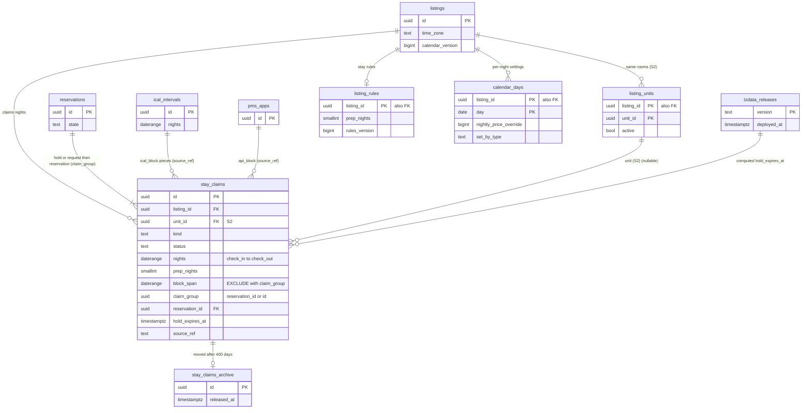

# Data model: 空室とカレンダー

空室の正本 `stay_claims`、その保管の写し、滞在の規則、泊ごとの設定、複数の同じ部屋（S2）、tz データベースのバージョン。振る舞いは [availability-and-calendars.md](../availability-and-calendars.md)、方針は [ADR-0002](../../decisions/0002-availability-representation-and-double-booking.md)・[ADR-0017](../../decisions/0017-stay-rules-decision-table.md)・[ADR-0018](../../decisions/0018-calendar-settings-blocks-and-calendar-version.md)・[ADR-0019](../../decisions/0019-tzdb-update-and-time-zone-recompute.md)・[ADR-0020](../../decisions/0020-multi-unit-listings-per-unit-claims.md)。規約は [data-model.md](../data-model.md) の 3 節。

- どの表も core にある。`stay_claims` への `INSERT`・`UPDATE` の権限は `availability_writer` の役割だけが持ち、`booking`・`ical-sync`・`partner-api`・`ops-api` は `packages/availability` の関数（`claimStay`・`confirmClaim`・`releaseClaims`・`swapClaims`・`blockDates`・`unblockDates`・`applyIcalSnapshot`・`setApiBlocks`）を通してだけ書く。
- どの書き込みも、届出住宅 → リスティング → 予約の順で行をロックしてから書き、最後に `listings.calendar_version` を 1 上げて outbox に `listing.calendar_changed` を書く。
- 日付は物件の現地の日付。泊は `daterange` の `[check_in, check_out)`（[data-model.md](../data-model.md) の 3.5 節）。

## 1. ER 図

- `reservations ||--|{ stay_claims`：予約は作成と同じトランザクションで `hold` か `request` の行を作るので 1 以上。日程の変更の応答の間は同じ組の行が 2 つ有効になる（[ADR-0041](../../decisions/0041-alterations-with-claim-group-and-delta-settlement.md)）。外した行も残るので、予約の行の数は増えていく。
- `ical_intervals ||--o{ stay_claims`・`pms_apps ||--o{ stay_claims`：`source_ref` の論理の参照（`ical_block` は区間の ID、`api_block` は `pms:<app_id>:<ref>`）。外部キーは張らない。
- `listings ||--o| listing_rules`：リスティングの作成と同じトランザクションで既定の規則の行を作るので、実際は常に 1 つ。

## 2. 制約の実装

| 制約 | 実装 |
| --- | --- |
| 二重の予約なし | `stay_claims_no_overlap`：`EXCLUDE USING gist (listing_id WITH =, claim_group WITH <>, block_span WITH &&) WHERE (status = 'active')`。守る物（[delivery.md](../delivery.md) の 5.2 節） |
| S2 の部屋ごとの排他 | `stay_claims_no_overlap_unit`：`EXCLUDE USING gist (unit_id WITH =, claim_group WITH <>, block_span WITH &&) WHERE (status = 'active' AND unit_id IS NOT NULL)`。S2 で足し、1 部屋のリスティングにも既定の部屋を持たせて両方の制約を効かせる |
| 準備の日は後ろにだけ | `CHECK (block_span = daterange(lower(nights), upper(nights) + prep_nights))` |
| 同じ組の重なりは日程の変更の間だけ | 制約は同じ組の重なりを許す。2 つを超える有効な行は `alterReservation` が 409 `alteration_pending` で止め、照合 R3 が見張る |
| 行を消さない | `stay_claims` の `DELETE` 権限をどの役割にも与えない。外すのは `status = 'released'`。`stay_claims_archive` へ移すジョブだけが、400 日を過ぎた `released` の行を移す（`archive_mover` の役割） |
| 期限の切れた仮押さえ | 挿入の前に同じリスティングの期限の切れた行を外す（[availability-and-calendars.md](../availability-and-calendars.md) の 4.6 節）。`deadline-runner` が `stay_claims_expiring` の索引で 1 分ごとに外す |

## 3. 例：排他の制約の行

前提：リスティング L（`Asia/Tokyo`、準備の日 1）。行の ID は短く書く。`block_span` は泊の範囲の上の端に準備の日を足した範囲である。

**始まりの行**

| 行 | `kind` | `status` | `claim_group` | `nights` | `block_span` |
| --- | --- | --- | --- | --- | --- |
| R1 | `reservation`（予約 R） | `active` | R | `[2026-12-28, 2026-12-31)` | `[2026-12-28, 2027-01-01)` |
| B1 | `host_block` | `active` | B1 | `[2027-01-05, 2027-01-08)` | `[2027-01-05, 2027-01-08)` |

**挿入を試す**（各段は前の段の結果の上で行う）

| # | 操作 | 入れる行 | `block_span` | 重なる有効な行 | 結果 |
| --- | --- | --- | --- | --- | --- |
| 1 | 予約 S の `reserveStay` | H2 `hold`、組 S、`[12-31, 01-02)` | `[12-31, 01-03)` | R1（12-31 は R1 の準備の日） | 0 行。409 `dates_unavailable`。理由 `overlap_prep` |
| 2 | 予約 S の `reserveStay` | H3 `hold`、組 S、`[01-01, 01-04)` | `[01-01, 01-05)` | なし（R1 の上の端 01-01 は含まない。B1 は 01-05 から） | 入る |
| 3 | 他の掲載先の取り込み | I1 `ical_block`、組 I1、`[01-03, 01-06)` | `[01-03, 01-06)` | H3（01-03・01-04）、B1（01-05） | 0 行。切り取りの残り `[01-03, 01-06) − [01-01, 01-05) − [01-05, 01-08)` は空。`calendar_conflicts` に 2 行（H3 との `pending`、B1 との `covered`） |
| 4 | 予約 R の延長の提案（12-28〜01-01） | R2 `hold`、組 R、`[12-28, 01-01)` | `[12-28, 01-02)` | R1（同じ組で許す）、H3（01-01） | 0 行。409 `dates_unavailable`（変更の DT-ALT-001 の行 6） |
| 5 | 予約 R の前倒しの提案（12-27〜12-30） | R3 `hold`、組 R、`[12-27, 12-30)` | `[12-27, 12-31)` | R1（同じ組で許す） | 入る。組 R の有効な行は R1 と R3 の 2 つ |
| 6 | ホストのブロック（12-30〜12-31） | B2 `host_block`、組 B2、`[12-30, 12-31)` | `[12-30, 12-31)` | R1、R3 | 0 行。理由 `overlap_reservation` で返し、閉じる操作は失敗にしない |
| 7 | 予約 R の変更の受諾（`swapClaims`） | R1 を `released`（`altered`）、R3 を `kind = 'reservation'` | — | — | 組 R の有効な行は R3 だけ。12-31 の夜（R1 の準備の日だった）が空く。12-30 の夜は R3 の準備の日で塞がったまま |
| 8 | 予約 S の支払いの期限切れ | H3 を `released`（`expired`） | — | — | `ical-sync` が I1 の区間を見直し、`[01-03, 01-05)` を `ical_block` の片で入れる（B1 と重なる 01-05 は入れない）。H3 との食い違いを `resolved_claim_released` で閉じる |

**段 8 の後の有効な行**

| 行 | `kind` | `claim_group` | `block_span` |
| --- | --- | --- | --- |
| R3 | `reservation`（予約 R） | R | `[2026-12-27, 2026-12-31)` |
| I1a | `ical_block`（`source_ref` = I1 の区間） | I1a | `[2027-01-03, 2027-01-05)` |
| B1 | `host_block` | B1 | `[2027-01-05, 2027-01-08)` |

- どの段でも、異なる組の有効な `block_span` は重ならない（NFR-005）。段 5 と段 7 の間だけ、同じ組 R の 2 つの行が 12-28〜12-30 で重なる。
- 段 1 と段 4 の拒否は、挿入の `ON CONFLICT ON CONSTRAINT stay_claims_no_overlap DO NOTHING` の 0 行で知る。重なった行を `SELECT` して理由のコードを返す（例外で戻さない）。
- 同じ挿入を 2 つのトランザクションが同時に試しても、リスティングの行のロックで直列になる。ロックを通らない書き込み（移行のジョブ）にも制約が効く。

## 4. 表

### 4.1 `stay_claims`

空室の正本。予約・仮押さえ・リクエスト・ホストのブロック・PMS のブロック・運用のブロック・取り込みの行。定義元：[ADR-0002](../../decisions/0002-availability-representation-and-double-booking.md)、[availability-and-calendars.md](../availability-and-calendars.md) の 4 節。

| 列 | 型 | NULL | 既定 | 説明 |
| --- | --- | --- | --- | --- |
| `id` | `uuid` | NOT NULL | `uuidv7()` | |
| `listing_id` | `uuid` | NOT NULL | — | |
| `host_account_id` | `uuid` | NOT NULL | — | RLS のための写し（D-15） |
| `unit_id` | `uuid` | NULL | — | 部屋（S2。S1 は NULL） |
| `kind` | `text` | NOT NULL | — | `reservation`・`hold`・`request`・`host_block`・`ical_block`・`api_block`・`ops_block` |
| `status` | `text` | NOT NULL | `'active'` | `active`・`released` |
| `nights` | `daterange` | NOT NULL | — | `[check_in, check_out)`。泊の日だけ |
| `prep_nights` | `smallint` | NOT NULL | `0` | 作成の時の準備の日（0〜2） |
| `block_span` | `daterange` | NOT NULL | — | `[check_in, check_out + prep_nights)` |
| `hold_expires_at` | `timestamptz` | NULL | — | `hold`・`request` の期限 |
| `reservation_id` | `uuid` | NULL | — | `reservation`・`hold`・`request` |
| `claim_group` | `uuid` | NOT NULL | — | 予約に関わる行は `reservation_id`、他は `id` |
| `source_ref` | `text` | NULL | — | `ical_block` は `ical_intervals.id`、`api_block` は `pms:<app_id>:<ref>`、`ops_block` は `host_cancellation:<reservation_id>` か案件の ID |
| `version` | `bigint` | NOT NULL | `1` | |
| `released_reason` | `text` | NULL | — | `expired`・`cancelled`・`declined`・`altered`・`unblocked`・`ical_removed`・`superseded` |
| `released_at` | `timestamptz` | NULL | — | |
| `created_by_type` | `text` | NOT NULL | — | `guest`・`host_member`・`pms_app`・`ical_sync`・`operator`・`system` |
| `created_by_id` | `uuid` | NULL | — | |
| `tzdata_version` | `text` | NULL | — | `hold_expires_at` を計算したバージョン |
| `created_at` | `timestamptz` | NOT NULL | `now()` | |

- キー：PK `(id)`。FK `listing_id → listings`、`reservation_id → reservations`（予約の行を先に入れる）、`(listing_id, unit_id) → listing_units`（S2）。排他の制約 `stay_claims_no_overlap`（2 節）。
- 索引：
  - `stay_claims_expiring (listing_id, hold_expires_at) WHERE status = 'active' AND kind IN ('hold','request')` — 挿入の前の掃除と `deadline-runner`。
  - `stay_claims_listing_active USING gist (listing_id, block_span) WHERE status = 'active'` — カレンダーの画面、写しと `stay_ranges` の作り直し。
  - `stay_claims_reservation (reservation_id) WHERE reservation_id IS NOT NULL` — 遷移の `confirmClaim`・`releaseClaims`、照合 R2・R4。
  - `(source_ref) WHERE status = 'active' AND kind IN ('ical_block','api_block')` — 取り込みと PMS の差分。
  - `(released_at) WHERE status = 'released'` — 400 日の保管の写しへの移し。
- CHECK：
  - `kind IN (...)`、`status IN ('active','released')`、`released_reason IN (...)`。
  - `NOT isempty(nights) AND lower(nights) < upper(nights)`。`upper(nights) - lower(nights) <= 731`（ブロックの 2 年と取り込みの窓 `[昨日, 今日 + 730 日)`。予約は `checkStayRules` の 27 泊）。
  - `prep_nights BETWEEN 0 AND 2`、`block_span = daterange(lower(nights), upper(nights) + prep_nights)`。
  - `kind NOT IN ('host_block','api_block','ops_block') OR prep_nights = 0`。
  - `(status = 'released') = (released_at IS NOT NULL)`、`(status = 'released') = (released_reason IS NOT NULL)`。
  - `kind NOT IN ('hold','request') OR status = 'released' OR hold_expires_at IS NOT NULL`、`kind NOT IN ('reservation') OR hold_expires_at IS NULL`。
  - `kind IN ('hold','request','reservation') = (reservation_id IS NOT NULL)`。
  - `kind IN ('hold','request','reservation') OR claim_group = id`、`kind NOT IN ('hold','request','reservation') OR claim_group = reservation_id`。
  - `kind NOT IN ('ical_block','api_block') OR source_ref IS NOT NULL`。
- RLS：ホストのアカウント（読み出しは成員、書き込みは関数の役割。PMS は同意のリスティングの集合）。予約の 2 者のゲストは、自分の予約の行だけを読める（`EXISTS (reservations r WHERE r.id = reservation_id AND r.guest_id = app.actor_id)`）。サービス：`availability_writer`、`search-indexer`・`availability-cache-writer`・`reconcilers`（読み出しの写し）。区分：P（予約の行）、O（ブロック）。
- 分割：しない（排他の制約を全体に効かせるため）。
- 保持：`released` の行は 400 日で `stay_claims_archive` へ移す。`active` は消さない。
- S1 の量：有効な行 300 万（1 リスティング平均 30。初期見積もり）。挿入は 1 日 30 万行（予約・仮押さえ・取り込み・PMS の差分）、400 日で 1.2 億行。有効な行だけの GiST の索引は約 300 MB。外した `ical_block`・`api_block` を早く移すかは E9 の前に決める（[data-model.md](../data-model.md) の 9 節）。

### 4.2 `stay_claims_archive`

400 日を過ぎた `released` の行の保管。照合と監査は 400 日で足り、予約の記録は `reservations` に残る。

| 列 | 型 | NULL | 既定 | 説明 |
| --- | --- | --- | --- | --- |
| （`stay_claims` と同じ列） | | | | |
| `archived_at` | `timestamptz` | NOT NULL | `now()` | |

- キー：PK `(id, released_at)`（分割の鍵を含む）。排他の制約・外部キーを持たない。
- 分割：`released_at` の月。10 年を過ぎた区切りを `records` へ Parquet で写して `DROP`（予約の記録の保持に合わせる）。
- RLS：サービス（`reconcilers`、運用の調べ）。区分：P・O。S1 の量：1 日 30 万行。

### 4.3 `listing_rules`

滞在の規則（DT-AVL-001 の入力）。定義元：同 6.1 節。

| 列 | 型 | NULL | 既定 | 説明 |
| --- | --- | --- | --- | --- |
| `listing_id` | `uuid` | NOT NULL | — | |
| `host_account_id` | `uuid` | NOT NULL | — | RLS のための写し |
| `min_nights` | `smallint` | NOT NULL | `1` | 1〜27 |
| `max_nights` | `smallint` | NOT NULL | `27` | 1〜27（MVP の上限。[ADR-0017](../../decisions/0017-stay-rules-decision-table.md)） |
| `checkin_weekdays` | `smallint[]` | NOT NULL | `'{1,2,3,4,5,6,7}'` | ISO の曜日 |
| `checkout_weekdays` | `smallint[]` | NOT NULL | `'{1,2,3,4,5,6,7}'` | |
| `cutoff_days_before` | `smallint` | NOT NULL | `0` | 0〜7 |
| `cutoff_local_time` | `time` | NOT NULL | `'18:00'` | 物件の現地の時刻 |
| `booking_window_months` | `smallint` | NOT NULL | `12` | 3・6・9・12・24 |
| `prep_nights` | `smallint` | NOT NULL | `0` | 0〜2。新しい行から効く |
| `rules_version` | `bigint` | NOT NULL | `1` | 変更ごとに 1 上げる。見積もりの写しと比べる |
| `updated_by_type` | `text` | NOT NULL | — | `host_member`・`pms_app`・`operator` |
| `updated_at` | `timestamptz` | NOT NULL | `now()` | |

- キー：PK `(listing_id)`。FK → `listings`。
- CHECK：`min_nights BETWEEN 1 AND 27`、`max_nights BETWEEN min_nights AND 27`、`cutoff_days_before BETWEEN 0 AND 7`、`booking_window_months IN (3,6,9,12,24)`、`prep_nights BETWEEN 0 AND 2`、`cardinality(checkin_weekdays) BETWEEN 1 AND 7`、`checkin_weekdays <@ '{1,2,3,4,5,6,7}'`（`checkout_weekdays` も同じ）。
- RLS：ホストのアカウント（DT-HST-001 の行 9）。読み出しは公開（滞在の規則はゲストに見せる）。区分：U。S1 の量：15 万行。

### 4.4 `calendar_days`

泊ごとの設定（料金の上書き、最短・最長の上書き、メモ）。空室を持たない。定義元：同 7 節。

| 列 | 型 | NULL | 既定 | 説明 |
| --- | --- | --- | --- | --- |
| `listing_id` | `uuid` | NOT NULL | — | |
| `day` | `date` | NOT NULL | — | 物件の現地の日付（その夜） |
| `host_account_id` | `uuid` | NOT NULL | — | RLS のための写し |
| `nightly_price_override` | `bigint` | NULL | — | リスティングの通貨の最小単位 |
| `min_nights` | `smallint` | NULL | — | この日をチェックインの日とする滞在の上書き |
| `max_nights` | `smallint` | NULL | — | 同上 |
| `note` | `text` | NULL | — | ホストのメモ（ゲストに見せない。ログに出さない） |
| `set_by_type` | `text` | NOT NULL | — | `host`・`cohost`・`pms`・`pricing_suggestion` |
| `set_by_id` | `uuid` | NULL | — | |
| `version` | `bigint` | NOT NULL | `1` | |
| `updated_at` | `timestamptz` | NOT NULL | `now()` | |

- キー：PK `(listing_id, day)`。FK `listing_id → listings`。
- CHECK：`nightly_price_override IS NULL OR nightly_price_override BETWEEN 1000 AND 1000000`（円。通貨を足すときに表に移す）、`min_nights BETWEEN 1 AND 27`、`max_nights BETWEEN 1 AND 27`、`set_by_type IN (...)`、`nightly_price_override IS NOT NULL OR min_nights IS NOT NULL OR max_nights IS NOT NULL OR note IS NOT NULL`。
- 料金の提案（`set_by_type = 'pricing_suggestion'`）は、`pricing_rules.suggestion_min`・`suggestion_max` の範囲の外を書けない（書き込みの関数で確かめる。[ADR-0009](../../decisions/0009-trust-and-safety-and-ml-boundary.md)）。
- 料金の上書きの変化は `pricing_rules.pricing_version` も上げる（[pricing-fees-and-taxes.md](pricing-fees-and-taxes.md)）。
- RLS：ホストのアカウント（`note` は成員だけ。公開の読み出しは料金の写し `prc:` を通す）。区分：O（`note`）・U。
- 保持：今日から 2 年先まで。過ぎた日は 90 日で消す（料金の記録は見積もりの写しにある）。
- S1 の量：上書きのある夜だけで 1 リスティング平均 120 行、1,200 万行。

### 4.5 `listing_units`（S2）

1 リスティングの複数の同じ部屋。S1 では作らない。定義元：同 10 節、[ADR-0020](../../decisions/0020-multi-unit-listings-per-unit-claims.md)。

| 列 | 型 | NULL | 既定 | 説明 |
| --- | --- | --- | --- | --- |
| `listing_id` | `uuid` | NOT NULL | — | |
| `unit_id` | `uuid` | NOT NULL | `uuidv7()` | |
| `label` | `text` | NOT NULL | — | 部屋の名前（ホストだけに見せる） |
| `active` | `boolean` | NOT NULL | `true` | |
| `sort_order` | `smallint` | NOT NULL | — | 割り当ての順 |

- キー：PK `(listing_id, unit_id)`。UK `(unit_id)`。
- RLS：ホストのアカウント。区分：O。S2 の量：部屋のあるリスティング 1 万 × 平均 10。

### 4.6 `tzdata_releases`

配った tz データベースのバージョン。サービスは起動の時に最新と自分のバージョンを比べる。定義元：同 8 節。

| 列 | 型 | NULL | 既定 | 説明 |
| --- | --- | --- | --- | --- |
| `version` | `text` | NOT NULL | — | 例 `2026b` |
| `released_at` | `timestamptz` | NOT NULL | — | IANA の公開の時刻 |
| `deployed_at` | `timestamptz` | NULL | — | 全サービスの出し直しの完了 |
| `changed_zones` | `text[]` | NOT NULL | `'{}'` | 規則の変わったタイムゾーン |
| `recompute_started_at` | `timestamptz` | NULL | — | `tz-recompute` の開始 |
| `recompute_completed_at` | `timestamptz` | NULL | — | |

- キー：PK `(version)`。
- RLS：公開の設定（読み出しは全サービス、書き込みは `config-loader`）。区分：M。保持：消さない。
