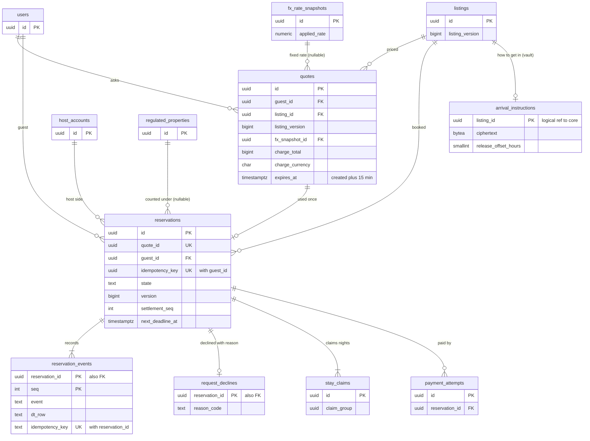

# Data model: 予約と見積もり

見積もりの写し、予約、予約の事象、リクエストの断りの理由、入り方（vault）。振る舞いは [booking-and-holds.md](../booking-and-holds.md)・[pricing-and-fees.md](../pricing-and-fees.md) の 6 節、方針は [ADR-0004](../../decisions/0004-booking-state-machine-and-holds.md)・[ADR-0035](../../decisions/0035-booking-decision-table-and-deadlines.md)〜[ADR-0038](../../decisions/0038-booking-requests-and-arrival-info-release.md)。規約は [data-model.md](../data-model.md) の 3 節。

- `quotes` は `pricing`、`reservations`・`reservation_events`・`request_declines` は `booking`、`arrival_instructions`（vault）は `listings` が書く。
- 予約を作るのは `reserveStay` だけ。状態は `transition(reservation_id, event, actor, expected_version)` だけが書く（DT-BKG-001 の 35 行）。運用の画面にも、遷移の関数を通らない書き換えはない。
- 予約と同じ core のトランザクションで、`stay_claims`（[availability-and-calendars.md](availability-and-calendars.md)）、`regulated_nights`（[regulatory-japan.md](regulatory-japan.md)）、`reservation_tax_nights`（[pricing-fees-and-taxes.md](pricing-fees-and-taxes.md)）、outbox を書く。ロックの順は届出住宅 → リスティング → 予約。
- お金は ledger にあり、outbox の事象（`reservation.confirmed`・`cancelled`・`altered`・`payout_release_due`）でつなぐ（[ledger-and-payouts.md](ledger-and-payouts.md)）。

## 1. ER 図

- `quotes ||--o| reservations`：見積もりは 1 回だけ使える（`reservations.quote_id` の一意）。日程の変更の新しい見積もりは `reservation_alterations.new_quote_id` と `reservations.current_quote_id` が指す（[cancellations-and-changes.md](cancellations-and-changes.md)）。
- `reservations ||--|{ stay_claims`：作成と同じトランザクションで `hold` か `request` の行を作る。
- `reservations ||--o{ payment_attempts`：即時予約は `capture`、リクエストは `authorize` と `capture`、変更の差額、取り消し、返金の試行（[payments-and-fx.md](payments-and-fx.md)）。

## 2. 制約の実装

| 制約 | 実装 |
| --- | --- |
| 同じ操作から予約は 1 つ | `reservations (guest_id, idempotency_key)` の一意、`reservations (quote_id)` の一意。守る物（[delivery.md](../delivery.md) の 5.2 節） |
| 見せた額で請求する | `reserveStay` の確かめ（期限、未使用、`listing_version`・`rules_version`・`cancellation_policy_version`、総額と通貨）。`reservations.charge_total`・`charge_currency` = 見積もり（照合 B4） |
| 状態は遷移の関数と決定表だけ | `reservation_events.dt_row`（DT-BKG-001 の 35 行）。`reservations.state` と期限の列の `UPDATE` 権限を遷移の役割だけに与える |
| 操作の冪等 | `reservation_events (reservation_id, idempotency_key)` の一意。2 回目は前の結果を返す |
| 期限の拾い | `reservations_due (next_deadline_at) WHERE next_deadline_at IS NOT NULL` |
| ロックの順 | 届出住宅（`regulated_property_id`）→ リスティング → 予約。どの経路も同じ |

## 3. 表

### 3.1 `quotes`

見積もりの写し（15 分）。キャンセル・返金・税の計算の入力になる。定義元：[pricing-and-fees.md](../pricing-and-fees.md) の 6.2 節、[booking-and-holds.md](../booking-and-holds.md) の 5.1 節。

| 列 | 型 | NULL | 既定 | 説明 |
| --- | --- | --- | --- | --- |
| `id` | `uuid` | NOT NULL | `uuidv7()` | `quote_id`（D-2） |
| `guest_id` | `uuid` | NOT NULL | — | |
| `listing_id` | `uuid` | NOT NULL | — | |
| `host_account_id` | `uuid` | NOT NULL | — | |
| `quote_dedupe_key` | `bytea` | NOT NULL | — | ゲスト・リスティング・日付・人数・表示の通貨・各バージョンのハッシュ |
| `dedupe_window` | `bigint` | NOT NULL | — | 作成の時刻の 15 分の窓の番号 |
| `check_in`・`check_out` | `date` | NOT NULL | — | |
| `adults`・`children`・`infants`・`pets` | `smallint` | NOT NULL | — | |
| `listing_version` | `bigint` | NOT NULL | — | |
| `revision_id` | `uuid` | NOT NULL | — | 予約の時の内容 |
| `rules_version` | `bigint` | NOT NULL | — | |
| `pricing_version` | `bigint` | NOT NULL | — | 記録だけ（見積もりを無効にしない） |
| `cancellation_policy_code` | `text` | NOT NULL | — | D-4 |
| `cancellation_policy_version` | `integer` | NOT NULL | — | |
| `tax_table_version` | `integer` | NOT NULL | — | 表全体のバージョン（領域の文書の `tax_table_versions`。D-32） |
| `service_fee_schedule_version` | `integer` | NOT NULL | — | |
| `service_fee_bps` | `integer` | NOT NULL | — | 写した率（キャンセルの計算） |
| `fx_snapshot_id` | `uuid` | NULL | — | 請求の通貨が違うとき |
| `ts_decision_id` | `uuid` | NULL | — | 予約の時の T&S の判定（content の `rule_evaluations`。論理の参照） |
| `booking_mode` | `text` | NOT NULL | — | `instant`・`request`（見積もりの時の判定） |
| `lines` | `jsonb` | NOT NULL | — | 行（種類、夜、リスティングの通貨の額、請求の通貨の按分の額）。形は [pricing-and-fees.md](../pricing-and-fees.md) の 6.2 節 |
| `listing_currency` | `char(3)` | NOT NULL | — | |
| `accommodation_subtotal` | `bigint` | NOT NULL | — | 宿泊の対価の小計 |
| `tax_total` | `bigint` | NOT NULL | — | |
| `total` | `bigint` | NOT NULL | — | リスティングの通貨の総額 |
| `charge_currency` | `char(3)` | NOT NULL | — | |
| `charge_total` | `bigint` | NOT NULL | — | 請求の通貨の総額 |
| `service_fee` | `bigint` | NOT NULL | — | ホストの側（消費税を含む） |
| `service_fee_tax` | `bigint` | NOT NULL | — | うち消費税 |
| `host_payout_estimate` | `bigint` | NOT NULL | — | |
| `legal_config_version` | `text` | NOT NULL | — | 使った `legal` の構成のバージョン |
| `expires_at` | `timestamptz` | NOT NULL | — | 作成 + 15 分 |
| `used_at` | `timestamptz` | NULL | — | |
| `reservation_id` | `uuid` | NULL | — | 使った予約 |
| `created_at` | `timestamptz` | NOT NULL | `now()` | |

- キー：PK `(id)`。UK `(quote_dedupe_key, dedupe_window)`。FK `listing_id → listings`、`fx_snapshot_id → fx_rate_snapshots`。
- 索引：`(guest_id, created_at)` — 本人の一覧。`(created_at) WHERE used_at IS NULL` — 使われなかった写しの削除。
- CHECK：`check_out > check_in`、`check_out - check_in <= 27`、`adults >= 1`、`adults + children <= 16`、`(charge_currency = listing_currency) OR fx_snapshot_id IS NOT NULL`、`total = accommodation_subtotal + tax_total`、`expires_at = created_at + interval '15 minutes'`、`(used_at IS NULL) = (reservation_id IS NULL)`。
- 写し：Valkey の `quote:{quote_id}`（15 分。[stores.md](stores.md) の 1 節）。
- RLS：本人（ゲスト）。予約に使った写しは予約の 2 者が読める（関数）。サービス：`pricing`、`booking`、`cancellation`、`ledger`（読み出し）。区分：P・F。
- 保持：使われなかった写しは 90 日（D-6）。予約に使った写しは予約と同じ 10 年。
- S1 の量：1 日 5 万行（予約 1 件に 5〜10）、使われない分を 90 日で 450 万行。

### 3.2 `reservations`

予約の正本。2 者の RLS。定義元：[booking-and-holds.md](../booking-and-holds.md) の 4〜7・9・10 節。

| 列 | 型 | NULL | 既定 | 説明 |
| --- | --- | --- | --- | --- |
| `id` | `uuid` | NOT NULL | `uuidv7()` | `claim_group` にも使う |
| `guest_id` | `uuid` | NOT NULL | — | |
| `listing_id` | `uuid` | NOT NULL | — | |
| `host_account_id` | `uuid` | NOT NULL | — | |
| `regulated_property_id` | `uuid` | NULL | — | 予約の時の届出住宅（ロックの順と数え） |
| `quote_id` | `uuid` | NOT NULL | — | 予約を作った見積もり |
| `current_quote_id` | `uuid` | NOT NULL | — | 今の額の見積もり（変更の受諾で書き換える。D-31） |
| `idempotency_key` | `uuid` | NOT NULL | — | `POST /reservations` の `Idempotency-Key` |
| `request_hash` | `bytea` | NOT NULL | — | 要求の本文のハッシュ（違えば 422 `idempotency_key_reuse`） |
| `state` | `text` | NOT NULL | — | `pending_payment`・`requested`・`confirmed`・`in_stay`・`completed`・`cancelled`・`declined`・`expired` |
| `version` | `bigint` | NOT NULL | `1` | 遷移ごとに 1 |
| `route` | `text` | NOT NULL | — | `instant`・`request`・`request_by_ts` |
| `check_in`・`check_out` | `date` | NOT NULL | — | 物件の現地の日付 |
| `adults`・`children`・`infants`・`pets` | `smallint` | NOT NULL | — | |
| `charge_currency` | `char(3)` | NOT NULL | — | |
| `charge_total` | `bigint` | NOT NULL | — | 今の請求の総額（変更の差額を含む） |
| `listing_currency` | `char(3)` | NOT NULL | — | |
| `listing_total` | `bigint` | NOT NULL | — | |
| `cancellation_policy_code` | `text` | NOT NULL | — | 予約の時のポリシー（D-4） |
| `cancellation_policy_version` | `integer` | NOT NULL | — | |
| `settlement_seq` | `integer` | NOT NULL | `0` | 今開いている決着の番号（[ADR-0047](../../decisions/0047-settlement-seq-and-escrow-settlement.md)） |
| `hold_expires_at` | `timestamptz` | NULL | — | 期限の列（8 つ。D-5） |
| `request_expires_at` | `timestamptz` | NULL | — | `min(作成 + 24h, check_in_at − 2h)` |
| `ts_review_due_at` | `timestamptz` | NULL | — | `route = 'request_by_ts'`。`min(作成 + 4h, request_expires_at)` |
| `check_in_at` | `timestamptz` | NULL | — | 物件の現地のチェックインの時刻を UTC に直した瞬間 |
| `check_out_at` | `timestamptz` | NULL | — | |
| `payout_release_at` | `timestamptz` | NULL | — | `check_in_at + 24h` |
| `alteration_expires_at` | `timestamptz` | NULL | — | 開いた変更の期限（変更の表の写し） |
| `arrival_info_at` | `timestamptz` | NULL | — | `check_in_at − 48h`（知らせだけ。遷移ではない） |
| `next_deadline_at` | `timestamptz` | NULL | — | 生きている期限の最小（[booking-and-holds.md](../booking-and-holds.md) の 7.3 節の式） |
| `tzdata_version` | `text` | NULL | — | 瞬間の列を計算したバージョン |
| `accepted_at` | `timestamptz` | NULL | — | ホストの承認（確定の待ち） |
| `inquiry_extensions` | `smallint` | NOT NULL | `0` | 照会の不明の延長（3 まで） |
| `on_hold` | `boolean` | NOT NULL | `false` | 運用の保留（送金の release を止める） |
| `payout_released_at` | `timestamptz` | NULL | — | DT-BKG-001 の行 28 を出した時刻 |
| `booked_at` | `timestamptz` | NULL | — | `confirmed` になった瞬間（DT-CXL-001 の `booked_at`） |
| `cancel_reason` | `text` | NULL | — | `payment_failed`・`payment_expired`・`payment_unresolved`・`dates_lost`・`guest_withdrew`・`ts_declined`・キャンセルの理由のコード（[cancellations-and-changes.md](../cancellations-and-changes.md) の 4 節） |
| `cancelled_by_type` | `text` | NULL | — | `guest`・`host_member`・`operator`・`system` |
| `cancelled_at` | `timestamptz` | NULL | — | `cancelled`・`declined`・`expired` の時刻 |
| `ts_decision_id` | `uuid` | NULL | — | content の `rule_evaluations`（論理の参照） |
| `ts_cleared_at` | `timestamptz` | NULL | — | |
| `ts_clear_cause` | `text` | NULL | — | `reviewed`・`timeout` |
| `house_rules_ack_at` | `timestamptz` | NULL | — | `step_up` のハウスルールの明示の同意 |
| `registry_status` | `text` | NOT NULL | `'not_required'` | `not_required`・`pending`・`complete`（[regulatory-japan.md](regulatory-japan.md)） |
| `registry_due_at` | `timestamptz` | NULL | — | `check_in_at − 24h` |
| `claim_window_ends_at` | `timestamptz` | NULL | — | `check_out_at + 14 日`（[claims.md](claims.md)） |
| `sentinel` | `boolean` | NOT NULL | `false` | 見張りの予約（3 者の照合と収益の集計から外す） |
| `legal_config_version` | `text` | NOT NULL | — | |
| `created_at` | `timestamptz` | NOT NULL | `now()` | |
| `updated_at` | `timestamptz` | NOT NULL | `now()` | |

- キー：PK `(id)`。UK `(quote_id)`、UK `(guest_id, idempotency_key)`。FK `listing_id → listings`、`quote_id`・`current_quote_id → quotes`、`regulated_property_id → regulated_properties`。
- 索引：
  - `reservations_due (next_deadline_at) WHERE next_deadline_at IS NOT NULL` — `deadline-runner`（1 分ごと、100 件ずつ、`SKIP LOCKED`）。
  - `(listing_id, check_in)` — 将来の予約の有無、照合 B1〜B3。
  - `(guest_id, state)` — 本人の一覧、上限（`pending_payment` 2、`requested` 5）、退会の条件。
  - `(host_account_id, state, check_in)` — ホストの今日のチェックインと一覧。
  - `(regulated_property_id, check_in) WHERE regulated_property_id IS NOT NULL` — 規則の変更の影響の一覧、名簿。
  - `(registry_due_at) WHERE registry_status = 'pending'` — 名簿の入力の案内。
- CHECK：
  - `state IN (...)`、`route IN (...)`、`ts_clear_cause IN ('reviewed','timeout')`、`registry_status IN (...)`。
  - `check_out > check_in`、`check_out - check_in <= 27`、`adults >= 1`、`adults + children <= 16`、`charge_total > 0`、`listing_total > 0`、`settlement_seq >= 0`、`inquiry_extensions BETWEEN 0 AND 3`。
  - `state <> 'pending_payment' OR hold_expires_at IS NOT NULL`。`state <> 'requested' OR accepted_at IS NOT NULL OR request_expires_at IS NOT NULL`。
  - `state NOT IN ('confirmed','in_stay','completed') OR (check_in_at IS NOT NULL AND check_out_at IS NOT NULL AND payout_release_at IS NOT NULL AND booked_at IS NOT NULL)`。
  - `(route = 'request_by_ts') OR (ts_review_due_at IS NULL AND ts_cleared_at IS NULL)`。
  - `state NOT IN ('cancelled','declined','expired') OR (cancelled_at IS NOT NULL AND next_deadline_at IS NULL)`。`(state = 'cancelled') = (cancel_reason IS NOT NULL)`。
- RLS：予約の 2 者（ゲスト本人か、ホストのアカウントの成員で DT-HST-001 が許す役割。PMS は `reservations:read` と同意のリスティング）。サービス：`booking`（遷移）、`deadline-runner`、`payments`・`ledger`・`reviews`・`compliance-jp`・`trust-safety`（事象の消費と読み出し）、`reconcilers`。
- 区分：P（金額は F）。
- 保持：予約の終わりから 10 年（[ADR-0075](../../decisions/0075-data-classes-and-retention.md)）。期間の後は ID を残して仮名にする。
- S1 の量：1 日 6,000 行（予約の試みの負けを含めず）、1 年 220 万行。1 行 900 バイトで 2 GB。進行中 15 万行前後。

### 3.3 `reservation_events`

予約の事象（追記だけ）。DT-BKG-001 の行の番号を持つ。定義元：同 7.1 節。

| 列 | 型 | NULL | 既定 | 説明 |
| --- | --- | --- | --- | --- |
| `reservation_id` | `uuid` | NOT NULL | — | 分割の鍵 |
| `seq` | `integer` | NOT NULL | — | 予約ごとの連番 |
| `guest_id`・`host_account_id` | `uuid` | NOT NULL | — | RLS のための写し |
| `event` | `text` | NOT NULL | — | `create`・`payment_succeeded`・`payment_failed`・`payment_action_required`・`host_accept`・`host_decline`・`guest_withdraw`・`cancel`・`deadline`・`alteration_*`・`ops_hold`・`ops_release`・`ts_clear`・`ts_decline`・`chargeback_opened` |
| `deadline_column` | `text` | NULL | — | `event = 'deadline'` のとき、どの期限か |
| `actor_type` | `text` | NOT NULL | — | `guest`・`host_member`・`pms_app`・`operator`・`ts`・`system` |
| `actor_id` | `uuid` | NULL | — | |
| `reason_code` | `text` | NULL | — | |
| `from_state` | `text` | NULL | — | 作成は NULL |
| `to_state` | `text` | NOT NULL | — | |
| `dt_row` | `text` | NOT NULL | — | DT-BKG-001 の行（`1`〜`31`、`13a`、`21a`〜`21c`） |
| `idempotency_key` | `text` | NULL | — | 画面の `Idempotency-Key`、`payment_inbox` の ID、期限は `deadline:<列>:<値>` |
| `payment_attempt_id` | `uuid` | NULL | — | 決済の事象のとき |
| `alteration_id` | `uuid` | NULL | — | 変更の事象のとき |
| `case_id` | `uuid` | NULL | — | content の `ts_cases`・`safety_incidents`（論理の参照） |
| `moderation_action_id` | `uuid` | NULL | — | `ts_clear`・`ts_decline`・`ops_hold`（T&S）のとき |
| `ops_grant_id` | `uuid` | NULL | — | 運用者の JIT の権限 |
| `created_at` | `timestamptz` | NOT NULL | `now()` | |

- キー：PK `(reservation_id, seq)`。UK `(reservation_id, idempotency_key)`（NULL は重ならない）。
- 分割：`reservation_id` の範囲（UUIDv7 の月の境）。1 つの予約の事象は予約を作った月の区切りに入り、一意の制約が分割の鍵を含む（D-21）。
- CHECK：`dt_row IN ('1',…,'13','13a','14',…,'21','21a','21b','21c','22',…,'31')`。`event NOT IN ('ts_clear','ts_decline') OR moderation_action_id IS NOT NULL`。`actor_type <> 'operator' OR ops_grant_id IS NOT NULL`。
- RLS：予約の 2 者（`guest_id`・`host_account_id` の写し）。区分：P。
- 保持：10 年。2 年を過ぎた区切りは S3 の `records` へ写して `DROP`。
- S1 の量：1 日 4 万行（1 予約 6〜7 事象）。

### 3.4 `request_declines`

予約のリクエストの断りの理由。T&S の断りの率の見張りもこの表を読む。定義元：同 9 節、[ADR-0038](../../decisions/0038-booking-requests-and-arrival-info-release.md)。

| 列 | 型 | NULL | 既定 | 説明 |
| --- | --- | --- | --- | --- |
| `reservation_id` | `uuid` | NOT NULL | — | |
| `host_account_id` | `uuid` | NOT NULL | — | |
| `guest_id` | `uuid` | NOT NULL | — | |
| `listing_id` | `uuid` | NOT NULL | — | |
| `reason_code` | `text` | NOT NULL | — | `dates_not_available`・`group_size`・`house_rules_conflict`・`maintenance`・`other` |
| `other_text` | `text` | NULL | — | `other` の自由な文（差別の語の辞書で調べる） |
| `dictionary_hit` | `boolean` | NOT NULL | `false` | 辞書に当たった（信号） |
| `actor_type` | `text` | NOT NULL | — | `host_member`・`pms_app` |
| `actor_id` | `uuid` | NOT NULL | — | |
| `created_at` | `timestamptz` | NOT NULL | `now()` | |

- キー：PK `(reservation_id)`。FK → `reservations`。索引：`(host_account_id, created_at)` — 90 日の断りの率。
- CHECK：`reason_code IN (...)`、`(reason_code = 'other') = (other_text IS NOT NULL)`。T&S の断り（`ts_decline`）はこの表に書かない。
- RLS：予約の 2 者（ゲストには理由のコードだけを出すビュー）。サービス：`trust-safety`（集計）。区分：P。保持：10 年。S1 の量：1 日 300 行。

### 3.5 `arrival_instructions`（vault）

入り方（暗証番号、鍵の場所、Wi-Fi）。`arrivalInfoVisible(viewer, reservation)` を通してだけ読む。定義元：同 10 節。

| 列 | 型 | NULL | 既定 | 説明 |
| --- | --- | --- | --- | --- |
| `listing_id` | `uuid` | NOT NULL | — | core の `listings`（論理の参照） |
| `host_account_id` | `uuid` | NOT NULL | — | |
| `ciphertext` | `bytea` | NOT NULL | — | 入り方の文の暗号文（言語ごとの JSON） |
| `nonce` | `bytea` | NOT NULL | — | |
| `key_version` | `integer` | NOT NULL | — | 主体の鍵（`purpose = location`、主体 = リスティング。D-33） |
| `aad_version` | `smallint` | NOT NULL | `1` | |
| `release_offset_hours` | `smallint` | NOT NULL | `48` | チェックインの何時間前から出すか（0〜168） |
| `updated_by` | `uuid` | NOT NULL | — | |
| `updated_at` | `timestamptz` | NOT NULL | `now()` | |

- キー：PK `(listing_id)`。CHECK：`release_offset_hours BETWEEN 0 AND 168`。
- RLS：ホストのアカウント（書き込み）。予約の 2 者のゲストは `arrival_info_at` から `check_out_at` まで、届出住宅は名簿の入力の後（`legal.registry_gate_arrival_info`）に関数で読む。読み出しは `vault_access_log` に書く。区分：V。
- 保持：リスティングの削除から 1 年（位置の鍵の破棄で消える）。S1 の量：10 万行。
