# Data model: カレンダーの同期

取り込む iCal のアドレス、取り込んだ区間、外部との食い違い、書き出しのアドレス、ホストの申告の外部の泊。振る舞いは [calendar-sync.md](../calendar-sync.md)、方針は [ADR-0021](../../decisions/0021-ical-import-pipeline-and-safety.md)・[ADR-0022](../../decisions/0022-ical-conflict-clipping-and-reevaluation.md)・[ADR-0023](../../decisions/0023-ical-export-secret-url-and-contents.md)。iCal の本文の形は [stores.md](stores.md) の 6 節。規約は [data-model.md](../data-model.md) の 3 節。

- どの表も core にあり、`ical-sync` が書く（`external_stay_declarations` はホストの画面と `partner-api` も、`availability` の関数を通して書く）。
- `ical-fetcher` は本体の DB に接続しない。読み取った区間を SQS の `ical-apply`（FIFO、グループ `listing_id`）に入れ、`ical-sync` が `applyIcalSnapshot` で 1 つのトランザクションで書く。
- 取り込みの区間は `stay_claims` の `ical_block` の片として入る。片の `source_ref` が区間の ID を指す（[availability-and-calendars.md](availability-and-calendars.md)）。
- PMS の `api_block` の `external_reservation` の重なりも、`calendar_conflicts` に同じ形で書く（`source_kind = 'pms'`。D-13）。

## 1. ER 図

```mermaid
erDiagram
    listings ||--o{ ical_feeds : "imports (up to 5)"
    ical_feeds ||--o{ ical_intervals : "desired intervals"
    ical_intervals ||--o{ stay_claims : "ical_block pieces"
    ical_feeds ||--o{ calendar_conflicts : "ical source (nullable)"
    pms_apps ||--o{ calendar_conflicts : "pms source (nullable)"
    stay_claims ||--o{ calendar_conflicts : "overlapped by"
    reservations ||--o{ calendar_conflicts : "booking at risk (nullable)"
    listings ||--o{ ical_exports : "export url (one live)"
    listings ||--o{ external_stay_declarations : "declared external nights"

    listings {
        uuid id PK
        bigint calendar_version
    }
    ical_feeds {
        uuid id PK
        uuid listing_id FK
        bytea url_ct "secret url"
        text treat_as
        text status
        timestamptz next_fetch_at
        bytea content_hash
    }
    ical_intervals {
        uuid id PK
        uuid feed_id FK
        daterange nights UK "with feed_id, active only"
        smallint prep_nights
    }
    stay_claims {
        uuid id PK
        text kind
        text source_ref
    }
    pms_apps {
        uuid id PK
    }
    reservations {
        uuid id PK
    }
    calendar_conflicts {
        uuid id PK
        uuid listing_id FK
        text source_kind
        uuid feed_id FK
        uuid pms_app_id FK
        uuid claim_id FK
        daterange overlap
        text severity
        text status
    }
    ical_exports {
        uuid id PK
        uuid listing_id FK
        bytea token_hash UK
        timestamptz revoked_at
    }
    external_stay_declarations {
        uuid id PK
        uuid listing_id FK
        daterange nights
        text source
    }
```

- `ical_intervals ||--o{ stay_claims`：区間は排他の制約で切り取られ、0 個（全部が他の行と重なる）から複数の片になる。
- `stay_claims ||--o{ calendar_conflicts`：重なった相手の行ごとに 1 行。
- `listings ||--o{ ical_exports`：作り直すと古い行に `revoked_at` を書く。有効な行は 1 つ（部分一意）。

## 2. 制約の実装

| 制約 | 実装 |
| --- | --- |
| 遅れたメッセージで古い内容を書かない | `applyIcalSnapshot` が `ical_feeds` を `FOR UPDATE` で取り、`fetched_at <= last_applied_fetched_at` なら何もしない |
| 同じ取り込みの区間は重ならない | 区間は和にまとめてから入れる。`ical_intervals (feed_id, nights) WHERE status = 'active'` の部分一意 |
| 急な消失で外さない | `pending_hash` と `pending_since`。2 回続けて同じハッシュのときだけ書く（[calendar-sync.md](../calendar-sync.md) の 6.2 節） |
| 書き出しのアドレスはハッシュだけ | `ical_exports.token_hash`（SHA-256）。トークンの平文を持たない |
| 取り込みのアドレスを平文で持たない | `ical_feeds.url_ct`（暗号文）。ログには `feed_id` とホスト名のハッシュだけ |

## 3. 表

### 3.1 `ical_feeds`

取り込む iCal のアドレスと取得の状態。定義元：[calendar-sync.md](../calendar-sync.md) の 4・5 節。

| 列 | 型 | NULL | 既定 | 説明 |
| --- | --- | --- | --- | --- |
| `id` | `uuid` | NOT NULL | `uuidv7()` | |
| `listing_id` | `uuid` | NOT NULL | — | |
| `host_account_id` | `uuid` | NOT NULL | — | RLS のための写し |
| `url_ct` | `bytea` | NOT NULL | — | アドレスの暗号文（`kms-pms-secrets`、文脈 `purpose = ical-url`。D-30） |
| `url_display` | `text` | NOT NULL | — | 画面に出す先頭と末尾（例 `https://cal.example…/x.ics`） |
| `url_host_hash` | `bytea` | NOT NULL | — | 名前解決の先のホスト名の HMAC（相手ごとの上限とログ） |
| `treat_as` | `text` | NOT NULL | `'blocked'` | `blocked`・`external_reservation` |
| `status` | `text` | NOT NULL | `'pending'` | `pending`・`active`・`failing`・`disabled`・`removed` |
| `etag` | `text` | NULL | — | 前回の `ETag` |
| `last_modified` | `text` | NULL | — | 前回の `Last-Modified` |
| `content_hash` | `bytea` | NULL | — | 最後に書いた本文の SHA-256 |
| `pending_hash` | `bytea` | NULL | — | 急な消失の確かめの間の本文のハッシュ |
| `pending_since` | `timestamptz` | NULL | — | |
| `next_fetch_at` | `timestamptz` | NOT NULL | — | 15 分（失敗の後は 4 時間まで倍） |
| `last_fetched_at` | `timestamptz` | NULL | — | |
| `last_success_at` | `timestamptz` | NULL | — | 画面に出す |
| `last_applied_fetched_at` | `timestamptz` | NULL | — | 書き込みに使った取得の時刻 |
| `consecutive_failures` | `smallint` | NOT NULL | `0` | |
| `last_failure_code` | `text` | NULL | — | `blocked`・`timeout`・`too_large`・`malformed_calendar`・`too_many_intervals`・`http_<code>` |
| `blocked_count` | `smallint` | NOT NULL | `0` | 宛先の検査の拒否の数（3 で `disabled`） |
| `possible_echo_count` | `smallint` | NOT NULL | `0` | `possible_echo` の記録の数（3 以上で設定の見直しを案内） |
| `manual_refresh_at` | `timestamptz` | NULL | — | 「今すぐ更新」（10 分に 1 回） |
| `created_by` | `uuid` | NOT NULL | — | ホストの成員 |
| `created_at` | `timestamptz` | NOT NULL | `now()` | |
| `removed_at` | `timestamptz` | NULL | — | |

- キー：PK `(id)`。FK `listing_id → listings`。
- 索引：`(next_fetch_at) WHERE status IN ('pending','active','failing')` — `ical-scheduler`。`(listing_id) WHERE status <> 'removed'` — 1 リスティング 5 件の上限と画面。
- CHECK：`treat_as IN (...)`、`status IN (...)`、`(status = 'removed') = (removed_at IS NOT NULL)`、`(pending_hash IS NULL) = (pending_since IS NULL)`。
- RLS：ホストのアカウント（`owner`・`full`・`calendar_and_reservations`）。サービス：`ical-sync`（`ical-scheduler` を含む）。区分：S（`url_ct`）・O。
- 保持：`removed` から 90 日。S1 の量：3 万行。

### 3.2 `ical_intervals`

取り込みの望む区間（予定の泊を和にまとめたもの）。定義元：同 5.5・6 節。

| 列 | 型 | NULL | 既定 | 説明 |
| --- | --- | --- | --- | --- |
| `id` | `uuid` | NOT NULL | `uuidv7()` | `stay_claims.source_ref` が指す |
| `feed_id` | `uuid` | NOT NULL | — | |
| `listing_id` | `uuid` | NOT NULL | — | |
| `host_account_id` | `uuid` | NOT NULL | — | RLS のための写し |
| `nights` | `daterange` | NOT NULL | — | 予定の泊の和（`external_reservation` は準備の日で触れ合う予定もまとめる） |
| `prep_nights` | `smallint` | NOT NULL | `0` | `external_reservation` のときのリスティングの準備の日。区間の最後の片の `stay_claims.prep_nights` になる |
| `event_key_hashes` | `bytea[]` | NOT NULL | — | 元の予定の鍵 `(UID, RECURRENCE-ID)` のハッシュ（ホストの画面で区間の元を示す） |
| `status` | `text` | NOT NULL | `'active'` | `active`・`removed` |
| `created_at` | `timestamptz` | NOT NULL | `now()` | |
| `removed_at` | `timestamptz` | NULL | — | |

- キー：PK `(id)`。FK `feed_id → ical_feeds`。部分 UK `(feed_id, nights) WHERE status = 'active'`。
- 索引：`(listing_id) WHERE status = 'active'` — 食い違いの見直し。
- CHECK：`NOT isempty(nights)`、`upper(nights) - lower(nights) <= 731`、`prep_nights BETWEEN 0 AND 2`、`(status = 'removed') = (removed_at IS NOT NULL)`。
- RLS：ホストのアカウント（読み出し）。区分：O。
- 保持：`removed` から 400 日（`stay_claims` の照合と同じ）。S1 の量：有効な行 30 万（1 取り込み平均 10）。1 回の書き込みは区間 500 まで。

### 3.3 `calendar_conflicts`

外部（取り込み・PMS）と本システムの行の重なり。定義元：同 6.3〜6.6 節、[host-tools-and-api.md](../host-tools-and-api.md) の 6.2 節。

| 列 | 型 | NULL | 既定 | 説明 |
| --- | --- | --- | --- | --- |
| `id` | `uuid` | NOT NULL | `uuidv7()` | |
| `listing_id` | `uuid` | NOT NULL | — | |
| `host_account_id` | `uuid` | NOT NULL | — | RLS のための写し |
| `source_kind` | `text` | NOT NULL | — | `ical`・`pms` |
| `feed_id` | `uuid` | NULL | — | `ical` のとき |
| `ical_interval_id` | `uuid` | NULL | — | `ical` のとき |
| `pms_app_id` | `uuid` | NULL | — | `pms` のとき |
| `pms_ref` | `text` | NULL | — | PMS の範囲の `ref` |
| `overlap` | `daterange` | NOT NULL | — | 重なった泊 |
| `check_in` | `date` | NOT NULL | — | `lower(overlap)`（運用の待ち行列の並び） |
| `claim_id` | `uuid` | NOT NULL | — | 重なった相手の `stay_claims` |
| `claim_kind` | `text` | NOT NULL | — | 相手の種類（深刻さの判定の時） |
| `reservation_id` | `uuid` | NULL | — | 相手が予約の行のとき |
| `severity` | `text` | NOT NULL | — | `possible_echo`・`double_booking`・`pending`・`request_overlap`・`covered`・`external_double_booking`（DT-ICS-001） |
| `status` | `text` | NOT NULL | `'open'` | `open`・`acknowledged`・`resolved_external_removed`・`resolved_claim_released`・`resolved_feed_removed` |
| `notified_at` | `timestamptz` | NULL | — | ホストへの知らせ（`double_booking` は 5 分以内） |
| `acknowledged_by` | `uuid` | NULL | — | |
| `acknowledged_at` | `timestamptz` | NULL | — | |
| `resolved_at` | `timestamptz` | NULL | — | |
| `created_at` | `timestamptz` | NOT NULL | `now()` | |
| `updated_at` | `timestamptz` | NOT NULL | `now()` | |

- キー：PK `(id)`。FK `listing_id → listings`、`claim_id → stay_claims`、`feed_id → ical_feeds`、`pms_app_id → pms_apps`。部分 UK `(claim_id, coalesce(ical_interval_id, pms_app_id), overlap) WHERE status IN ('open','acknowledged')`（同じ重なりを 2 行にしない）。
- 索引：`(listing_id, status)` — ホストの画面。`(status, severity, check_in) WHERE status IN ('open','acknowledged')` — 運用の待ち行列。`(reservation_id) WHERE reservation_id IS NOT NULL` — 予約の確定・取り消しでの深刻さの書き直し。
- CHECK：`source_kind IN (...)`、`severity IN (...)`、`status IN (...)`、`(source_kind = 'ical') = (feed_id IS NOT NULL AND ical_interval_id IS NOT NULL)`、`(source_kind = 'pms') = (pms_app_id IS NOT NULL)`、`status NOT LIKE 'resolved_%' OR resolved_at IS NOT NULL`。
- RLS：ホストのアカウント。サービス：`ical-sync`、`availability`（PMS の経路）、`ops-api`（運用の待ち行列）。ゲストに出さない。区分：P（予約の ID を含む）。
- 保持：閉じてから 2 年（外部との二重の予約の調べ）。S1 の量：1 日 300 行（`covered` を含む。初期見積もり）。

### 3.4 `ical_exports`

書き出しの秘密のアドレス。定義元：同 9.1 節。

| 列 | 型 | NULL | 既定 | 説明 |
| --- | --- | --- | --- | --- |
| `id` | `uuid` | NOT NULL | `uuidv7()` | |
| `listing_id` | `uuid` | NOT NULL | — | |
| `host_account_id` | `uuid` | NOT NULL | — | RLS のための写し |
| `token_hash` | `bytea` | NOT NULL | — | 160 ビットのトークンの SHA-256 |
| `created_by` | `uuid` | NOT NULL | — | |
| `created_at` | `timestamptz` | NOT NULL | `now()` | |
| `revoked_at` | `timestamptz` | NULL | — | 作り直しで古いアドレスは 404 |
| `last_used_at` | `timestamptz` | NULL | — | |
| `daily_count_day` | `date` | NULL | — | 1 日の要求の数えの日（UTC） |
| `daily_request_count` | `integer` | NOT NULL | `0` | 前の 7 日の平均の 10 倍で知らせる。IP は記録しない |
| `rendered_calendar_version` | `bigint` | NULL | — | S3 の `ical-exports/<listing_id>/<calendar_version>.ics` のバージョン |

- キー：PK `(id)`。UK `(token_hash)`。部分 UK `(listing_id) WHERE revoked_at IS NULL`。
- RLS：ホストのアカウント（`owner`・`full`・`calendar_and_reservations`）。書き出しの配信は `ical-sync` の役割が `token_hash` で引く。区分：S（トークン）・O。
- 保持：作り直しから 90 日。S1 の量：10 万行。

### 3.5 `external_stay_declarations`

ホストが申告した他の掲載先・直接の予約の泊。`stay_claims` に書かない（日を塞ぐには別にブロックする）。180 日の数えの入力（[regulatory-japan.md](regulatory-japan.md)）。定義元：同 7 節。

| 列 | 型 | NULL | 既定 | 説明 |
| --- | --- | --- | --- | --- |
| `id` | `uuid` | NOT NULL | `uuidv7()` | |
| `listing_id` | `uuid` | NOT NULL | — | |
| `host_account_id` | `uuid` | NOT NULL | — | RLS のための写し |
| `nights` | `daterange` | NOT NULL | — | |
| `source` | `text` | NOT NULL | — | `other_platform`・`direct` |
| `declared_by_type` | `text` | NOT NULL | — | `host_member`・`pms_app` |
| `declared_by_id` | `uuid` | NOT NULL | — | |
| `status` | `text` | NOT NULL | `'active'` | `active`・`withdrawn`（PMS の宣言の書き込みで外れた分） |
| `created_at` | `timestamptz` | NOT NULL | `now()` | |
| `withdrawn_at` | `timestamptz` | NULL | — | |

- キー：PK `(id)`。索引：`GIST (listing_id, nights) WHERE status = 'active'` — 数え直しと画面。
- CHECK：`source IN (...)`、`NOT isempty(nights)`、`(status = 'withdrawn') = (withdrawn_at IS NOT NULL)`。
- RLS：ホストのアカウント。区分：O。保持：5 年（定期報告の補助と数え直し。L1）。S1 の量：届出住宅 2 万 × 年 50 件で 100 万行。
