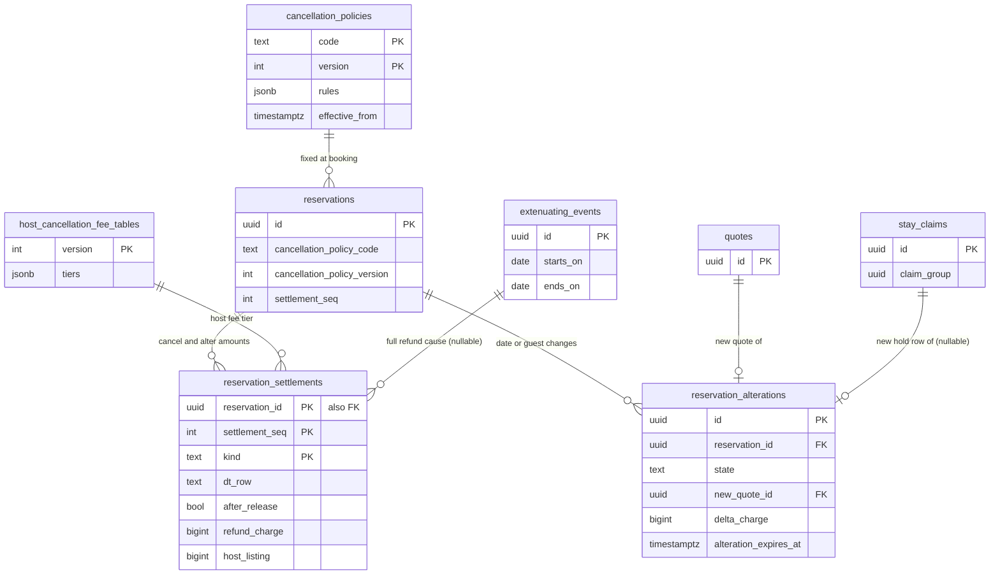

# Data model: キャンセルと変更

キャンセルポリシーの表、ホストのキャンセルの罰の表、キャンセルと変更の精算の記録、日程・人数の変更、やむをえない事情の事象。振る舞いは [cancellations-and-changes.md](../cancellations-and-changes.md)、方針は [ADR-0039](../../decisions/0039-cancellation-policy-table-and-refund-decision-table.md)・[ADR-0040](../../decisions/0040-host-and-ops-cancellations.md)・[ADR-0041](../../decisions/0041-alterations-with-claim-group-and-delta-settlement.md)。規約は [data-model.md](../data-model.md) の 3 節。

- どの表も core にある。設定の表（`cancellation_policies`・`host_cancellation_fee_tables`）は `config-loader` だけが入れ、行を変えない。`reservation_settlements`・`reservation_alterations` は `booking` の遷移が書く。`extenuating_events` は `ops-api` が書く。
- 精算の額は `computeSettlement`（`packages/cancellation`）の 1 か所で計算し、`reservation_settlements` に写して outbox で `ledger` に渡す。`ledger` は計算し直さない（[ledger-and-payouts.md](ledger-and-payouts.md)）。
- 返金は予約の時のポリシーの `(code, version)` で計算する（`reservations.cancellation_policy_code`・`cancellation_policy_version`。D-4）。

## 1. ER 図

- `reservations ||--o{ reservation_settlements`：同じ `settlement_seq` に `alter` と `cancel` の両方がありうる（変更の増額の番号で、後に決着する）。主キーに `kind` を含める（D-34）。
- `stay_claims ||--o| reservation_alterations`：人数だけの変更は新しい `hold` の行を作らない。

## 2. 表

### 2.1 `cancellation_policies`

キャンセルポリシーの表とバージョン。行を変えない。定義元：[cancellations-and-changes.md](../cancellations-and-changes.md) の 5.1・5.3 節。

| 列 | 型 | NULL | 既定 | 説明 |
| --- | --- | --- | --- | --- |
| `code` | `text` | NOT NULL | — | `flexible`・`moderate`・`strict`（MVP） |
| `version` | `integer` | NOT NULL | — | |
| `rules` | `jsonb` | NOT NULL | — | DT-CXL-001 の行の値（境の時間、残す割合）。形は開発リポジトリの Zod |
| `effective_from` | `timestamptz` | NOT NULL | — | |
| `approved_by` | `uuid[]` | NOT NULL | — | PM と法務（L7） |
| `content_hash` | `bytea` | NOT NULL | — | |
| `created_at` | `timestamptz` | NOT NULL | `now()` | |

- キー：PK `(code, version)`。索引：`(code, effective_from DESC)` — 見積もりの時の有効なバージョン。
- CHECK：`cardinality(approved_by) >= 2`。行の `UPDATE`・`DELETE` を権限で禁止（守る物）。
- RLS：公開の設定。区分：U。保持：消さない。

### 2.2 `host_cancellation_fee_tables`

ホストのキャンセルの罰の表（v1：10・25・50%）。定義元：同 6.1 節、[ADR-0040](../../decisions/0040-host-and-ops-cancellations.md)。

| 列 | 型 | NULL | 既定 | 説明 |
| --- | --- | --- | --- | --- |
| `version` | `integer` | NOT NULL | — | |
| `tiers` | `jsonb` | NOT NULL | — | `[{from_hours_before, to_hours_before, fee_bps}]` |
| `waiver_rules` | `jsonb` | NOT NULL | — | 12 か月の最初の 1 回の免除などの条件 |
| `effective_from` | `timestamptz` | NOT NULL | — | |
| `approved_by` | `uuid[]` | NOT NULL | — | |
| `content_hash` | `bytea` | NOT NULL | — | |

- キー：PK `(version)`。行を変えない。RLS：公開の設定。区分：F。

### 2.3 `reservation_settlements`

キャンセルの精算と変更の差額の記録（追記だけ）。outbox の `reservation.cancelled`・`reservation.altered` の額の元。定義元：同 5.4・7.2・8 節。

| 列 | 型 | NULL | 既定 | 説明 |
| --- | --- | --- | --- | --- |
| `reservation_id` | `uuid` | NOT NULL | — | |
| `settlement_seq` | `integer` | NOT NULL | — | |
| `kind` | `text` | NOT NULL | — | `cancel`・`alter` |
| `guest_id`・`host_account_id` | `uuid` | NOT NULL | — | RLS のための写し |
| `policy_code`・`policy_version` | `text`・`integer` | NOT NULL | — | 使ったポリシー（照合 C3） |
| `dt_row` | `text` | NOT NULL | — | DT-CXL-001 の行（1〜12）か DT-ALT-001 の行 |
| `actor_type` | `text` | NOT NULL | — | `guest`・`host_member`・`operator` |
| `reason_code` | `text` | NOT NULL | — | キャンセルの理由のコード、変更は `alteration` |
| `extenuating_event_id` | `uuid` | NULL | — | `ops_extenuating` のとき |
| `cancelled_at` | `timestamptz` | NULL | — | キャンセルの瞬間 `c` |
| `after_release` | `boolean` | NOT NULL | `false` | release の後の精算（型 9） |
| `charge_currency` | `char(3)` | NOT NULL | — | |
| `listing_currency` | `char(3)` | NOT NULL | — | |
| `paid_charge` | `bigint` | NULL | — | `cancel`：払った額（請求の通貨） |
| `refund_charge` | `bigint` | NULL | — | `cancel`：返金 |
| `retained_charge` | `bigint` | NULL | — | `cancel`：残す額 |
| `retained_listing` | `bigint` | NULL | — | `cancel`：残す額（リスティングの通貨。残した税を含む） |
| `service_fee_listing` | `bigint` | NULL | — | `cancel`：サービス料 |
| `host_listing` | `bigint` | NULL | — | `cancel`：ホストの取り分 |
| `host_fee_listing` | `bigint` | NULL | — | ホストのキャンセルの罰（表のバージョンは `host_fee_table_version`） |
| `host_fee_table_version` | `integer` | NULL | — | |
| `delta_charge` | `bigint` | NULL | — | `alter`：差額（請求の通貨。増額は正） |
| `delta_listing` | `bigint` | NULL | — | `alter`：差額（リスティングの通貨） |
| `lines` | `jsonb` | NOT NULL | — | 行ごとの `paid`・`refund`・`retained`（2 つの通貨） |
| `created_at` | `timestamptz` | NOT NULL | `now()` | |

- キー：PK `(reservation_id, settlement_seq, kind)`（領域の文書の `(reservation_id, settlement_seq)` に `kind` を足した。D-34）。FK → `reservations`。
- CHECK：
  - `kind IN ('cancel','alter')`。
  - `kind <> 'cancel' OR (paid_charge IS NOT NULL AND refund_charge >= 0 AND retained_charge >= 0 AND refund_charge + retained_charge = paid_charge AND host_listing + service_fee_listing = retained_listing AND cancelled_at IS NOT NULL)`（照合 C2 と [cancellations-and-changes.md](../cancellations-and-changes.md) の 5.4 節の手順 6）。
  - `kind <> 'alter' OR (delta_charge IS NOT NULL AND delta_listing IS NOT NULL AND sign(delta_charge) = sign(delta_listing))`。
  - `(host_fee_listing IS NULL) = (host_fee_table_version IS NULL)`。
- `UPDATE`・`DELETE` を権限で禁止する。
- RLS：予約の 2 者（読み出し）。サービス：`booking`（書き込み）、`ledger`（読み出し）。区分：F。
- 保持：10 年。S1 の量：1 日 600 行（キャンセル 8%、変更 2% の見込み）。

### 2.4 `reservation_alterations`

日程・人数の変更（DT-ALT-001）。定義元：同 7 節。

| 列 | 型 | NULL | 既定 | 説明 |
| --- | --- | --- | --- | --- |
| `id` | `uuid` | NOT NULL | `uuidv7()` | |
| `reservation_id` | `uuid` | NOT NULL | — | |
| `guest_id`・`host_account_id` | `uuid` | NOT NULL | — | RLS のための写し |
| `proposer_type` | `text` | NOT NULL | — | `guest`・`host_member`・`pms_app` |
| `proposer_id` | `uuid` | NOT NULL | — | |
| `state` | `text` | NOT NULL | — | `pending_host`・`pending_guest`・`awaiting_payment`・`accepted`・`declined`・`withdrawn`・`expired`・`failed`・`superseded` |
| `new_check_in`・`new_check_out` | `date` | NOT NULL | — | |
| `new_adults`・`new_children`・`new_infants`・`new_pets` | `smallint` | NOT NULL | — | |
| `new_quote_id` | `uuid` | NOT NULL | — | 差分の見積もり（全体の見積もり） |
| `new_claim_id` | `uuid` | NULL | — | 新しい日付の `hold` の行（人数だけの変更は NULL） |
| `charge_currency` | `char(3)` | NOT NULL | — | 予約と同じ（通貨を変える変更はない） |
| `delta_charge` | `bigint` | NOT NULL | — | 新しい総額 − 今の総額（請求の通貨） |
| `delta_listing` | `bigint` | NOT NULL | — | 同（リスティングの通貨） |
| `alteration_expires_at` | `timestamptz` | NULL | — | 応答 24 時間（チェックインの 2 時間前まで）か支払いの 10 分 |
| `settlement_seq` | `integer` | NULL | — | 受諾でお金が動いたときの番号 |
| `dt_row` | `text` | NULL | — | 最後に当たった DT-ALT-001 の行 |
| `idempotency_key` | `uuid` | NOT NULL | — | 提案の `Idempotency-Key` |
| `created_at` | `timestamptz` | NOT NULL | `now()` | |
| `decided_at` | `timestamptz` | NULL | — | |

- キー：PK `(id)`。部分 UK `(reservation_id) WHERE state IN ('pending_host','pending_guest','awaiting_payment')`。UK `(reservation_id, idempotency_key)`。FK `reservation_id → reservations`、`new_quote_id → quotes`、`new_claim_id → stay_claims`。
- 索引：`(alteration_expires_at) WHERE state IN ('pending_host','pending_guest','awaiting_payment')` — 照合 C5。期限の処理は予約の `alteration_expires_at` の写しで `deadline-runner` が拾う。
- CHECK：`state IN (...)`、`new_check_out > new_check_in`、`new_check_out - new_check_in <= 27`、`state <> 'accepted' OR decided_at IS NOT NULL`、`state <> 'accepted' OR delta_charge = 0 OR settlement_seq IS NOT NULL`。
- RLS：予約の 2 者。区分：P・F。保持：10 年。S1 の量：1 日 150 行。

### 2.5 `extenuating_events`

やむをえない事情（災害、交通の途絶、感染症）の範囲。該当する予約のキャンセルの画面で全額の返金を示す。定義元：同 6.2 節。

| 列 | 型 | NULL | 既定 | 説明 |
| --- | --- | --- | --- | --- |
| `id` | `uuid` | NOT NULL | `uuidv7()` | |
| `name` | `text` | NOT NULL | — | |
| `kind` | `text` | NOT NULL | — | `natural_disaster`・`transport_disruption`・`epidemic`・`other` |
| `municipality_codes` | `char(6)[]` | NOT NULL | `'{}'` | 範囲の自治体 |
| `area` | `geography(MultiPolygon,4326)` | NULL | — | 自治体より狭い範囲 |
| `stay_from`・`stay_to` | `date` | NOT NULL | — | 当たる泊の範囲（物件の現地の日付、含む） |
| `case_id` | `uuid` | NOT NULL | — | 運用の案件 |
| `created_by`・`approved_by` | `uuid` | NOT NULL | — | 作った運用者と 2 人目の承認 |
| `created_at` | `timestamptz` | NOT NULL | `now()` | |
| `ended_at` | `timestamptz` | NULL | — | |

- キー：PK `(id)`。索引：`GIN (municipality_codes)`、`GIST (area)`。
- CHECK：`stay_to >= stay_from`、`created_by <> approved_by`。
- RLS：公開の設定（読み出し）。書き込みは `ops-api`。区分：U。保持：10 年。
