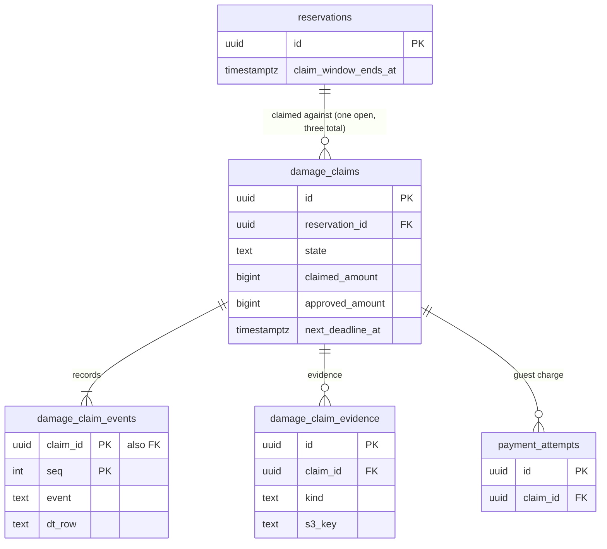

# Data model: 損害の請求

損害の請求、その事象、証拠。保証金（`deposit_holds`）は MVP の後で、ここに持たない（[ADR-0051](../../decisions/0051-security-deposits-deferred-shape.md)）。振る舞いは [deposits-and-claims.md](../deposits-and-claims.md)、方針は [ADR-0050](../../decisions/0050-damage-claim-lifecycle-and-guest-charge.md)。規約は [data-model.md](../data-model.md) の 3 節。

- どの表も core にあり、`booking` の中の損害の請求の関数（`packages/claims`）だけが書く。状態は DT-CLM-001（19 行）の遷移の関数だけが変える。
- 請求の額はリスティングの通貨（円）。ゲストへの請求は `payment_attempts`（`purpose = 'claim'`、冪等キー `<claim_id>:charge`。[payments-and-fx.md](payments-and-fx.md)）、お金は台帳の型 26・28・29（[ledger-and-payouts.md](ledger-and-payouts.md)）。
- 証拠の本体は S3 の `claims/<claim_id>/…`（[stores.md](stores.md) の 3 節）。

## 1. ER 図

- `damage_claims ||--|{ damage_claim_events`：作成と同じトランザクションで `submit` の事象を書くので 1 以上。

## 2. 表

### 2.1 `damage_claims`

損害の請求。2 者の RLS。定義元：[deposits-and-claims.md](../deposits-and-claims.md) の 4・5・7 節。

| 列 | 型 | NULL | 既定 | 説明 |
| --- | --- | --- | --- | --- |
| `id` | `uuid` | NOT NULL | `uuidv7()` | |
| `reservation_id` | `uuid` | NOT NULL | — | |
| `host_account_id` | `uuid` | NOT NULL | — | |
| `guest_id` | `uuid` | NOT NULL | — | |
| `state` | `text` | NOT NULL | `'submitted'` | `submitted`・`awaiting_guest`・`ops_review`・`charging`・`charged`・`charge_failed`・`compensated`・`closed`・`rejected`・`denied`・`withdrawn` |
| `currency` | `char(3)` | NOT NULL | `'JPY'` | |
| `claimed_amount` | `bigint` | NOT NULL | — | ホストの請求の額 |
| `guest_offered_amount` | `bigint` | NULL | — | ゲストが一部を認めた額 |
| `approved_amount` | `bigint` | NULL | — | ゲストか運用が認めた額 |
| `compensated_amount` | `bigint` | NULL | — | 補償の額 |
| `description` | `text` | NOT NULL | — | ホストの説明（4,000 文字） |
| `guest_response` | `text` | NULL | — | ゲストの反論（4,000 文字） |
| `guest_response_due_at` | `timestamptz` | NULL | — | `submit + 24h` |
| `evidence_due_at` | `timestamptz` | NOT NULL | — | `submit + 14 日` |
| `next_charge_at` | `timestamptz` | NULL | — | 失敗から 1・3・7 日 |
| `ops_decision_due_at` | `timestamptz` | NULL | — | `ops_review` の目安 7 日 |
| `next_deadline_at` | `timestamptz` | NULL | — | 期限の 4 列の生きている最小 |
| `charge_failures` | `smallint` | NOT NULL | `0` | |
| `case_id` | `uuid` | NULL | — | 運用の案件（content。論理の参照） |
| `decided_by` | `uuid` | NULL | — | 運用の判断の主体（JIT の権限） |
| `version` | `bigint` | NOT NULL | `1` | |
| `created_at` | `timestamptz` | NOT NULL | `now()` | |
| `closed_at` | `timestamptz` | NULL | — | 終わった状態の時刻 |

- キー：PK `(id)`。部分 UK `(reservation_id) WHERE state NOT IN ('closed','rejected','denied','withdrawn')`（開いた請求は 1 つ）。FK `reservation_id → reservations`。
- 索引：`(next_deadline_at) WHERE next_deadline_at IS NOT NULL` — `deadline-runner`。`(state, created_at)` — 運用の待ち行列。`(host_account_id, created_at)` — 認められない請求の率（T&S の信号）。
- CHECK：`state IN (...)`、`claimed_amount BETWEEN 1 AND 1000000`、`approved_amount IS NULL OR approved_amount BETWEEN 0 AND claimed_amount`、`charge_failures BETWEEN 0 AND 3`、`state <> 'charging' OR approved_amount > 0`、`state NOT IN ('closed','rejected','denied','withdrawn') OR closed_at IS NOT NULL`。1 予約で全部で 3 つまでは関数で数える。
- RLS：予約の 2 者（ホストのアカウントは `owner`・`full`）。サービス：`booking`、`deadline-runner`、`payments`・`ledger`（事象）、`ops-api`。区分：P（金額は F）。
- 保持：10 年（予約の記録と同じ）。S1 の量：1 日 30 行。

### 2.2 `damage_claim_events`

損害の請求の事象（追記だけ）。定義元：同 4.2 節。

| 列 | 型 | NULL | 既定 | 説明 |
| --- | --- | --- | --- | --- |
| `claim_id` | `uuid` | NOT NULL | — | |
| `seq` | `integer` | NOT NULL | — | |
| `guest_id`・`host_account_id` | `uuid` | NOT NULL | — | RLS のための写し |
| `event` | `text` | NOT NULL | — | `submit`・`guest_accept`・`guest_accept_partial`・`guest_dispute`・`deadline`・`host_withdraw`・`ops_decide`・`payment_succeeded`・`payment_failed`・`payment_action_required`・`ops_compensate` |
| `actor_type` | `text` | NOT NULL | — | `host_member`・`guest`・`operator`・`system` |
| `actor_id` | `uuid` | NULL | — | |
| `reason_code` | `text` | NULL | — | `window_closed`・`no_response` など |
| `from_state`・`to_state` | `text` | NULL・NOT NULL | — | |
| `dt_row` | `smallint` | NOT NULL | — | DT-CLM-001 の行（1〜19） |
| `idempotency_key` | `text` | NULL | — | |
| `ops_grant_id` | `uuid` | NULL | — | 運用の判断のとき |
| `created_at` | `timestamptz` | NOT NULL | `now()` | |

- キー：PK `(claim_id, seq)`。UK `(claim_id, idempotency_key)`。FK → `damage_claims`。
- CHECK：`dt_row BETWEEN 1 AND 19`、`actor_type <> 'operator' OR ops_grant_id IS NOT NULL`。
- RLS：予約の 2 者。区分：P。保持：10 年。

### 2.3 `damage_claim_evidence`

証拠（写真 20 枚、書類 10 件）。本体は S3。定義元：同 6 節。

| 列 | 型 | NULL | 既定 | 説明 |
| --- | --- | --- | --- | --- |
| `id` | `uuid` | NOT NULL | `uuidv7()` | |
| `claim_id` | `uuid` | NOT NULL | — | |
| `guest_id`・`host_account_id` | `uuid` | NOT NULL | — | RLS のための写し |
| `submitted_by_role` | `text` | NOT NULL | — | `host`・`guest` |
| `submitted_by` | `uuid` | NOT NULL | — | |
| `kind` | `text` | NOT NULL | — | `photo`・`estimate`・`receipt`・`other` |
| `s3_key` | `text` | NOT NULL | — | `claims/<claim_id>/<id>`（位置情報を消した後） |
| `bytes` | `integer` | NOT NULL | — | 写真 15 MiB まで |
| `created_at` | `timestamptz` | NOT NULL | `now()` | |

- キー：PK `(id)`。索引：`(claim_id)`。
- CHECK：`kind IN (...)`、`submitted_by_role IN (...)`、`bytes <= 15728640`。
- RLS：予約の 2 者と担当の運用者（JIT の権限）。区分：P。
- 保持：請求の終わりから `legal.claim_evidence_retention_days`（既定 1,095 日。L8・L12）。S3 のライフサイクルと行の削除。
