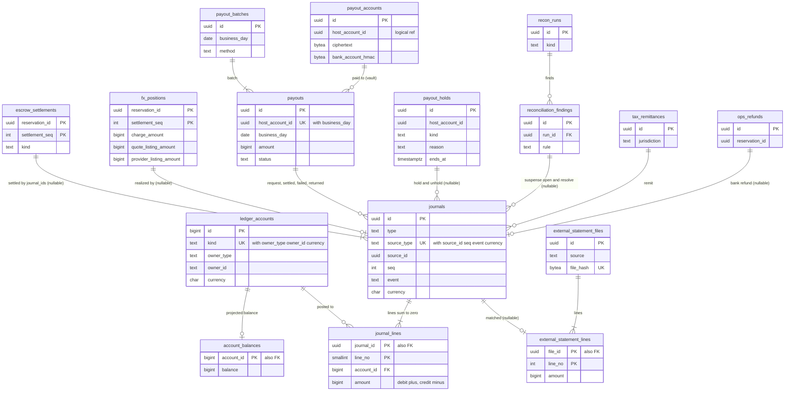

# Data model: 台帳と送金

口座、仕訳と仕訳の行、残高の射影、預かりの決着、為替の持ち高、送金と束と保留、銀行の営業日、ホストの明細、外部の明細、運用の銀行での返金、税の納付、照合、送金の口座（vault）。振る舞いは [ledger-and-payouts.md](../ledger-and-payouts.md)、方針は [ADR-0005](../../decisions/0005-payments-hold-capture-and-ledger.md)・[ADR-0008](../../decisions/0008-multi-currency-and-fx.md)・[ADR-0046](../../decisions/0046-chart-of-accounts-and-journal-types.md)〜[ADR-0049](../../decisions/0049-reconciliation-and-tax-collection-gate.md)。規約は [data-model.md](../data-model.md) の 3.6・3.7 節。

- `payout_accounts` だけが vault にある。他は ledger のクラスタにあり、`ledger` と `payouts` のサービスだけが書く。
- 仕訳と仕訳の行は追記だけ。`ledger_owner` の役割が持ち、アプリの役割にもマイグレーションの役割にも `UPDATE`・`DELETE` を与えない。誤りは仕訳の型（型 31、承認つきの `ops_adjustment`）で直す。
- 1 つの仕訳は 1 つの通貨に閉じる。請求の通貨とリスティングの通貨の違う決着は、同じ冪等キーの 2 つの仕訳（通貨で分ける）を同じトランザクションで書く（D-14）。
- core の予約・決済とは outbox の事象（SQS の FIFO、グループは予約の ID）でつなぐ。外部キーは張らない。

## 1. ER 図

- `escrow_settlements ||--|{ journals`：1 つの決着の行は 1〜2 の仕訳（通貨が違えば 2 つ）を `journal_ids` で指す。決着でない仕訳（`hold` など）は決着の行を持たない（nullable）。
- `payouts ||--o{ journals`：`payout_request`（型 11）と、`payout_settled`・`payout_failed`・`payout_returned`（型 12・15・16）のどれか。
- `payout_accounts ||--o{ payouts`：vault の行への論理の参照（`payouts.payout_account_id`）。

## 2. 勘定科目（22 の口座の種類）

正本は [ledger-and-payouts.md](../ledger-and-payouts.md) の 4.1 節。`ledger_accounts.kind` の CHECK と、口座を作る関数の表がこれに従う。

| `kind` | `owner_type`（`owner_id`） | 正常な側 | 負にならない |
| --- | --- | --- | --- |
| `psp_receivable` | `provider`（提供者の名前） | 借方 | — |
| `psp_chargeback_held` | `provider` | 借方 | ○ |
| `guest_funds_held` | `reservation`（予約の ID） | 貸方 | ○（決着で 0） |
| `guest_refund_payable` | `reservation` | 貸方 | ○ |
| `unapplied_payments` | `provider` | 貸方 | ○ |
| `host_payable` | `host_account` | 貸方 | ○ |
| `host_payable_hold` | `host_account` | 貸方 | ○ |
| `host_receivable` | `host_account` | 借方 | ○ |
| `payout_in_transit` | `host_account` | 貸方 | ○ |
| `claim_funds_held` | `claim`（損害の請求の ID） | 貸方 | ○（決着で 0） |
| `tax_payable` | `tax`（`<jurisdiction>:<tax_kind>`） | 貸方 | ○ |
| `service_fee_revenue` | `platform`（S2 からスロット `0`〜`15`） | 貸方 | — |
| `cancellation_fee_revenue` | `platform` | 貸方 | — |
| `fx_clearing` | `platform`（通貨ごと。S2 からスロット） | どちらも | — |
| `fx_gain_loss` | `platform` | どちらも | — |
| `psp_fee_expense` | `platform` | 借方 | — |
| `bank_fee_expense` | `platform` | 借方 | — |
| `compensation_expense` | `platform` | 借方 | — |
| `chargeback_loss_expense` | `platform` | 借方 | — |
| `bank` | `bank_account`（提携銀行の口座の名前） | 借方 | — |
| `suspense` | `reason`（理由のコード） | どちらも | — |
| `ops_adjustment` | `platform` | どちらも | — |

- 仕訳の型（31）は同 4.2 節：`hold`・`alter_hold`・`release`・`settle`・`refund_full`・`alter_refund`・`fx_conversion`・`refund_paid`・`post_release_refund`・`host_cancellation_fee`・`payout_request`・`payout_settled`・`unapplied_receipt`・`unapplied_refund`・`payout_failed`・`payout_returned`・`payable_hold`・`payable_unhold`・`chargeback_open`・`chargeback_won`・`chargeback_lost_platform`・`chargeback_lost_host`・`receivable_offset`・`psp_settlement`・`fx_realize`・`compensation`・`ops_refund`・`claim_charge`・`claim_release`・`tax_remit`・`suspense_open`・`suspense_resolve`（型 31 は 2 つの名前）。型を足すにはこの表と ADR の更新が要る。

## 3. 例：米ドルで払い、円でホストに送る予約の仕訳

[ledger-and-payouts.md](../ledger-and-payouts.md) の 5.2 節の予約 R を、表の行で書く。総額 69,200 円 = 47,291 セント（見積もりの相場 0.006834）、ホスト H の取り分 59,000 円（宿泊税 1,200 円を含む）、サービス料 10,200 円。提供者 `psp-a` は円で精算する（472.91 ドルを 149.50 円で換え 70,700 円、手数料 2,121 円は例の値）。

**口座**（`ledger_accounts`。ID は例）

| `id` | `kind` | `owner_type` | `owner_id` | `currency` |
| --- | --- | --- | --- | --- |
| 101 | `psp_receivable` | `provider` | `psp-a` | USD |
| 201 | `guest_funds_held` | `reservation` | R | USD |
| 301 | `fx_clearing` | `platform` | `fx` | USD |
| 302 | `fx_clearing` | `platform` | `fx` | JPY |
| 303 | `fx_gain_loss` | `platform` | `fx` | JPY |
| 401 | `bank` | `bank_account` | `partner-main` | JPY |
| 402 | `psp_fee_expense` | `platform` | `psp` | JPY |
| 501 | `host_payable` | `host_account` | H | JPY |
| 502 | `payout_in_transit` | `host_account` | H | JPY |
| 601 | `service_fee_revenue` | `platform` | `0` | JPY |

**仕訳**（`journals`。冪等キーは `(source_type, source_id, seq, event, currency)`）

| 仕訳 | 時 | `type` | 冪等キー | `currency` |
| --- | --- | --- | --- | --- |
| J1 | 10/10 確定 | `hold` | `(reservation, R, 0, hold, USD)` | USD |
| J2 | 10/13 精算 | `psp_settlement` | `(psp_settlement, F1, 17, settle, USD)` | USD |
| J3 | 10/13 精算 | `psp_settlement` | `(psp_settlement, F1, 17, settle, JPY)` | JPY |
| J4 | 12/31 15:00 | `fx_conversion` | `(reservation, R, 0, release, USD)` | USD |
| J5 | 12/31 15:00 | `release` | `(reservation, R, 0, release, JPY)` | JPY |
| J6 | 12/31 夜 | `fx_realize` | `(fx_position, R, 0, realize, JPY)` | JPY |
| J7 | 1/4 09:30 | `payout_request` | `(payout, P, 0, request, JPY)` | JPY |
| J8 | 1/4 | `payout_settled` | `(payout, P, 0, settled, JPY)` | JPY |

- F1 は提供者の精算のファイル（`external_statement_files`）、17 はその行の番号。P は送金（`payouts`）。

**仕訳の行**（`journal_lines`。借方は正、貸方は負）

| 仕訳 | `line_no` | `account_id` | `amount` |
| --- | --- | --- | --- |
| J1 | 1 | 101 `psp_receivable` USD | +47,291 |
| J1 | 2 | 201 `guest_funds_held:R` USD | −47,291 |
| J2 | 1 | 301 `fx_clearing` USD | +47,291 |
| J2 | 2 | 101 `psp_receivable` USD | −47,291 |
| J3 | 1 | 401 `bank` JPY | +68,579 |
| J3 | 2 | 402 `psp_fee_expense` JPY | +2,121 |
| J3 | 3 | 302 `fx_clearing` JPY | −70,700 |
| J4 | 1 | 201 `guest_funds_held:R` USD | +47,291 |
| J4 | 2 | 301 `fx_clearing` USD | −47,291 |
| J5 | 1 | 302 `fx_clearing` JPY | +69,200 |
| J5 | 2 | 501 `host_payable:H` JPY | −59,000 |
| J5 | 3 | 601 `service_fee_revenue` JPY | −10,200 |
| J6 | 1 | 302 `fx_clearing` JPY | +1,500 |
| J6 | 2 | 303 `fx_gain_loss` JPY | −1,500 |
| J7 | 1 | 501 `host_payable:H` JPY | +59,000 |
| J7 | 2 | 502 `payout_in_transit:H` JPY | −59,000 |
| J8 | 1 | 502 `payout_in_transit:H` JPY | +59,000 |
| J8 | 2 | 401 `bank` JPY | −59,000 |

- 各仕訳の行の和は 0（遅延の制約のトリガー）。行の口座の通貨は仕訳の通貨と同じ（トリガー）。
- 1/4 の後の残高（`account_balances`。正常な側の向きで正の数）：`guest_funds_held:R` 0、`fx_clearing` USD 0（+47,291 − 47,291）、`fx_clearing` JPY 0（−70,700 + 69,200 + 1,500）、`host_payable:H` 0、`payout_in_transit:H` 0、`bank` 9,579（68,579 − 59,000）、`psp_fee_expense` 2,121、`service_fee_revenue` 10,200、`fx_gain_loss` 1,500（貸方の向き）。全口座の和は通貨ごとに 0。
- `escrow_settlements`：`(R, 0, release, journal_ids = {J4, J5})` の 1 行。キャンセルの精算が後から来ても、主キーで 2 つ目の決着を拒み、事象を `superseded` として記録する。
- `fx_positions`：`(R, 0)` に請求の通貨 47,291 セント、見積もりの相場の額 69,200 円、提供者の換算の額 70,700 円。両方がそろった 12/31 夜に J6 を書き、`realized_journal_id = J6`。

## 4. 表

### 4.1 `ledger_accounts`

口座。`(kind, owner_type, owner_id, currency)` で一意（領域の文書の `accounts`。D-1）。定義元：同 4.1 節。

| 列 | 型 | NULL | 既定 | 説明 |
| --- | --- | --- | --- | --- |
| `id` | `bigint` | NOT NULL | IDENTITY | 行の多い `journal_lines` の索引を小さくする |
| `kind` | `text` | NOT NULL | — | 2 節の 22 種類 |
| `owner_type` | `text` | NOT NULL | — | |
| `owner_id` | `text` | NOT NULL | — | UUID の文字列か名前 |
| `currency` | `char(3)` | NOT NULL | — | |
| `nonneg` | `boolean` | NOT NULL | — | 2 節の「負にならない」の写し（残高の CHECK） |
| `sentinel` | `boolean` | NOT NULL | `false` | 見張りの予約・ホストの口座（照合と収益の集計から外す） |
| `closed_at` | `timestamptz` | NULL | — | 決着して 0 になった予約の口座（夜間に印。仕訳は残す） |
| `created_at` | `timestamptz` | NOT NULL | `now()` | |

- キー：PK `(id)`。UK `(kind, owner_type, owner_id, currency)`。
- CHECK：`kind IN (...)`、`currency ~ '^[A-Z]{3}$'`。
- RLS：ホストのアカウントは自分の `host_payable`・`host_payable_hold`・`host_receivable`・`payout_in_transit` を読める（ホストの明細）。他はサービス（`ledger`、`payouts`、財務の読み出し）。区分：F。
- 保持：10 年。S1 の量：予約ごとに 2〜3 口座で 1 年 700 万行。

### 4.2 `journals`

仕訳の見出し（追記だけ）。分割しない（冪等の一意を全期間に効かせる）。定義元：同 4.2・4.3 節。

| 列 | 型 | NULL | 既定 | 説明 |
| --- | --- | --- | --- | --- |
| `id` | `uuid` | NOT NULL | `uuidv7()` | |
| `type` | `text` | NOT NULL | — | 31 の型 |
| `source_type` | `text` | NOT NULL | — | `reservation`・`refund`・`payout`・`payment_attempt`・`hold`・`chargeback`・`journal`・`psp_settlement`・`fx_position`・`compensation`・`ops_refund`・`claim`・`tax_return`・`recon_break` |
| `source_id` | `uuid` | NOT NULL | — | |
| `seq` | `integer` | NOT NULL | — | `settlement_seq`、行の番号、または 0 |
| `event` | `text` | NOT NULL | — | `hold`・`release`・`settle`・`refund`・`paid` など |
| `currency` | `char(3)` | NOT NULL | — | 1 つの仕訳に 1 つの通貨 |
| `effective_at` | `timestamptz` | NOT NULL | — | 事象の時刻 |
| `fx_snapshot_id` | `uuid` | NULL | — | 型 7・9・24・25（core の `fx_rate_snapshots`。論理の参照） |
| `legal_config_version` | `text` | NULL | — | `legal.*` で動く型（`tax_payable` の振り替え、型 30） |
| `approved_by` | `uuid[]` | NULL | — | 手の仕訳（型 26・27・31、`ops_adjustment`）の承認者 |
| `created_at` | `timestamptz` | NOT NULL | `now()` | |

- キー：PK `(id)`。UK `(source_type, source_id, seq, event, currency)`（守る物。衝突は前の仕訳を返す）。
- 索引：`(source_type, source_id)` — 予約と台帳の照合（R1〜R5）。`(effective_at)` — 月次の明細と 3 者の照合。
- CHECK：`type IN (...)`、`approved_by IS NULL OR cardinality(approved_by) >= 2`、`type NOT IN ('compensation','ops_refund','suspense_open','suspense_resolve') OR approved_by IS NOT NULL`。
- `UPDATE`・`DELETE` を権限とトリガーで拒む。
- RLS：サービス（`ledger`）。区分：F。保持：10 年（L4・L5・L8）。
- S1 の量：1 日 3 万行（予約 1 件に 3〜5）、1 年 1,100 万行。

### 4.3 `journal_lines`

仕訳の行（追記だけ）。定義元：同 4.3 節。

| 列 | 型 | NULL | 既定 | 説明 |
| --- | --- | --- | --- | --- |
| `journal_id` | `uuid` | NOT NULL | — | 分割の鍵 |
| `line_no` | `smallint` | NOT NULL | — | |
| `account_id` | `bigint` | NOT NULL | — | |
| `amount` | `bigint` | NOT NULL | — | 借方は正、貸方は負 |

- キー：PK `(journal_id, line_no)`。FK `journal_id → journals`、`account_id → ledger_accounts`。
- 索引：`(account_id, journal_id)` — 口座の明細と残高の照合（R7）。
- CHECK：`amount <> 0`。遅延の制約のトリガー：仕訳ごとの `SUM(amount) = 0`。トリガー：行の口座の通貨 = `journals.currency`。
- 分割：`journal_id` の範囲（UUIDv7 の月の境）。2 年を過ぎた区切りは `records` へ Parquet で写して `DETACH`（10 年残す）。
- RLS：`ledger_accounts` と同じ（ホストは自分の口座の行）。区分：F。
- S1 の量：1 日 9 万行。

### 4.4 `account_balances`

口座ごとの残高の射影。仕訳と同じトランザクションで更新する。定義元：同 4.3 節。

| 列 | 型 | NULL | 既定 | 説明 |
| --- | --- | --- | --- | --- |
| `account_id` | `bigint` | NOT NULL | — | |
| `balance` | `bigint` | NOT NULL | `0` | 正常な側の向きで正（どちらもの口座は借方を正） |
| `nonneg` | `boolean` | NOT NULL | — | 口座の写し |
| `last_journal_id` | `uuid` | NULL | — | |
| `updated_at` | `timestamptz` | NOT NULL | `now()` | |

- キー：PK `(account_id)`。FK → `ledger_accounts`。
- CHECK：`NOT nonneg OR balance >= 0`。更新は `UPDATE ... SET balance = balance + $d WHERE account_id = $a AND (NOT nonneg OR balance + $d >= 0)`。
- 照合 R7 が仕訳の和と比べる。直すのは仕訳だけ（行を直接書き換えない）。
- RLS：`ledger_accounts` と同じ。区分：F。

### 4.5 `escrow_settlements`

預かりの決着（予約 × 番号に 1 つ）。定義元：同 5 節、[ADR-0047](../../decisions/0047-settlement-seq-and-escrow-settlement.md)。

| 列 | 型 | NULL | 既定 | 説明 |
| --- | --- | --- | --- | --- |
| `reservation_id` | `uuid` | NOT NULL | — | |
| `settlement_seq` | `integer` | NOT NULL | — | |
| `kind` | `text` | NOT NULL | — | `release`・`settle`・`refund`・`post_release_refund` |
| `journal_ids` | `uuid[]` | NOT NULL | — | 1〜2 の仕訳 |
| `superseded_events` | `jsonb` | NOT NULL | `'[]'` | 主キーで拒んだ遅れた決着の事象の ID |
| `sentinel` | `boolean` | NOT NULL | `false` | |
| `created_at` | `timestamptz` | NOT NULL | `now()` | |

- キー：PK `(reservation_id, settlement_seq)`（守る物）。
- CHECK：`kind IN (...)`、`cardinality(journal_ids) BETWEEN 1 AND 2`、`settlement_seq >= 0`。
- 決着の後の `guest_funds_held:<reservation_id>` は通貨ごとに 0（照合 R3）。
- RLS：サービス（`ledger`）。区分：F。保持：10 年。S1 の量：1 日 6,500 行。

### 4.6 `fx_positions`

予約 × 番号の為替の持ち高。定義元：同 5.2 節。

| 列 | 型 | NULL | 既定 | 説明 |
| --- | --- | --- | --- | --- |
| `reservation_id` | `uuid` | NOT NULL | — | |
| `settlement_seq` | `integer` | NOT NULL | — | |
| `charge_currency` | `char(3)` | NOT NULL | — | |
| `charge_amount` | `bigint` | NOT NULL | — | 請求の通貨の額 |
| `listing_currency` | `char(3)` | NOT NULL | — | |
| `quote_listing_amount` | `bigint` | NOT NULL | — | 見積もりの相場でのリスティングの通貨の額 |
| `provider_listing_amount` | `bigint` | NULL | — | 提供者の精算の換算の額（型 24 の後） |
| `fx_snapshot_id` | `uuid` | NOT NULL | — | |
| `realized_journal_id` | `uuid` | NULL | — | 型 25 |
| `updated_at` | `timestamptz` | NOT NULL | `now()` | |

- キー：PK `(reservation_id, settlement_seq)`。索引：`(updated_at) WHERE realized_journal_id IS NULL` — 開いた持ち高（財務の画面、照合 R8）。
- CHECK：`charge_currency <> listing_currency`。
- RLS：サービス（`ledger`、財務）。区分：F。保持：10 年。S1 の量：外国の通貨の予約（30% の見込み）で 1 日 2,000 行。

### 4.7 `payouts`

ホストへの送金（1 ホストのアカウントに 1 営業日 1 つ）。定義元：同 7.2 節。

| 列 | 型 | NULL | 既定 | 説明 |
| --- | --- | --- | --- | --- |
| `id` | `uuid` | NOT NULL | `uuidv7()` | 提携銀行への冪等キー |
| `host_account_id` | `uuid` | NOT NULL | — | |
| `payout_account_id` | `uuid` | NOT NULL | — | vault の `payout_accounts`（論理の参照） |
| `business_day` | `date` | NOT NULL | — | 束の営業日 |
| `batch_id` | `uuid` | NULL | — | |
| `amount` | `bigint` | NOT NULL | — | 09:00 の `host_payable` の残高（相殺の後） |
| `currency` | `char(3)` | NOT NULL | `'JPY'` | |
| `status` | `text` | NOT NULL | `'pending'` | `pending`・`submitted`・`paid`・`failed`・`returned`（前にだけ進む） |
| `bank_request_ref` | `text` | NULL | — | 依頼の前に保存する参照（全銀の EDI 情報にも使う） |
| `bank_ref` | `text` | NULL | — | 銀行の受付の参照 |
| `failure_code` | `text` | NULL | — | |
| `submitted_at`・`paid_at`・`returned_at` | `timestamptz` | NULL | — | |
| `created_at` | `timestamptz` | NOT NULL | `now()` | |

- キー：PK `(id)`。UK `(host_account_id, business_day)`、UK `(bank_request_ref)`。FK `batch_id → payout_batches`。
- 索引：`(host_account_id, created_at)` — ホストの画面。`(status) WHERE status IN ('pending','submitted')` — 照合 R11。
- CHECK：`amount > 0`、`status IN (...)`、`currency = 'JPY'`（MVP）。
- RLS：ホストのアカウント（`owner`・`full` の読み出し）。サービス：`payouts`。区分：F。保持：10 年。S1 の量：1 日 3,000 行。

### 4.8 `payout_batches`

送金の束。定義元：同 7.2 節、[ADR-0048](../../decisions/0048-release-payout-batching-and-holds.md)。

| 列 | 型 | NULL | 既定 | 説明 |
| --- | --- | --- | --- | --- |
| `id` | `uuid` | NOT NULL | `uuidv7()` | |
| `business_day` | `date` | NOT NULL | — | |
| `seq` | `smallint` | NOT NULL | `1` | 1 万件を超えたときの 2 回目 |
| `method` | `text` | NOT NULL | `'api'` | `api`・`zengin_file` |
| `payout_count` | `integer` | NOT NULL | — | 件数 |
| `total_amount` | `bigint` | NOT NULL | — | |
| `status` | `text` | NOT NULL | `'building'` | `building`・`submitted`・`completed`・`partially_failed` |
| `file_s3_key` | `text` | NULL | — | 全銀の形式のファイル（`records/bank/zengin/…`） |
| `scheduled_at` | `timestamptz` | NOT NULL | — | 09:30（日本時間） |
| `created_at` | `timestamptz` | NOT NULL | `now()` | |

- キー：PK `(id)`。UK `(business_day, seq)`。
- RLS：サービス（`payouts`、財務）。区分：F。保持：10 年。

### 4.9 `payout_holds`

送金の待ち（`wait`）と措置の保留（`hold`）。持ち主は `payouts`。連絡先の変更・回復・最後のパスキーの削除の待ちは core の `payout_waits`（[accounts-hosts-and-cohosts.md](accounts-hosts-and-cohosts.md)）。定義元：同 7.3 節。

| 列 | 型 | NULL | 既定 | 説明 |
| --- | --- | --- | --- | --- |
| `id` | `uuid` | NOT NULL | `uuidv7()` | |
| `host_account_id` | `uuid` | NOT NULL | — | |
| `kind` | `text` | NOT NULL | — | `wait`・`hold` |
| `reason` | `text` | NOT NULL | — | `wait`：`payout_account_changed`・`new_host_first_stays`。`hold`：`fraud_suspected`・`kyc_incomplete`・`kyc_mismatch`・`bank_returned`・`ops_case` |
| `starts_at` | `timestamptz` | NOT NULL | `now()` | |
| `ends_at` | `timestamptz` | NULL | — | `wait` の終わり（口座の変更 + 72h、最初の 3 件の各 `check_out_at` + 24h の最も遅い時刻）。`hold` は NULL |
| `ended_at` | `timestamptz` | NULL | — | `hold` の解除、`wait` の終わりの後の掃除 |
| `source_reservation_ids` | `uuid[]` | NOT NULL | `'{}'` | `new_host_first_stays` に数えた予約（ホストのアカウントで合わせて 3 つまで） |
| `moderation_action_id` | `uuid` | NULL | — | `fraud_suspected` の措置（content。論理の参照） |
| `case_id` | `uuid` | NULL | — | `ops_case` |
| `hold_journal_id` | `uuid` | NULL | — | 型 17 |
| `unhold_journal_id` | `uuid` | NULL | — | 型 18 |
| `created_by_service` | `text` | NOT NULL | — | `payouts`・`trust-safety`・`identity`・`ops-api` |

- キー：PK `(id)`。部分 UK `(host_account_id, reason) WHERE ended_at IS NULL`（同じ理由の待ちは延ばす）。
- 索引：`(host_account_id) WHERE ended_at IS NULL` — `payout-batcher` と release の行き先。
- CHECK：`kind IN (...)`、`(kind = 'wait') = (reason IN ('payout_account_changed','new_host_first_stays'))`、`kind <> 'wait' OR ends_at IS NOT NULL`、`reason <> 'fraud_suspected' OR moderation_action_id IS NOT NULL`、`cardinality(source_reservation_ids) <= 3`。
- RLS：ホストのアカウント（`owner` の読み出し。理由は一般の文で出す）。サービス：`payouts`（書き込みの唯一の持ち主）、`ledger`（release の行き先の読み出し）。区分：F。保持：10 年。

### 4.10 `bank_calendar`

銀行の営業日。定義元：同 6.1 節。

| 列 | 型 | NULL | 既定 | 説明 |
| --- | --- | --- | --- | --- |
| `day` | `date` | NOT NULL | — | |
| `is_business_day` | `boolean` | NOT NULL | — | |
| `cutoff_time` | `time` | NULL | — | 提携銀行の締め |
| `source_version` | `text` | NOT NULL | — | |

- キー：PK `(day)`。RLS：公開の設定。区分：U。保持：消さない。

### 4.11 `host_statements`

ホストの月ごとの明細（PDF と CSV）。定義元：同 8 節。

| 列 | 型 | NULL | 既定 | 説明 |
| --- | --- | --- | --- | --- |
| `host_account_id` | `uuid` | NOT NULL | — | |
| `month` | `date` | NOT NULL | — | 月の初日 |
| `pdf_s3_key`・`csv_s3_key` | `text` | NOT NULL | — | `reports/statements/<host_account_id>/<YYYY-MM>.*` |
| `totals` | `jsonb` | NOT NULL | — | 泊の料金・清掃料・税（管轄ごと）・サービス料・罰・相殺・送金の和 |
| `generated_at` | `timestamptz` | NOT NULL | `now()` | |

- キー：PK `(host_account_id, month)`。RLS：ホストのアカウント（`owner`・`full`）。区分：F。保持：10 年。

### 4.12 `external_statement_files`・`external_statement_lines`

提供者の精算と銀行の明細の取り込み（3 者の照合 R9・R10、型 24 の冪等キーの元）。この工程で足した最小の形（D-17）。

| 列（`external_statement_files`） | 型 | NULL | 既定 | 説明 |
| --- | --- | --- | --- | --- |
| `id` | `uuid` | NOT NULL | `uuidv7()` | 型 24 の `source_id` |
| `source` | `text` | NOT NULL | — | `psp:<provider>`・`bank:<account>` |
| `statement_date` | `date` | NOT NULL | — | |
| `file_s3_key` | `text` | NOT NULL | — | `records/statements/…` |
| `file_hash` | `bytea` | NOT NULL | — | 同じファイルの 2 回目の取り込みを拒む |
| `line_count` | `integer` | NOT NULL | — | |
| `imported_at` | `timestamptz` | NOT NULL | `now()` | |

| 列（`external_statement_lines`） | 型 | NULL | 既定 | 説明 |
| --- | --- | --- | --- | --- |
| `file_id` | `uuid` | NOT NULL | — | |
| `line_no` | `integer` | NOT NULL | — | 型 24 の `seq` |
| `external_ref` | `text` | NOT NULL | — | 提供者の取引の参照、銀行の参照 |
| `amount` | `bigint` | NOT NULL | — | 符号つき |
| `currency` | `char(3)` | NOT NULL | — | |
| `value_date` | `date` | NOT NULL | — | |
| `match_status` | `text` | NOT NULL | `'unmatched'` | `matched`・`unmatched`・`suspense` |
| `matched_journal_id` | `uuid` | NULL | — | |

- キー：`external_statement_files` は PK `(id)`、UK `(file_hash)`。`external_statement_lines` は PK `(file_id, line_no)`、FK `file_id → external_statement_files`、索引 `(match_status) WHERE match_status <> 'matched'`。
- RLS：サービス（`ledger` の照合、財務）。区分：F。保持：10 年。S1 の量：1 日 2 万行。

### 4.13 `ops_refunds`

運用の銀行での返金（提供者の返金が恒久的に失敗したとき。型 27）。この工程で足した最小の形（D-17）。受け取りの口座の情報は案件（content）に置き、ここに持たない。

| 列 | 型 | NULL | 既定 | 説明 |
| --- | --- | --- | --- | --- |
| `id` | `uuid` | NOT NULL | `uuidv7()` | 型 27 の `source_id` |
| `reservation_id` | `uuid` | NOT NULL | — | |
| `refund_id` | `uuid` | NOT NULL | — | core の `refunds`（`failed_permanent`） |
| `amount` | `bigint` | NOT NULL | — | |
| `currency` | `char(3)` | NOT NULL | — | |
| `case_id` | `uuid` | NOT NULL | — | |
| `status` | `text` | NOT NULL | `'requested'` | `requested`・`paid`・`failed` |
| `approved_by` | `uuid[]` | NOT NULL | — | 財務の 2 人 |
| `paid_at` | `timestamptz` | NULL | — | |

- キー：PK `(id)`。UK `(refund_id)`。CHECK：`cardinality(approved_by) >= 2`。
- RLS：サービス（`payouts`、財務）。区分：F。保持：10 年。法的な整理は L5。

### 4.14 `tax_remittances`

税の納付（`legal.lodging_tax_collector = platform` の管轄だけ。型 30）。この工程で足した最小の形（D-17）。

| 列 | 型 | NULL | 既定 | 説明 |
| --- | --- | --- | --- | --- |
| `id` | `uuid` | NOT NULL | `uuidv7()` | 型 30 の `source_id`（`tax_return`） |
| `jurisdiction` | `text` | NOT NULL | — | |
| `tax_kind` | `text` | NOT NULL | — | |
| `period_start`・`period_end` | `date` | NOT NULL | — | |
| `amount` | `bigint` | NOT NULL | — | |
| `currency` | `char(3)` | NOT NULL | `'JPY'` | |
| `legal_config_version` | `text` | NOT NULL | — | |
| `status` | `text` | NOT NULL | `'draft'` | `draft`・`filed`・`paid` |
| `paid_at` | `timestamptz` | NULL | — | |

- キー：PK `(id)`。UK `(jurisdiction, tax_kind, period_start)`。
- RLS：サービス（`ledger`、財務）。区分：F。保持：10 年。L4 の後に使う。

### 4.15 `recon_runs`・`reconciliation_findings`（ledger）

台帳の照合（R1〜R11）の実行と外れ。形は core の同じ名前の表と同じ（[ops.md](ops.md) の 3.11・3.12 節。D-18）。ledger の外れの行は、型 31 の冪等キーの `recon_break` の元になる（`journals.source_id = reconciliation_findings.id`）。

### 4.16 `payout_accounts`（vault）

送金の口座。`payouts` だけが読む。画面には下 4 桁だけ。定義元：同 7.1 節、[accounts.md](../accounts.md) の 7.4 節。

| 列 | 型 | NULL | 既定 | 説明 |
| --- | --- | --- | --- | --- |
| `id` | `uuid` | NOT NULL | `uuidv7()` | |
| `host_account_id` | `uuid` | NOT NULL | — | core の `host_accounts`（論理の参照） |
| `status` | `text` | NOT NULL | `'active'` | `active`・`replaced`・`removed` |
| `previous_account_id` | `uuid` | NULL | — | 変更の前の口座（「これは私ではない」で戻す） |
| `ciphertext` | `bytea` | NOT NULL | — | 銀行、支店、種類、番号、名義のカナの JSON の暗号文 |
| `nonce` | `bytea` | NOT NULL | — | |
| `key_version` | `integer` | NOT NULL | — | 主体の鍵（`purpose = bank`、主体 = ホストのアカウント） |
| `aad_version` | `smallint` | NOT NULL | `1` | |
| `bank_code` | `char(4)` | NOT NULL | — | 金融機関のコード（公開の値） |
| `last4` | `char(4)` | NOT NULL | — | |
| `bank_account_hmac` | `bytea` | NOT NULL | — | 同じ口座の多くのホストのアカウントの検出 |
| `name_match_status` | `text` | NOT NULL | — | `matched`・`needs_review`・`mismatch`（`identity.nameMatches`） |
| `created_by` | `uuid` | NOT NULL | — | `owner` |
| `created_at` | `timestamptz` | NOT NULL | `now()` | |
| `replaced_at` | `timestamptz` | NULL | — | |

- キー：PK `(id)`。部分 UK `(host_account_id) WHERE status = 'active'`。索引：`(bank_account_hmac)`。
- RLS：ホストのアカウント（`owner` の書き込み。読み出しは下 4 桁と状態だけの関数）。サービス：`payouts`（`kms-vault-bank`、`purpose = payout-account`）。読み出しは `vault_access_log` に書く。区分：V。
- 保持：削除・退会まで。変更の前の口座は 1 年（鍵の破棄）。S1 の量：5 万行。
