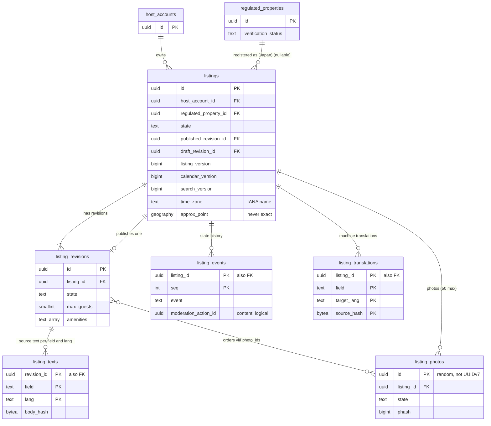

# Data model: リスティング、内容、写真

リスティング、改訂、状態の履歴、言語ごとの原文、機械翻訳、写真。振る舞いは [listings-and-content.md](../listings-and-content.md)、方針は [ADR-0010](../../decisions/0010-listing-states-and-revisions.md)・[ADR-0011](../../decisions/0011-photo-pipeline-and-hashes.md)・[ADR-0012](../../decisions/0012-multilingual-content-and-machine-translation.md)。位置から求めた列（`approx_point` など）の意味は [location-and-places.md](location-and-places.md)、順位の材料の列は [search-and-snapshots.md](search-and-snapshots.md)。規約は [data-model.md](../data-model.md) の 3 節。

- どの表も core にあり、`listings` のサービスだけが書く。ただし `listings.calendar_version` は `availability`、`listings.rank_*` は `search-indexer` の日次のジョブ、`listings.search_version` は変化を起こしたサービスが同じトランザクションで上げる。
- 状態の遷移は `transitionListing(listing_id, event, actor, expected_version)` だけが書く。`suspended` への遷移と解除は T&S の措置の関数だけが起こす（[ADR-0009](../../decisions/0009-trust-and-safety-and-ml-boundary.md)）。
- 公開の読み出しは `listingVisible()`（DT-LST-VIS-001）を通した関数とビュー `listings_public` だけ。`listings` を直接 `SELECT *` で公開しない。

## 1. ER 図

- `listings ||--o| listing_revisions`（公開）：`draft`・`in_review` の最初の公開の前は 0。`listings ||--|{ listing_revisions`（全部）：作成と同じトランザクションで最初の改訂を作るので 1 以上。
- `listing_revisions }o--o{ listing_photos`：改訂は写真の並びを `photo_ids` の配列で持つ。同じ写真を複数の改訂が指す（写真の実体を写さない）。

## 2. 制約の実装

| 制約 | 実装 |
| --- | --- |
| 公開している改訂は書き換えない | `listing_revisions` の `state = 'published'`・`'superseded'` の行の内容の列の `UPDATE` を拒むトリガー。入れ替えは `published_revision_id` の書き換えと `state` の遷移だけ |
| 状態は遷移の関数だけ | `listings.state` の `UPDATE` 権限を `listings` の遷移の役割だけに与える。`listing_events` に行を足さない遷移を lint で拒む |
| 将来の予約がある間は `archived` にしない | 遷移の関数で `reservations` を確かめる（409 `has_future_reservations`） |
| 見積もりの古さ | `listing_version` を改訂の入れ替え・チェックインの時刻・即時予約・キャンセルポリシーの変化で 1 上げる（[ADR-0037](../../decisions/0037-quote-binding-and-idempotency.md)）。料金の変化では上げない（`pricing_rules.pricing_version`） |
| 正確な位置を持たない | `listings` に住所・正確な緯度経度の列を作らない（スキーマの検査）。正確な位置は vault の `exact_locations` |
| 写真の位置情報を残さない | `media-processor` の出力の読み直しの確かめ（[listings-and-content.md](../listings-and-content.md) の 6.2 節）。DB の制約ではない |

## 3. 表

### 3.1 `listings`

リスティングの正本（内容は改訂）。定義元：[listings-and-content.md](../listings-and-content.md) の 4 節、[location-and-geo.md](../location-and-geo.md) の 4.4 節、[search-and-ranking.md](../search-and-ranking.md) の 7 節。

| 列 | 型 | NULL | 既定 | 説明 |
| --- | --- | --- | --- | --- |
| `id` | `uuid` | NOT NULL | `uuidv7()` | |
| `host_account_id` | `uuid` | NOT NULL | — | |
| `regulated_property_id` | `uuid` | NULL | — | 日本の物件の届出住宅（領域の文書の `jp_registration_ref`。D-8）。日本の物件は公開に要る |
| `country` | `char(2)` | NOT NULL | `'JP'` | 物件の国 |
| `state` | `text` | NOT NULL | `'draft'` | `draft`・`in_review`・`listed`・`snoozed`・`suspended`・`archived` |
| `published_revision_id` | `uuid` | NULL | — | 公開している改訂 |
| `draft_revision_id` | `uuid` | NULL | — | 編集中の改訂 |
| `listing_version` | `bigint` | NOT NULL | `1` | 見積もりの古さの確かめ（4.4 節） |
| `calendar_version` | `bigint` | NOT NULL | `0` | `stay_claims`・`calendar_days`・`listing_rules` の変化で 1 上げる（[ADR-0018](../../decisions/0018-calendar-settings-blocks-and-calendar-version.md)） |
| `search_version` | `bigint` | NOT NULL | `1` | 検索の文書の外部のバージョン（[ADR-0024](../../decisions/0024-listing-index-layout-and-stay-ranges.md)） |
| `time_zone` | `text` | NOT NULL | — | IANA の名前。位置から決め、運用だけが直す |
| `instant_book` | `boolean` | NOT NULL | `false` | 即時予約 |
| `cancellation_policy_code` | `text` | NOT NULL | — | `flexible`・`moderate`・`strict`（`cancellation_policies.code`。D-4） |
| `check_in_from` | `time` | NOT NULL | — | 物件の現地の時刻 |
| `check_in_until` | `time` | NULL | — | |
| `check_out_by` | `time` | NOT NULL | — | |
| `check_in_method` | `text` | NOT NULL | — | `self_keypad`・`lockbox`・`host_greets`・`staff` |
| `max_guests` | `smallint` | NOT NULL | — | 公開している改訂の値の写し（予約のロックの中で読むため）。改訂の入れ替えと同じトランザクションで書く |
| `primary_lang` | `text` | NOT NULL | — | 最初に書いた言語 |
| `approx_point` | `geography(Point,4326)` | NULL | — | ずらした位置（[location-and-places.md](location-and-places.md) の 3 節） |
| `approx_radius_m` | `smallint` | NULL | — | 地図の円の半径（500・700・800） |
| `municipality_code` | `char(6)` | NULL | — | 全国地方公共団体コード |
| `rule_zone_ids` | `uuid[]` | NOT NULL | `'{}'` | 条例の区域（`municipal_rule_sets`） |
| `tax_zone_ids` | `uuid[]` | NOT NULL | `'{}'` | 税の区域（`tax_zones`） |
| `density_class` | `text` | NULL | — | `urban`・`suburban`・`rural` |
| `location_status` | `text` | NOT NULL | `'unconfirmed'` | `unconfirmed`・`needs_review`・`confirmed`・`rejected` |
| `location_group_moves` | `smallint` | NOT NULL | `0` | 直近 365 日の新しい位置の組への移動の数（3 まで） |
| `location_group_moves_since` | `timestamptz` | NULL | — | 数えの窓の始まり |
| `sentinel` | `boolean` | NOT NULL | `false` | 見張りのリスティング（DT-LST-VIS-001 の行 3a） |
| `rank_q`・`rank_c`・`rank_h`・`rank_d`・`rank_m` | `real` | NULL | — | 順位の材料（日次。[search-and-snapshots.md](search-and-snapshots.md)） |
| `rank_inputs_updated_at` | `timestamptz` | NULL | — | |
| `created_at` | `timestamptz` | NOT NULL | `now()` | |
| `updated_at` | `timestamptz` | NOT NULL | `now()` | |
| `archived_at` | `timestamptz` | NULL | — | |

- キー：PK `(id)`。FK `host_account_id → host_accounts`、`regulated_property_id → regulated_properties`、`published_revision_id`・`draft_revision_id → listing_revisions`（`DEFERRABLE INITIALLY DEFERRED`。作成の時に循環するため）。
- 索引：
  - `(host_account_id, state)` — ホストの一覧（1 ページ 50 件）。
  - `(regulated_property_id) WHERE regulated_property_id IS NOT NULL` — 届出住宅の状態の変化で結んだリスティングを非公開にする。
  - `(municipality_code)` — 区域の事前の値、税の表の影響の一覧。
  - `GIST (approx_point)` — 運用の地図と区域の照合（検索は OpenSearch）。
  - `(state, updated_at) WHERE state = 'in_review'` — 審査の待ち。
- CHECK：
  - `state IN (...)`、`check_in_method IN (...)`、`density_class IN (...)`、`location_status IN (...)`、`cancellation_policy_code IN ('flexible','moderate','strict')`（表に行を足すときに広げる）。
  - `max_guests BETWEEN 1 AND 16`。`location_group_moves BETWEEN 0 AND 3`。
  - `state NOT IN ('listed','snoozed') OR (published_revision_id IS NOT NULL AND location_status = 'confirmed' AND approx_point IS NOT NULL)`。
  - `country <> 'JP' OR state NOT IN ('listed','snoozed') OR regulated_property_id IS NOT NULL`。
- RLS：ホストのアカウント（成員の役割は DT-HST-001。PMS は同意のリスティングの集合）。公開の読み出しは `listings_public`（`listingVisible()` を通した行の公開の列：ID、ずらした位置、地図の半径、自治体、状態の一部、チェックインの時刻、言語、レビューの集計の参照。`rank_*`・`sentinel`・`location_group_moves` を出さない）。サービス：`availability`、`booking`、`pricing`、`search-indexer`、`availability-cache-writer`、`compliance-jp`、`trust-safety`（読み出し）。
- 区分：U（公開の列）、O（ホストだけの列）。
- 保持：`archived` から 90 日で写真を消し、索引から外す。行は予約・仕訳の参照のため残す。正確な位置の鍵はリスティングの削除から 1 年で破棄する。
- S1 の量：10 万行（有効）、作成の累計 15 万行。1 行 1 KB で 150 MB。

### 3.2 `listing_revisions`

内容の改訂。公開している改訂は書き換えず、編集は編集中の改訂に書く。定義元：同 4.1・4.3 節。

| 列 | 型 | NULL | 既定 | 説明 |
| --- | --- | --- | --- | --- |
| `id` | `uuid` | NOT NULL | `uuidv7()` | |
| `listing_id` | `uuid` | NOT NULL | — | |
| `host_account_id` | `uuid` | NOT NULL | — | RLS のための写し |
| `base_revision_id` | `uuid` | NULL | — | 写しの元の改訂 |
| `state` | `text` | NOT NULL | `'draft'` | `draft`・`in_review`・`published`・`superseded`・`rejected` |
| `property_type` | `text` | NOT NULL | — | 決まった一覧（`apartment`・`house`・`guesthouse`・`ryokan_room`・`other` ほか） |
| `room_type` | `text` | NOT NULL | — | `entire_home`・`private_room`・`shared_room` |
| `max_guests` | `smallint` | NOT NULL | — | 1〜16 |
| `bedrooms` | `smallint` | NOT NULL | — | 0〜50 |
| `beds` | `jsonb` | NOT NULL | `'[]'` | ベッドの種類と数（50 まで） |
| `bathrooms` | `numeric(3,1)` | NOT NULL | — | 0.5 刻み |
| `amenities` | `text[]` | NOT NULL | `'{}'` | 設備のコード（200 まで。`onsen_bath` は入湯税の判定） |
| `house_rules` | `jsonb` | NOT NULL | — | `smoking`・`pets`・`events`・`quiet_hours`・`max_visitors` |
| `photo_ids` | `uuid[]` | NOT NULL | `'{}'` | 写真の並び（50 まで） |
| `material_change` | `boolean` | NOT NULL | `false` | 重要な項目を含む編集（審査に回す） |
| `review_decision` | `text` | NULL | — | `allow`・`changes_requested`・`block` |
| `review_reason_code` | `text` | NULL | — | `photo_reused` など |
| `rule_evaluation_id` | `uuid` | NULL | — | content の `rule_evaluations`（論理の参照） |
| `created_by` | `uuid` | NOT NULL | — | 利用者か PMS のアプリの主体 |
| `created_at` | `timestamptz` | NOT NULL | `now()` | |
| `published_at` | `timestamptz` | NULL | — | |

- キー：PK `(id)`。FK `listing_id → listings`。部分 UK `(listing_id) WHERE state IN ('draft','in_review')`（編集中の改訂は 1 つ）。
- 索引：`(listing_id, created_at)` — 改訂の履歴、予約の時の改訂の読み出し。
- CHECK：`state IN (...)`、`room_type IN (...)`、`max_guests BETWEEN 1 AND 16`、`bedrooms BETWEEN 0 AND 50`、`bathrooms BETWEEN 0 AND 50`、`cardinality(photo_ids) <= 50`、`cardinality(amenities) <= 200`。
- RLS：ホストのアカウント。公開の改訂の公開の列は `listings_public` を通す。過去の予約の 2 者は予約の時の `revision_id`（`quotes.revision_id`）の改訂を読める（関数）。区分：U。
- 保持：消さない（予約・レビュー・損害の請求・T&S の調べが予約の時の内容を読む）。リスティングの削除から 10 年。
- S1 の量：1 リスティング平均 8 改訂で 120 万行（初期見積もり）。

### 3.3 `listing_events`

状態の履歴（追記だけ）。定義元：同 4.2 節。

| 列 | 型 | NULL | 既定 | 説明 |
| --- | --- | --- | --- | --- |
| `listing_id` | `uuid` | NOT NULL | — | |
| `seq` | `integer` | NOT NULL | — | リスティングごとの連番 |
| `event` | `text` | NOT NULL | — | `submit`・`review_allow`・`changes_requested`・`snooze`・`resume`・`suspend`・`unsuspend`・`archive`・`revision_published` |
| `from_state` | `text` | NULL | — | |
| `to_state` | `text` | NOT NULL | — | |
| `actor_type` | `text` | NOT NULL | — | `host_member`・`pms_app`・`system`・`operator`・`ts` |
| `actor_id` | `uuid` | NULL | — | |
| `reason_code` | `text` | NULL | — | |
| `moderation_action_id` | `uuid` | NULL | — | T&S の措置（content。論理の参照） |
| `created_at` | `timestamptz` | NOT NULL | `now()` | |

- キー：PK `(listing_id, seq)`。FK `listing_id → listings`。
- CHECK：`event IN ('suspend','unsuspend') = (moderation_action_id IS NOT NULL)` — 措置は記録してから効く（[ADR-0009](../../decisions/0009-trust-and-safety-and-ml-boundary.md)）。
- RLS：ホストのアカウント（読み出し）。区分：M。保持：リスティングの削除から 3 年。S1 の量：1 日 5,000 行。

### 3.4 `listing_texts`

言語ごとの原文。原文が正（[ADR-0012](../../decisions/0012-multilingual-content-and-machine-translation.md)）。定義元：同 5.1 節。

| 列 | 型 | NULL | 既定 | 説明 |
| --- | --- | --- | --- | --- |
| `revision_id` | `uuid` | NOT NULL | — | |
| `field` | `text` | NOT NULL | — | `title`・`description`・`space`・`neighborhood`・`house_rules_text` |
| `lang` | `text` | NOT NULL | — | `ja`・`en`・`zh-Hans`・`zh-Hant`・`ko` |
| `body` | `text` | NOT NULL | — | 同期の検査の後の文 |
| `body_hash` | `bytea` | NOT NULL | — | SHA-256（翻訳の鍵） |

- キー：PK `(revision_id, field, lang)`。FK `revision_id → listing_revisions`。
- CHECK：`field IN (...)`、`lang IN (...)`、長さ（`title` 50、`description` 5,000、他 2,000 文字）。
- RLS：`listing_revisions` と同じ。区分：U。保持：改訂と同じ。S1 の量：1 改訂 平均 6 行で 700 万行。

### 3.5 `listing_translations`

機械翻訳。原文の行に混ぜない。定義元：同 5.2 節。

| 列 | 型 | NULL | 既定 | 説明 |
| --- | --- | --- | --- | --- |
| `listing_id` | `uuid` | NOT NULL | — | |
| `field` | `text` | NOT NULL | — | |
| `source_lang` | `text` | NOT NULL | — | |
| `target_lang` | `text` | NOT NULL | — | |
| `source_hash` | `bytea` | NOT NULL | — | 原文の `body_hash` |
| `body` | `text` | NOT NULL | — | 連絡先の絞り込みを通した訳文 |
| `provider`・`provider_model` | `text` | NOT NULL | — | |
| `created_at` | `timestamptz` | NOT NULL | `now()` | |

- キー：PK `(listing_id, field, target_lang, source_hash)`。読み出しは今の原文の `body_hash` と一致する行だけ。
- 索引：`(created_at)` — 古い訳の掃除。
- RLS：サービス（`listings` の `translation-worker`）。公開の読み出しは `listings_public` の関数（`machine_translated` の印を必ず付ける）。区分：U。
- 保持：原文が変わって使われなくなった行は 30 日で消す。S1 の量：最大 200 万行。

### 3.6 `listing_photos`

写真。定義元：同 6 節。

| 列 | 型 | NULL | 既定 | 説明 |
| --- | --- | --- | --- | --- |
| `id` | `uuid` | NOT NULL | `gen_random_uuid()` | 推測できない 128 ビットの乱数（UUIDv7 の例外。D-3）。S3 の鍵 `p/<id>/<width>.<ext>` |
| `listing_id` | `uuid` | NOT NULL | — | |
| `host_account_id` | `uuid` | NOT NULL | — | RLS と使い回しの判定の写し |
| `state` | `text` | NOT NULL | `'uploading'` | `uploading`・`processing`・`ready`・`failed` |
| `failure_reason` | `text` | NULL | — | `unsupported_format`・`too_large`・`metadata_left` など |
| `content_type` | `text` | NULL | — | 中身の先頭のバイトで判定した形式 |
| `widths` | `smallint[]` | NOT NULL | `'{}'` | 出力した幅（320・640・1280・2048） |
| `phash`・`dhash` | `bigint` | NULL | — | 64 ビットの知覚ハッシュ |
| `hash_degenerate` | `boolean` | NOT NULL | `false` | 一面ほぼ同じ色 |
| `brightness` | `smallint` | NULL | — | 平均の輝度 |
| `sharpness` | `real` | NULL | — | ラプラシアンの分散 |
| `caption` | `jsonb` | NOT NULL | `'{}'` | 言語ごとの説明（250 文字） |
| `created_at` | `timestamptz` | NOT NULL | `now()` | |
| `ready_at` | `timestamptz` | NULL | — | |
| `deleted_at` | `timestamptz` | NULL | — | |

- キー：PK `(id)`。FK `listing_id → listings`。
- 索引：`(listing_id) WHERE deleted_at IS NULL`。`(state, created_at) WHERE state IN ('uploading','processing')` — 止まった処理の拾い。
- 使い回しの索引は OpenSearch の `photo_hashes`（[stores.md](stores.md) の 4 節）。DB で距離を問わない。
- CHECK：`state IN (...)`、`state <> 'ready' OR (phash IS NOT NULL AND cardinality(widths) > 0)`。
- RLS：ホストのアカウント。公開の読み出しは公開の改訂の `photo_ids` を通す。区分：U。
- 保持：どの改訂からも指されず、リスティングの削除から 90 日で S3 の物と行を消す。S1 の量：1 リスティング平均 25 枚で 250 万行、S3 は 1 枚 8 個の出力で 2,000 万個。
