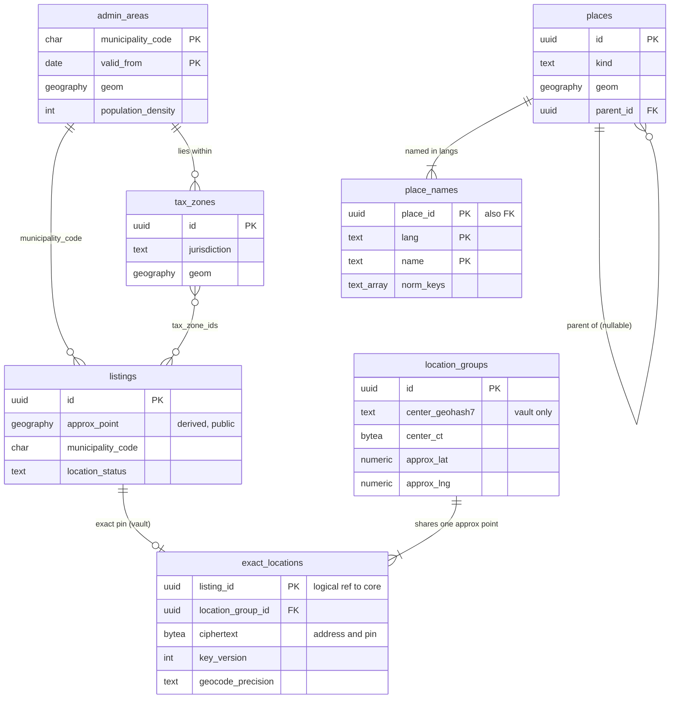

# Data model: 位置と地名

正確な住所と位置（vault）、位置の組、行政の区域、税の区域、地名の辞書。振る舞いは [location-and-geo.md](../location-and-geo.md)、方針は [ADR-0014](../../decisions/0014-approximate-location-offset.md)・[ADR-0015](../../decisions/0015-place-dictionary-and-name-normalization.md)・[ADR-0016](../../decisions/0016-geocoding-adapter-and-confirmed-pin.md)。規約は [data-model.md](../data-model.md) の 3 節。

- `exact_locations`・`location_groups` は vault にあり、`listings` のサービスの位置の役割だけが読み書きする。core に正確な位置を写さない。
- core の `listings` には、正確な位置から求めた値（`approx_point`、`municipality_code`、`rule_zone_ids`、`tax_zone_ids`、`density_class`、`time_zone`、`location_status`）だけを書く（[listings-content-and-photos.md](listings-content-and-photos.md) の 3.1 節）。
- 正確な位置を読む関数は `readExactLocation(viewer, listing_id, purpose)` の 1 つ。中で `exactLocationVisible()` を呼び、`vault_access_log` を同じトランザクションで書く（[security-audit-and-lifecycle.md](security-audit-and-lifecycle.md)）。
- `admin_areas`・`tax_zones`・`places`・`place_names` は core の公開の設定の表（PostGIS）。地名の索引 `places_v<n>` は OpenSearch の写し（[stores.md](stores.md) の 4 節）。`tax_zones` の持ち主は [taxes.md](../taxes.md)。

## 1. ER 図

- `listings ||--o| exact_locations`：住所を入れる前は 0。vault の行で、core への外部キーは張らない。
- `location_groups ||--|{ exact_locations`：正確な位置が 40 m 以内の物件は、ホストのアカウントをまたいで同じ組に入り、同じ `approx_point` を共有する（[location-and-geo.md](../location-and-geo.md) の 5.2 節）。

## 2. 制約の実装

| 制約 | 実装 |
| --- | --- |
| 正確な位置は vault だけ | core の表に住所・正確な緯度経度の列がないこと（スキーマの検査）。`ST_Contains` で区域を引くときは点を引数だけで渡し、`log_parameter_max_length = 0` で DB のログに引数を出さない |
| ずらした位置は作り直さない | `location_groups.approx_lat`・`approx_lng` の `UPDATE` を拒むトリガー（鍵の交換の手順の役割を除く） |
| 組の移動は 365 日に 3 回 | `listings.location_group_moves` の CHECK（[listings-content-and-photos.md](listings-content-and-photos.md)） |
| 正確な位置の読み出しは監査つき | `exact_locations` の `SELECT` の権限を `listings` の位置の役割だけに与え、読み出しの関数が `vault_access_log` を同じトランザクションで書く |

## 3. 表

### 3.1 `exact_locations`（vault）

正確な住所とピン。定義元：[location-and-geo.md](../location-and-geo.md) の 4 節。

| 列 | 型 | NULL | 既定 | 説明 |
| --- | --- | --- | --- | --- |
| `listing_id` | `uuid` | NOT NULL | — | core の `listings`（論理の参照） |
| `location_group_id` | `uuid` | NOT NULL | — | |
| `ciphertext` | `bytea` | NOT NULL | — | 構造の住所（`postal_code`・`prefecture`・`municipality`・`town`・`block`・`building`・`unit`）とピンの緯度経度の JSON の暗号文 |
| `nonce` | `bytea` | NOT NULL | — | 96 ビット |
| `key_version` | `integer` | NOT NULL | — | 主体の鍵（`purpose = location`、主体 = リスティング） |
| `aad_version` | `smallint` | NOT NULL | `1` | |
| `address_hmac` | `bytea` | NOT NULL | — | 正規化した住所（番地まで）の HMAC。同じ住所の物件の判定と、届出の住所との照合 |
| `geocode_precision` | `text` | NOT NULL | — | `rooftop`・`block`・`town`・`municipality` |
| `pin_offset_m` | `integer` | NOT NULL | — | ピンと提供者の候補の距離（300 m 超で `needs_review`） |
| `confirmed_at` | `timestamptz` | NULL | — | |
| `confirmed_by` | `uuid` | NULL | — | ホストの成員 |
| `updated_at` | `timestamptz` | NOT NULL | `now()` | |

- キー：PK `(listing_id)`。FK `location_group_id → location_groups`。索引：`(address_hmac)`、`(location_group_id)`。
- RLS：ホストのアカウント（成員。`messages_only` を除く）と、`exactLocationVisible()` を通した予約の 2 者（`confirmed`・`in_stay`・チェックアウトの後 7 日）。どれも `readExactLocation` の関数を通す。区分：V。
- 保持：リスティングの削除から 1 年。消し方は主体の鍵の破棄（[ADR-0075](../../decisions/0075-data-classes-and-retention.md)）。
- S1 の量：15 万行。

### 3.2 `location_groups`（vault）

ずらした位置を共有する位置の組。定義元：同 5.2 節。

| 列 | 型 | NULL | 既定 | 説明 |
| --- | --- | --- | --- | --- |
| `id` | `uuid` | NOT NULL | `uuidv7()` | HMAC の入力（`approx:v1:<id>:<try>`） |
| `center_geohash7` | `text` | NOT NULL | — | 組の中心の geohash（7 桁、約 150 m）。40 m 以内の候補の引き。vault の中だけ |
| `center_ct` | `bytea` | NOT NULL | — | 組の中心の緯度経度の暗号文（主体 = 組。`purpose = location`） |
| `nonce` | `bytea` | NOT NULL | — | |
| `key_version` | `integer` | NOT NULL | — | |
| `density_class` | `text` | NOT NULL | — | 作った時の区分 |
| `approx_lat`・`approx_lng` | `numeric(8,5)` | NOT NULL | — | ずらした点（小数 5 桁） |
| `approx_try` | `smallint` | NOT NULL | `0` | 陸に置くための試行の数（16 まで） |
| `hmac_key_version` | `integer` | NOT NULL | — | `approx-location-hmac` の鍵のバージョン |
| `member_count` | `integer` | NOT NULL | `0` | 組のリスティングの数 |
| `created_at` | `timestamptz` | NOT NULL | `now()` | |

- キー：PK `(id)`。索引：`(center_geohash7)` — 新しいピンの周りの 9 つの升を引き、復号した中心との距離で 40 m を判定する。
- CHECK：`density_class IN (...)`、`approx_try BETWEEN 0 AND 16`。
- RLS：サービス（`listings` の位置の役割だけ）。区分：V（`approx_*` は U の値だが、組との対応を隠すため vault に置く）。
- 保持：`member_count = 0` から 1 年。S1 の量：12 万行。

### 3.3 `admin_areas`

行政の区域（市区町村）の多角形と人口密度。定義元：同 4.4 節。

| 列 | 型 | NULL | 既定 | 説明 |
| --- | --- | --- | --- | --- |
| `municipality_code` | `char(6)` | NOT NULL | — | 全国地方公共団体コード（検査の数字つき） |
| `valid_from` | `date` | NOT NULL | — | 合併・改正の日 |
| `valid_to` | `date` | NULL | — | |
| `prefecture_code` | `char(2)` | NOT NULL | — | 01〜47 |
| `name` | `text` | NOT NULL | — | |
| `geom` | `geography(MultiPolygon,4326)` | NOT NULL | — | |
| `population_density` | `integer` | NOT NULL | — | 人/km²（`density_class` の判定） |
| `source_version` | `text` | NOT NULL | — | 出どころのデータのバージョン |

- キー：PK `(municipality_code, valid_from)`。索引：`GIST (geom)`。
- RLS：公開の設定（読み出しは全員、書き込みは `config-loader`）。区分：U。保持：消さない。S1 の量：約 1,900 行。

### 3.4 `tax_zones`

自治体の一部だけに課す税の区域。持ち主は [taxes.md](../taxes.md) の 4.1 節。

| 列 | 型 | NULL | 既定 | 説明 |
| --- | --- | --- | --- | --- |
| `id` | `uuid` | NOT NULL | `uuidv7()` | `tax_rules.jurisdiction` の `zone:<id>` |
| `municipality_code` | `char(6)` | NOT NULL | — | 区域を含む自治体 |
| `jurisdiction` | `text` | NOT NULL | — | 課す主体（自治体のコード） |
| `name` | `text` | NOT NULL | — | |
| `geom` | `geography(MultiPolygon,4326)` | NOT NULL | — | |
| `valid_from` | `date` | NOT NULL | — | |
| `valid_to` | `date` | NULL | — | |
| `source_url` | `text` | NOT NULL | — | |

- キー：PK `(id)`。索引：`GIST (geom)`、`(municipality_code)`。
- RLS：公開の設定。区分：U。保持：消さない。S1 の量：100 行未満。

### 3.5 `places`

地名の辞書の正本。定義元：同 6.1 節。

| 列 | 型 | NULL | 既定 | 説明 |
| --- | --- | --- | --- | --- |
| `id` | `uuid` | NOT NULL | `uuidv7()` | |
| `kind` | `text` | NOT NULL | — | `prefecture`・`municipality`・`ward_area`・`station`・`poi` |
| `geom` | `geography` | NOT NULL | — | 多角形か点（単純化しない正本） |
| `radius_m` | `integer` | NULL | — | 点の地名の半径（駅 2 km、空港 5 km など） |
| `parent_id` | `uuid` | NULL | — | 親の地名（同じ名前の地名の区別） |
| `municipality_code` | `char(6)` | NULL | — | |
| `listing_count` | `integer` | NOT NULL | `0` | 範囲の中の `listed` の数（日次） |
| `source`・`source_version` | `text` | NOT NULL | — | 出どころ（ライセンスは `place-dictionary-poc`） |
| `updated_at` | `timestamptz` | NOT NULL | `now()` | |

- キー：PK `(id)`。FK `parent_id → places`。索引：`GIST (geom)`、`(kind, municipality_code)`。
- CHECK：`kind IN (...)`、`(kind IN ('station','poi')) = (radius_m IS NOT NULL)`。
- RLS：公開の設定。区分：U。保持：消さない（廃止は `valid_to` を足さず `listing_count` を 0 にし、索引から外す）。S1 の量：10 万行。

### 3.6 `place_names`

言語ごとの名前と読みと正規の鍵。定義元：同 6.1・6.2 節。

| 列 | 型 | NULL | 既定 | 説明 |
| --- | --- | --- | --- | --- |
| `place_id` | `uuid` | NOT NULL | — | |
| `lang` | `text` | NOT NULL | — | `ja`・`ja-Hira`・`en`・`zh-Hans`・`zh-Hant`・`ko` |
| `name` | `text` | NOT NULL | — | |
| `reading` | `text` | NULL | — | かなの読み |
| `norm_keys` | `text[]` | NOT NULL | `'{}'` | `normPlaceKey` の鍵（接尾の語の有無の 2 つ） |
| `is_primary` | `boolean` | NOT NULL | `false` | 表示に使う名前 |

- キー：PK `(place_id, lang, name)`。FK `place_id → places`。索引：`GIN (norm_keys)` — 運用の確かめ（入力の補完は OpenSearch）。
- RLS：公開の設定。区分：U。S1 の量：50 万行。
