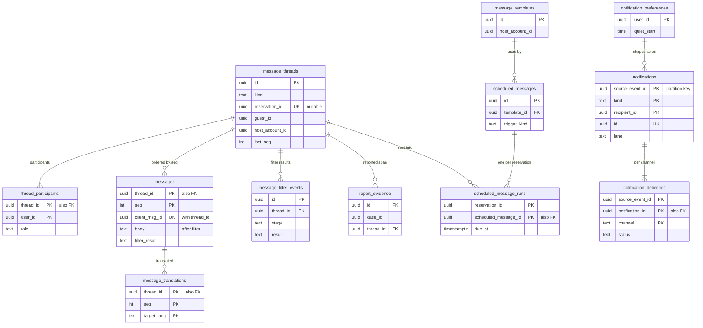

# Data model: メッセージと通知

スレッド、参加者、メッセージ、連絡先の絞り込みの記録、訳文、雛形、予約の時刻に送る文、通報の証拠、通知と配信と設定。振る舞いは [messaging.md](../messaging.md)、方針は [ADR-0052](../../decisions/0052-message-threads-and-stages.md)〜[ADR-0054](../../decisions/0054-notification-kinds-lanes-and-quiet-hours.md)。プッシュ・メールの中身の規則は [stores.md](stores.md) の 7 節。規約は [data-model.md](../data-model.md) の 3 節。

- どの表も content にあり、`messaging`（メッセージ）と `notifier`（通知）が書く。core の予約・リスティング・利用者へは論理の参照（外部キーなし）。
- 送る時の段（`pre_booking`・`booked`・`post_stay`）はスレッドに書かず、送るたびに予約の状態から求める。
- 保存するのは絞り込みの後の文だけ。伏せる前の文と、一致した文字を残さない。
- 通報のあったスレッドと案件の外で、運用者は本文を読まない（JIT の権限。範囲は法務の確認待ち：L9）。

## 1. ER 図

- `message_threads ||--|{ thread_participants`：作成と同じトランザクションで参加者を入れる。
- `notifications ||--|{ notification_deliveries`：経路（プッシュ、メール、SMS、アプリの中のお知らせ）ごとに 1 行。`critical` の 15 分の未読の SMS は同じ通知に行を足す。
- `notification_preferences ||--o{ notifications`：外部キーではなく、受け手の設定が経路と静かな時間を決める関係。

## 2. 表

### 2.1 `message_threads`

スレッド（問い合わせ、予約、運用の連絡）。定義元：[messaging.md](../messaging.md) の 4.1 節。

| 列 | 型 | NULL | 既定 | 説明 |
| --- | --- | --- | --- | --- |
| `id` | `uuid` | NOT NULL | `uuidv7()` | 分割の鍵（`messages`） |
| `kind` | `text` | NOT NULL | — | `inquiry`・`reservation`・`support` |
| `guest_id` | `uuid` | NULL | — | |
| `listing_id` | `uuid` | NULL | — | |
| `host_account_id` | `uuid` | NULL | — | |
| `reservation_id` | `uuid` | NULL | — | `reservation` のスレッド（30 日以内の問い合わせを結び付けたものを含む） |
| `case_id` | `uuid` | NULL | — | `support` のスレッドの案件 |
| `last_seq` | `integer` | NOT NULL | `0` | 送信と同じトランザクションで 1 上げる |
| `last_message_at` | `timestamptz` | NULL | — | |
| `retain_until` | `timestamptz` | NULL | — | 保持の期限（予約のチェックアウトか最後のメッセージから 3 年。D-21） |
| `created_at` | `timestamptz` | NOT NULL | `now()` | |

- キー：PK `(id)`。部分 UK `(reservation_id) WHERE reservation_id IS NOT NULL`。部分 UK `(guest_id, listing_id) WHERE kind = 'inquiry'`。
- 索引：`(host_account_id, last_message_at)`・`(guest_id, last_message_at)` — 一覧。
- CHECK：`kind IN (...)`、`kind <> 'reservation' OR reservation_id IS NOT NULL`、`kind <> 'support' OR case_id IS NOT NULL`、`kind = 'support' OR (guest_id IS NOT NULL AND host_account_id IS NOT NULL)`。
- RLS：予約の 2 者（ゲスト本人か、ホストのアカウントの `owner`・`full`・`messages_only` の成員）と参加者。運用者は案件の参加で。区分：P。
- 保持：`retain_until` まで。S1 の量：1 日 1 万行。

### 2.2 `thread_participants`

参加者（確定の後の共同の宿泊者、運用の担当を含む）。定義元：同 4.1 節。

| 列 | 型 | NULL | 既定 | 説明 |
| --- | --- | --- | --- | --- |
| `thread_id` | `uuid` | NOT NULL | — | |
| `user_id` | `uuid` | NOT NULL | — | 運用者は運用者の ID |
| `role` | `text` | NOT NULL | — | `guest`・`co_guest`・`host_member`・`operator` |
| `joined_at` | `timestamptz` | NOT NULL | `now()` | 運用者の参加は全員に表示する |
| `left_at` | `timestamptz` | NULL | — | |
| `last_read_seq` | `integer` | NOT NULL | `0` | 未読 |

- キー：PK `(thread_id, user_id)`。索引：`(user_id)`。
- CHECK：`role IN (...)`。RLS：本人の行と、同じスレッドの参加者の読み出し。区分：P。保持：スレッドと同じ。

### 2.3 `messages`

メッセージ（絞り込みの後）。定義元：同 4.3 節。

| 列 | 型 | NULL | 既定 | 説明 |
| --- | --- | --- | --- | --- |
| `thread_id` | `uuid` | NOT NULL | — | 分割の鍵 |
| `seq` | `integer` | NOT NULL | — | |
| `sender_id` | `uuid` | NULL | — | `system` は NULL |
| `sender_role` | `text` | NOT NULL | — | `guest`・`co_guest`・`host_member`・`pms_app`・`operator`・`system` |
| `kind` | `text` | NOT NULL | — | `text`・`image`・`system`・`template` |
| `body` | `text` | NULL | — | 絞り込みの後の文（5,000 文字） |
| `body_lang` | `text` | NULL | — | |
| `attachment_ids` | `uuid[]` | NOT NULL | `'{}'` | S3 の `message-attachments/a/<id>/<width>.<ext>`（5 枚まで） |
| `template_id` | `uuid` | NULL | — | |
| `client_msg_id` | `uuid` | NOT NULL | — | 端末の再送の冪等 |
| `filter_result` | `text` | NOT NULL | — | `allow`・`mask`・`warn_sent` |
| `filter_version` | `text` | NOT NULL | — | |
| `created_at` | `timestamptz` | NOT NULL | `now()` | |

- キー：PK `(thread_id, seq)`。UK `(thread_id, client_msg_id)`。FK `thread_id → message_threads`。
- 分割：`thread_id` の範囲（UUIDv7 の月の境。D-21）。区切りの全部のスレッドの `retain_until` を過ぎたら `DROP`。
- CHECK：`kind IN (...)`、`char_length(body) <= 5000`、`cardinality(attachment_ids) <= 5`、`kind <> 'text' OR body IS NOT NULL`。
- RLS：`message_threads` と同じ。区分：P（本文をログに出さない）。
- S1 の量：1 日 43 万行（5 件/秒）、3 年で 4.7 億行。1 行 300 バイトで 140 GB（content の最大の表）。

### 2.4 `message_filter_events`

連絡先の絞り込みの記録（一致した文字を持たない）。定義元：同 5.1 節。

| 列 | 型 | NULL | 既定 | 説明 |
| --- | --- | --- | --- | --- |
| `id` | `uuid` | NOT NULL | `uuidv7()` | 分割の鍵 |
| `thread_id` | `uuid` | NOT NULL | — | |
| `sender_id` | `uuid` | NULL | — | |
| `stage` | `text` | NOT NULL | — | `pre_booking`・`booked`・`post_stay` |
| `kinds` | `text[]` | NOT NULL | — | 検出の種類のコード（`phone`・`email`・`url`・`external_id`・`offplatform_payment`・`address`） |
| `filter_version` | `text` | NOT NULL | — | |
| `result` | `text` | NOT NULL | — | `allow`・`mask`・`block`・`warn` |
| `created_at` | `timestamptz` | NOT NULL | `now()` | |

- キー：PK `(id)`。索引：`(thread_id)`、`(sender_id, created_at)` — T&S の信号の数え。
- 分割：`id` の月。90 日で `DROP`。
- RLS：サービス（`messaging`、`trust-safety`）。区分：M。S1 の量：1 日 5 万行（検出のあった送信）。

### 2.5 `message_translations`

メッセージの訳文（30 日）。訳すかは `legal.message_translation_enabled`（L9）。定義元：同 6 節。

| 列 | 型 | NULL | 既定 | 説明 |
| --- | --- | --- | --- | --- |
| `thread_id` | `uuid` | NOT NULL | — | |
| `seq` | `integer` | NOT NULL | — | |
| `target_lang` | `text` | NOT NULL | — | |
| `body` | `text` | NOT NULL | — | 絞り込みを通した訳文 |
| `provider`・`provider_model` | `text` | NOT NULL | — | |
| `created_at` | `timestamptz` | NOT NULL | `now()` | |

- キー：PK `(thread_id, seq, target_lang)`。分割：`created_at` の日。30 日で `DROP`。
- RLS：`message_threads` と同じ。区分：P。

### 2.6 `message_templates`

ホストの雛形（100 件まで）。定義元：同 7 節。

| 列 | 型 | NULL | 既定 | 説明 |
| --- | --- | --- | --- | --- |
| `id` | `uuid` | NOT NULL | `uuidv7()` | |
| `host_account_id` | `uuid` | NOT NULL | — | |
| `name` | `text` | NOT NULL | — | |
| `bodies` | `jsonb` | NOT NULL | — | 言語ごとの本文（変数は決まった一覧だけ。住所の変数を持たない） |
| `created_by` | `uuid` | NOT NULL | — | |
| `updated_at` | `timestamptz` | NOT NULL | `now()` | |

- キー：PK `(id)`。索引：`(host_account_id)`。RLS：ホストのアカウント（`owner`・`full`・`messages_only`）。区分：O。保持：消すまで。

### 2.7 `scheduled_messages`

予約の時刻に送る文の設定。定義元：同 7 節。

| 列 | 型 | NULL | 既定 | 説明 |
| --- | --- | --- | --- | --- |
| `id` | `uuid` | NOT NULL | `uuidv7()` | |
| `host_account_id` | `uuid` | NOT NULL | — | |
| `template_id` | `uuid` | NOT NULL | — | |
| `trigger_kind` | `text` | NOT NULL | — | `on_confirmed`・`before_check_in`・`checkout_morning`・`after_check_out` |
| `offset_hours` | `smallint` | NOT NULL | `0` | |
| `listing_ids` | `uuid[]` | NULL | — | 対象（NULL は全部） |
| `active` | `boolean` | NOT NULL | `true` | |
| `created_at` | `timestamptz` | NOT NULL | `now()` | |

- キー：PK `(id)`。FK `template_id → message_templates`。CHECK：`trigger_kind IN (...)`、`offset_hours BETWEEN 0 AND 336`。RLS：`message_templates` と同じ。区分：O。

### 2.8 `scheduled_message_runs`

予約ごとの送る予定と結果。`deadline-runner` が拾う。定義元：同 7 節。

| 列 | 型 | NULL | 既定 | 説明 |
| --- | --- | --- | --- | --- |
| `reservation_id` | `uuid` | NOT NULL | — | |
| `scheduled_message_id` | `uuid` | NOT NULL | — | |
| `thread_id` | `uuid` | NOT NULL | — | |
| `due_at` | `timestamptz` | NOT NULL | — | 物件のタイムゾーンで UTC に直した瞬間 |
| `tzdata_version` | `text` | NOT NULL | — | |
| `sent_at` | `timestamptz` | NULL | — | |
| `message_seq` | `integer` | NULL | — | 送ったメッセージ |
| `skipped_reason` | `text` | NULL | — | `reservation_cancelled`・`template_removed` |

- キー：PK `(reservation_id, scheduled_message_id)`。索引：`(due_at) WHERE sent_at IS NULL AND skipped_reason IS NULL`。
- RLS：予約の 2 者のホスト側。区分：P。保持：送って 90 日。

### 2.9 `report_evidence`

通報の証拠（対象のメッセージと前後 10 件の写し）。範囲は法務の L9 の結論で直す。定義元：同 8 節、[trust-and-safety.md](../trust-and-safety.md) の 5.4 節。

| 列 | 型 | NULL | 既定 | 説明 |
| --- | --- | --- | --- | --- |
| `id` | `uuid` | NOT NULL | `uuidv7()` | |
| `case_id` | `uuid` | NOT NULL | — | `ts_cases` |
| `thread_id` | `uuid` | NOT NULL | — | |
| `from_seq`・`to_seq` | `integer` | NOT NULL | — | |
| `snapshot` | `jsonb` | NOT NULL | — | 写したメッセージ（`seq`、送り手の役割、本文、時刻） |
| `reported_by` | `uuid` | NOT NULL | — | |
| `report_kind` | `text` | NOT NULL | — | `fraud_offplatform`・`harassment`・`discrimination`・`safety`・`other` |
| `created_at` | `timestamptz` | NOT NULL | `now()` | |

- キー：PK `(id)`。索引：`(case_id)`。
- RLS：T&S の担当の役割だけ（JIT の権限、読み出しは監査）。区分：P。保持：案件を閉じてから 3 年（`legal_holds` があれば残す）。

### 2.10 `notifications`

通知（受け手ごと）。アプリの中のお知らせの一覧にもなる。定義元：同 9 節、[ADR-0054](../../decisions/0054-notification-kinds-lanes-and-quiet-hours.md)。

| 列 | 型 | NULL | 既定 | 説明 |
| --- | --- | --- | --- | --- |
| `source_event_id` | `uuid` | NOT NULL | — | 元の outbox の事象の ID（UUIDv7。分割の鍵） |
| `kind` | `text` | NOT NULL | — | `booking.request_received` など（バージョンの付いた一覧） |
| `recipient_id` | `uuid` | NOT NULL | — | |
| `id` | `uuid` | NOT NULL | `uuidv7()` | |
| `lane` | `text` | NOT NULL | — | `critical`・`transactional`・`engagement` |
| `subject_type`・`subject_id` | `text`・`uuid` | NOT NULL | — | 予約、スレッド、レビューの組など |
| `subject_seq` | `bigint` | NULL | — | 対象のバージョンの番号（領域の文書の重複の鍵の一部） |
| `template_version` | `text` | NOT NULL | — | 言語ごとの雛形のバージョン |
| `locale` | `text` | NOT NULL | — | |
| `args` | `jsonb` | NOT NULL | `'{}'` | 許可の一覧の欄だけ（住所・鍵の番号・旅券・カード・口座を入れない） |
| `deliver_after` | `timestamptz` | NULL | — | 静かな時間で止めた分の送る時刻 |
| `read_at` | `timestamptz` | NULL | — | |
| `created_at` | `timestamptz` | NOT NULL | `now()` | |

- キー：PK `(source_event_id, kind, recipient_id)`（重複の鍵。領域の文書の `dedupe_key` を、分割の鍵を含む主キーにした。D-35）。UK `(id, source_event_id)`。
- 分割：`source_event_id` の範囲（日）。90 日で `DROP`。
- 索引：`(recipient_id, created_at)` — お知らせの一覧。`(deliver_after) WHERE deliver_after IS NOT NULL`。
- CHECK：`lane IN (...)`。
- RLS：本人（受け手）。サービス：`notifier`。区分：O。
- S1 の量：1 日 40 万行、90 日で 3,600 万行。

### 2.11 `notification_deliveries`

経路ごとの配信の結果。定義元：同 9.2 節。

| 列 | 型 | NULL | 既定 | 説明 |
| --- | --- | --- | --- | --- |
| `source_event_id` | `uuid` | NOT NULL | — | 分割の鍵 |
| `notification_id` | `uuid` | NOT NULL | — | |
| `channel` | `text` | NOT NULL | — | `push`・`email`・`sms`・`in_app` |
| `status` | `text` | NOT NULL | `'queued'` | `queued`・`sent`・`failed`・`suppressed` |
| `provider_ref` | `text` | NULL | — | |
| `attempt` | `smallint` | NOT NULL | `1` | |
| `failure_code` | `text` | NULL | — | |
| `sent_at` | `timestamptz` | NULL | — | |
| `opened_at` | `timestamptz` | NULL | — | アプリの既読（メールの開封の追跡はしない） |

- キー：PK `(source_event_id, notification_id, channel)`。索引：`(status, sent_at) WHERE channel = 'push'` — 15 分の未読の SMS の判定。
- 分割：`source_event_id` の日。90 日で `DROP`。
- CHECK：`channel IN (...)`、`status IN (...)`。SMS の 1 人 1 日 10 通は `notifier` が Valkey で数える。
- RLS：サービス（`notifier`）。区分：O。S1 の量：1 日 60 万行。

### 2.12 `notification_preferences`

受け手の通知の設定（1 人 1 行）。定義元：同 9.4 節。

| 列 | 型 | NULL | 既定 | 説明 |
| --- | --- | --- | --- | --- |
| `user_id` | `uuid` | NOT NULL | — | |
| `channel_prefs` | `jsonb` | NOT NULL | `'{}'` | 種類の群 × 経路の受け取り（`critical` は切れない） |
| `quiet_start`・`quiet_end` | `time` | NOT NULL | `'22:00'`・`'08:00'` | 受け手のタイムゾーン |
| `quiet_for_transactional` | `boolean` | NOT NULL | `false` | |
| `message_preview` | `boolean` | NOT NULL | `true` | |
| `locale` | `text` | NULL | — | 通知の言語（NULL は `users.locale`） |
| `updated_at` | `timestamptz` | NOT NULL | `now()` | |

- キー：PK `(user_id)`。RLS：本人。区分：O。保持：退会で消す。S1 の量：300 万行。
