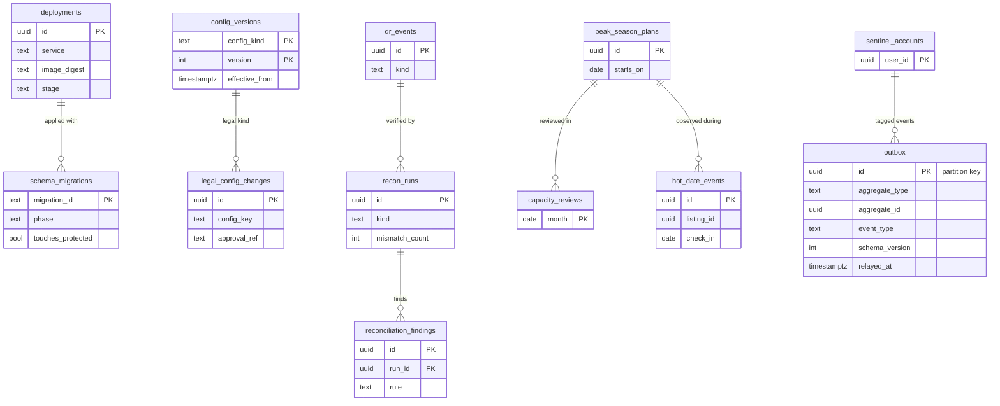

# Data model: 運用

outbox、スキーマの移行、デプロイ、アプリのバージョン、`legal.*` の変更の記録、設定の表のバージョン、DR の記録、キャパシティのレビュー、繁忙期の計画、熱い日付の記録、照合の実行と外れ、egress の拒否の集計、見張りの利用者。振る舞いは [delivery.md](../delivery.md)・[infrastructure.md](../infrastructure.md)・[capacity.md](../capacity.md)・[observability.md](../observability.md)、方針は [ADR-0077](../../decisions/0077-data-stores-layout-and-osaka-dr.md)・[ADR-0079](../../decisions/0079-sli-measurement-and-correctness-monitors.md)・[ADR-0081](../../decisions/0081-sizing-tiers-and-holiday-prescaling.md)・[ADR-0082](../../decisions/0082-pipeline-schema-ordering-and-config-governance.md)・[ADR-0083](../../decisions/0083-app-releases-pms-api-versions-and-model-releases.md)。規約は [data-model.md](../data-model.md) の 3 節。

- `outbox`・`schema_migrations` は 4 つのクラスタに同じ形で置く。`recon_runs`・`reconciliation_findings` は core と ledger に同じ形で置く（D-18）。他は core。
- どの表も個人のデータを持たない（ID、数、理由のコード、時刻だけ）。
- 照合の外れの直しは、持ち主の関数（遷移、仕訳の型）でだけ行う。行を手で書き換えない。

## 1. ER 図

- `sentinel_accounts ||--o{ outbox`：外部キーではない。見張りの利用者の事象は封筒の `sentinel` の印で SLI と収益の集計から外す。

## 2. outbox の形

各クラスタの `outbox` は同じ形。`relay` が読み、クラスタごとの SNS の話題へ流す（[stores.md](stores.md) の 5 節）。お金の事象と予約の事象は SQS の FIFO（グループは予約の ID）で `ledger` に届く。

## 3. 表

### 3.1 `outbox`（各クラスタ）

| 列 | 型 | NULL | 既定 | 説明 |
| --- | --- | --- | --- | --- |
| `id` | `uuid` | NOT NULL | `uuidv7()` | 事象の ID（消費者の冪等キー、通知の `source_event_id`）。分割の鍵 |
| `aggregate_type` | `text` | NOT NULL | — | `reservation`・`listing`・`stay_claims`・`payment_attempt`・`journal` など |
| `aggregate_id` | `uuid` | NOT NULL | — | |
| `aggregate_version` | `bigint` | NULL | — | 予約の `version`、リスティングの `calendar_version` など |
| `event_type` | `text` | NOT NULL | — | `reservation.confirmed` など |
| `schema_version` | `integer` | NOT NULL | — | JSON Schema のバージョン（`events/`） |
| `payload` | `jsonb` | NOT NULL | — | ID・状態・数・金額だけ（V・C の欄と P の本文を持たない） |
| `group_key` | `text` | NULL | — | FIFO のグループ（予約の ID、リスティングの ID） |
| `sentinel` | `boolean` | NOT NULL | `false` | |
| `trace_parent` | `text` | NULL | — | W3C のトレースの文脈 |
| `created_at` | `timestamptz` | NOT NULL | `now()` | |
| `relayed_at` | `timestamptz` | NULL | — | |

- キー：PK `(id)`。索引：`(id) WHERE relayed_at IS NULL` — `relay` の拾い（最古の年齢が SLI）。
- 分割：`id` の日。送って 3 日で `DROP`。データレイクへは `relay` が写しを流す（V・C・P を落とし、ID を HMAC に）。
- RLS：サービス（書くサービス、`relay`）。区分：M。S1 の量：core 1 日 200 万行（`stay_claims` の変化と PMS が多い）。

### 3.2 `schema_migrations`（各クラスタ）

| 列 | 型 | NULL | 既定 | 説明 |
| --- | --- | --- | --- | --- |
| `migration_id` | `text` | NOT NULL | — | |
| `phase` | `text` | NOT NULL | — | `expand`・`migrate`・`contract` |
| `touches_protected` | `boolean` | NOT NULL | — | 守る物（`migrations/protected.yaml`）に触れる |
| `approved_by` | `text[]` | NOT NULL | — | テックリード（台帳は財務も） |
| `deployment_id` | `uuid` | NULL | — | |
| `applied_at` | `timestamptz` | NOT NULL | `now()` | |

- キー：PK `(migration_id)`。CHECK：`phase IN (...)`。RLS：マイグレーションの役割。区分：M。保持：消さない。

### 3.3 `deployments`

| 列 | 型 | NULL | 既定 | 説明 |
| --- | --- | --- | --- | --- |
| `id` | `uuid` | NOT NULL | `uuidv7()` | |
| `service` | `text` | NOT NULL | — | |
| `image_digest` | `text` | NOT NULL | — | |
| `stage` | `text` | NOT NULL | — | `verify`・`sentinel`・`p5`・`p25`・`p100` |
| `result` | `text` | NULL | — | `succeeded`・`rolled_back`・`stopped` |
| `rollback_reason` | `text` | NULL | — | 自動のロールバックの条件の名前 |
| `started_at` | `timestamptz` | NOT NULL | `now()` | |
| `finished_at` | `timestamptz` | NULL | — | |

- キー：PK `(id)`。索引：`(service, started_at)`。RLS：サービス（CD）。区分：M。保持：2 年。

### 3.4 `app_versions`

| 列 | 型 | NULL | 既定 | 説明 |
| --- | --- | --- | --- | --- |
| `platform` | `text` | NOT NULL | — | `ios`・`android` |
| `version` | `text` | NOT NULL | — | |
| `build` | `text` | NOT NULL | — | |
| `train` | `text` | NOT NULL | — | 列車 |
| `released_on` | `date` | NULL | — | |
| `rollout_pct` | `smallint` | NOT NULL | `0` | 段階の割合 |
| `halted_at` | `timestamptz` | NULL | — | |
| `halt_reason` | `text` | NULL | — | |

- キー：PK `(platform, version)`。最小のバージョンは AppConfig の `ops.app_min_version_<platform>`。RLS：サービス。区分：M。

### 3.5 `legal_config_changes`

`legal.*` の変更の記録（法務と財務の 2 人の承認つきの PR から）。定義元：[delivery.md](../delivery.md) の 3.3 節。

| 列 | 型 | NULL | 既定 | 説明 |
| --- | --- | --- | --- | --- |
| `id` | `uuid` | NOT NULL | `uuidv7()` | |
| `config_key` | `text` | NOT NULL | — | `legal.minpaku_count_external_nights` など |
| `old_value`・`new_value` | `jsonb` | NULL・NOT NULL | — | |
| `effective_from` | `timestamptz` | NOT NULL | — | |
| `approval_ref` | `text` | NOT NULL | — | 承認の記録の ID（L の番号） |
| `legal_config_version` | `text` | NOT NULL | — | 予約・見積もり・仕訳・`regulated_nights` に残す値 |
| `applied_by` | `uuid` | NOT NULL | — | Ops |
| `applied_at` | `timestamptz` | NOT NULL | `now()` | |

- キー：PK `(id)`。UK `(legal_config_version, config_key)`。RLS：サービス（Ops、監査）。区分：A。保持：消さない。

### 3.6 `config_versions`

バージョンの付いた設定の表の入れた記録。中身は持ち主の表（`service_fee_schedules`・`cancellation_policies`・`host_cancellation_fee_tables`・`tax_table_versions`・`tax_rules`・`municipal_rule_sets`・`fx_markup_versions`・`kyc_gate_versions`）。定義元：同 3.4 節。

| 列 | 型 | NULL | 既定 | 説明 |
| --- | --- | --- | --- | --- |
| `config_kind` | `text` | NOT NULL | — | `service_fee`・`cancellation_policy`・`host_cancellation_fee`・`tax_table`・`municipal_rules`・`fx_markup`・`kyc_gates` |
| `version` | `integer` | NOT NULL | — | |
| `effective_from` | `timestamptz` | NOT NULL | — | 入れる時刻から 24 時間より後 |
| `content_hash` | `bytea` | NOT NULL | — | `config/<kind>/<version>.json` のハッシュ |
| `approved_by` | `text[]` | NOT NULL | — | CODEOWNERS の承認者 |
| `impact_report_s3_key` | `text` | NULL | — | 自治体の規則の反する未来の予約の一覧など |
| `loaded_at` | `timestamptz` | NOT NULL | `now()` | |

- キー：PK `(config_kind, version)`。行を変えない。RLS：公開の設定（読み出し）。区分：M。保持：消さない。

### 3.7 `dr_events`

リージョンの切り替えの記録。定義元：[infrastructure.md](../infrastructure.md) の 7.3 節。

| 列 | 型 | NULL | 既定 | 説明 |
| --- | --- | --- | --- | --- |
| `id` | `uuid` | NOT NULL | `uuidv7()` | |
| `kind` | `text` | NOT NULL | — | `failover`・`switchover`・`failback`・`drill` |
| `started_at`・`finished_at` | `timestamptz` | NOT NULL・NULL | — | |
| `lost_ranges` | `jsonb` | NULL | — | クラスタごとの失った時刻の範囲 |
| `deadlines_paused_at`・`deadlines_resumed_at` | `timestamptz` | NULL | — | 期限の処理を止めた時刻と戻した時刻 |
| `reconciliation_summary` | `jsonb` | NULL | — | 照合の結果の数 |
| `incident_ref` | `text` | NULL | — | |

- キー：PK `(id)`。RLS：サービス（Ops）。区分：M。保持：消さない。

### 3.8 `capacity_reviews`

月次の 10 指標（[capacity.md](../capacity.md) の 8 節と [infrastructure.md](../infrastructure.md) の 8 節で共有）。

| 列 | 型 | NULL | 既定 | 説明 |
| --- | --- | --- | --- | --- |
| `month` | `date` | NOT NULL | — | 月の初日 |
| `metrics` | `jsonb` | NOT NULL | — | 10 指標の値 |
| `decisions` | `text` | NULL | — | 段階を上げる判断 |
| `reviewed_by` | `text[]` | NOT NULL | — | |

- キー：PK `(month)`。RLS：サービス（Ops）。区分：M。

### 3.9 `peak_season_plans`

繁忙期・催しごとの計画。定義元：[capacity.md](../capacity.md) の 5 節。

| 列 | 型 | NULL | 既定 | 説明 |
| --- | --- | --- | --- | --- |
| `id` | `uuid` | NOT NULL | `uuidv7()` | |
| `name` | `text` | NOT NULL | — | |
| `starts_on`・`ends_on` | `date` | NOT NULL | — | |
| `expected_load` | `jsonb` | NOT NULL | — | 想定の量 |
| `scale_actions` | `jsonb` | NOT NULL | — | 足す部品と予定の時刻 |
| `results` | `jsonb` | NULL | — | 拡大の結果 |
| `created_by` | `text` | NOT NULL | — | PM・Ops |

- キー：PK `(id)`。RLS：サービス（Ops）。区分：M。

### 3.10 `hot_date_events`

熱い日付の記録（運用の画面だけで見る）。定義元：同 1.3 節。

| 列 | 型 | NULL | 既定 | 説明 |
| --- | --- | --- | --- | --- |
| `id` | `uuid` | NOT NULL | `uuidv7()` | |
| `listing_id` | `uuid` | NOT NULL | — | |
| `check_in` | `date` | NOT NULL | — | |
| `attempts` | `integer` | NOT NULL | — | 取り合いの数（先着の印の失敗を含む） |
| `window_start`・`window_end` | `timestamptz` | NOT NULL | — | |

- キー：PK `(id)`。索引：`(window_start)`。RLS：サービス（Ops）。区分：M。保持：1 年。

### 3.11 `recon_runs`（core と ledger）

照合のジョブの実行（最後の成功の SLI の元）。定義元：[observability.md](../observability.md) の 3 節。

| 列 | 型 | NULL | 既定 | 説明 |
| --- | --- | --- | --- | --- |
| `id` | `uuid` | NOT NULL | `uuidv7()` | |
| `kind` | `text` | NOT NULL | — | core：`stay_claims`（R1〜R6）・`reservation_claims`（B1〜B6）・`cancellation`（C1〜C5）・`regulatory`（G1〜G6）・`payments`（P1〜P5）。ledger：`booking_ledger`（R1〜R5）・`ledger_internal`（R6〜R8）・`three_way`（R9〜R11） |
| `started_at` | `timestamptz` | NOT NULL | `now()` | |
| `finished_at` | `timestamptz` | NULL | — | |
| `snapshot_lsn` | `text` | NULL | — | 比べたスナップショット |
| `mismatch_count` | `integer` | NOT NULL | `0` | |
| `result` | `text` | NULL | — | `ok`・`mismatch`・`failed` |

- キー：PK `(id)`。索引：`(kind, started_at)`。RLS：サービス（`reconcilers`）。区分：M。保持：400 日。

### 3.12 `reconciliation_findings`（core と ledger）

照合の外れ（ID と数と理由のコードだけ）。ledger の行は型 31 の `recon_break` の元。

| 列 | 型 | NULL | 既定 | 説明 |
| --- | --- | --- | --- | --- |
| `id` | `uuid` | NOT NULL | `uuidv7()` | |
| `run_id` | `uuid` | NOT NULL | — | |
| `rule` | `text` | NOT NULL | — | `R1`・`B4`・`G1`・`R9` など |
| `subject_type`・`subject_id` | `text`・`uuid` | NOT NULL | — | 予約、リスティング、届出住宅、仕訳、外部の明細の行 |
| `severity` | `text` | NOT NULL | — | `page`・`ticket` |
| `detail` | `jsonb` | NOT NULL | — | 数と理由のコード（個人のデータなし） |
| `found_at` | `timestamptz` | NOT NULL | `now()` | |
| `resolved_at` | `timestamptz` | NULL | — | |
| `resolution` | `text` | NULL | — | 直しに使った関数・仕訳の ID |

- キー：PK `(id)`。FK `run_id → recon_runs`。索引：`(rule, found_at)`、`(resolved_at) WHERE resolved_at IS NULL`。
- RLS：サービス（`reconcilers`、Ops、財務）。区分：M。保持：10 年（ledger）、2 年（core）。

### 3.13 `egress_denials`

信用しない宛先の拒否の日次の数（宛先そのものを持たない）。定義元：[infrastructure.md](../infrastructure.md) の 2.5 節。

| 列 | 型 | NULL | 既定 | 説明 |
| --- | --- | --- | --- | --- |
| `day` | `date` | NOT NULL | — | |
| `source_kind` | `text` | NOT NULL | — | `ical_feed`・`webhook_subscription` |
| `source_id` | `uuid` | NOT NULL | — | `ical_feeds.id` か `webhook_subscriptions.id` |
| `reason` | `text` | NOT NULL | — | `private_address`・`metadata_address`・`dns_rebind`・`scheme_downgrade` |
| `denial_count` | `integer` | NOT NULL | — | |

- キー：PK `(day, source_kind, source_id, reason)`。RLS：サービス（Ops、セキュリティ）。区分：M。保持：1 年。

### 3.14 `sentinel_accounts`

見張りの利用者（合成の監視）。定義元：[observability.md](../observability.md) の 4 節。

| 列 | 型 | NULL | 既定 | 説明 |
| --- | --- | --- | --- | --- |
| `user_id` | `uuid` | NOT NULL | — | |
| `purpose` | `text` | NOT NULL | — | `canary_guest`・`canary_host`・`canary_pms` |
| `created_at` | `timestamptz` | NOT NULL | `now()` | |

- キー：PK `(user_id)`。RLS：サービス（`canary`、`listings` の `listingVisible()` の行 3a）。区分：M。
