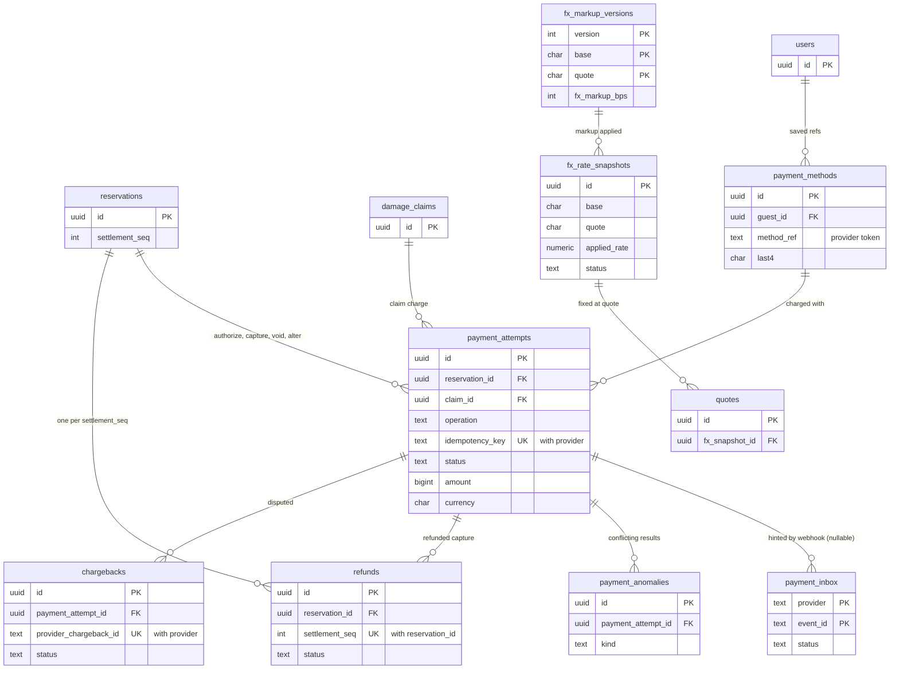

# Data model: 決済と為替

決済の試行、支払いの方法の参照、Webhook の inbox、返金、チャージバック、矛盾した結果の記録、為替の相場の写し、為替の上乗せの表。お金の正本は台帳（[ledger-and-payouts.md](ledger-and-payouts.md)）で、この表は提供者とのやり取りの記録である。振る舞いは [payments-and-fx.md](../payments-and-fx.md)、方針は [ADR-0005](../../decisions/0005-payments-hold-capture-and-ledger.md)・[ADR-0008](../../decisions/0008-multi-currency-and-fx.md)・[ADR-0042](../../decisions/0042-payment-adapter-contract-and-capture-timing.md)〜[ADR-0045](../../decisions/0045-chargeback-handling-and-liability.md)。提供者の能力の表は AppConfig（[stores.md](stores.md) の 9 節）。規約は [data-model.md](../data-model.md) の 3 節。

- どの表も core にあり、`payments` のサービスだけが書く（`fx_rate_snapshots` は `payments` の `fx-rate-importer`、`fx_markup_versions` は `config-loader`）。
- カード番号とセキュリティコードの列を作らない。提供者のトークン（`method_ref`）、ブランド、下 4 桁、有効期限の年月、提供者のカードの指紋だけを持つ。
- 試行の結果を決める関数は `settleAttempt(attempt_id, provider_state, source)` の 1 つ。状態は前にだけ進む。

## 1. ER 図

- `reservations ||--o{ payment_attempts`：即時予約は `capture` が 1 つ。リクエストは `authorize` と `capture`（断り・期限は `void`）。変更の増額は `<reservation_id>:alter:<seq>:capture`。
- `reservations ||--o{ refunds`：決着の番号ごとに返金は 1 つ（`(reservation_id, settlement_seq)` の部分一意）。取り消しの後の成功の戻し（`orphan`）は別の種類。

## 2. 制約の実装

| 制約 | 実装 |
| --- | --- |
| 提供者への依頼は 1 回 | `payment_attempts (provider, idempotency_key)` の一意。冪等キー `<reservation_id>:capture`・`:authorize`・`:void`・`:alter:<seq>:capture`・`<claim_id>:charge` |
| 結果は前にだけ進む | `succeeded`・`failed` の行の `status` の書き換えを拒むトリガー。矛盾は `payment_anomalies` |
| 結果の事象は 1 回 | `outcome_emitted_at` を条件つきの更新で書き、書けたときだけ outbox に `payment.succeeded`・`failed` |
| Webhook の重複を捨てる | `payment_inbox (provider, event_id)` の主キー |
| 返金は決着の番号ごとに 1 回 | `refunds (reservation_id, settlement_seq) WHERE kind = 'settlement'` の部分一意。冪等キー `<reservation_id>:refund:<seq>` |
| 見積もりの相場を変えない | `fx_rate_snapshots` の `mid_rate`・`markup_bps`・`applied_rate` の `UPDATE` を拒むトリガー（`status` だけ変えられる） |

## 3. 表

### 3.1 `payment_attempts`

提供者への依頼の試行。呼ぶ前に `pending` の行をコミットする。定義元：[payments-and-fx.md](../payments-and-fx.md) の 4.1・4.2・5 節。

| 列 | 型 | NULL | 既定 | 説明 |
| --- | --- | --- | --- | --- |
| `id` | `uuid` | NOT NULL | `uuidv7()` | |
| `reservation_id` | `uuid` | NULL | — | |
| `claim_id` | `uuid` | NULL | — | 損害の請求（[claims.md](claims.md)） |
| `guest_id` | `uuid` | NOT NULL | — | RLS のための写し（読み出しはゲストだけ） |
| `operation` | `text` | NOT NULL | — | `authorize_capture`・`authorize`・`capture`・`void`・`merchant_initiated` |
| `purpose` | `text` | NOT NULL | — | `booking`・`alteration`・`claim`・`ops_charge` |
| `settlement_seq` | `integer` | NULL | — | 変更の差額の番号 |
| `idempotency_key` | `text` | NOT NULL | — | 提供者に渡す鍵 |
| `provider` | `text` | NOT NULL | — | アダプターの名前 |
| `payment_method_id` | `uuid` | NULL | — | |
| `amount` | `bigint` | NOT NULL | — | 請求の通貨の最小単位 |
| `currency` | `char(3)` | NOT NULL | — | |
| `status` | `text` | NOT NULL | `'pending'` | `pending`・`requires_action`・`succeeded`・`failed`・`unknown` |
| `provider_ref` | `text` | NULL | — | 提供者の試行の参照 |
| `authorization_ref` | `text` | NULL | — | オーソリの参照（`capture`・`void` が使う） |
| `capture_ref` | `text` | NULL | — | 売上の確定の参照（返金の先） |
| `three_ds_result` | `text` | NULL | — | `not_required`・`authenticated`・`attempted`・`failed` |
| `liability_shift` | `boolean` | NULL | — | 責任の移転（チャージバックの負担の判断） |
| `psp_risk_level` | `text` | NULL | — | 提供者の危険の区分（T&S の信号） |
| `failure_code` | `text` | NULL | — | 一般化した失敗の理由 |
| `inquiry_count` | `smallint` | NOT NULL | `0` | |
| `last_inquired_at` | `timestamptz` | NULL | — | |
| `outcome_emitted_at` | `timestamptz` | NULL | — | 結果の事象を出した時刻 |
| `created_at` | `timestamptz` | NOT NULL | `now()` | |
| `updated_at` | `timestamptz` | NOT NULL | `now()` | |

- キー：PK `(id)`。UK `(provider, idempotency_key)`。FK `reservation_id → reservations`、`claim_id → damage_claims`、`payment_method_id → payment_methods`。
- 索引：`(status, updated_at) WHERE status IN ('pending','unknown','requires_action')` — 照会と照合 P1。`(reservation_id)`、`(claim_id) WHERE claim_id IS NOT NULL`。`(provider, provider_ref)` — 提供者の取引の一覧との照合（P4）。
- CHECK：`operation IN (...)`、`status IN (...)`、`amount > 0`、`(reservation_id IS NOT NULL) <> (claim_id IS NOT NULL)`（どちらか 1 つ）、`status <> 'succeeded' OR operation IN ('authorize','void') OR capture_ref IS NOT NULL`、`status <> 'succeeded' OR operation <> 'authorize' OR authorization_ref IS NOT NULL`。
- RLS：予約の 2 者のゲストだけ（読み出し。ホストには出さない）。サービス：`payments`、`booking`・`ledger`・`reconcilers`（読み出し）。区分：F。
- 保持：10 年。S1 の量：1 日 1.2 万行。

### 3.2 `payment_methods`

保存した支払いの方法の参照（本人）。定義元：同 5.1 節。

| 列 | 型 | NULL | 既定 | 説明 |
| --- | --- | --- | --- | --- |
| `id` | `uuid` | NOT NULL | `uuidv7()` | |
| `guest_id` | `uuid` | NOT NULL | — | |
| `provider` | `text` | NOT NULL | — | |
| `method_ref` | `text` | NOT NULL | — | 提供者の支払いの方法のトークン |
| `kind` | `text` | NOT NULL | — | `card`・`wallet` |
| `brand` | `text` | NULL | — | |
| `last4` | `char(4)` | NULL | — | |
| `exp_month`・`exp_year` | `smallint` | NULL | — | |
| `provider_fingerprint` | `text` | NULL | — | 提供者のカードの指紋（盗難の一覧の照合。カード番号から作る値は提供者が出す） |
| `merchant_initiated_consent_at` | `timestamptz` | NULL | — | 損害の請求と変更の差額への利用の同意（L12） |
| `created_at` | `timestamptz` | NOT NULL | `now()` | |
| `removed_at` | `timestamptz` | NULL | — | |

- キー：PK `(id)`。UK `(provider, method_ref)`。索引：`(guest_id) WHERE removed_at IS NULL`、`(provider_fingerprint)`。
- CHECK：`kind IN (...)`、`exp_month IS NULL OR exp_month BETWEEN 1 AND 12`。
- RLS：本人（[ADR-0007](../../decisions/0007-tenancy-host-accounts-and-rls.md) の `payment_method_refs`。D-20）。区分：F・O。保持：外してから 1 年、退会で消す。S1 の量：200 万行。

### 3.3 `payment_inbox`

提供者の Webhook の受け取り。署名を確かめて入れ、200 を返す。定義元：同 4.3 節。

| 列 | 型 | NULL | 既定 | 説明 |
| --- | --- | --- | --- | --- |
| `provider` | `text` | NOT NULL | — | |
| `event_id` | `text` | NOT NULL | — | 提供者の事象の ID |
| `event_type` | `text` | NOT NULL | — | |
| `provider_ref` | `text` | NULL | — | 事象の対象の参照 |
| `body_s3_key` | `text` | NOT NULL | — | 本文の写し（S3 の `records/payments/inbox/…`。下 4 桁とブランドの外のカードの情報を含まない形） |
| `received_at` | `timestamptz` | NOT NULL | `now()` | |
| `status` | `text` | NOT NULL | `'received'` | `received`・`processed`・`ignored`・`failed` |
| `processed_at` | `timestamptz` | NULL | — | |
| `payment_attempt_id` | `uuid` | NULL | — | 照会を促した試行 |

- キー：PK `(provider, event_id)`。索引：`(status, received_at) WHERE status = 'received'` — inbox のワーカー。
- RLS：サービス（`payments`）。区分：F。分割しない（重複の除きを全期間に効かせる）。保持：400 日（行）、本文は `records` の規則（10 年）。S1 の量：1 日 3 万行。

### 3.4 `refunds`

返金の依頼。額は台帳が決める（`ledger.refund_due`）。定義元：同 6 節、[ADR-0044](../../decisions/0044-refunds-to-original-method.md)。

| 列 | 型 | NULL | 既定 | 説明 |
| --- | --- | --- | --- | --- |
| `id` | `uuid` | NOT NULL | `uuidv7()` | |
| `kind` | `text` | NOT NULL | — | `settlement`（決着の返金）・`orphan`（取り消しの後の成功の戻し）・`claim` |
| `reservation_id` | `uuid` | NULL | — | |
| `claim_id` | `uuid` | NULL | — | |
| `settlement_seq` | `integer` | NULL | — | `settlement` のとき |
| `guest_id` | `uuid` | NOT NULL | — | RLS のための写し |
| `host_account_id` | `uuid` | NULL | — | 同 |
| `idempotency_key` | `text` | NOT NULL | — | `<reservation_id>:refund:<seq>`・`:refund:orphan`・`<claim_id>:refund` |
| `provider` | `text` | NOT NULL | — | |
| `amount` | `bigint` | NOT NULL | — | 請求の通貨 |
| `currency` | `char(3)` | NOT NULL | — | |
| `allocations` | `jsonb` | NOT NULL | — | 確定ごとの割り振り（新しい確定から順。`[{payment_attempt_id, amount, provider_refund_ref, status}]`） |
| `status` | `text` | NOT NULL | `'requested'` | `requested`・`pending`・`succeeded`・`failed`・`failed_permanent`・`unknown` |
| `attempts` | `smallint` | NOT NULL | `0` | 再試行の回数（15 分〜24 時間、30 日まで） |
| `next_retry_at` | `timestamptz` | NULL | — | |
| `ledger_journal_id` | `uuid` | NULL | — | 型 8 `refund_paid`（ledger。論理の参照） |
| `created_at` | `timestamptz` | NOT NULL | `now()` | |
| `succeeded_at` | `timestamptz` | NULL | — | |

- キー：PK `(id)`。UK `(provider, idempotency_key)`。部分 UK `(reservation_id, settlement_seq) WHERE kind = 'settlement'`。
- 索引：`(status, next_retry_at) WHERE status IN ('requested','pending','failed','unknown')`。
- CHECK：`kind IN (...)`、`status IN (...)`、`amount > 0`、`(kind = 'settlement') = (settlement_seq IS NOT NULL)`、`(kind = 'claim') = (claim_id IS NOT NULL)`。
- `failed_permanent` は運用の銀行での返金（ledger の `ops_refunds`。[ledger-and-payouts.md](ledger-and-payouts.md)）へ回す。
- RLS：予約の 2 者（読み出し）。区分：F。保持：10 年。S1 の量：1 日 500 行。

### 3.5 `chargebacks`

チャージバック。定義元：同 7 節、[ADR-0045](../../decisions/0045-chargeback-handling-and-liability.md)。

| 列 | 型 | NULL | 既定 | 説明 |
| --- | --- | --- | --- | --- |
| `id` | `uuid` | NOT NULL | `uuidv7()` | |
| `provider` | `text` | NOT NULL | — | |
| `provider_chargeback_id` | `text` | NOT NULL | — | |
| `payment_attempt_id` | `uuid` | NOT NULL | — | |
| `reservation_id` | `uuid` | NULL | — | |
| `reason_category` | `text` | NOT NULL | — | `fraud`・`not_received`・`not_as_described`・`duplicate`・`processing_error`・`other` |
| `amount` | `bigint` | NOT NULL | — | |
| `currency` | `char(3)` | NOT NULL | — | |
| `status` | `text` | NOT NULL | `'opened'` | `opened`・`evidence_submitted`・`won`・`lost` |
| `evidence_due_at` | `timestamptz` | NULL | — | 提供者の値 |
| `liability` | `text` | NULL | — | 負けたときの負担：`provider`・`platform`・`host` |
| `liability_decided_by` | `uuid` | NULL | — | ホストに移す判断は人（案件に根拠） |
| `case_id` | `uuid` | NOT NULL | — | 運用の案件（content。論理の参照） |
| `opened_at` | `timestamptz` | NOT NULL | — | |
| `closed_at` | `timestamptz` | NULL | — | |

- キー：PK `(id)`。UK `(provider, provider_chargeback_id)`。索引：`(status, evidence_due_at) WHERE status IN ('opened','evidence_submitted')`。
- CHECK：`status IN (...)`、`liability IS NULL OR liability IN (...)`、`liability <> 'host' OR liability_decided_by IS NOT NULL`、`status NOT IN ('won','lost') OR closed_at IS NOT NULL`。
- RLS：サービス（`payments`、`ops-api` の財務と T&S）。予約の 2 者に知らせない（DT-BKG-001 の行 30）。区分：F。保持：10 年。S1 の量：1 か月 50 行。

### 3.6 `payment_anomalies`

矛盾した結果（`failed` の後の `succeeded` の Webhook など）の記録。定義元：同 4.2・6.4 節。

| 列 | 型 | NULL | 既定 | 説明 |
| --- | --- | --- | --- | --- |
| `id` | `uuid` | NOT NULL | `uuidv7()` | |
| `payment_attempt_id` | `uuid` | NULL | — | |
| `kind` | `text` | NOT NULL | — | `conflicting_result`・`late_success`・`unknown_event`・`amount_mismatch` |
| `detail` | `jsonb` | NOT NULL | — | 状態と時刻と参照だけ |
| `created_at` | `timestamptz` | NOT NULL | `now()` | |
| `resolved_at` | `timestamptz` | NULL | — | |

- キー：PK `(id)`。索引：`(resolved_at) WHERE resolved_at IS NULL`。
- RLS：サービス（`payments`、財務）。区分：F。保持：10 年。

### 3.7 `fx_rate_snapshots`

為替の相場の写し（1 時間ごと）。見積もりがこの ID を固定する。定義元：同 8.1 節、[ADR-0043](../../decisions/0043-fx-rate-snapshots-markup-and-staleness.md)。

| 列 | 型 | NULL | 既定 | 説明 |
| --- | --- | --- | --- | --- |
| `id` | `uuid` | NOT NULL | `uuidv7()` | |
| `base` | `char(3)` | NOT NULL | — | リスティングの通貨（MVP は `JPY`） |
| `quote` | `char(3)` | NOT NULL | — | 請求の通貨 |
| `mid_rate` | `numeric(20,10)` | NOT NULL | — | 1 `base` あたりの `quote` |
| `markup_bps` | `integer` | NOT NULL | — | 上乗せ（`fx_markup_versions` の値の写し。既定 200） |
| `markup_version` | `integer` | NOT NULL | — | |
| `applied_rate` | `numeric(20,10)` | NOT NULL | — | `mid_rate × (1 + markup_bps / 10000)` |
| `source` | `text` | NOT NULL | — | 相場の提供者 |
| `provider_timestamp` | `timestamptz` | NOT NULL | — | |
| `fetched_at` | `timestamptz` | NOT NULL | — | 2 時間より古ければ新しい見積もりに使わない |
| `status` | `text` | NOT NULL | `'active'` | `active`・`held`（5% を超えた動き。財務の確かめ待ち）・`superseded` |
| `approved_by` | `uuid` | NULL | — | `held` を `active` にした財務 |

- キー：PK `(id)`。FK `(markup_version, base, quote) → fx_markup_versions`。索引：`(base, quote, fetched_at DESC) WHERE status = 'active'` — 見積もりの時の最新。
- CHECK：`base <> quote`、`mid_rate > 0`、`markup_bps BETWEEN 0 AND 1000`、`applied_rate = round(mid_rate * (10000 + markup_bps) / 10000, 10)`。
- RLS：公開の設定（読み出し）。書き込みは `fx-rate-importer`。区分：F。
- 保持：10 年（見積もりの再現。照合 P5）。S1 の量：1 時間 9 組で 1 年 8 万行。

### 3.8 `fx_markup_versions`

通貨の組ごとの為替の上乗せ。行を変えない。定義元：同 8.1 節、[delivery.md](../delivery.md) の 3.4 節。

| 列 | 型 | NULL | 既定 | 説明 |
| --- | --- | --- | --- | --- |
| `version` | `integer` | NOT NULL | — | |
| `base`・`quote` | `char(3)` | NOT NULL | — | |
| `fx_markup_bps` | `integer` | NOT NULL | — | 既定 200（領域の文書の `fx_markup_bps`） |
| `effective_from` | `timestamptz` | NOT NULL | — | |
| `approved_by` | `uuid[]` | NOT NULL | — | 財務 |
| `content_hash` | `bytea` | NOT NULL | — | |

- キー：PK `(version, base, quote)`。索引：`(base, quote, effective_from DESC)`。
- CHECK：`fx_markup_bps BETWEEN 0 AND 1000`。
- RLS：公開の設定。区分：F。保持：消さない。
