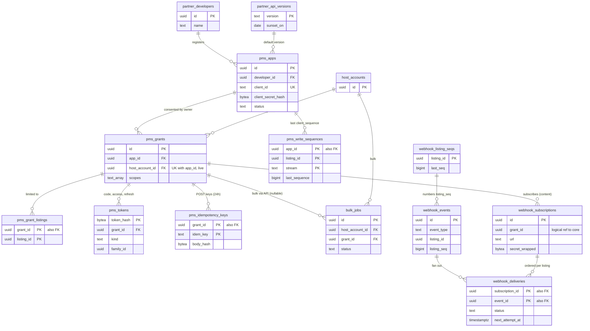

# Data model: PMS の API と Webhook

開発者の組織、PMS のアプリ、同意と許したリスティング、トークン、書き込みの順序（`client_sequence`）、POST の冪等キー、一括のジョブ、API のバージョン、Webhook の購読・事象・配信。振る舞いは [host-tools-and-api.md](../host-tools-and-api.md) の 5〜8 節、方針は [ADR-0068](../../decisions/0068-pms-oauth-apps-scopes-and-rate-limits.md)・[ADR-0069](../../decisions/0069-pms-availability-and-price-push-and-bulk-operations.md)・[ADR-0070](../../decisions/0070-webhooks-signing-delivery-and-ordering.md)・[ADR-0083](../../decisions/0083-app-releases-pms-api-versions-and-model-releases.md)。Webhook の本文の形は [stores.md](stores.md) の 8 節。規約は [data-model.md](../data-model.md) の 3 節。

- PMS の表は core にあり `partner-api`（と `bulk-runner`）が書く。Webhook の表は content にあり `webhook-fanout`・`webhook-sender` が書く（領域の文書の「core に置く」を content に揃えた。D-12）。
- PMS の書き込みは、ホストの画面と同じドメインの関数（`availability.setApiBlocks`、`pricing.setNightlyRates`、`availability.setStayRules`、`booking.transition`）を通す。PMS の近道の書き込みはない。
- トランザクションの初めに `SET LOCAL app.host_account_id`、`app.host_role = 'pms'`、`app.pms_grant_id` を置く。RLS は `pms_grant_listings` の集合で行を絞る（[data-model.md](../data-model.md) の 3.3 節）。
- トークン・`client_secret`・Webhook の秘密は平文で持たない（ハッシュか `kms-pms-secrets` で包んだ値）。

## 1. ER 図

- `pms_grants ||--o{ pms_grant_listings`：行がなければホストのアカウントの全部のリスティング（`all_listings = true`）。
- `webhook_events ||--o{ webhook_deliveries`：購読と範囲で宛先を決め、購読ごとに 1 行。

## 2. 制約の実装

| 制約 | 実装 |
| --- | --- |
| 古い書き込みで新しい状態を上書きしない | `pms_write_sequences` の PK `(app_id, listing_id, stream)` と `UPDATE ... WHERE last_sequence < $new`（書き込みと同じトランザクション）。守る物 |
| POST の冪等 | `pms_idempotency_keys` の PK `(grant_id, idem_key)`。同じ本文は前の結果、違えば 409。守る物 |
| 有効な同意は（アプリ、ホストのアカウント）に 1 つ | `pms_grants (app_id, host_account_id) WHERE revoked_at IS NULL` の部分一意 |
| 取り消しは 5 秒以内 | `pms_grants.revoked_at` と全トークンの `revoked_at` を 1 つのトランザクションで書き、Valkey の `pmstok:` を消す。書き込みの経路は同じトランザクションで同意の有効を確かめる |
| リフレッシュトークンの再使用で一式を取り消す | `pms_tokens.used_at` のある行の再使用で `family_id` の全行に `revoked_at` |
| Webhook の順序 | `webhook_deliveries` の（購読、リスティング）ごとに `in_flight` は 1 つ（部分一意） |

## 3. 表（core）

### 3.1 `partner_developers`

開発者の組織。管理者は本システムの利用者のアカウント（パスキー必須）。定義元：[host-tools-and-api.md](../host-tools-and-api.md) の 5.1 節。

| 列 | 型 | NULL | 既定 | 説明 |
| --- | --- | --- | --- | --- |
| `id` | `uuid` | NOT NULL | `uuidv7()` | |
| `name` | `text` | NOT NULL | — | |
| `country` | `char(2)` | NOT NULL | — | |
| `admin_user_ids` | `uuid[]` | NOT NULL | — | |
| `status` | `text` | NOT NULL | `'active'` | `active`・`suspended` |
| `created_at` | `timestamptz` | NOT NULL | `now()` | |

- キー：PK `(id)`。RLS：開発者の管理者（`app.actor_id = ANY(admin_user_ids)`）と運用。区分：O。保持：閉じてから 5 年。

### 3.2 `pms_apps`

PMS のアプリ。定義元：同 5.1・7 節。

| 列 | 型 | NULL | 既定 | 説明 |
| --- | --- | --- | --- | --- |
| `id` | `uuid` | NOT NULL | `uuidv7()` | |
| `developer_id` | `uuid` | NOT NULL | — | |
| `name` | `text` | NOT NULL | — | |
| `client_id` | `text` | NOT NULL | — | |
| `client_secret_hash` | `bytea` | NOT NULL | — | 256 ビットの秘密の HMAC（`kms-pms-secrets` の照合の鍵） |
| `redirect_uris` | `text[]` | NOT NULL | — | 完全一致だけ |
| `requested_scopes` | `text[]` | NOT NULL | — | |
| `status` | `text` | NOT NULL | `'development'` | `development`・`review`・`approved`・`suspended` |
| `data_residency_country` | `char(2)` | NOT NULL | — | 越境の整理の材料（L8） |
| `default_api_version` | `text` | NOT NULL | — | |
| `rate_limit_units_per_sec` | `integer` | NOT NULL | `500` | 審査で 2,000 まで |
| `approved_by` | `uuid` | NULL | — | |
| `approved_at` | `timestamptz` | NULL | — | |
| `suspended_at` | `timestamptz` | NULL | — | |
| `suspended_reason` | `text` | NULL | — | |
| `created_at` | `timestamptz` | NOT NULL | `now()` | |

- キー：PK `(id)`。UK `(client_id)`。FK `developer_id → partner_developers`、`default_api_version → partner_api_versions`。
- CHECK：`status IN (...)`、`rate_limit_units_per_sec BETWEEN 1 AND 2000`、`status <> 'approved' OR approved_by IS NOT NULL`。
- RLS：開発者の管理者。サービス：`partner-api`。区分：S（秘密のハッシュ）・O。保持：停止から 5 年。S1 の量：数百行。

### 3.3 `pms_grants`

ホストのアカウントの `owner` の同意。定義元：同 5.2 節。

| 列 | 型 | NULL | 既定 | 説明 |
| --- | --- | --- | --- | --- |
| `id` | `uuid` | NOT NULL | `uuidv7()` | `app.pms_grant_id` |
| `app_id` | `uuid` | NOT NULL | — | |
| `host_account_id` | `uuid` | NOT NULL | — | |
| `scopes` | `text[]` | NOT NULL | — | `listings:read`・`listings:write`・`calendar:read`・`calendar:write`・`pricing:read`・`pricing:write`・`reservations:read`・`reservations:write`・`messages:read`・`messages:write`・`guest_registry:read`・`webhooks:manage` |
| `all_listings` | `boolean` | NOT NULL | — | |
| `approved_by_user_id` | `uuid` | NOT NULL | — | `owner`（直近 10 分の強い確認） |
| `created_at` | `timestamptz` | NOT NULL | `now()` | |
| `revoked_at` | `timestamptz` | NULL | — | |
| `revoked_reason` | `text` | NULL | — | `host_revoked`・`owner_deleted`・`host_suspended`・`app_suspended` |

- キー：PK `(id)`。部分 UK `(app_id, host_account_id) WHERE revoked_at IS NULL`。
- CHECK：`NOT ('guest_registry:read' = ANY(scopes))` は `legal.pms_registry_scope_enabled` が偽の間、書き込みの関数で拒む（CHECK にしない）。
- RLS：ホストのアカウント（`owner`）と開発者の管理者（読み出し）。区分：O。保持：取り消しから 5 年。S1 の量：1 万行。

### 3.4 `pms_grant_listings`

同意で許したリスティング（`all_listings = false` のとき）。

| 列 | 型 | NULL | 既定 | 説明 |
| --- | --- | --- | --- | --- |
| `grant_id` | `uuid` | NOT NULL | — | |
| `listing_id` | `uuid` | NOT NULL | — | |
| `host_account_id` | `uuid` | NOT NULL | — | RLS のための写し |

- キー：PK `(grant_id, listing_id)`。索引：`(listing_id)`。RLS：`pms_grants` と同じ。区分：O。

### 3.5 `pms_tokens`

認可コード、アクセストークン、リフレッシュトークン（ハッシュだけ）。定義元：同 5.2 節。

| 列 | 型 | NULL | 既定 | 説明 |
| --- | --- | --- | --- | --- |
| `token_hash` | `bytea` | NOT NULL | — | SHA-256 |
| `kind` | `text` | NOT NULL | — | `auth_code`・`access`・`refresh` |
| `grant_id` | `uuid` | NOT NULL | — | |
| `family_id` | `uuid` | NOT NULL | — | 同じ認可コードから出した一式 |
| `code_challenge` | `text` | NULL | — | 認可コードの PKCE（`S256`） |
| `redirect_uri` | `text` | NULL | — | 認可コードのとき |
| `expires_at` | `timestamptz` | NOT NULL | — | コード 60 秒、アクセス 1 時間、リフレッシュ 90 日 |
| `used_at` | `timestamptz` | NULL | — | コードとリフレッシュの使用 |
| `revoked_at` | `timestamptz` | NULL | — | |
| `created_at` | `timestamptz` | NOT NULL | `now()` | |

- キー：PK `(token_hash)`。索引：`(grant_id) WHERE revoked_at IS NULL`、`(family_id)`。
- CHECK：`kind IN (...)`、`(kind = 'auth_code') = (code_challenge IS NOT NULL)`。
- 写し：Valkey の `pmstok:{hash}`（60 秒）。
- RLS：サービス（`partner-api`）。区分：S。保持：失効から 30 日で消す。S1 の量：1 日 20 万行（アクセストークン）。

### 3.6 `pms_write_sequences`

（アプリ、リスティング、流れ）の最後の `client_sequence` と結果。定義元：同 6.3 節。

| 列 | 型 | NULL | 既定 | 説明 |
| --- | --- | --- | --- | --- |
| `app_id` | `uuid` | NOT NULL | — | |
| `listing_id` | `uuid` | NOT NULL | — | |
| `stream` | `text` | NOT NULL | — | `availability`・`rates`・`stay_rules`・`external_stays` |
| `host_account_id` | `uuid` | NOT NULL | — | RLS のための写し |
| `last_sequence` | `bigint` | NOT NULL | — | |
| `body_hash` | `bytea` | NOT NULL | — | |
| `result` | `jsonb` | NOT NULL | — | 範囲ごとの `applied`・`unchanged`・`conflict` と `calendar_version` |
| `updated_at` | `timestamptz` | NOT NULL | `now()` | |

- キー：PK `(app_id, listing_id, stream)`（守る物）。CHECK：`stream IN (...)`、`last_sequence >= 0`。
- RLS：サービス（`partner-api`、`bulk-runner`）。区分：M。保持：同意の取り消しから 90 日。S1 の量：2 万リスティング × 4 流れで 8 万行（更新が多い。1 日 96 万回）。

### 3.7 `pms_idempotency_keys`

POST の操作（承認、断り、ジョブの作成、購読）の冪等キー（24 時間）。

| 列 | 型 | NULL | 既定 | 説明 |
| --- | --- | --- | --- | --- |
| `grant_id` | `uuid` | NOT NULL | — | |
| `idem_key` | `text` | NOT NULL | — | `Idempotency-Key`（領域の文書の「鍵」。予約語を避けた名前。D-8） |
| `body_hash` | `bytea` | NOT NULL | — | |
| `status_code` | `smallint` | NOT NULL | — | |
| `result` | `jsonb` | NOT NULL | — | |
| `expires_at` | `timestamptz` | NOT NULL | — | 作成 + 24 時間 |

- キー：PK `(grant_id, idem_key)`（守る物）。索引：`(expires_at)` — 掃除。
- RLS：サービス。区分：M。保持：24 時間。

### 3.8 `bulk_jobs`

一括のジョブ（JSONL、5,000 行、6 時間）。定義元：同 6.4 節。

| 列 | 型 | NULL | 既定 | 説明 |
| --- | --- | --- | --- | --- |
| `id` | `uuid` | NOT NULL | `uuidv7()` | |
| `host_account_id` | `uuid` | NOT NULL | — | |
| `created_by_type` | `text` | NOT NULL | — | `host_member`・`pms_app` |
| `created_by_id` | `uuid` | NOT NULL | — | |
| `grant_id` | `uuid` | NULL | — | PMS のとき |
| `row_count` | `integer` | NOT NULL | — | |
| `status` | `text` | NOT NULL | `'queued'` | `queued`・`running`・`completed`・`failed` |
| `succeeded_rows`・`failed_rows` | `integer` | NOT NULL | `0` | |
| `input_s3_key`・`result_s3_key` | `text` | NULL | — | `bulk/<host_account_id>/<job_id>.jsonl` |
| `failure_reason` | `text` | NULL | — | `timeout` など |
| `started_at`・`finished_at` | `timestamptz` | NULL | — | |
| `created_at` | `timestamptz` | NOT NULL | `now()` | |

- キー：PK `(id)`。索引：`(host_account_id, status)` — 同時 2 ジョブの上限。`(grant_id, status)` — アプリごとの 20。
- CHECK：`row_count BETWEEN 1 AND 5000`、`status IN (...)`、`succeeded_rows + failed_rows <= row_count`。
- RLS：ホストのアカウントと同意。区分：O。保持：90 日（S3 の結果は 7 日）。

### 3.9 `partner_api_versions`

PMS の API のバージョン。定義元：[delivery.md](../delivery.md) の 7 節。

| 列 | 型 | NULL | 既定 | 説明 |
| --- | --- | --- | --- | --- |
| `version` | `text` | NOT NULL | — | `YYYY-MM` |
| `released_on` | `date` | NOT NULL | — | |
| `sunset_planned_on` | `date` | NULL | — | |
| `sunset_on` | `date` | NULL | — | |
| `extensions` | `jsonb` | NOT NULL | `'[]'` | 延ばした記録 |

- キー：PK `(version)`。RLS：公開の設定。区分：U。

## 4. 表（content）

### 4.1 `webhook_subscriptions`

Webhook の購読。秘密は購読ごとの 256 ビットの乱数を `kms-pms-secrets` で包んで置く。定義元：同 7 節。

| 列 | 型 | NULL | 既定 | 説明 |
| --- | --- | --- | --- | --- |
| `id` | `uuid` | NOT NULL | `uuidv7()` | |
| `grant_id` | `uuid` | NOT NULL | — | core の `pms_grants`（論理の参照） |
| `app_id` | `uuid` | NOT NULL | — | |
| `host_account_id` | `uuid` | NOT NULL | — | |
| `url` | `text` | NOT NULL | — | `https` だけ。送信は信用しない宛先の egress |
| `event_types` | `text[]` | NOT NULL | — | |
| `api_version` | `text` | NOT NULL | — | 本文の形のバージョン |
| `secret_wrapped` | `bytea` | NOT NULL | — | |
| `previous_secret_wrapped` | `bytea` | NULL | — | 入れ替えの間（最長 24 時間）の旧い秘密 |
| `previous_secret_until` | `timestamptz` | NULL | — | |
| `status` | `text` | NOT NULL | `'active'` | `active`・`disabled` |
| `disabled_reason` | `text` | NULL | — | `no_success_72h`・`grant_revoked` |
| `created_at` | `timestamptz` | NOT NULL | `now()` | |
| `disabled_at` | `timestamptz` | NULL | — | |

- キー：PK `(id)`。索引：`(grant_id)`、`(host_account_id) WHERE status = 'active'` — 宛先の決め。
- CHECK：`url LIKE 'https://%'`、`(previous_secret_wrapped IS NULL) = (previous_secret_until IS NULL)`。
- RLS：開発者の管理者と同意のホストのアカウント（読み出し。秘密を出さない）。サービス：`webhook-fanout`、`webhook-sender`。区分：S・O。保持：止めてから 90 日。

### 4.2 `webhook_events`

Webhook の事象（7 日。`GET /v1/events?since=` の取り直しの元）。本文は最小の欄だけ。

| 列 | 型 | NULL | 既定 | 説明 |
| --- | --- | --- | --- | --- |
| `id` | `uuid` | NOT NULL | `uuidv7()` | `X-<Brand>-Event-Id`（`evt_<id>`） |
| `source_event_id` | `uuid` | NOT NULL | — | 元の outbox の事象 |
| `event_type` | `text` | NOT NULL | — | `reservation.*`・`availability.changed`・`calendar.conflict_detected`・`message.created`・`listing.*`・`bulk_job.completed`・`grant.revoked` |
| `host_account_id` | `uuid` | NOT NULL | — | |
| `listing_id` | `uuid` | NULL | — | リスティングに結び付く事象 |
| `listing_seq` | `bigint` | NULL | — | リスティングごとに増える番号 |
| `origin_app_id` | `uuid` | NULL | — | そのアプリ自身の書き込みの変化（そのアプリへは送らない） |
| `payload` | `jsonb` | NOT NULL | — | ID・種類・資源のバージョン・日付・状態（個人のデータなし） |
| `created_at` | `timestamptz` | NOT NULL | `now()` | |

- キー：PK `(id)`。UK `(source_event_id, event_type)`。索引：`(host_account_id, id)` — 取り直し。
- CHECK：`(listing_id IS NULL) = (listing_seq IS NULL)`。
- 分割：`id` の日。7 日で `DROP`。RLS：サービス（`webhook-fanout`、`partner-api` の取り直しの経路は同意の範囲で絞る）。区分：M。S1 の量：1 日 30 万行。

### 4.3 `webhook_deliveries`

購読ごとの配信（72 時間まで再送）。

| 列 | 型 | NULL | 既定 | 説明 |
| --- | --- | --- | --- | --- |
| `subscription_id` | `uuid` | NOT NULL | — | |
| `event_id` | `uuid` | NOT NULL | — | |
| `listing_id` | `uuid` | NULL | — | |
| `listing_seq` | `bigint` | NULL | — | |
| `status` | `text` | NOT NULL | `'pending'` | `pending`・`in_flight`・`delivered`・`dead` |
| `attempts` | `smallint` | NOT NULL | `0` | |
| `next_attempt_at` | `timestamptz` | NOT NULL | — | 30 秒から倍、最大 1 時間、±20% |
| `last_status_code` | `smallint` | NULL | — | |
| `last_error` | `text` | NULL | — | `timeout`・`non_2xx`・`egress_denied` |
| `created_at` | `timestamptz` | NOT NULL | `now()` | |
| `delivered_at` | `timestamptz` | NULL | — | |

- キー：PK `(subscription_id, event_id)`。部分 UK `(subscription_id, listing_id) WHERE status = 'in_flight'`（順序）。
- 索引：`(status, next_attempt_at) WHERE status IN ('pending','in_flight')`。`(subscription_id, listing_id, listing_seq)` — 次に送る事象。
- CHECK：`status IN (...)`、`attempts >= 0`。最初の試みから 72 時間で `dead` にするのは `webhook-sender`（CHECK に `now()` を使わない）。
- 分割：`created_at` の日。7 日で `DROP`。RLS：サービス。区分：M。S1 の量：1 日 30 万行。

### 4.4 `webhook_listing_seqs`

リスティングごとの `listing_seq` の数え。`webhook-fanout` が事象を作るトランザクションで 1 上げる。この工程で足した最小の形（D-17）。

| 列 | 型 | NULL | 既定 | 説明 |
| --- | --- | --- | --- | --- |
| `listing_id` | `uuid` | NOT NULL | — | |
| `last_seq` | `bigint` | NOT NULL | `0` | |

- キー：PK `(listing_id)`。RLS：サービス（`webhook-fanout`）。区分：M。S1 の量：2 万行。
