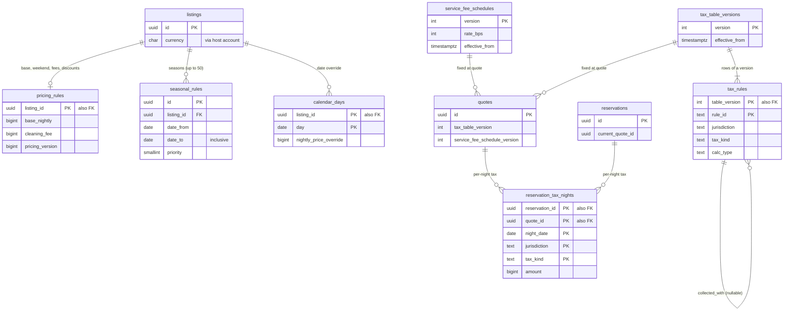

# Data model: 料金、手数料、税

泊の料金の規則、季節の規則、サービス料の表、税の表のバージョンと行、予約の泊ごとの税。見積もりの写し `quotes` は [bookings-and-quotes.md](bookings-and-quotes.md)、日付の上書き `calendar_days.nightly_price_override` は [availability-and-calendars.md](availability-and-calendars.md)、祝日の表 `jp_holidays` は [regulatory-japan.md](regulatory-japan.md)、為替の上乗せ `fx_markup_versions` は [payments-and-fx.md](payments-and-fx.md)、税の区域 `tax_zones` は [location-and-places.md](location-and-places.md)。振る舞いは [pricing-and-fees.md](../pricing-and-fees.md)・[taxes.md](../taxes.md)、方針は [ADR-0029](../../decisions/0029-nightly-price-rules-and-discounts.md)〜[ADR-0034](../../decisions/0034-tax-collection-model.md)。規約は [data-model.md](../data-model.md) の 3 節。

- どの表も core にある。`pricing_rules`・`seasonal_rules` は `pricing` のサービスが書く（ホストの画面と PMS の `rates` の経路）。設定の表（`service_fee_schedules`・`tax_table_versions`・`tax_rules`）は `config-loader` だけが入れ、行を変えない（[delivery.md](../delivery.md) の 3.4 節）。
- 金額はリスティングの通貨（MVP は円）の最小単位の整数。率は基点の整数（`_bps`、1,500 = 15%。D-7）か百分率の整数（`_pct`）。浮動小数点を使わない。
- 料金の変化は `pricing_rules.pricing_version` と `listings.search_version` を上げ、`listing_version` を上げない。見積もりは料金の変化で無効にならない（[ADR-0037](../../decisions/0037-quote-binding-and-idempotency.md)）。

## 1. ER 図

- `listings ||--o| pricing_rules`：公開の前に料金の規則が要る（[listings-and-content.md](../listings-and-content.md) の 4.2 節）。下書きのリスティングは作成と同じトランザクションで既定の行を作る。
- `quotes ||--o{ reservation_tax_nights`：予約に使った見積もり（最初の見積もりと、変更の受諾の新しい見積もり）ごとの泊の税。予約の今の税は `reservations.current_quote_id` の行（D-31）。

## 2. 表

### 2.1 `pricing_rules`

リスティングの料金の規則。定義元：[pricing-and-fees.md](../pricing-and-fees.md) の 4・10 節。

| 列 | 型 | NULL | 既定 | 説明 |
| --- | --- | --- | --- | --- |
| `listing_id` | `uuid` | NOT NULL | — | |
| `host_account_id` | `uuid` | NOT NULL | — | RLS のための写し |
| `currency` | `char(3)` | NOT NULL | `'JPY'` | ホストのアカウントの通貨 |
| `base_nightly` | `bigint` | NOT NULL | — | 基本の 1 泊 |
| `weekend_nightly` | `bigint` | NULL | — | |
| `weekend_nights` | `smallint[]` | NOT NULL | `'{5,6}'` | 週末の夜の曜日（ISO。既定は金と土） |
| `holiday_eve_as_weekend` | `boolean` | NOT NULL | `false` | 翌日が祝日の夜を週末として扱う |
| `guests_included` | `smallint` | NOT NULL | `1` | |
| `extra_guest_fee` | `bigint` | NOT NULL | `0` | 泊・人ごと |
| `cleaning_fee` | `bigint` | NOT NULL | `0` | 滞在に 1 回 |
| `pet_fee` | `bigint` | NOT NULL | `0` | 滞在に 1 回 |
| `weekly_discount_pct` | `smallint` | NOT NULL | `0` | 7 泊以上 |
| `monthly_discount_pct` | `smallint` | NOT NULL | `0` | 28 泊以上（MVP の最長 27 泊では効かない） |
| `pricing_suggestion_enabled` | `boolean` | NOT NULL | `false` | 料金の提案（[ADR-0009](../../decisions/0009-trust-and-safety-and-ml-boundary.md)） |
| `suggestion_min`・`suggestion_max` | `bigint` | NULL | — | 提案が書ける範囲 |
| `pricing_version` | `bigint` | NOT NULL | `1` | 料金の規則・季節の規則・日付の上書きの変化で 1 上げる |
| `updated_by_type` | `text` | NOT NULL | — | `host_member`・`pms_app`・`pricing_suggestion` |
| `updated_at` | `timestamptz` | NOT NULL | `now()` | |

- キー：PK `(listing_id)`。FK → `listings`。
- CHECK（円の範囲。[pricing-and-fees.md](../pricing-and-fees.md) の 4.4 節）：`base_nightly BETWEEN 1000 AND 1000000`、`weekend_nightly IS NULL OR weekend_nightly BETWEEN 1000 AND 1000000`、`cleaning_fee BETWEEN 0 AND 100000`、`extra_guest_fee BETWEEN 0 AND 50000`、`pet_fee BETWEEN 0 AND 50000`、`weekly_discount_pct BETWEEN 0 AND 90`、`monthly_discount_pct BETWEEN 0 AND 90`、`NOT pricing_suggestion_enabled OR (suggestion_min IS NOT NULL AND suggestion_max IS NOT NULL AND suggestion_min <= suggestion_max)`、`currency = 'JPY'`（MVP）。
- RLS：ホストのアカウント（DT-HST-001 の行 9）。公開の読み出しは料金の写し `prc:` と見積もりを通す。サービス：`pricing`、`availability-cache-writer`、`search-indexer`。区分：U。
- S1 の量：15 万行。

### 2.2 `seasonal_rules`

期間の料金。定義元：同 4.1・4.2 節。

| 列 | 型 | NULL | 既定 | 説明 |
| --- | --- | --- | --- | --- |
| `id` | `uuid` | NOT NULL | `uuidv7()` | |
| `listing_id` | `uuid` | NOT NULL | — | |
| `host_account_id` | `uuid` | NOT NULL | — | RLS のための写し |
| `date_from` | `date` | NOT NULL | — | 夜の日付（含む） |
| `date_to` | `date` | NOT NULL | — | 含む |
| `nightly` | `bigint` | NOT NULL | — | |
| `weekend_nightly` | `bigint` | NULL | — | |
| `priority` | `smallint` | NOT NULL | `0` | 大きいほうが勝つ。同じなら期間の短いもの、なお同じなら新しいもの |
| `min_nights` | `smallint` | NULL | — | 滞在の規則に渡す |
| `created_at` | `timestamptz` | NOT NULL | `now()` | |

- キー：PK `(id)`。索引：`(listing_id, date_from)`。1 リスティング 50 件まで（関数で数える）。
- CHECK：`date_to >= date_from`、`date_to - date_from <= 365`、`nightly BETWEEN 1000 AND 1000000`、`min_nights IS NULL OR min_nights BETWEEN 1 AND 27`。
- RLS：`pricing_rules` と同じ。区分：U。保持：`date_to` から 90 日で消す。S1 の量：30 万行。

### 2.3 `service_fee_schedules`

サービス料の率（ホストだけの型）。定義元：同 7 節、[ADR-0031](../../decisions/0031-host-only-service-fee.md)。

| 列 | 型 | NULL | 既定 | 説明 |
| --- | --- | --- | --- | --- |
| `version` | `integer` | NOT NULL | — | |
| `applies_to` | `text` | NOT NULL | `'all'` | ホストのアカウントの区分（MVP は `all` だけ） |
| `rate_bps` | `integer` | NOT NULL | — | 既定 1,500（15%。消費税を含む。領域の文書の `rate_bp`。D-7） |
| `effective_from` | `timestamptz` | NOT NULL | — | 入れる時刻から 24 時間より後 |
| `approved_by` | `uuid[]` | NOT NULL | — | PM と財務 |
| `content_hash` | `bytea` | NOT NULL | — | `config/service-fee/<version>.json` のハッシュ |
| `created_at` | `timestamptz` | NOT NULL | `now()` | |

- キー：PK `(version, applies_to)`。索引：`(applies_to, effective_from DESC)` — 見積もりの時の有効なバージョン。
- CHECK：`rate_bps BETWEEN 0 AND 5000`、`cardinality(approved_by) >= 2`。
- 行の `UPDATE`・`DELETE` を権限で禁止する（守る物）。
- RLS：公開の設定（読み出し）。書き込みは `config-loader`。区分：F。保持：消さない。

### 2.4 `tax_table_versions`

税の表全体のバージョン。定義元：[taxes.md](../taxes.md) の 4.2 節。

| 列 | 型 | NULL | 既定 | 説明 |
| --- | --- | --- | --- | --- |
| `version` | `integer` | NOT NULL | — | |
| `effective_from` | `timestamptz` | NOT NULL | — | 新しい見積もりに使い始める時刻 |
| `published_at` | `timestamptz` | NOT NULL | `now()` | |
| `approved_by` | `uuid[]` | NOT NULL | — | 財務と法務（L4） |
| `content_hash` | `bytea` | NOT NULL | — | |
| `notes` | `text` | NULL | — | |

- キー：PK `(version)`。CHECK：`cardinality(approved_by) >= 2`。行を変えない。
- RLS：公開の設定。区分：F。保持：消さない。

### 2.5 `tax_rules`

税の行（管轄 × 税の種類 × 期間）。定義元：同 4.2・4.3 節。

| 列 | 型 | NULL | 既定 | 説明 |
| --- | --- | --- | --- | --- |
| `table_version` | `integer` | NOT NULL | — | |
| `rule_id` | `text` | NOT NULL | — | バージョンをまたいで変えない行の名前（例 `kyoto-city-lodging-2026`） |
| `jurisdiction` | `text` | NOT NULL | — | 都道府県のコード、市区町村のコード、`zone:<tax_zones.id>` |
| `tax_kind` | `text` | NOT NULL | — | `lodging_tax`・`bathing_tax` |
| `valid_from` | `date` | NOT NULL | — | 泊の日（物件の現地の日付） |
| `valid_to` | `date` | NULL | — | 含む |
| `facility_types` | `text[]` | NOT NULL | — | `minpaku`・`tokku_minpaku`・`ryokan_hotel`・`kan_i_shukusho` |
| `calc_type` | `text` | NOT NULL | — | `bracket_per_person_night`・`percent_per_person_night`・`flat_per_person_night` |
| `brackets` | `jsonb` | NULL | — | `[{from, to, amount}]`（`from` を含み `to` を含まない） |
| `percent_bps` | `integer` | NULL | — | 定率（領域の文書の `percent_bp`。D-7） |
| `exempt_below` | `bigint` | NULL | — | 1 人 1 泊の標準の下限 |
| `flat_amount` | `bigint` | NULL | — | |
| `base_includes` | `text[]` | NOT NULL | `'{}'` | `cleaning_fee`・`pet_fee`・`extra_guest_fee` |
| `unverified` | `boolean` | NOT NULL | `true` | 課税の標準・端数を資料で確かめていない。本番の表に入れない |
| `person_rule` | `text` | NOT NULL | — | `adults_and_children`・`adults_only`・`age_from:N` |
| `requires_amenity` | `text` | NULL | — | 入湯税は `onsen_bath` |
| `rounding` | `text` | NOT NULL | — | `per_person_night_floor` など |
| `collected_with` | `text` | NULL | — | 一括して集める他の行の `rule_id` |
| `source_url` | `text` | NOT NULL | — | 公式の資料 |
| `source_checked_at` | `date` | NOT NULL | — | 確認日 |

- キー：PK `(table_version, rule_id)`。FK `table_version → tax_table_versions`。索引：`(table_version, jurisdiction, tax_kind, valid_from)`。
- CHECK：`tax_kind IN (...)`、`calc_type IN (...)`、`(calc_type = 'bracket_per_person_night') = (brackets IS NOT NULL)`、`(calc_type = 'percent_per_person_night') = (percent_bps IS NOT NULL)`、`(calc_type = 'flat_per_person_night') = (flat_amount IS NOT NULL)`、`valid_to IS NULL OR valid_to >= valid_from`。
- 本番の `config-loader` は `unverified = true` の行を拒む（CI でも確かめる）。
- RLS：公開の設定。区分：F。保持：消さない。S1 の量：1 バージョン 100 行未満。

### 2.6 `reservation_tax_nights`

予約の泊ごとの税（返金・明細・申告の資料）。`computeStayTaxes` の `per_night` を、予約と同じトランザクションで書く。定義元：同 5・8 節。

| 列 | 型 | NULL | 既定 | 説明 |
| --- | --- | --- | --- | --- |
| `reservation_id` | `uuid` | NOT NULL | — | |
| `quote_id` | `uuid` | NOT NULL | — | 計算に使った見積もり |
| `night_date` | `date` | NOT NULL | — | 泊の日（領域の文書の `date`。D-8） |
| `jurisdiction` | `text` | NOT NULL | — | |
| `tax_kind` | `text` | NOT NULL | — | |
| `rule_id` | `text` | NOT NULL | — | |
| `table_version` | `integer` | NOT NULL | — | |
| `base_numerator` | `bigint` | NOT NULL | — | 1 人 1 泊の標準の分子（標準 = 分子 ÷ `persons_counted`。有理数のまま比べるため） |
| `persons_counted` | `smallint` | NOT NULL | — | |
| `per_person_amount` | `bigint` | NOT NULL | — | |
| `amount` | `bigint` | NOT NULL | — | 夜の税（リスティングの通貨） |
| `currency` | `char(3)` | NOT NULL | — | |
| `guest_id` | `uuid` | NOT NULL | — | RLS のための写し |
| `host_account_id` | `uuid` | NOT NULL | — | 同 |

- キー：PK `(reservation_id, quote_id, night_date, jurisdiction, tax_kind)`。FK `reservation_id → reservations`、`quote_id → quotes`。索引：`(host_account_id, night_date)` — ホストの月ごとの明細と申告の資料。
- CHECK：`amount = per_person_amount * persons_counted`、`persons_counted >= 0`、`amount >= 0`。
- RLS：予約の 2 者（読み出し）。サービス：`booking`（書き込み）、`ledger`・`payouts`（明細）。区分：P・F。
- 保持：予約の記録と同じ 10 年。S1 の量：1 予約 平均 3.5 泊 × 1.2 行で 1 日 2.5 万行、1 年 900 万行。
