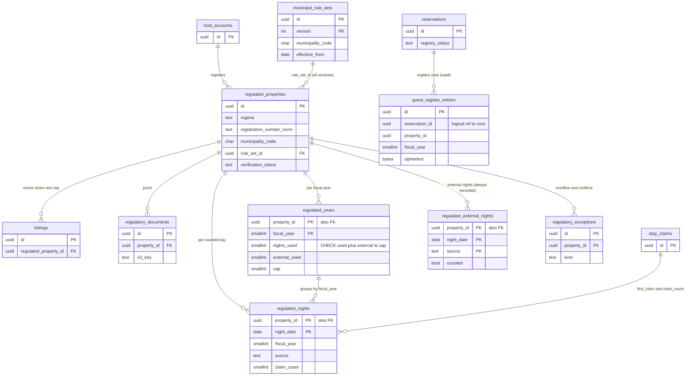

# Data model: 日本の法令

届出住宅・許可・特定認定、確かめの書類、年度の数（CHECK）、泊の日、外部の泊、例外、自治体の規則の表、祝日、宿泊者名簿（vault）。振る舞いは [regulatory-compliance-japan.md](../regulatory-compliance-japan.md)、方針は [ADR-0006](../../decisions/0006-regulatory-night-cap-enforcement.md)・[ADR-0064](../../decisions/0064-registration-types-and-number-verification.md)〜[ADR-0067](../../decisions/0067-guest-registry-in-vault.md)。法令の解釈の値は `legal.*`（[stores.md](stores.md) の 9 節）で、本番の値は法務の確認待ち（L1・L2・L3）。規約は [data-model.md](../data-model.md) の 3 節。

- `guest_registry_entries` だけが vault にある。他は core にあり、`compliance-jp` のサービスだけが書く（`regulated_nights`・`regulated_years` は `packages/compliance-jp` の `countNights`・`uncountNights` を、予約と同じトランザクションの中で `booking` が呼ぶ）。
- 届出住宅の行のロックはリスティングの行のロックより先に取る（どの経路も同じ順）。
- `municipal_rule_sets`・`jp_holidays` は設定の表（`config-loader`）。規則の中身は法務と運用が条例を読んで入れる。コードに自治体の名前を書かない。

## 1. ER 図

- `regulated_properties ||--o{ listings`：1 つのリスティングは 1 つの届出住宅にだけ結ぶ（`listings.regulated_property_id`）。上限は届出住宅で分け合う。
- `regulated_years ||--o{ regulated_nights`：外部キーではなく `(property_id, fiscal_year)` の対応（`regulated_nights.fiscal_year` は生成の列）。
- `stay_claims ||--o{ regulated_nights`：`first_claim` は最初に日を埋めた行。`claim_count` はその日を埋める有効な `hold`・`request`・`reservation` の数（届出住宅のどの部屋でも）。

## 2. 制約の実装

| 制約 | 実装 |
| --- | --- |
| 年度の上限を超えない | `regulated_years` の `CHECK (nights_used + external_used <= cap)`。守る物（[delivery.md](../delivery.md) の 5.2 節）。予約と同じトランザクションで数え、当たれば戻して 409 `regulatory_cap_reached` |
| 同じ日は 1 回だけ数える | `regulated_nights` の PK `(property_id, night_date)`。`INSERT ... ON CONFLICT DO UPDATE SET claim_count = claim_count + 1 RETURNING (xmax = 0)` で新しい日のときだけ `nights_used` を増やす |
| 過ぎた日は戻さない | `uncountNights` は `night_date` の正午（物件の現地の時刻）が今より後の日だけを減らす |
| 外部の泊で CHECK を破らない | `external_used` を上限まで増やし、残りを `external_overflow`（CHECK の外）に数えて `regulatory_exceptions` に記録する |
| `verified` でない届出住宅で予約しない | `countNights` の最初の確かめ（409 `registration_not_verified`）。`listingVisible()` の行 8 |
| 名簿は vault だけ | 名簿の項目と旅券の番号の列を core に作らない。旅券の画像は S3 の `registry`（主体の鍵で封筒の暗号化） |

## 3. 表

### 3.1 `regulated_properties`

届出住宅・旅館業の施設・特区民泊の施設。定義元：[ADR-0006](../../decisions/0006-regulatory-night-cap-enforcement.md)、[regulatory-compliance-japan.md](../regulatory-compliance-japan.md) の 4 節。

| 列 | 型 | NULL | 既定 | 説明 |
| --- | --- | --- | --- | --- |
| `id` | `uuid` | NOT NULL | `uuidv7()` | |
| `host_account_id` | `uuid` | NOT NULL | — | |
| `regime` | `text` | NOT NULL | — | `minpaku`・`ryokan`・`tokku`（`exempt` は MVP で作らない） |
| `registration_number` | `text` | NOT NULL | — | 入れた番号（公開の値。core に置く） |
| `registration_number_norm` | `text` | NOT NULL | — | 全角・空白・「第」「号」を除いた番号 |
| `municipality_code` | `char(6)` | NOT NULL | — | |
| `prefecture_code` | `char(2)` | NOT NULL | — | |
| `rule_set_id` | `uuid` | NULL | — | 合う自治体の規則の集まり（`municipal_rule_sets.id`。泊の日ごとに効くバージョンで判定） |
| `annual_cap` | `smallint` | NULL | — | `minpaku` は 180 か規則の値。他は NULL |
| `verification_status` | `text` | NOT NULL | `'pending_review'` | `pending_review`・`verified`・`rejected`・`suspended`（[ADR-0064](../../decisions/0064-registration-types-and-number-verification.md)。D-23） |
| `verification_source` | `text` | NULL | — | `documents`・`government_data`（L1） |
| `review_flags` | `text[]` | NOT NULL | `'{}'` | `form_mismatch`・`prefecture_mismatch`・`duplicate_number` |
| `facility_address_hmac` | `bytea` | NULL | — | 届出の住所の HMAC（リスティングの正確な住所との照合。`exact_locations.address_hmac` と同じ鍵） |
| `suspended_reason`・`rejected_reason` | `text` | NULL | — | 理由のコード |
| `verified_at` | `timestamptz` | NULL | — | |
| `verified_by` | `uuid` | NULL | — | 運用者 |
| `version` | `bigint` | NOT NULL | `1` | |
| `created_at` | `timestamptz` | NOT NULL | `now()` | |
| `updated_at` | `timestamptz` | NOT NULL | `now()` | |

- キー：PK `(id)`。FK `host_account_id → host_accounts`。同じ番号の重複は一意にしない（共同の事業者がありうる。人が確かめる）。
- 索引：`(regime, registration_number_norm)` — 重複の確かめと行政の要請。`(host_account_id)`。`(municipality_code)` — 規則の変更の影響の一覧。`(verification_status) WHERE verification_status = 'pending_review'` — 運用の待ち行列。
- CHECK：`regime IN ('minpaku','ryokan','tokku')`、`verification_status IN (...)`、`(regime = 'minpaku') = (annual_cap IS NOT NULL)`、`annual_cap IS NULL OR annual_cap BETWEEN 0 AND 180`、`verification_status <> 'verified' OR verified_at IS NOT NULL`。
- RLS：ホストのアカウント（登録と番号の変更は `owner`）。番号と型は公開（リスティングの画面）。サービス：`compliance-jp`、`booking`（ロックと読み出し）、`trust-safety`。区分：U（番号）・O。
- 保持：廃止から 5 年（定期報告と照会）。S1 の量：2 万行（届出住宅の想定。初期見積もり）。

### 3.2 `regulatory_documents`

確かめの書類（届出の受理の通知、許可書）。定義元：同 4.2 節。

| 列 | 型 | NULL | 既定 | 説明 |
| --- | --- | --- | --- | --- |
| `id` | `uuid` | NOT NULL | `uuidv7()` | |
| `property_id` | `uuid` | NOT NULL | — | |
| `host_account_id` | `uuid` | NOT NULL | — | RLS のための写し |
| `kind` | `text` | NOT NULL | — | `acceptance_notice`・`license`・`tokku_certificate`・`other` |
| `s3_key` | `text` | NOT NULL | — | `regulatory-docs/<property_id>/<id>` |
| `uploaded_by` | `uuid` | NOT NULL | — | |
| `reviewed_at` | `timestamptz` | NULL | — | |
| `created_at` | `timestamptz` | NOT NULL | `now()` | |

- キー：PK `(id)`。索引：`(property_id)`。RLS：ホストのアカウント（`owner`）と運用の審査。区分：O。保持：届出住宅と同じ。

### 3.3 `regulated_years`

届出住宅 × 年度の数。定義元：同 5.2 節、[ADR-0065](../../decisions/0065-regulated-nights-fiscal-year-and-external-overflow.md)。

| 列 | 型 | NULL | 既定 | 説明 |
| --- | --- | --- | --- | --- |
| `property_id` | `uuid` | NOT NULL | — | |
| `fiscal_year` | `smallint` | NOT NULL | — | 4 月 1 日の正午から始まる年度 |
| `nights_used` | `smallint` | NOT NULL | `0` | `source = 'platform'` の日の数 |
| `external_used` | `smallint` | NOT NULL | `0` | 数えた外部の日の数 |
| `external_overflow` | `smallint` | NOT NULL | `0` | 上限を超えて数えられなかった外部の日（CHECK の外） |
| `cap` | `smallint` | NOT NULL | — | 年度の上限 |
| `cap_source` | `text` | NOT NULL | — | `law_default`・`municipal_rule_set:<id>:<version>` |
| `updated_at` | `timestamptz` | NOT NULL | `now()` | |

- キー：PK `(property_id, fiscal_year)`。FK `property_id → regulated_properties`。
- CHECK：`nights_used + external_used <= cap`（守る物）、`nights_used >= 0`、`external_used >= 0`、`external_overflow >= 0`、`cap BETWEEN 0 AND 366`。
- RLS：ホストのアカウント（読み出し）。サービス：`compliance-jp`、`booking`。区分：O。保持：5 年。S1 の量：2 万 × 年。

### 3.4 `regulated_nights`

届出住宅 × 日（正午から翌日の正午までの 1 日の始まりの日）。定義元：[ADR-0006](../../decisions/0006-regulatory-night-cap-enforcement.md)、同 5.2・5.3 節。

| 列 | 型 | NULL | 既定 | 説明 |
| --- | --- | --- | --- | --- |
| `property_id` | `uuid` | NOT NULL | — | |
| `night_date` | `date` | NOT NULL | — | |
| `fiscal_year` | `smallint` | NOT NULL | 生成の列 | `CASE WHEN night_date >= make_date(extract(year)::int, 4, 1) THEN year ELSE year − 1 END` |
| `source` | `text` | NOT NULL | — | どの数に入れたか：`platform`・`external_declared`・`external_ical`（D-16） |
| `first_claim` | `uuid` | NULL | — | この日を最初に埋めた `stay_claims` |
| `claim_count` | `smallint` | NOT NULL | `0` | その日を埋める有効な本システムの行の数 |
| `has_external` | `boolean` | NOT NULL | `false` | 数える値のときの外部の泊がある |
| `legal_config_version` | `text` | NOT NULL | — | 数えに使った `legal` の構成 |

- キー：PK `(property_id, night_date)`（守る物）。FK `property_id → regulated_properties`。索引：`(property_id, fiscal_year)` — 照合 G4。
- CHECK：`source IN (...)`、`claim_count >= 0`、`claim_count > 0 OR has_external`（どちらもなくなった日は行を消す）、`source <> 'platform' OR claim_count > 0`。
- 本システムの泊が外部で数えた日に来たときは `claim_count` だけを増やし、`source` を変えない。外部の泊が外れて本システムの泊だけが残った日は、`regulated-recount` が `source` を `platform` に移し、`nights_used` と `external_used` を直す（ロックの中）。
- RLS：ホストのアカウント（読み出し）。区分：O。保持：5 年。S1 の量：届出住宅 2 万 × 年 120 日で 1 年 240 万行。

### 3.5 `regulated_external_nights`

外部の泊の記録（`legal.minpaku_count_external_nights` が数えない値のときも持つ。数え直しの入力）。定義元：同 6 節。

| 列 | 型 | NULL | 既定 | 説明 |
| --- | --- | --- | --- | --- |
| `property_id` | `uuid` | NOT NULL | — | |
| `night_date` | `date` | NOT NULL | — | |
| `source` | `text` | NOT NULL | — | `external_declared`・`external_ical` |
| `ref_ids` | `uuid[]` | NOT NULL | — | `external_stay_declarations.id` か `ical_intervals.id` |
| `counted` | `boolean` | NOT NULL | `false` | 今の値で数えに入れたか |
| `recorded_at` | `timestamptz` | NOT NULL | `now()` | |

- キー：PK `(property_id, night_date, source)`。
- RLS：ホストのアカウント（読み出し）。区分：O。保持：5 年。

### 3.6 `regulatory_exceptions`

上限の超過、規則の変更との食い違い、数え直しの超過、届出の停止。既存の予約は自動で取り消さない。定義元：同 4.4・6・7.4 節。

| 列 | 型 | NULL | 既定 | 説明 |
| --- | --- | --- | --- | --- |
| `id` | `uuid` | NOT NULL | `uuidv7()` | |
| `property_id` | `uuid` | NOT NULL | — | |
| `host_account_id` | `uuid` | NOT NULL | — | RLS のための写し |
| `kind` | `text` | NOT NULL | — | `external_overflow`・`rule_change_conflict`・`recount_over_cap`・`registration_suspended` |
| `fiscal_year` | `smallint` | NULL | — | |
| `reservation_ids` | `uuid[]` | NOT NULL | `'{}'` | 影響のある予約 |
| `detail` | `jsonb` | NOT NULL | — | 日の数、規則の ID とバージョン（個人のデータなし） |
| `status` | `text` | NOT NULL | `'open'` | `open`・`acknowledged`・`resolved` |
| `resolved_by` | `uuid` | NULL | — | |
| `created_at` | `timestamptz` | NOT NULL | `now()` | |
| `resolved_at` | `timestamptz` | NULL | — | |

- キー：PK `(id)`。索引：`(status, created_at) WHERE status <> 'resolved'` — 運用の待ち行列。`(property_id)`。
- RLS：ホストのアカウント（読み出し）。サービス：`compliance-jp`、`ops-api`。区分：O。保持：5 年。

### 3.7 `municipal_rule_sets`

自治体の規則の表（バージョンつき）。行を変えない。定義元：同 7 節、[ADR-0066](../../decisions/0066-municipal-rule-sets.md)。

| 列 | 型 | NULL | 既定 | 説明 |
| --- | --- | --- | --- | --- |
| `id` | `uuid` | NOT NULL | — | 規則の集まりの ID |
| `version` | `integer` | NOT NULL | — | |
| `municipality_code` | `char(6)` | NOT NULL | — | |
| `zone_kind` | `text` | NOT NULL | — | `whole`・`polygon` |
| `zone` | `geography(MultiPolygon,4326)` | NULL | — | 条例の区域 |
| `applies_to` | `text[]` | NOT NULL | — | `minpaku`・`tokku` |
| `effective_from` | `date` | NOT NULL | — | 施行の日（物件の現地の日付） |
| `effective_to` | `date` | NULL | — | 含まない |
| `prohibited_night_weekdays` | `smallint[]` | NOT NULL | `'{}'` | 禁じる泊の始まりの日の曜日（ISO） |
| `prohibited_periods` | `jsonb` | NOT NULL | `'[]'` | 毎年の `MM-DD` の範囲か絶対の日付の範囲 |
| `holiday_rule` | `text` | NOT NULL | `'none'` | `none`・`allow_night_before_holiday`・`prohibit_holidays` |
| `annual_cap` | `smallint` | NULL | — | 法の 180 より少ない値 |
| `min_nights` | `smallint` | NULL | — | 特区の最短の泊数 |
| `source_ref` | `text` | NOT NULL | — | 条例の出典 |
| `approved_by` | `uuid[]` | NOT NULL | — | 法務と運用（L1） |
| `content_hash` | `bytea` | NOT NULL | — | |
| `created_at` | `timestamptz` | NOT NULL | `now()` | |

- キー：PK `(id, version)`。索引：`(municipality_code, effective_from)`、`GIST (zone)`。
- CHECK：`(zone_kind = 'polygon') = (zone IS NOT NULL)`、`effective_to IS NULL OR effective_to > effective_from`、`annual_cap IS NULL OR annual_cap BETWEEN 0 AND 180`、`prohibited_night_weekdays <@ '{1,2,3,4,5,6,7}'`、`cardinality(approved_by) >= 2`。
- RLS：公開の設定。区分：U。保持：消さない。S1 の量：数百行。

### 3.8 `jp_holidays`

国民の祝日。自治体の規則の判定と、料金の「翌日が祝日の夜」に使う（D-9）。定義元：同 7.1 節、[pricing-and-fees.md](../pricing-and-fees.md) の 4.2 節。

| 列 | 型 | NULL | 既定 | 説明 |
| --- | --- | --- | --- | --- |
| `day` | `date` | NOT NULL | — | 領域の文書の `date`（D-8） |
| `name` | `text` | NOT NULL | — | |
| `source_version` | `text` | NOT NULL | — | 内閣府の表の取り込みのバージョン（出どころは**未検証**） |

- キー：PK `(day)`。RLS：公開の設定。区分：U。保持：消さない。

### 3.9 `guest_registry_entries`（vault）

宿泊者名簿の行（宿泊者ごと）。名簿の作成の義務はホストにあり、本システムが代わりに持つことの整理は法務の確認待ち（L3）。定義元：同 8 節、[ADR-0067](../../decisions/0067-guest-registry-in-vault.md)。

| 列 | 型 | NULL | 既定 | 説明 |
| --- | --- | --- | --- | --- |
| `id` | `uuid` | NOT NULL | `uuidv7()` | |
| `reservation_id` | `uuid` | NOT NULL | — | core の `reservations`（論理の参照） |
| `property_id` | `uuid` | NOT NULL | — | |
| `fiscal_year` | `smallint` | NOT NULL | — | 主体の鍵の年度 |
| `host_account_id` | `uuid` | NOT NULL | — | RLS のための写し |
| `guest_seq` | `smallint` | NOT NULL | — | 予約の中の宿泊者の番号（1 が代表者） |
| `ciphertext` | `bytea` | NOT NULL | — | `legal.guest_registry_fields` の項目（氏名、住所、職業、国籍、旅券の番号）の JSON の暗号文 |
| `nonce` | `bytea` | NOT NULL | — | |
| `key_version` | `integer` | NOT NULL | — | 主体の鍵（`purpose = registry`、主体 = 届出住宅 × 年度） |
| `aad_version` | `smallint` | NOT NULL | `1` | |
| `fields_version` | `text` | NOT NULL | — | 入力の時の項目の一覧のバージョン |
| `foreign_without_jp_address` | `boolean` | NOT NULL | `false` | 日本に住所のない外国人（旅券が要る） |
| `passport_number_hmac` | `bytea` | NULL | — | 同じ旅券の番号の検出（使い方は L3・L8） |
| `passport_image_keys` | `text[]` | NOT NULL | `'{}'` | S3 の `registry/<property_id>/<fiscal_year>/<id>/<n>`（2 枚まで）。読み取りの結果は `passport_capture_results.registry_entry_id` がこの行を指す |
| `entered_by_user_id` | `uuid` | NOT NULL | — | 代表者か本人 |
| `entered_at` | `timestamptz` | NOT NULL | `now()` | |
| `identity_checked_at` | `timestamptz` | NULL | — | チェックインの時の本人確認（ホストが行う） |
| `identity_check_method` | `text` | NULL | — | 方法のコード（L3） |

- キー：PK `(id)`。UK `(reservation_id, guest_seq)`。索引：`(property_id, fiscal_year)` — 年度の鍵の破棄と照会の書き出し。`(reservation_id)`。
- CHECK：`guest_seq BETWEEN 1 AND 16`、`NOT foreign_without_jp_address OR cardinality(passport_image_keys) BETWEEN 1 AND 2`、`cardinality(passport_image_keys) <= 2`。
- RLS：ホストのアカウントの `owner`・`full`・`registry_access` のある成員（[ADR-0067](../../decisions/0067-guest-registry-in-vault.md)。[ADR-0007](../../decisions/0007-tenancy-host-accounts-and-rls.md) の表の「本人」をこれに読み替える。D-20）。入力するゲストは、チェックインまで自分の予約の行を関数で読み書きできる。運用者は法令の照会の手順（JIT、2 人の承認）だけ。どの読み出しも `vault_access_log` に書く。サービス：`compliance-jp`（`kms-vault-registry`）。区分：V。
- 保持：作成から `legal.guest_registry_retention_days`（既定 1,095 日。下限）。自動の破棄は `legal.registry_auto_delete_enabled` の後。消し方は年度の主体の鍵の破棄（行と画像をまとめて読めなくする）。
- S1 の量：届出住宅の予約 1 日 2,000 件 × 2.5 人で 1 日 5,000 行、3 年で 550 万行。
