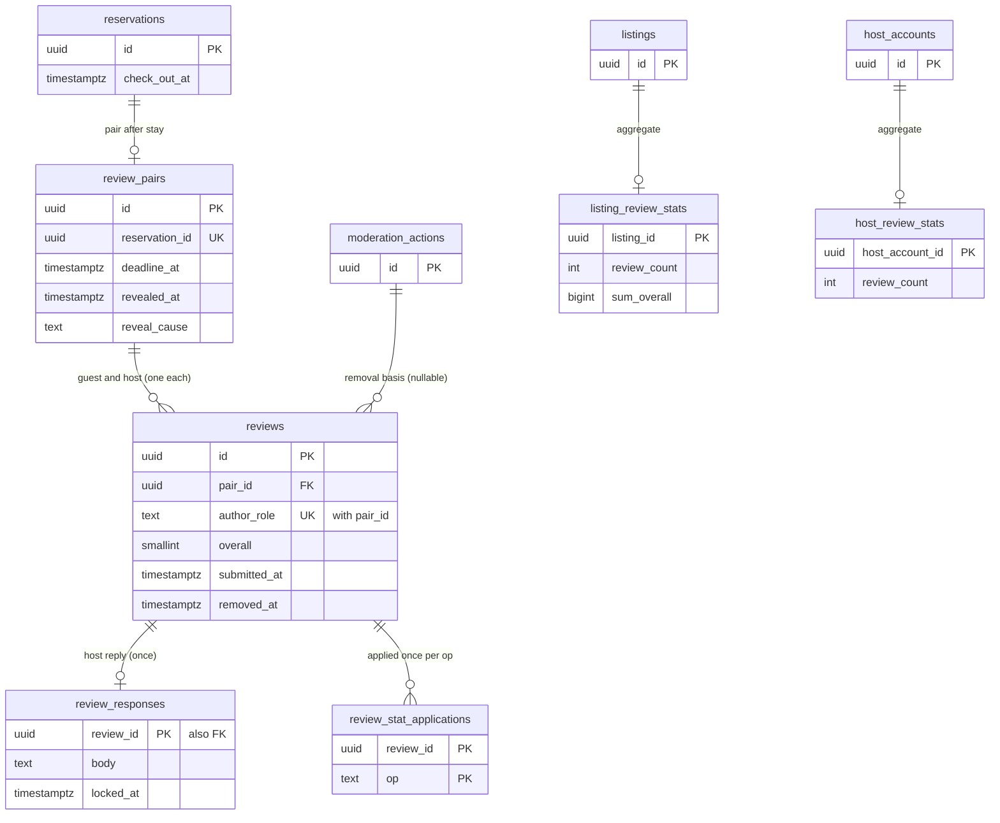

# Data model: レビュー

レビューの組、レビュー、ホストの返答、公開のビュー、集計と冪等の記録。振る舞いは [reviews.md](../reviews.md)、方針は [ADR-0055](../../decisions/0055-review-pairs-and-simultaneous-reveal.md)・[ADR-0056](../../decisions/0056-review-aggregation-and-removal.md)。規約は [data-model.md](../data-model.md) の 3 節。

- `review_pairs`・`reviews`・`review_responses`・ビュー `reviews_public` は content にあり、`reviews` のサービスが書く。集計（`listing_review_stats`・`host_review_stats`・`review_stat_applications`）は core にあり、`reviews` の事象の消費者が書く。
- 公開は `reveal_pair(pair, cause)` の 1 つの関数だけが書く。提出の経路と期限の経路の両方がこれを呼ぶ。片方だけを公開する経路はない。
- 削除は `removeReview(review_id, action_id)` だけ。`moderation_actions` に根拠を書いた後に行い、行は残す。

## 1. ER 図



- `reservations ||--o| review_pairs`：`completed` と、1 泊以上泊まった滞在中のキャンセル（T&S が抑制したものを除く）だけ。`reservation_id` の一意で事象の重複でも 1 行。
- `review_pairs ||--o{ reviews`：0〜2 行（`(pair_id, author_role)` の一意）。
- `listings ||--o| listing_review_stats`：最初の公開のレビューで行を作る。行のないリスティングは 0 件と出す。

## 2. 表

### 2.1 `review_pairs`（content）

予約ごとのレビューの組。定義元：[reviews.md](../reviews.md) の 4.1〜4.3 節。

| 列 | 型 | NULL | 既定 | 説明 |
| --- | --- | --- | --- | --- |
| `id` | `uuid` | NOT NULL | `uuidv7()` | |
| `reservation_id` | `uuid` | NOT NULL | — | |
| `listing_id` | `uuid` | NOT NULL | — | |
| `guest_id` | `uuid` | NOT NULL | — | |
| `host_account_id` | `uuid` | NOT NULL | — | |
| `window_start_at` | `timestamptz` | NOT NULL | — | `check_out_at` かキャンセルの瞬間 |
| `deadline_at` | `timestamptz` | NOT NULL | — | 現地の日付で 14 日を足した瞬間（`addLocalDays`） |
| `tzdata_version` | `text` | NOT NULL | — | |
| `revealed_at` | `timestamptz` | NULL | — | 1 回だけ書かれる |
| `reveal_cause` | `text` | NULL | — | `both_submitted`・`deadline` |
| `closed_at` | `timestamptz` | NULL | — | だれも出さずに期限（`closed_empty`） |
| `suppressed` | `boolean` | NOT NULL | `false` | T&S の抑制（安全の事故。組を作った後に付いたとき） |

- キー：PK `(id)`。UK `(reservation_id)`。
- 索引：`(deadline_at) WHERE revealed_at IS NULL AND closed_at IS NULL` — `deadline-runner`（1 分ごと、100 件ずつ、`SKIP LOCKED`）。`(listing_id, revealed_at)`。
- CHECK：`(revealed_at IS NULL) = (reveal_cause IS NULL)`、`reveal_cause IN (...)`、`NOT (revealed_at IS NOT NULL AND closed_at IS NOT NULL)`、`deadline_at > window_start_at`。
- RLS：予約の 2 者（ゲスト本人、ホストのアカウントの `owner`・`full`）。区分：P。保持：10 年。S1 の量：1 日 5,500 行。

### 2.2 `reviews`（content）

レビュー（組の中で書き手の役割ごとに 1 つ）。公開の前は書いた本人だけが読める。定義元：同 4.2〜4.4 節。

| 列 | 型 | NULL | 既定 | 説明 |
| --- | --- | --- | --- | --- |
| `id` | `uuid` | NOT NULL | `uuidv7()` | |
| `pair_id` | `uuid` | NOT NULL | — | |
| `author_role` | `text` | NOT NULL | — | `guest`・`host` |
| `author_id` | `uuid` | NOT NULL | — | ゲストの利用者か、ホストの成員 |
| `subject_listing_id` | `uuid` | NULL | — | ゲストのレビューの対象（集計） |
| `subject_host_account_id` | `uuid` | NOT NULL | — | |
| `subject_guest_id` | `uuid` | NULL | — | ホストのレビューの対象 |
| `overall` | `smallint` | NOT NULL | — | 1〜5 |
| `category_scores` | `jsonb` | NOT NULL | — | 項目の点（ゲスト：清潔さ・正確さ・チェックイン・連絡・立地・価値。ホスト：清潔さの扱い・ハウスルールの順守・連絡） |
| `body` | `text` | NULL | — | 公開の本文（1,000 文字。住所・連絡先の形は伏せ字） |
| `private_note` | `text` | NULL | — | 相手への私的な言葉（相手にだけ、公開の後に見せる） |
| `system_feedback` | `jsonb` | NULL | — | 本システムだけへの意見（「また泊めたいか」） |
| `masked` | `boolean` | NOT NULL | `false` | 伏せ字にした |
| `submitted_at` | `timestamptz` | NULL | — | |
| `edit_count` | `smallint` | NOT NULL | `0` | |
| `removed_at` | `timestamptz` | NULL | — | |
| `removal_action_id` | `uuid` | NULL | — | `moderation_actions` |
| `removal_basis_code` | `text` | NULL | — | 削除の基準のコード（[reviews.md](../reviews.md) の 7 節） |

- キー：PK `(id)`。UK `(pair_id, author_role)`。FK `pair_id → review_pairs`、`removal_action_id → moderation_actions`。
- 索引：`(subject_listing_id) WHERE removed_at IS NULL`、`(subject_guest_id)`。
- CHECK：`author_role IN (...)`、`overall BETWEEN 1 AND 5`、`char_length(body) <= 1000`、`(removed_at IS NULL) = (removal_action_id IS NULL)`、`(author_role = 'guest') = (subject_listing_id IS NOT NULL)`。
- トリガー：組の `revealed_at` があるレビューの `overall`・`category_scores`・`body`・`private_note` の更新を拒む（`removeReview` の列だけを許す）。
- RLS：FORCE RLS で書いた本人だけ（ゲスト本人、ホストのアカウントの成員）。他の人（相手を含む）は `reviews_public` だけ。区分：P（公開の後の公開の列は U）。
- 保持：10 年。削除した行は残す（監査と異議）。S1 の量：1 日 8,000 行。

### 2.3 `reviews_public`（content のビュー）

公開の読み出し。検索の索引・プロフィール・API・通知はここから読む。

```sql
CREATE VIEW reviews_public WITH (security_barrier) AS
SELECT r.id, r.pair_id, r.author_role, r.subject_listing_id, r.subject_host_account_id,
       r.subject_guest_id, r.overall, r.category_scores, r.body, p.revealed_at
  FROM reviews r JOIN review_pairs p ON p.id = r.pair_id
 WHERE p.revealed_at IS NOT NULL AND r.removed_at IS NULL AND r.submitted_at IS NOT NULL;
```

- `private_note`・`system_feedback`・書き手の利用者の ID を出さない。相手への `private_note` は別の関数で、公開の後に相手にだけ返す。

### 2.4 `review_responses`（content）

ホストの返答（公開から 30 日の間に 1 回。24 時間だけ直せる）。定義元：同 4.5 節。

| 列 | 型 | NULL | 既定 | 説明 |
| --- | --- | --- | --- | --- |
| `review_id` | `uuid` | NOT NULL | — | ゲストのレビュー |
| `host_account_id` | `uuid` | NOT NULL | — | |
| `author_id` | `uuid` | NOT NULL | — | |
| `body` | `text` | NOT NULL | — | 1,000 文字（伏せ字と辞書の検査の後） |
| `created_at` | `timestamptz` | NOT NULL | `now()` | |
| `locked_at` | `timestamptz` | NOT NULL | — | `created_at + 24h` |
| `removed_at` | `timestamptz` | NULL | — | |

- キー：PK `(review_id)`。FK → `reviews`。CHECK：`char_length(body) <= 1000`、`locked_at = created_at + interval '24 hours'`。
- RLS：書き込みはホストのアカウント。読み出しは公開（`reviews_public` と組で）。区分：U。

### 2.5 `listing_review_stats`（core）

リスティングのレビューの集計。定義元：同 5 節。

| 列 | 型 | NULL | 既定 | 説明 |
| --- | --- | --- | --- | --- |
| `listing_id` | `uuid` | NOT NULL | — | |
| `review_count` | `integer` | NOT NULL | `0` | 公開して削除していない件数 |
| `sum_overall` | `bigint` | NOT NULL | `0` | |
| `category_sums` | `jsonb` | NOT NULL | `'{}'` | 項目ごとの和と件数 |
| `updated_at` | `timestamptz` | NOT NULL | `now()` | |

- キー：PK `(listing_id)`。CHECK：`review_count >= 0`、`sum_overall BETWEEN review_count AND review_count * 5`。
- RLS：公開（数の列）。書き込みは `reviews` の消費者。区分：U。日次に content から数え直して照合する。

### 2.6 `host_review_stats`（core）

ホストのアカウントの全リスティングのゲストのレビューの集計。

| 列 | 型 | NULL | 既定 | 説明 |
| --- | --- | --- | --- | --- |
| `host_account_id` | `uuid` | NOT NULL | — | |
| `review_count` | `integer` | NOT NULL | `0` | |
| `sum_overall` | `bigint` | NOT NULL | `0` | |
| `updated_at` | `timestamptz` | NOT NULL | `now()` | |

- キー：PK `(host_account_id)`。CHECK は 2.5 節と同じ。RLS：公開。区分：U。

### 2.7 `review_stat_applications`（core）

集計への足し引きの冪等の記録（事象の重複で 2 回足さない）。

| 列 | 型 | NULL | 既定 | 説明 |
| --- | --- | --- | --- | --- |
| `review_id` | `uuid` | NOT NULL | — | |
| `op` | `text` | NOT NULL | — | `add`（`review.revealed`）・`remove`（`review.removed`） |
| `listing_id` | `uuid` | NULL | — | |
| `host_account_id` | `uuid` | NOT NULL | — | |
| `applied_at` | `timestamptz` | NOT NULL | `now()` | |

- キー：PK `(review_id, op)`。CHECK：`op IN ('add','remove')`。
- RLS：サービス（`reviews` の消費者）。区分：M。保持：10 年。
