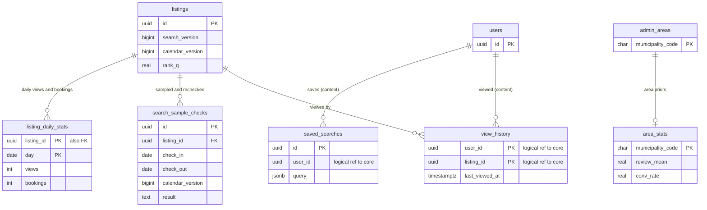

# Data model: 検索と空室の写し

順位の材料、区域の事前の値、検索の混入の抜き取りの結果、保存した検索、閲覧の履歴。Aurora の外の形（OpenSearch の `listings_v<n>` と `stay_ranges`、Valkey の `avail:` と `prc:`、データレイクの `search_samples`・`rank_logs`）は [stores.md](stores.md) の 1・2・4・10 節。振る舞いは [search-and-ranking.md](../search-and-ranking.md)、方針は [ADR-0003](../../decisions/0003-search-for-date-range-availability.md)・[ADR-0024](../../decisions/0024-listing-index-layout-and-stay-ranges.md)・[ADR-0025](../../decisions/0025-availability-snapshot-layout.md)・[ADR-0026](../../decisions/0026-ranking-formula-v1.md)・[ADR-0027](../../decisions/0027-flexible-date-search.md)。規約は [data-model.md](../data-model.md) の 3 節。

- 検索の索引と空室の写しは候補を絞るだけで、正本にしない。予約の判定は `stay_claims` の排他の制約と `checkStayRules`（[availability-and-calendars.md](availability-and-calendars.md)）。
- 索引と写しは、`listings.search_version`・`listings.calendar_version`・`pricing_rules.pricing_version` を外部のバージョンにして、古い書き込みを捨てる。
- `listing_daily_stats`・`area_stats`・`search_sample_checks` は core、`saved_searches`・`view_history` は content にある。

## 1. ER 図

- content の表から core の `users`・`listings` へは論理の参照（外部キーなし）。閲覧の履歴の表示は `listingVisible()` を通す。

## 2. 順位の材料の流れ

| 材料 | 置き場所 | 作り方 | 使う所 |
| --- | --- | --- | --- |
| `Q`（レビュー） | `listing_review_stats`（[reviews.md](reviews.md)）→ `listings.rank_q` | ベイズの平均（`area_stats.review_mean` を事前の値に） | `rank_static`・`rank_v1` |
| `C`（転換） | `listing_daily_stats` → `listings.rank_c` | 直近 90 日の `bookings / views` と `area_stats.conv_rate` | 同上 |
| `H`（ホストの信頼） | `host_profiles` の応答の率、ホストのキャンセルの率 → `listings.rank_h` | 日次 | 同上 |
| `D`・`M` | `listings.rank_d`・`rank_m` | 内容の充実（写真の数と質）、措置の倍率 | 同上 |
| 文書の `rank_static` | OpenSearch | `search-indexer` が `rank_*` から計算 | ステージ 1 の粗い順位 |

- `listings.rank_*` は日次のジョブが書き、`search_version` を上げる（[listings-content-and-photos.md](listings-content-and-photos.md) の 3.1 節）。

## 3. 表

### 3.1 `listing_daily_stats`

リスティングの日ごとの閲覧と予約の数。データレイクから日次に集める。定義元：[search-and-ranking.md](../search-and-ranking.md) の 7.1 節。

| 列 | 型 | NULL | 既定 | 説明 |
| --- | --- | --- | --- | --- |
| `listing_id` | `uuid` | NOT NULL | — | |
| `day` | `date` | NOT NULL | — | 日本時間の暦の日（領域の文書の `date`。D-8） |
| `views` | `integer` | NOT NULL | `0` | 詳細の画面の閲覧（見張りの利用者を除く） |
| `bookings` | `integer` | NOT NULL | `0` | 確定した予約 |

- キー：PK `(listing_id, day)`。
- RLS：サービス（`search-indexer` の日次のジョブ）。ホストの画面の集計は関数を通す。区分：M。
- 分割：`day` の月。400 日で区切りを落とす。
- S1 の量：1 日 10 万行、400 日で 4,000 万行。

### 3.2 `area_stats`

区域の事前の値。定義元：同 7.1 節。

| 列 | 型 | NULL | 既定 | 説明 |
| --- | --- | --- | --- | --- |
| `municipality_code` | `char(6)` | NOT NULL | — | |
| `review_mean` | `real` | NOT NULL | — | 区域のレビューの総合の点の平均（なければ全体） |
| `conv_rate` | `real` | NOT NULL | — | 区域の転換の率 |
| `price_median` | `bigint` | NULL | — | 1 泊の料金の中央値（円。T&S の R-LST-040 と R-PTY の材料） |
| `listing_count` | `integer` | NOT NULL | `0` | |
| `updated_at` | `timestamptz` | NOT NULL | `now()` | |

- キー：PK `(municipality_code)`。
- RLS：サービス（`search-indexer`、`trust-safety`）。区分：M。S1 の量：約 1,900 行。

### 3.3 `search_sample_checks`

検索の混入の抜き取りの再判定の結果（領域の文書の core の `search_samples`。D-11）。抜き取りの入力はデータレイクの `search_samples`。定義元：[observability.md](../observability.md) の 3 節、[search-and-ranking.md](../search-and-ranking.md) の 8 節。

| 列 | 型 | NULL | 既定 | 説明 |
| --- | --- | --- | --- | --- |
| `id` | `uuid` | NOT NULL | `uuidv7()` | |
| `sampled_at` | `timestamptz` | NOT NULL | — | 検索の応答の時刻（この時刻の状態で再判定する） |
| `listing_id` | `uuid` | NOT NULL | — | |
| `check_in`・`check_out` | `date` | NOT NULL | — | |
| `guests` | `smallint` | NOT NULL | — | 大人と子どもの和 |
| `calendar_version` | `bigint` | NOT NULL | — | 応答に使った写しのバージョン |
| `result` | `text` | NOT NULL | — | `ok`・`unbookable`・`price_out_of_range` |
| `reason_code` | `text` | NULL | — | `checkStayRules` の理由か `overlap` |
| `checked_at` | `timestamptz` | NOT NULL | `now()` | |

- キー：PK `(id, sampled_at)`。索引：`(sampled_at, result)` — 混入の率の集計。
- CHECK：`result IN (...)`、`check_out > check_in`。
- 検索の語・閲覧者の ID を持たない。
- RLS：サービス（`search-sampler`、`observability`）。区分：M。
- 分割：`sampled_at` の日。30 日で区切りを落とす。
- S1 の量：1 日 30 万行（夕方の山で 1 時間に約 1 万件。初期見積もり）。

### 3.4 `saved_searches`（content）

保存した検索。この工程で足した最小の形（[security.md](../security.md) の 4・7 節の「保存した検索」。D-17）。

| 列 | 型 | NULL | 既定 | 説明 |
| --- | --- | --- | --- | --- |
| `id` | `uuid` | NOT NULL | `uuidv7()` | |
| `user_id` | `uuid` | NOT NULL | — | |
| `name` | `text` | NULL | — | 本人が付ける名前（50 文字） |
| `query` | `jsonb` | NOT NULL | — | 地理（`bbox`・`place`・`point_radius`）、日付か日付を決めない指定、人数、価格、条件。形は開発リポジトリの Zod |
| `created_at` | `timestamptz` | NOT NULL | `now()` | |
| `last_used_at` | `timestamptz` | NOT NULL | `now()` | |

- キー：PK `(id)`。索引：`(user_id, last_used_at)`。1 人 50 件まで（関数で数える）。
- RLS：本人。区分：O（検索の語と地図の範囲をログに出さない）。
- 保持：最後の利用から 90 日（`retention-sweeper`）。退会で消す。S1 の量：100 万行。

### 3.5 `view_history`（content）

閲覧の履歴。この工程で足した最小の形（同上。D-17）。

| 列 | 型 | NULL | 既定 | 説明 |
| --- | --- | --- | --- | --- |
| `user_id` | `uuid` | NOT NULL | — | |
| `listing_id` | `uuid` | NOT NULL | — | |
| `last_viewed_at` | `timestamptz` | NOT NULL | `now()` | 同じリスティングの閲覧は上書き |
| `view_count` | `integer` | NOT NULL | `1` | |

- キー：PK `(user_id, listing_id)`。索引：`(user_id, last_viewed_at DESC)`、`(last_viewed_at)` — 90 日の削除。
- RLS：本人。区分：O。
- 保持：90 日・1 人 200 件（`retention-sweeper` の日次の削除。分割しない）。S1 の量：2,000 万行。
