# Data model: 鍵、監査、運用者のアクセス、データの寿命

主体の鍵、vault の読み出しの記録、監査の事象と鎖の頭、保全の印、運用者の JIT の権限と見せた記録、法令の照会と書き出し、保持と消し方の一覧。振る舞いは [security.md](../security.md)、方針は [ADR-0073](../../decisions/0073-key-layout-and-vault-envelope-encryption.md)・[ADR-0074](../../decisions/0074-operator-access-reveal-and-audit-chain.md)・[ADR-0075](../../decisions/0075-data-classes-and-retention.md)。封筒の暗号化と列の暗号の形は [data-model.md](../data-model.md) の 3.8 節。

- `subject_keys` は vault（`location`・`registry`・`kyc`・`bank`・`business_address`）と core（`contact`）の両方にある。
- `audit_events`・`audit_chain_heads`・`legal_holds` は core・ledger・content・vault の 4 つのクラスタに同じ形で置く（vault の読み出しの記録は `vault_access_log`）。
- `ops_grants`・`ops_reveals`・`legal_requests`・`legal_exports` は core にあり、`ops-api` だけが書く。
- vault のクラスタと vault の用途の鍵は break-glass にも含めない。

## 1. ER 図

```mermaid
erDiagram
    subject_keys ||--o{ exact_locations : "wraps (location, listing)"
    subject_keys ||--o{ guest_registry_entries : "wraps (registry, property-year)"
    subject_keys ||--o{ identity_verifications : "wraps (kyc, user)"
    subject_keys ||--o{ payout_accounts : "wraps (bank, host account)"
    subject_keys ||--o{ host_business_details : "wraps (business_address)"
    subject_keys ||--o{ users : "wraps contact columns (core)"
    subject_keys ||--o{ vault_access_log : "reads under"
    ops_grants ||--o{ ops_reveals : "reveals under"
    ops_grants ||--o{ audit_events : "audited"
    legal_requests ||--o{ legal_exports : "exports"
    legal_requests ||--o{ legal_holds : "holds"
    audit_chain_heads ||--o{ audit_events : "chains stream"

    subject_keys {
        text purpose PK
        text subject_type PK
        text subject_id PK
        int key_version PK
        bytea wrapped_key
        timestamptz destroyed_at
    }
    exact_locations {
        uuid listing_id PK
    }
    guest_registry_entries {
        uuid id PK
    }
    identity_verifications {
        uuid id PK
    }
    payout_accounts {
        uuid id PK
    }
    host_business_details {
        uuid host_account_id PK
    }
    users {
        uuid id PK
        bytea email_ct
    }
    vault_access_log {
        uuid id PK
        text target_type
        uuid target_id
        text purpose_code
    }
    ops_grants {
        uuid id PK
        uuid operator_id
        text grant_kind
        timestamptz expires_at
    }
    ops_reveals {
        uuid id PK
        uuid grant_id FK
        text reveal_kind
    }
    legal_requests {
        uuid id PK
        text request_kind
        text status
    }
    legal_exports {
        uuid id PK
        uuid request_id FK
        text s3_key
    }
    legal_holds {
        uuid id PK
        text target_type
        uuid target_id
    }
    audit_events {
        uuid id PK
        text stream
        text action
    }
    audit_chain_heads {
        text stream PK
        bytea head_hash
    }
```

- `subject_keys ||--o{ …`：外部キーではなく、行の `key_version` と主体（`subject_type`・`subject_id`）で引く。名簿の主体は `property_id:fiscal_year` の文字列。
- `vault_access_log }o--|| subject_keys`：読み出しは同じクラスタの行で、監査の事象と同じトランザクションで書く。

## 2. 表

### 2.1 `subject_keys`（vault と core）

主体の鍵（用途ごと・主体ごとの 256 ビット）を、用途の KMS の鍵で包んで置く。定義元：[security.md](../security.md) の 5.3 節。

| 列 | 型 | NULL | 既定 | 説明 |
| --- | --- | --- | --- | --- |
| `purpose` | `text` | NOT NULL | — | vault：`location`・`registry`・`kyc`・`bank`・`business_address`。core：`contact` |
| `subject_type` | `text` | NOT NULL | — | `listing`・`location_group`・`property_year`・`user`・`host_account` |
| `subject_id` | `text` | NOT NULL | — | UUID か `<property_id>:<fiscal_year>` |
| `key_version` | `integer` | NOT NULL | — | 交換のたびに 1 上げる |
| `wrapped_key` | `bytea` | NULL | — | 包んだ鍵。破棄で NULL |
| `kms_key_arn` | `text` | NOT NULL | — | `kms-vault-location`・`kms-vault-registry`・`kms-vault-kyc`・`kms-vault-bank`・`kms-contact-pii`（複数のリージョンの鍵） |
| `created_at` | `timestamptz` | NOT NULL | `now()` | |
| `destroyed_at` | `timestamptz` | NULL | — | 消去（暗号の消去） |

- キー：PK `(purpose, subject_type, subject_id, key_version)`。索引：`(purpose, destroyed_at) WHERE destroyed_at IS NULL`。
- CHECK：`(wrapped_key IS NULL) = (destroyed_at IS NOT NULL)`、vault の行は `purpose <> 'contact'`、core の行は `purpose = 'contact'`。
- 平文の鍵は持ち主のタスクのメモリーに 5 分・1 万件だけ。
- RLS：持ち主のサービスの役割ごとの許可（`purpose` で分ける。`listings` は `location`、`compliance-jp` は `registry`、`identity` は `kyc`・`business_address`・`contact`、`payouts` は `bank`、`notifier` は `contact` の読み出し）。区分：S。
- 保持：破棄した行は `destroyed_at` を残して 10 年。Aurora の自動のバックアップ（35 日）の後に完全に読めなくなる。
- S1 の量：vault 50 万行、core 300 万行。

### 2.2 `vault_access_log`（vault）

vault の読み出しの全件の記録（利用者の経路を含む）。定義元：同 3.4・6.4 節。

| 列 | 型 | NULL | 既定 | 説明 |
| --- | --- | --- | --- | --- |
| `id` | `uuid` | NOT NULL | `uuidv7()` | 分割の鍵 |
| `actor_type` | `text` | NOT NULL | — | `user`・`host_member`・`operator`・`service` |
| `actor_id` | `uuid` | NULL | — | |
| `service` | `text` | NOT NULL | — | 読んだサービス |
| `function_name` | `text` | NOT NULL | — | `readExactLocation`・`openRegistryEntry`・`revealPassportImage`・`readPayoutAccount`・`viewKyc` など |
| `purpose_code` | `text` | NOT NULL | — | 目的のコード（[security.md](../security.md) の 3.4 節） |
| `target_type` | `text` | NOT NULL | — | 表の名前 |
| `target_id` | `uuid` | NOT NULL | — | 行の ID |
| `reservation_id` | `uuid` | NULL | — | 予約の 2 者の経路 |
| `case_id` | `uuid` | NULL | — | 運用者の経路 |
| `ops_grant_id` | `uuid` | NULL | — | |
| `created_at` | `timestamptz` | NOT NULL | `now()` | |

- キー：PK `(id)`。索引：`(target_type, target_id, created_at)`。
- CHECK：`actor_type <> 'operator' OR (ops_grant_id IS NOT NULL AND case_id IS NOT NULL)`。
- 分割：`id` の月。13 か月を DB に置き、`relay` が鎖を付けて log-archive の S3（Object Lock）に 5 分ごとに写す（7 年）。
- RLS：サービス（持ち主のサービスの書き込み、`relay` と監査の照合の読み出し）。区分：A。S1 の量：1 日 20 万行（予約の画面の住所・入り方の表示）。

### 2.3 `audit_events`（各クラスタ）

運用の操作、見せる操作、権限の発行、措置、`legal.*` の変更、手の仕訳、break-glass、PMS のアプリの承認と停止の監査。操作と同じトランザクションで書く。定義元：同 6.4 節。

| 列 | 型 | NULL | 既定 | 説明 |
| --- | --- | --- | --- | --- |
| `id` | `uuid` | NOT NULL | `uuidv7()` | 分割の鍵 |
| `stream` | `text` | NOT NULL | — | 流れ（クラスタ × 種類。例 `core.ops`・`ledger.manual`） |
| `actor_type` | `text` | NOT NULL | — | `operator`・`service`・`host_member`・`user` |
| `actor_id` | `uuid` | NULL | — | |
| `action` | `text` | NOT NULL | — | `reservation.cancel_ops`・`grant.issue`・`legal_config.apply` など |
| `target_type` | `text` | NOT NULL | — | |
| `target_id` | `text` | NOT NULL | — | |
| `case_id` | `uuid` | NULL | — | |
| `grant_id` | `uuid` | NULL | — | `ops_grants` |
| `reason_code` | `text` | NULL | — | |
| `reason_ct` | `bytea` | NULL | — | 運用者の短い自由文（列の暗号。`kms-audit` で包んだクラスタの鍵） |
| `created_at` | `timestamptz` | NOT NULL | `now()` | |

- キー：PK `(id)`。索引：`(stream, id)` — `relay` の鎖の書き出し。`(target_type, target_id)`。
- `INSERT` だけを許す（権限とトリガー）。
- 分割：`id` の月。13 か月を DB に置き、S3（Object Lock、7 年）に写した区切りを `DROP`。
- RLS：サービス（書き込みは各サービス、読み出しは監査の役割）。区分：A。

### 2.4 `audit_chain_heads`（各クラスタ）

流れごとの鎖の頭（`prev_hash`）。

| 列 | 型 | NULL | 既定 | 説明 |
| --- | --- | --- | --- | --- |
| `stream` | `text` | NOT NULL | — | |
| `last_event_id` | `uuid` | NOT NULL | — | S3 に写した最後の事象 |
| `head_hash` | `bytea` | NOT NULL | — | SHA-256 の鎖の頭 |
| `last_batch_s3_key` | `text` | NOT NULL | — | `audit/<stream>/<yyyy>/<mm>/<dd>/…` |
| `updated_at` | `timestamptz` | NOT NULL | `now()` | |

- キー：PK `(stream)`。RLS：サービス（`relay`、監査の照合）。区分：A。日次の照合が鎖の続きと件数を確かめる。

### 2.5 `legal_holds`（各クラスタ）

保全の印。印の間は `retention-sweeper` が消さない。定義元：同 7.2 節。

| 列 | 型 | NULL | 既定 | 説明 |
| --- | --- | --- | --- | --- |
| `id` | `uuid` | NOT NULL | `uuidv7()` | |
| `target_type` | `text` | NOT NULL | — | 表の名前 |
| `target_id` | `uuid` | NOT NULL | — | |
| `reason` | `text` | NOT NULL | — | `legal_request`・`dispute`・`damage_claim`・`safety_incident`・`moderation` |
| `case_id` | `uuid` | NULL | — | |
| `placed_by` | `uuid` | NOT NULL | — | `legal.respond` の権限 |
| `expires_at` | `timestamptz` | NULL | — | |
| `released_at` | `timestamptz` | NULL | — | |
| `created_at` | `timestamptz` | NOT NULL | `now()` | |

- キー：PK `(id)`。索引：`(target_type, target_id) WHERE released_at IS NULL`。
- RLS：サービス（`ops-api`、`retention-sweeper` の読み出し）。区分：A。保持：外してから 7 年。

### 2.6 `ops_grants`（core）

運用者の JIT の権限（案件に結び付けて 2 時間）。定義元：同 6.1 節。

| 列 | 型 | NULL | 既定 | 説明 |
| --- | --- | --- | --- | --- |
| `id` | `uuid` | NOT NULL | `uuidv7()` | |
| `operator_id` | `uuid` | NOT NULL | — | IAM Identity Center の利用者に結ぶ運用者の ID |
| `grant_kind` | `text` | NOT NULL | — | `case.view`・`case.view_messages`・`vault.reveal_location`・`vault.reveal_registry`・`vault.reveal_passport`・`vault.reveal_bank`・`kyc.view`・`ledger.adjust`・`legal.respond` |
| `case_id` | `uuid` | NOT NULL | — | |
| `reason_code` | `text` | NOT NULL | — | |
| `reason_ct` | `bytea` | NULL | — | 短い自由文（列の暗号） |
| `approver_id` | `uuid` | NULL | — | 2 人目（`vault.*`・`kyc.view`・`ledger.adjust`・`legal.respond`） |
| `post_approval_due_at` | `timestamptz` | NULL | — | 安全の事故の緊急の位置の事後の承認（30 分） |
| `issued_at` | `timestamptz` | NOT NULL | `now()` | |
| `expires_at` | `timestamptz` | NOT NULL | — | 発行 + 2 時間 |
| `revoked_at` | `timestamptz` | NULL | — | |

- キー：PK `(id)`。索引：`(operator_id, expires_at)`。
- CHECK：`grant_kind IN (...)`、`approver_id IS NULL OR approver_id <> operator_id`、`grant_kind NOT LIKE 'vault.%' OR approver_id IS NOT NULL OR post_approval_due_at IS NOT NULL`。
- RLS：サービス（`ops-api`）。区分：A。保持：7 年。

### 2.7 `ops_reveals`（core）

見せた記録（1 回 1 件、運用者ごとに 1 日 20 件、旅券は 5 件）。定義元：同 6.2 節。

| 列 | 型 | NULL | 既定 | 説明 |
| --- | --- | --- | --- | --- |
| `id` | `uuid` | NOT NULL | `uuidv7()` | |
| `grant_id` | `uuid` | NOT NULL | — | |
| `operator_id` | `uuid` | NOT NULL | — | |
| `reveal_kind` | `text` | NOT NULL | — | `location`・`registry`・`passport_image`・`bank`・`kyc` |
| `target_type`・`target_id` | `text`・`uuid` | NOT NULL | — | |
| `created_at` | `timestamptz` | NOT NULL | `now()` | |

- キー：PK `(id)`。FK `grant_id → ops_grants`。索引：`(operator_id, created_at)` — 1 日の上限。
- RLS：サービス（`ops-api`）。区分：A。保持：7 年。

### 2.8 `legal_requests`（core）

警察・自治体・観光庁の照会、開示の請求（L1・L3・L14）。定義元：同 6.2 節、[trust-and-safety.md](../trust-and-safety.md) の 12 節。

| 列 | 型 | NULL | 既定 | 説明 |
| --- | --- | --- | --- | --- |
| `id` | `uuid` | NOT NULL | `uuidv7()` | |
| `request_kind` | `text` | NOT NULL | — | `police_registry`・`municipal_inquiry`・`tourism_agency_report`・`dpcp_disclosure`・`takedown_request` |
| `authority` | `text` | NOT NULL | — | 相手の機関 |
| `targets` | `jsonb` | NOT NULL | — | 対象（届出住宅と期間、予約、リスティング） |
| `document_s3_key` | `text` | NOT NULL | — | 照会の書類（`exports` の受け取りの接頭辞） |
| `status` | `text` | NOT NULL | `'received'` | `received`・`under_review`・`approved`・`responded`・`declined` |
| `case_id` | `uuid` | NOT NULL | — | |
| `approved_by` | `uuid` | NULL | — | 法務の責任者 |
| `created_at` | `timestamptz` | NOT NULL | `now()` | |
| `closed_at` | `timestamptz` | NULL | — | |

- キー：PK `(id)`。索引：`(status, created_at)`。RLS：サービス（`ops-api` の法務の役割）。区分：A。保持：10 年。

### 2.9 `legal_exports`（core）

照会への回答の書き出し（`kms-ops-exports`、7 日の署名つきの URL）。

| 列 | 型 | NULL | 既定 | 説明 |
| --- | --- | --- | --- | --- |
| `id` | `uuid` | NOT NULL | `uuidv7()` | |
| `request_id` | `uuid` | NOT NULL | — | |
| `s3_key` | `text` | NOT NULL | — | `exports/<request_id>/<id>` |
| `row_count` | `integer` | NOT NULL | — | |
| `created_by` | `uuid` | NOT NULL | — | |
| `expires_at` | `timestamptz` | NOT NULL | — | 作成 + 7 日 |
| `created_at` | `timestamptz` | NOT NULL | `now()` | |

- キー：PK `(id)`。FK `request_id → legal_requests`。RLS：サービス。区分：A。保持：書き出しの物は 7 日、行は 10 年。

## 3. 保持と消し方の一覧

既定の値で、多くは法務の確認待ち（L8。名簿と旅券は L3、本人確認は L3・L8、会計は L4・L5）。`retention-sweeper` が日次に当て、`legal_holds` の行を飛ばす（[ADR-0075](../../decisions/0075-data-classes-and-retention.md)）。

| データ | 表 | 区分 | 保持 | 消し方 |
| --- | --- | --- | --- | --- |
| 正確な住所と位置、入り方 | `exact_locations`・`location_groups`・`arrival_instructions` | V | リスティングの削除から 1 年 | 位置の主体の鍵の破棄 |
| 名簿と旅券 | `guest_registry_entries`・`passport_capture_results`・S3 `registry` | V | 作成から 1,095 日を下限（`legal.guest_registry_retention_days`） | 年度の鍵の破棄（`legal.registry_auto_delete_enabled` の後） |
| 送金の口座 | `payout_accounts` | V | 削除・退会まで。前の口座は 1 年 | 鍵の破棄 |
| 本人確認の結果 | `identity_verifications`・`person_keys` | V | 法務の結論まで消さない | `legal.kyc_result_retention_days` の後 |
| 事業者のホストの表示の情報 | `host_business_details` | V | 閉じてから 1 年 | 鍵の破棄 |
| 連絡先の平文 | `users.email_ct`・`phone_ct` | C | 退会まで | 主体の鍵（`contact`）の破棄 |
| 連絡先の HMAC（退会の後） | `users.*_hmac` | C | 1 年（`suspended` は T&S の期間） | 列を消す |
| 予約のメッセージ | `messages`・`message_threads` | P | チェックアウト（予約のないものは最後のメッセージ）から 3 年 | 月の区切りの `DROP`（`retain_until`） |
| 予約、事象、損害の請求、精算、決済 | `reservations` ほか | P・F | 10 年 | 仮名にして残す |
| 保存した検索、閲覧の履歴 | `saved_searches`・`view_history` | O | 90 日 | 日次の削除 |
| 通知 | `notifications`・`notification_deliveries` | O | 90 日 | 日の区切りの `DROP` |
| セッション、端末 | `sessions`・`devices` | O | 失効から 1 年 | 行の削除 |
| 更新のトークン | `refresh_tokens` | S | 30 日 | 日の区切りの `DROP` |
| 公開のリスティングと写真（削除の後） | `listing_photos`・S3 `photos` | U | 削除から 90 日 | 索引から外し、写真を消す |
| 仕訳、送金、照合 | ledger の表 | F | 10 年 | 区切りを `records` へ写して `DETACH` |
| 監査、措置、vault の読み出し | `audit_events`・`moderation_actions`・`vault_access_log` | A | 7 年（DB は 13 か月） | Object Lock の期限 |
| 空室の外した行 | `stay_claims` → `stay_claims_archive` | P・O | 400 日の後に保管の写しへ、10 年 | 月の区切り |
| データレイクの仮名の事象 | レイク | L | 2 年 | パーティションの削除 |
