# Data model: T&S と本人確認

規則と束と承認、規則の評価の記録、審査の案件、措置、異議、安全の事故、代わりの宿の手配、方針への同意、禁止の一覧、本人確認のセッションと inbox、確認を求める表、本人確認の結果（vault）、同じ人の鍵（vault）、旅券の読み取りの結果（vault）。振る舞いは [trust-and-safety.md](../trust-and-safety.md)・[identity-verification.md](../identity-verification.md)、方針は [ADR-0009](../../decisions/0009-trust-and-safety-and-ml-boundary.md)・[ADR-0057](../../decisions/0057-ts-decision-points-and-outcomes.md)〜[ADR-0063](../../decisions/0063-passport-capture-for-guest-registry.md)。規約は [data-model.md](../data-model.md) の 3 節。

- T&S の表と `kyc_sessions`・`kyc_inbox` は content、`kyc_gate_versions`・`kyc_gates` は core、`identity_verifications`・`person_keys`・`passport_capture_results` は vault にある。
- T&S の表は `trust-safety`、本人確認の表は `identity` だけが書く。
- 措置は `applyModerationAction(action)` の 1 つの関数で、`moderation_actions` を書いた後に、対象の持ち主のサービスの関数（`transitionListing()`、予約の `transition()`、送金の保留）を outbox で呼ぶ（記録してから効く）。
- 信号と評価の記録は ID・点・数・区分・コードだけで、本文・住所・氏名・画像を持たない。ML の点は決定ではない。
- 本人確認の書類と顔の画像は提供者に置き、本システムは持たない。旅券の番号と画像は名簿（[regulatory-japan.md](regulatory-japan.md)）に置き、`identity` の表に残さない。

## 1. ER 図

```mermaid
erDiagram
    ts_rule_bundles ||--|{ ts_rules : "bundles versions"
    ts_rule_bundles ||--|{ ts_rule_approvals : "approved by"
    ts_rule_bundles ||--o{ rule_evaluations : "evaluated with"
    ts_cases ||--o{ rule_evaluations : "opened by (nullable)"
    ts_cases ||--o{ moderation_actions : "decided into"
    moderation_actions ||--o| appeals : "appealed (once)"
    moderation_actions ||--o| moderation_actions : "reverted by (nullable)"
    safety_incidents ||--o{ rebooking_records : "rebooked"
    safety_incidents ||--o{ moderation_actions : "protective actions (nullable)"
    ts_blocklist_entries }o--o{ rule_evaluations : "exact match facts"
    users ||--o{ policy_acknowledgements : "acknowledges"
    users ||--o{ kyc_sessions : "verifies"
    kyc_sessions ||--o{ kyc_inbox : "provider webhooks"
    kyc_sessions ||--o| identity_verifications : "results in (vault)"
    users ||--o| person_keys : "same person key (vault)"
    kyc_gate_versions ||--|{ kyc_gates : "feature conditions"
    guest_registry_entries ||--o| passport_capture_results : "passport check (vault)"

    ts_rules {
        text id PK
        int version PK
        text decision_point
        jsonb condition
        text outcome
    }
    ts_rule_bundles {
        int rules_version PK
        timestamptz activated_at
    }
    ts_rule_approvals {
        int rules_version PK "also FK"
        uuid approver_id PK
    }
    rule_evaluations {
        uuid id PK
        text decision_point
        text subject_type
        uuid subject_id
        int rules_version FK
        text outcome
    }
    ts_cases {
        uuid id PK
        text queue
        timestamptz due_at
        text state
    }
    moderation_actions {
        uuid id PK
        text subject_type
        uuid subject_id
        text kind
        jsonb basis
        uuid case_id FK
    }
    appeals {
        uuid id PK
        uuid action_id UK
        text decision
    }
    safety_incidents {
        uuid id PK
        text severity
        text state
        uuid reservation_id
    }
    rebooking_records {
        uuid id PK
        uuid incident_id FK
        bigint cost_amount
    }
    ts_blocklist_entries {
        uuid id PK
        text list_kind UK "with value_hash, live"
        text value_hash
    }
    users {
        uuid id PK
        text kyc_level
    }
    policy_acknowledgements {
        uuid user_id PK
        text policy PK
        int policy_version PK
    }
    kyc_sessions {
        uuid id PK
        uuid user_id
        text purpose
        text state
    }
    kyc_inbox {
        text provider PK
        text provider_event_id PK
        uuid session_id FK
    }
    identity_verifications {
        uuid id PK
        uuid user_id
        text level
        bytea ciphertext "name, kana, birth date"
    }
    person_keys {
        uuid user_id PK
        bytea person_key
    }
    kyc_gate_versions {
        int version PK
    }
    kyc_gates {
        int version PK "also FK"
        text feature PK
        jsonb condition
    }
    guest_registry_entries {
        uuid id PK
    }
    passport_capture_results {
        uuid registry_entry_id PK
        text method
        bool mrz_checks_ok
    }
```

- `ts_cases ||--o{ rule_evaluations`：`review`・`hold` の評価が案件を開く。通報と運用の手でも開く。
- `moderation_actions ||--o| moderation_actions`：異議の認容は元の措置を取り消す措置（`kind = 'revert'`）を書く。
- `kyc_sessions ||--o| identity_verifications`：`verified` のセッションだけが結果を書く。content と vault をまたぐので外部キーは張らない。
- `users ||--o| person_keys`：`legal.person_key_enabled` の後だけ（本番の既定 `false`。L8）。

## 2. 表（content の T&S）

### 2.1 `ts_rules`

規則（バージョンつき）。DSL の `when`・`then` を列 `condition`・`outcome` に持つ（D-8）。定義元：[trust-and-safety.md](../trust-and-safety.md) の 5 節。

| 列 | 型 | NULL | 既定 | 説明 |
| --- | --- | --- | --- | --- |
| `id` | `text` | NOT NULL | — | `R-CARD-001` など |
| `version` | `integer` | NOT NULL | — | |
| `decision_point` | `text` | NOT NULL | — | `booking.create`・`listing.publish`・`listing.material_edit`・`payout_account.change`・`login`・`account.change`・`report`・`message.signal`・`review.signal` |
| `condition` | `jsonb` | NOT NULL | — | 事実と閾値の式 |
| `outcome` | `text` | NOT NULL | — | `allow`・`step_up`・`review`・`hold`・`block` |
| `priority` | `smallint` | NOT NULL | `0` | |
| `exact_only` | `boolean` | NOT NULL | `false` | 完全な一致の事実だけでできている（`block` に要る） |
| `created_by` | `uuid` | NOT NULL | — | |
| `created_at` | `timestamptz` | NOT NULL | `now()` | |

- キー：PK `(id, version)`。CHECK：`outcome IN (...)`、`outcome <> 'block' OR exact_only`（束を作る時の検査と同じ）。行を変えない。
- RLS：サービス（`trust-safety`、T&S の担当）。区分：A。保持：消さない。

### 2.2 `ts_rule_bundles`

規則の束（`rules_version`）。7 日の影の評価と承認の後に有効にする。

| 列 | 型 | NULL | 既定 | 説明 |
| --- | --- | --- | --- | --- |
| `rules_version` | `integer` | NOT NULL | — | |
| `rule_refs` | `jsonb` | NOT NULL | — | `[{id, version}]` |
| `content_hash` | `bytea` | NOT NULL | — | |
| `created_by` | `uuid` | NOT NULL | — | |
| `shadow_started_at` | `timestamptz` | NULL | — | |
| `activated_at` | `timestamptz` | NULL | — | |
| `retired_at` | `timestamptz` | NULL | — | |

- キー：PK `(rules_version)`。部分 UK `((true)) WHERE activated_at IS NOT NULL AND retired_at IS NULL`（有効な束は 1 つ）。
- RLS：サービス。区分：A。

### 2.3 `ts_rule_approvals`

束の承認（T&S の責任者）。エージェントは草案を作るが承認しない。

| 列 | 型 | NULL | 既定 | 説明 |
| --- | --- | --- | --- | --- |
| `rules_version` | `integer` | NOT NULL | — | |
| `approver_id` | `uuid` | NOT NULL | — | |
| `role` | `text` | NOT NULL | — | `ts_lead`・`legal`（特徴の追加） |
| `eval_report_ref` | `text` | NOT NULL | — | 影の評価と評価の集まりの結果 |
| `approved_at` | `timestamptz` | NOT NULL | `now()` | |

- キー：PK `(rules_version, approver_id)`。トリガー：`approver_id <> ts_rule_bundles.created_by`。RLS：サービス。区分：A。

### 2.4 `rule_evaluations`

規則の評価の記録。`reservations.ts_decision_id`・`quotes.ts_decision_id`・`listing_revisions.rule_evaluation_id` が指す。定義元：同 5 節。

| 列 | 型 | NULL | 既定 | 説明 |
| --- | --- | --- | --- | --- |
| `id` | `uuid` | NOT NULL | `uuidv7()` | 分割の鍵 |
| `decision_point` | `text` | NOT NULL | — | |
| `subject_type` | `text` | NOT NULL | — | `quote`・`reservation`・`listing_revision`・`user`・`host_account`・`report` |
| `subject_id` | `uuid` | NOT NULL | — | |
| `rules_version` | `integer` | NOT NULL | — | |
| `matched_rule_ids` | `text[]` | NOT NULL | `'{}'` | |
| `outcome` | `text` | NOT NULL | — | |
| `facts_snapshot` | `jsonb` | NOT NULL | — | ID・点・数・区分・コードだけ（`party_score`、`fraud_score`、`home_distance_bucket` など） |
| `model_versions` | `jsonb` | NULL | — | 使ったモデルのバージョン（影の段の点を含む） |
| `fallback` | `boolean` | NOT NULL | `false` | 150ms を超えた写しの経路の判定 |
| `latency_ms` | `integer` | NOT NULL | — | |
| `created_at` | `timestamptz` | NOT NULL | `now()` | |

- キー：PK `(id)`。索引：`(subject_type, subject_id)`、`(decision_point, created_at)`。
- 分割：`id` の月。400 日で `DROP`（評価の集まりと異議の調べ。措置の根拠は `moderation_actions.basis` に写す）。
- RLS：サービス。区分：A。S1 の量：1 日 10 万行（見積もりの時の判定が多い）。

### 2.5 `ts_cases`

審査の案件。定義元：同 5.4 節。

| 列 | 型 | NULL | 既定 | 説明 |
| --- | --- | --- | --- | --- |
| `id` | `uuid` | NOT NULL | `uuidv7()` | |
| `queue` | `text` | NOT NULL | — | `booking_hold`・`safety`・`listing_integrity`・`payment_fraud`・`account_takeover`・`discrimination`・`content`・`appeals`・`legal_request` |
| `subject_type`・`subject_id` | `text`・`uuid` | NOT NULL | — | |
| `priority` | `smallint` | NOT NULL | `0` | |
| `due_at` | `timestamptz` | NOT NULL | — | 待ち行列の期限（`booking_hold` 4 時間など） |
| `assignee_id` | `uuid` | NULL | — | |
| `state` | `text` | NOT NULL | `'open'` | `open`・`in_review`・`decided`・`closed` |
| `opened_by` | `text` | NOT NULL | — | `rule`・`report`・`ops`・`signal` |
| `evidence_refs` | `jsonb` | NOT NULL | `'[]'` | `rule_evaluations` の ID、通報、証拠の参照 |
| `decision` | `text` | NULL | — | |
| `decided_at` | `timestamptz` | NULL | — | |
| `created_at` | `timestamptz` | NOT NULL | `now()` | |

- キー：PK `(id)`。索引：`(queue, state, due_at)` — 待ち行列（期限の 80% で警告）。`(subject_type, subject_id)`。
- RLS：T&S・CS の担当の役割（JIT の権限）。区分：A。保持：閉じてから 7 年。S1 の量：1 日 500 行。

### 2.6 `moderation_actions`

措置（記録してから効く）。定義元：同 5.5 節。

| 列 | 型 | NULL | 既定 | 説明 |
| --- | --- | --- | --- | --- |
| `id` | `uuid` | NOT NULL | `uuidv7()` | |
| `subject_type`・`subject_id` | `text`・`uuid` | NOT NULL | — | 予約、リスティング、アカウント、ホストのアカウント、レビュー |
| `kind` | `text` | NOT NULL | — | `require_verification`・`route_to_request`・`payout_hold`・`listing_suspend`・`reservation_cancel_ops`・`review_remove`・`account_restrict`・`account_suspend`・`revert` |
| `basis` | `jsonb` | NOT NULL | — | 規則のバージョン、点、審査の判定、基準のコード |
| `automated` | `boolean` | NOT NULL | — | 規則だけで効かせた（`require_verification`・`route_to_request`・`payout_hold`、決定的な一致の `block`） |
| `case_id` | `uuid` | NULL | — | |
| `reviewer_id` | `uuid` | NULL | — | |
| `reverts_action_id` | `uuid` | NULL | — | `revert` のとき元の措置 |
| `expires_at` | `timestamptz` | NULL | — | |
| `applied_at` | `timestamptz` | NULL | — | 持ち主のサービスが適用した時刻（冪等） |
| `created_at` | `timestamptz` | NOT NULL | `now()` | |

- キー：PK `(id)`。FK `case_id → ts_cases`、`reverts_action_id → moderation_actions`。索引：`(subject_type, subject_id)`、`(applied_at) WHERE applied_at IS NULL` — 適用の照合。
- CHECK：`kind IN (...)`、`automated OR reviewer_id IS NOT NULL`、`NOT automated OR kind IN ('require_verification','route_to_request','payout_hold','listing_suspend')`、`kind <> 'listing_suspend' OR NOT automated OR (basis->>'exact_match')::boolean`、`(kind = 'revert') = (reverts_action_id IS NOT NULL)`。
- RLS：本人は自分が対象の措置の種類と理由の種類を読める（関数）。他は T&S の役割。区分：A。保持：7 年。

### 2.7 `appeals`

異議（元の判定と別の審査員が 72 時間以内に判定）。

| 列 | 型 | NULL | 既定 | 説明 |
| --- | --- | --- | --- | --- |
| `id` | `uuid` | NOT NULL | `uuidv7()` | |
| `action_id` | `uuid` | NOT NULL | — | |
| `appellant_id` | `uuid` | NOT NULL | — | |
| `body` | `text` | NOT NULL | — | |
| `reviewer_id` | `uuid` | NULL | — | |
| `decision` | `text` | NULL | — | `upheld`・`reverted` |
| `due_at` | `timestamptz` | NOT NULL | — | 作成 + 72 時間 |
| `decided_at` | `timestamptz` | NULL | — | |
| `created_at` | `timestamptz` | NOT NULL | `now()` | |

- キー：PK `(id)`。UK `(action_id)`。トリガー：`reviewer_id <> moderation_actions.reviewer_id`。RLS：本人（読み出し）と T&S。区分：A。保持：7 年。

### 2.8 `safety_incidents`

安全の事故の案件。安全の担当の役割だけの RLS。定義元：同 10 節、[ADR-0060](../../decisions/0060-safety-incidents-and-24x7-line.md)。

| 列 | 型 | NULL | 既定 | 説明 |
| --- | --- | --- | --- | --- |
| `id` | `uuid` | NOT NULL | `uuidv7()` | |
| `severity` | `text` | NOT NULL | — | `S1`・`S2`・`S3` |
| `kind` | `text` | NOT NULL | — | `emergency`・`hidden_camera`・`cannot_enter`・`listing_missing`・`discriminatory_refusal`・`noise`・`party`・`other` |
| `state` | `text` | NOT NULL | `'open'` | `open`・`acknowledged`・`mitigating`・`monitoring`・`resolved`・`closed` |
| `reservation_id` | `uuid` | NULL | — | |
| `listing_id` | `uuid` | NULL | — | |
| `reporter_id` | `uuid` | NULL | — | 近隣の住民は NULL |
| `reporter_role` | `text` | NOT NULL | — | `guest`・`host_member`・`neighbor`・`operator` |
| `channel` | `text` | NOT NULL | — | `app_button`・`phone`・`report`・`neighbor_form` |
| `assignee_id` | `uuid` | NULL | — | |
| `ack_due_at` | `timestamptz` | NOT NULL | — | S1 は 2 分 |
| `mitigation_due_at` | `timestamptz` | NULL | — | S1 は 30 分 |
| `acknowledged_at`・`mitigation_started_at`・`resolved_at`・`closed_at` | `timestamptz` | NULL | — | |
| `notes` | `text` | NULL | — | 案件の記録（ログに出さない） |
| `created_at` | `timestamptz` | NOT NULL | `now()` | |

- キー：PK `(id)`。索引：`(state, severity, ack_due_at) WHERE state IN ('open','acknowledged','mitigating')`、`(reservation_id)`。
- CHECK：`severity IN (...)`、`state IN (...)`、`state = 'open' OR acknowledged_at IS NOT NULL`、`state <> 'closed' OR closed_at IS NOT NULL`。
- RLS：安全の担当の役割だけ（JIT の権限。読み出しは監査）。区分：P・A。保持：閉じてから 7 年（`legal_holds`）。S1 の量：1 日 50 行。

### 2.9 `rebooking_records`

代わりの宿の手配の記録。補償の仕訳（型 26）の根拠。

| 列 | 型 | NULL | 既定 | 説明 |
| --- | --- | --- | --- | --- |
| `id` | `uuid` | NOT NULL | `uuidv7()` | |
| `incident_id` | `uuid` | NULL | — | 安全の事故（ホストのキャンセルの支援は NULL） |
| `reservation_id` | `uuid` | NOT NULL | — | |
| `arranged_listing_id` | `uuid` | NULL | — | 本システムの別のリスティング |
| `arranged_note` | `text` | NULL | — | 外の宿の名前（ゲストの個人のデータを書かない） |
| `cost_amount` | `bigint` | NOT NULL | — | |
| `currency` | `char(3)` | NOT NULL | — | |
| `borne_by` | `text` | NOT NULL | — | `platform`・`host` |
| `case_id` | `uuid` | NOT NULL | — | 補償の仕訳の `source_id` |
| `created_by` | `uuid` | NOT NULL | — | |
| `created_at` | `timestamptz` | NOT NULL | `now()` | |

- キー：PK `(id)`。FK `incident_id → safety_incidents`。CHECK：`cost_amount >= 0`、`borne_by IN (...)`。RLS：安全・CS の役割。区分：F・P。保持：10 年。

### 2.10 `policy_acknowledgements`

差別の禁止などの方針への同意（バージョンつき）。定義元：同 11 節。

| 列 | 型 | NULL | 既定 | 説明 |
| --- | --- | --- | --- | --- |
| `user_id` | `uuid` | NOT NULL | — | |
| `policy` | `text` | NOT NULL | — | `non_discrimination` |
| `policy_version` | `integer` | NOT NULL | — | |
| `acknowledged_at` | `timestamptz` | NOT NULL | `now()` | |

- キー：PK `(user_id, policy, policy_version)`。RLS：本人（読み出し）。サービス：`identity`、`booking`・`listings`（次の予約・公開の前の確かめ）。区分：O。保持：退会から 10 年（L11）。

### 2.11 `ts_blocklist_entries`

同期の検査の完全な一致の一覧のうち、運用が足すもの（チャージバックで確かめたカードの指紋、偽のリスティングの写真のハッシュ）。この工程で足した最小の形（D-17）。禁止の語の辞書は AppConfig（`filter.dictionaries.<lang>`）。

| 列 | 型 | NULL | 既定 | 説明 |
| --- | --- | --- | --- | --- |
| `id` | `uuid` | NOT NULL | `uuidv7()` | |
| `list_kind` | `text` | NOT NULL | — | `card_fingerprint`・`photo_hash` |
| `value_hash` | `text` | NOT NULL | — | 提供者のカードの指紋、`phash:dhash` |
| `case_id` | `uuid` | NOT NULL | — | 根拠の案件 |
| `added_by`・`approved_by` | `uuid` | NOT NULL | — | 2 人目は T&S の責任者（カードは財務も） |
| `list_version` | `bigint` | NOT NULL | — | 一覧のバージョン（呼び出し元の写しが 1 分ごとに比べる） |
| `created_at` | `timestamptz` | NOT NULL | `now()` | |
| `removed_at` | `timestamptz` | NULL | — | |

- キー：PK `(id)`。部分 UK `(list_kind, value_hash) WHERE removed_at IS NULL`。CHECK：`added_by <> approved_by`。
- RLS：サービス（`trust-safety`、写しを読む `booking`・`listings`）。区分：A。保持：外してから 7 年。

## 3. 表（本人確認）

### 3.1 `kyc_sessions`（content）

本人確認のセッション（個人の項目なし）。定義元：[identity-verification.md](../identity-verification.md) の 5 節。

| 列 | 型 | NULL | 既定 | 説明 |
| --- | --- | --- | --- | --- |
| `id` | `uuid` | NOT NULL | `uuidv7()` | 提供者への冪等キー |
| `user_id` | `uuid` | NOT NULL | — | |
| `purpose` | `text` | NOT NULL | — | `listing_publish`・`payout_account`・`booking_step_up`・`booking_amount`・`business`・`registry_passport` |
| `method` | `text` | NOT NULL | — | `document_face`・`jp_ic_card`・`passport_nfc`・`corporate_number` |
| `provider` | `text` | NOT NULL | — | |
| `provider_session_ref` | `text` | NULL | — | |
| `state` | `text` | NOT NULL | `'created'` | `created`・`in_progress`・`submitted`・`verified`・`rejected`・`needs_review`・`expired` |
| `reason_code` | `text` | NULL | — | `document_unreadable`・`face_mismatch`・`document_expired`・`name_mismatch` |
| `expires_at` | `timestamptz` | NOT NULL | — | 作成 + 24 時間 |
| `created_at` | `timestamptz` | NOT NULL | `now()` | |
| `updated_at` | `timestamptz` | NOT NULL | `now()` | |

- キー：PK `(id)`。索引：`(user_id, created_at)` — 24 時間に 3 回の上限。`(state, updated_at) WHERE state = 'submitted'` — 15 分の照会。
- RLS：本人（読み出し）。サービス：`identity`。区分：O。保持：1 年。

### 3.2 `kyc_inbox`（content）

提供者の Webhook の受け取り（照会で確かめてから水準を変える）。

| 列 | 型 | NULL | 既定 | 説明 |
| --- | --- | --- | --- | --- |
| `provider` | `text` | NOT NULL | — | |
| `provider_event_id` | `text` | NOT NULL | — | |
| `session_id` | `uuid` | NULL | — | |
| `received_at` | `timestamptz` | NOT NULL | `now()` | |
| `status` | `text` | NOT NULL | `'received'` | `received`・`processed`・`ignored` |
| `processed_at` | `timestamptz` | NULL | — | |

- キー：PK `(provider, provider_event_id)`。本文は持たない（結果は照会で取る）。RLS：サービス。区分：M。保持：400 日。

### 3.3 `kyc_gate_versions`・`kyc_gates`（core）

確認を求める表（バージョンつき）。判定は実行の場所（予約は `booking`、公開は `listings`）で行い、`identity` は水準だけを返す。定義元：同 4.1 節。

| 列（`kyc_gate_versions`） | 型 | NULL | 既定 | 説明 |
| --- | --- | --- | --- | --- |
| `version` | `integer` | NOT NULL | — | |
| `effective_from` | `timestamptz` | NOT NULL | — | |
| `approved_by` | `uuid[]` | NOT NULL | — | |
| `content_hash` | `bytea` | NOT NULL | — | |

| 列（`kyc_gates`） | 型 | NULL | 既定 | 説明 |
| --- | --- | --- | --- | --- |
| `version` | `integer` | NOT NULL | — | |
| `feature` | `text` | NOT NULL | — | `listing_publish`・`payout_account`・`cohost_add`・`booking`・`booking_high_amount`・`booking_step_up`・`registry_entry` |
| `required_level` | `text` | NOT NULL | — | `contact_verified`・`id_verified`・`business_verified` |
| `condition` | `jsonb` | NOT NULL | `'{}'` | 閾値（総額 300,000 円など） |

- キー：`kyc_gate_versions` は PK `(version)`。`kyc_gates` は PK `(version, feature)`、FK `version → kyc_gate_versions`。行を変えない。
- RLS：公開の設定。区分：U。保持：消さない。変更で `kyc.gates_changed` を出す。

### 3.4 `identity_verifications`（vault）

本人確認の結果と確認した属性。定義元：同 9 節。

| 列 | 型 | NULL | 既定 | 説明 |
| --- | --- | --- | --- | --- |
| `id` | `uuid` | NOT NULL | `uuidv7()` | |
| `user_id` | `uuid` | NOT NULL | — | core の `users`（論理の参照） |
| `session_id` | `uuid` | NOT NULL | — | content の `kyc_sessions` |
| `level` | `text` | NOT NULL | — | `id_verified`・`business_verified` |
| `method` | `text` | NOT NULL | — | |
| `document_type` | `text` | NULL | — | `drivers_license`・`residence_card`・`my_number_card`・`passport` |
| `issuing_country` | `char(2)` | NULL | — | |
| `provider` | `text` | NOT NULL | — | |
| `provider_ref` | `text` | NOT NULL | — | |
| `decision` | `text` | NOT NULL | — | `approve`・`review_approved`・`revoked` |
| `ciphertext` | `bytea` | NOT NULL | — | 確認の名義（氏名・読み）と生年月日の暗号文 |
| `nonce` | `bytea` | NOT NULL | — | |
| `key_version` | `integer` | NOT NULL | — | 主体の鍵（`purpose = kyc`、主体 = 利用者） |
| `aad_version` | `smallint` | NOT NULL | `1` | |
| `corporate_number` | `char(13)` | NULL | — | 事業者 |
| `verified_at` | `timestamptz` | NOT NULL | — | |
| `revoked_at` | `timestamptz` | NULL | — | 誤った approve の取り消し |
| `revoked_by_action_id` | `uuid` | NULL | — | content の `moderation_actions` |

- キー：PK `(id)`。索引：`(user_id, verified_at DESC)`。
- CHECK：`level IN (...)`、`(revoked_at IS NULL) = (revoked_by_action_id IS NULL)`。
- RLS：本人（水準と方式だけの関数）。サービス：`identity` の本人確認の Worker（`kms-vault-kyc`）。運用者は `kyc.view`（2 人目の承認）。読み出しは `vault_access_log`。区分：V。
- 保持：退会から `legal.kyc_result_retention_days`（本番は L3・L8 まで消さない）。S1 の量：ホスト 5 万とゲストの一部で 50 万行。

### 3.5 `person_keys`（vault）

同じ人の鍵（確かめた読みと生年月日の HMAC）。`legal.person_key_enabled` の後だけ使う（L8）。

| 列 | 型 | NULL | 既定 | 説明 |
| --- | --- | --- | --- | --- |
| `user_id` | `uuid` | NOT NULL | — | |
| `person_key` | `bytea` | NOT NULL | — | `identity` の鍵の HMAC |
| `created_at` | `timestamptz` | NOT NULL | `now()` | |

- キー：PK `(user_id)`。索引：`(person_key)` — 同じ人の別のアカウントの検出（T&S の信号）。RLS：サービス（`identity`）。区分：V。保持：結果と同じ。

### 3.6 `passport_capture_results`（vault）

名簿のための旅券の読み取りの結果（番号と画像を持たない）。定義元：同 6 節、[ADR-0063](../../decisions/0063-passport-capture-for-guest-registry.md)。

| 列 | 型 | NULL | 既定 | 説明 |
| --- | --- | --- | --- | --- |
| `registry_entry_id` | `uuid` | NOT NULL | — | `guest_registry_entries` |
| `method` | `text` | NOT NULL | — | `mrz_only`・`mrz_nfc`・`mrz_nfc_face`・`manual` |
| `mrz_checks_ok` | `boolean` | NOT NULL | — | 検査の数字の一致 |
| `nfc_ok` | `boolean` | NULL | — | IC と MRZ の一致 |
| `face_match_ok` | `boolean` | NULL | — | 顔の照合（L3） |
| `not_expired_on_stay` | `boolean` | NOT NULL | — | 有効期限が宿泊の日の後 |
| `needs_ops_check` | `boolean` | NOT NULL | `false` | 手で入れた |
| `captured_at` | `timestamptz` | NOT NULL | `now()` | |

- キー：PK `(registry_entry_id)`。FK → `guest_registry_entries`。CHECK：`method IN (...)`。
- RLS：名簿と同じ（ホストのアカウントの名簿の権限）。区分：V。保持：名簿の行と同じ（年度の鍵の破棄と同時に消す）。
