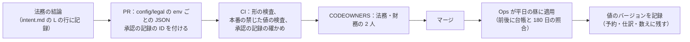
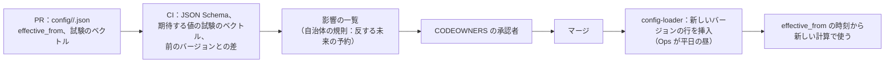
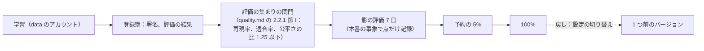

# Delivery: Airbnb

変更からマージまで、CI、成果物、フラグ（`release.*`・`ops.*`・`legal.*`）と `legal.*` の値の管理、バージョンの付いた設定の表（サービス料、キャンセルポリシー、税、自治体の規則、為替の上乗せ）と tz データベースの出し方、段階のデプロイと自動のロールバック、スキーマの変更の順序と守る物、台帳のマイグレーション、アプリのリリースと最小のバージョン、PMS の API のバージョン、ML のモデルと T&S の規則の出し方を決める。

前提となる決定と文書は次のとおり。

- トランクベース開発、squash、merge queue、Conventional Commits（[process.md](../../../../docs/process.md) の 4.1 節）
- リリースとロールバックの方針、デプロイの時間帯と凍結、自動のロールバックの条件（[runbooks/](../runbooks/README.md) の 3 節。値の正本）
- 空室・予約の状態・お金・法令の上限の規則をフラグにしない。料金・ポリシー・税・自治体の規則の表はバージョンの付いた設定。`legal.*` は法務の結論を入れる値（[AGENTS.md](../../AGENTS.md)、[ADR-0006](../decisions/0006-regulatory-night-cap-enforcement.md)）
- 台帳は追記だけ（[ADR-0005](../decisions/0005-payments-hold-capture-and-ledger.md)）
- ML は影の評価を通してから出す（[ADR-0009](../decisions/0009-trust-and-safety-and-ml-boundary.md)）

この文書で決めたことは次の ADR にある。

| ADR | 決定 |
| --- | --- |
| [0082](../decisions/0082-pipeline-schema-ordering-and-config-governance.md) | デプロイの順を、広げる段のマイグレーション → Worker → ドメインのサービス（`ledger` は最後に単独）→ 入口 → Web にする。スキーマは広げる・移す・縮めるの 3 段で、縮める段は 2 回のリリースと 7 日と、古いアプリの最小のバージョンを過ぎてから。守る物（`stay_claims` の排他の制約、`regulated_years` の CHECK、`regulated_nights` の主キー、予約の冪等と見積もりの一意、台帳の釣り合いのトリガーと決着の一意、RLS のポリシーと FORCE RLS、`pms_write_sequences` の主キー、vault の読み出しの関数）を一覧にし、触れる変更はテックリードの承認を要る。外す・緩める変更は CI で拒む。台帳のマイグレーションは別の流れ。サービス料・キャンセルポリシー・税・自治体の規則・為替の上乗せの表は、変えられないバージョンの行として、表ごとの承認者の PR、期待する値の試験のベクトル、影響の一覧を通して `config-loader` で入れる。`legal.*` は別の AppConfig のアプリケーションで、承認の記録のない本番の値の変更を CI が拒む |
| [0083](../decisions/0083-app-releases-pms-api-versions-and-model-releases.md) | アプリは週 1 回の列車で出し、段階のリリース（7 日）で広げる。最小のバージョンは `ops.app_min_version_<platform>`（更新を促す）と `ops.app_force_version_<platform>`（426 で止める）で持ち、支える範囲は直近 26 の列車。PMS の API は道の大きなバージョン（`/v1`）と、日付のバージョン（`X-<Brand>-Api-Version: YYYY-MM`、年 4 回まで）で持つ。アプリごとに登録の時のバージョンを固定し、壊す変更は新しい日付のバージョンだけ。各バージョンは次のバージョンの公開から 12 か月支え、6 か月前に知らせ、`Deprecation`・`Sunset` の見出しを付ける。止める前の 30 日に使った審査済みのアプリがあれば止めずに延ばす。ML のモデルと T&S の規則は、署名した成果物を評価の集まりの関門 → 7 日の影 → 予約の 5% → 100% で出し、戻しは設定の切り替え |

インフラの形は [infrastructure.md](infrastructure.md)、計測は [observability.md](observability.md)、品質の関門は [quality.md](../quality.md) の 2 節、PMS の API の中身は [host-tools-and-api.md](host-tools-and-api.md) にある。

## 1. 変更からマージまで

- 変更は開発リポジトリの `changes/YYMMDD-<slug>/`（spec と plan）に結び付き、ブランチ `airbnb/<YYMMDD-slug>` と worktree で作る（[process.md](../../../../docs/process.md) の 4.1 節）。
- エージェントの PR は GitHub App から作り、人が承認する。CODEOWNERS：

| 道 | 持ち主 |
| --- | --- |
| `packages/availability`・`stay-time`・`booking`・`cancellation`・`ledger`・`compliance-jp`・`visibility`、`ml/` | テックリード（[roadmap.md](../roadmap.md) の `dev-repo-bootstrap`） |
| `migrations/ledger/` | テックリードと財務 |
| `migrations/vault/`、`infra/` の `vault`・`untrusted-egress` | テックリードとセキュリティの担当 |
| `config/legal/` | 法務と財務 |
| `config/fees/` | PM と財務 |
| `config/cancellation-policies/` | PM と法務 |
| `config/taxes/` | 財務と法務 |
| `config/municipal-rules/` | 法務と Ops |
| `config/fx-markup/` | 財務 |
| `api/partner/openapi/` | テックリード（PMS の API の契約） |
| `infra/` | Ops |

- merge queue は、キューの先頭の組み合わせで PR の CI をもう一度回してからマージする。

## 2. CI

### 2.1 PR の CI（必須）

| 検査 | 中身 | 失敗で止める |
| --- | --- | --- |
| lint・型 | TypeScript（`pnpm lint && pnpm typecheck`）、Python（ruff、mypy） | はい |
| 境界の lint | パッケージをまたぐ表の書き込み、`stay_claims` を `availability` の関数の外で書く、`reservation` の行を `reserveStay`・`alterReservation` の外で作る、vault の表を 4 つのパッケージの外で読む、`listingVisible()` を通さないリスティングの返し、`requiredScopes` のない `partner-api` の経路、`packages/stay-time` の外の時刻の計算（[ADR-0001](../decisions/0001-platform-and-stack.md)、[ADR-0002](../decisions/0002-availability-representation-and-double-booking.md)、[ADR-0004](../decisions/0004-booking-state-machine-and-holds.md)、[ADR-0007](../decisions/0007-tenancy-host-accounts-and-rls.md)） | はい |
| 依存 | 許可の一覧の外の依存、本家のコード・SDK・公開のライブラリ、ライセンス、既知の脆弱性。SBOM の生成 | はい |
| 単体・表駆動・試験のベクトル | spec の決定表を読み込む表駆動（DT-BKG-001、DT-HST-001、DT-ACC-001 など） | はい |
| 性質ベース | 2,000 試行（[quality.md](../quality.md) の 2.2 節） | はい。再実行で緑にしない |
| 参照の実装・仮想の時計・模型 | `avail-ref`・`price-ref`・`refund-ref`・`ledger-ref`・`cap-ref`・`search-ref`、`clock-sim`、`psp-sim`・`ical-sim`・`bank-sim`・`webhook-sim`（触れたときだけ） | はい |
| 結合 | Testcontainers（PostgreSQL 18、Valkey、OpenSearch）、LocalStack | はい |
| ML | `ml/` に触れたとき：pytest、評価の集まりの関門、特徴の一覧に保護される属性がないこと（[ADR-0009](../decisions/0009-trust-and-safety-and-ml-boundary.md)） | はい |
| マイグレーション | 5 節の検査（広げる段だけか、守る物、ロックの時間の設定、索引の `CONCURRENTLY`） | はい |
| 事象の形 | outbox の事象と PMS の Webhook の本文の形の互換（5.3 節、7 節） | はい |
| PMS の API の契約 | 公開したバージョンの OpenAPI を固定し、今の実装を全バージョンの契約の試験で比べる（7 節） | はい |
| 設定の表 | 3.4 節の検査 | はい |
| `legal.*` の設定 | 3.3 節の検査 | はい |
| 個人のデータ | ロガー・トレースへの金庫・連絡先・2 者の型の受け渡し、メトリクスのラベルの許可の一覧（[ADR-0080](../decisions/0080-telemetry-privacy-dashboards-and-app-telemetry.md)） | はい |
| 追跡 | 要件・性質・決定表の ID がテストの名前から参照されている（[process.md](../../../../docs/process.md) の 7 節） | はい |
| テストの緩和の検出 | テストの削除・skip・期待値の緩和、並行度・試行の数の引き下げ | 人の承認を求める |
| `release.*` の寿命 | 100% の後 30 日を過ぎたフラグ | 警告（45 日で失敗） |

### 2.2 夜間の CI

| 検査 | 中身 |
| --- | --- |
| 性質ベース | 各 20 万試行。二重の予約は並行度 500（[quality.md](../quality.md) の 2.2.1 節 A） |
| 180 日、台帳、返金 | 100 万の場面と `cap-ref`・`ledger-ref`・`refund-ref`（同 B・C） |
| 仮想の時計と tz | 全期限、tz の試験ベクトル（同 D） |
| 障害の注入 | 提供者の時間切れ・重複・入れ替え、DB のフェイルオーバー、Valkey の停止、OpenSearch の遅れ、outbox の遅れ、iCal の相手の障害、ledger の停止 |
| E2E | 全部の流れ（Playwright、Maestro） |
| 負荷（縮めた規模） | 熱い日付、繁忙期、PMS の一斉の書き込み（[capacity.md](capacity.md) の 7 節） |
| ログの走査 | 合成の利用者で全経路を流し、個人のデータの形を探す（[observability.md](observability.md) の 2.1 節） |
| eval | エージェントの eval（[quality.md](../quality.md) の 3 節）。`AGENTS.md`・Skills・Hooks が変わった週は必ず |

## 3. 成果物、フラグ、設定

### 3.1 成果物

| 成果物 | 置き場所 | 検査 |
| --- | --- | --- |
| サービスのイメージ（TypeScript、Python） | ECR（東京、大阪へ写す） | 署名、SBOM、Inspector の走査。署名のないイメージを ECS のタスクの定義に使えない |
| Web の資産 | S3（ハッシュの名前） | 署名した一覧（manifest） |
| マイグレーション | イメージの中（クラスタごとの別のイメージ） | 5 節 |
| ML のモデル | data のアカウントの登録簿 → prod の `ml-models` | 8 節 |
| アプリ | App Store Connect、Google Play | 6 節 |
| 設定の表 | `config/<kind>/` → `config-loader` → core のバージョンの表 | 3.4 節 |
| `legal.*`、`ops.*`、`release.*` | AppConfig | 3.2・3.3 節 |
| tz データベース | `packages/stay-time` の中の固定のバージョンのデータ | 3.5 節 |
| PMS の API の契約 | `api/partner/openapi/<YYYY-MM>.yaml` | 7 節 |

### 3.2 フラグ

| 種類 | 名前の形 | 中身 | 変える人 | 寿命 |
| --- | --- | --- | --- | --- |
| `release.*` | kebab-case（`release.flexible-dates`） | 未完成の振る舞いの出し入れ、利用者の割合 | PM（リリースの判断） | 100% の後 30 日で消す |
| `ops.*` | snake_case（`ops.booking_enabled`） | 止める・絞るだけの運用の切り替え（[runbooks/](../runbooks/README.md) の 2 節）、アプリの最小のバージョン、SMS の提供者 | Ops | 常設 |
| `legal.*` | 法務の結論の値（`legal.minpaku_count_external_nights`） | 3.3 節の一覧 | 法務と財務の承認 | 常設 |

- 空室・予約の状態・お金・法令の上限の規則は `release.*` で切り替えない。コードのバージョンとして出し、本番の照合の指標で見る（[runbooks/](../runbooks/README.md) の 3 節）。
- `release.*` の評価は `app-api` と各サービスで同じ値を読む。アプリには、サーバーが評価した結果だけを返す。

### 3.3 `legal.*` の値の管理（ADR-0082）

- `legal.*` は AppConfig の別のアプリケーション `legal` に置く。本番の配信は Ops の役割だけで、一度にすべて（段階なし。値の食い違いを作らない）。
- 値は `config/legal/<env>.json` に置き、JSON Schema（型、範囲、既定）で検査する。各値は `value`、`effective_from`、`approval_ref`（承認の記録の ID）を持つ。
- **本番の禁じた値の検査**：次の値（`legal.*` の全部。一覧の正本は [data-model.md](data-model.md) の 6 節）を本番で既定から変える PR は、`approval_ref` が承認の記録（法務と財務の 2 人の署名、[intent.md](../intent.md) の L の番号）を指していなければ失敗にする。

| 値 | 本番の既定 | L |
| --- | --- | --- |
| `legal.minpaku_count_external_nights` | `none` | L1 |
| `legal.minpaku_day_boundary_rule` | `one_per_night`（1 泊 1 日） | L1 |
| `legal.message_scan_mode` | `send_time_pattern`（送る時の決定的な検査だけ） | L9 |
| `legal.registry_auto_delete_enabled`、`legal.guest_registry_retention_days` | `false`、1,095 | L3 |
| `legal.kyc_*` | 消さない | L3・L8 |
| `legal.pms_registry_scope_enabled` | `false` | L3・L8 |
| `legal.pms_cross_border_guest_data` | `deny` | L8 |
| `legal.prebooking_guest_identity_display` | `none` | L11 |
| `legal.registry_gate_arrival_info`、`legal.guest_registry_fields`、`legal.registry_identity_method` | 開発・検証は `true`・観光庁の資料の項目・`mrz_nfc`。本番の値は L3 の後 | L3 |
| `legal.request_decline_mode_ryokan` | `unrestricted`（本番で無効の印） | L2・L11 |
| `legal.person_key_enabled`、`legal.kyc_result_retention_days` | `false`、消さない | L8 |
| `legal.claim_merchant_initiated_enabled`、`legal.claim_evidence_retention_days` | `false`、1,095 | L8・L12 |
| `legal.lodging_tax_collector`・`legal.lodging_tax_collector.<jurisdiction>`（[taxes.md](taxes.md)）、`legal.funds_holding_model`・`legal.max_holding_days`（[ledger-and-payouts.md](ledger-and-payouts.md)）、`legal.sanctions_screening_owner`（[payments-and-fx.md](payments-and-fx.md)）、`legal.message_translation_enabled`（[messaging.md](messaging.md)） | 各文書の既定（ホストが納める、収納代行など） | L4・L5・L6・L9 |

- 適用は平日の 10〜15 時（[runbooks/](../runbooks/README.md) の 3 節）。適用の前と後で、予約と台帳の照合、台帳の不変条件、180 日の照合を回す。
- 予約・見積もり・仕訳・`regulated_nights` の数えは、そのとき使った `legal` の構成のバージョンを記録する。値を戻しても、過去の記録は書き換えない。
- `legal.*` の値の変更は監査の事象に残す（[security.md](security.md) の 6.4 節）。

### 3.4 バージョンの付いた設定の表（ADR-0082）

| 表 | 持ち主の領域 | 承認者 | 既存の予約・見積もりへの効き |
| --- | --- | --- | --- |
| サービス料の表 | [pricing-and-fees.md](pricing-and-fees.md) | PM、財務 | 見積もりは作った時のバージョンのまま。新しい見積もりから |
| キャンセルポリシーの表 | [cancellations-and-changes.md](cancellations-and-changes.md) | PM、法務（L7） | 予約の時のバージョンで返金を計算する（[AGENTS.md](../../AGENTS.md)） |
| 税の表（消費税、宿泊税、入湯税） | [taxes.md](taxes.md) | 財務、法務（L4） | 見積もりのバージョンのまま。施行の日の後の新しい見積もりから |
| 自治体の規則の表（`municipal_rule_sets`） | [regulatory-compliance-japan.md](regulatory-compliance-japan.md) | 法務（L1）、Ops | 施行の日より後の泊に効く。既存の予約で反するものは一覧にし、自動で取り消さない（[ADR-0006](../decisions/0006-regulatory-night-cap-enforcement.md)） |
| 為替の上乗せ | [payments-and-fx.md](payments-and-fx.md) | 財務 | 新しい相場の写しから |

- バージョンの行は変えられない（`UPDATE`・`DELETE` を DB の権限で禁止）。誤りの直しは、新しいバージョンを出す。
- `effective_from` は未来（入れる時刻から 24 時間より後）。自治体の規則は施行の日の前に入れる。
- 期待する値の試験のベクトル（料金・ポリシー・税の境の値）は QA が承認する（[quality.md](../quality.md) の 2.3 節）。
- `config-loader` は入れたバージョンを outbox に書き、`search-indexer`（料金の要約の帯）と `pricing` の写しが受ける。

### 3.5 tz データベース

- `packages/stay-time` が固定のバージョンの tz データベースを持つ。毎月、新しいバージョンを確かめ（[runbooks/](../runbooks/README.md) の 7 節）、更新は PR で出す。
- 更新を出すと、未来の瞬間の列（チェックインの時刻、締め切り、期限、送金の振り替えの時刻、レビューの期限）を計算し直すジョブが動く。泊の日付は変わらない（[ADR-0002](../decisions/0002-availability-representation-and-double-booking.md)、Google Calendar の題材の [ADR-0012](../../../google-calendar/docs/decisions/0012-tzdb-update-recompute-and-propagation.md)）。計算し直しの細部は [availability-and-calendars.md](availability-and-calendars.md)。
- 日本の物件は影響を受けない。海外の物件（S2）の夏時間の変更で、期限が動く予約を一覧にする。

## 4. デプロイ

### 4.1 段階

[runbooks/](../runbooks/README.md) の 3 節の段（検証 → 見張りの利用者 → 5% → 25% → 100%、各 30 分）を、次の仕組みで行う。

| 対象 | 割合の分け方 |
| --- | --- |
| 入口とドメインのサービス（HTTP） | ALB の重みつきのターゲットグループで新旧のタスクの組に割合で送る。見張りの段は、`sentinel` の利用者の要求だけを新しい組へ送る規則（`app-api` が付ける `X-<Brand>-Canary`） |
| `partner-api` | 同上。見張りの PMS のアプリの要求だけを新しい組へ送る段を足す |
| Worker（SQS の消費者） | 新しいバージョンのタスクを 1 つだけ足して 30 分、次に半分、次に全部 |
| `ledger`・`reconcilers`・`deadline-runner` | 単独の日に出し、新しいタスクを 1 つ足して 30 分、照合の指標を見てから全部 |
| `ical-fetcher`・`webhook-sender` | Worker と同じ。Network Firewall の拒否の数を段ごとに比べる |
| Web の資産 | 新しい manifest を見張りの利用者 → 全員 |

### 4.2 順序

1. マイグレーション（広げる段だけ。クラスタごと。ledger は 5.4 節の別の流れ）
2. Worker（`relay`、`deadline-runner`、`reconcilers`、索引と写しの書き手、`ical-sync`、`ical-fetcher`、`webhook-*`、`bulk-runner`）
3. ドメインのサービス（`ledger` は最後に単独で）
4. `app-api`・`partner-api`・`ops-api`
5. Web の資産

- 新しい事象の型を出すときは、消費者（2）を先に、作る側（3）を後に出す。新しい API の欄は、サービス（3）を先に、入口（4）を後に出す。
- この順は [runbooks/](../runbooks/README.md) の 3 節の「デプロイの順」と同じ。

### 4.3 自動のロールバック

[runbooks/](../runbooks/README.md) の 3 節の条件（予約の 5xx・p99、`stay_claims` の照合の不一致、180 日の照合の不一致、決着の重複・早い release、台帳の不変条件、見積もりと請求の差、検索の 5xx と混入の率）を、段ごとに新旧の組で比べる。

- 新しい組の値が古い組の 2 倍を 5 分超える（または絶対の閾値を超える）と、新しい組への重みを 0 にしてタスクを止める。
- 正しさの指標（照合の不一致、台帳の不変条件）は組で分けられない。デプロイの段の中で 1 件でも出たら、その段を止め、前のイメージへ戻し、人を呼ぶ。
- マイグレーションは戻さない（広げる段だけなので、前のイメージが今の DB で動く）。

### 4.4 時間帯と凍結

[runbooks/](../runbooks/README.md) の 3.1 節。デプロイの関門（CI の最後の段）が、対象のサービスの時間帯と凍結（繁忙期、月末と月初の 2 営業日、祝日の前日）を確かめ、外れていれば Ops の承認（修正だけ）を求める。

## 5. スキーマの変更（ADR-0082）

### 5.1 3 つの段

| 段 | 許すこと | 出す時 |
| --- | --- | --- |
| 広げる | 表・列（NULL を許すか既定の値つき）・索引（`CONCURRENTLY`）の追加、新しい制約の `NOT VALID` での追加 | いつでも（コードより先） |
| 移す | 新しい列への書き写し（小さな束、`lock_timeout`）、`VALIDATE CONSTRAINT`、新旧の両方への書き込み | 広げる段の後 |
| 縮める | 古い列・表・索引の削除、`NOT NULL` の付与 | 広げる段から 2 回のリリースと 7 日の後、かつ古いアプリの最小のバージョンを過ぎてから |

- 縮める段は別の PR で、CI が「広げる段の日付」と「アプリの最小のバージョン」を確かめる。
- DDL は `lock_timeout = 2s`、`statement_timeout` はマイグレーションのロールごと。`stay_claims`・`reservations`・`regulated_*` の表は、熱い日付と繁忙期の凍結の外でだけ当てる。

### 5.2 守る物

次の物に触れる変更は、テックリードの承認を要る。外す・緩める（`DROP`、`ALTER ... DROP CONSTRAINT`、ポリシーの `USING (true)`、`NO FORCE ROW LEVEL SECURITY`）変更は CI で拒む。置き換えるときは、新しい物を先に足し、両方が効く間を置いてから古い物を外す 2 つの PR にする。

| 物 | 理由 |
| --- | --- |
| `stay_claims` の `EXCLUDE USING gist (listing_id WITH =, claim_group WITH <>, block_span WITH &&) WHERE (status = 'active')` と CHECK | 二重の予約 0（[ADR-0002](../decisions/0002-availability-representation-and-double-booking.md)） |
| `regulated_years` の CHECK（`nights_used + external_used <= cap`）、`regulated_nights` の主キー | 上限の超過 0（[ADR-0006](../decisions/0006-regulatory-night-cap-enforcement.md)） |
| `reservations` の `(guest_id, idempotency_key)` の一意、`quote_id` の一意 | 予約の 1 回（[ADR-0004](../decisions/0004-booking-state-machine-and-holds.md)） |
| 台帳の釣り合いのトリガー、`(reservation_id, settlement_seq)` の決着の一意、冪等キーの一意、仕訳の表の `UPDATE`・`DELETE` の禁止 | 決着の 1 回、台帳の不変条件（[ADR-0005](../decisions/0005-payments-hold-capture-and-ledger.md)） |
| 全表の FORCE RLS と RLS のポリシー | NFR-016（[ADR-0007](../decisions/0007-tenancy-host-accounts-and-rls.md)） |
| `pms_write_sequences` の主キー、`pms_idempotency_keys` の主キー | PMS の書き込みの順序と冪等（[ADR-0069](../decisions/0069-pms-availability-and-price-push-and-bulk-operations.md)） |
| vault の読み出しの関数と `vault_access_log` の同じトランザクションの書き込み | 監査（[ADR-0074](../decisions/0074-operator-access-reveal-and-audit-chain.md)） |
| `users` の `email_hmac`・`phone_hmac` の部分一意 | 1 つの宛先に 1 アカウント（[ADR-0071](../decisions/0071-sign-in-sessions-devices-and-profiles.md)） |
| 設定の表のバージョンの行の変更の禁止 | 既存の予約の計算が変わらない（3.4 節） |

- 守る物の一覧は開発リポジトリの `migrations/protected.yaml` に置き、CI が DDL を解析して照らす。一覧の変更そのものもテックリードの承認を要る。

### 5.3 outbox の事象の形

- 事象は `type` と `schema_version` を持ち、JSON Schema を `events/` に置く。互換の変更（欄の追加）は同じバージョン、壊す変更は新しいバージョンで、消費者を先に出す（4.2 節）。
- 古いバージョンの事象を出し続ける期間は、最も遅い消費者が新しいバージョンを読めるようになるまで。CI が消費者の宣言（読めるバージョン）と作る側のバージョンを照らす。
- PMS の Webhook の本文は、outbox の事象から購読のバージョンの形に直して作る（7 節）。outbox の事象のバージョンと PMS の API のバージョンは別に持つ。

### 5.4 台帳のマイグレーション（ADR-0082）

- 台帳（ledger のクラスタ）のマイグレーションは `migrations/ledger/` の別の流れで、テックリードと財務の 2 人の承認を要る。
- 許すのは足すだけの DDL（表、列、索引、口座の種類）。仕訳と仕訳の行の表への書き換えは、マイグレーションのロール（`ledger_migrator`）でも権限とトリガーで拒む。
- 当てる前と後に、台帳の不変条件と予約と台帳の照合を回し、`ledger-ref` で直近 30 日の事象を再生して残高が一致することを確かめる。
- 当てるのは単独の日の平日の 10〜15 時で、月末と月初の 2 営業日を避ける（[runbooks/](../runbooks/README.md) の 3.1 節）。

## 6. アプリのリリースと最小のバージョン（ADR-0083）

### 6.1 列車

- iOS・Android は週 1 回の列車（水曜に切り、翌週の月曜に申請）。App Store の段階のリリース（7 日）と Google Play の段階の公開で広げる（出典）。
- バージョンごとのクラッシュのない利用者の率（99.5% 未満）と API の誤りの率で、段階の公開を止める。
- アプリの中の未完成の振る舞いは、サーバーが評価した `release.*` の結果で出し入れする。

### 6.2 最小のバージョン

| 値 | 振る舞い |
| --- | --- |
| `ops.app_min_version_<platform>` | これより古い `X-<Brand>-Client` のアプリに、更新を促す画面を出す（使い続けられる） |
| `ops.app_force_version_<platform>` | これより古いアプリの要求に 426 を返し、更新の画面だけを出す |

- 支える範囲は直近 26 の列車（約半年）。`app-api` の応答の形は、支える範囲のアプリが読める形を保つ（欄の追加だけ）。
- 強制の引き上げは、安全（安全の窓口のボタンの不具合など）、お金と法令の表示（総額、確認の画面の事項。法務の L7）、API の契約の削除のときだけ。PM と Ops が決める。
- 予約の途中のアプリ（確認の画面）に 426 を返すと予約が失われるので、`reserveStay` と決済の確認の経路は強制の引き上げの後 24 時間は受ける。

### 6.3 Web

- Web の資産はデプロイで入れ替わる。古いタブの資産は、API の欄の追加だけの方針で動き続ける。資産の manifest のバージョンが 26 の列車より古いタブには再読み込みを促す。

## 7. PMS の API のバージョン（ADR-0083）

| 項目 | 形 |
| --- | --- |
| 大きなバージョン | 道の `/v1`。変えるのは API の全体を作り直すときだけ |
| 日付のバージョン | `X-<Brand>-Api-Version: YYYY-MM`。年 4 回まで（1・4・7・10 月）。最初は `2026-10` |
| 既定のバージョン | アプリの登録の時に、その時の最新を固定する。見出しのない要求は固定のバージョン。開発者が画面で上げる |
| 互換の変更（同じバージョンの中） | 応答の欄の追加、任意の入力の追加、新しい事象の種類（購読で選んだときだけ送る）、新しい誤りの理由のコード（既知の HTTP の状態の中） |
| 壊す変更（新しいバージョンだけ） | 欄の削除・名前・型・意味の変更、必須の入力の追加、既定の振る舞いの変更、Webhook の本文の形の変更 |
| 支える期間 | 各バージョンを、次のバージョンの公開から 12 か月 |
| 知らせ | 止める 6 か月前に開発者へ。止めるバージョンの応答に `Deprecation`（RFC 9745）と `Sunset`（RFC 8594）の見出し |
| 止める条件 | 止める前の 30 日に、そのバージョンを使った審査済みのアプリがあれば止めず、開発者と話して延ばす（空室の書き込みが止まると、外部との二重の予約につながるため）。延ばした記録を残す |
| Webhook | 購読はバージョンを持ち、本文はそのバージョンの形で作る |
| 実装 | 最新のバージョンの内部の形と、バージョンごとの変換の層。バージョンごとの OpenAPI を固定し、全バージョンの契約の試験を PR で回す |

- バージョンごとの要求の数とアプリの数を見る（[observability.md](observability.md) の PMS のダッシュボード）。

## 8. ML のモデルと T&S の規則の出し方（ADR-0083）

- モデルと規則は署名した成果物で、`models.<name>.active_version`・`rules.<name>.active_version` の設定で選ぶ（デプロイなし）。
- 影の評価で、審査の量が今の 1.5 倍を超える変更は Ops と合意してから出す（[quality.md](../quality.md) の 2.2.1 節 I）。
- 時間帯は平日 10〜16 時、繁忙期の凍結の中は出さない（[runbooks/](../runbooks/README.md) の 3.1 節）。
- 料金の提案と順位付けの ML は MVP の後（[ADR-0009](../decisions/0009-trust-and-safety-and-ml-boundary.md)）。出すときも同じ段を通す。

## 9. ホットフィックス

- 本番の障害の修正は、`main` に入れて通常の段で出す。段の各 30 分は、Ops の判断で 10 分に縮めてよい（自動のロールバックの条件は同じ）。
- 凍結の中の修正は Ops の承認（作成者と別の人）。
- アプリの修正は列車の外の臨時のバージョンで出し、審査の短縮を申請できる（条件は**未検証**）。

## 10. 指標

| 指標 | 目標（S1） |
| --- | --- |
| デプロイの頻度（サービス） | 平日に毎日 |
| 変更のリードタイム（マージから本番 100%） | 中央値 1 日 |
| 変更の失敗の率（自動のロールバック・ホットフィックス） | 10% 以下 |
| 復旧までの時間（ロールバック） | 中央値 15 分 |
| アプリのクラッシュのない利用者の率（バージョンごと） | 99.5% 以上 |
| 支える範囲より古いアプリの DAU の率 | 2% 以下 |
| `release.*` の 30 日を過ぎた残り | 0 |
| 止める予定の PMS の API のバージョンの要求の率（止める 30 日前） | 0 |

## 11. data-model への項目

| 表・置き場所 | 中身 | 節 |
| --- | --- | --- |
| core：`deployments` | サービス、イメージのダイジェスト、段、始まり、終わり、結果、ロールバックの理由 | 4 |
| 各クラスタ：`schema_migrations` | マイグレーションの ID、段（広げる・移す・縮める）、守る物に触れたか、承認者、当てた時刻 | 5 |
| core：`app_versions` | プラットフォーム、バージョン、ビルド、列車、公開の日、段階の割合、止めた時刻と理由 | 6 |
| core：`legal_config_changes` | キー、前と後の値、`effective_from`、`approval_ref`、適用の時刻、適用した人 | 3.3 |
| core：`config_versions` | 設定の表の種類、バージョン、`effective_from`、内容のハッシュ、承認者、入れた時刻。各表の中身は持ち主の領域の表（`service_fee_schedules`、`cancellation_policies`（`(code, version)`）、`host_cancellation_fee_tables`、`tax_table_versions`・`tax_rules`、`municipal_rule_sets`、`fx_markup_versions`（為替の上乗せ `fx_markup_bps` の組ごとの値）。一覧は [data-model.md](data-model.md)） | 3.4 |
| core：`partner_api_versions` | バージョン、公開の日、止める予定の日、止めた日、延ばした記録 | 7 |
| core：`pms_apps` に足す列 | `default_api_version` | 7 |
| 予約・見積もり・仕訳・`regulated_nights` に足す列 | `legal_config_version`、使った設定の表のバージョンの ID（[ADR-0004](../decisions/0004-booking-state-machine-and-holds.md) の見積もりの写しと同じ） | 3.3、3.4 |
| data のアカウント：モデルの登録簿 | モデル、バージョン、重みの場所、署名、評価の結果、影の評価の結果、状態 | 8 |
| AppConfig | `ops.app_min_version_*`、`ops.app_force_version_*`、`models.*`、`rules.*`、`legal` のアプリケーション | 3、6、8 |

## 12. テストと性質

| ID（草案） | 内容 | テスト |
| --- | --- | --- |
| — | マイグレーションの検査：広げる段の PR に列の削除・型の変更・`CONCURRENTLY` でない索引が入らない。守る物を外す・緩める DDL を拒む | CI の自己の試験（悪い例のマイグレーションを流して失敗すること） |
| — | 台帳：`ledger_migrator` の役割で仕訳の表の `UPDATE`・`DELETE` が失敗する | 結合 |
| — | `legal.*`：承認の記録のない本番の禁じた値の変更が失敗する | CI の自己の試験 |
| PROP-DEL-001 | 任意の設定の表のバージョンの列と見積もり・予約の時刻で、見積もりと予約の計算は、その時に記録したバージョンだけに依り、後から入れたバージョンで変わらない | 性質ベース（`price-ref`・`refund-ref` と） |
| — | 最小のバージョン：`force` より古い `X-<Brand>-Client` に 426。予約の確認の経路は 24 時間受ける | 表駆動 |
| — | PMS の API：全バージョンの契約の試験、`Deprecation`・`Sunset` の見出し | CI |
| — | 事象の形：互換でない変更を CI が見つける | CI の自己の試験 |
| — | 自動のロールバック：staging で予約の 5xx を注入し、新しい組の重みが 0 になる | staging |

## 13. Story の候補

| Epic | Story | 中身 |
| --- | --- | --- |
| E1 | `ci-pipeline-baseline` | 2 節 |
| E1 | `flags-appconfig` | 3.2・3.3 節（ADR-0082） |
| E1 | `deploy-pipeline-and-rollback` | 4 節 |
| E1 | `migration-guardrails` | 5.1〜5.3 節、守る物の一覧（ADR-0082） |
| E8・E10・E18 | `config-tables-loader` | 3.4 節。料金・ポリシー・税・自治体の規則の表の出し方 |
| E5 | `tzdata-update-and-recompute`（[availability-and-calendars.md](availability-and-calendars.md) と共同） | 3.5 節 |
| E12 | `ledger-migration-pipeline` | 5.4 節（ADR-0082） |
| E2 | `app-release-train` | 6 節（ADR-0083） |
| E19 | `partner-api-versioning` | 7 節（ADR-0083） |
| E16 | `model-and-rule-release` | 8 節（ADR-0083） |

## 14. 未解決の問い

### 決定（2026-10-10、既定案）

- **順序**：マイグレーション → Worker → サービス（ledger 最後）→ 入口 → Web（ADR-0082）。
- **スキーマ**：広げる・移す・縮める、守る物の一覧、外す変更を CI で拒む（ADR-0082）。
- **設定の表**：変えられないバージョンの行、表ごとの承認者、24 時間より後の `effective_from`、影響の一覧（ADR-0082）。
- **`legal.*`**：別のアプリケーション、承認の記録の付いた PR だけ、平日の昼の適用（ADR-0082）。
- **アプリ**：週 1 回の列車、段階のリリース、最小と強制の 2 つのバージョン、26 の列車（ADR-0083）。
- **PMS の API**：`/v1` と日付のバージョン、アプリごとの固定、12 か月、使われていれば止めない（ADR-0083）。
- **ML と規則**：関門 → 影 7 日 → 5% → 100%、戻しは設定（ADR-0083）。

### 持ち越し

| 問い | いつ・どう決めるか |
| --- | --- |
| 確認の画面の事項（強制の引き上げの理由になる） | **法務の確認待ち：L7** |
| キャンセルポリシーの表の新しいバージョンの承認の基準 | **法務の確認待ち：L7** |
| 税の表・自治体の規則の表の中身 | **法務の確認待ち：L4・L1** |
| Apple の迅速の審査の条件 | E2 の `app-release-train`（**未検証**） |
| ALB の重みつきの分け方と ECS の青と緑のデプロイの組み方 | E1 の `deploy-pipeline-and-rollback` |

## 出典

いずれも 2026-10-10 に確認。

- Apple, [Release a version update in phases](https://developer.apple.com/help/app-store-connect/update-your-app/release-a-version-update-in-phases/)：7 日で 1%・2%・5%・10%・20%・50%・100%。止められる
- Google, [Release app updates with staged rollouts](https://support.google.com/googleplay/android-developer/answer/6346149)：割合を選び、手で上げ、止められる
- IETF, [RFC 8594 The Sunset HTTP Header Field](https://www.rfc-editor.org/rfc/rfc8594)、[RFC 9745 The Deprecation HTTP Response Header Field](https://www.rfc-editor.org/rfc/rfc9745)
