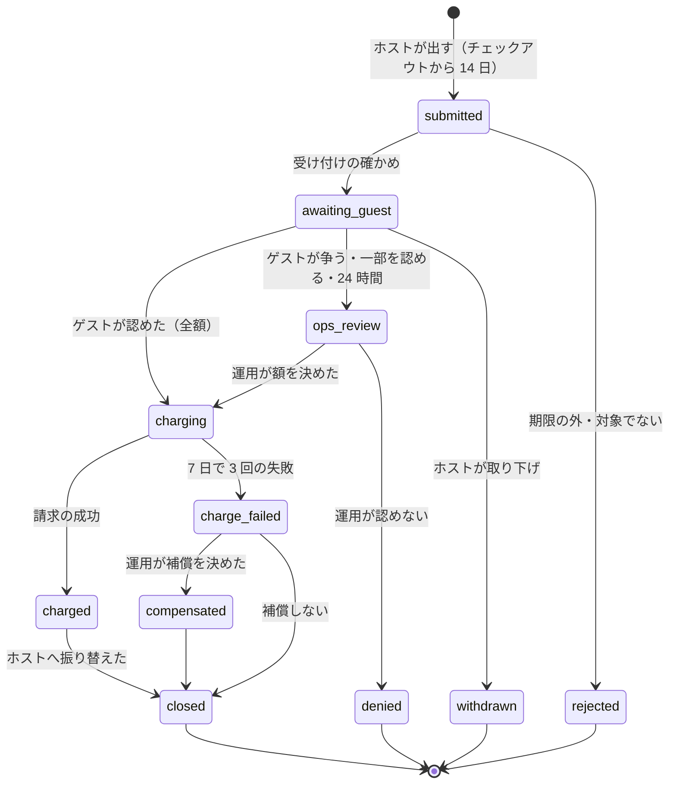

# Deposits and Claims: Airbnb

損害の請求を決める。チェックアウトの後 14 日の請求の受け付け、証拠、ゲストの応答（24 時間）、運用の判断、保存した支払いの方法でのゲストへの請求、請求の失敗と補償の記録、仕訳、T&S への信号、保証金（MVP の後）の形を扱う。どの Story も **法務の確認待ち（L12）** である。

前提となる決定は次のとおり。

- MVP は保証金の預かりを持たない。損害はチェックアウトの後の請求で扱う（[README.md](README.md) の 6 節、intent の「MVP の後」）
- 損害の保険そのものは本システムの外。本システムは請求の手続きと支払いの記録を持つ（intent の Non-goals）
- お金は台帳の仕訳で動く（[ledger-and-payouts.md](ledger-and-payouts.md) の型 26・28・29）
- ゲストへの請求は保存した支払いの方法での加盟店からの請求（[payments-and-fx.md](payments-and-fx.md) の 4.1 節の `chargeMerchantInitiated`）
- 判断は人が行う（[roadmap.md](../roadmap.md) の「エージェントに任せないこと」）

この文書で決めたことは次の ADR にある。

| ADR | 決定 |
| --- | --- |
| [0050](../decisions/0050-damage-claim-lifecycle-and-guest-charge.md) | 損害の請求は DT-CLM-001 のステートマシンで持つ。受け付けはチェックアウトの時刻から 14 日、ゲストの応答は 24 時間。ゲストが認めれば運用の確かめなしで請求し、争うか応えなければ運用が額を決める。請求はリスティングの通貨で、`claim_funds_held` に受けてからホストへ振り替える。請求が 7 日で 3 回失敗したら、運用が補償を決める（補償の扱いは法務の確認待ち：L12） |
| [0051](../decisions/0051-security-deposits-deferred-shape.md) | 保証金は MVP で持たない。MVP の後に出すときの形を、チェックインの 24 時間前のオーソリと、チェックアウトの 7 日後か請求の決着での取り消しに決め、オーソリの有効の期間が滞在 + 8 日より短い支払いの方法には保証金を求めない。出すには法務の L5・L12 の結論と提供者の能力の確かめが要る |

## 1. 範囲

- 扱う：
  - 損害の請求の受け付けと期限、証拠
  - ゲストの応答、運用の判断
  - ゲストへの請求、失敗と再試行、補償の記録
  - 仕訳と送金への受け渡し
  - T&S への信号
  - 保証金の形（MVP の後）
- 扱わない：
  - 安全の事故の対応（trust-and-safety の領域）
  - 補償の仕組みの法的な整理（**法務の確認待ち：L12**）
  - 提供者の呼び出し（[payments-and-fx.md](payments-and-fx.md)）
  - 運用の画面の権限（security の領域）

## 2. 要件

| 要件 | 目標 | NFR |
| --- | --- | --- |
| 期限 | チェックアウトの時刻から 14 日を過ぎた請求の受け付け 0。期限は物件のタイムゾーンで求めた瞬間 | NFR-014 |
| お金の正しさ | ゲストから受けた額 = ホストへ振り替えた額 + ゲストへ戻した額。補償は別の口座 | NFR-007 |
| 1 回の請求 | 1 つの請求でゲストに請求するのは 1 回（再試行は同じ冪等キー） | NFR-007 |
| 人の判断 | ゲストが認めない請求は、人が額を決めるまで請求しない | intent の Non-goals、[ADR-0009](../decisions/0009-trust-and-safety-and-ml-boundary.md) |
| 個人のデータ | 証拠の写真・見積もりは 2 者と担当の運用者だけが見る | NFR-016 |

## 3. 本家の形（確かめたこと）

[ヘルプの記事 279](https://www.airbnb.com/help/article/279)（2026-10-10 に確認）。

- 損害の請求は、責任のあるゲストのチェックアウトから 14 日以内に、解決センターで出す。
- 本家の担当に入ってほしいときは、損害から 14 日以内に資料を出す。
- ゲストは 24 時間で応じる。ゲストが応じない・一部だけ払う・断ると、ホストは損害の保護の仕組みに申し出て、担当が審査する。
- 本家がゲストに請求する仕組みは、この記事には書かれていない（**未検証**）。地域ごとのヘルプで資料の期限が 14 日と 30 日で食い違う（[intent.md](../intent.md) の出典。**未検証**）。

## 4. 状態

### 4.1 図

### 4.2 DT-CLM-001

上から評価し、最初に一致した行を採用する（[ADR-0050](../decisions/0050-damage-claim-lifecycle-and-guest-charge.md)）。

| # | 今の状態 | 事象 | 条件 | → 次の状態 | 効果 |
| --- | --- | --- | --- | --- | --- |
| 1 | 終わった状態 | どれでも | — | そのまま | 200 |
| 2 | （なし） | `submit` | 予約が `completed` でない、または主体がその予約のホストのアカウント（`owner`・`full`）でない | — | 403・422 |
| 3 | （なし） | `submit` | `now ≥ claim_window_ends_at`（`check_out_at + 14 日`） | `rejected` | 理由 `window_closed` |
| 4 | （なし） | `submit` | 同じ予約に開いた請求がある | — | 409 `claim_open` |
| 5 | （なし） | `submit` | 額が 0、または上限（9 節）を超える、証拠がない | — | 422 |
| 6 | （なし） | `submit` | — | `awaiting_guest` | `guest_response_due_at = now + 24h`。ゲストに知らせる。ホストの送金に `ops_case` の保留をかけない（請求は別のお金） |
| 7 | `awaiting_guest` | `guest_accept` | 主体がゲスト、全額 | `charging` | `approved_amount = claimed_amount` |
| 8 | `awaiting_guest` | `guest_accept_partial`・`guest_dispute` | 主体がゲスト | `ops_review` | ゲストの額と理由を記録 |
| 9 | `awaiting_guest` | `deadline`（`guest_response_due_at`） | — | `ops_review` | 理由 `no_response` |
| 10 | `awaiting_guest`・`ops_review` | `host_withdraw` | 主体がホスト | `withdrawn` | — |
| 11 | `ops_review` | `ops_decide` | 額 > 0 | `charging` | `approved_amount`、根拠を案件に書く |
| 12 | `ops_review` | `ops_decide` | 額 = 0 | `denied` | 根拠を書く |
| 13 | `charging` | `payment_succeeded` | — | `charged` | 型 28。続けて型 29 で `closed` |
| 14 | `charging` | `payment_failed`・`payment_action_required` | 失敗が 3 回未満 | そのまま | 1 日・3 日・7 日の後に再試行。ゲストに支払いの方法の更新を求める |
| 15 | `charging` | `payment_failed` | 3 回目 | `charge_failed` | 運用の待ち行列 |
| 16 | `charge_failed` | `ops_compensate` | 額 > 0 | `compensated` | 型 26（`compensation_expense` → `host_payable`）。続けて `closed` |
| 17 | `charge_failed` | `ops_compensate` | 額 = 0 | `closed` | — |
| 18 | `charged`・`compensated` | （自動） | — | `closed` | — |
| 19 | どれでも | 上のどれにも当たらない | — | そのまま | 422 |

- `submit` の主体は予約のホストのアカウント。共同ホストは `full` の役割だけ（[ADR-0007](../decisions/0007-tenancy-host-accounts-and-rls.md)）。
- 運用の判断（行 11・12・16・17）は T&S・CS の担当が、JIT の権限と理由で行う（security の領域）。

## 5. 期限

| 列 | 値 | 期限で起きること |
| --- | --- | --- |
| `claim_window_ends_at` | 予約の `check_out_at + 14 日`（予約の確定の時に書く。日程の変更で書き直す） | 行 3 |
| `guest_response_due_at` | `submit + 24 時間` | 行 9 |
| `evidence_due_at` | `submit + 14 日`（ホストが証拠を足せる期限。本家の 14 日と 30 日の食い違いは**未検証**。本システムは 14 日） | 足せなくなる（運用は判断に進める） |
| `next_charge_at` | 失敗から 1・3・7 日 | 行 14・15 |

- 期限は `deadline-runner` が 1 分ごとに拾う（[booking-and-holds.md](booking-and-holds.md) の 7.4 節と同じ形。表は `damage_claims`）。
- 運用の判断の目安は 7 日（`ops_review` の SLA。[runbooks/](../runbooks/README.md) の 2・4 節）。

## 6. 証拠

- 写真（20 枚、1 枚 15 MiB）、修理・買い替えの見積もりと領収書（PDF・画像、10 件）、説明（4,000 文字）。S3 に、損害の請求ごとの鍵の場所（`claims/<claim_id>/`）で置き、写真の位置情報を消す（listings-and-content の領域の `media-processor`）。
- 見られるのは、その予約のゲストとホストのアカウント、担当の運用者だけ。ゲストの反論と証拠も同じ。
- 保存の期間は請求の終わりから 3 年（`legal.claim_evidence_retention_days`。法務の確認待ち：L8・L12）。

## 7. ゲストへの請求

- 請求の通貨はリスティングの通貨（円）。ゲストが外国の通貨で予約していても、損害の額は円で決まるので円で請求する（換算は発行者に任せる）。[ADR-0008](../decisions/0008-multi-currency-and-fx.md) の「見積もりの額」の規則は予約のお金のためで、損害の請求には当たらない。
- 予約の時に保存した支払いの方法で `chargeMerchantInitiated`（冪等キー `<claim_id>:charge`）。保存がなければ、ゲストに画面で払ってもらう（`requires_action` と同じ流れ。3-D セキュアを含む）。
- 保存した支払いの方法を損害の請求に使う同意（利用規約）と、本システムが請求を代わりに取り立てることの整理は **法務の確認待ち（L12）**。結論まで `legal.claim_merchant_initiated_enabled = false` で、ゲストに画面で払ってもらう流れだけを出す。

## 8. 仕訳と送金

**例**：ホストが 30,000 円を請求し、ゲストが争い、運用が 25,000 円を認めた。

| 段 | 仕訳（[ledger-and-payouts.md](ledger-and-payouts.md) の 4.2 節） | 借方 | 貸方 |
| --- | --- | --- | --- |
| 請求の成功 | 型 28 `claim_charge` | `psp_receivable` 25,000 | `claim_funds_held:C` 25,000 |
| ホストへ | 型 29 `claim_release` | `claim_funds_held:C` 25,000 | `host_payable:H` 25,000 |
| 送金 | 型 11・12（次の束） | `host_payable:H` 25,000 | `payout_in_transit`・`bank` |

**例**：請求が 3 回失敗し、運用が 25,000 円の補償を決めた。

| 段 | 仕訳 | 借方 | 貸方 |
| --- | --- | --- | --- |
| 補償 | 型 26 `compensation` | `compensation_expense` 25,000 | `host_payable:H` 25,000 |

- 損害の請求の額にはサービス料を掛けない。
- 補償が保険業法の保険に当たるか、補償の上限と条件は **法務の確認待ち（L12）**。結論まで、補償は運用の個別の判断で、決まった約束（「最大 X 円まで補償」）を画面に出さない。
- ゲストが後から払った（`charge_failed` の後に画面で払った）ときは、補償の額を超えた分をホストへ、補償と重なる分を `compensation_expense` の戻しにする（型 26 の逆の向き。運用の承認つき）。

## 9. 上限

| 対象 | 値 |
| --- | --- |
| 受け付けの期間 | `check_out_at` から 14 日 |
| ゲストの応答 | 24 時間 |
| 1 予約の請求 | 開いた請求は 1 つ、全部で 3 つ |
| 1 請求の額 | 1 円以上、1,000,000 円以下（超える額は運用への問い合わせで扱う） |
| 証拠 | 写真 20 枚（15 MiB）、書類 10 件、説明 4,000 文字 |
| 請求の再試行 | 1・3・7 日の 3 回 |

## 10. T&S への信号

- 認められた請求（`charged`・`compensated`）のゲストと額、ゲストの応答の有無を、trust-and-safety の信号に送る（パーティーの危険の規則の入力）。
- 請求の多いホスト（認められない請求の率が高い）も信号に送る（請求の乱用）。
- 信号は決定ではない。アカウントの制限は規則と人の審査で行う（[ADR-0009](../decisions/0009-trust-and-safety-and-ml-boundary.md)）。

## 11. 保証金（MVP の後）

[ADR-0051](../decisions/0051-security-deposits-deferred-shape.md) で決めた。

| 案 | 形 | 評価 |
| --- | --- | --- |
| A（採る形） | チェックインの 24 時間前にオーソリ、チェックアウトの 7 日後か請求の決着で取り消し、請求が認められたら確定 | 予約から滞在までの長さに依らない。オーソリの期間が滞在 + 8 日以上ある支払いの方法だけで使える |
| B | 予約の時に請求し、チェックアウトの後に返す | ゲストのお金を長く預かる（法務の L5）。返金の手数料と為替 |
| C | 持たない（損害の請求だけ） | MVP の形 |

- A を出すときの段：`deposit_holds` の表、`deadline-runner` の `deposit_authorize_at`（`check_in_at − 24h`）と `deposit_release_at`、オーソリの失敗の扱い（チェックインの前に支払いの方法の更新を求める。予約は取り消さない）、損害の請求の行 13 の前の「オーソリの確定」の分岐。
- 出すための条件：法務の L5（預かりの性質）・L12（補償と請求）の結論、提供者の能力の表の `authorization_validity`（[payments-and-fx.md](payments-and-fx.md) の 4.4 節）。

## 12. 障害のときの振る舞い

| 障害 | 影響 | 振る舞い |
| --- | --- | --- |
| 提供者の停止 | 請求が遅れる | 再試行の日程に従う。3 回の失敗に提供者の停止を数えない（`unknown` は照会で決める） |
| `deadline-runner` の停止 | 応答の期限が働かない | 再開で拾う。受け付けの期限は `submit` の時に確かめるので遅れない |
| 証拠の S3 の障害 | 上げられない | 画面で再試行。`evidence_due_at` は延ばさない（運用が個別に延ばせる） |

## 13. data-model への項目

| 表・置き場 | 中身 | 主キー・索引 | 節 |
| --- | --- | --- | --- |
| `damage_claims`（core、2 者の RLS） | 予約、ホストのアカウント、ゲスト、状態、請求の額、認めた額、補償の額、期限の 4 列、`next_deadline_at`、案件の ID、失敗の回数 | `id`。部分一意 `(reservation_id) WHERE state NOT IN (終わった状態)`、`(next_deadline_at)`、`(state, created_at)` | 4、5 |
| `damage_claim_events`（core、2 者の RLS、追記だけ） | 事象、主体、理由のコード、前と後の状態、決定表の行 | `(claim_id, seq)` | 4.2 |
| `damage_claim_evidence`（core、2 者の RLS） | 種類、S3 の鍵、出した人 | `id`、`(claim_id)` | 6 |
| S3 | `claims/<claim_id>/…`（SSE-KMS、保存の期間で消す） | — | 6 |
| `reservations` の列（[booking-and-holds.md](booking-and-holds.md)） | `claim_window_ends_at` | — | 5 |
| outbox の事象 | `claim.submitted`・`claim.decided`・`claim.charged`・`claim.charge_failed`・`claim.compensated` | — | 4 |

## 14. テスト

- **PROP-CLM-001（期限）**：任意のチェックアウトの時刻・物件のタイムゾーン・提出の時刻で、`check_out_at + 14 日` 以後の提出は受け付けない。直前は受け付ける。
- **PROP-CLM-002（お金）**：任意の請求の列で、`claim_funds_held` は決着で 0。ホストへの振り替え ≤ ゲストから受けた額 + 補償。
- **PROP-CLM-003（人の判断）**：ゲストが全額を認めていない請求は、`ops_decide` の前に請求されない。
- **表駆動**：DT-CLM-001 の全 19 行、8 節の例。
- **仮想の時計**：24 時間の応答、1・3・7 日の再試行、14 日の境。

## 15. Story の候補

| Epic | Story | 中身 |
| --- | --- | --- |
| E13 | `damage-claims` | 4〜6 節（ADR-0050。PROP-CLM-001）。法務：L12 |
| E13 | `claim-decisions-and-charges` | 7・8 節（ADR-0050。PROP-CLM-002・003）。法務：L12 |
| E21 以降 | `security-deposits` | 11 節（ADR-0051）。法務：L5・L12 |

## 16. 未解決の問い

### 決定

2026-10-10 の既定案。

- **ステートマシン**：DT-CLM-001 の 19 行（ADR-0050）。
- **期限**：チェックアウトから 14 日、ゲストの応答 24 時間（本家に寄せる）、証拠 14 日（ADR-0050）。
- **請求の通貨**：リスティングの通貨（ADR-0050）。
- **保証金**：MVP で持たない。後の形はチェックインの 24 時間前のオーソリ（ADR-0051）。

### 持ち越し

| 問い | いつ・どう決めるか |
| --- | --- |
| 補償の仕組みと保険業法、請求の代わりの取り立て、保存した支払いの方法の利用の同意 | 法務の確認待ち（L12）。結論まで E13 の spec を承認しない |
| 保証金の預かりの性質 | 法務の確認待ち（L5・L12） |
| 証拠の保存の期間 | 法務の確認待ち（L8・L12） |
| 本家の資料の期限（14 日か 30 日）、本家のゲストへの請求の方法 | 公式の資料で確かめられなかった（**未検証**） |

## 出典

- Airbnb, [ヘルプの記事 279（ホストの損害の保護）](https://www.airbnb.com/help/article/279)：2026-10-10 に確認。3 節の要約
