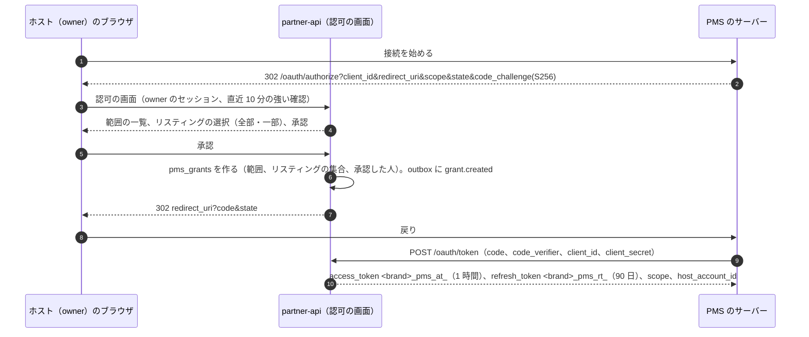
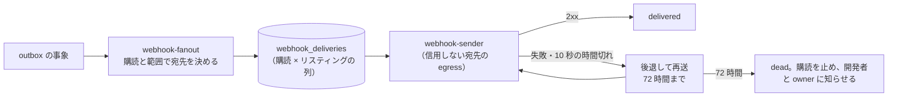

# Host Tools and API: Airbnb

ホストの道具（複数のリスティングの一覧とカレンダー、一括の変更）、共同ホストの役割、PMS・チャネルマネージャー向けの API（OAuth のアプリ、範囲、速さの上限、空室と料金の書き込みと冪等、一括の操作）、Webhook（署名、配信、順序）を決める。

前提となる決定は次のとおり。

- 空室の正本は `stay_claims` で、PMS の書き込みも排他の制約を通る。PMS の専用の近道はない（[ADR-0002](../decisions/0002-availability-representation-and-double-booking.md)、[ADR-0007](../decisions/0007-tenancy-host-accounts-and-rls.md)）
- 予約を作るのは `reserveStay`・`alterReservation` だけ（[ADR-0004](../decisions/0004-booking-state-machine-and-holds.md)）
- ホストのアカウントと共同ホストの役割（`owner`・`full`・`calendar_and_reservations`・`messages_only`）、PMS は OAuth のアプリとしてホストのアカウントの範囲で動く、トークンの接頭辞は `<brand>_pms_`（[ADR-0007](../decisions/0007-tenancy-host-accounts-and-rls.md)、[リポジトリ共通の ADR-0006](../../../../docs/decisions/0006-brand-neutral-identifiers.md)）
- 届出住宅の泊の数えと、外部の予約の泊の扱い（[ADR-0006](../decisions/0006-regulatory-night-cap-enforcement.md)）
- API のバージョンの寿命とアプリのリリースは [delivery.md](delivery.md)（[ADR-0083](../decisions/0083-app-releases-pms-api-versions-and-model-releases.md)）

要件は NFR-003（PMS の書き込みは同期で効く。Webhook の送信まで p95 10 秒）、NFR-005（二重の予約なし）、NFR-010（PMS の API 月間 99.9%）、NFR-016（許した範囲の外のデータを出さない）。法務の確認待ちは L14（取引デジタルプラットフォーム消費者保護法の開示の請求）、L3・L8（名簿と越境のデータを PMS に渡すこと）。この文書で決めたことは次の ADR にある。

| ADR | 決定 |
| --- | --- |
| [0068](../decisions/0068-pms-oauth-apps-scopes-and-rate-limits.md) | PMS は登録した OAuth のアプリとして、ホストのアカウントの `owner` の同意で動く。流れは認可コードと PKCE（S256）。アクセストークン `<brand>_pms_at_`（1 時間）と、使うたびに入れ替えるリフレッシュトークン `<brand>_pms_rt_`（90 日。再使用で一式を取り消す）。同意は範囲と、リスティングの全部か一部を選ぶ。トークンは `app.host_account_id`・`app.host_role = 'pms'`・許したリスティングの集合を `SET LOCAL` で決め、RLS の外へ出ない。速さの上限は（アプリ、ホストのアカウント）ごとのトークンバケット（1 秒 20、瞬間 100）と、アプリ全体の上限（S1 で 1 秒 500）で、書き込みは泊の数で重みを付ける。本番のホストに接続できるのは、運用の審査を通したアプリだけ |
| [0069](../decisions/0069-pms-availability-and-price-push-and-bulk-operations.md) | 空室と料金の書き込みは、範囲の状態を宣言する `PUT` にする。サーバーは、そのアプリが作った `api_block` の行だけを差分で足し引きし、ホストのブロック・取り込み・予約には触れない。リスティングと流れ（空室、料金、滞在の規則）ごとに、アプリが単調に増やす `client_sequence` を持ち、古い番号は 409 `stale_sequence`、同じ番号と同じ本文は前の結果を返す。POST の操作は `Idempotency-Key`（24 時間）。予約との重なりは範囲ごとの結果で `conflict` を返す。一括の操作は JSONL の非同期のジョブ（1 ジョブ 5,000 行、ホストのアカウントごとに同時 2）で、各行を同じ関数と別のトランザクションで流す。ホストの画面の一括の変更も同じジョブの仕組みを使う |
| [0070](../decisions/0070-webhooks-signing-delivery-and-ordering.md) | Webhook は購読ごとに、少なくとも 1 回配る。署名は `<Brand>-Signature: t=<unix>,v1=<HMAC-SHA256>`（秘密は購読ごと、KMS で包む）。リスティングごとに 1 件ずつ送って順序を守り、各事象に `listing_seq` を付ける。失敗は指数の後退で 72 時間まで再送し、その後は止めて開発者とホストに知らせる。本文は ID・種類・バージョンと最小の欄だけで、個人のデータは載せない（詳しくは範囲を確かめる API で取る）。取りこぼしは 7 日分の事象の一覧の API で取り直せる。送信は信用しない宛先への egress の経路から出す |

インフラの形（`partner-api` の入口、信用しない宛先への egress）は [infrastructure.md](infrastructure.md)、トークンと秘密の鍵は [security.md](security.md)、ホストのログインと大事な操作は [accounts.md](accounts.md)、iCal の取り込みとの関係は [calendar-sync.md](calendar-sync.md)、カレンダーの設定と滞在の規則は [availability-and-calendars.md](availability-and-calendars.md)、料金の規則は [pricing-and-fees.md](pricing-and-fees.md) にある。

## 1. 範囲

| 含む | 含まない（置き場所） |
| --- | --- |
| 複数のリスティングの一覧、複数のカレンダーの画面、一括の変更 | カレンダーの設定と滞在の規則の中身（[availability-and-calendars.md](availability-and-calendars.md)） |
| 共同ホストの招待、役割、リスティングごとの範囲 | ホストのアカウントの作り方、ログイン（[accounts.md](accounts.md)） |
| PMS のアプリの登録と審査、OAuth、範囲、トークン、速さの上限 | 鍵の配置と秘密の扱いの全体（[security.md](security.md)） |
| PMS の API（リスティング、空室、料金、滞在の規則、予約、メッセージ）と冪等 | iCal の取り込みと書き出し（[calendar-sync.md](calendar-sync.md)） |
| 一括の操作、Webhook | 料金の規則と見積もり（[pricing-and-fees.md](pricing-and-fees.md)）、メッセージの絞り込み（[messaging.md](messaging.md)） |
| 事業者のホストの表示の情報の入力の枠（法務の L7・L14） | 開示の請求の手順（[trust-and-safety.md](trust-and-safety.md)） |

## 2. 要件

| 出どころ | 要件 | この文書の答え |
| --- | --- | --- |
| [intent.md](../intent.md) の MVP | 複数のリスティングの一覧とカレンダー、一括の料金とブロックの変更、共同ホスト、PMS 向けの API（OAuth、リスティング・カレンダー・料金・予約・メッセージ、Webhook） | 4〜8 節 |
| NFR-003 | PMS の書き込みは同期で効く。本システムの変化から Webhook の送信まで p95 10 秒 | 6.2 節、7 節 |
| NFR-005 | PMS と画面の同時の書き込みでも二重の予約 0 | 6.2 節。どの書き込みも `stay_claims` の排他の制約を通る |
| NFR-010 | PMS の API 月間 99.9% | 9 節 |
| NFR-016 | PMS に許した範囲の外の行・列を出さない | 5.3 節、[quality.md](../quality.md) の 2.2.1 節 H の PMS の行 |
| [quality.md](../quality.md) の 5 節 E19 | PMS の範囲の RLS、API の冪等、Webhook の署名 | 12 節 |
| 法務の L14 | 事業者のホストの情報の開示 | 4.4 節（枠だけ） |

## 3. 本家の形（確かめたこと）

| 項目 | 事実 | この設計 |
| --- | --- | --- |
| 共同ホストの権限 | 3 段：全部（メッセージ、カレンダーの編集、料金と内容、予約の承認・断り・キャンセル、共同ホストの追加）、カレンダーとメッセージ（メッセージとカレンダーの閲覧）、カレンダーだけ（閲覧）。共同ホストは持ち主の送金の方法と税の情報を見られない。全部の権限の共同ホストは、全部の権限の共同ホストを足せない。2023-05-03 より前に足した共同ホストは全部の権限（[ヘルプの記事 1534](https://www.airbnb.com/help/article/1534)、2026-10-10 に確認） | 役割の形は [ADR-0007](../decisions/0007-tenancy-host-accounts-and-rls.md) の 4 つ。本家の「カレンダーだけ（閲覧）」は持たず、カレンダーの編集と予約を任せる役割を持つ（住宅宿泊管理業者と清掃の担当の仕事に合わせた）。共同ホストの管理は `owner` だけ（本家との違い。4.2 節） |
| パスキーでの操作の確かめ | パスキーは、送金の方法の追加などの操作の確かめにも使える（[ヘルプの記事 4094](https://www.airbnb.com/help/article/4094)、2026-10-10 に確認） | 大事な操作の強い確認（[accounts.md](accounts.md)） |
| PMS の API の公開の範囲、審査、速さの上限、Webhook の形 | 公式の資料で確かめられなかった。第三者の記事は「招待の提携先だけ」と書くが、公式ではない（**未検証**） | 本システムは登録と審査で開く（ADR-0068） |
| サービス料の型 | PMS を使うホストはホストだけの型が必須（[ヘルプの記事 1857](https://www.airbnb.com/help/article/1857)、[intent.md](../intent.md) の出典） | 本システムは全ホストがホストだけの型（[architecture/README.md](README.md) の 6 節の決定）なので差はない |

## 4. ホストの道具

### 4.1 複数のリスティングの一覧とカレンダー

| 画面 | 中身 | 上限 |
| --- | --- | --- |
| リスティングの一覧 | 状態（下書き、審査中、公開、停止）、届出住宅、180 日の残り（[ADR-0006](../decisions/0006-regulatory-night-cap-enforcement.md)）、次のチェックイン、外部の食い違いの数、PMS の接続の印 | 1 ホストのアカウント 1 万件。1 ページ 50 件 |
| 複数のカレンダー | 行がリスティング、列が日付。`stay_claims` の種類ごとの色（予約、仮押さえ、リクエスト、ホストのブロック、取り込み、API のブロック、運用のブロック）、泊の料金、最短の泊数の上書き | 1 画面 100 リスティング × 62 日 |
| 予約の一覧 | 今日のチェックインとチェックアウト、リクエストの残り時間、メッセージの未読 | 1 ページ 50 件 |

- 読み出しは core の読み出しの写しから、ホストのアカウントの RLS で引く。カレンダーは `stay_claims` と `calendar_days` を範囲で引き、1 画面 2 回の問い合わせに収める。
- 共同ホストは、自分の役割とリスティングの範囲（4.2 節）の行だけを見る。

### 4.2 共同ホストの役割（DT-HST-001 の草案）

[ADR-0007](../decisions/0007-tenancy-host-accounts-and-rls.md) の 4 つの役割で、操作ごとに許すかを決める。上から順に評価し、最初に一致した行を使う。役割はリスティングごとに絞れる（`host_member_listings` に行があれば、その集合だけ）。

| # | 操作 | `owner` | `full` | `calendar_and_reservations` | `messages_only` | PMS（範囲） |
| --- | --- | --- | --- | --- | --- | --- |
| 1 | ホストのアカウントが停止・`locked` | 拒む | 拒む | 拒む | 拒む | 拒む |
| 2 | 送金の口座の登録・変更、税の情報 | ○（強い確認） | — | — | — | — |
| 3 | 共同ホストの招待・役割の変更・外す | ○（強い確認） | — | — | — | — |
| 4 | PMS のアプリの許可・取り消し | ○（強い確認） | — | — | — | — |
| 5 | 届出住宅の登録、届出番号の変更 | ○（強い確認） | — | — | — | — |
| 6 | 住所・位置の変更 | ○（強い確認） | — | — | — | — |
| 7 | 送金の明細の閲覧 | ○ | ○ | — | — | — |
| 8 | リスティングの内容・写真・設備・ハウスルール | ○ | ○ | — | — | `listings:write` |
| 9 | 料金・カレンダーの設定・ブロック・滞在の規則 | ○ | ○ | ○ | — | `pricing:write`・`calendar:write` |
| 10 | リクエストの承認・断り | ○ | ○ | ○ | — | `reservations:write` |
| 11 | ホストのキャンセル | ○ | ○ | ○ | — | —（MVP は API で受けない） |
| 12 | 宿泊者名簿の閲覧 | ○ | ○ | `registry` の権限を与えたときだけ | — | `guest_registry:read`（`legal.pms_registry_scope_enabled` の後） |
| 13 | メッセージの読み書き | ○ | ○ | — | ○ | `messages:read`・`messages:write` |
| 14 | 正確な住所・チェックインの案内の閲覧 | ○ | ○ | ○ | ○ | `listings:read` |
| 15 | それ以外 | 拒む | 拒む | 拒む | 拒む | 拒む |

- 12 と 13 の行は [regulatory-compliance-japan.md](regulatory-compliance-japan.md) の 8 節（名簿を読める主体）と [messaging.md](messaging.md) の 4.1 節（スレッドの参加者）に合わせた。`registry` の権限は `owner` が成員ごとに与える印（`host_members.registry_access`）。
- 判定は `packages/visibility` の `hostCan(member, action, listing)` の 1 つの関数で行い、RLS のポリシーは同じ表を SQL の関数として持つ（2 つを表駆動テストで突き合わせる）。
- 「強い確認」は [accounts.md](accounts.md) の大事な操作（ADR-0072）。2〜6 は送金の乗っ取りの入口なので `owner` だけに置いた（本家は全部の権限の共同ホストに共同ホストの追加を許す。本システムは許さない）。
- 送金の口座の変更、共同ホストの追加、PMS の許可の後は、`owner` に全経路で知らせる。送金の口座の変更から 72 時間は送金を待たせる（ADR-0007、[accounts.md](accounts.md)）。
- 共同ホストの報酬の分け方（本家の共同ホストの送金）は MVP に持たない。

### 4.3 招待

- `owner` が、メールアドレスか電話番号で招待する。招待は 7 日で失効する 1 回だけのリンク（トークンはハッシュで持つ）。受ける人は本システムのアカウントでログインし、確認済みの電話番号を持つことを求める。
- 1 ホストのアカウントの成員は 50 人まで。招待の送信は 1 日 20 件まで（乗っ取りの後の大量の招待を絞る）。
- 成員を外すと、その人のセッションのホストの権限は 5 秒以内に失効する（[accounts.md](accounts.md) のセッションの取り消しと同じ経路）。

### 4.4 事業者のホストの表示の情報

- 事業者のホスト（`host_accounts.kind = 'business'`）は、名称、所在地、連絡先、代表者を入れる枠を持つ。どの項目をどの画面に出すか、取引デジタルプラットフォーム消費者保護法の開示の請求（第 5 条）にどう応じるかは**法務の確認待ち：L7・L14**。開示の請求の受け付けと判断は [trust-and-safety.md](trust-and-safety.md) が持つ。
- 所在地と連絡先は vault に置き、開示の判断の後の手順でだけ読む（[security.md](security.md)）。

## 5. PMS のアプリ（ADR-0068）

### 5.1 アプリの登録と審査

| 状態 | 接続できるホスト | 移る条件 |
| --- | --- | --- |
| `development` | 開発者が作った試験のホストのアカウント（`sandbox` の印）だけ。上限 10 | 登録 |
| `review` | 同上 | 開発者の申請（用途、範囲の理由、データの置き場所の国、連絡先、Webhook の受け口） |
| `approved` | 全ホスト | 運用の審査（範囲が用途に合うこと、試験の環境で 6 節の冪等と 7 節の署名の検証が通ること） |
| `suspended` | なし（トークンは失効） | 運用の停止（`ops.partner_api_enabled.<app>`、悪用、開発者の要求） |

- 開発者は開発者の組織（`partner_developers`）を持ち、本システムの利用者のアカウントで管理者を置く。管理者のログインはパスキーを必須にする（秘密を作れる人の乗っ取りを防ぐ）。
- アプリは `client_id`、`client_secret` のハッシュ、戻りの URL の一覧、求める範囲、Webhook の署名の秘密（KMS で包む）を持つ。`client_secret` は 256 ビットの乱数で、表示は作った時の 1 回だけ。
- データの置き場所の国は、越境の移転の整理（法務の L8）の材料として記録する。日本の外に置くアプリに、ゲストの個人のデータを含む範囲（`reservations:read` のゲストの欄、`messages:read`、`guest_registry:read`）を許すかは**法務の確認待ち：L8**。結論まで、日本の外のアプリには `messages:read` と予約のゲストの名前の欄を出さない（`legal.pms_cross_border_guest_data`、既定 `deny`）。

### 5.2 同意とトークン



| トークン | 形 | 寿命 | 置き場所 |
| --- | --- | --- | --- |
| 認可コード | 不透明 | 60 秒、1 回だけ。2 回目の使用で、そのコードから出した一式を取り消す | core にハッシュ |
| アクセストークン | `<brand>_pms_at_<base62 43 文字><チェックサム 6 文字>` | 1 時間 | core にハッシュ（SHA-256）。Valkey に 60 秒の写し |
| リフレッシュトークン | `<brand>_pms_rt_<…>` | 90 日。使うたびに入れ替え。再使用で一式（同じ同意のすべてのトークン）を取り消し、開発者と `owner` に知らせる | core にハッシュと一式の ID |

- `redirect_uri` は登録した一覧と完全一致だけ。PKCE は `S256` だけを受ける。
- トークンの接頭辞とチェックサムの形は、シークレットスキャンへの独自の形式の登録に使う（[リポジトリ共通の ADR-0006](../../../../docs/decisions/0006-brand-neutral-identifiers.md)）。漏れの通報を受けたトークンは取り消す。
- `partner-api` は要求ごとに、トークンのハッシュで `pms_grants` を引き、トランザクションの初めに `SET LOCAL app.host_account_id`、`app.host_role = 'pms'`、`app.pms_grant_id` を置く。RLS のポリシーは、`pms_grant_listings` があれば、その集合のリスティングの行だけを許す（[ADR-0007](../decisions/0007-tenancy-host-accounts-and-rls.md)）。
- 同意の取り消し（ホストの画面、`owner` の退会、ホストのアカウントの停止、アプリの停止）は、1 つのトランザクションで `pms_grants.revoked_at` を書き、トークンを全部失効させ、Valkey の写しを消す。5 秒以内に効く。そのアプリの `api_block` の行は残す（外部の予約を表すため。ホストが画面で外せる）。`grant.revoked` を Webhook で送る。

### 5.3 範囲

| 範囲 | 読み書きできるもの | 出さないもの |
| --- | --- | --- |
| `listings:read` | リスティングの内容、写真の URL、設備、ハウスルール、定員、届出番号、状態、正確な住所（ホストのデータ） | — |
| `listings:write` | 内容、写真、設備、ハウスルール、定員 | 住所・位置の変更、届出住宅の変更、公開の状態（`owner` の画面だけ） |
| `calendar:read`・`calendar:write` | 空室（`stay_claims` の種類と範囲。予約の行はゲストの欄なし）、滞在の規則、準備の日、カレンダーの設定 | 他のアプリの `api_block` の `source_ref` |
| `pricing:read`・`pricing:write` | 泊の料金、週末の料金、日付の上書き、長期の割引、清掃料、追加のゲストの料金 | サービス料、税の表 |
| `reservations:read` | 予約の日付、人数、状態、金額（ホストの受け取り）、ゲストの表示の名前（確定の後）、言語 | ゲストのメールアドレス・電話番号・顔の写真・本人確認・支払いの方法 |
| `reservations:write` | リクエストの承認・断り（`Idempotency-Key`） | 予約の作成、ホストのキャンセル（MVP） |
| `messages:read`・`messages:write` | 予約と問い合わせのメッセージ。送信は本システムの絞り込みを通る（[messaging.md](messaging.md)） | 通報の内容 |
| `guest_registry:read` | 宿泊者名簿の項目 | 旅券の画像。範囲そのものは `legal.pms_registry_scope_enabled`（既定 `false`）。**法務の確認待ち：L3・L8** |
| `webhooks:manage` | 購読の作成・変更 | — |

- `write` は同じ資源の `read` を含む。範囲の判定は、`partner-api` の経路ごとの宣言（`requiredScopes`）と、RLS のポリシーの両方で行う。宣言のない経路は CI で拒む。
- 出す欄は、範囲ごとの許可の一覧で直列化する（応答の型が欄を持っていても、範囲になければ落とす）。

### 5.4 速さの上限

| 単位 | 上限 | 超えたとき |
| --- | --- | --- |
| （アプリ、ホストのアカウント） | トークンバケット：1 秒 20 単位、瞬間 100 単位 | 429、`Retry-After`、`X-<Brand>-RateLimit-Remaining`・`-Reset` |
| アプリ全体 | 1 秒 500 単位（S1。審査で 2,000 まで引き上げる） | 同上 |
| 書き込みの重み | 1 要求 1 単位 ＋ 範囲の泊の数 ÷ 31 の切り上げ（730 泊の範囲は 25 単位） | — |
| 1 要求の大きさ | 本文 1 MB、範囲 100 件、1 範囲 366 泊、今日から 730 泊先まで | 413・422 |
| 一括のジョブ | 6.4 節 | — |

- バケットは Valkey の Lua で数える。Valkey が使えないときは `partner-api` のタスクごとの上限（1 タスク 1 秒 50 要求）で絞り、上限を緩めない。
- 値は本システムの初期の値（S1）。PMS の量は capacity の負荷の模型（[capacity.md](capacity.md) の 1 節）で確かめる。

## 6. 空室・料金・規則の書き込み（ADR-0069）

### 6.1 経路

| 経路 | 書くもの | 範囲 |
| --- | --- | --- |
| `PUT /v1/listings/{id}/availability` | そのアプリの `api_block` の行（理由：`external_reservation`・`owner_block`・`maintenance`） | `calendar:write` |
| `PUT /v1/listings/{id}/rates` | `calendar_days` の泊の料金の上書き、週末の料金 | `pricing:write` |
| `PUT /v1/listings/{id}/stay-rules` | 最短・最長の泊数の上書き、チェックイン・アウトの曜日、締め切り、予約できる期間、準備の日 | `calendar:write` |
| `PUT /v1/listings/{id}/external-stays` | 外部の泊の申告（`external_stay_declarations`。[calendar-sync.md](calendar-sync.md) の 7 節）。`stay_claims` に書かない | `calendar:write` |
| `POST /v1/reservations/{id}/accept`・`decline` | リクエストの承認・断り（`transition` を通す） | `reservations:write` |
| `POST /v1/bulk/jobs` | 一括のジョブ（6.4 節） | 行ごとの範囲 |

- どの経路も、ホストの画面と同じドメインの関数（`availability.setApiBlocks`、`pricing.setNightlyRates`、`availability.setStayRules`、`booking.transition`）を呼ぶ。PMS のための別の書き込みの経路を作らない。

### 6.2 空室の書き込みの意味

```json
PUT /v1/listings/0193.../availability
X-<Brand>-Api-Version: 2026-10
{
  "client_sequence": 18342,
  "window": { "start": "2026-10-10", "end": "2027-10-10" },
  "ranges": [
    { "start": "2026-12-28", "end": "2027-01-03", "status": "closed", "reason": "external_reservation", "ref": "BK-7781" },
    { "start": "2027-02-10", "end": "2027-02-12", "status": "closed", "reason": "maintenance" }
  ]
}
```

- **宣言の意味**：`window` の中で、このアプリの `api_block` の行の集合を `ranges` の `closed` の和に揃える。`window` の外と、他の種類の行（予約、仮押さえ、リクエスト、ホストのブロック、取り込み、運用のブロック、他のアプリの行）には触れない。
- **差分**：サーバーは今のこのアプリの行と比べ、消える区間の行を `released` にし、新しい区間の行を挿入する。同じ区間は触れない（`version` が増えない）。1 つの core のトランザクションで行う。
- **重なり**：新しい行の挿入が排他の制約に当たったら、その範囲だけを結果で `conflict` にし、重なった相手の種類（`reservation`・`hold`・`request`・`host_block`・`ical_block`）を返す。他の範囲は書く（範囲ごとの成否。全体を戻さない）。`external_reservation` の理由の重なりは、外部と本システムで同じ夜が売れている恐れなので、`calendar_conflicts` に記録し、ホストに知らせる（[calendar-sync.md](calendar-sync.md) の 6 節の食い違いと同じ扱い。行の形は同じ文書に合わせ、取り込みの ID の代わりにアプリの ID を持つ。本システムの予約は自動で取り消さない）。
- **`open` の意味**：`open` は「このアプリの行を外す」だけで、ホストのブロックや予約を外さない。
- **届出住宅**：`api_block` の行は日を塞ぐだけで、180 日の数えの入力にしない。外部の泊の申告は `external-stays` の経路で別に送る（[calendar-sync.md](calendar-sync.md) の 7 節、[ADR-0006](../decisions/0006-regulatory-night-cap-enforcement.md)）。数えに足すかは `legal.minpaku_count_external_nights`（本番の既定 `none`）。
- **大きな解放の見張り**：1 要求で 180 泊を超える行を `released` にしたら、`availability.mass_release` の監査の事象を書き、`owner` に知らせる（PMS の全件の同期の誤りで、外部の予約が全部消える事故を早く見つける）。書き込みは止めない。
- 応答は、範囲ごとの結果（`applied`・`unchanged`・`conflict`）、リスティングの `calendar_version`、`client_sequence` を返す。書き込みは同期で `stay_claims` に効き（NFR-003）、outbox から索引と写しへ p95 10 秒で効く（NFR-002）。

### 6.3 冪等と順序

PMS は自分の待ち行列から再送し、順序が入れ替わる。古い要求が新しい状態を上書きしないようにする。

| 入力 | 扱い |
| --- | --- |
| `client_sequence` が保存した最後の値より大きい | 適用し、最後の値と本文のハッシュと結果を保存する |
| 同じ値で、本文のハッシュが同じ | 保存した結果を返す（200、`X-<Brand>-Replayed: true`） |
| 同じ値で、本文のハッシュが違う | 409 `idempotency_conflict` |
| 小さい値 | 409 `stale_sequence`（最後の値を返す）。何も変えない |
| `client_sequence` がない | 400 |

- 最後の値は（アプリ、リスティング、流れ）で持つ。流れは `availability`・`rates`・`stay_rules`・`external_stays` の 4 つで、互いに独立。
- 保存は書き込みと同じトランザクションの `pms_write_sequences` の行の `UPDATE ... WHERE last_sequence < $new`。並行の 2 つの要求は行のロックで直列になる。
- POST の操作（承認、断り、一括のジョブの作成、Webhook の購読）は `Idempotency-Key` を求め、（同意、鍵）で 24 時間、同じ本文に同じ結果を返す。本文が違えば 409。
- 承認と断りは、`transition` の `expected_version`（[ADR-0004](../decisions/0004-booking-state-machine-and-holds.md)）を `If-Match` で受けられる。予約がもう `expired`・`cancelled` なら 200 で今の状態を返す（DT-BKG-001 の 1 の行）。

### 6.4 一括の操作

| 項目 | 値 |
| --- | --- |
| 形 | JSONL。1 行 1 操作（`availability`・`rates`・`stay_rules`・`external_stays` の `PUT` と同じ本文と、`listing_id`） |
| 大きさ | 1 ジョブ 5,000 行、10 MB |
| 同時 | ホストのアカウントごとに 2 ジョブ。アプリごとに 20 ジョブ |
| 実行 | `bulk-runner` の Worker が 1 行ずつ、その行の操作の関数を別のトランザクションで呼ぶ。行ごとの `client_sequence` の規則も同じ |
| 速さ | ホストのアカウントごとに 1 秒 50 行。速さの上限のバケットは使わず、ジョブの公平なキューで絞る |
| 結果 | 行ごとの結果の JSONL を S3（`bulk/<host_account_id>/<job_id>.jsonl`）に置き、7 日の署名つきの URL。完了で `bulk_job.completed` |
| 期限 | 6 時間で止める（`failed: timeout`）。済んだ行は戻さない |

- ホストの画面の一括の変更（「選んだ 30 リスティングの 12 月の週末の料金を 2 割上げる」「年末年始を閉じる」）も、画面が同じ形のジョブを作る。1 回で 500 リスティング × 366 日まで。
- 一括のジョブは途中で止めても、済んだ行はそのまま残る。全部が成功したときだけ使える「全部か無か」の形は持たない（1 万泊を 1 つのトランザクションに入れると、熱い日付の予約を待たせるため）。

## 7. Webhook（ADR-0070）

### 7.1 事象

| 事象 | 元 | 本文（最小の欄） |
| --- | --- | --- |
| `reservation.requested`・`.confirmed`・`.altered`・`.cancelled`・`.expired`・`.declined` | `booking` の outbox | 予約の ID、リスティングの ID、日付、人数、状態、`reservation_version` |
| `availability.changed` | `availability` の outbox | リスティングの ID、変わった範囲、`calendar_version`。そのアプリ自身の書き込みによる変化は送らない |
| `calendar.conflict_detected` | `ical-sync`・`availability` | リスティングの ID、範囲、相手の種類 |
| `message.created` | `messaging` | スレッドの ID、メッセージの ID（本文は API で取る） |
| `listing.updated`・`listing.status_changed` | `listings` | リスティングの ID、`listing_version`、状態 |
| `bulk_job.completed` | `bulk-runner` | ジョブの ID、成功と失敗の数 |
| `grant.revoked` | `partner-api` | 同意の ID |

- 本文に個人のデータ（ゲストの名前、メッセージの本文、住所）を載せない。受け手は API で、範囲を確かめて取る。Webhook の秘密が漏れても、個人のデータは漏れない。

### 7.2 署名

```
<Brand>-Signature: t=1791619200,v1=5f2b...e9
X-<Brand>-Event-Id: evt_0193a7c2-...
X-<Brand>-Event-Type: reservation.confirmed
X-<Brand>-Listing-Seq: 4812
```

- `v1` = HMAC-SHA256（購読の秘密、`t` + `.` + 本文のバイト列）の 16 進。受け手は定数時間で比べ、`t` が 5 分より古ければ拒むよう、開発者の文書で求める。
- 秘密は購読ごとの 256 ビットの乱数で、`kms-pms-secrets` で包んで core に置く。入れ替えの間（最長 24 時間）は新旧の 2 つの `v1` を並べて付ける。
- 試験のベクトル（秘密、`t`、本文、期待する署名）を開発者の文書に載せ、本システムの試験でも使う。

### 7.3 配信



- **少なくとも 1 回**：受け手は `X-<Brand>-Event-Id` で重複を除く。
- **順序**：（購読、リスティング）ごとに、送っている事象が 1 つだけになるように送る。前の事象が `delivered` か `dead` になるまで、次を送らない。事象は `listing_seq`（リスティングごとに増える番号）を持つので、受け手は飛びに気づける。リスティングに結び付かない事象（`grant.revoked`、`bulk_job.completed`）は順序を持たない。
- **再送**：30 秒、1 分、2 分、… と倍にし、最大 1 時間の間隔で、最初の試みから 72 時間まで。揺らぎ（±20%）を足す。
- **時間切れ**：接続 3 秒、全体 10 秒。2xx の外（3xx を含む。転送を辿らない）は失敗。
- **購読の停止**：72 時間、成功が 1 件もない購読は `disabled` にし、開発者の管理者と `owner` に知らせる。再開は開発者が行い、止めた間の事象は 7.4 節の一覧の API で取る。
- **速さ**：1 つの受け口へ同時に 20 本まで。受け手が 429・503 を返したら、`Retry-After` を守る。
- 送信は `webhook-sender` だけが行い、信用しない宛先への egress の経路を使う（宛先の URL は開発者が決めるので、SSRF の対策が要る。[infrastructure.md](infrastructure.md) の 2.5 節）。送り元の固定の IP を開発者の文書に載せる。

### 7.4 取りこぼしの取り直し

- `GET /v1/events?since=<event_id>&types=...` で、同意の範囲の事象を 7 日分、古い順に返す（1 ページ 100 件）。Webhook と同じ本文。
- PMS は、Webhook を取りこぼしたと気づいたとき（`listing_seq` の飛び）と、日次の全件の照合に使う。

## 8. メッセージと予約の読み出し

- メッセージの送信（`messages:write`）は、ホストの画面の送信と同じ `messaging.send` を通り、確定の前の連絡先の絞り込みが同じく効く（[messaging.md](messaging.md)）。PMS の自動の文（チェックインの案内）に住所を入れるのは、確定の後の予約のスレッドだけ。
- 予約の一覧は、ホストのアカウントの RLS と同意のリスティングの集合で絞り、カーソルのページング（1 ページ 100 件）。

## 9. 失敗と回復

| 事象 | 影響 | 扱い |
| --- | --- | --- |
| `partner-api` の障害 | PMS の書き込みが失敗する | PMS は自分の待ち行列で再送する。`client_sequence` で古い要求の上書きは起きない。iCal の書き出しは別の経路で続く |
| core の書き込みのフェイルオーバー | 書き込みが 30 秒前後失敗する | 503 と `Retry-After: 5`。結果の不明な要求は、同じ `client_sequence` の再送で、適用済みなら前の結果、未適用なら適用 |
| Valkey の障害 | 速さの上限とトークンの写しがない | タスクごとの上限、トークンは core の読み出しの写しで引く |
| PMS の誤った全件の同期（全部を `open`） | 外部の予約が消え、同じ夜を本システムで売る | 大きな解放の見張り（6.2 節）でホストに知らせる。アプリの行だけが消えるので、ホストのブロックと取り込みは残る |
| 受け手の長い障害 | Webhook の溜まり | 72 時間の再送と停止、7 日の事象の一覧 |
| 悪用（多くのホストの予約を読み集める、書き込みの連打） | 個人のデータの持ち出し、負荷 | アプリ全体の上限、アプリごとの読み出しの量の見張り（[observability.md](observability.md)）、`ops.partner_api_enabled.<app>` で止める（[security.md](security.md) の T6） |
| 同意の取り消しと書き込みの競合 | 取り消しの後に書き込みが通る | トークンの写しは 60 秒だが、書き込みのトランザクションは `pms_grants.revoked_at IS NULL` を同じトランザクションで確かめる |

## 10. 上限

| 対象 | 値 | 持ち場所 |
| --- | --- | --- |
| アクセストークン、リフレッシュトークン、認可コード | 1 時間、90 日、60 秒 | ADR-0068 |
| 速さの上限 | （アプリ、ホスト）1 秒 20・瞬間 100、アプリ 1 秒 500 | ADR-0068 |
| 1 要求 | 1 MB、範囲 100 件、1 範囲 366 泊、730 泊先まで | ADR-0069 |
| `Idempotency-Key` | 24 時間 | ADR-0069 |
| 一括のジョブ | 5,000 行、10 MB、同時 2（ホスト）・20（アプリ）、6 時間 | ADR-0069 |
| Webhook | 時間切れ 10 秒、再送 72 時間、同時 20 本、事象の一覧 7 日 | ADR-0070 |
| 成員と招待 | 50 人、招待 7 日、1 日 20 件 | この文書 |
| 試験のホスト | 開発中のアプリ 1 つに 10 | ADR-0068 |

**本家との意図した違い**（[architecture/README.md](README.md) の 1.4 節に足した。2026-10-10、統合）：共同ホストの管理は `owner` だけ。「カレンダーだけ（閲覧）」の役割はなく、カレンダーと予約を任せる役割を持つ。PMS の API は審査で開く（本家の公開の範囲は**未検証**）。

## 11. data-model への項目

| 置き場所 | 中身 | 鍵・索引 | 節 |
| --- | --- | --- | --- |
| core：`host_member_listings` | 成員の役割を絞るリスティングの集合（`member_id`、`listing_id`）。ホストのアカウントの RLS | 主キー（2 列） | 4.2 |
| core：`host_members` に足す列 | `registry_access`（名簿の権限の印。`owner` が与える） | — | 4.2 |
| core：`host_invitations` | 招待（宛先の HMAC、役割、リスティングの集合、トークンのハッシュ、期限、受けた人） | `token_hash` の一意、`(host_account_id, created_at)` | 4.3 |
| core：`partner_developers`、`pms_apps` | 開発者の組織、アプリ（`client_id`、`client_secret_hash`、戻りの URL、範囲、状態、データの置き場所の国） | `client_id` の一意 | 5.1 |
| core：`pms_grants`、`pms_grant_listings` | 同意（アプリ、ホストのアカウント、範囲、承認した人、作成・取り消し）、許したリスティング | `(app_id, host_account_id)` の部分一意（有効な行） | 5.2 |
| core：`pms_tokens` | トークンのハッシュ、種類、一式の ID、期限、取り消し | `token_hash` の一意 | 5.2 |
| core：`pms_write_sequences` | （アプリ、リスティング、流れ）の最後の `client_sequence`、本文のハッシュ、結果 | 主キー（3 列） | 6.3 |
| core：`pms_idempotency_keys` | （同意、鍵）、本文のハッシュ、結果、期限 24 時間 | 主キー（2 列） | 6.3 |
| core：`stay_claims` の `source_ref` | `api_block` は `pms:<app_id>:<ref>` | — | 6.2 |
| core：`bulk_jobs` | ジョブ（作った主体、行の数、状態、成功・失敗の数、結果の S3 の鍵） | `(host_account_id, status)` | 6.4 |
| content：`webhook_subscriptions` | 購読（同意、URL、事象の種類、包んだ秘密、状態） | `(grant_id)` | 7 |
| content：`webhook_events`、`webhook_deliveries` | 事象（7 日）、配信（購読、リスティング、`listing_seq`、試みの数、次の時刻、状態） | `(subscription_id, listing_id, listing_seq)`、`(status, next_attempt_at)` | 7.3 |
| S3 | `bulk/<host_account_id>/<job_id>.jsonl`（入力と結果。7 日） | — | 6.4 |
| Valkey | `rl:pms:{app_id}:{host_account_id}`、`rl:pms:{app_id}`、`pmstok:{hash}`（60 秒） | — | 5.4 |
| AppConfig | `ops.partner_api_enabled.<app>`、`legal.pms_registry_scope_enabled`、`legal.pms_cross_border_guest_data` | — | 5 |
| outbox の事象 | `grant.created`・`grant.revoked`、`bulk_job.*`、`availability.mass_release` | — | 5、6 |

## 12. テストと性質

| ID（草案） | 内容 | テスト |
| --- | --- | --- |
| DT-HST-001 | 4.2 節の表の全行。`hostCan()` と RLS のポリシーの判定が全行で一致する | 表駆動 |
| PROP-HST-001 | 任意の同意（範囲、リスティングの集合）と要求の列で、PMS のトークンは、同意のホストのアカウントとリスティングの集合の外の行を読めず書けない。範囲の外の欄は応答に出ない | 性質ベース（Testcontainers の PostgreSQL） |
| PROP-HST-002 | 任意の `availability` の要求の列を、重複・順序の入れ替え・欠けで送っても、最後の状態は `client_sequence` の最大の要求を適用した状態に等しい | 性質ベース（並行） |
| PROP-HST-003 | 空室の書き込みは、そのアプリの `api_block` の行の外（予約、ブロック、取り込み、他のアプリの行）を変えない。排他の制約の性質（[quality.md](../quality.md) の 2.2.1 節 A）は PMS の操作を混ぜても成り立つ | 性質ベース |
| PROP-HST-004 | 任意の配信の失敗・時間切れの列で、各事象は `delivered` か `dead` のどちらかになり、（購読、リスティング）の中で `listing_seq` の順に `delivered` になる | 性質ベース（`webhook-sim`、仮想の時計） |
| — | 署名の試験のベクトル、古い `t`、新旧の秘密の並び | 試験のベクトル |
| — | リフレッシュトークンの再使用で一式が取り消される。取り消しから 5 秒の後に 401 | 結合 |
| — | 速さの上限：重みの計算、429 の見出し、Valkey の停止の時のタスクごとの上限 | 単体・結合 |
| — | 一括のジョブ：途中の停止と再開で、各行が 1 回だけ効く | 結合 |
| — | 漏れの経路：PMS の応答と Webhook の本文にゲストの連絡先・本人確認・旅券が出ない（[quality.md](../quality.md) の 2.2.1 節 H） | E2E |

## 13. Story の候補

| Epic | Story | 中身 |
| --- | --- | --- |
| E2 | `host-accounts-and-cohosts` | 4.2・4.3 節。DT-HST-001 |
| E19 | `multi-listing-calendar` | 4.1 節、6.4 節の画面の一括の変更 |
| E19 | `pms-oauth-apps` | 5 節（ADR-0068）。審査の画面 |
| E19 | `pms-api-v1` | 6 節（ADR-0069）。`client_sequence`、範囲ごとの結果 |
| E19 | `bulk-jobs` | 6.4 節 |
| E19 | `webhooks` | 7 節（ADR-0070）。`webhook-sim` |
| E19 | `pms-developer-docs-and-sandbox` | 試験のホスト、署名の試験のベクトル、開発者の文書 |
| E16 | `disclosure-and-takedown-requests`（[trust-and-safety.md](trust-and-safety.md) と共同） | 4.4 節の事業者の情報。法務：L14 |

## 14. 未解決の問い

### 決定（2026-10-10、既定案）

- **PMS のアプリ**：登録と運用の審査、認可コードと PKCE、1 時間と 90 日の入れ替えるトークン、同意でリスティングを絞れる（ADR-0068）。
- **速さの上限**：（アプリ、ホスト）1 秒 20、アプリ 1 秒 500、泊の数の重み（ADR-0068）。
- **空室と料金の書き込み**：宣言の `PUT`、アプリの行だけの差分、`client_sequence`、範囲ごとの結果（ADR-0069）。
- **一括の操作**：JSONL の非同期のジョブ、行ごとのトランザクション（ADR-0069）。
- **Webhook**：少なくとも 1 回、リスティングごとの順序、72 時間の再送、個人のデータを載せない本文、7 日の事象の一覧（ADR-0070）。
- **共同ホスト**：送金・成員・PMS・届出住宅・住所の変更は `owner` だけ。

### 持ち越し

| 問い | いつ・どう決めるか |
| --- | --- |
| PMS に名簿の項目を渡すこと（住宅宿泊管理業者の連携） | **法務の確認待ち：L3・L8** |
| 日本の外に置く PMS にゲストの個人のデータを渡すこと | **法務の確認待ち：L8** |
| 事業者のホストの表示の項目と開示の請求 | **法務の確認待ち：L7・L14** |
| PMS からのホストのキャンセル | E19 の後。ホストのキャンセルの罰（[cancellations-and-changes.md](cancellations-and-changes.md)）を API で見せる形を決めてから |
| PMS の認定の仕組み（旅館業・特区民泊の事業者向けの大規模な連携） | MVP の後（[intent.md](../intent.md) の MVP の後の Epic） |
| 速さの上限の値、PMS の書き込みの量 | E20 の `load-tests`（[capacity.md](capacity.md)） |
| 本家の PMS の API の公開の範囲と形 | **未検証**。確かめられなければ本システムの値のまま |

## 出典

いずれも 2026-10-10 に確認。

- Airbnb, [ヘルプの記事 1534（What Co-Hosts can do）](https://www.airbnb.com/help/article/1534)：共同ホストの 3 段の権限、送金の方法と税の情報は見られない、全部の権限の共同ホストは全部の権限の共同ホストを足せない
- Airbnb, [ヘルプの記事 4094（How passkeys work）](https://www.airbnb.com/help/article/4094)：パスキーで送金の方法の追加などの操作を確かめる
- IETF, [RFC 6749 The OAuth 2.0 Authorization Framework](https://www.rfc-editor.org/rfc/rfc6749)、[RFC 7636 PKCE](https://www.rfc-editor.org/rfc/rfc7636)
- IETF, [RFC 2104 HMAC](https://www.rfc-editor.org/rfc/rfc2104)
