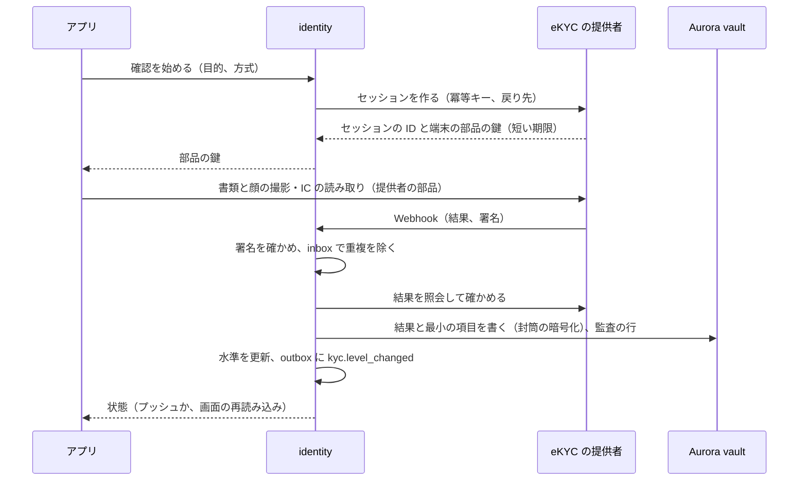
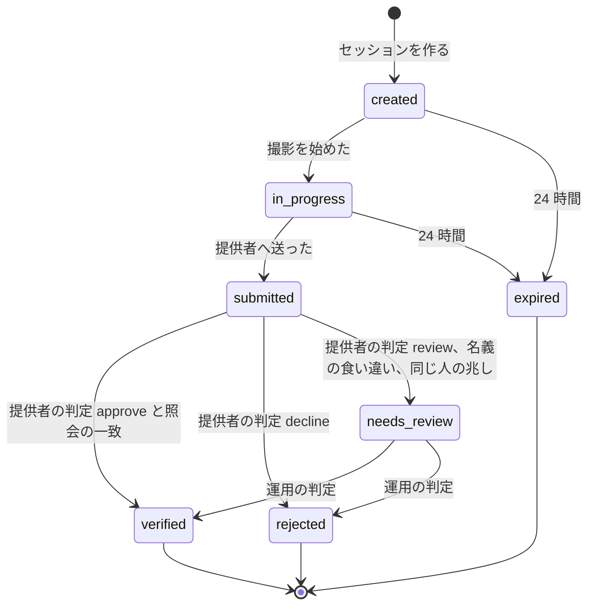
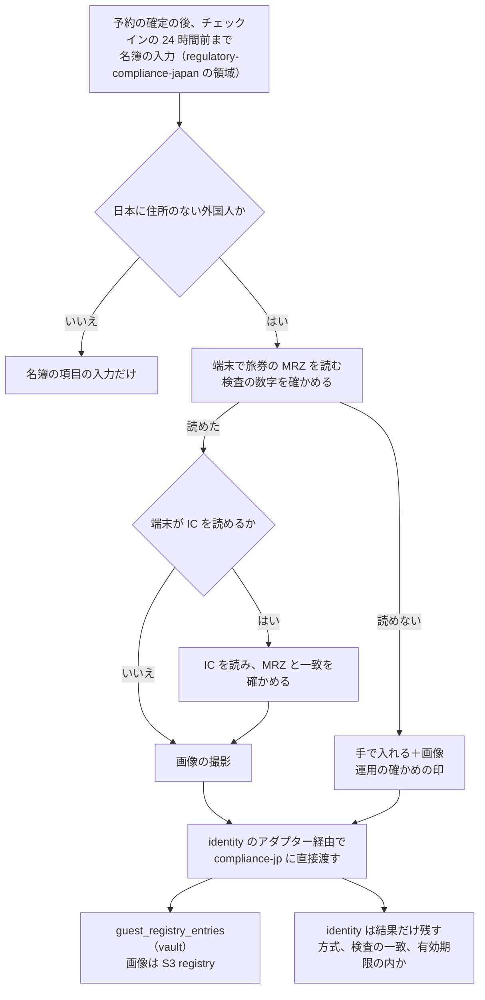

# Identity verification: Airbnb

本人確認。eKYC の提供者の連携、確認の水準、確認を求める規則（ホストの公開の前、ゲストの条件つき）、確認の流れと状態、同じ人の検出、事業者のホストの確かめ、送金の口座の名義の照合、宿泊者名簿のための旅券の読み取りと受け渡し、書類と結果の保存と削除（法務の L3・L8）を決める。

前提となる決定は次のとおり。

- 自前の eKYC（書類の真贋、顔の照合のモデル）は作らない。提供者を使い、本システムは結果と水準を持つ（[intent.md](../intent.md) の Non-goals）
- ホストは公開の前に本人確認が必須。ゲストは、日本の物件の名簿のため、チェックインの前に名簿の項目と旅券（日本に住所のない外国人）を入れる。eKYC の確認は規則で求める（初めての予約、高額、危険の点）（[architecture/README.md](README.md) の 6 節）
- 本人確認の結果は vault に置き、`identity` が書く（[ADR-0001](../decisions/0001-platform-and-stack.md)）。宿泊者名簿と旅券の画像は `compliance-jp` が vault と S3 の `registry` に置く（regulatory-compliance-japan の領域の [ADR-0067](../decisions/0067-guest-registry-in-vault.md)、security の領域の [ADR-0073](../decisions/0073-key-layout-and-vault-envelope-encryption.md)）
- 確認の水準と方式の分け方は Mercari の題材を参照する（[ADR-0056](../../../mercari/docs/decisions/0056-ekyc-provider-and-verification-levels.md)、[ADR-0057](../../../mercari/docs/decisions/0057-identity-data-minimization-and-retention.md)）

この文書で決めたことは次の ADR にある。

| ADR | 決定 |
| --- | --- |
| [0062](../decisions/0062-verification-levels-gates-and-provider-adapter.md) | 確認の水準は `none`・`contact_verified`・`id_verified`（書類と顔の照合、またはマイナンバーカードの IC の読み取り）と、事業者の印 `business_verified`。どの機能に何を求めるかは `kyc_gates`（バージョンの付いた表）に書き、各サービスは `identity` の `kycLevel()` と表で判定する。提供者は自前のアダプターの後ろに置き、結果は署名を確かめた Webhook と照会の両方で受け、本システムは結果と最小の項目だけを vault に残す |
| [0063](../decisions/0063-passport-capture-for-guest-registry.md) | 名簿のための旅券の読み取りは、端末で MRZ を読み（検査の数字を確かめる）、読めれば IC の読み取りを足し、画像と項目を `identity` のアダプター経由で `compliance-jp` に直接渡す。`identity` は旅券の画像と番号を残さず、確かめた結果（方式、国籍の一致、有効期限の内か）だけを持つ。旅券の番号はログ・事象に出さない |

## 1. 範囲

- 扱う：水準と方式、`kyc_gates`、確認の流れと状態、提供者のアダプター（セッション、Webhook、照会）、再確認と期限、同じ人の検出の信号、事業者のホストの確かめ、送金の口座の名義の照合、名簿のための旅券の読み取りの流れと受け渡し、本人確認の記録の持ち方と削除、法令の枠組み。
- 扱わない：
  - 宿泊者名簿の項目・保存・照会（regulatory-compliance-japan の領域）。この文書は旅券の読み取りと受け渡しを書く。
  - vault の鍵、運用者が見る操作（security の領域）。
  - 確認を求める T&S の規則（[trust-and-safety.md](trust-and-safety.md) の 5 節）。この文書は水準を返す。
  - ログイン、アカウントの回復（accounts の領域）。
  - 送金の口座の登録と実行（ledger-and-payouts の領域）。

## 2. 事実（確かめたこと）

| 項目 | 事実 | この設計 |
| --- | --- | --- |
| 宿泊者名簿の項目と保存 | 本人確認のうえ作り、作成日から 3 年保存する。日本に住所のない外国人は国籍と旅券の番号（観光庁 [住宅宿泊事業者の義務](https://www.mlit.go.jp/kankocho/minpaku/business/host/index.html)） | 旅券の読み取りの項目（6 節）。保存は regulatory-compliance-japan の領域 |
| 本家の旅券の扱い | ホストは外国人の国籍と旅券の番号を記録し、旅券の写しを保存する（[ヘルプの記事 2274](https://www.airbnb.com/help/article/2274)。2021-03-31 時点の一般の情報） | 本システムが電子の名簿に取り込む（法務の L3） |
| MRZ の検査の数字 | ICAO 9303 の機械読み取りの欄は、数字と文字の値に 7・3・1 の重みを順に掛けた和の 10 の剰余を検査の数字にする。例の旅券（架空の国の見本）の番号 `L898902C3` の検査の数字は 6 | 6.2 節の検査。規格の本文のバージョンの確かめは E17 で行う（**未検証**） |
| Mercari の題材の水準 | `unverified`・`verified_document`・`verified_ic`。非対面の書類と容貌の画像の方式（「ホ」方式）が 2027 年 4 月 1 日から使えなくなることは、法律事務所の解説だけで確かめた（**未検証**） | 方式を `method` で持ち、水準との対応を設定にする（4 節）。本システムが取引時確認の義務を負うかは L6 |
| 本家の本人確認の方式 | 公式の資料で確かめられなかった（**未検証**） | 本システムの水準 |

いずれも 2026-10-10 に確認（MRZ の検査の数字は、上の見本の値を 6.2 節で計算して確かめた）。

## 3. 要件

| 要件 | 値 | 出どころ |
| --- | --- | --- |
| ホストの公開 | 本人確認の済んでいないホストのアカウントのリスティングの公開 0 | [listings-and-content.md](listings-and-content.md) の 4.2 節 |
| 書類の漏れ | 本人確認の書類・旅券が他の利用者に出た事象 0 | NFR-016 |
| ログ | 旅券の番号・書類の画像の参照・生年月日がログに 0 件 | [AGENTS.md](../../AGENTS.md) |
| 確認の速さ | 提供者の判定の結果を受けてから水準に効くまで p95 10 秒 | 本システムの値 |
| `step_up` の中で済む | 予約の確認の画面の中の本人確認を、見積もりの期限（15 分）の中で終えられる。提供者の自動の判定 p95 3 分を選定の条件にする | [trust-and-safety.md](trust-and-safety.md) の 5.2 節 |

## 4. 水準と方式（ADR-0062）

| 水準 | 方式 | 中身 |
| --- | --- | --- |
| `none` | - | 何も確かめていない |
| `contact_verified` | `email_phone` | メールアドレスと電話番号の確認（accounts の領域） |
| `id_verified` | `document_face`、`jp_ic_card`、`passport_nfc` | 本人確認の書類（運転免許証、在留カード、マイナンバーカード、旅券）の撮影と顔の撮影の照合（提供者の判定）、マイナンバーカードの IC の読み取り（公的個人認証）、旅券の IC の読み取りと顔の照合 |
| 印 `business_verified` | `corporate_number` | 事業者のホストの法人番号と、代表者か担当者の `id_verified`（7 節） |

- 公開のプロフィールの印は「本人確認済み」の 1 つ（方式を出さない）。
- 方式ごとの法令の扱い（犯罪収益移転防止法の取引時確認の方式に当たるか、2027 年 4 月 1 日の後に使える方式か）と、本システムが確認の義務を負うかは法務の確認待ち（L6、L3）。`kyc_gates` は水準で条件を書くので、結論で水準と方式の対応を替えればよい。
- 海外のゲストは `document_face`（旅券）か `passport_nfc` を使う。

### 4.1 `kyc_gates`（バージョンの付いた表）

| 機能 | 条件 | 本番の値 |
| --- | --- | --- |
| リスティングの公開 | ホストのアカウントの `owner` が `id_verified`。事業者のホストは `business_verified` | 方針（本家に寄せる） |
| 送金の口座の登録と変更 | `owner` が `id_verified`、口座の名義が確認の名義と合う（8 節） | 方針 |
| 共同ホストの追加 | 追加される人が `contact_verified` 以上 | 方針 |
| ゲストの予約 | `contact_verified` | 方針 |
| ゲストの予約（総額 300,000 円以上） | `id_verified` | 方針。値は設定 |
| ゲストの予約（T&S の `step_up`） | `id_verified` | [trust-and-safety.md](trust-and-safety.md) の 5.2 節 |
| 日本の物件の名簿の入力（日本に住所のない外国人） | 旅券の読み取り（6 節） | 法務の確認待ち（L3） |

- 表を変えたらバージョンを上げ、`kyc.gates_changed` を出す。判定は実行の場所（予約は `booking`、公開は `listings`）で行い、`identity` は水準だけを返す。

## 5. 流れと状態

### 5.1 確認の流れ



- 書類と顔の画像は、提供者の部品から提供者へ直接送る。本システムのサーバーを通さない。
- 提供者の Webhook は inbox で重複を除き、照会で結果を確かめてから水準を変える（Webhook だけを信じない）。
- 提供者に残る画像の保存の期間と削除の依頼は、契約で決める（選定の条件。9 節）。

### 5.2 状態



- `rejected` の理由は種類（書類が読めない、顔が合わない、書類の期限切れ）で本人に示す。何度でもやり直せるが、24 時間に 3 回まで。超えたら運用の確かめ。
- `verified` は、書類の有効期限を過ぎても水準を下げない（確かめた時点の事実）。ただし事業者の印は年 1 回の確かめをやり直す。
- 名前・生年月日の変更（結婚など）は、確認をやり直して名義を差し替える。

### 5.3 同じ人の検出

- 確かめた氏名（正規化した読み）と生年月日から、`identity` の鍵の HMAC（`person_key`）を作り、vault に置く。同じ `person_key` を持つ別のアカウントは T&S の信号（停止したアカウントの作り直し、複数のアカウントでの不正）にする。
- `person_key` を使う範囲（停止の回避の検出だけか）は法務の確認待ち（L8）。開発・検証の環境でだけ有効にし、本番は `legal.person_key_enabled` の後。

## 6. 名簿のための旅券の読み取り（ADR-0063）

### 6.1 流れ



- 旅券の画像と番号は、`identity` のプロセスのメモリーを通るだけで、`identity` の表・ログ・事象に残さない。保存は `compliance-jp`（[ADR-0067](../decisions/0067-guest-registry-in-vault.md)）。
- 名簿の本人確認の方法（対面の代わりの ICT の方法の要件：顔の照合が要るか）は法務の確認待ち（L3）。方式の欄（`mrz_only`・`mrz_nfc`・`mrz_nfc_face`）を持ち、結論で求める方式を `legal.registry_identity_method` で決める。
- 共同の宿泊者（同行者）の旅券も、予約したゲストが入れるか、本人が自分の端末で入れる。

### 6.2 MRZ の検査

TD3（旅券）の 2 行目の、旅券の番号・生年月日・有効期限の各欄と、全体の検査の数字を確かめる。

```
値：数字はその値、A〜Z は 10〜35、< は 0
検査の数字 = (Σ 値_i × 重み_i) mod 10、重みは 7・3・1 の繰り返し
```

**例**（ICAO の見本の架空の旅券）：番号 `L898902C3`

| 文字 | L | 8 | 9 | 8 | 9 | 0 | 2 | C | 3 |
| --- | --- | --- | --- | --- | --- | --- | --- | --- | --- |
| 値 | 21 | 8 | 9 | 8 | 9 | 0 | 2 | 12 | 3 |
| 重み | 7 | 3 | 1 | 7 | 3 | 1 | 7 | 3 | 1 |
| 積 | 147 | 24 | 9 | 56 | 27 | 0 | 14 | 36 | 3 |

- 和 316、316 mod 10 = **6**。読んだ検査の数字が 6 でなければ読み直す。
- 生年月日 `740812`：7×7 + 4×3 + 0×1 + 8×7 + 1×3 + 2×1 = 122 → **2**。有効期限 `120415`：1×7 + 2×3 + 0×1 + 4×7 + 1×3 + 5×1 = 49 → **9**。
- 有効期限が宿泊の日より前なら、入力の画面に注意を出す（止めるかは L3）。
- 試験には見本の値だけを使い、実在の旅券を使わない（[AGENTS.md](../../AGENTS.md)）。

## 7. 事業者のホスト

- 事業者のホストは、法人番号（13 桁、検査の数字つき）を入れ、国税庁の法人番号の公表のデータで名称と所在地を確かめる（利用の条件は E17 で確かめる。**未検証**）。代表者か、委任を受けた担当者が `id_verified` を済ませる。委任の書類は運用が確かめる。
- 事業者のホストの表示の義務（特定商取引法）は [listings-and-content.md](listings-and-content.md) の 9 節（L7）。

## 8. 送金の口座の名義の照合

- 送金の口座の名義（カナ）と、確認の名義の読み（カナ）を、NFKC、全角カナ、空白の除去、小さい文字の揃え（「ャ」→「ヤ」）、長音の除去で正規化して比べる。事業者は法人の名称の読み（「カ）」などの略語の表で揃える）。
- 一致しなければ口座を登録せず、`needs_review`（運用の確かめ）。
- 判定は `payouts` が呼ぶ `identity.nameMatches(user_id, account_holder_kana)`。名前そのものを `payouts` に返さない。

## 9. 記録の持ち方と削除（枠組み。法務の確認待ち L3・L8）

| 記録 | 置き場所 | 持つもの | 保持の既定 |
| --- | --- | --- | --- |
| 確認の結果 | vault `identity_verifications` | 水準、方式、書類の種類、発行の国、提供者の参照、判定、日時、確認の名義（氏名・読み）、生年月日（封筒の暗号化） | アカウントの退会から `legal.kyc_result_retention_days`（開発・検証の既定 2,555 日）|
| 書類と顔の画像 | 提供者 | 本システムは持たない | 契約で、判定から 30 日以内の削除を求める（選定の条件） |
| 旅券の番号と画像 | `compliance-jp`（名簿） | regulatory-compliance-japan の領域 | 作成から 3 年を下限（security の領域の [ADR-0075](../decisions/0075-data-classes-and-retention.md)） |
| `person_key` | vault | HMAC | 結果と同じ |
| セッションの記録 | content `kyc_sessions` | 状態、時刻、理由のコード（個人の項目なし） | 1 年 |

- 保持の値は本システムの既定で、法務の L3・L8 の結論で置き換える。削除は security の領域の `retention-sweeper` が行う。
- 越境：海外の提供者に画像が渡る場合の扱い（L8）は選定の条件にする。

## 10. 失敗と回復

| 事象 | 影響 | 扱い |
| --- | --- | --- |
| 提供者の停止 | 確認ができない | ホストの公開は待たせる。ゲストの `step_up` は、予約をリクエストに回す（ホストの承認の間に確かめる）か、後で確かめる。名簿の旅券は手で入れて画像だけを上げる（regulatory-compliance-japan の領域） |
| Webhook の欠け | 結果が届かない | `submitted` が 15 分を超えたら照会する |
| Webhook の偽造 | 誤った水準 | 署名の確かめと照会の両方で一致したときだけ効かせる |
| 提供者の誤った approve | 他人のなりすまし | 通報と T&S の審査で `needs_review` に戻し、水準を下げる（措置の手順） |
| 提供者の切り替え | 確認のやり直し | 既存の `verified` は保つ。新しい確認から新しい提供者 |

## 11. 上限

| 対象 | 値 |
| --- | --- |
| 確認のやり直し | 24 時間に 3 回 |
| セッションの期限 | 24 時間 |
| 旅券の画像 | 1 人 2 枚、1 枚 10 MiB（regulatory-compliance-japan の領域と同じ） |
| 名義の照合の失敗 | 1 日 5 回で運用の確かめ |

## 12. data-model への項目

| 置き場所 | 中身 | 節 |
| --- | --- | --- |
| Aurora vault `identity_verifications`（`id`、`user_id`、`level`、`method`、`document_type`、`issuing_country`、`provider`、`provider_ref`、`decision`、`verified_name`・`verified_name_kana`・`birth_date`（封筒の暗号化）、`verified_at`） | 結果 | 9 |
| Aurora vault `person_keys`（`user_id`、`person_key`） | 同じ人 | 5.3 |
| Aurora core `users.kyc_level`、`users.kyc_level_changed_at`、`host_accounts.business_verified_at` | 水準の写し（判定のため） | 4 |
| Aurora content `kyc_sessions`（`id`、`user_id`、`purpose`、`method`、`state`、`reason_code`、`created_at`、`updated_at`）、`kyc_inbox`（`provider_event_id` 一意） | セッション | 5 |
| Aurora core `kyc_gate_versions`、`kyc_gates` | 表 | 4.1 |
| Aurora vault `passport_capture_results`（`registry_entry_id`、`method`、`mrz_checks_ok`、`nfc_ok`、`not_expired_on_stay`） | 旅券の読み取りの結果（番号と画像なし） | 6 |
| outbox の話題 `kyc.level_changed`、`kyc.gates_changed` | 事象 | 4、5 |
| AppConfig `legal.registry_identity_method`、`legal.kyc_result_retention_days`、`legal.person_key_enabled` | 設定 | 6、9 |

## 13. テストと性質

| ID | 性質・試験 |
| --- | --- |
| PROP-KYC-001 | 任意の Webhook の列（重複、順序の入れ替え、偽の署名、照会との食い違い）で、水準が上がるのは署名が正しく照会と一致したときだけ |
| PROP-KYC-002 | `kyc_gates` の判定は、任意の水準と機能で表の参照の実装と一致する。`owner` が `id_verified` でないホストのアカウントのリスティングは公開されない |
| PROP-KYC-003 | `identity` の表・ログ・事象・データレイクに、旅券の番号・書類の画像・生年月日の平文がない（漏れの経路の表、[quality.md](../quality.md) の 2.2.1 節 H） |
| PROP-KYC-004 | MRZ の検査の数字の関数は、任意の 1 文字の書き換えを見つける（数字の 1 桁の誤り） |
| PROP-KYC-005 | 名義の照合は、正規化の前後の表記の揺れ（全角半角、小さい文字、空白）で結果が変わらない |
| 試験のベクトル | 6.2 節の見本の値、名義の照合の表、提供者の模型の判定（approve、decline、review、時間切れ） |

## 14. Story の候補

| Epic | Story | 中身 |
| --- | --- | --- |
| E17 | `kyc-provider-selection` | 提供者の選定（方式、旅券の IC、判定の速さ、画像の削除、データの所在）（5、9 節） |
| E17 | `verification-levels` | 水準、`kyc_gates`、アダプター、状態、ホストの公開の前の必須（4、5 節） |
| E17 | `passport-capture` | MRZ と IC の読み取り、`compliance-jp` への受け渡し。法務：L3・L8（6 節） |
| E17 | `kyc-document-retention` | 記録の持ち方と削除。法務：L3・L8（9 節） |
| E17 | `business-host-verification` | 法人番号、担当者の確認（7 節） |
| E12 | （ledger-and-payouts の領域へ）口座の名義の照合 | 8 節の関数を使う |

## 15. 未解決の問い

### 決定（2026-10-10、既定案）

- **水準**：`none`・`contact_verified`・`id_verified` と `business_verified`、`kyc_gates` の表（ADR-0062）。
- **旅券**：端末の MRZ と IC、`compliance-jp` に直接渡し、`identity` は結果だけ（ADR-0063）。
- **ゲストの高額の基準**：総額 300,000 円以上で `id_verified`（本システムの値）。

### 持ち越し

| 問い | いつ・どう決めるか |
| --- | --- |
| 名簿の本人確認の方法（顔の照合が要るか）、旅券の写しの保存 | 法務の確認待ち（L3） |
| 方式の法令の扱い、本システムが取引時確認の義務を負うか | 法務の確認待ち（L6・L3） |
| 書類と結果の保存の期間、越境、`person_key` の使い方 | 法務の確認待ち（L8） |
| 提供者と、画像の削除・データの所在の契約 | E17 の `kyc-provider-selection` |
| 法人番号の公表のデータの利用の条件 | E17 で確かめる（**未検証**） |
| 高額の基準（300,000 円） | S1 の運用で T&S と PM が見直す |
