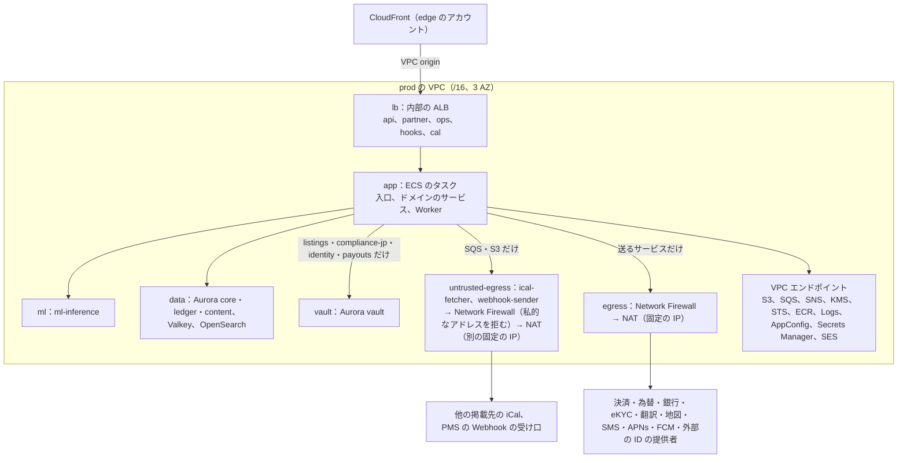
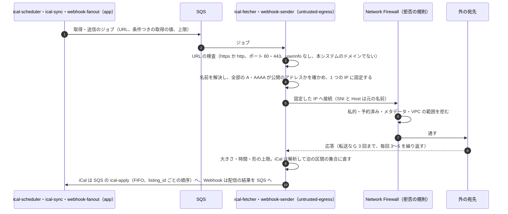
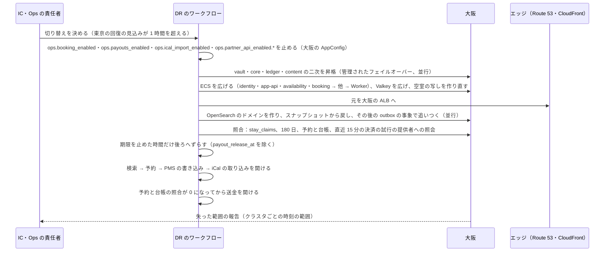

# Infrastructure: Airbnb

AWS のアカウントとネットワーク、エッジ、4 つの Aurora（core・ledger・content・vault）、Valkey（空室の写しのビット列ほか）、OpenSearch、ML の推論（Python）の境界、決済・為替・銀行・eKYC の提供者への送信（egress）と Webhook の受け口、信用しない宛先（他の掲載先の iCal、PMS の Webhook の受け口）への送信と SSRF の守り、大阪への DR、段階を上げる基準と分け方、予約 1 件の原価を決める。

前提となる決定は次のとおり。

- 共通の基盤と、core・ledger・content・vault の 4 クラスタ、ML だけ Python、検索は OpenSearch（[ADR-0001](../decisions/0001-platform-and-stack.md)）
- 予約は core の 1 つのトランザクション、お金は ledger の 1 つのトランザクション（[ADR-0004](../decisions/0004-booking-state-machine-and-holds.md)、[ADR-0005](../decisions/0005-payments-hold-capture-and-ledger.md)）
- 空室の写しは Valkey の 2 年分のビット列、検索は 2 段（[ADR-0003](../decisions/0003-search-for-date-range-availability.md)）
- ML の出力は点と理由のコードだけ（[ADR-0009](../decisions/0009-trust-and-safety-and-ml-boundary.md)）
- 鍵の配置（[ADR-0073](../decisions/0073-key-layout-and-vault-envelope-encryption.md)）
- 取り込む iCal は信用しない入力で、私的なアドレスへの接続を拒む（[AGENTS.md](../../AGENTS.md)）

要件は NFR-010（可用性）、NFR-011（AZ の障害で RPO 0・RTO 5 分、リージョンの障害で RPO 1 分・RTO 1 時間）、NFR-001・NFR-004（速さ）、NFR-016（場所と身元）。この文書で決めたことは次の ADR にある。

| ADR | 決定 |
| --- | --- |
| [0076](../decisions/0076-accounts-network-and-egress-with-ssrf-controls.md) | 本番の作業負荷は 1 つの本番のアカウントの 1 つの VPC（3 AZ）に置き、サブネットを `lb`・`app`・`ml`・`data`・`vault`・`egress`・`untrusted-egress` に分ける。データレイクと学習は別の `data` のアカウント。信頼する宛先（決済・為替・銀行・eKYC・翻訳・地図・SMS・メール・プッシュ・外部の ID の提供者）への送信は、送るサービスだけに許し、Network Firewall の名前の許可の一覧と AZ ごとの固定の IP の NAT を通す。信用しない宛先（他の掲載先の iCal、PMS の Webhook の受け口）への送信は、DB に触れない `ical-fetcher` と `webhook-sender` だけが、別のサブネット・別の固定の IP の NAT から行い、Network Firewall で私的・予約済み・メタデータのアドレスを拒み、アプリでも名前の解決の結果を確かめて固定した IP に接続し、転送ごとに確かめ直す。iCal の解析は `ical-fetcher` の中で行い、泊の区間の集合だけを SQS で `ical-sync` に渡す |
| [0077](../decisions/0077-data-stores-layout-and-osaka-dr.md) | Aurora は 4 クラスタとも書き込み 1 と別の AZ の読み出し（core は 2）、自動のバックアップ 35 日、Global Database で大阪へ。ledger だけ `rds.global_db_rpo = 60` を置く。vault は別のサブネットと、4 サービスのセキュリティグループだけの接続。Valkey はクラスタモードで、空室の写し（`avail:{listing_id}`）・見積もりの写し・セッション・先着の印・速さの上限を持ち、失ってよい。OpenSearch は 1 つのドメイン（リスティングと地名の索引）で、大阪はスナップショット。大阪はウォームスタンバイで、切り替えは予約・PMS の書き込み・iCal の取り込み・送金を止める → 4 クラスタの昇格 → 広げる → 照合（`stay_claims`、180 日、予約と台帳、直近の決済の照会）→ 検索 → 予約 → PMS → iCal → 送金の順に開ける。期限は止めた時間だけ後ろへずらす（送金の振り替えの時刻を除く） |
| [0078](../decisions/0078-stage-up-criteria-split-plan-and-unit-cost.md) | 段階を上げる基準を 10 の指標で月次に見て、上限の 60% で準備を始める。S2 で OpenSearch を地域ごとの索引に分け、Valkey のシャードを足し、core の読み出しの写しを増やし、content を種類ごとに分ける。S3 で core を `core-accounts`（利用者）と `core-stays`（置き場所の鍵＝届出住宅に結んだリスティングは届出住宅の ID、他はリスティングの ID のハッシュで 16。リスティング・`stay_claims`・予約・届出住宅・`regulated_nights` を同じ分け先）に分け、ledger を口座の持ち主のハッシュで分ける。予約 1 件の原価は、予約の経路だけで S1 約 2 円、全原価の按分で約 36 円と見込み、[architecture/README.md](README.md) の 2.1 節の目標（30 円以下）を予約の経路の定義で満たす |

負荷と台数の根拠は [capacity.md](capacity.md)、CI とデプロイは [delivery.md](delivery.md)、計測は [observability.md](observability.md)、鍵と運用者のアクセスは [security.md](security.md)、iCal の取り込みの中身は [calendar-sync.md](calendar-sync.md)、Webhook の中身は [host-tools-and-api.md](host-tools-and-api.md) にある。「初期見積もり」は負荷試験と PoC の前の仮の値である。AWS の仕様で確かめていないものは「未検証」と書く。

## 1. AWS アカウント

ADR-0076。

| アカウント | OU | 中身 |
| --- | --- | --- |
| management | Root | Organizations、SCP、IAM Identity Center、請求 |
| security | Security | GuardDuty・Security Hub・Inspector の委任管理者 |
| log-archive | Security | 組織の CloudTrail、Config、VPC フローログ、Network Firewall のログ、監査の写し（Object Lock。[security.md](security.md) の 6.4 節）、Session Manager の記録。大阪へ写す |
| shared | Infrastructure | ECR（東京・大阪へ写す）、Route 53（`<brand>.<domain>`）、Terraform の状態のバケット、銀行への Site-to-Site VPN（求められたとき） |
| edge | Infrastructure | CloudFront、WAF、ACM（us-east-1） |
| observability | Infrastructure | AMP、Managed Grafana、CloudWatch のまとめ、アラートの送り先 |
| canary | Infrastructure | 外からの見張り（[observability.md](observability.md) の 4 節）と負荷の生成。本番と別の資格情報 |
| data | Workloads/Data | データレイク（S3、Glue、Athena）、学習のジョブ、モデルの登録簿。本番の DB に経路を持たない |
| prod | Workloads/Prod | 本番の作業負荷（2・4 節） |
| staging | Workloads/NonProd | 本番と同じ形を小さく。負荷試験と DR の訓練のときだけ広げる |
| dev | Workloads/NonProd | 開発。PMS の開発者の試験の環境（`sandbox` の API）もここに置く |

- 本番を 1 つのアカウントにする。S1〜S2 の部品の数はアカウントの既定の上限に収まる見込み。S3 で core を分けるとき、上限を見て `prod-stays` のアカウントを足すかを決める（8 節）。
- **SCP**（Workloads の OU）：東京（ap-northeast-1）・大阪（ap-northeast-3）以外のリージョンを禁止する（CloudFront・WAF・ACM・IAM の us-east-1 を除く）。CloudTrail・Config・GuardDuty の停止、KMS の鍵の削除の予約と無効化、Object Lock の解除、バケットのバージョニングの停止を、break-glass の外に禁止する。
- データの所在（東京・大阪）は [intent.md](../intent.md) の制約。

## 2. ネットワーク

ADR-0076。

### 2.1 本番の VPC

| サブネット | 置くもの | 入る側 | 出る側 |
| --- | --- | --- | --- |
| `lb` | 内部の ALB（`api`、`partner`、`ops`、`hooks`、`cal`） | CloudFront の VPC origin | `app` |
| `app` | ECS のタスク（入口、ドメインのサービス、Worker） | `lb` | `data`、`vault`（4 サービスだけ）、`ml`、VPC エンドポイント、`egress`（送るサービスだけ） |
| `ml` | `ml-inference` | `app` の `trust-safety`・`pricing`・`search-api` | VPC エンドポイントの S3（モデルの読み）だけ |
| `data` | Aurora core・ledger・content、Valkey、OpenSearch | `app` | なし |
| `vault` | Aurora vault | `app` の `listings`・`compliance-jp`・`identity`・`payouts` のセキュリティグループだけ | なし |
| `egress` | Network Firewall、NAT（信頼する宛先） | `app` | インターネット（許可の一覧の名前だけ） |
| `untrusted-egress` | `ical-fetcher`、`webhook-sender` のタスク、Network Firewall、NAT（別の固定の IP） | なし（SQS からジョブを取る） | インターネット（2.5 節の拒否の規則）、VPC エンドポイントの SQS・S3・KMS（`kms-pms-secrets` の復号だけ）・Logs |

- アドレス：VPC は `/16`、各サブネットは AZ ごとに `/20`。
- セキュリティグループは役割ごと。`vault` と `egress` へのルートを持つのは決めたセキュリティグループだけで、plan のポリシー検査で他を拒む（6 節）。
- `vault` のサブネットの NACL は、`app` のサブネットからの PostgreSQL の通信だけを通す（セキュリティグループと二重）。

### 2.2 入口とホスト名

| ホスト名 | 入口 | 元 |
| --- | --- | --- |
| `<brand>.<domain>` | CloudFront（Web） | S3（Web の資産）、`app-api` の ALB |
| `api.<brand>.<domain>` | CloudFront（API。キャッシュしない） | `app-api` の ALB |
| `partners.<brand>.<domain>` | CloudFront（PMS の API と認可の画面） | `partner-api` の ALB |
| `img.<brand>.<domain>` | CloudFront（写真） | S3（変換の後の写真） |
| `cal.<brand>.<domain>` | CloudFront（iCal の書き出し。秘密のアドレス、短いキャッシュ） | S3（書き出し）、作り直しは `ical-sync`（[calendar-sync.md](calendar-sync.md)） |
| `hooks.<brand>.<domain>` | CloudFront（提供者の Webhook） | `hooks` の ALB → `payments`・`payouts`・`identity` の受け口 |
| `ops.<brand>.<domain>` | CloudFront（運用の画面） | S3（画面の資産）、`ops-api` の ALB |
| `mail.<brand>.<domain>` | SES の送り元（DNS だけ） | — |

### 2.3 Webhook の受け口

- 決済の提供者・提携銀行・eKYC の提供者の通知は `hooks.<brand>.<domain>` の別の配信で受ける。WAF で本文の大きさ（256 KB）と速さを絞り、提供者が送り元の IP を公開していれば IP の許可の一覧を足す。
- 受け口は署名を確かめ、inbox に一度だけ入れて 200 を返す（[ADR-0005](../decisions/0005-payments-hold-capture-and-ledger.md)）。受け口の経路のタスクは外への送信の権限を持たない。

### 2.4 信頼する宛先への送信

| 宛先 | 送るサービス | 経路 | 備考 |
| --- | --- | --- | --- |
| 決済の提供者の API | `payments` | Network Firewall（SNI の許可の一覧）→ NAT（AZ ごとの固定の IP） | 提供者が IP の登録を求めれば固定の IP を渡す |
| 為替の相場の提供者 | `payments` の `fx-rate-importer`（`packages/fx` の `ingestSnapshot`。写しは core の `fx_rate_snapshots`） | 同上 | 1 時間ごと（[ADR-0043](../decisions/0043-fx-rate-snapshots-markup-and-staleness.md)） |
| 提携銀行の API・全銀の形式のファイル | `payouts` | 同上＋mTLS。閉じた網を求められたら shared の Site-to-Site VPN | 銀行の接続の方式は**未検証**（E12 の選定） |
| eKYC の提供者 | `identity` | 同上 | 旅券の画像の受け渡しの方式は [identity-verification.md](identity-verification.md) |
| 翻訳の提供者 | `listings`、`messaging` | 同上 | 送る前に連絡先の形を伏せる（[security.md](security.md) の 7.4 節） |
| 地図・住所の検索の提供者 | `listings`（住所の確かめ）、`search-api`（地名の補い） | 同上 | 地図のタイルはアプリが直接取る |
| SMS、外部の ID の提供者（JWKS） | `identity` | 同上 | |
| APNs（`api.push.apple.com`）、FCM | `notifier` | 同上 | |
| Amazon SES | `notifier` | VPC エンドポイント | |
| AWS の API | すべて | VPC エンドポイント | |

- 送らないサービス（`app-api`、`partner-api`、`ops-api`、`availability`、`booking`、`search-api` の検索の経路、`reviews`、`trust-safety`、`compliance-jp`、`ml-inference`、送らない Worker）は `egress` への経路を持たない。
- Network Firewall の料金と SNI の許可の一覧の振る舞いは**未検証**（E1 の `aws-accounts-and-network` で確かめる）。

### 2.5 信用しない宛先への送信と SSRF の守り

他の掲載先の iCal の URL（ホストが入れる）と、PMS の Webhook の受け口の URL（開発者が入れる）は、本システムの外の人が決める宛先である。中の機械（メタデータ、内部の ALB、DB）を叩かせないことを、ネットワークとアプリの二重で守る（[security.md](security.md) の T8）。

| 守り | 中身 |
| --- | --- |
| 置き場所 | `untrusted-egress` のサブネットの専用のタスク。DB、Valkey、OpenSearch、内部の ALB への経路とセキュリティグループの許可を持たない。タスクの役割は SQS の受信と送信（`ical-apply`、配信の結果）、`kms-pms-secrets` の復号（`webhook-sender` だけ）、ログだけ |
| Network Firewall の拒否 | `10.0.0.0/8`、`172.16.0.0/12`、`192.168.0.0/16`、`100.64.0.0/10`、`127.0.0.0/8`、`169.254.0.0/16`（インスタンスとタスクのメタデータを含む）、`0.0.0.0/8`、`192.0.0.0/24`、`198.18.0.0/15`、`224.0.0.0/4`、`240.0.0.0/4`、`::1/128`、`fc00::/7`、`fe80::/10`、IPv4 を写した IPv6、VPC の範囲。許すポートは 443 と 80（iCal だけ）。Webhook は 443 だけ |
| 名前の解決の固定 | アプリが名前を 1 回だけ解決し、全部のアドレスを確かめてから、その IP に接続する（DNS の再束縛を防ぐ）。確かめと接続の間で名前を引き直さない |
| 転送 | iCal は 3 回まで、毎回同じ確かめ、`https` から `http` への格下げは拒む。Webhook は転送を辿らない（3xx は失敗） |
| 上限 | iCal：接続 5 秒、全体 20 秒、本文 2 MiB、VEVENT 5,000 件、2 年先まで（値の正本は [calendar-sync.md](calendar-sync.md) の 5.2 節）。Webhook：接続 3 秒、全体 10 秒、応答の本文は読まない（状態のコードだけ） |
| 解析の置き場所 | iCal の解析と泊の区間への直しは `ical-fetcher` の中で行い、泊の区間の集合と予定の鍵のハッシュだけを SQS の `ical-apply` に入れる。`ical-sync` は形を確かめ直してから `applyIcalSnapshot` で core に書く（[calendar-sync.md](calendar-sync.md) の 5.1 節）。解析器の脆弱性で、DB に届く経路がない |
| 宛先の拒否の一覧 | 本システムのドメイン、AWS の名前（`*.amazonaws.com` のうちメタデータに関わるもの）、運用で止めたドメイン（`ops.ical_import_enabled` のドメインごとの停止） |
| 送り元 | 信頼する宛先と別の固定の IP。PMS の開発者の文書に Webhook の送り元の IP として載せる |
| 見張り | Network Firewall の拒否の数、アプリの検査の拒否の数（理由ごと）を見る。急な増加は SSRF の試みの兆し（[observability.md](observability.md)） |

- iCal の取り込みの間隔、差分、食い違いの扱いは [calendar-sync.md](calendar-sync.md) が持つ。この文書は経路と守りを持つ。

## 3. エッジ

| 配信 | WAF の規則 | 備考 |
| --- | --- | --- |
| Web・API | AWS の管理の規則、IP ごとの速さの上限、Bot Control（共通）を検索・リスティングの詳細・ログイン・コードの要求・予約の経路に | 位置のスクレイピングの守り（[security.md](security.md) の 3.3 節）。予約の経路は熱い日付の連打を絞る（[runbooks/](../runbooks/README.md) の 5.1 節） |
| PMS の API | 管理の規則、本文の大きさ（1 MB）、IP ごとの上限（緩め。速さの上限は `partner-api` のトークンバケット） | [host-tools-and-api.md](host-tools-and-api.md) の 5.4 節 |
| 写真 | 速さの上限だけ | キャッシュに当たる経路に Bot Control を掛けない（費用） |
| iCal の書き出し | 速さの上限（秘密のアドレスの総当たりを絞る） | 404 の多い IP を絞る |
| Webhook の受け口 | 本文の大きさ、送り元の IP（公開されていれば） | 2.3 節 |
| 運用の画面 | 社の出口の IP だけを通す | SSO とフィッシングに強い MFA（[security.md](security.md) の 6.1 節） |

- WAF の規則の変更は、凍結の時間帯と承認（[runbooks/](../runbooks/README.md) の 3.1 節）に従う。

## 4. 作業負荷の部品

ADR-0077。大きさと台数は [capacity.md](capacity.md) の 4 節。

### 4.1 Aurora

| クラスタ | S1 の構成 | パラメーター | 書くパッケージ |
| --- | --- | --- | --- |
| core | 書き込み 1、読み出し 2（別の AZ）。I/O-Optimized | `rds.force_ssl = 1`、`lock_timeout`・`statement_timeout` はロールごと（`booking` は `lock_timeout = 200ms`） | `identity`、`listings`、`availability`、`pricing`、`booking`、`compliance-jp` |
| ledger | 書き込み 1、読み出し 1。I/O-Optimized | 同上と、主のクラスタに `rds.global_db_rpo = 60` | `ledger`、`payouts` |
| content | 書き込み 1、読み出し 1。I/O-Optimized | 同上 | `messaging`、`reviews`、`notifier`、`trust-safety` |
| vault | 書き込み 1、読み出し 1。標準の保存 | 同上。`vault` のサブネット | `listings`（位置）、`compliance-jp`（名簿）、`identity`（本人確認）、`payouts`（口座） |

- どれも Aurora PostgreSQL 18、自動のバックアップ 35 日、Global Database で大阪へ。core に `btree_gist`、PostGIS。
- **AZ の障害（RPO 0・RTO 5 分）**：Aurora のクラスタのボリュームは 1 つのリージョンの 3 つの AZ に写しを持つ（出典）。書き込みの AZ を失うと別の AZ の読み出しが昇格する（30 秒前後。**未検証**）。昇格の最中の予約は 503 で、`Idempotency-Key` の再送で 1 回に収まる（[ADR-0004](../decisions/0004-booking-state-machine-and-holds.md)）。排他の制約は昇格の後も同じ DB の制約なので、二重の予約は起きない（NFR-005）。
- **接続**：タスクごとのプール 8（読み出しは別に 8）。core の書き込みへの接続の総数を 1,500 以下に収める（[capacity.md](capacity.md) の 4.2 節の最大のタスクの数から）。RDS Proxy は S1 で使わない（Global Database と組むときの制約を確かめていない。**未検証**）。
- **vault の読み出しの写し**：名簿の画面とチェックインの案内の読み出しに使う。書き込みの直後の読み出し（名簿の入力の確認）は書き込みに送る。

### 4.2 Valkey

| 鍵 | 中身 | 書き手 | 失ったとき |
| --- | --- | --- | --- |
| `avail:{listing_id}` | 空室の写し：見出し 32 バイト、768 ビットの泊のビット列（96 バイト）、チェックインの日ごとの上書き。平均 250 バイト（[ADR-0025](../decisions/0025-availability-snapshot-layout.md)） | `availability-cache-writer`（Lua でバージョンの大きいときだけ書く） | ステージ 2 を core の読み出しの写しへ迂回する |
| `prc:{listing_id}` | 料金の写し：泊ごとに解決した料金と料金の要約の材料。約 3.1 KB（ADR-0025） | `availability-cache-writer` | 同上 |
| `qs:{listing_id}:{ci}:{co}:{guests}:{pricing_version}`、`ss:{search_id}` | 料金の要約の写し、検索の結果の列（10 分） | `search-api` | 計算し直す |
| `quote:{quote_id}` | 見積もりの写し（15 分。正本は core の `quotes`） | `pricing` | core から読む |
| `sess:{token_hash}` | セッションの写し（15 分） | `identity` | core の読み出しの写し |
| `claim:{listing_id}:{check_in}`、`idem:{guest_id}:{key}` | 熱い日付の先着の印（15 秒）、同じ冪等キーの合流（60 秒） | `booking` | リスティングごとの同時実行の上限 4 で DB へ（[ADR-0036](../decisions/0036-hot-date-admission-and-hold-limits.md)） |
| `vel:{kind}:{key}` | T&S の速さの数 | `trust-safety`、`booking` | 数え直す（速さの信号が一時に弱まる） |
| `pmstok:{hash}` | PMS のトークンの写し（60 秒） | `partner-api` | core の読み出しの写し |
| `rl:*` | 速さの上限（API、PMS の `rl:pms:*`、コードの送信） | 各入口 | タスクごとの上限 |

- 鍵の一覧の正本は [data-model.md](data-model.md) の 5 節。

- クラスタモード、S1 は 2 シャード × 主 1・写し 1、転送中と保存の暗号化。正本にしない（失ってよい）。
- 空室の写しはハッシュの鍵の `{listing_id}` でシャードに散る。ステージ 2 の 300 件の読み出しは、シャードごとにまとめたパイプラインで 1 往復にする（[capacity.md](capacity.md) の 2 節）。
- Valkey の停止の時に、二重の予約は起きない（正しさは DB）。速さは落ちる（[quality.md](../quality.md) の 2.2.1 節 J の場面）。

### 4.3 OpenSearch

| 項目 | S1 |
| --- | --- |
| ドメイン | 1 つ、3 AZ、データのノード 3、専用のマスター 3、gp3 |
| 索引 | `listings_v<n>`（ずらした位置、`stay_ranges`、条件、`price_bands`、言語ごとの文、`rank_features`。[ADR-0003](../decisions/0003-search-for-date-range-availability.md)）、`places_v<n>`（地名。[location-and-geo.md](location-and-geo.md)） |
| 書き手と読み手 | `search-indexer` は書き、`search-api` は読みだけ（細かいアクセス制御） |
| 作り直し | 新しい名前の索引に全件を入れ、別名を切り替える。S1 の 10 万件は数分（初期見積もり） |
| スナップショット | 1 時間ごとに S3（`opensearch-snapshots`）、大阪へ写す |

- 索引には正確な位置を入れない。`search-indexer` は vault に接続しない（[security.md](security.md) の 3.3 節）。

### 4.4 その他の部品

| 部品 | S1 の構成 |
| --- | --- |
| SQS・SNS | outbox の話題（クラスタごと）と、消費者ごとのキュー。各キューに DLQ。`ical-fetch`・`webhook-send` は `untrusted-egress` のタスクが取るキュー、`ical-apply`（FIFO）は `ical-fetcher` が入れ `ical-sync` が取るキュー |
| S3 | `photos-incoming`（元の写真。`kms-core`、変換の後 24 時間で消す）、`photos`（変換の後。SSE-S3、`img` の元）、`ical-export`（書き出し）、`registry`（旅券の画像。[security.md](security.md) の 5.3 節）、`bulk`（一括のジョブ。7 日）、`exports`（`kms-ops-exports`）、`opensearch-snapshots`、`ml-models`、`records`（inbox の本文、銀行の明細、全銀の形式のファイル） |
| ECS（Fargate、ARM64） | [capacity.md](capacity.md) の 4.2 節のサービスの一覧 |
| ALB | 内部、`lb` のサブネット、VPC origin |
| AppConfig | `release.*`・`ops.*`・`legal.*`（`legal` は別のアプリケーション。[delivery.md](delivery.md) の 3.3 節） |

## 5. ML の推論の境界

ADR-0076。

| 項目 | 形 |
| --- | --- |
| 置き場所 | prod の `ml` のサブネットの ECS のサービス `ml-inference`（Python、Fargate の CPU） |
| 呼ぶもの | `trust-safety`（不正、パーティーの危険、偽のリスティング、乗っ取りの点）、`pricing`（料金の提案の統計の値の読み出し。MVP は統計で、ML は MVP の後）。内部の ALB と gRPC |
| 入力 | 特徴の値だけ（泊数、曜日、人数、ゲストの住所と物件の距離の帯、アカウントの年齢の帯、過去の苦情の数、写真の知覚ハッシュの距離など）。氏名、住所、正確な位置、メッセージの本文、旅券、保護される属性とその代わりの値を送らない（[ADR-0009](../decisions/0009-trust-and-safety-and-ml-boundary.md)） |
| 出力 | 点（0〜1）、理由のコード、モデルのバージョンだけ |
| 触れないもの | Aurora（4 つとも）、Valkey、OpenSearch、vault の鍵、外への送信 |
| モデル | data のアカウントの学習のジョブが作り、署名して、prod の `ml-models` に入れる。出し方は [delivery.md](delivery.md) の 7 節 |
| 止まったとき | 呼び出しは 200ms で時間切れにし、規則のエンジンの既定（点なしの規則）に倒す。予約は止めない。点のない予約が増えたら、規則で `review` を広げる判断を T&S が行う（[trust-and-safety.md](trust-and-safety.md)） |

## 6. Terraform

開発リポジトリの `infra/` に置く。状態ファイルは shared のバケット（東京、大阪へ写す）。

| ルートモジュール | 中身 | 変更の承認 |
| --- | --- | --- |
| `org/`、`security/` | Organizations、SCP、Identity Center、GuardDuty、log-archive | Ops の責任者＋セキュリティの担当 |
| `shared/` | ECR、Route 53、銀行の VPN | Ops |
| `edge/` | 配信、WAF、ACM | Ops（WAF の規則は `security:sensitive`） |
| `prod/<region>/network` | VPC、サブネット、エンドポイント、Network Firewall（2 つの規則のグループ）、NAT | Ops＋セキュリティの担当（`untrusted-egress` の規則） |
| `prod/<region>/data` | Aurora × 4、Valkey、OpenSearch、S3、KMS | Ops。状態を持つ資源の削除・置き換えは CI で拒む。ledger の変更は財務、vault の変更はセキュリティの担当の確認も |
| `prod/<region>/compute` | ECS のサービス、ALB、オートスケーリング | Ops |
| `data/` | データレイク、学習 | Ops＋データの担当 |

- plan のポリシー検査（OPA・Checkov）で、次を拒む：`egress`・`vault`・`untrusted-egress` の決めたセキュリティグループの外への経路の追加。`untrusted-egress` のタスクに DB・Valkey・OpenSearch・内部の ALB への許可。Network Firewall の `untrusted-egress` の拒否の規則の削除。`ml` のサブネットから Aurora への経路。人の権限のセットに `kms-vault-*`・`kms-contact-pii` の `kms:Decrypt`（[ADR-0073](../decisions/0073-key-layout-and-vault-envelope-encryption.md)）。Aurora の `rds.force_ssl` が 0。ledger の主のクラスタの `rds.global_db_rpo` の削除。本番の ECS の Exec の有効化。

## 7. 大阪と DR

ADR-0077。

### 7.1 平常の構成

| 部品 | 大阪の平常 |
| --- | --- |
| Aurora × 4 | Global Database の二次（読み出し 1、`db.r8g.large`） |
| ECS | サービスの定義とタスクの定義（イメージは ECR の写し）。タスクは 0 |
| Valkey | 最小の空のクラスタ。空室の写しは切り替えの後に `availability-cache-writer` が core から作り直す（S1 の 10 万件で数分。初期見積もり） |
| OpenSearch | なし。1 時間ごとのスナップショットを大阪へ写す |
| S3 | `photos`、`registry`、`ical-export`、`opensearch-snapshots`、log-archive の写し（CRR）。`photos-incoming` は写さない |
| KMS | vault の用途の鍵と `kms-contact-pii`・`kms-pms-secrets` は複数のリージョンの鍵。他は大阪の鍵 |
| ECR、AppConfig、Secrets Manager | 写し、同じ構成 |
| egress | 大阪の 2 つの NAT の固定の IP。提供者・銀行と PMS の開発者の文書に、東京と大阪の両方の IP を載せる |

### 7.2 ledger の RPO

- AZ の障害：4 クラスタとも RPO 0（4.1 節）。
- リージョンの障害：Global Database の複製の遅れは通常 1 秒未満（出典）。core・content・vault は遅れの上限を置かない（可用性を先にする）。
- ledger は主のクラスタに `rds.global_db_rpo = 60` を置く。二次の遅れが 60 秒を超えると、主の commit を止め、追いつくと再開する（出典。値は 20 秒以上）。仕訳の失う範囲を 60 秒以内に限る代わりに、複製が遅れた間は ledger の書き込みが止まる。止まった間は core の outbox が仕訳の事象を溜め、予約は進む（預かりの仕訳は後から書かれる。予約と台帳の照合の「欠け」は 15 分まで許す）。release の遅れは NFR-008 の p99 5 分を外れうる。
- 2 つのリージョンだけのとき、二次のリージョンのパラメーターのグループは既定のままにするよう AWS が勧める（出典）。大阪の ledger のパラメーターは既定にする。
- 失った 60 秒以内の仕訳は、core の outbox の事象（冪等キーつき）の出し直しと、提供者の照会で作り直す。

### 7.3 リージョンの障害

- **RTO 1 時間**：昇格（数分）、ECS の拡大（S1 で 200 前後のタスク。大阪の Fargate で起こせる量と時間は**未検証**。半年ごとの DR の訓練で測る）、照合。OpenSearch の戻しは待たない。
- **検索の落ちた形**：OpenSearch を戻す間、検索の画面は「一時的に検索できない」を出し、予約・リスティングの閲覧・PMS は止めない（[search-and-ranking.md](search-and-ranking.md) の 9 節の OpenSearch の全体の停止と同じ扱い）。戻す時間が RTO を超えるなら、core の読み出しの写しの PostGIS で地図の範囲と人数だけの検索を出す案を、DR の訓練の結果で search-and-ranking の領域と決める（13 節の持ち越し）。
- **期限**：切り替えの間、`deadline-runner` は止める。再開の前に、仮押さえ・リクエスト・見積もり・レビューの期限を止めた時間だけ後ろへずらす（利用者の責任でない期限切れを作らない）。`payout_release_at` はずらさない（下限の時刻なので、遅れて release するだけでよい）。止めた時刻と戻した時刻は `dr_events` に書く。期限の扱いの細部は [booking-and-holds.md](booking-and-holds.md) と合意する。
- **熱い日付と二重の予約**：切り替えで失った core の commit（最大で複製の遅れの分）の中に予約があれば、提供者の照会で決済の成功が見つかったのに予約がない予約は、運用の待ち行列で返金か再作成（`reserveStay` を通す。排他の制約が二重を拒む）を判断する。
- 東京へ戻すのは計画作業で、Global Database の管理された切り替え（switchover。RPO 0）で行う（出典）。

### 7.4 部品の障害

| 障害 | 影響 | 扱い |
| --- | --- | --- |
| 1 つの AZ | 容量の 1/3 | 各サービスは 2 AZ で平常の山を受けられる最小のタスクの数を持つ（[capacity.md](capacity.md) の 4.2 節）。Aurora は別の AZ へ |
| Valkey | 空室の写し、先着の印、セッションの写し、速さの上限がない | ステージ 2 は DB へ迂回（検索 p95 1 秒以内が目標。[quality.md](../quality.md) の 2.2.1 節 J）。予約はリスティングごとの同時実行 4 と `lock_timeout` 200ms で DB へ。セッションは core の読み出しの写し |
| OpenSearch | 検索ができない | 「一時的に検索できない」（[search-and-ranking.md](search-and-ranking.md) の 9 節）。予約と PMS は影響なし |
| ledger の書き込み | 仕訳が書けない | 予約は進む（outbox に溜まる）。release と送金が遅れる |
| vault の書き込み | 名簿の入力、住所の変更、口座の変更ができない | 読み出しの写しで、チェックインの案内と名簿の画面は読める。予約は影響なし（vault に書かない） |
| 信頼する宛先の egress | 決済の提供者の照会が遅れる | AZ ごとに持ち、他の AZ の経路へ回す |
| `untrusted-egress` | iCal の取り込みと Webhook が遅れる | 予約と PMS の書き込みは影響なし。Webhook は再送の期間（72 時間）の中で追いつく |

## 8. 段階を上げる基準と分け方

ADR-0078。月次のキャパシティのレビュー（[capacity.md](capacity.md) の 8 節）で見る。準備に 1 四半期かかる前提で、上限の 60% で準備を始める。

| 指標 | 上限（想定） | 準備を始める | 準備の中身 |
| --- | --- | --- | --- |
| core の書き込みの CPU（繁忙期の p95） | 選べる最大の型で 70% | `db.r8g.8xlarge` で 40% | S3 の分け方（`core-accounts`・`core-stays`） |
| core の書き込みの行（繁忙期、iCal と PMS を含む） | 2 万行/秒（初期見積もり） | 1.2 万行/秒 | 同上 |
| 熱いリスティングの行のロックの待ち p99（`reserveStay`） | 200ms（`lock_timeout`） | 100ms | 先着の印の見直し（`hot-dates-booking-poc`） |
| 届出住宅の行のロックの待ち p99 | 200ms | 100ms | 部屋の多い届出住宅の扱い（[regulatory-compliance-japan.md](regulatory-compliance-japan.md)） |
| OpenSearch の検索の CPU（繁忙期の p95） | 70% | 42% | 地域ごとの索引（S2） |
| OpenSearch の部分の更新（`stay_ranges`） | 2,000 件/秒（初期見積もり） | 1,200 件/秒 | 更新のまとめ（同じリスティングの 1 秒の中の変化を 1 回に）、地域ごとの索引 |
| Valkey のメモリー・操作 | 70%・シャードあたり 20 万操作/秒（パイプライン、主と写しの読み出しの和。初期見積もり） | 42%・12 万 | シャードを足す（オンライン） |
| ledger の熱い口座のロックの待ち p99（`service_fee_revenue`・`psp_receivable`） | 50ms | 30ms | 熱い口座のスロット（Stripe の題材の [ADR-0015](../../../stripe/docs/decisions/0015-chart-of-accounts-and-balance-transactions.md) の考え方） |
| 期限の処理の 1 分の件数 | 2 万件 | 1.2 万件 | `deadline-runner` を置き場所の鍵で分ける |
| アカウントの上限（Fargate の vCPU、ENI、NAT の同時の接続、Aurora のクラスタ） | 既定の上限 | 60% | 引き上げの申請。S3 で `prod-stays` のアカウントの要否 |

- S2 への移り：10 指標のうち 2 つが準備の基準を超えたら、S2 の計画を PM と Ops が始める。
- **分ける順**：

| 段階 | 分けるもの | 分け方 |
| --- | --- | --- |
| S2 | OpenSearch | 地域ごとの索引（日本、東アジア、他）。地図の範囲で問う索引を決め、範囲が地域をまたぐときは複数の索引を問う（[architecture/README.md](README.md) の 2 節） |
| S2 | Valkey | シャードを 2 から 8 へ |
| S2 | core の読み出し | 読み出しの写しを 2 から 5 へ（検索のステージ 2 の迂回と、ホストのカレンダーの画面） |
| S2 | content | `content-messaging`（メッセージ、通知）と `content-ts`（T&S、レビュー、安全の事故）。表の持ち主のパッケージごとに移す |
| S3 | core | `core-accounts`（アカウント、ホストのアカウント、セッション、端末）と `core-stays`（置き場所の鍵のハッシュで 16 の分け先。置き場所の鍵は、届出住宅に結んだリスティングなら届出住宅の ID、他はリスティングの ID。リスティング、`stay_claims`、カレンダー、見積もり、予約、届出住宅、`regulated_nights` を同じ分け先に置き、`reserveStay` を 1 つの分け先のトランザクションに閉じる）。ゲストの「自分の予約」の一覧は、予約の事象から作る `core-accounts` の読み出しの表で引く |
| S3 | ledger | 口座の持ち主のハッシュで分ける。`guest_funds_held:<reservation_id>` はホストのアカウントの分け先に置き、release を 1 つの分け先に閉じる |
| S3 | vault | 主体のハッシュで 4 つに分ける（読み出しは主体で引くため） |

- 置き場所の鍵に届出住宅を使うのは、[ADR-0006](../decisions/0006-regulatory-night-cap-enforcement.md) の届出住宅の行のロックと `regulated_nights` の挿入を、同じ届出住宅の複数のリスティングの予約と同じトランザクションに閉じるため。[architecture/README.md](README.md) の 2 節の「`listing_id` のハッシュで分ける」を、この点で細かくした。
- S3 の分け方の細部は、S3 の準備を始める時に後継の ADR で決める。

## 9. 単位あたりの原価

[capacity.md](capacity.md) の 6 節の月の原価（S1、本番、約 4.3 万 USD/月、±40%）を割り振った値。1 USD = 150 円は本システムの想定。S1 の予約は 6,000 件/日（月 18 万件）、検索は月 1.26 億件（[capacity.md](capacity.md) の 1 節）。

| 単位 | 原価 | 大きい項目 |
| --- | --- | --- |
| 予約 1 件（予約の経路だけ） | 約 0.012 USD（約 2 円） | ledger のクラスタ、core の書き込みの按分、`booking`・`pricing`・`payments`・`ledger` のタスク、予約のメールとプッシュ |
| 予約 1 件（全原価の按分） | 約 0.24 USD（約 36 円） | エッジ（写真の転送と要求）が 30%、Fargate が 10%、Aurora が 17% |
| 検索 1,000 件（検索の経路だけ） | 約 0.026 USD（約 4 円） | OpenSearch、`search-api` のタスク、Valkey |
| 検索 1,000 件（写真の配信を含む） | 約 0.13 USD（約 19 円） | 一覧の小さい写真の転送と要求 |

- [architecture/README.md](README.md) の 2.1 節の目標（予約あたりの原価、決済の提供者の手数料と為替を除く、S1 で 30 円以下）は、同じ節の式（見積もりと予約、台帳、通知、外部）で数えると、AWS の部分は約 2 円で満たす。ただし式の「外部」の SMS（0〜1 通）と本人確認の提供者の 1 回の料金は選定の前で**未検証**で、本人確認を毎回の予約に求めると 30 円を超えうる（本人確認は規則で求める：初めての予約、高額、危険の点）。全原価の按分（約 36 円）は目標の外の参考の値で、検索の写真の配信が大半である。
- 原価に入れないもの：決済の提供者の手数料、為替の差、送金の手数料（提携銀行の選定の後）、審査と安全の窓口の人の時間。
- 下げる手段：一覧の写真の大きさと形式、ステージ 1 の件数（`ops.search_stage1_limit`）と料金の要約の写しの使い回し、Savings Plans とリザーブド。

## 10. data-model への項目

| 表・置き場所 | 中身 | 節 |
| --- | --- | --- |
| core：`dr_events` | 切り替えの記録、失った範囲（クラスタごとの時刻の範囲）、照合の結果、期限を止めた時刻と戻した時刻 | 7.3 |
| core：`capacity_reviews` | 月次の 10 指標の値（[capacity.md](capacity.md) と共有） | 8 |
| core：`egress_denials`（集計だけ） | 信用しない宛先の拒否の理由ごとの日次の数（宛先は含めず、iCal のアドレスの ID か購読の ID） | 2.5 |
| AppConfig | `ops.booking_enabled`、`ops.payouts_enabled`、`ops.ical_import_enabled`、`ops.partner_api_enabled.<app>`（[runbooks/](../runbooks/README.md) の 2 節）、`ops.search_degraded_mode` | 7.3 |
| S3 | `opensearch-snapshots`、`ml-models`、`registry`（[security.md](security.md) が持つ）、`bulk`（[host-tools-and-api.md](host-tools-and-api.md) が持つ） | 4.4 |
| Valkey | 4.2 節の鍵の一覧 | 4.2 |

## 11. テストと性質

| ID（草案） | 内容 | テスト |
| --- | --- | --- |
| PROP-INF-001 | 任意の URL（私的なアドレス、IPv4 を写した IPv6、10 進や 8 進の IP の書き方、私的なアドレスに解決する名前、解決のたびに答えの変わる名前、私的なアドレスへの転送）で、`ical-fetcher` と `webhook-sender` は私的・予約済み・メタデータのアドレスに接続しない | 性質ベース（模型の DNS と、拒否の規則を写した模型のファイアウォール）、staging の結合 |
| — | 送らないサービスから外への接続、`untrusted-egress` から DB・内部の ALB への接続が失敗する | staging の結合 |
| — | plan のポリシー検査の自己の試験（悪い例の plan を流して失敗すること） | CI |
| — | DR の訓練：RPO・RTO、照合の結果、期限のずらし | `dr-failover-drill`（半年ごと） |
| — | Valkey の停止、OpenSearch の停止、DB のフェイルオーバーの場面 | [quality.md](../quality.md) の 2.2.1 節 J |

## 12. Story の候補

| Epic | Story | 中身 |
| --- | --- | --- |
| E1 | `aws-accounts-and-network` | 1・2 節（ADR-0076）。Network Firewall の確かめ |
| E1 | `untrusted-egress-and-ssrf` | 2.5 節（ADR-0076）。PROP-INF-001 |
| E1 | `aurora-clusters-and-rls` | 4.1 節（ADR-0077）。`rds.global_db_rpo`、vault のサブネット |
| E1 | `edge-baseline` | 3 節 |
| E1 | `osaka-warm-standby` | 7.1 節（ADR-0077） |
| E1 | `ml-serving-boundary` | 5 節 |
| E6 | `ical-import`（[calendar-sync.md](calendar-sync.md) と共同） | `ical-fetcher` の解析の置き場所 |
| E11・E12・E17 | 各選定の Story | 2.4 節の固定の IP の登録、銀行の接続の方式 |
| E20 | `dr-failover-drill` | 7.3 節（半年ごと） |
| E20 | `cost-baseline` | 9 節を請求の実績で置き換える |

## 13. 未解決の問い

### 決定（2026-10-10、既定案）

- **アカウント**：本番は 1 つ、データレイクと学習は別（ADR-0076）。
- **ネットワーク**：7 つのサブネット、送るサービスだけの egress、信用しない宛先の別の経路と二重の SSRF の守り、iCal の解析を取得の側に閉じる（ADR-0076）。
- **データの部品**：4 クラスタ、vault の別のサブネット、ledger の `rds.global_db_rpo = 60`、Valkey は失ってよい（ADR-0077）。
- **DR**：ウォームスタンバイ、OpenSearch はスナップショット、送金を最後に開ける、期限をずらす（ADR-0077）。
- **段階**：10 指標、60% で準備、S2 で OpenSearch・Valkey・読み出し・content、S3 で core を置き場所の鍵で分ける（ADR-0078）。

### 持ち越し

| 問い | いつ・どう決めるか |
| --- | --- |
| 銀行の接続の方式（閉じた網、IP の登録） | E12 の選定（**未検証**） |
| Network Firewall の料金と SNI の振る舞い、IP の範囲の拒否の規則の書き方 | E1 の `aws-accounts-and-network`（**未検証**） |
| 大阪で ECS のタスクを起こせる量と時間、OpenSearch の戻しの時間 | `dr-failover-drill`（**未検証**） |
| `rds.global_db_rpo` の 60 秒で平常の commit が止まる頻度 | E1 の後の計測。止まりが多ければ値を広げる（NFR-011 の 1 分との兼ね合いを PM・財務と決める） |
| RDS Proxy と Global Database の組み合わせ | S2 の前（**未検証**） |
| リージョンの切り替えの間の PostGIS の落ちた検索 | `dr-failover-drill` で OpenSearch の戻しの時間を測ってから、search-and-ranking の領域と決める |
| 本人確認の提供者・SMS の 1 回の料金と、予約あたりの原価の目標 | E2・E17 の選定（**未検証**） |
| データの所在の法令上の約束、提供者の所在 | **法務の確認待ち：L8** |

## 出典

いずれも 2026-10-10 に確認（[Mercari の infrastructure.md](../../../mercari/docs/architecture/infrastructure.md) の出典と同じ公開の文書）。

- AWS, [Using Amazon Aurora Global Database](https://docs.aws.amazon.com/AmazonRDS/latest/AuroraUserGuide/aurora-global-database.html)：複製の遅れは通常 1 秒未満
- AWS, [Using switchover or failover in Amazon Aurora Global Database](https://docs.aws.amazon.com/AmazonRDS/latest/AuroraUserGuide/aurora-global-database-disaster-recovery.html)：switchover は RPO 0。`rds.global_db_rpo`（20 秒以上）で、二次の遅れが値を超えると主の commit を止める。2 つのリージョンだけのとき、二次のリージョンのパラメーターのグループは既定のままにするよう勧める
- AWS, [Amazon Aurora storage](https://docs.aws.amazon.com/AmazonRDS/latest/AuroraUserGuide/Aurora.Overview.StorageReliability.html)：クラスタのボリュームは 3 つの AZ に写しを持つ
- IANA, [IANA IPv4 Special-Purpose Address Registry](https://www.iana.org/assignments/iana-ipv4-special-registry/)、[IPv6 Special-Purpose Address Registry](https://www.iana.org/assignments/iana-ipv6-special-registry/)：拒否する範囲の元
- 単価は [capacity.md](capacity.md) の出典
