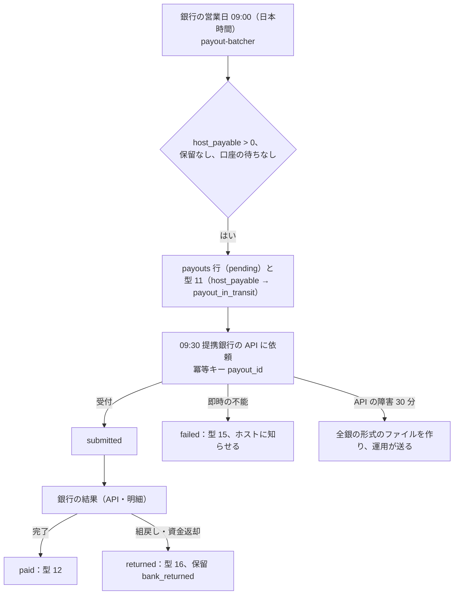

# Ledger and Payouts: Airbnb

台帳と送金を決める。勘定科目と仕訳の型、予約ごとの預かりと `settlement_seq` での決着、通貨の間の振り替え（`fx_clearing`）と為替の損益、チェックインの予定の時刻 + 24 時間の release、ホストへの送金の束と実行と失敗の戻し、送金の保留、ホストからの未収と相殺、税の預かりの門（法務の確認待ち：L4）、手数料の請求書と明細、3 段の照合を扱う。

前提となる決定は次のとおり。

- お金の正本は追記だけの通貨ごとの複式簿記の台帳。予約ごとの預かり（`guest_funds_held:<reservation_id>`）を持ち、release・settle・refund は `(reservation_id, settlement_seq)` で 1 回（[ADR-0005](../decisions/0005-payments-hold-capture-and-ledger.md)）
- 1 つの仕訳は 1 つの通貨に閉じる。決着の時に見積もりの相場で請求の通貨からリスティングの通貨に換え、差は `fx_clearing` に残す（[ADR-0008](../decisions/0008-multi-currency-and-fx.md)）
- `payout_release_at` = `check_in_at` + 24 時間。release の後、次の銀行の締めで送る（[ADR-0005](../decisions/0005-payments-hold-capture-and-ledger.md)、[booking-and-holds.md](booking-and-holds.md) の DT-BKG-001 の行 28）
- キャンセル・変更の額は `packages/cancellation` が決め、`ledger` は計算し直さない（[cancellations-and-changes.md](cancellations-and-changes.md) の 8 節）
- 台帳の形は Stripe の題材（[ADR-0003](../../../stripe/docs/decisions/0003-double-entry-ledger.md)、[ADR-0015](../../../stripe/docs/decisions/0015-chart-of-accounts-and-balance-transactions.md)、[ADR-0017](../../../stripe/docs/decisions/0017-three-way-reconciliation-with-suspense.md)、[ADR-0018](../../../stripe/docs/decisions/0018-payout-execution-via-banking-partner.md)）と Mercari の題材の [ledger-and-proceeds.md](../../../mercari/docs/architecture/ledger-and-proceeds.md)・[payouts-and-points.md](../../../mercari/docs/architecture/payouts-and-points.md) の考え方を参照し、宿泊の預かりに合わせて自前で書く

この文書で決めたことは次の ADR にある。

| ADR | 決定 |
| --- | --- |
| [0046](../decisions/0046-chart-of-accounts-and-journal-types.md) | 勘定科目を 22 の口座の種類、仕訳の型を 31 で確定する。ADR-0005 の表に、`payout_in_transit`、`host_receivable`、`unapplied_payments`、`psp_chargeback_held`、`psp_fee_expense`、`fx_gain_loss`、`compensation_expense`、`chargeback_loss_expense`、`cancellation_fee_revenue`、`claim_funds_held` を足す。仕訳の型はコードのバージョンで、フラグで切り替えない |
| [0047](../decisions/0047-settlement-seq-and-escrow-settlement.md) | `settlement_seq` は予約の「今開いている決着の番号」。1 つの番号に決着の型（release・settle・refund）は 1 つで、決着の後のお金の動き（変更の差額、release の後の返金）は次の番号を開く。決着のたびに預かりは通貨ごとに 0。release とキャンセルの競合は、予約の行のロックと `payout_released_at` で順序を決める |
| [0048](../decisions/0048-release-payout-batching-and-holds.md) | release は措置の保留がなければ `host_payable`、あれば `host_payable_hold` に振り替える。決まった待ち（口座の変更の後 72 時間は ledger の `payout_holds` の `wait`、連絡先の変更などは core の `payout_waits`。[ADR-0072](../decisions/0072-sensitive-operations-payout-holds-and-account-deletion.md)）は仕訳を動かさず、送金の束から外すだけ。送金は銀行の営業日の 09:30（日本時間）に、それまでの `host_payable` を束にして提携銀行の API で依頼し、使えなければ全銀の形式のファイルにする。最低の額はない。`host_receivable` は release の時に先に相殺する |
| [0049](../decisions/0049-reconciliation-and-tax-collection-gate.md) | 照合は予約と台帳（5 分ごと）、台帳の内部（5 分ごと）、台帳・提供者・銀行の 3 者（日次）の 3 段。説明のつかない差は `suspense` に置き 3 営業日で人が確かめる。税の預かり（`tax_payable`）と納付の仕訳は `legal.lodging_tax_collector` が `platform` の管轄だけで使い（[ADR-0034](../decisions/0034-tax-collection-model.md)）、既定の `host` ではホストへの支払いに含めて明細に分けて書く |

## 1. 範囲

- 扱う：
  - 口座の種類、仕訳の形と型、冪等キー
  - 予約の預かり、`settlement_seq`、決着の排他
  - `fx_clearing`、`fx_positions`、為替の損益
  - release の時刻と行き先（保留、相殺）
  - 送金の口座（vault）、束、実行、失敗、組戻し
  - 送金の保留と解除
  - ホストからの未収（罰、チャージバック、release の後の返金）と相殺
  - 税の預かりの門（法務の確認待ち：L4）、手数料の請求書とホストの明細
  - 3 段の照合と `suspense`
- 扱わない：
  - 返金・キャンセル・変更の額の計算（[cancellations-and-changes.md](cancellations-and-changes.md)）
  - 提供者の呼び出し（[payments-and-fx.md](payments-and-fx.md)）
  - 損害の請求の流れ（[deposits-and-claims.md](deposits-and-claims.md)）。ここは仕訳の型だけを持つ
  - 税の額の計算（taxes の領域）
  - 国際送金と日本の外のホスト（MVP の後。法務の確認待ち：L6）

## 2. 要件

| 要件 | 目標 | NFR |
| --- | --- | --- |
| 釣り合い | 通貨ごとに釣り合わない仕訳 0。全口座の残高の和 0（通貨ごと） | NFR-007、K7 |
| 1 回の決着 | 1 つの予約の `settlement_seq` ごとの決着の重複 0、和の不一致 0。決着の後の預かりは 0 | NFR-007 |
| 送金の時期 | チェックインの前の release 0。`payout_release_at` から release まで p99 5 分、最大 1 時間（保留を除く）。release から提携銀行への依頼まで、次の銀行の締め（営業日）以内 | NFR-008、K8 |
| 照合 | 台帳・提供者の精算・銀行の明細の説明のつかない差を 3 営業日で 0 円 | NFR-007 |
| 耐久性 | 仕訳の消失 0 | NFR-011 |
| 金額 | 通貨の最小単位の整数。浮動小数点なし | [AGENTS.md](../../AGENTS.md) |

## 3. 本家の形（確かめたこと）

- 本家は、送金をチェックインの予定の時刻から約 24 時間の後に出すとされる。英語の本文では確かめられなかった（**未検証**。[ヘルプの記事 425](https://www.airbnb.com/help/article/425)、2026-10-10 に確認。[intent.md](../intent.md) の出典）。不正の審査では、チェックインから最長 45 日遅れることがある（同）。
- 本家の勘定科目、送金の束の作り方、口座の変更の後の待ち、ホストへの罰の差し引き方は、公式の資料で確かめられなかった（**未検証**）。本システムの値を使う。
- 日本の銀行の休業日（土日、祝日、12 月 31 日〜1 月 3 日）は一般の知識として使い、出典の条文で確かめていない（**未検証**。銀行の営業日の表 `bank_calendar` は提携銀行の値で入れる）。

## 4. 勘定科目と仕訳

[ADR-0046](../decisions/0046-chart-of-accounts-and-journal-types.md) で決めた。

### 4.1 口座の種類

金額は通貨の最小単位の整数。仕訳の行は借方を正、貸方を負で持つ。口座は `(kind, owner_type, owner_id, currency)` で一意。

| 口座の種類 | 持ち主 | 正常な側 | 残高の制約 | 意味 | 出典 |
| --- | --- | --- | --- | --- | --- |
| `psp_receivable` | 提供者 | 借方 | — | 提供者から入る予定のお金 | ADR-0005 |
| `psp_chargeback_held` | 提供者 | 借方 | ≥ 0 | チャージバックで提供者が引き落とした額 | 新規 |
| `guest_funds_held` | 予約 | 貸方 | ≥ 0、決着で 0 | 予約ごとの預かり | ADR-0005 |
| `guest_refund_payable` | 予約 | 貸方 | ≥ 0 | 返金の依頼の前・途中 | ADR-0005 |
| `unapplied_payments` | 提供者 | 貸方 | ≥ 0 | 取り消しの後に成功した支払い（返す） | 新規 |
| `host_payable` | ホストのアカウント | 貸方 | ≥ 0 | ホストへの支払い（送金の前） | ADR-0005 |
| `host_payable_hold` | ホストのアカウント | 貸方 | ≥ 0 | 保留のホストへの支払い | ADR-0005 |
| `host_receivable` | ホストのアカウント | 借方 | ≥ 0 | ホストからの未収（罰、チャージバック、release の後の返金の不足） | 新規 |
| `payout_in_transit` | ホストのアカウント | 貸方 | ≥ 0 | 銀行への依頼の後、銀行の確かめの前 | 新規 |
| `claim_funds_held` | 損害の請求 | 貸方 | ≥ 0、決着で 0 | ゲストから受けた損害の請求の額 | 新規 |
| `tax_payable` | 税の区域 × 税 | 貸方 | ≥ 0 | 本システムが預かる税（`legal.lodging_tax_collector = platform` の管轄だけ） | ADR-0005、ADR-0034 |
| `service_fee_revenue` | 本システム（スロット） | 貸方 | — | サービス料 | ADR-0005 |
| `cancellation_fee_revenue` | 本システム | 貸方 | — | ホストのキャンセルの罰 | 新規 |
| `fx_clearing` | 本システム × 通貨 | どちらも | — | 通貨の間の振り替え | ADR-0005、ADR-0008 |
| `fx_gain_loss` | 本システム | どちらも | — | 為替の損益 | ADR-0008 |
| `psp_fee_expense` | 本システム | 借方 | — | 提供者の手数料 | 新規 |
| `bank_fee_expense` | 本システム | 借方 | — | 振込の手数料（本システムが負う） | 新規 |
| `compensation_expense` | 本システム | 借方 | — | 補償（代わりの宿、損害の補償） | 新規 |
| `chargeback_loss_expense` | 本システム | 借方 | — | 本システムが負うチャージバック | 新規 |
| `bank` | 本システムの銀行口座 | 借方 | — | 提携銀行の口座（明細と突き合わせる） | ADR-0005 |
| `suspense` | 本システム × 理由 | どちらも | — | 説明のつかない差 | ADR-0005 |
| `ops_adjustment` | 本システム | どちらも | — | 承認つきの手の仕訳の相手 | 新規 |

- 「新規」は ADR-0005 の表にない口座で、この領域で足した。ADR-0005 の口座の意味は変えていない。
- `guest_funds_held` と `guest_refund_payable` は予約の最初の仕訳で作り、決着して 0 になった口座は夜間に閉じた印を付ける（仕訳は残す）。

### 4.2 仕訳の型

冪等キーは `(source_type, source_id, seq, event)`。`seq` は `settlement_seq`（予約に関わる型）か 0。

| # | 型 | 冪等キー | 借方 | 貸方 | 使う所 |
| --- | --- | --- | --- | --- | --- |
| 1 | `hold` | `(reservation, id, 0, hold)` | `psp_receivable` 請求の額 | `guest_funds_held` 同額 | 売上の確定（`reservation.confirmed`） |
| 2 | `alter_hold` | `(reservation, id, k, alter_hold)` | `psp_receivable` 差額 | `guest_funds_held` 同額 | 変更の増額の確定 |
| 3 | `release` | `(reservation, id, k, release)` | `guest_funds_held` 残高の全部（リスティングの通貨のとき） | `host_payable`（か `_hold`）、`service_fee_revenue`、（`platform` なら）`tax_payable` | チェックイン + 24 時間 |
| 4 | `settle` | `(reservation, id, k, settle)` | `guest_funds_held` 残高の全部 | `guest_refund_payable` 返金、`host_payable` ホストの取り分、`service_fee_revenue`、（`platform` なら）`tax_payable` | release の前のキャンセルの精算 |
| 5 | `refund_full` | `(reservation, id, k, refund)` | `guest_funds_held` 残高の全部 | `guest_refund_payable` 同額 | 全額の返金（ホスト・運用のキャンセル） |
| 6 | `alter_refund` | `(reservation, id, k, alter_refund)` | `guest_funds_held` 減額 | `guest_refund_payable` 同額 | 変更の減額（決着の前） |
| 7 | `fx_conversion` | 決着の型と同じキーに `:fx:<ccy>` | 請求の通貨：`guest_funds_held` → `fx_clearing:<請求>`。リスティングの通貨：`fx_clearing:<リスティング>` → 決着の行き先 | 同左 | 請求の通貨とリスティングの通貨が違う決着（3・4） |
| 8 | `refund_paid` | `(refund, id, 0, paid)` | `guest_refund_payable` | `psp_receivable` | 返金の成功 |
| 9 | `post_release_refund` | `(reservation, id, k, post_release_refund)` | `host_payable`（ホストの負担）、`service_fee_revenue`（戻す手数料）、足りなければ `host_receivable` | `guest_refund_payable`（請求の通貨。通貨が違えば型 7 と同じく `fx_clearing` を挟む） | release の後のキャンセル・返金 |
| 10 | `host_cancellation_fee` | `(reservation, id, k, host_fee)` | `host_payable`、足りなければ `host_receivable` | `cancellation_fee_revenue` | ホストのキャンセルの罰 |
| 11 | `payout_request` | `(payout, id, 0, request)` | `host_payable` 束の額 | `payout_in_transit` | 送金の依頼 |
| 12 | `payout_settled` | `(payout, id, 0, settled)` | `payout_in_transit` | `bank` | 銀行の確かめ |
| 13 | `unapplied_receipt` | `(payment_attempt, id, 0, unapplied)` | `psp_receivable` | `unapplied_payments` | 取り消しの後の成功（[payments-and-fx.md](payments-and-fx.md) の 6.4 節） |
| 14 | `unapplied_refund` | `(payment_attempt, id, 0, orphan_refund)` | `unapplied_payments` | `psp_receivable` | その返金 |
| 15 | `payout_failed` | `(payout, id, 0, failed)` | `payout_in_transit` | `host_payable` | 依頼の時点の不能 |
| 16 | `payout_returned` | `(payout, id, 0, returned)` | `bank` | `host_payable_hold` | 完了の後の組戻し（口座を直すまで保留） |
| 17 | `payable_hold` | `(hold, id, 0, apply)` | `host_payable` | `host_payable_hold` | 保留の開始 |
| 18 | `payable_unhold` | `(hold, id, 0, release)` | `host_payable_hold` | `host_payable` | 保留の解除 |
| 19 | `chargeback_open` | `(chargeback, id, 0, open)` | `psp_chargeback_held` | `psp_receivable` | チャージバック |
| 20 | `chargeback_won` | `(chargeback, id, 0, won)` | `psp_receivable` | `psp_chargeback_held` | 同 |
| 21 | `chargeback_lost_platform` | `(chargeback, id, 0, lost)` | `chargeback_loss_expense` | `psp_chargeback_held` | 同（本システムの負担） |
| 22 | `chargeback_lost_host` | `(chargeback, id, 0, lost)` | `host_receivable` | `psp_chargeback_held` | 同（ホストの負担。運用の判断） |
| 23 | `receivable_offset` | `(journal, <release_id>, 0, offset)` | `host_payable` | `host_receivable` | release の直後の相殺 |
| 24 | `psp_settlement` | `(psp_settlement, batch_id, line_no, settle)` | `bank` 純額、`psp_fee_expense` 手数料（精算の通貨）。請求の通貨が違えば `fx_clearing` を挟む | `psp_receivable` 総額 | 提供者の精算 |
| 25 | `fx_realize` | `(fx_position, reservation_id, k, realize)` | `fx_clearing:<リスティング>` か `fx_gain_loss` | 相手 | 為替の損益の確定 |
| 26 | `compensation` | `(compensation, case_id, 0, grant)` | `compensation_expense` | `host_payable`（ホストへ）か `guest_refund_payable`（ゲストへ） | 補償 |
| 27 | `ops_refund` | `(ops_refund, id, 0, paid)` | `guest_refund_payable` | `bank` | 運用の銀行での返金（[payments-and-fx.md](payments-and-fx.md) の 6.3 節） |
| 28 | `claim_charge` | `(claim, id, 0, charge)` | `psp_receivable` | `claim_funds_held` | 損害の請求の請求（[deposits-and-claims.md](deposits-and-claims.md)） |
| 29 | `claim_release` | `(claim, id, 0, release)` | `claim_funds_held` | `host_payable` | 損害の請求のホストへの振り替え |
| 30 | `tax_remit` | `(tax_return, id, line_no, remit)` | `tax_payable` | `bank` | 税の納付（`platform` の管轄だけ） |
| 31 | `suspense_open`・`suspense_resolve` | `(recon_break, id, 0, open)`・`(…, resolve)` | 相手・`suspense` | `suspense`・正しい口座 | 3 者の照合 |

- [ADR-0005](../decisions/0005-payments-hold-capture-and-ledger.md) の 7 つの型との対応：売上の確定 = 型 1、振り替え = 型 3、キャンセルの精算 = 型 4、全額の返金 = 型 5、日程の変更の差額 = 型 2・6、滞在中・後の返金 = 型 9、送金 = 型 11・12（`payout_in_transit` を挟んだ）。意味を変えた型はない。
- 仕訳の型と行の向きは `ledger-core` の spec の正本にする。型を足すには、この表と ADR の更新が要る（[roadmap.md](../roadmap.md) の「エージェントに任せないこと」）。
- 型 30 は `legal.lodging_tax_collector` が `platform` の管轄だけで書ける（8 節）。

### 4.3 仕訳の形

```sql
CREATE TABLE journals (
  id uuid PRIMARY KEY,                 -- UUIDv7
  type text NOT NULL,
  source_type text NOT NULL, source_id uuid NOT NULL, seq int NOT NULL, event text NOT NULL,
  currency char(3) NOT NULL,           -- one journal = one currency (ADR-0008)
  effective_at timestamptz NOT NULL,
  fx_snapshot_id uuid,                 -- for type 7 / 9 / 24 / 25
  approved_by uuid[],                  -- manual / ops journals only
  created_at timestamptz NOT NULL DEFAULT now(),
  UNIQUE (source_type, source_id, seq, event, currency)
);
CREATE TABLE journal_lines (
  journal_id uuid NOT NULL REFERENCES journals, line_no smallint NOT NULL,
  account_id bigint NOT NULL, amount bigint NOT NULL CHECK (amount <> 0),
  PRIMARY KEY (journal_id, line_no)
) PARTITION BY RANGE (journal_id);     -- monthly by UUIDv7 time
-- deferred constraint trigger: SUM(amount) per journal_id = 0 at commit
-- trigger: every line's account currency = journals.currency
-- REVOKE UPDATE, DELETE ON journals, journal_lines FROM ledger_app;
CREATE TABLE escrow_settlements (
  reservation_id uuid NOT NULL, settlement_seq int NOT NULL,
  kind text NOT NULL,                  -- release | settle | refund | post_release_refund
  journal_ids uuid[] NOT NULL,
  PRIMARY KEY (reservation_id, settlement_seq)
);
```

- 1 つの台帳のトランザクションで、`journals`・`journal_lines`・`account_balances`（`UPDATE ... SET balance = balance + $d WHERE ... AND balance + $d >= 0` の形の制約つき）・`escrow_settlements`・outbox を書く。請求の通貨とリスティングの通貨の 2 つの仕訳（型 7）も同じトランザクションで書く。
- 冪等キーの違反は「すでに書いた」として前の仕訳を返す（成功）。

## 5. 予約の預かりと決着

[ADR-0047](../decisions/0047-settlement-seq-and-escrow-settlement.md) で決めた。

### 5.1 `settlement_seq`

- `reservations.settlement_seq` は、今開いている決着の番号。確定の時は 0。
- 1 つの番号に、決着の型（release・settle・refund・post_release_refund）は 1 つだけ（`escrow_settlements` の主キー）。
- 決着の前のお金の動き（変更の増額・減額）は、番号を上げて書く（型 2・6 は新しい番号 `k`）。決着は最後の番号で行い、預かりの残高の全部を動かす。決着しなかった前の番号は、決着の行を持たない。
- 決着の後のお金の動き（release の後の延長の差額、release の後の返金）は、番号を 1 つ上げて開き、その番号で決着する。
- 番号を上げるのは `booking` の遷移（変更の受諾、release の後のキャンセル）で、予約の行のロックの中で行う。`ledger` は事象の `settlement_seq` に従うだけで、自分で番号を決めない。
- 決着の後、`guest_funds_held:<reservation_id>` の残高は通貨ごとに 0（照合 R3）。

### 5.2 例：米ドルで払い、円でホストに送る

前提：[cancellations-and-changes.md](cancellations-and-changes.md) の 5.6 節の予約（総額 69,200 円 = 47,291 セント、ホストの取り分 57,800 円 + 宿泊税 1,200 円、サービス料 10,200 円、適用の相場 0.006834）。提供者は円で精算する。

| 日 | 仕訳 | 通貨 | 借方 | 貸方 |
| --- | --- | --- | --- | --- |
| 10/10 | 型 1 `hold`（seq 0） | USD | `psp_receivable` 47,291 | `guest_funds_held:R` 47,291 |
| 10/13 | 型 24 `psp_settlement`（提供者が 472.91 ドルを 149.50 円で換え、70,700 円。手数料 3.0% の 2,121 円は例の値） | USD | `fx_clearing:USD` 47,291 | `psp_receivable` 47,291 |
| 10/13 | 同 | JPY | `bank` 68,579、`psp_fee_expense` 2,121 | `fx_clearing:JPY` 70,700 |
| 12/31 15:00 | 型 3 `release` ＋ 型 7（seq 0） | USD | `guest_funds_held:R` 47,291 | `fx_clearing:USD` 47,291 |
| 12/31 15:00 | 同 | JPY | `fx_clearing:JPY` 69,200 | `host_payable:H` 59,000、`service_fee_revenue` 10,200 |
| 12/31 夜 | 型 25 `fx_realize` | JPY | `fx_clearing:JPY` 1,500 | `fx_gain_loss` 1,500 |
| 1/4 09:30 | 型 11 `payout_request` | JPY | `host_payable:H` 59,000 | `payout_in_transit:H` 59,000 |
| 1/4 | 型 12 `payout_settled` | JPY | `payout_in_transit:H` 59,000 | `bank` 59,000 |

- 釣り合い：各行の借方と貸方は通貨ごとに等しい。`fx_clearing:USD` は +47,291 − 47,291 = 0。`fx_clearing:JPY` は −70,700 + 69,200 + 1,500 = 0。
- 為替の損益 1,500 円は、見積もりの相場（69,200 円 = 472.91 ドル）と提供者の換算（70,700 円）の差。上乗せ（200 bp）の分がここに出る。
- `fx_positions`（予約 × `settlement_seq` ごとに、請求の通貨の額、見積もりの相場でのリスティングの通貨の額、提供者の換算の額）で、両方の側がそろった予約から型 25 を書く。片方だけの間は開いた持ち高として財務の画面に出す。
- 宿泊税 1,200 円は既定の「ホストが納める」なので `host_payable` に含め、明細に分けて書く（8 節）。

### 5.3 例：米ドルの予約のキャンセル（release の前）

前提：同じ予約を 12/27 15:00 にゲストがキャンセル（中程度、DT-CXL-001 の行 6）。返金 19,955 セント、残す 27,336 セント = 40,000 円、ホスト 34,000 円、サービス料 6,000 円。

| 仕訳 | 通貨 | 借方 | 貸方 |
| --- | --- | --- | --- |
| 型 4 `settle` ＋ 型 7（seq 0） | USD | `guest_funds_held:R` 47,291 | `guest_refund_payable:R` 19,955、`fx_clearing:USD` 27,336 |
| 同 | JPY | `fx_clearing:JPY` 40,000 | `host_payable:H` 34,000、`service_fee_revenue` 6,000 |
| 型 8 `refund_paid` | USD | `guest_refund_payable:R` 19,955 | `psp_receivable` 19,955 |

- 返金は提供者が次の精算から差し引く（型 24 で円に換えて差し引く）。`fx_positions` の差が為替の損益になる。
- ホストの 34,000 円は、キャンセルの時点で `host_payable` に入り、次の送金で送る（チェックインを待たない。泊まりが起きないため。本家の時期は**未検証**）。

### 5.4 例：変更と release（円）

[cancellations-and-changes.md](cancellations-and-changes.md) の 7.5 節の予約。

| 時 | 仕訳 | 借方 | 貸方 |
| --- | --- | --- | --- |
| 10/10 | 型 1（seq 0） | `psp_receivable` 69,200 | `guest_funds_held:R` 69,200 |
| 11/20 | 型 2（seq 1） | `psp_receivable` 20,400 | `guest_funds_held:R` 20,400 |
| 12/31 15:00 | 型 3（seq 1） | `guest_funds_held:R` 89,600 | `host_payable:H` 76,400、`service_fee_revenue` 13,200 |

- seq 0 は決着の行を持たない。決着は最後の番号の seq 1 で、預かりの全部（89,600 円）を動かした。

### 5.5 決着の排他

- release とキャンセルが近い時刻に来る（チェックインの 24 時間後の直前のキャンセル）。どちらも `booking` の予約の行のロックを通る。
  - キャンセルが先：予約は `cancelled` になり、DT-BKG-001 の行 28 に当たらない（終わった状態は行 1）。release は出ない。
  - release が先：予約に `payout_released_at` が書かれ、後のキャンセルは `settlement_seq` を上げて `after_release = true` で精算する（型 9）。
- outbox の事象は SQS の FIFO（グループは予約の ID）で `ledger` に届き、予約ごとの順序を守る。遅れて重なっても、`escrow_settlements` の主キーが 2 つ目の決着を拒む。拒まれた事象は `superseded` として記録し、照合で確かめる。

## 6. release

[ADR-0048](../decisions/0048-release-payout-batching-and-holds.md) で決めた。

- `booking` の DT-BKG-001 の行 28 が outbox に `reservation.payout_release_due`（予約、`settlement_seq`、行き先の額）を書く。`ledger` は 1 つのトランザクションで次を行う。
  1. 型 3（と型 7）で預かりを振り替える。行き先は、ホストのアカウントに有効な措置の保留（`payout_holds.kind = 'hold'`）があれば `host_payable_hold`、なければ `host_payable`。本人の操作の待ち（`wait`）は行き先を変えない。
  2. `host_receivable` の残高があれば、型 23 で `host_payable` から相殺する（保留のときは相殺しない）。
  3. outbox に `ledger.released` を書く（明細と知らせ）。
- 予約が `on_hold` の間は、`booking` が行 28 を出さない（[booking-and-holds.md](booking-and-holds.md) の 7.3 節）。予約の保留と、ホストの送金の保留は別のもの。

### 6.1 例：年末のチェックイン

| 時刻（日本時間） | 事象 |
| --- | --- |
| 12/30（水）15:00 | `check_in_at`。`in_stay` |
| 12/31（木）15:00 | `payout_release_at`。行 28 → release（`host_payable:H` に 59,000 円） |
| 12/31〜1/3 | 銀行の休業日（`bank_calendar`）。送金の束を作らない |
| 1/4（月）09:30 | 送金の束に入れ、提携銀行に依頼（型 11） |
| 1/4 | 銀行の確かめ（型 12）。ホストへの知らせ |

- NFR-008 の「release から次の銀行の締め（営業日）以内」を満たす。release の遅れは p99 5 分（`deadline-runner` の 1 分と outbox の遅れ）。

## 7. 送金

### 7.1 送金の口座

- 口座（銀行、支店、種類、番号、名義のカナ）は vault に封筒の暗号化で持ち、`payouts` だけが読む（[ADR-0007](../decisions/0007-tenancy-host-accounts-and-rls.md)、security の領域）。画面には下 4 桁だけを出す。
- 登録と変更はホストのアカウントの `owner` だけ。変更には再認証（パスキー）を求める。
- 送金の口座の変更の後 72 時間は、送金の実行を待たせる（[ADR-0072](../decisions/0072-sensitive-operations-payout-holds-and-account-deletion.md)）。口座を持つ `payouts` が、口座の変更と同じ操作で ledger の `payout_holds` に `kind = 'wait'`・理由 `payout_account_changed` の行を書く。待ちは措置ではないので仕訳を動かさない。release は時刻どおりに `host_payable` へ行い、そこに溜まる。
- 連絡先の変更、回復、最後のパスキーの削除の後 72 時間の待ちは、`identity` が core の `payout_waits` に書く（accounts の領域。ADR-0072）。これも仕訳を動かさない。
- `payout-batcher` は束を作る前に、ledger の `payout_holds`（`wait` と `hold`）と core の `payout_waits`（`identity.payoutWaitUntil(host_account)`）の両方を読み、待ち・保留のあるホストを外す。重なれば最も遅い終わりを使う。
- 名義と本人確認の名前の照合は identity-verification の領域。合わなければ保留（`kyc_mismatch`）。

### 7.2 束と実行



- 1 つのホストのアカウントに 1 日 1 つの送金。額は 09:00 の時点の `host_payable` の残高（相殺の後）。
- 最低の額はない（[ADR-0005](../decisions/0005-payments-hold-capture-and-ledger.md) の既定）。振込の手数料は本システムが負う（`bank_fee_expense`。ホストの明細に出さない）。
- 送金の状態：`pending` → `submitted` → `paid`・`failed`・`returned`。前にだけ進む。
- 提携銀行の API の使えないときの全銀の形式のファイルは、Mercari の題材の [payouts-and-points.md](../../../mercari/docs/architecture/payouts-and-points.md) の 6.3 節と同じ形。
- S1 の量：1 日 6,000 件の予約、ホストのアカウントは 1 日数千件の送金（`payout-batcher` は 1 回の束で 1 万件まで。超えたら 2 回に分ける）。

### 7.3 送金の保留

ledger の `payout_holds` は 2 種類を持つ。連絡先の変更・回復・最後のパスキーの削除の待ちはここに持たず、core の `payout_waits`（accounts の領域）に持つ。どちらも束の前に読む（7.1 節）。

| 種類 | 理由 | 始める所 | 解く所 | 仕訳 |
| --- | --- | --- | --- | --- |
| `wait`（決まった待ち） | `payout_account_changed` | `payouts`（口座の変更。[ADR-0072](../decisions/0072-sensitive-operations-payout-holds-and-account-deletion.md)） | 自動（72 時間） | 動かさない。束から外すだけ |
| `wait` | `new_host_first_payout` | 最初の予約の release | 自動（release から 72 時間） | 同上 |
| `hold`（措置の保留） | `fraud_suspected` | trust-and-safety の措置（[ADR-0009](../decisions/0009-trust-and-safety-and-ml-boundary.md)） | T&S の審査（本家は最長 45 日。**未検証**） | 型 17・18 |
| `hold` | `kyc_incomplete`・`kyc_mismatch` | identity-verification | 確認の完了 | 型 17・18 |
| `hold` | `bank_returned` | 組戻し（型 16） | ホストが口座を直す | 型 16・18 |
| `hold` | `ops_case` | 運用（法令の照会、調査） | 運用 | 型 17・18 |

- `hold` の間の release は `host_payable_hold` へ、`hold` を始めた時の `host_payable` の残高は型 17 で移す。すべての `hold` が解けたら型 18 で戻す。
- `wait`（と core の `payout_waits`）の間は仕訳を動かさず、release は `host_payable` に溜まり、待ちの後の束で送る。待ちは措置の記録・異議の経路の対象ではないので、口座を分けない（ADR-0072 の理由）。7.1 節と同じ規則である。
- `hold` の判断と解除は Ops・財務・T&S の手順（[roadmap.md](../roadmap.md) の「エージェントに任せないこと」）。自動で解くのは `wait` の時間だけ。

### 7.4 ホストからの未収

- `host_receivable` は、罰（型 10）、チャージバックのホストの負担（型 22）、release の後の返金の不足（型 9）で増える。
- release の時（6 節の 2）と、送金の束の前に、`host_payable` から相殺する。
- 90 日を超えて残る未収は、運用の待ち行列に入れる（請求の手続き。法的な扱いは **法務の確認待ち：L5**）。

## 8. 税の預かりと明細

[ADR-0049](../decisions/0049-reconciliation-and-tax-collection-gate.md) で決めた。

- 型は taxes の領域の [ADR-0034](../decisions/0034-tax-collection-model.md) の `legal.lodging_tax_collector`（`host`・`platform`。管轄ごとに上書きできる）に従う。本システムが特別徴収義務者として税を預かり納めるかは **法務の確認待ち（L4）**。既定は `host`。
- `host`：税の行の額をホストへの支払いに含め、明細（予約ごと・月ごと・管轄ごと）に税の種類と額を分けて書く。`tax_payable` を使わない。
- `platform`：release・settle の仕訳で税の行を `tax_payable:<管轄>:<税>` に入れ、納付の期限に型 30 で納める。切り替えは施行の日以後に確定した予約から効かせる（既存の予約の預かりの扱いを変えない）。
- ホストの明細：月ごとに、予約ごとの泊の料金・清掃料・税・サービス料・罰・相殺・送金を出す。PDF と CSV。サービス料の請求書（適格請求書の要否と記載の事項）は **法務の確認待ち（L4）**。

## 9. 照合

[ADR-0049](../decisions/0049-reconciliation-and-tax-collection-gate.md) で決めた。Stripe の題材の [ADR-0017](../../../stripe/docs/decisions/0017-three-way-reconciliation-with-suspense.md) と同じ 3 段。

| 段 | # | 比べるもの | 頻度 | 外れたとき |
| --- | --- | --- | --- | --- |
| 予約と台帳 | R1 | `confirmed`（と変更の受諾）に型 1・2 がある | 5 分 | 15 分を超えたら page、事象を出し直す |
| | R2 | `payout_released_at` のある予約に型 3 か型 9 の決着がある | 5 分 | 同上 |
| | R3 | 決着した番号の `guest_funds_held` が通貨ごとに 0 | 5 分 | page |
| | R4 | `cancelled` の予約に決着（型 4・5・9）がある | 5 分 | 15 分を超えたら page |
| | R5 | `check_in_at + 24h` より前の型 3 がない | 5 分 | page（SEV1 の候補。送金を止める） |
| 台帳の内部 | R6 | 仕訳ごと・通貨ごとの和 0、全口座の和 0（通貨ごと） | 5 分 | page（SEV1 の候補） |
| | R7 | `account_balances` = 仕訳の和 | 5 分（抜き取り）、日次（全部） | page |
| | R8 | `fx_clearing` の開いた持ち高と `fx_positions` が一致 | 日次 | ticket（財務） |
| 3 者 | R9 | 提供者の精算の各行 ↔ 型 24・`payment_attempts`・返金 | 日次 | `suspense` へ、3 営業日で人 |
| | R10 | 銀行の明細の各行 ↔ 型 12・24・27・30 | 日次 | 同上 |
| | R11 | `payout_in_transit` の 3 営業日を超えた残り | 日次 | ticket |

- 外れは `reconciliation_findings` に ID と数と理由のコードだけで書く（個人のデータを持たない）。
- 直しは仕訳の型でだけ行う（型 31、承認つきの `ops_adjustment`）。残高の行を直接書き換えない。

## 10. 熱い口座と分け方

- `service_fee_revenue`・`fx_clearing` は全予約が書く熱い口座。S1 は 1 秒 10 件の予約で問題にならない見込み。S2 から、口座を 16 のスロット（`owner_id` = スロット番号、予約の ID のハッシュで選ぶ）に分け、残高は和で読む（Mercari の題材の [ledger-and-proceeds.md](../../../mercari/docs/architecture/ledger-and-proceeds.md) の 10 節と同じ形）。
- `journal_lines` は月ごとに分割し、ledger の Aurora に置く。S3 で口座の持ち主のハッシュで分ける（[README.md](README.md) の 2 節）。

## 11. 障害のときの振る舞い

| 障害 | 影響 | 振る舞い |
| --- | --- | --- |
| `ledger` の消費者の停止 | 仕訳が遅れる | 予約は進む。再開で溜まった事象を順に書く。R1・R2・R4 が 15 分で欠けを見つける |
| 事象の重複・順序の入れ替え | — | 冪等キーと `escrow_settlements` の主キー、FIFO のグループ |
| ledger の Aurora の交代 | 書き込みが戻る | 事象の再配送で同じ仕訳を書く（冪等） |
| 提携銀行の API の停止 | 送金が遅れる | 30 分で全銀の形式のファイルへ。NFR-008 の「次の締め」を守る |
| 組戻し | 送金が戻る | 型 16、保留 `bank_returned`、ホストに知らせる |
| 照合の外れ | 正しさの疑い | R5・R6 は送金を止める（`ops.payouts_enabled = false`）。runbooks の `ledger-invariant-break.md` |

## 12. 上限

| 対象 | 値 |
| --- | --- |
| 送金の束 | 銀行の営業日 1 回（09:00 に作り 09:30 に依頼）、1 回 1 万件 |
| 最低の送金の額 | なし |
| 口座の変更の後の待ち（ledger の `payout_holds`）・連絡先の変更などの後の待ち（core の `payout_waits`） | 72 時間（[ADR-0072](../decisions/0072-sensitive-operations-payout-holds-and-account-deletion.md)） |
| 新しいホストの最初の送金の待ち | 72 時間 |
| `suspense` の解消 | 3 営業日 |
| `host_receivable` の運用への回付 | 90 日 |
| 1 予約の `settlement_seq` | 20（変更の上限 10 回と、release の後の動き） |

## 13. data-model への項目

| 表・置き場 | 中身 | 主キー・索引 | 節 |
| --- | --- | --- | --- |
| `accounts`（ledger） | 種類、持ち主、通貨、閉じた印 | `id`、一意 `(kind, owner_type, owner_id, currency)` | 4.1 |
| `journals`・`journal_lines`（ledger、追記だけ） | 4.3 節 | 4.3 節。`journal_lines` は月の分割 | 4.3 |
| `account_balances`（ledger） | 口座ごとの残高の射影 | `account_id` | 4.3 |
| `escrow_settlements`（ledger） | 予約 × 番号の決着 | `(reservation_id, settlement_seq)` | 5 |
| `fx_positions`（ledger） | 予約 × 番号の請求の通貨の額、見積もりの相場の額、提供者の換算の額、確定の印 | `(reservation_id, settlement_seq)` | 5.2 |
| `payouts`（ledger、ホストのアカウントの RLS は読み出しだけ） | ホストのアカウント、額、状態、銀行の参照、束の ID | `id`、`(host_account_id, created_at)`、`(status)` | 7.2 |
| `payout_batches`（ledger） | 束の時刻、件数、方式（API・全銀） | `id` | 7.2 |
| `payout_holds`（ledger） | 7.3 節（種類 `wait`・`hold`、理由、始まり、終わり、措置の ID） | `id`、`(host_account_id) WHERE ended_at IS NULL` | 7.3 |
| `payout_waits` の読み出し（core。accounts の領域が持つ） | 連絡先の変更・回復・最後のパスキーの削除の待ち | — | 7.1 |
| `payout_accounts`（vault） | 口座（封筒の暗号化）、変更の時刻 | `host_account_id` | 7.1 |
| `bank_calendar`（ledger） | 銀行の営業日 | `day` | 6.1 |
| `host_statements`（ledger） | 月ごとの明細の S3 の参照 | `(host_account_id, month)` | 8 |
| `reconciliation_findings`（ledger） | 9 節の外れ | `(kind, found_at)` | 9 |
| outbox の事象 | `ledger.released`・`ledger.refund_due`・`payout.paid`・`payout.failed`・`payout.returned` | — | 6、7 |

## 14. テスト

- **PROP-LED-001（釣り合い）**：任意の事象（確定、変更の増減、キャンセル、release、release の後の返金、チャージバック、送金の成功・失敗・組戻し、精算、為替）を重複（0〜5 回）・遅れ・順序の入れ替えで流し、仕訳ごと・通貨ごとの和 0、全口座の和 0（[quality.md](../quality.md) の 2.2.1 節 C）。
- **PROP-LED-002（1 回の決着）**：予約 × 番号の決着は 1 つ。決着の後の `guest_funds_held` は通貨ごとに 0。
- **PROP-LED-003（チェックインの前の release なし）**：型 3 の `effective_at` ≥ `check_in_at + 24h`。
- **PROP-LED-004（参照との一致）**：`ledger-ref`（素直な足し引き）と口座ごとの残高が一致する。
- **PROP-LED-005（相殺）**：`host_receivable` は送金の前に `host_payable` と相殺され、送金の額は相殺の後の残高。
- **PROP-LED-006（為替）**：`fx_positions` の確定の後、`fx_clearing` の通貨ごとの残高 = 開いた持ち高の和。
- **PROP-PO-001（送金）**：任意の release・保留・口座の変更・送金の結果の列で、保留の間・口座の変更の後 72 時間に送金はなく、同じ `host_payable` を 2 回送らない。
- **表駆動**：4.2 節の型ごとの借方・貸方、5.2〜5.4 節の例、7.3 節の保留の表。
- **仮想の時計**（同 D）：release の時刻（物件のタイムゾーン、年末の銀行の休業日）、送金の束の時刻、72 時間の保留。
- **障害の注入**：ledger の消費者の 10 分の停止、提携銀行の API の停止、組戻し（同 J）。

## 15. Story の候補

| Epic | Story | 中身 |
| --- | --- | --- |
| E12 | `ledger-core` | 4・5 節（ADR-0046・0047。PROP-LED-001・002・004） |
| E12 | `release-after-check-in` | 6 節（ADR-0048。PROP-LED-003・005） |
| E12 | `payout-accounts-and-execution` | 7.1・7.2 節（ADR-0048。`bank-sim`） |
| E12 | `payout-holds` | 7.3 節（PROP-PO-001） |
| E12 | `fx-positions` | 5.2 節（PROP-LED-006） |
| E12 | `reconciliation` | 9 節（ADR-0049） |
| E12 | `tax-remittance` | 8 節。法務：L4 |
| E12 | `host-statements` | 8 節。法務：L4 |

## 16. 未解決の問い

### 決定

2026-10-10 の既定案。

- **勘定科目**：22 の口座の種類、31 の仕訳の型（ADR-0046）。
- **`settlement_seq`**：開いている決着の番号。番号ごとに決着は 1 つ（ADR-0047）。
- **キャンセルの後のホストの取り分**：チェックインを待たずに次の送金で送る（ADR-0047）。
- **送金**：銀行の営業日 09:30、最低の額なし。口座の変更の後と新しいホストの最初は 72 時間の待ちで、仕訳を動かさない（ADR-0048、ADR-0072）。
- **照合**：3 段、`suspense` は 3 営業日（ADR-0049）。
- **税**：既定はホストが納め、明細に分けて書く（ADR-0049、ADR-0034）。

### 持ち越し

| 問い | いつ・どう決めるか |
| --- | --- |
| 預かりの法的な型、未収の請求の扱い | 法務の確認待ち（L5） |
| 税の預かりと納付、手数料の請求書 | 法務の確認待ち（L4） |
| 国際送金と日本の外のホスト | MVP の後。法務の確認待ち（L6） |
| 28 泊以上の月ごとの release | MVP の後（[availability-and-calendars.md](availability-and-calendars.md) の 27 泊の上限） |
| キャンセルの後のホストの取り分を送る時期の本家の値、送金の保留の最長 | 公式の資料で確かめられなかった（**未検証**）。本システムの値を使う |
| 提携銀行の選定と締めの時刻 | E12 の `payout-accounts-and-execution` |

## 出典

- Airbnb, [ヘルプの記事 425（送金の時期）](https://www.airbnb.com/help/article/425)：[intent.md](../intent.md) の出典のとおり（2026-10-10 に確認。本文の時期は**未検証**）
