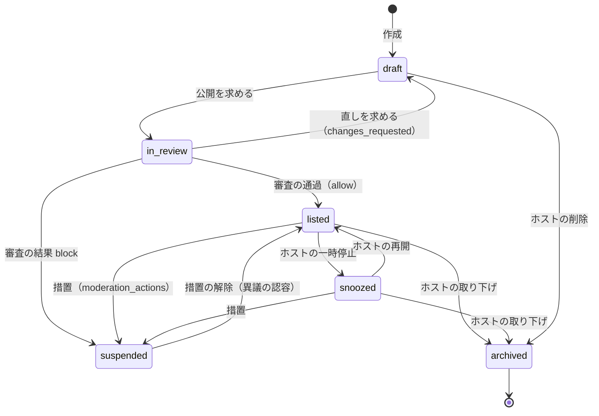
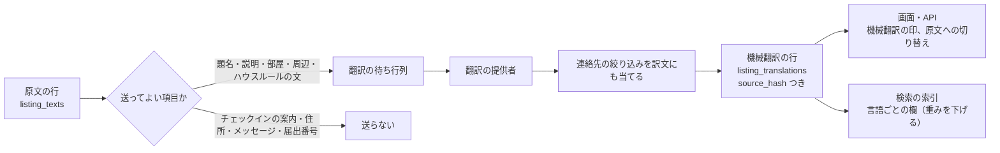
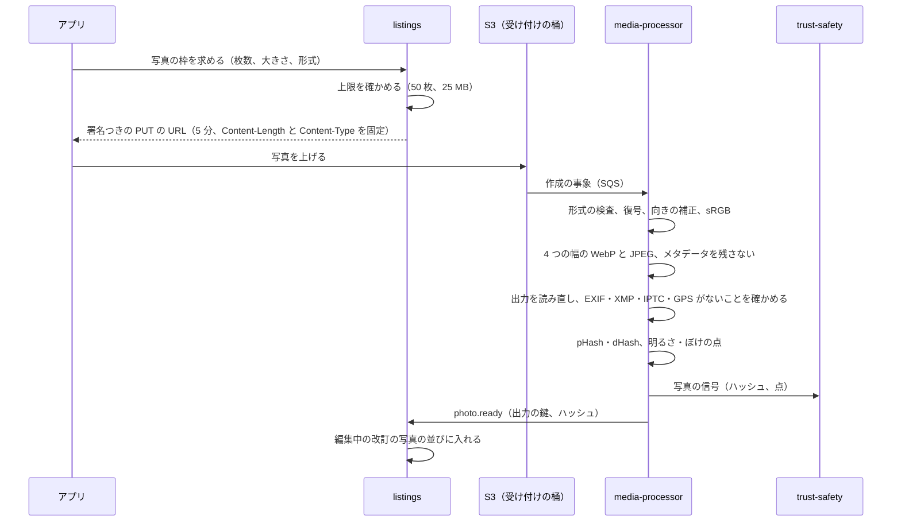

# Listings and content: Airbnb

リスティングと内容。リスティングの状態とバージョン、公開している内容と編集中の内容の分け方、物件の種類・定員・設備・ハウスルール、写真の受け付けと処理と知覚ハッシュ、多言語の内容と機械翻訳の境界、公開の審査の呼び出し、`listingVisible()` の決定表、表示の規則（法務の L13）を決める。

前提となる決定は次のとおり。

- `listings` はドメインのサービス `listings` が書く。正確な住所と位置は vault、ずらした位置は core に置く（[ADR-0001](../decisions/0001-platform-and-stack.md)、[location-and-geo.md](location-and-geo.md)）
- 公開の審査は T&S の同期の検査と規則のエンジンを呼ぶ。ML は点と理由のコードだけを返す（[ADR-0009](../decisions/0009-trust-and-safety-and-ml-boundary.md)、[trust-and-safety.md](trust-and-safety.md)）
- リスティングの見える範囲は `packages/visibility` の `listingVisible(viewer, listing)` の 1 か所で決める（[ADR-0007](../decisions/0007-tenancy-host-accounts-and-rls.md)）
- 日本の物件の届出番号・許可番号の確かめは `compliance-jp` が行う（regulatory-compliance-japan の領域、[ADR-0006](../decisions/0006-regulatory-night-cap-enforcement.md)）

この文書で決めたことは次の ADR にある。

| ADR | 決定 |
| --- | --- |
| [0010](../decisions/0010-listing-states-and-revisions.md) | リスティングは状態の機械（`draft`・`in_review`・`listed`・`snoozed`・`suspended`・`archived`）と、内容の改訂（`listing_revisions`）を分けて持つ。公開している改訂は 1 つで、重要な項目の編集は新しい改訂として審査を通ってから入れ替える。料金・カレンダー・規則は改訂に入れず、`listing_version` を上げる |
| [0011](../decisions/0011-photo-pipeline-and-hashes.md) | 写真は署名つきの URL で S3 に直接上げ、`media-processor` が sharp で検査・向きの補正・メタデータの全部の除去・4 つの幅の WebP と JPEG への変換を行い、出力を読み直して位置情報がないことを確かめてから使う。知覚ハッシュは 64 ビットの pHash と dHash。1 件 50 枚、公開には 5 枚 |
| [0012](../decisions/0012-multilingual-content-and-machine-translation.md) | 説明の文はホストが書いた言語ごとの原文を正にし、機械翻訳は原文のハッシュを鍵にした別の行に置いて、画面と API で「機械翻訳」の印と原文への切り替えを必ず付ける。翻訳の提供者に送るのは公開の項目だけで、チェックインの案内・住所・メッセージは送らない |

## 1. 範囲

- 扱う：リスティングの項目と上限、状態の機械、改訂とバージョン、下書き、編集、停止と再開、取り下げ、設備の一覧、ハウスルール、チェックインの方法（項目の形だけ）、写真の受け付けと変換と知覚ハッシュ、写真の使い回しの信号の出し方、多言語の内容と翻訳、公開の審査の呼び出し、`listingVisible()` の決定表、表示の規則の枠組み。
- 扱わない：
  - 住所・位置・ずらした位置（[location-and-geo.md](location-and-geo.md)）。
  - 料金の規則（[pricing-and-fees.md](pricing-and-fees.md)）、税の表（[taxes.md](taxes.md)）。
  - カレンダー・滞在の規則・`stay_claims`（availability-and-calendars の領域）。
  - 届出番号・許可番号の形と確かめ、`regulated_properties` との結び付け（regulatory-compliance-japan の領域）。この文書は入力の項目と、公開の条件への組み込みだけを書く。
  - チェックインの案内の中身（入り方、鍵の番号）と出す時期（booking-and-holds の領域）。
  - 偽のリスティングの判定の規則（[trust-and-safety.md](trust-and-safety.md) の 8 節）。
  - 複数のリスティングの一括の編集と PMS の API（host-tools-and-api の領域）。

## 2. 事実（確かめたこと）

| 項目 | 事実 | この設計 |
| --- | --- | --- |
| sharp のメタデータ | 既定で出力からすべてのメタデータを除く。残すには `keepMetadata()`・`withMetadata()` を呼ぶ（[sharp の Output options](https://sharp.pixelplumbing.com/api-output)、Mercari の題材の [listings-and-photos.md](../../../mercari/docs/architecture/listings-and-photos.md) の 2 節で確かめた値） | 残す関数を呼ばない。lint で禁じる |
| 本家の写真の枚数の上限・最低の枚数 | 公式の資料で確かめられなかった（**未検証**） | 1 件 50 枚（[intent.md](../intent.md) の MVP）、公開に 5 枚（本システムの値） |
| 本家の説明の翻訳 | 説明を自動で訳し、原文を見る操作がある。方式と印の形は確かめられなかった（**未検証**） | 機械翻訳に印を付け、原文に切り替えられる（ADR-0012） |
| 日本の届出番号の表示 | 日本のリスティングは届出番号・許可番号の表示が必須で、番号を確かめる書類を上げる（[ヘルプの記事 2177](https://www.airbnb.com/help/article/2177)） | 番号の確かめが済むまで `listed` にしない（4.3 節） |

いずれも 2026-10-10 に確認。

## 3. 要件

| 要件 | 値 | 出どころ |
| --- | --- | --- |
| 公開から検索に出るまで | 公開の審査の通過から検索に出るまで p95 60 秒 | [architecture/README.md](README.md) の 1.3 節 A |
| 内容の編集の反映 | 公開している改訂の入れ替えから検索・画面に出るまで p95 10 秒・p99 60 秒 | NFR-002 と同じ経路 |
| 写真の処理 | 上げてから使える状態まで p95 15 秒 | 本システムの値 |
| 写真の位置情報 | 配る写真に EXIF・XMP の GPS が 0 件 | NFR-016、[quality.md](../quality.md) の 2.2.1 節 H |
| 見える範囲 | `listingVisible()` が `hidden` のリスティングが検索・地図・共有のページ・おすすめに 0 件 | [ADR-0007](../decisions/0007-tenancy-host-accounts-and-rls.md) |
| 届出のない日本の物件 | 公開 0 件 | NFR-006 |
| 可用性 | リスティングの閲覧 月間 99.9% | NFR-010 |
| 規模 | S1 で有効なリスティング 10 万、写真 1 件平均 25 枚で 250 万枚 | [architecture/README.md](README.md) の 2 節、本システムの見込み |

## 4. リスティングの状態と改訂（ADR-0010）

### 4.1 項目

| 群 | 項目 | 形と上限 | 改訂に入るか |
| --- | --- | --- | --- |
| 種類 | `property_type`（`apartment`・`house`・`guesthouse`・`ryokan_room`・`other` ほか決まった一覧）、`room_type`（`entire_home`・`private_room`・`shared_room`） | 列挙 | 入る（重要） |
| 定員 | `max_guests`（1〜16）、`bedrooms`（0〜50）、`beds`（ベッドの種類と数の配列、50 まで）、`bathrooms`（0.5 刻み、0〜50） | 整数 | 入る（重要） |
| 設備 | `amenities`（決まった一覧のコード、200 まで）。浴室の温泉（`onsen_bath`）は入湯税の判定に使う（[taxes.md](taxes.md) の 5.4 節） | コードの集合 | 入る |
| 文 | 題名（言語ごとに 50 文字）、説明（5,000 文字）、部屋の説明（2,000）、周辺（2,000）、ハウスルールの自由な文（2,000） | 言語ごとの原文（5 節） | 入る（題名と説明は重要） |
| ハウスルール | `smoking`、`pets`、`events`（既定は禁止）、`quiet_hours`（例 22:00〜08:00）、`max_visitors` | 構造の値 | 入る |
| チェックイン | `check_in_from`・`check_in_until`・`check_out_by`（物件の現地の時刻）、`check_in_method`（`self_keypad`・`lockbox`・`host_greets`・`staff`） | 時刻と列挙 | 入らない（`listing_version` を上げる） |
| 写真 | 写真の並びと説明の文（6 節） | 50 枚まで | 入る（重要） |
| 法令 | `jp_registration_ref`（`regulated_properties` への参照。番号そのものは regulatory-compliance-japan の領域） | 参照 | 入らない（別の確かめ） |
| 予約の型 | `instant_book`、キャンセルポリシー（cancellations-and-changes の領域） | 列挙 | 入らない |

- 「重要」の項目は、偽のリスティングの手口（公開の後に写真・題名・種類を差し替える）に使われる。公開の後の変更を審査に通す（4.3 節）。
- チェックインの方法の中身（鍵の番号など）はこの表にない。予約の確定の後にだけ出す（booking-and-holds の領域）。

### 4.2 状態の機械

| 状態 | 検索・地図 | リスティングの画面 | 新しい予約 | 既存の予約 |
| --- | --- | --- | --- | --- |
| `draft` | 出ない | ホストのアカウントだけ | できない | - |
| `in_review` | 出ない | ホストのアカウントだけ | できない | - |
| `listed` | 出る | 誰でも（`listingVisible()`） | できる | 続く |
| `snoozed` | 出ない | 直リンクで見える。「現在予約を受け付けていません」 | できない | 続く |
| `suspended` | 出ない | 予約のある 2 者と運用だけ | できない | 続く（措置が別に取り消す場合を除く） |
| `archived` | 出ない | 予約のある 2 者だけ（過去の予約の表示） | できない | 将来の予約がある間は `archived` にできない（409 `has_future_reservations`） |

- 状態の遷移は `packages/listings` の `transitionListing(listing_id, event, actor, expected_version)` だけが書く。行を `FOR UPDATE` で取り、`listing_events` に行を足し、outbox に `listing.state_changed` を書く。
- `suspended` への遷移と解除は、`moderation_actions` に根拠を書いた後に、T&S の措置の関数だけが起こす（[ADR-0009](../decisions/0009-trust-and-safety-and-ml-boundary.md)）。ホストは解除できない。
- `listed` に入る条件（`in_review → listed`）：
  1. 公開している改訂がある（4.3 節）。
  2. ホストのアカウントの `owner` が本人確認の水準 `id_verified` 以上（[identity-verification.md](identity-verification.md) の 4 節）。
  3. 日本の物件は、`compliance-jp` の `registrationStatus(listing_id)` が `verified`（regulatory-compliance-japan の領域）。
  4. 位置が確かめ済み（[location-and-geo.md](location-and-geo.md) の 4 節の `location_status = 'confirmed'`）。
  5. 写真が 5 枚以上 `ready`。
  6. 料金の規則とカレンダーの設定がある（[pricing-and-fees.md](pricing-and-fees.md)）。
  7. T&S の公開の判定が `allow`（[trust-and-safety.md](trust-and-safety.md) の 5 節）。

### 4.3 改訂（`listing_revisions`）

- 内容（4.1 節の「入る」の項目）は改訂の行として持つ。`listings.published_revision_id` が公開している改訂、`listings.draft_revision_id` が編集中の改訂を指す。
- **公開している改訂は書き換えない。** ホストの編集は、編集中の改訂（なければ公開している改訂の写しから作る）に書く。
- **重要でない項目だけの編集**（設備、ハウスルール、重要でない文）は、保存の時に同期の検査（禁止の語、連絡先の形）だけを通し、通れば同じトランザクションで公開している改訂を入れ替える。
- **重要な項目を含む編集**は、編集中の改訂を `in_review` にして審査を求める。リスティングは `listed` のまま、古い改訂を出し続ける。審査が `allow` なら入れ替え、`changes_requested` ならホストに理由を返し、`block` なら措置の手順に回す。
- 写真の差し替えは、新しい写真の処理（6 節）が済んでから改訂に入る。
- 改訂の入れ替えは `listing_version` を 1 上げ、outbox に `listing.revision_published` を書く。`search-indexer` は、この事象で文書を作り直す（[search-and-ranking.md](search-and-ranking.md) の 4 節）。
- 改訂は消さない。過去の予約の確認の画面は、予約の時の `revision_id`（見積もりの写しに入る）で読む。レビュー・損害の請求・T&S の調べで、予約の時の内容を見られる。

**例：公開の後に写真を差し替える**

1. ホストが `listed` のリスティングの写真 3 枚を差し替え、題名を直す。
2. 編集中の改訂 r7 が作られる。写真の処理が済み、r7 は `in_review`。検索と画面は r6 を出し続ける。
3. 同期の検査で、新しい写真 1 枚の pHash が他のホストのアカウントの写真と距離 2 で一致する（6.3 節）。規則のエンジンは `review` を返す。
4. 審査員が別の物件の写真の使い回しと判定し、`changes_requested`（理由のコード `photo_reused`）。r7 は `draft` に戻る。r6 はそのまま。
5. ホストが写真を直して再び求め、`allow`。r7 が公開の改訂になり、`listing_version` が 41 → 42。10 秒以内に検索の文書が r7 になる。

### 4.4 `listing_version` と他のバージョン

| 数 | 上がる時 | 使い道 |
| --- | --- | --- |
| `listing_version` | 改訂の入れ替え、チェックインの時刻、即時予約、キャンセルポリシー、料金の規則のバージョンの変更 | 見積もりの確かめ（[ADR-0004](../decisions/0004-booking-state-machine-and-holds.md)。違えば 409 `quote_expired`） |
| `calendar_version` | `stay_claims`・カレンダーの設定の変化 | 空室の写し（[ADR-0003](../decisions/0003-search-for-date-range-availability.md)） |
| `search_version` | 上の 2 つのどちらかが上がる時と、状態・順位の材料の変化 | 検索の文書の外部のバージョン（[search-and-ranking.md](search-and-ranking.md) の 4.2 節） |

- 3 つとも core の `listings` の列で、変化と同じトランザクションで上げる。

## 5. 多言語の内容と機械翻訳（ADR-0012）

### 5.1 原文

- 文の項目は、言語ごとの原文の行（`listing_texts`：`revision_id`、`field`、`lang`、`body`、`body_hash`）で持つ。ホストが書ける言語は、日本語（`ja`）、英語（`en`）、簡体字の中国語（`zh-Hans`）、繁体字の中国語（`zh-Hant`）、韓国語（`ko`）の 5 つ。
- ホストは少なくとも 1 つの言語で書く。`primary_lang` は最初に書いた言語。
- 言語の判定（提供者を使わず、文字の種類の割合で行う軽い判定）が、ホストが選んだ言語と大きく違えば（かなを 0 文字含む文を `ja` に置いたなど）、保存の時に注意を出す。止めはしない。

### 5.2 機械翻訳の境界

- **原文が正。** 機械翻訳は `listing_translations`（`listing_id`、`field`、`source_lang`、`target_lang`、`source_hash`、`body`、`provider`、`provider_model`、`created_at`）に別に持つ。原文の行に混ぜない。
- **鍵は原文のハッシュ。** 原文が変わると `source_hash` が変わり、古い訳は使われない（読み出しは `source_hash = 今の原文の body_hash` の行だけ）。古い訳の行は 30 日で消す。
- **いつ訳すか。** 公開の改訂の入れ替えの事象で、5 つの言語のうちホストの原文がない言語へ、題名と説明を先に訳す（`translation-worker`）。他の言語（タイ語、フランス語など）と、部屋・周辺・ハウスルールの文は、最初に読まれた時に訳して持つ。
- **どの原文から訳すか。** 目的の言語に近い原文を選ぶ：`zh-Hant` へは `zh-Hans` があればそこから、なければ `en`、なければ `primary_lang`。それ以外は `en` があれば `en`、なければ `primary_lang`。
- **送らない項目。** チェックインの案内、住所、届出番号、メッセージ（[messaging.md](messaging.md) の 6 節で別に決める）、ホストの氏名。翻訳の提供者に送る項目は、公開している改訂の公開の項目だけにする。個人のデータの越境の扱いは法務の L8 の後に見直す。
- **訳文にも絞り込みを当てる。** 訳文に連絡先の形が現れることがある（原文の数字の読みが数字に訳されるなど）。訳文を [messaging.md](messaging.md) の 5 節と同じ絞り込みに通し、当たれば訳文を出さずに原文を出す。
- **印。** 画面は機械翻訳の文に「機械翻訳」の印と「原文を表示」の操作を必ず付ける。API は `{ text, lang, machine_translated: true, source_lang }` で返す。印のない訳文を返す経路を作らない（型で強いる）。
- **検索の索引。** 言語ごとの欄（`title_ja`、`title_en` …）に、原文と訳文の両方を入れる。訳文の欄の重みは原文の 0.8 にする（[search-and-ranking.md](search-and-ranking.md) の 4.2 節）。

**例：英語の原文だけのリスティング**

| 項目 | `en`（原文） | `ja` | `zh-Hans` | `zh-Hant` | `ko` |
| --- | --- | --- | --- | --- | --- |
| 題名 | 原文 | 公開の時に訳す（`en` から） | 公開の時に訳す（`en` から） | 公開の時に訳す（`zh-Hans` がないので `en` から） | 公開の時に訳す（`en` から） |
| 部屋の説明 | 原文 | 最初に読まれた時 | 同左 | 同左 | 同左 |

- ホストが後から `ja` の原文を書くと、`ja` の機械翻訳の行は使われなくなり、画面から印が消える。

### 5.3 費用の上限

- 公開の時に訳すのは題名と説明の 4 言語まで（説明 5,000 文字 × 4 で 1 リスティング最大 2 万文字）。S1 の 10 万件の初めの翻訳で最大 20 億文字。実際の文の長さの平均を 1,200 文字と見込み、約 5 億文字。提供者の単価は E3 の選定の Story で入れ、費用は capacity の領域で見る。
- 同じ原文（`source_hash`）と同じ言語の組は 1 回だけ訳す。編集で変わった項目だけを訳し直す。

## 6. 写真（ADR-0011）

### 6.1 受け付け

| 項目 | 値 |
| --- | --- |
| 形式 | JPEG、PNG、HEIC、WebP。中身の先頭のバイトで確かめ、拡張子を信じない |
| 大きさ | 1 枚 25 MB まで。画素は 1,024 × 683 以上、1 億画素まで（解凍の爆弾を防ぐ） |
| 枚数 | 1 リスティング 50 枚。公開に 5 枚以上 |
| 説明の文 | 1 枚 250 文字（言語ごと） |
| 受け付けの桶 | 私的。1 日で消す（ライフサイクル） |

### 6.2 変換

| 段 | 中身 | 失敗の時 |
| --- | --- | --- |
| 復号 | sharp で読む。動く画像は最初の 1 枚だけ | `failed`（`unsupported_format`） |
| 向き | EXIF の Orientation で回す（`rotate()`）。その後、メタデータを残さない | - |
| 色 | sRGB に直す | - |
| 大きさ | 幅 320、640、1,280、2,048 の 4 つ（小さい元の写真は拡大しない）。WebP（品質 80）と JPEG（品質 82、プログレッシブ） | - |
| メタデータの確かめ | 8 つの出力を読み直し、EXIF・XMP・IPTC の塊がないこと、`GPS` の印がないことを確かめる | 1 つでも残れば `failed`、SEV2 の候補として警告 |
| 配る桶 | `img.<brand>.<domain>` の CloudFront の後ろ。鍵は `p/<photo_id>/<width>.<ext>`。鍵の写真の ID は UUIDv7 でなく、推測できない 128 ビットの乱数 | - |

- sharp のメタデータを残す関数（`keepMetadata`・`withMetadata`・`keepExif`・`keepIccProfile`）の呼び出しは lint で禁じる。
- 原本（受け付けた写真）は配らない。受け付けの桶から 1 日で消し、T&S の調べに要る写真は、配る桶の 2,048 の幅を使う。

### 6.3 知覚ハッシュと使い回し

- Mercari の題材の pHash と dHash の作り方と、帯に分けた索引の引き方をそのまま参照する（[listings-and-photos.md](../../../mercari/docs/architecture/listings-and-photos.md) の 5.3・5.4 節、Mercari の [ADR-0012](../../../mercari/docs/decisions/0012-photo-pipeline-and-perceptual-hashes.md)・[ADR-0013](../../../mercari/docs/decisions/0013-photo-reuse-index.md)）。計算は本システムのコードで書く。
- 索引は OpenSearch の `photo_hashes`（`photo_id`、`listing_id`、`host_account_id`、`phash`、`dhash`、pHash を 16 ビットずつ 4 つに分けた `band_0`〜`band_3`）。

| pHash の距離 | 意味 | 使い道 |
| --- | --- | --- |
| 0（かつ dHash も 0） | 同じ写真 | 禁止のハッシュの一覧（確かめた偽のリスティングの写真）の一致なら、規則で `block` できる（[trust-and-safety.md](trust-and-safety.md) の 5.6 節） |
| 1〜6 | 再圧縮・縮小・小さな切り抜き | 他のホストのアカウントの写真との一致は `photo_reused` の信号。同じホストのアカウントの中の一致は信号にしない（同じ建物の複数の部屋） |
| 7〜10 | 似た別の写真でありうる | 記録だけ |

- 宿泊の写真は、同じ建物の部屋・共用部・外観が似る。他のホストのアカウントとの一致が 1 枚だけで、その写真が外観・共用部（写真の説明の分類器の信号。MVP の後）なら重みを下げる（規則のエンジンの表で持つ）。
- 一面がほぼ同じ色の写真（濃淡の標準偏差が 8 未満）は `hash_degenerate` にし、一致の信号に使わない。

### 6.4 写真の質

- 明るさ（平均の輝度）とぼけ（ラプラシアンの分散）の点を出し、低い写真に「明るい写真を勧めます」と出す。止めない。
- 順位の式の内容の充実（[search-and-ranking.md](search-and-ranking.md) の 7 節）は、`ready` の写真の数と、質の点の中央値を使う。

## 7. 公開の審査の呼び出し

- `in_review` に入ると、`listings` は `trust-safety` の `evaluate('listing.publish', subject)` を呼ぶ（同期。p95 100ms の検査と、非同期の点の待ちを分ける）。
- 同期の検査：禁止の語、連絡先の形（[messaging.md](messaging.md) の 5 節と同じ規則を文の項目に当てる）、写真の禁止のハッシュ、届出番号の重複（`compliance-jp`）。
- 非同期の点：偽のリスティングの点（`ml-inference`、最大 60 秒待つ）。60 秒で返らなければ点なしで規則を評価し、点が後で届いたら公開の後の審査に回す。
- 規則のエンジンの結果（[trust-and-safety.md](trust-and-safety.md) の 5 節）：

| 結果 | リスティング |
| --- | --- |
| `allow` | `listed`（または改訂の入れ替え） |
| `step_up` | ホストに本人確認・書類（住所を確かめる公共料金の明細など）を求め、`in_review` のまま |
| `review` | 人の審査の待ち行列。S1 の目標は 24 時間以内の判定 |
| `block` | 決定的な一致（禁止のハッシュ）だけ。措置の手順で `suspended` |

- 審査の判定と理由のコードはホストに返す。審査の規則そのものは返さない。

## 8. `listingVisible()` の決定表（DT-LST-VIS-001 の草案）

`packages/visibility` の 1 つの関数。上から評価し、最初に一致した行を採用する。確定した表は E3 の `listing-visible` の spec に書く。

| # | 条件 | 結果 |
| --- | --- | --- |
| 1 | 閲覧者がホストのアカウントの成員 | `owner_view`（全部の状態で見える。編集中の改訂を含む） |
| 2 | 閲覧者が権限のある運用者 | `ops_view` |
| 3 | 状態が `draft`・`in_review` | `hidden` |
| 4 | 閲覧者とホストの間にブロックがある | `hidden` |
| 5 | 状態が `suspended`・`archived`、閲覧者がそのリスティングの予約のゲスト | `reservation_view`（予約の時の改訂。予約の操作なし） |
| 6 | 状態が `suspended`・`archived` | `hidden` |
| 7 | ホストのアカウントが停止 | `hidden` |
| 8 | 日本の物件で `registrationStatus` が `verified` でない（届出の失効、行政の削除の要請） | `hidden` |
| 9 | 閲覧者の地域で掲載の制限がある（地域の制限の表） | `hidden` |
| 10 | 状態が `snoozed` | `visible_readonly`（検索・おすすめに出さない。直リンクだけ） |
| 11 | 状態が `listed` | `visible` |

- 検索の索引には、行 3〜9 で `hidden` になるリスティングを入れない（`listing.state_changed`・措置・届出の変化の事象で消す）。行 4（ブロック）は閲覧者ごとなので、検索の結果を返す前に閲覧者のブロックの一覧で落とす（[search-and-ranking.md](search-and-ranking.md) の 5.4 節）。
- 行 8 は、届出の失効から検索の結果に出なくなるまで p99 60 秒（NFR-006）。

## 9. 表示の規則（枠組み。法務の確認待ち L1・L7・L13）

| 表示 | 中身 | 法務の確認待ち |
| --- | --- | --- |
| 届出番号・許可番号 | 日本のリスティングの画面に、番号と種類（住宅宿泊事業・旅館業・特区民泊）を出す | 表示の形と位置（L1・L2） |
| 総額 | 検索の結果とリスティングの画面の価格は、日付を決めたときは総額（税を含む）を主に出す（[pricing-and-fees.md](pricing-and-fees.md) の 8 節） | 総額表示の範囲（L4） |
| 割引の前の価格 | 長期の割引の前の額を並べて出すか | 二重価格の表示（L13） |
| 事業者のホスト | 事業者のホストの氏名・名称、住所、連絡先の表示 | 特定商取引法の表示（L7） |
| 写真と実物 | 写真の加工の範囲の規約 | 景品表示法（L13） |

- どの表示も、出すかどうかと形を `legal.*` の値と表示の部品の設定で持ち、結論まで本システムの既定（番号と総額を出す）で作る。

## 10. 失敗と回復

| 事象 | 影響 | 扱い |
| --- | --- | --- |
| `media-processor` の停止 | 写真が `processing` のまま | SQS に残り、再開で処理する。15 分を超えたら警告。公開している改訂の写真は影響を受けない |
| メタデータの確かめの失敗 | 写真が使えない | `failed`。SEV2 の候補。sharp の更新の後なら前のバージョンに戻す |
| 翻訳の提供者の停止 | 訳文がない | 原文を出す（`machine_translated` の行がないだけ）。待ち行列で 24 時間まで再試行する |
| 審査の点の遅れ | 公開が遅れる | 60 秒で点なしで評価し、点が届けば公開の後の審査（7 節） |
| 改訂の入れ替えと予約の競合 | 見積もりが古い | 見積もりの `listing_version` の確かめで 409 `quote_expired`、新しい見積もりを出す（[ADR-0004](../decisions/0004-booking-state-machine-and-holds.md)） |
| 事象の欠け | 検索の文書が古い | 日次の照合（[search-and-ranking.md](search-and-ranking.md) の 9 節） |
| 写真の盗用の通報 | 他人の写真 | T&S の案件（[trust-and-safety.md](trust-and-safety.md) の 5.4 節）。写真を消すときは改訂を作り直す |

## 11. 上限

| 対象 | 値 |
| --- | --- |
| 1 つのホストのアカウントのリスティング | 1,000（PMS の API を使う事業者は運用で上げる） |
| 写真 | 1 件 50 枚、1 枚 25 MB、1 億画素 |
| 題名 | 言語ごとに 50 文字 |
| 説明 | 言語ごとに 5,000 文字 |
| 設備 | 200 |
| 編集の速さ | 1 リスティング 1 分 30 回、重要な項目の審査の要求 1 日 10 回 |
| 改訂 | 消さない。編集中の改訂は 1 つ |
| 機械翻訳の古い行 | 30 日で消す |

## 12. data-model への項目

| 置き場所 | 中身 | 節 |
| --- | --- | --- |
| Aurora core `listings`（`id`、`host_account_id`、`state`、`published_revision_id`、`draft_revision_id`、`listing_version`、`calendar_version`、`search_version`、`time_zone`、`instant_book`、`check_in_from`、`check_in_until`、`check_out_by`、`check_in_method`、`primary_lang`）。ホストのアカウントの RLS | リスティング | 4 |
| Aurora core `listing_revisions`（`id`、`listing_id`、`state`（`draft`・`in_review`・`published`・`superseded`・`rejected`）、`property_type`、`room_type`、`max_guests`、`bedrooms`、`beds`、`bathrooms`、`amenities`、`house_rules`、`photo_ids`、`created_by`、`created_at`） | 改訂 | 4.3 |
| Aurora core `listing_events`（`listing_id`、`seq`、`event`、`actor`、`reason_code`、`at`） | 状態の履歴 | 4.2 |
| Aurora core `listing_texts`（`revision_id`、`field`、`lang`、`body`、`body_hash`） | 原文 | 5.1 |
| Aurora core `listing_translations`（`listing_id`、`field`、`source_lang`、`target_lang`、`source_hash`、`body`、`provider`、`provider_model`、`created_at`） | 機械翻訳 | 5.2 |
| Aurora core `listing_photos`（`id`、`listing_id`、`state`（`uploading`・`processing`・`ready`・`failed`）、`widths`、`phash`、`dhash`、`hash_degenerate`、`brightness`、`sharpness`、`caption`（言語ごと）） | 写真 | 6 |
| S3 `listing-uploads`（1 日）、`listing-photos`（`p/<photo_id>/<width>.<ext>`） | 写真 | 6 |
| OpenSearch `photo_hashes` | 使い回しの索引 | 6.3 |
| SQS `media-processing`、`translation`。outbox の話題 `listing.state_changed`、`listing.revision_published`、`listing.photo_ready` | 事象 | 4、5、6 |

## 13. テストと性質

| ID | 性質・試験 |
| --- | --- |
| PROP-LST-001 | 任意の編集・審査・措置の列で、公開している改訂は常に 1 つで、`published` の改訂の内容は書き換えられない（改訂の行のハッシュが入れ替えまで変わらない） |
| PROP-LST-002 | 重要な項目を含む編集は、審査の `allow` の前に、検索の文書・リスティングの画面・見積もりに現れない |
| PROP-LST-003 | 任意の状態・閲覧者・ブロック・届出の状態で、`listingVisible()` の結果は DT-LST-VIS-001 の参照の実装と一致する。`hidden` のリスティングは検索・地図・共有・おすすめのどの経路にも出ない（[quality.md](../quality.md) の 2.2.1 節 H） |
| PROP-LST-004 | 任意の写真（EXIF・XMP・IPTC・GPS を含む生成した写真、HEIC、回転の印）で、配る 8 つの出力のどれにもメタデータがない |
| PROP-LST-005 | 機械翻訳の文を返す API の応答は必ず `machine_translated: true` と `source_lang` を持つ。原文が変わった後、古い `source_hash` の訳文は返らない |
| PROP-LST-006 | 翻訳の提供者への要求に、チェックインの案内・住所・届出番号・メッセージの項目が含まれない（送る関数の入力の型と、提供者の模型の記録で確かめる） |
| PROP-LST-007 | 将来の予約のあるリスティングは `archived` にならない |
| 表駆動 | DT-LST-VIS-001 の全行。状態の機械の遷移の全組（許されない遷移は 422） |
| 試験のベクトル | 知覚ハッシュの歪みの集まり（JPEG の品質 50〜95、縮小、切り抜き 0〜10%、明るさ ±20%）で、距離の表のとおりに判定される |
| E2E | 作成 → 写真 → 審査 → 公開 → 検索に出る（60 秒以内）→ 写真の差し替え → 審査の間は古い写真 |

## 14. Story の候補

| Epic | Story | 中身 |
| --- | --- | --- |
| E3 | `photo-upload-and-processing` | 署名つきの URL、検査、変換、メタデータの確かめ、知覚ハッシュ、`photo_hashes`（6 節） |
| E3 | `listings-crud-and-states` | 状態の機械、改訂、`listing_version`・`search_version`（4 節） |
| E3 | `amenities-and-house-rules` | 設備の一覧、ハウスルール、チェックインの項目（4.1 節） |
| E3 | `multilingual-content-and-translation` | 原文の行、翻訳の提供者の選定と連携、印、訳文の絞り込み（5 節） |
| E3 | `listing-review-on-publish` | 公開の審査の呼び出し、重要な項目の編集の審査（4.3・7 節） |
| E3 | `listing-visible` | DT-LST-VIS-001 と、検索・共有の経路での使用（8 節） |
| E3 | `listing-display-rules` | 届出番号・総額の表示。法務：L1・L4・L7・L13（9 節） |

## 15. 未解決の問い

### 決定（2026-10-10、既定案）

- **状態と改訂**：状態の機械と改訂を分け、重要な項目の編集は審査の後に入れ替える（ADR-0010）。
- **写真**：50 枚、公開に 5 枚、4 つの幅、メタデータの確かめ、pHash と dHash（ADR-0011）。
- **翻訳**：原文が正、訳文は `source_hash` の別の行、印と原文への切り替えを必ず付ける、送る項目を公開の項目に限る（ADR-0012）。
- **書ける言語**：`ja`・`en`・`zh-Hans`・`zh-Hant`・`ko` の 5 つ。

### 持ち越し

| 問い | いつ・どう決めるか |
| --- | --- |
| 翻訳の提供者と、公開の項目を国外の提供者に送ることの扱い | E3 の `multilingual-content-and-translation` の選定。個人のデータを含まない項目に限るが、越境は法務の L8 で確かめる |
| 写真の中の文字（電話番号・外部の URL を写した写真）の検出 | MVP は通報だけ。文字の読み取りの部品を入れるかは、S1 の運用の 3 か月の通報の数で T&S が決める |
| 外観・共用部の写真の分類器（使い回しの信号の重み） | MVP の後。影の評価を通す（[ADR-0009](../decisions/0009-trust-and-safety-and-ml-boundary.md)） |
| 届出番号・総額・割引の表示の形 | 法務の L1・L4・L7・L13 の確認待ち |
| 本家の写真の上限と最低の枚数 | 公式の資料で確かめる。確かめられなければ本システムの値のまま（**未検証**） |
