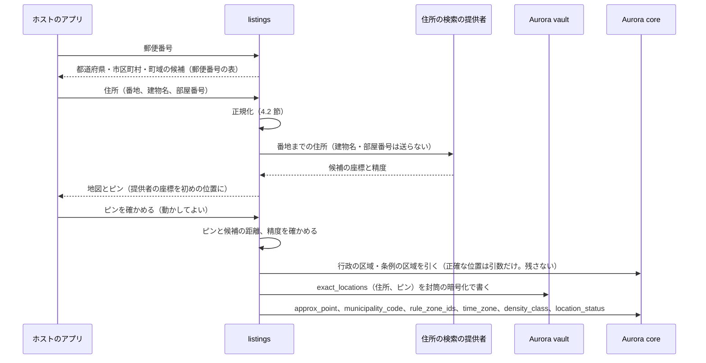

# Location and geo: Airbnb

位置と地名。住所の入力と確かめ、住所の検索と地図の提供者の境界、正確な位置の金庫、正確な位置から求める値（自治体のコード、条例の区域、タイムゾーン、密度の区分）、ずらした位置の決め方と割り出しの防止、正確な住所を出す時期、地名の辞書（日本語と外国語の名前、かなとローマ字の揺れ）、地図の範囲と多角形を決める。

前提となる決定は次のとおり。

- 正確な住所と位置は vault、ずらした位置（`approx_point`）は core に置く。検索の索引には `approx_point` だけを入れる（[ADR-0001](../decisions/0001-platform-and-stack.md)、[ADR-0003](../decisions/0003-search-for-date-range-availability.md)）
- 正確な位置・住所は `exactLocationVisible(viewer, listing)` が、ホストのアカウントの成員と、`confirmed`・`in_stay` の予約のゲスト（チェックアウトの後 7 日まで）に限って許す（[ADR-0007](../decisions/0007-tenancy-host-accounts-and-rls.md)）
- 地理の検索は OpenSearch の `geo_point` と `geo_shape`。Uber の題材の六角形の格子は使わない（[ADR-0003](../decisions/0003-search-for-date-range-availability.md)）
- 正確な住所はチェックインの 48 時間前ではなく、予約の確定の時にゲストへ出す（[architecture/README.md](README.md) の 6 節の決定）
- 物件のタイムゾーンは位置から決め、ホストは変えられない（[ADR-0002](../decisions/0002-availability-representation-and-double-booking.md)）

この文書で決めたことは次の ADR にある。

| ADR | 決定 |
| --- | --- |
| [0014](../decisions/0014-approximate-location-offset.md) | ずらした位置は、正確な位置から、密度の区分で決めた輪（都市 300〜500 m、郊外 400〜650 m、地方 500〜800 m）の中の、秘密の鍵と位置の組の ID から HMAC で決める点にする。40 m 以内の物件は同じ位置の組として同じ点を共有し、40 m 未満のピンの直しでは点を変えない。地図には点を中心に輪の外径の円を出す |
| [0015](../decisions/0015-place-dictionary-and-name-normalization.md) | 地名の辞書は core の PostGIS の `places` を正にし、OpenSearch の `places` の索引に写す。名前は日本語・かな・ローマ字・英語・中国語（簡体・繁体）・韓国語を持ち、ローマ字は長音・撥音・訓令式の揺れを畳んだ正規の鍵で引く。行政の区域は多角形、駅と観光地は点と半径 |
| [0016](../decisions/0016-geocoding-adapter-and-confirmed-pin.md) | 住所の検索と地図は、自前の API の後ろの提供者のアダプターで使う。vault に残す位置はホストが地図で確かめたピンだけで、提供者の座標そのものは残さない。自治体のコード・条例の区域・タイムゾーン・密度の区分は、ピンの確定の時に正確な位置から求めて core に書き、正確な位置は書かない |

## 1. 範囲

- 扱う：住所の入力の形と正規化、郵便番号からの補完、住所の検索の提供者と地図のタイルの提供者のアダプター、ピンの確かめ、vault の `exact_locations`、正確な位置から求める値、ずらした位置、位置の組、ピンの直しの上限、正確な住所を出す経路の判定（`exactLocationVisible()` の使い方）、地名の辞書と正規化、入力の補完、地名から範囲への直し方、地図の範囲の扱い。
- 扱わない：
  - 検索の問い合わせの組み立てと順位（[search-and-ranking.md](search-and-ranking.md)）。この文書は地理の条件の形を渡す。
  - 条例の区域の中身（regulatory-compliance-japan の領域）。この文書は、正確な位置から区域の ID を求める仕組みを書く。
  - チェックインの案内の中身と出す時期（booking-and-holds の領域）。
  - vault の鍵と封筒の暗号化（security の領域）。
  - 区画の需要の集計（MVP の後。別の ADR）。

## 2. 事実（確かめたこと）

| 項目 | 事実 | この設計 |
| --- | --- | --- |
| 本家の位置の秘匿 | 正確な位置を出す設定を切ると、地図はおおよその範囲を出す。番地と部屋の番号は確定した予約のゲストにだけ出す（[ヘルプの記事 2141](https://www.airbnb.com/help/article/2141)）。ずらし方は**未検証** | 決まった点にずらす（ADR-0014） |
| 本家の正確な住所を出す時期 | 確定の時か、チェックインの 48 時間前かは資料の間で食い違う（**未検証**。[intent.md](../intent.md) の出典） | 確定の時（[architecture/README.md](README.md) の 6 節） |
| Uber の題材の住所の検索 | 提供者の利用条件（保存の期間、他の地図との併用）は提供者ごとに違う。提供者の座標でなく、利用者が確かめたピンを残す形にした（Uber の題材の [maps-and-geodata.md](../../../uber/docs/architecture/maps-and-geodata.md) の 7 節、[ADR-0034](../../../uber/docs/decisions/0034-geocoding-provider-and-pickup-points.md)） | 同じ形にする（ADR-0016） |
| 地名の辞書の出どころ | 行政の区域の多角形、駅、地方公共団体の名前の読みは国の公開のデータにある見込み。多言語の名前の出どころとライセンスは確かめていない（**未検証**） | E4 の前の `place-dictionary-poc` で確かめる |

いずれも 2026-10-10 に確認。

## 3. 要件

| 要件 | 値 | 出どころ |
| --- | --- | --- |
| 正確な位置の漏れ | 確定した予約のゲスト・ホストのアカウント・権限のある運用者の外に出た事象 0 | NFR-016 |
| 割り出し | 範囲の細かい問い合わせを 1 万回重ねても、返る位置は `approx_point` だけで、正確な位置に近づかない | [quality.md](../quality.md) の 2.2.1 節 E |
| 地名の候補 | 入力の補完 p95 100ms | NFR-001 |
| 地名の揺れ | 試験のベクトル（「渋谷」「しぶや」「Shibuya」「涩谷」「시부야」、旧字・長音・全角半角）が決めた範囲に直る | [quality.md](../quality.md) の 2.2.1 節 E |
| 住所の検索 | 住所の入力からピンの候補まで p95 1 秒（提供者を含む） | 本システムの値 |
| 写真の位置情報 | 配る写真に GPS が 0 件 | [listings-and-content.md](listings-and-content.md) の 6 節 |

## 4. 住所とピン（ADR-0016）

### 4.1 流れ



- 住所の検索の提供者に送るのは、番地までの住所。建物名と部屋番号は送らない（提供者の精度にほぼ効かず、個人のデータを減らす）。
- アプリは自前の API（`/v1/host/locations/geocode`、`/v1/host/locations/confirm`）だけを呼ぶ。提供者の鍵をアプリに置かない。地図のタイルは、提供者のアプリ用の鍵（バンドル ID・参照元の制限つき）で端末が直接取る。
- 入力の住所・ピンの座標を、ログ・トレース・メトリクスに書かない。数えるのは件数・精度の区分・遅れだけ。

### 4.2 住所の正規化（日本）

保存の形は構造の項目（`postal_code`、`prefecture`、`municipality`、`town`、`block`、`building`、`unit`）。提供者に送る前と、同じ住所の判定の前に、次を順に当てる（`packages/geo/normalizeJpAddress`）。

1. NFKC。全角の英数・記号を半角に。
2. ハイフン類（`‐`・`－`・`ー`・`−`・`―`）を、数字に挟まれたときだけ `-` に揃える。
3. 漢数字の丁目・番・号を数字に（「三丁目」→「3丁目」、「十二番」→「12番」）。
4. 「3丁目12番5号」「3-12-5」「３の１２の５」を `3-12-5` の形に揃える。
5. 町域の旧字・異体字の表（「澁」→「渋」、「龍」と「竜」など。表は辞書と共有、5.3 節）。
6. 「ヶ」「ケ」「が」の揺れは、町域の名前の表で正しい表記に直す（「霞が関」）。

**例**：「〒１００－０００１ 東京都千代田区千代田一丁目１番１号」（架空の入力の形の例）→ `postal_code=100-0001`、`prefecture=東京都`、`municipality=千代田区`、`town=千代田`、`block=1-1-1`。

### 4.3 ピンの確かめ

| 確かめ | 値 | 外れたとき |
| --- | --- | --- |
| 提供者の精度 | 番地か街区の精度 | 町丁目の精度以下なら、ピンを必ず動かして確かめさせる |
| ピンと候補の距離 | 300 m 以内 | 300 m を超えたら `location_status = 'needs_review'`。運用の審査（住所を確かめる書類）。偽のリスティングの信号にもする |
| 自治体のコード | ピンの行政の区域と、住所の市区町村が同じ | 違えば `needs_review` |
| 届出住宅 | 日本の届出住宅は、届出の住所と同じ（regulatory-compliance-japan の領域） | 違えば公開できない |

- `location_status`：`unconfirmed` → `confirmed`、または `needs_review` → `confirmed`・`rejected`。`confirmed` でないと公開できない（[listings-and-content.md](listings-and-content.md) の 4.2 節）。

### 4.4 正確な位置から求める値

ピンの確定の時に、`listings` のプロセスのメモリーの中で正確な位置から求め、core に書く。正確な位置は core に書かない。

| 値 | 求め方 | 使い道 |
| --- | --- | --- |
| `municipality_code` | core の `admin_areas`（行政の区域の多角形）に `ST_Contains` で問う。点は問い合わせの引数だけで、DB のログに引数を出さない設定にする | 税の表（[taxes.md](taxes.md)）、自治体の規則（[ADR-0006](../decisions/0006-regulatory-night-cap-enforcement.md)） |
| `rule_zone_ids` | `municipal_rule_sets` の区域の多角形に同じく問う | 条例の区域の制限（regulatory-compliance-japan の領域） |
| `tax_zone_ids` | 税の区域の多角形（自治体の全域でない宿泊税・入湯税の区域）に問う | [taxes.md](taxes.md) の 4.1 節 |
| `time_zone` | 日本は `Asia/Tokyo`。他の国はタイムゾーンの境界の多角形（S2 以降。出どころは**未検証**） | [ADR-0002](../decisions/0002-availability-representation-and-double-booking.md) |
| `density_class` | 行政の区域の人口密度（人/km²）で `urban`（4,000 以上）・`suburban`（1,000 以上 4,000 未満）・`rural`（1,000 未満） | ずらした位置の輪（5 節） |
| `approx_point` | 5 節 | 検索、地図、画面 |

- 区域の多角形が変わったら（条例の改正、市町村の合併）、vault の正確な位置から求め直す運用のジョブを回す。ジョブは vault を読める役割で動き、結果だけを core に書く。

### 4.5 正確な住所を出す経路

| 経路 | 出すもの | 判定 |
| --- | --- | --- |
| 予約の画面（確定の後のゲスト） | 住所、ピン、建物名、部屋番号 | `exactLocationVisible()`。`confirmed`・`in_stay`・チェックアウトの後 7 日 |
| チェックインの案内 | 入り方（booking-and-holds の領域） | 同上 |
| ホストのアカウント | 全部 | 成員（役割 `messages_only` を除く） |
| 運用者 | 全部 | JIT の権限と vault の監査（security の領域） |
| 検索・地図・リスティングの画面・共有のページ・通知・メッセージの自動の文・iCal の書き出し・データレイク | `approx_point`、市区町村の名前、近い地名だけ | 正確な位置を読む経路を持たない |

- 正確な位置を読む関数は `readExactLocation(viewer, listing_id)` の 1 つ。中で `exactLocationVisible()` を呼び、vault の監査の行を同じトランザクションで書く。
- 地図のリスティングの画面の「最寄りの駅から徒歩 N 分」は、`approx_point` から求める（正確な位置から求めると、距離で位置が絞れる）。

## 5. ずらした位置（ADR-0014）

### 5.1 決め方

```
入力：正確な位置 P（緯度 φ、経度 λ）、位置の組 g（5.2 節）、密度の区分、鍵 K（KMS で守る秘密。位置の組ごとに変えない）
輪：urban [300 m, 500 m]、suburban [400 m, 650 m]、rural [500 m, 800 m]

h      = HMAC-SHA256(K, "approx:v1:" || g.id || ":" || try)      … try は 0 から
u1, u2 = h の先頭 8 バイトと次の 8 バイトを [0, 1) の数にしたもの
方位 β = 360° × u1                                                … 北から時計回り
距離 r = sqrt(u2 × (r_max² − r_min²) + r_min²)                     … 輪の面積で一様
Δ北 = r × cos β、Δ東 = r × sin β
approx = (φ + Δ北 / 111,320、λ + Δ東 / (111,320 × cos φ))           … 1 km 未満なので平面で近似
小数 5 桁に丸める（約 1 m）
```

- **輪で一様にする。** 円の中で一様にすると、正確な位置のすぐ近くに点が来ることがある。輪にすると、点と正確な位置の距離は必ず `r_min` 以上になる。
- **陸に置く。** 点が `admin_areas` のどの多角形にも入らない（海・湖）なら、`try` を 1 上げてやり直す。16 回で入らなければ、最後の点を使い、運用の確かめの待ち行列に入れる。
- **地図の表示。** 地図は点を中心に半径 `r_max` を 100 m 単位に切り上げた円を出す（urban 500 m、suburban 700 m、rural 800 m）。正確な位置は必ず円の中にある。
- **作り直さない。** 同じ位置の組の点は、鍵を変えない限り同じ。点を作り直すたびに違う点を出すと、点の平均で正確な位置を推せるため（[architecture/README.md](README.md) の 1.3 節 A）。

**例**（架空の点）：P = (35.66000, 139.70000)、`urban`（300〜500 m）、HMAC から u1 = 0.3125、u2 = 0.64。

| 段 | 計算 | 値 |
| --- | --- | --- |
| 方位 | 360 × 0.3125 | 112.5° |
| 距離 | sqrt(0.64 × (500² − 300²) + 300²) = sqrt(102,400 + 90,000) | 438.6 m |
| Δ北 | 438.6 × cos 112.5° = 438.6 × (−0.38268) | −167.8 m |
| Δ東 | 438.6 × sin 112.5° = 438.6 × 0.92388 | 405.2 m |
| Δ緯度 | −167.8 / 111,320 | −0.001508° |
| Δ経度 | 405.2 / (111,320 × cos 35.66° = 111,320 × 0.81243 = 90,440) | 0.004480° |
| approx | (35.66000 − 0.001508、139.70000 + 0.004480) | (35.65849, 139.70448) |

- 地図は (35.65849, 139.70448) を中心に半径 500 m の円を出す。P は中心から 438.6 m で円の中にある。

### 5.2 位置の組と割り出しの防止

| 割り出しの方法 | 防ぎ方 |
| --- | --- |
| 同じ建物の複数のリスティングの点を平均する | 正確な位置が 40 m 以内の物件は、ホストのアカウントをまたいで同じ位置の組（`location_groups`）に入り、同じ点を共有する。新しいピンの確定の時に、vault で 40 m 以内の既存の組を探す（探すのは vault を読める `listings` の役割だけ） |
| ホストがピンを少しずつ動かし、点の変化を見る | 組の中心から 40 m 未満の直しでは、組を変えない（点は同じ）。40 m 以上の移動は新しい組になる。新しい組への移動は 1 リスティング 365 日に 3 回まで。超えたら運用の審査 |
| 地図の範囲を細かく変えて問う | 索引には `approx_point` しかない。細かく問うても得られるのは点の位置で、点から正確な位置は輪（urban で 0.50 km²）の中としかわからない |
| 距離の並べ替え・「駅から徒歩 N 分」 | `approx_point` から求める |
| 写真の EXIF | 配る写真から位置情報を除く（[listings-and-content.md](listings-and-content.md) の 6 節） |
| 説明・メッセージ・レビューの文の住所 | 説明の同期の検査と、確定の前のメッセージの絞り込みで住所の形を止める（[messaging.md](messaging.md) の 5 節）。レビューの文は公開の前の検査で住所の形を伏せる（[reviews.md](reviews.md) の 4.4 節） |
| 町丁目の名前 | 画面に出す地名は市区町村と、`approx_point` に近い地名の辞書の名前（駅、観光地）だけ。町丁目は出さない |
| 過去の点を集める | 点を変えるのは組が変わる時だけで、回数に上限がある。古い点を API で返さない |

- 残る危険：組を変える 3 回の移動で、3 つの独立した点が集められる。3 つの点の平均の誤差は、1 つの点の場合の約 0.58 倍（1/√3）で、なお `r_min` に近い距離が残る。上限の回数はこの見積もりで決めた。

### 5.3 鍵

- `K` は KMS で守る秘密の値で、`listings` の役割だけが使える。鍵を替えると全部の点が変わり、古い点と新しい点の組で推せるため、替えるのは漏えいの時だけにする。替える時は、全部の組の点を作り直し、検索の索引を作り直す（security の領域の手順）。
- 点を求める関数（`approximate(P, group, density_class)`）は `packages/geo` の 1 か所。

## 6. 地名の辞書（ADR-0015）

### 6.1 中身

| 種類 | 形 | 範囲への直し方 | 例 |
| --- | --- | --- | --- |
| `prefecture` | 多角形 | 多角形 | 東京都 |
| `municipality` | 多角形 | 多角形 | 渋谷区、京都市、ニセコ町 |
| `ward_area`（地域の名前） | 多角形（運用が描く） | 多角形 | 祇園、浅草、心斎橋 |
| `station` | 点 | 点と半径 2 km（[ADR-0003](../decisions/0003-search-for-date-range-availability.md)） | 京都駅 |
| `poi`（観光地・空港） | 点 | 点と半径（種類ごと。観光地 2 km、空港 5 km、スキー場 5 km） | 伏見稲荷大社、成田空港 |

- 正本は core の `places`（PostGIS。`geom` は多角形か点）と `place_names`（言語ごとの名前と読み）。OpenSearch の `places_v<n>` に写し、入力の補完と地名の検索はそこで引く。
- 多角形は、OpenSearch の `geo_shape` に入れる前に 50 m の許容で単純化し、100 m 外へ広げる（単純化で端のリスティングが落ちないため）。正本の多角形は単純化しない。
- 名前の出どころ：行政の区域・駅・自治体の読みは国の公開のデータ、英語・中国語・韓国語の名前は公開のデータの多言語の名前と、運用の作る表。どのデータを使えるか（商用の利用、表示の義務、改変の条件）は `place-dictionary-poc` で確かめる（**未検証**）。

### 6.2 正規化（`normPlaceKey`）

利用者の入力と辞書の名前の両方に、同じ関数を当てる（`packages/geo/normPlaceKey`）。

1. NFKC、小文字。
2. ダイアクリティカルマークを除く（`ō`→`o`、`ū`→`u`、`â`→`a`）。
3. 空白、ハイフン、アポストロフィ、中黒を除く。
4. かなを含む文：カタカナをひらがなにし、ヘボン式のローマ字に直す。長音符「ー」は除く。促音「っ」は次の子音を重ねる。
5. ローマ字の畳み込み（この順）：
   1. 訓令式 → ヘボン式：`si`→`shi`、`ti`→`chi`、`tu`→`tsu`、`hu`→`fu`、`zi`→`ji`、`sy(a|u|o)`→`sh$1`、`ty(a|u|o)`→`ch$1`、`zy(a|u|o)`→`j$1`。
   2. 撥音：`m` の後に `b`・`m`・`p` が続けば `n` に（`shimbashi`→`shinbashi`）。
   3. 長音：`ou`→`o`、`oo`→`o`、`oh`（後に子音か終わり）→`o`、`uu`→`u`。
   4. 促音：`tch`→`cch`。
6. 接尾の語の扱い：「市」「区」「町」「村」「駅」「-shi」「-ku」「-machi」「-eki」「station」を除いた鍵と、付けた鍵の両方を作る。

漢字・中国語・韓国語の入力は、ローマ字に直さず、次の別名の表で引く。

| 表 | 中身 |
| --- | --- |
| 字体の揺れ | 旧字と新字（澁/渋、櫻/桜、龍/竜）、「ヶ」「ケ」「が」 |
| 中国語 | 簡体と繁体の名前を両方持つ（涩谷/澀谷）。日本の新字の名前（渋谷）とも結ぶ |
| 韓国語 | ハングルの名前（시부야） |
| 英語の通称 | `Shibuya Crossing` のような観光の名前（POI） |

**試験のベクトル（一部）**

| 入力 | 正規の鍵・引き方 | 引ける地名 |
| --- | --- | --- |
| 渋谷 / 澁谷 | 名前の表 | 渋谷区、渋谷駅 |
| しぶや / シブヤ | `shibuya` | 同上 |
| Shibuya / SHIBUYA / Sibuya / shibuya-ku | `shibuya`（`ku` を除いた鍵） | 同上 |
| 涩谷 / 澀谷 / 시부야 | 名前の表 | 同上 |
| 東京 / とうきょう / Tokyo / Toukyou / Tōkyō / Tohkyoh | `tokyo` | 東京都 |
| 大阪 / Osaka / Oosaka / Ōsaka / Ohsaka | `osaka` | 大阪府、大阪市 |
| 新橋 / Shimbashi / Shinbashi | `shinbashi` | 新橋駅 |
| 霞が関 / 霞ヶ関 / 霞ケ関 / Kasumigaseki | 字体の表 / `kasumigaseki` | 霞ケ関駅（駅名の表記）、霞が関（地域） |
| 京都駅 / Kyoto Station / kyoto eki | `kyoto` ＋ 種類 `station` | 京都駅 |

- 「Ooarai」（大洗）の `oo` も `o` に畳まれ `oarai` になる。辞書の名前も同じ関数を通るので、引けることは変わらない。畳み込みで別の地名が同じ鍵になる組は、辞書の作成の時に一覧にし、人気の順と親の地名の表示で分ける。

### 6.3 入力の補完

- OpenSearch の `places` の索引で、正規の鍵の前方一致（`edge_ngram` 1〜20）と、日本語の名前の前方一致（ICU で正規化）を問う。
- 点：`text_score × (1 + log10(1 + listing_count)) × type_weight`。`type_weight` は `municipality` 1.2、`station` 1.1、`prefecture`・`ward_area`・`poi` 1.0。`listing_count` は地名の範囲の `listed` のリスティングの数（日次）。
- 同じ名前の地名（府中：東京都と広島県）は、親の地名を付けて両方を出す。補完を選ばずに語だけで検索したときは、点の最も高い地名を使い、画面に「他の候補」を出す。
- 上位 8 件を返す。p95 100ms（NFR-001）。利用者の入力の語を記録しない（件数と遅れだけ）。

## 7. 地図の範囲

- 検索の地理の条件は、次の 3 つのどれか（[search-and-ranking.md](search-and-ranking.md) の 5 節）。

| 形 | 中身 | 上限 |
| --- | --- | --- |
| `bbox` | 地図の範囲（北東と南西の角）。小数 4 桁に丸める（約 11 m。写しの鍵の揃え） | 対角 3,000 km まで。超えたら 422 `bbox_too_large` |
| `place` | 地名の ID。多角形か点と半径に直す | - |
| `point_radius` | 点と半径（現在地の近く） | 半径 50 km まで |

- 地名で探したときの初めの地図の範囲は、地名の多角形の外接の矩形（点の地名は半径の円の外接）。
- 地図を動かした後は `bbox` に変わる（地名の多角形での絞りをやめる）。
- 地図の点（ピン）は `approx_point` で返す（[search-and-ranking.md](search-and-ranking.md) の 5.5 節）。

## 8. 失敗と回復

| 事象 | 影響 | 扱い |
| --- | --- | --- |
| 住所の検索の提供者の停止 | 新しいピンの確定ができない | 郵便番号の表と地図の手でのピンで続ける（精度の確かめを `needs_review` にする）。既存のリスティングは影響を受けない |
| 地図のタイルの提供者の停止 | 地図が出ない | 一覧の表示に切り替える。検索は続く |
| 区域の多角形の誤り | 税・条例の判定の誤り | 求め直しのジョブ（4.4 節）。誤りの期間の見積もり・予約は、税の表の変更と同じ扱い（[taxes.md](taxes.md) の 9 節） |
| 鍵 `K` の漏えい | 全部の点から正確な位置が推せる | SEV1。鍵を替え、全部の点を作り直し、索引を作り直す（5.3 節） |
| 辞書の誤り（引けない地名） | 検索の取りこぼし | 試験のベクトルに足し、辞書を直して索引を作り直す（別名の切り替え） |
| vault の停止 | 新しいピンの確定、確定した予約の住所の表示ができない | 予約の画面に「住所は後で表示します」。確定の通知の住所は送らない設計なので影響しない |

## 9. 上限

| 対象 | 値 |
| --- | --- |
| 住所の検索 | ホスト 1 人 1 時間 60 回 |
| 新しい位置の組への移動 | 1 リスティング 365 日に 3 回 |
| ピンと候補の距離 | 300 m（超えたら審査） |
| 入力の補完 | 1 セッション 1 秒 10 回、1 回 8 件 |
| 地図の範囲 | 対角 3,000 km、`point_radius` 50 km |
| 地名の別名 | 1 地名 50 個 |

## 10. data-model への項目

| 置き場所 | 中身 | 節 |
| --- | --- | --- |
| Aurora vault `exact_locations`（`listing_id`、`location_group_id`、住所の構造の項目（封筒の暗号化）、`pin_lat`・`pin_lng`（封筒の暗号化）、`geocode_precision`、`confirmed_at`、`confirmed_by`） | 正確な位置 | 4 |
| Aurora vault `location_groups`（`id`、`center_geohash7`（vault の中だけ）、`center_lat`・`center_lng`（封筒の暗号化）、`density_class`、`approx_lat`、`approx_lng`、`key_version`） | 位置の組 | 5.2 |
| Aurora core `listings` の列 `approx_point`（`geography(Point)`）、`approx_radius_m`、`municipality_code`、`rule_zone_ids`、`tax_zone_ids`、`density_class`、`location_status`、`location_group_moves`（365 日の数） | 求めた値 | 4.4、5 |
| Aurora core `admin_areas`（`municipality_code`、`name`、`geom`、`population_density`、`valid_from`）、`tax_zones`、`places`（`id`、`kind`、`geom`、`radius_m`、`parent_id`、`listing_count`）、`place_names`（`place_id`、`lang`、`name`、`reading`、`norm_keys`） | 区域と辞書 | 4.4、6 |
| OpenSearch `places_v<n>`（別名 `places`） | 地名の索引 | 6 |
| KMS の鍵 `approx-location-hmac` | ずらした位置の鍵 | 5.3 |

## 11. テストと性質

| ID | 性質・試験 |
| --- | --- |
| PROP-GEO-001 | 任意の正確な位置と密度の区分と位置の組で、`approximate()` の点と正確な位置の距離は `[r_min − 40 m, r_max + 40 m]` の中（40 m は組の中心とのずれ）。地図の円は正確な位置を含む |
| PROP-GEO-002 | 同じ位置の組の点は、何度求めても同じ。正確な位置が 40 m 以内の 2 つのリスティングは、同じ点を持つ |
| PROP-GEO-003 | 任意の範囲の問い合わせの列（1 万回）の応答に、`approx_point` 以外の座標が現れない。検索の索引の文書に正確な位置の欄がない（[quality.md](../quality.md) の 2.2.1 節 E） |
| PROP-GEO-004 | 任意の主体と予約の状態で、`readExactLocation()` が返すのは `exactLocationVisible()` が許す主体だけで、毎回 vault の監査の行がある（[quality.md](../quality.md) の 2.2.1 節 H） |
| PROP-GEO-005 | 任意の入力で `normPlaceKey` は冪等（2 回当てても同じ）。6.2 節の表の揺れは同じ鍵に直る |
| PROP-GEO-006 | 単純化して広げた多角形は、正本の多角形を含む |
| 試験のベクトル | 6.2 節の地名の表（QA が期待する値を持つ）、4.2 節の住所の正規化、5.1 節の例の点 |
| 漏れの経路 | 通知・メッセージの自動の文・iCal・データレイク・ログに、住所と正確な位置が出ない（[quality.md](../quality.md) の 2.2.1 節 H の表） |

## 12. Story の候補

| Epic | Story | 中身 |
| --- | --- | --- |
| E4 | `place-dictionary-poc` | 地名の辞書の出どころとライセンス、多言語の名前、住所の検索の提供者の比べ（6.1 節、4 節） |
| E4 | `address-and-exact-location` | 住所の入力と正規化、提供者のアダプター、ピンの確かめ、vault、`readExactLocation()`（4 節） |
| E4 | `derived-location-fields` | 自治体のコード、条例の区域、税の区域、タイムゾーン、密度の区分と、求め直しのジョブ（4.4 節） |
| E4 | `approximate-location` | ずらした位置、位置の組、移動の上限、割り出しの試験（5 節） |
| E4 | `place-search-and-areas` | 地名の索引、正規化、入力の補完、範囲への直し方（6・7 節） |
| E4 | `map-provider-integration` | 地図のタイルの提供者の選定と連携 |

## 13. 未解決の問い

### 決定（2026-10-10、既定案）

- **ずらし方**：密度の区分の輪の中の HMAC の点、40 m の位置の組、移動 365 日に 3 回（ADR-0014）。
- **辞書**：PostGIS の正本と OpenSearch の写し、正規の鍵（ADR-0015）。
- **提供者**：自前の API の後ろのアダプター、確かめたピンだけを残す（ADR-0016）。
- **正確な住所を出す時期**：予約の確定の時（本家は**未検証**）。

### 持ち越し

| 問い | いつ・どう決めるか |
| --- | --- |
| 地名の辞書のデータの出どころとライセンス、多言語の名前の質 | E4 の前の `place-dictionary-poc`。結果を ADR-0015 の後に記録する |
| 住所の検索・地図の提供者と利用条件（保存、他の地図との併用、データの所在） | E4 の `map-provider-integration`。越境は法務の L8 |
| 密度の区分の閾値（4,000・1,000 人/km²）と輪の幅 | `approximate-location` で、架空の物件の分布に対する割り出しの模擬で QA と確かめる |
| 日本の外のタイムゾーンの境界のデータ | S2 で日本の外のホストを足す時 |
