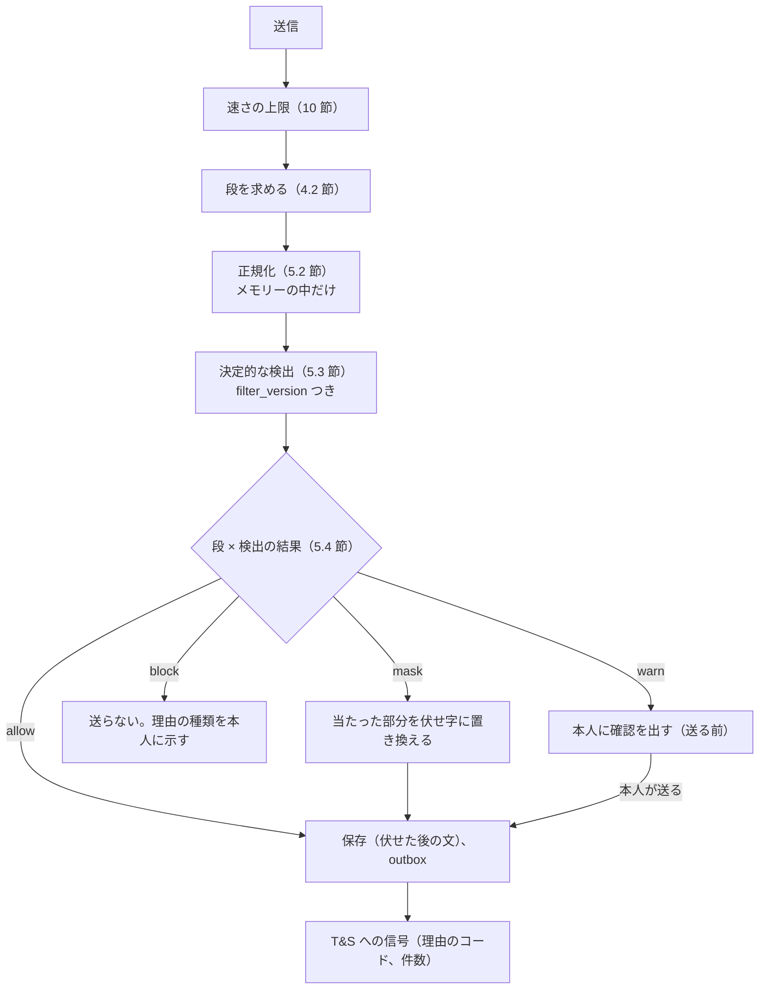
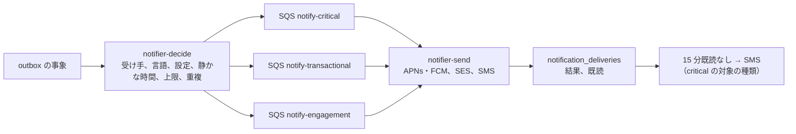

# Messaging: Airbnb

メッセージと通知。問い合わせと予約のメッセージのスレッド、連絡先の絞り込みと段（確定の前と後）、外部の支払いへの誘導の検出、メッセージの翻訳、決まった文の返信と予約の時刻に送る文、通報、運用者が本文を見る条件、通知の種類と級と配信（プッシュ、メール、SMS）、静かな時間、通知の中身の規則、通信の秘密の枠組み（法務の L9）を決める。

前提となる決定は次のとおり。

- メッセージ・通知は Aurora content に置き、`messaging` と `notifier` が書く（[ADR-0001](../decisions/0001-platform-and-stack.md)）
- メッセージのスレッドは予約の 2 者の RLS（ゲスト本人か、リスティングのホストのアカウントの成員）（[ADR-0007](../decisions/0007-tenancy-host-accounts-and-rls.md)）
- 予約の前は、電話番号・メールアドレス・URL・外部のサービスの ID・外部の支払いへの誘導を伏せる。確定の後は外部の支払いへの誘導だけを止める。範囲は `legal.message_scan_mode`（法務の L9）（[architecture/README.md](README.md) の 6 節）
- 送る時の決定的な検査の形は Mercari の題材を参照する（[ADR-0047](../../../mercari/docs/decisions/0047-send-time-abuse-filter-and-scan-modes.md)）。通知の級とレーンも Mercari の題材を参照する（[ADR-0063](../../../mercari/docs/decisions/0063-notification-kinds-lanes-and-payload.md)、[ADR-0064](../../../mercari/docs/decisions/0064-fanout-batching-quiet-hours-and-caps.md)）

この文書で決めたことは次の ADR にある。

| ADR | 決定 |
| --- | --- |
| [0052](../decisions/0052-message-threads-and-stages.md) | スレッドは問い合わせとして (ゲスト, リスティング) で始まり、予約が作られると、その予約に結ぶ。1 つの予約に 1 つのスレッド。送る時の段（`pre_booking`・`booked`・`post_stay`）は予約の状態から決め、確定の前・キャンセルの後・チェックアウトから 14 日の後は `pre_booking` の規則に戻る。順序はスレッドの `seq`、再送は `client_msg_id` の一意で 1 回 |
| [0053](../decisions/0053-contact-info-filter-by-stage.md) | 連絡先の絞り込みは送る時にメモリーの中で行い、`pre_booking` では電話番号・メールアドレス・URL・外部の ID・住所を伏せ字に置き換えて残りを送り、外部の支払いへの誘導の点 0.8 以上は送らない。`booked` では外部の支払いへの誘導だけを止める。正規化は日本語・英語・中国語・韓国語の数字の読みを含む。範囲は `legal.message_scan_mode`、結論までは `send_time_pattern` |
| [0054](../decisions/0054-notification-kinds-lanes-and-quiet-hours.md) | 通知は種類ごとに級（`critical`・`transactional`・`engagement`）とレーン（SQS の別の待ち行列）を持つ。`critical` は静かな時間と上限の外で、プッシュに 15 分の既読がなければ SMS を足す。静かな時間は受け手のタイムゾーンの 22:00〜08:00 で `engagement` にだけ効く。通知の中身に正確な住所・鍵の番号・旅券の番号を入れない |

## 1. 範囲

- 扱う：スレッドの種類と作り方、参加者、メッセージの保存と順序と再送、添付、送る時の段、連絡先の絞り込みと外部の支払いへの誘導の検出、伏せ字、翻訳、決まった文の返信と予約の時刻に送る文、自動の文、通報と証拠、運用者が本文を見る条件、保持の枠組み、通知の種類・級・レーン・経路・静かな時間・上限・中身の規則・言語、配信の記録。
- 扱わない：
  - 予約の状態の機械（booking-and-holds の領域）。この文書は状態を読むだけ。
  - チェックインの案内の中身と時期（booking-and-holds の領域）。予約の時刻に送る文から参照する。
  - 通報の案件の審査と措置（[trust-and-safety.md](trust-and-safety.md) の 5.4 節）。
  - 端末の登録とプッシュのトークン、ログイン（accounts の領域）。
  - メールの送信の基盤（SES の設定、SPF・DKIM）（infrastructure の領域）。
  - 外部送信規律の公表（observability の領域、法務の L9）。

## 2. 事実（確かめたこと）

| 項目 | 事実 | この設計 |
| --- | --- | --- |
| 本家の連絡先の扱い | 予約の前のメッセージで連絡先を伏せること、外部での支払いを禁じる方針は広く知られるが、伏せる条件と段の境は公式の資料で確かめられなかった（**未検証**） | 段ごとの規則（ADR-0053） |
| Mercari の題材の絞り込み | 送る時にメモリーの中で正規化と決定的な検出を行い、理由のコードだけを記録する。`legal.message_scan_mode` の 3 つの値（[messaging-and-comments.md](../../../mercari/docs/architecture/messaging-and-comments.md) の 5 節） | 同じ形を取り、段と多言語の読みを足す |
| 本家のメッセージの翻訳 | 翻訳の操作があることは知られるが、方式は確かめられなかった（**未検証**） | 受け手の操作で訳す（6 節） |

いずれも 2026-10-10 に確認。

## 3. 要件

| 要件 | 値 | 出どころ |
| --- | --- | --- |
| メッセージの配信 | 送信から相手の端末への依頼まで p95 5 秒 | NFR-012 |
| 予約の通知 | 確定・リクエスト・キャンセルの事象から依頼まで p95 10 秒 | NFR-012 |
| 絞り込みの速さ | p95 100ms | NFR-012 |
| 予約の前の連絡先 | 電話番号・メールアドレス・外部の ID・外部の支払いへの誘導を、決めた規則で止めるか伏せる | [intent.md](../intent.md) の守るべき振る舞い |
| 正確な住所 | 予約の確定の前のメッセージの自動の文に住所が入らない。ホストの書いた住所・電話番号を伏せる | [quality.md](../quality.md) の 2.2.1 節 H |
| 外部の予定の重なり | 取り込みから 5 分以内にホストに知らせる | NFR-003（通知の経路をこの文書が持つ） |
| 可用性 | メッセージ 月間 99.9% | NFR-010 |

## 4. スレッドとメッセージ（ADR-0052）

### 4.1 スレッド

| 種類 | 作る時 | 参加者 |
| --- | --- | --- |
| `inquiry` | ゲストがリスティングの画面から問い合わせる | ゲスト、ホストのアカウントの成員（役割 `owner`・`full`・`messages_only`、リスティングごとの絞りに従う） |
| `reservation` | `reserveStay` で予約ができる時。同じ (ゲスト, リスティング) の 30 日以内の開いた `inquiry` があれば、それを予約に結んで `reservation` に変える。なければ新しく作る | 上と、確定の後に加えた共同の宿泊者 |
| `support` | CS・安全の担当がゲストかホストと話す（運用の画面から） | 本人と担当 |

- 1 つの予約に `reservation` のスレッドは 1 つ（`message_threads.reservation_id` の一意）。
- 運用の担当（CS、安全）は、案件があるときだけ `reservation` のスレッドに参加でき、参加は全員に表示する（「運用の担当が参加しました」）。

### 4.2 送る時の段

| 段 | 条件（送る時の予約の状態） |
| --- | --- |
| `pre_booking` | 予約のない `inquiry`。予約が `requested`・`pending_payment`・`declined`・`expired`。確定の後の `cancelled`。`completed` からチェックアウトの後 14 日を過ぎた |
| `booked` | `confirmed`・`in_stay` |
| `post_stay` | `completed` で、チェックアウトの後 14 日まで |

- 段は送るたびに予約の状態から求める（スレッドに書き込まない）。キャンセルされた予約のスレッドで、確定の間に伏せずに送れた連絡先は、そのまま残る（過去のメッセージを書き換えない）。
- `post_stay` の規則は `booked` と同じ（忘れ物、損害の請求の連絡）。14 日はレビュー・損害の請求の期間に合わせた（[reviews.md](reviews.md)、deposits-and-claims の領域）。

### 4.3 保存と順序

- content の `messages`（`thread_id`、`seq`、`sender`、`kind`（`text`・`image`・`system`・`template`）、`body`（絞り込みの後の文）、`body_lang`、`client_msg_id`、`filter_result`、`created_at`）。
- `seq` は、スレッドの行の `last_seq` を同じトランザクションで 1 上げて付ける。(`thread_id`, `client_msg_id`) の一意で、再送は既存の行を返す。
- 本文は 5,000 文字まで。画像は 1 通 5 枚、1 枚 10 MB。画像はリスティングの写真と同じ処理（メタデータの除去と確かめ）を通す（[listings-and-content.md](listings-and-content.md) の 6.2 節）。画像の中の文字（電話番号の写真）は検出しない（13 節）。
- 保存するのは**絞り込みの後**の文だけ。伏せる前の文を保存しない。
- 配信：outbox に `message.created` を書き、`notifier` が受け手ごとに通知を作る。アプリが前面にあるときは、`app-api` の WebSocket で `thread:{id}` の更新を受ける（Valkey の pub/sub）。

### 4.4 自動の文

- 予約の確定・変更・キャンセルの時に、スレッドに `system` のメッセージ（「予約が確定しました」と日付・人数）を入れる。住所・入り方・鍵の番号を入れない（チェックインの案内は予約の画面で、`exactLocationVisible()` を通して出す）。
- 自動の文の雛形は言語ごとのバージョンの付いた設定で、変数の一覧に住所の変数を持たない（型で禁じる）。

## 5. 連絡先の絞り込み（ADR-0053）

### 5.1 流れ

- 絞り込みは `messaging` のプロセスの中で、メモリーの中だけで行う。本文を外部のサービスに送らない。
- 記録（`message_filter_events`）は、スレッド、送り手、段、検出の種類のコード、`filter_version`、結果だけ。一致した文字を残さない。

### 5.2 正規化

Mercari の題材の正規化の手順（[messaging-and-comments.md](../../../mercari/docs/architecture/messaging-and-comments.md) の 5.2 節：NFKC、ゼロ幅の文字の除去、ひらがなをカタカナに、数字の読み替え、数字の間の区切りの除去、メールの読み替え）を本システムのコードで書き、次を足す。

| 足すもの | 中身 |
| --- | --- |
| 英語の数字の読み | `zero`・`oh`・`one`〜`nine` を、数字の並びの文脈（前後 3 語の中に数字か数字の読み）で数字に |
| 中国語の数字 | 〇・零・一〜九・两（漢字の読み替えと同じ表）、全角の数字 |
| 韓国語の数字 | 공・영・일・이・삼・사・오・육・칠・팔・구 を、数字の並びの文脈で数字に |
| 国際の番号 | `+` と 8〜15 桁（E.164）、`00` で始まる国際の番号 |
| メールの読み替え | `at`・`[at]`・`(at)`・`艾特`・`골뱅이` を `@`、`dot`・`[dot]`・`点`・`닷` を `.` |

### 5.3 検出の種類（`filter_version` 1）

| 種類 | 規則 |
| --- | --- |
| `phone` | 区切りを除いた写しで、`0` で始まる 10〜11 桁（日本の番号）、または `+`・`00` で始まる 8〜15 桁 |
| `email` | `[^\s@]+@[^\s@]+\.[a-z]{2,}` |
| `url` | `http`・`www.`・既知の TLD の並び。本システムのリスティングの URL（`https://<brand>.<domain>/rooms/…`）は除く |
| `external_id` | 他のサービスの名前の辞書（チャットのアプリ、SNS、決済のアプリ、他の宿泊の掲載先。本システムの値の一覧）と、ID らしい並び（英数と `_`・`.` の 4 文字以上、`@` の後の並び）が 20 文字の中に両方 |
| `address` | 都道府県・市区町村の名前の辞書と番地の形（`\d+(丁目|番地?|号|-\d+)`）が 40 文字の中に並ぶ、`〒?\d{3}-?\d{4}`、英語の住所の形（`\d+-\d+-\d+` と区・市の英語の名前） |
| `offplatform_payment` | 5.5 節の点 |

### 5.4 段ごとの結果

| 種類 | `pre_booking` | `booked`・`post_stay` |
| --- | --- | --- |
| `phone`、`email`、`url`、`external_id`、`address` | `mask` | `allow` |
| `offplatform_payment` 0.8 以上 | `block` | `block` |
| `offplatform_payment` 0.5 以上 0.8 未満 | `warn` | `warn` |
| 禁止の語（[trust-and-safety.md](trust-and-safety.md) の 5.6 節の辞書） | `block` | `block` |

- **伏せ字**：当たった部分を `［連絡先は予約の確定の後に送れます］`（受け手の言語の文）に置き換え、残りの文を送る。当たった部分どうしの間が 10 文字以内なら、間を含めて 1 つの伏せ字にまとめる。送り手には「連絡先の部分を伏せて送りました」と出す。どの文字が当たったかは示さない。
- 予約の前に伏せるのは、外部での予約と支払いへの誘導（手数料の回避と詐欺）を防ぐため。確定の後は、到着の連絡のための電話番号などを許す。
- 伏せ字の文はスレッドに残る。確定の後に、送り手がもう一度送れる。

**例 1（`pre_booking`、ホストからゲスト）**：「ご質問ありがとうございます。ぜろきゅうぜろ 1234 ５６７８ に LINE ください」

1. 正規化：NFKC、カタカナ、「ゼロ」「キュウ」「ゼロ」を 0・9・0 に。区切りを除いた写し「09012345678」。
2. `phone`（`0` で始まる 11 桁）、`external_id`（「LINE」が辞書にあり、20 文字の中に数字の並び）。
3. 段 `pre_booking` → `mask`。送られる文：「ご質問ありがとうございます。［連絡先は予約の確定の後に送れます］ ください」。記録は（スレッド、送り手、`pre_booking`、`phone`・`external_id`、`filter_version` 1、`mask`）だけ。

**例 2（`pre_booking`、ゲストからホスト、英語）**：「Can I book directly on your website and pay by bank transfer? It would save the fees.」

- 5.5 節の点：`book directly` 0.3、`bank transfer` 0.4、`your website` 0.3、`save the fees` 0.3、予約の前 ＋0.1。和 1.4 → 1.0。0.8 以上 → `block`。本人に「本システムの外での予約・支払いの誘導は送れません」と出す。

**例 3（`booked`、ゲストからホスト）**：「到着が遅れそうです。+81 90-1234-5678 に電話してもいいですか」

- `phone` は `booked` で `allow`。外部の支払いの語がない → そのまま送る。

### 5.5 外部の支払いへの誘導の点

語の組の重みを足して 1.0 で頭打ち。正規化の後の文で、40 文字（英語は 8 語）の窓の中の組だけを数える。辞書は言語ごと（日本語、英語、中国語、韓国語）で、T&S が持つバージョンの付いた設定。

| 語の組（例） | 重み |
| --- | --- |
| 「直接」「直接予約」「アプリの外」/ `book directly`・`direct booking`・`outside` / 「直接预订」/ 「직접 예약」 | 0.3 |
| 「振込」「現金」「前払い」/ `bank transfer`・`wire`・`cash`・`deposit` / 「转账」「现金」/ 「계좌이체」「현금」 | 0.4 |
| 決済のアプリ・送金のサービス・他の掲載先の名前（辞書） | 0.4 |
| 「自分のサイト」「ホームページ」/ `my website`・`your website` | 0.3 |
| 「手数料」と「かからない」「浮く」/ `save the fees`・`no fees` / 「省手续费」 | 0.3 |
| 段が `pre_booking` | ＋0.1 |

- 確定の後の「振込の確認」のような本システムの支払いを指す文は、組の重みが 0.4 だけで `allow` になる（Mercari の題材の例 3 と同じ考え方）。

### 5.6 範囲（枠組み。法務の確認待ち L9）

予約の前と後のメッセージを機械で調べることと通信の秘密の関係、同意の取り方、調べてよい範囲、運用者が本文を見る条件は、法務の確認待ち（[intent.md](../intent.md) の L9）。

| `legal.message_scan_mode` | 中身 |
| --- | --- |
| `none` | 調べない |
| `send_time_pattern` | 送る時に 5.3 節の決定的な検出だけをメモリーの中で行う。保存した本文を後から調べない。分類器に渡さない |
| `send_time_pattern_and_classifier` | 上に加えて、詐欺の文の分類器の信号を T&S に渡す |

- 本番は、規約の同意の文と一緒に `send_time_pattern` で始める（[architecture/README.md](README.md) の 6 節の「結論まで、送る時の決定的な検査だけ」）。範囲を広げる値は L9 の確認の後に限る（E14 の `contact-info-filter` の承認の条件）。
- どの値でも、予約の前の住所と電話番号を守る手段をなくさない。`none` を選ぶ結論になった場合は、端末の中の送る前の検査などで守る形を法務と設計し直す（13 節）。

## 6. 翻訳

- 受け手が「翻訳」を押したときだけ、そのメッセージを翻訳の提供者に送る（自動では訳さない）。訳文は `message_translations`（`message_id`、`target_lang`、`body`、`provider`）に 30 日持ち、「機械翻訳」の印と原文を並べる（[listings-and-content.md](listings-and-content.md) の 5.2 節と同じ印）。
- 送るのは絞り込みの後の文だけ。
- メッセージの本文を翻訳の提供者に送ることは、通信の内容を第三者に渡すことになる。可否と同意の取り方は法務の確認待ち（L8・L9）。結論まで `legal.message_translation_enabled` を本番で無効にし、端末の OS の翻訳の機能への受け渡し（本システムの外）だけを出す。開発・検証の環境では有効にする。

## 7. 決まった文の返信と予約の時刻に送る文

- ホストは雛形（`message_templates`：名前、言語ごとの本文、変数）を 100 件まで持てる。変数は `{guest_first_name}`、`{listing_title}`、`{check_in_date}`、`{check_out_date}`、`{check_in_time}`、`{nights}`、`{guests}`。
- 予約の時刻に送る文（`scheduled_messages`：雛形、基準（確定の時、チェックインの N 時間前、チェックアウトの朝、チェックアウトの後 N 時間）、対象のリスティング）は、`deadline-runner` が基準の時刻（物件のタイムゾーンで UTC に直した瞬間。`packages/stay-time`）に、予約が `confirmed`・`in_stay` のときだけ送る。キャンセルされた予約には送らない。
- 雛形の本文も、送る時に段の規則と絞り込みを通す（雛形の保存の時ではなく）。チェックインの案内の雛形（鍵の番号など）は、雛形の中に書かず、予約の画面のチェックインの案内の参照の変数 `{check_in_instructions_link}` で渡す（booking-and-holds の領域）。

## 8. 通報と運用者の閲覧

- 受け手は、メッセージを通報できる（種類：詐欺・外部への誘導、嫌がらせ、差別、安全、その他）。通報は T&S の案件を作り、通報の対象のメッセージと前後 10 件を証拠として写す（`report_evidence`。[trust-and-safety.md](trust-and-safety.md) の 5.4 節）。写しの範囲は法務の L9 の結論で直す。
- 運用者が本文を見るのは、通報のあったスレッド、安全の事故の案件、損害の請求・CS の案件に結んだスレッドだけで、JIT の権限と理由の入力を通す（security の領域）。
- 安全の事故の言葉（「けが」「火事」「警察」、`emergency`、「隠しカメラ」）を送る時に検出したら、送り手と受け手に安全の窓口の案内を出す（本文は保存の後の検査でなく、送る時の検出の結果の印だけを使う）。案内を出すだけで、自動で案件を作らない（L9 の範囲の確認まで）。

## 9. 通知（ADR-0054）

### 9.1 種類と級

| 種類 | 受け手 | 級 | 既定の経路 |
| --- | --- | --- | --- |
| `booking.request_received` | ホスト | `critical` | プッシュ、メール。15 分既読がなければ SMS |
| `booking.request_expiring`（期限の 4 時間前） | ホスト | `critical` | プッシュ、SMS |
| `booking.confirmed` | ゲスト、ホスト | `transactional` | プッシュ、メール |
| `booking.declined`・`booking.expired` | ゲスト | `transactional` | プッシュ、メール |
| `booking.cancelled` | 相手 | `transactional`（チェックインまで 72 時間未満は `critical`） | プッシュ、メール（`critical` は SMS も） |
| `booking.altered`・`alteration.requested` | 相手 | `transactional` | プッシュ、メール |
| `message.created` | 受け手 | `transactional` | プッシュ。15 分未読ならメール（スレッドごとに 1 時間に 1 通まで） |
| `calendar.conflict` | ホスト | `critical` | プッシュ、メール、SMS（NFR-003 の 5 分） |
| `checkin.reminder`（チェックインの前日） | ゲスト | `transactional` | プッシュ、メール |
| `review.window_open`・`review.reminder`（期限の 3 日前） | ゲスト、ホスト | `engagement` | プッシュ、メール |
| `review.revealed` | ゲスト、ホスト | `engagement` | プッシュ |
| `payout.sent`・`payout.failed` | ホスト | `transactional`（失敗は `critical`） | メール、プッシュ |
| `safety.*`（安全の案件の連絡） | 当事者 | `critical` | プッシュ、SMS |
| `ts.action_notice`（措置の知らせ） | 本人 | `transactional` | メール、アプリの中のお知らせ |
| `claim.*`（損害の請求） | 相手 | `transactional` | プッシュ、メール |

- 種類の一覧はバージョンの付いた設定で、種類を足す変更は QA の漏れの経路の表（[quality.md](../quality.md) の 2.2.1 節 H）に行を足す。
- アカウントの安全の通知（ログイン、送金の口座の変更）は accounts・security の各領域の種類で、級は `critical`。

### 9.2 レーンと速さ

| 級 | 静かな時間 | 上限 | 速さ（事象から依頼） |
| --- | --- | --- | --- |
| `critical` | 効かない | 効かない（SMS は 1 人 1 日 10 通まで。超えたらメールとプッシュだけ） | p95 5 秒 |
| `transactional` | 既定で効かない（本人が設定で効かせられる） | なし | p95 10 秒（NFR-012） |
| `engagement` | 効く（受け手のタイムゾーンの 22:00〜08:00。止めた分は 08:00 から 60 分に散らして 1 通にまとめる） | プッシュ 1 人 1 日 10 通 | p95 5 分 |

- レーンごとに別の待ち行列と Worker を持ち、`engagement` の詰まりが `critical` を遅らせない。
- 重複の鍵：`(kind, subject_id, recipient, subject_seq)`。同じ鍵の 2 回目は送らない（outbox の重複の配信）。
- 受け手のタイムゾーンは、端末の設定から受け取った値（accounts の領域）。なければ受け手のアカウントの国の代表のタイムゾーン。

### 9.3 中身の規則

- プッシュ・メール・SMS の本文に、正確な住所、建物名、部屋番号、鍵の番号、旅券の番号、カードの番号の一部、送金の口座の番号を入れない。雛形の変数の一覧にこれらを持たない（型で禁じる）。
- メッセージの通知のプレビューは、絞り込みの後の文の先頭 100 文字。本人が設定で「プレビューを出さない」を選べる。
- SMS は 70 文字（日本語）か 160 文字（英数）の 1 通に収め、本文は種類と次の操作だけ（「新しい予約のリクエストがあります。アプリで確かめてください」）。URL は本システムのドメインの短い URL だけ。
- 文は言語ごとの雛形（`ja`、`en`、`zh-Hans`、`zh-Hant`、`ko`。なければ `en`）。雛形はバージョンの付いた設定。
- メールは本システムのドメインから送り、外部の画像の読み込みの印（開封の追跡）を付けない。

### 9.4 設定

| 設定 | 中身 |
| --- | --- |
| 種類 × 経路 | `transactional`・`engagement` の経路ごとの受け取り。`critical` は切れない（予約と安全の連絡のため） |
| 静かな時間 | 時間帯の変更、`transactional` にも効かせる |
| プレビュー | メッセージのプレビューの有無 |
| 言語 | 通知の言語 |

## 10. 上限

| 対象 | 値 |
| --- | --- |
| 本文 | 5,000 文字 |
| 画像 | 1 通 5 枚、1 枚 10 MB |
| 送信の速さ | 1 人 1 分 20 通、1 日 500 通 |
| 新しい `inquiry` | ゲスト 1 人 1 日 20 スレッド（新しいアカウントは 5） |
| 雛形 | ホストのアカウント 100 件 |
| 予約の時刻に送る文 | 1 リスティング 20 件 |
| SMS | 1 人 1 日 10 通 |
| `engagement` のプッシュ | 1 人 1 日 10 通 |
| 翻訳 | 1 人 1 日 200 通 |

## 11. 失敗と回復

| 事象 | 影響 | 扱い |
| --- | --- | --- |
| content の DB の停止 | メッセージが送れない | アプリは送信を端末に残し、`client_msg_id` で再送する（重複しない） |
| 絞り込みの辞書の読み込みの失敗 | 検出が弱まる | 前のバージョンで動く。辞書がない状態で起動しない |
| 絞り込みの誤り（普通の番号を伏せた：部屋の番号、価格） | 文が伝わらない | 送り手に伏せた旨を出すので、言い換えられる。誤りの報告を数え、辞書と規則の改訂は影の評価（伏せずに結果だけ記録する 7 日）を通す |
| APNs・FCM の障害 | プッシュが届かない | `critical` はメールと SMS で補う。`transactional` はメールの未読の送信で補う |
| SMS の提供者の障害 | SMS が届かない | 予備の提供者に切り替える（infrastructure の領域）。`calendar.conflict` はメールで必ず送る |
| `notifier` の遅れ | 通知が遅い | レーンごとの最古の年齢で警告。`critical` のレーンは他と別にタスクを増やす |
| 端末のトークンの失効 | 届かない | 提供者の応答で無効にし、メールに切り替える |

## 12. data-model への項目

| 置き場所 | 中身 | 節 |
| --- | --- | --- |
| Aurora content `message_threads`（`id`、`kind`、`guest_id`、`listing_id`、`host_account_id`、`reservation_id`（一意、NULL 可）、`last_seq`、`created_at`）。予約の 2 者の RLS | スレッド | 4.1 |
| Aurora content `thread_participants`（`thread_id`、`user_id`、`role`、`joined_at`） | 参加者 | 4.1 |
| Aurora content `messages`（4.3 節の項目）、一意 `(thread_id, client_msg_id)`、`(thread_id, seq)` | メッセージ | 4.3 |
| Aurora content `message_filter_events`（`thread_id`、`sender`、`stage`、`kinds`、`filter_version`、`result`、`at`） | 絞り込みの記録 | 5.1 |
| Aurora content `message_translations`（30 日） | 訳文 | 6 |
| Aurora content `message_templates`、`scheduled_messages`、`scheduled_message_runs`（`reservation_id`、`scheduled_message_id`、`due_at`、`sent_at`。一意 `(reservation_id, scheduled_message_id)`） | 雛形 | 7 |
| Aurora content `report_evidence` | 通報の証拠 | 8 |
| Aurora content `notifications`（`id`、`kind`、`recipient_id`、主キー `(source_event_id, kind, recipient_id)` が重複の鍵（[data-model.md](data-model.md) の D-35）、`lane`、`args`、`created_at`）、`notification_deliveries`（`notification_id`、`channel`、`status`、`provider_ref`、`sent_at`、`opened_at`）、`notification_preferences` | 通知 | 9 |
| S3 `message-attachments`（`a/<attachment_id>/<width>.<ext>`） | 添付 | 4.3 |
| SQS `notify-critical`、`notify-transactional`、`notify-engagement`。outbox の話題 `message.created` | 事象 | 9.2 |
| AppConfig `legal.message_scan_mode`、`legal.message_translation_enabled`、辞書（`filter.dictionaries.<lang>`） | 設定 | 5.6、6 |

## 13. テストと性質

| ID | 性質・試験 |
| --- | --- |
| PROP-MSG-001 | 任意の送信・再送・同時の送信の列で、スレッドの `seq` は 1 から欠けずに増え、同じ `client_msg_id` から行は 1 つ |
| PROP-MSG-002 | 任意の予約の状態の列と送信の時刻で、送る時の段は 4.2 節の表の参照の実装と一致する |
| PROP-MSG-003 | `pre_booking` の段で保存された本文に、5.3 節の `phone`・`email`・`url`・`external_id`・`address` の検出に当たる部分が残らない（生成した文：数字の読み、全角、区切り、多言語の読み、国際の番号） |
| PROP-MSG-004 | 伏せる前の文は、DB・ログ・事象・通知・データレイクのどこにも残らない（絞り込みの関数の入力を外に出す経路がない。漏れの経路の表、[quality.md](../quality.md) の 2.2.1 節 H） |
| PROP-MSG-005 | 通知の本文と雛形の変数に、正確な住所・鍵の番号・旅券の番号が入らない（全部の雛形の全部の言語で、生成した予約を当てて確かめる） |
| PROP-MSG-006 | `critical` の通知は静かな時間・上限で止まらない。`engagement` の通知は受け手のタイムゾーンの静かな時間に送られない |
| PROP-MSG-007 | 同じ重複の鍵の事象を何度流しても、通知は 1 つ |
| PROP-MSG-008 | 予約の時刻に送る文は、`confirmed`・`in_stay` の予約にだけ、基準の時刻より前に送られず、1 回だけ送られる（仮想の時計） |
| 試験のベクトル | 5.4 節の例 1〜3、伏せない例（部屋の番号「203」、価格「12,000円」、日付「2026-12-30」）、多言語の数字の読み |
| 評価の集まり | 外部への誘導の文の正と負の例（日本語・英語・中国語・韓国語）。辞書の変更で再現率と誤りの率を比べる（[quality.md](../quality.md) の 2.2.1 節 I） |
| 負荷 | 繁忙期の予約 10 件/秒の通知と、メッセージ 100 通/秒で NFR-012 |

## 14. Story の候補

| Epic | Story | 中身 |
| --- | --- | --- |
| E14 | `message-threads` | スレッド、参加者、保存と順序、添付、自動の文（4 節） |
| E14 | `contact-info-filter` | 段、正規化、検出、伏せ字、外部の支払いの点。範囲は法務：L9（5 節） |
| E14 | `message-translation` | 受け手の操作の翻訳。法務：L8・L9（6 節） |
| E14 | `templates-and-scheduled-messages` | 雛形、予約の時刻に送る文（7 節） |
| E14 | `notifier-and-preferences` | 種類、級、レーン、静かな時間、上限、設定、中身の規則（9 節） |
| E14 | `booking-notifications` | 予約の通知と SMS の段の上げ（9.1 節、NFR-012） |
| E16 | `message-reports` | 通報と証拠（8 節。案件の側は [trust-and-safety.md](trust-and-safety.md)） |

## 15. 未解決の問い

### 決定（2026-10-10、既定案）

- **スレッド**：問い合わせから予約に結ぶ、1 予約 1 スレッド、送る時の段（ADR-0052）。
- **絞り込み**：`pre_booking` で連絡先を伏せ字、外部の支払いの点 0.8 以上は送らない、`booked` は外部の支払いだけ止める。本番は `send_time_pattern` から（ADR-0053）。
- **通知**：3 つの級とレーン、`critical` の SMS の段の上げ、`engagement` だけの静かな時間（ADR-0054）。
- **翻訳**：受け手の操作だけ。本番は L8・L9 の後。

### 持ち越し

| 問い | いつ・どう決めるか |
| --- | --- |
| メッセージを機械で調べる範囲と同意、運用者の閲覧の条件、証拠の写しの範囲 | 法務の確認待ち（L9）。E14 の `contact-info-filter` の承認の前 |
| `none` の結論になったときの住所・電話番号の守り方 | L9 の結論の後に、端末の中の送る前の検査の形を Dev と法務で設計する |
| メッセージの翻訳を提供者に送ること | 法務の確認待ち（L8・L9） |
| 画像の中の連絡先（電話番号の写真） | MVP は通報だけ。S1 の運用の 3 か月の通報の数で T&S が決める |
| 予約の前の段の伏せ字か、送らないか | S1 の運用で、伏せ字の後の言い換えの率を見て T&S と PM が見直す |
| メッセージの保持の期間 | 法務の確認待ち（L8）。それまで予約の完了から 3 年（宿泊者名簿と同じ長さ）を仮の値にする |
