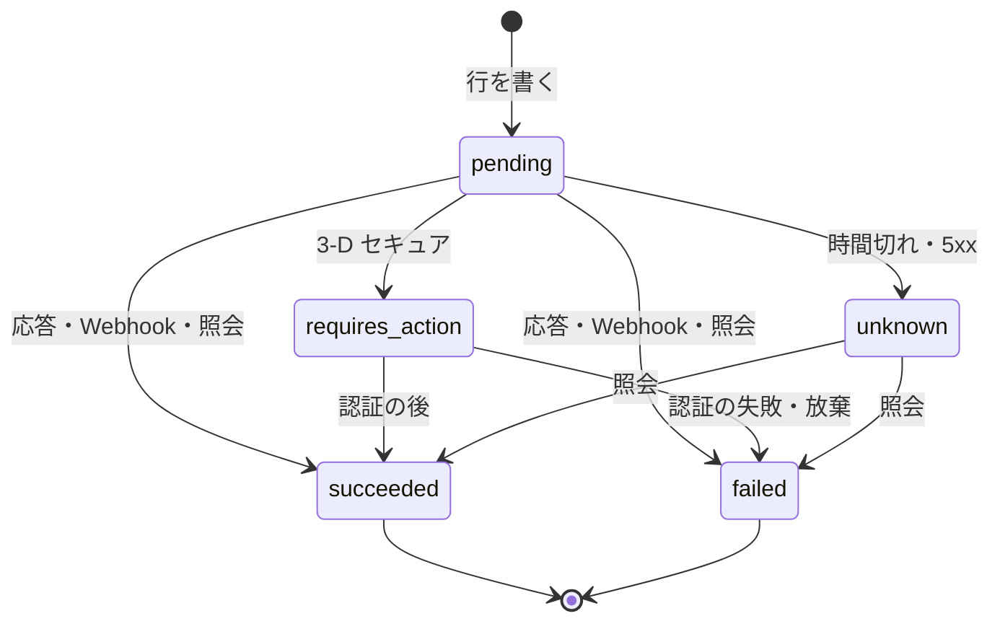
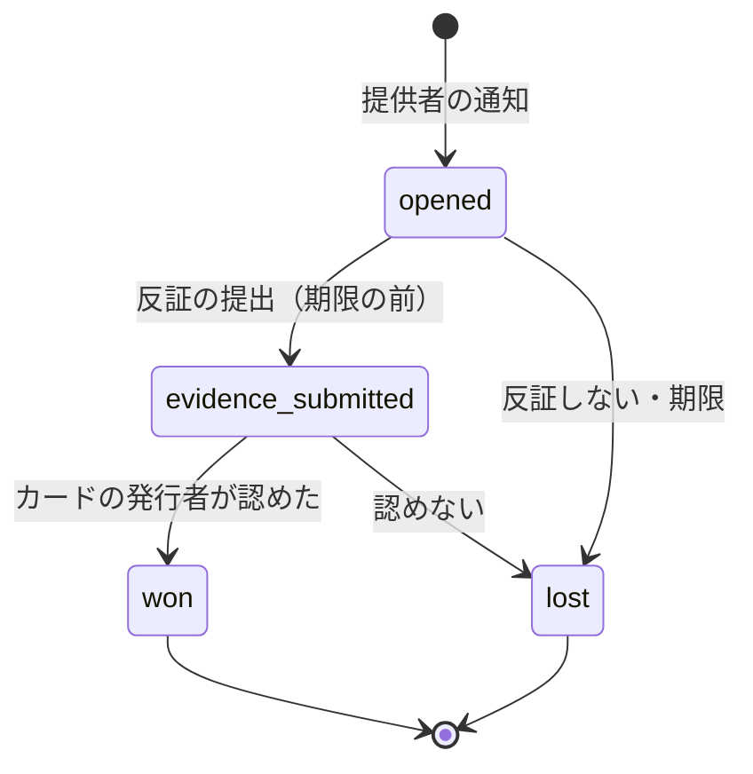

# Payments and FX: Airbnb

決済と為替を決める。決済の提供者のアダプターの契約（操作、試行の行、冪等キー、Webhook の inbox、照会）、オーソリと売上の確定の時期、3-D セキュアと財布型の決済、オーソリの期限の見張り、返金、遅れて成功した支払いの戻し、チャージバックと負担の決め方、為替の相場の写しの取り込みと上乗せと古さの上限、請求の通貨の選び方と通貨の小数の桁、預かりの法的な型の枠（法務の確認待ち：L5・L6）を扱う。

前提となる決定は次のとおり。

- 決済は外部の提供者に任せ、本システムはカード番号に触れない。アダプターの契約は Shopify の題材の [ADR-0006](../../../shopify/docs/decisions/0006-payments-via-providers.md) と同じ形。Stripe の題材は提供者の 1 つとして使い、設計し直さない（[ADR-0005](../decisions/0005-payments-hold-capture-and-ledger.md)）
- 即時予約は確定の時に売上を確定する。リクエストはオーソリを取り、承認で確定する（[ADR-0005](../decisions/0005-payments-hold-capture-and-ledger.md)）
- 請求の通貨はゲストの通貨（提供者が対応すれば）。換算は見積もりの時の相場の写しで 1 回だけ。台帳の仕訳は 1 つの通貨に閉じ、通貨の間は `fx_clearing` で結ぶ（[ADR-0008](../decisions/0008-multi-currency-and-fx.md)）
- 予約の状態は `payments` の結果の事象（`payment_succeeded`・`payment_failed`・`payment_action_required`）で動く（[booking-and-holds.md](booking-and-holds.md) の DT-BKG-001）

この文書で決めたことは次の ADR にある。

| ADR | 決定 |
| --- | --- |
| [0042](../decisions/0042-payment-adapter-contract-and-capture-timing.md) | アダプターは `authorize`・`capture`・`authorizeAndCapture`・`void`・`refund`・`inquire`・`chargeMerchantInitiated` の 7 つの操作と、Webhook の正規化だけを持つ。試行（`payment_attempts`）ごとに `<reservation_id>:<op>[:<seq>]` の冪等キーを提供者に渡す。結果は応答・Webhook・照会のどれから来ても、試行の状態を前にだけ進める 1 つの関数で決める。オーソリの期限の 24 時間前を見張る |
| [0043](../decisions/0043-fx-rate-snapshots-markup-and-staleness.md) | 相場は提供者から 1 時間ごとに取り込み、通貨の組ごとの写し（ID つき）にする。上乗せは既定 200 bp で、財務の設定。写しが 2 時間より古い通貨、前の写しから 5% を超えて動いた通貨は、人が確かめるまで請求の通貨に出さない（リスティングの通貨で請求する）。小数の桁は提供者ごとの表で持つ |
| [0044](../decisions/0044-refunds-to-original-method.md) | 返金は元の支払いの方法と請求の通貨に、台帳の `guest_refund_payable` の額で依頼する。冪等キーは `<reservation_id>:refund:<seq>`。提供者が返せない（カードの失効など）返金は 30 日の再試行の後に運用の手続きへ回す。予約の取り消しの後に成功した支払いは、自動で全額を返す |
| [0045](../decisions/0045-chargeback-handling-and-liability.md) | チャージバックは予約の状態を変えず、提供者が引き落とした額を `psp_chargeback_held` に移す。負担は理由と時期で決める：不正の理由は本システム、提供されなかった・説明と違うは運用の判断でホストに戻せる。release の前なら預かりで受け、ホストに送らない |

## 1. 範囲

- 扱う：
  - 提供者のアダプターの契約、試行の行と状態、冪等キー、Webhook の inbox、照会
  - オーソリと売上の確定の時期（即時予約、リクエスト、日程の変更、損害の請求）
  - 3-D セキュア、財布型の決済、保存した支払いの方法と加盟店からの請求
  - オーソリの期限の見張り
  - 返金（依頼、失敗、遅れて成功した支払いの戻し）
  - チャージバック（受け取り、反証、負担）
  - 為替の相場の写し、上乗せ、古さ、請求の通貨、小数の桁
  - 預かりの法的な型の枠（法務の確認待ち：L5・L6）
  - 支払いの試行と提供者の照合
- 扱わない：
  - カード情報の保管、アクワイアラへの接続（Stripe の題材の論点）
  - 仕訳と送金（[ledger-and-payouts.md](ledger-and-payouts.md)）。ここは事象と額を渡す
  - 見積もりの行の計算（pricing-and-fees、taxes の各領域）。ここは換算と按分の関数だけを決める
  - 予約の状態の遷移（[booking-and-holds.md](booking-and-holds.md)）
  - 決済の不正の規則（trust-and-safety の領域）

## 2. 要件

| 要件 | 目標 | NFR |
| --- | --- | --- |
| 見せた額で請求 | 請求の額と通貨 = 見積もりの総額と通貨。違い 0 | NFR-015、K5 |
| 1 回の請求 | 1 つの予約の売上の確定は、変更の差額を除いて 1 回。提供者への重複の請求 0 | NFR-007 |
| カード番号 | 本システムのサーバー・ログ・DB に入る経路 0 | [ADR-0005](../decisions/0005-payments-hold-capture-and-ledger.md) |
| 速さ | 提供者を除く `payments` の処理 p99 200ms。Webhook の受け付け p99 100ms | NFR-004 |
| 結果の収束 | 提供者の結果が不明な試行を、15 分以内に照会で決める | NFR-007 |
| 為替 | 換算は見積もりにつき 1 回。返金は払った通貨と額をもとに計算 | NFR-015 |
| 可用性 | 予約と決済 月間 99.95% | NFR-010 |

## 3. 本家と提供者の形（確かめたこと）

- 本家は通貨の異なる予約でゲストのサービス料を高くしている（分担の型で 14.1〜16.5% の上の値。[ヘルプの記事 1857](https://www.airbnb.com/help/article/1857)、2026-10-10 に確認。[intent.md](../intent.md) の出典）。本システムはホストだけの型なので、為替の手数料は相場の上乗せで持つ。
- 本家の相場の出どころ、換算の時期、チャージバックの負担の規則は、公式の資料で確かめられなかった（**未検証**）。
- 提供者の能力（オーソリの有効の期間、対応する請求の通貨と小数の桁、財布型の決済、加盟店からの請求、精算の通貨）は、提供者ごとに違い、選定の前で確かめていない（**未検証**）。E11 の `payment-provider-selection` で確かめ、アダプターの能力の表（4.4 節）に入れる。

## 4. 提供者のアダプター

[ADR-0042](../decisions/0042-payment-adapter-contract-and-capture-timing.md) で決めた。

### 4.1 操作

| 操作 | 使う所 | 冪等キー（提供者に渡す） | 結果 |
| --- | --- | --- | --- |
| `authorizeAndCapture(amount, currency, method, three_ds)` | 即時予約 | `<reservation_id>:capture` | `succeeded`・`requires_action`・`failed`・`unknown` |
| `authorize(amount, currency, method, three_ds)` | リクエスト | `<reservation_id>:authorize` | 同上 |
| `capture(authorization_ref, amount)` | リクエストの承認 | `<reservation_id>:capture` | 同上 |
| `void(authorization_ref)` | リクエストの断り・期限・取り下げ | `<reservation_id>:void` | `succeeded`・`failed`・`unknown` |
| `refund(capture_ref, amount, currency)` | 返金 | `<reservation_id>:refund:<seq>`・`<claim_id>:refund` | `succeeded`・`pending`・`failed`・`unknown` |
| `chargeMerchantInitiated(method_ref, amount, currency)` | 日程の変更の差額（ゲストがその場にいないとき）、損害の請求 | `<reservation_id>:alter:<seq>:capture`・`<claim_id>:charge` | `succeeded`・`requires_action`・`failed`・`unknown` |
| `inquire(attempt)` | 結果が不明なとき、期限の処理 | — | 提供者の今の状態 |

- 日程の変更の差額は、ゲストが画面にいれば `authorizeAndCapture`（3-D セキュアを含む）、ホストの提案をゲストが受けたときも画面にいるので同じ。`chargeMerchantInitiated` は損害の請求（[deposits-and-claims.md](deposits-and-claims.md)）と、運用が決めた追加の請求だけで使う。
- アダプターは提供者ごとに 1 つ（`packages/payments/adapters/<provider>`）。本システムの他の部分は提供者の名前と形を知らない。

### 4.2 試行の行

- 提供者を呼ぶ前に、`payment_attempts` に行（`pending`）を書いてコミットする。呼んだ結果で行を進める。呼ぶ前に落ちても、行が残るので照会で拾える。
- 試行の状態：`pending` → `requires_action` → `succeeded`・`failed`・`unknown`。`unknown` は照会で `succeeded`・`failed` に進む。

- 状態は前にだけ進む。`succeeded`・`failed` の後に別の結果が来ても書き換えない。矛盾（`failed` の後に `succeeded` の Webhook）は、照会で確かめてから 6.4 節で扱い、`payment_anomalies` に記録する。
- 結果を決める関数は 1 つ（`settleAttempt(attempt_id, provider_state, source)`）。応答・Webhook・照会のどれから来ても、この関数を通る。`succeeded`・`failed` に進めたら、同じトランザクションで outbox に `payment.succeeded`・`payment.failed` を書き、`booking` が予約の遷移を行う。

### 4.3 Webhook の inbox

- Webhook は署名を確かめ（提供者ごとの方式）、`payment_inbox`（提供者、事象の ID の一意、受け取りの時刻、本文の暗号化した写し）に入れて 200 を返す。処理は inbox のワーカーが行う。
- 本文にカード番号は来ない（提供者のトークンと下 4 桁まで）。下 4 桁とブランドだけを保存し、ログに出さない。
- 同じ事象の ID の 2 回目は inbox の一意で捨てる。順序は保証しないので、事象の中の状態ではなく照会の結果で試行を進める（Webhook は照会を促す合図として扱う）。

### 4.4 能力の表

アダプターごとに、能力（`capabilities`）を設定で持つ。選定の後に値を入れる（**未検証**の値を推測で入れない）。

| 能力 | 意味 | 使う所 |
| --- | --- | --- |
| `charge_currencies` | 請求の通貨と小数の桁（ISO 4217 と違う扱いがあれば提供者の値） | 8.3 節 |
| `authorization_validity` | オーソリの有効の期間（ブランド・地域ごと） | 5.2 節 |
| `wallets` | 財布型の決済 | 5.1 節 |
| `merchant_initiated` | 保存した支払いの方法での加盟店からの請求 | 損害の請求 |
| `settlement_currency` | 精算の通貨（円か請求の通貨か） | [ledger-and-payouts.md](ledger-and-payouts.md) の 9 節 |
| `partial_refund`・`multiple_refunds` | 一部の返金、複数回の返金 | 6 節 |
| `fx_rates` | 相場の写しの提供 | 8 節 |

## 5. オーソリと売上の確定

### 5.1 時期

| 流れ | 予約の時 | 確定 | 期限 |
| --- | --- | --- | --- |
| 即時予約 | `authorizeAndCapture` | 同時 | 仮押さえ 10 分（3-D セキュアを含む） |
| リクエスト | `authorize` | ホストの承認で `capture` | リクエストの期限（最長 24 時間）、承認の後 10 分 |
| 日程の変更（増額） | `authorizeAndCapture`（差額） | 同時 | 支払いの待ち 10 分（[cancellations-and-changes.md](cancellations-and-changes.md) の 7.3 節） |
| 損害の請求 | `chargeMerchantInitiated` | 同時 | [deposits-and-claims.md](deposits-and-claims.md) |
| 保証金（MVP の後） | — | — | [deposits-and-claims.md](deposits-and-claims.md) の 8 節 |

- 支払いの方法は、提供者のホストした入力部品（カード、財布型）で受ける。本システムは提供者の支払いの方法のトークン（`method_ref`）と、下 4 桁・ブランド・有効期限の年月だけを持つ。
- 予約の確定の時に、ゲストの同意（利用規約の「損害の請求と、変更の差額のための保存した支払いの方法の利用」）があれば、提供者に将来の加盟店からの請求のための保存を依頼する。同意の文言と扱いは損害の請求と同じく **法務の確認待ち（L12）**。

### 5.2 オーソリの期限の見張り

- リクエストのオーソリは、作成から最長 24 時間で承認か取り消しになる。提供者のオーソリの有効の期間（数日から 1 か月。**未検証**）より短い前提で設計している（[ADR-0005](../decisions/0005-payments-hold-capture-and-ledger.md)）。
- 能力の表の `authorization_validity` が 48 時間より短いブランド・地域の支払いの方法では、リクエストを受けない（`authorization_too_short`。即時予約だけを出す）。
- オーソリの期限の 24 時間前を過ぎた `requested` の予約があれば（設定の誤り）、page。

### 5.3 3-D セキュア

- 即時予約は、提供者が求めれば 3-D セキュアを行う。結果は `requires_action` で画面に戻し、認証の後に提供者の Webhook・照会で結果を得る。
- 3-D セキュアの間も仮押さえの期限（10 分）は延ばさない。認証を 10 分で終えないゲストは、新しい見積もりからやり直す。
- 3-D セキュアの要否は提供者と規則（trust-and-safety の領域）で決める。本システムは結果の責任の移転（liability shift）の有無を試行に記録し、チャージバックの負担の判断に使う（7.3 節）。

## 6. 返金

[ADR-0044](../decisions/0044-refunds-to-original-method.md) で決めた。

### 6.1 依頼

- 返金の額は台帳が決める。`ledger` が settle・refund・post_release_refund の仕訳で `guest_refund_payable:<reservation_id>` に入れた額を、`payments` が outbox の `ledger.refund_due`（予約、`settlement_seq`、額、通貨）で受け、提供者に依頼する。
- 返す先は元の支払い（`capture_ref`）と請求の通貨。別の通貨・別の支払いの方法には返さない。
- 冪等キーは `<reservation_id>:refund:<settlement_seq>`。同じ `settlement_seq` の返金は 1 回。
- 返金が成功したら、台帳に「借方 `guest_refund_payable`／貸方 `psp_receivable`」を書く（[ledger-and-payouts.md](ledger-and-payouts.md) の 4.2 節）。

### 6.2 1 つの予約に複数の確定があるとき

- 日程の変更の増額で、1 つの予約に複数の確定（最初の確定と差額の確定）がある。返金は新しい確定から順に、各確定の返していない額を上限に割り振る。提供者が一部の返金・複数回の返金に対応しないときは、能力の表で分かり、運用の手続きへ回す。

### 6.3 失敗

| 結果 | 振る舞い |
| --- | --- |
| `pending` | 提供者の Webhook・照会で決まるまで待つ（照会は 1 時間ごと） |
| `failed`（一時的） | 15 分・1 時間・4 時間・24 時間と再試行し、30 日まで続ける |
| `failed`（カードの失効・口座の閉鎖など、恒久的） | 運用の待ち行列に入れ、ゲストに別の受け取りの方法（銀行口座への振込）を案内する。運用の返金は `ops_refund` の型の仕訳（[ledger-and-payouts.md](ledger-and-payouts.md) の 4.2 節）。本システムが銀行で返す扱いの法的な整理は **法務の確認待ち（L5）** |
| `unknown` | 照会で決める |

### 6.4 遅れて成功した支払いの戻し

- 予約が `cancelled`（`payment_expired`・`payment_unresolved`・`dates_lost`）になった後に、試行が `succeeded` になることがある（提供者の遅れ、照会の不明）。
- `settleAttempt` は、試行が `succeeded` で予約が終わった状態なら、予約を戻さず、全額の返金（`<reservation_id>:refund:orphan`）を依頼する。台帳には「借方 `psp_receivable`／貸方 `unapplied_payments`」と「借方 `unapplied_payments`／貸方 `psp_receivable`」の 2 つを、受け取りと返金の時に書く（[ledger-and-payouts.md](ledger-and-payouts.md) の 4.2 節の型 13・14）。
- ゲストには「お支払いは取り消されました。返金します」を知らせる。

## 7. チャージバック

[ADR-0045](../decisions/0045-chargeback-handling-and-liability.md) で決めた。

### 7.1 流れ

- 通知を受けたら、`chargebacks` に行を作り、台帳に「借方 `psp_chargeback_held`／貸方 `psp_receivable`」を書く。予約の状態は変えない（DT-BKG-001 の行 30）。運用の案件を開く。
- 反証の材料：予約の記録、確認の画面に出した事項と同意、3-D セキュアの結果、メッセージの記録の要約（本文は運用者が案件の権限で読む。法務の確認待ち：L9）、チェックインの記録。提出の期限は提供者の値（**未検証**）。

### 7.2 時期

| 通知の時 | 預かり | 振る舞い |
| --- | --- | --- |
| release の前（チェックインの前） | 残っている | 予約を運用のキャンセル（`ops_rules_violation_guest` か不正の案件）にするかを運用が決める。キャンセルなら、精算の返金の先を提供者の引き落としに当てる（ゲストに二重に返さない。返金の額を 0 にし、預かりを `psp_chargeback_held` の相手に振り替える） |
| release の後 | ホストへの支払いに移っている | ホストへの支払いはそのまま。負担は 7.3 節 |

### 7.3 負担

| 理由（提供者の分類） | 3-D セキュアの責任の移転 | 負けたときの負担 |
| --- | --- | --- |
| 不正（盗んだカード） | あり | 提供者・発行者（負けにくい） |
| 不正（盗んだカード） | なし | 本システム（`chargeback_loss_expense`）。ホストは悪くない |
| 提供されなかった・説明と違う | — | 運用の判断。ホストの責任なら `host_receivable` に移し、後の送金と相殺する |
| 重複の請求・処理の誤り | — | 本システム |

- ホストに負担を移す判断は人が行い、根拠を案件に残す（[roadmap.md](../roadmap.md) の「エージェントに任せないこと」）。

## 8. 為替

[ADR-0043](../decisions/0043-fx-rate-snapshots-markup-and-staleness.md) で決めた。

### 8.1 相場の写し

| 列 | 意味 |
| --- | --- |
| `id` | 写しの ID（見積もりに固定する） |
| `base`・`quote` | 通貨の組（リスティングの通貨 → 請求の通貨。MVP は `JPY → X`） |
| `mid_rate` | 仲値（`numeric(20,10)`。1 リスティングの通貨あたりの請求の通貨） |
| `markup_bps` | 上乗せ |
| `applied_rate` | `mid_rate × (1 + markup_bps / 10000)` |
| `source`・`fetched_at`・`provider_timestamp` | 出どころと時刻 |
| `status` | `active`・`held`（人の確かめ待ち）・`superseded` |

- 為替の相場の提供者から 1 時間ごとに取り込む。取り込みの関数は `packages/fx` の `ingestSnapshot` だけ。
- 前の `active` の写しから `mid_rate` が 5% を超えて動いた組は `held` にし、財務が確かめて `active` にする。
- 最新の `active` の写しの `fetched_at` が 2 時間より古い組は、新しい見積もりで請求の通貨に使わない。リスティングの通貨（円）で見積もり、画面で「この通貨は今使えません」を示す。表示だけの換算（検索の価格）は 24 時間まで古い写しを使い、注を付ける。
- 上乗せは既定 200 bp（2%）で、`fx_markup_bps` の設定（財務が変える）。通貨の組ごとに変えられる。上乗せの表示の仕方は **法務の確認待ち（L7・L13）**（[ADR-0008](../decisions/0008-multi-currency-and-fx.md)）。

### 8.2 換算と按分

- `convert(amount_minor, from, to, snapshot)` = `round_half_up(amount_minor × applied_rate × 10^(to の桁 − from の桁))`。見積もりの総額にだけ当てる。
- 行の按分：各行 `floor(行 × 換算の総額 / 元の総額)`、残りの単位を大きい行から 1 つずつ足す（同じ額の行は見積もりの行の順）（[ADR-0008](../decisions/0008-multi-currency-and-fx.md)）。
- 例（[cancellations-and-changes.md](cancellations-and-changes.md) の 5.6 節）：69,200 円、仲値 0.006700、上乗せ 200 bp → 適用 0.006834 → 472.9128 → 47,291 セント。行（泊 20,000 × 3、清掃料 8,000、税 400 × 3）の按分は切り捨てで 47,287、残り 4 セントを泊 3 行と清掃料に 1 つずつ足して、13,668 × 3、5,468、273 × 3。

### 8.3 請求の通貨

| 通貨 | ISO 4217 の小数の桁 | 表示 | 請求（MVP の既定） |
| --- | --- | --- | --- |
| JPY | 0 | ○ | ○（リスティングの通貨） |
| USD | 2 | ○ | 提供者が対応すれば ○ |
| EUR | 2 | ○ | 同上 |
| GBP | 2 | ○ | 同上 |
| AUD | 2 | ○ | 同上 |
| SGD | 2 | ○ | 同上 |
| HKD | 2 | ○ | 同上 |
| KRW | 0 | ○ | 同上 |
| TWD | 2 | ○ | 同上（提供者が小数を受けない扱いがありうる。**未検証**。能力の表の値に従う） |
| CNY | 2 | ○ | 同上 |

- 表示の 10 通貨は [README.md](README.md) の 6 節の「主な 10 通貨」の本システムの選び方。小数の桁は ISO 4217 の値（**未検証**：表の値は ISO の公開の表で確かめていない。`fx-rate-snapshots` の Story で確かめる）。
- 請求の通貨 = ゲストの選んだ表示の通貨が、能力の表の `charge_currencies` にあり、8.1 節で使える写しがあればその通貨、なければ円。
- 見積もりは請求の通貨を固定する。予約の後に通貨を変えられない。

### 8.4 為替の損益

- 決着の時に、請求の通貨の預かりを見積もりの相場でリスティングの通貨に換える仕訳を書く。提供者の精算の相場との差は `fx_clearing` に残り、日次に `fx_gain_loss` へ振り替える（[ledger-and-payouts.md](ledger-and-payouts.md) の 5.2 節）。
- 見積もりから決着までの為替の動き（最長 1 年以上）は本システムが負う（[ADR-0008](../decisions/0008-multi-currency-and-fx.md)）。財務は通貨ごとの `fx_clearing` の開いた残高を毎日見る。

## 9. 預かりの法的な型（法務の確認待ち：L5・L6）

- 既定は「ホストの代わりにゲストから受け取る収納代行」の型（[ADR-0005](../decisions/0005-payments-hold-capture-and-ledger.md)）。資金移動業の型になれば、口座の種類と保全の処理を足す。どちらでも、この領域の決済の流れは変わらない。本番での預かりの開始は L5 の後（`funds-holding-legal-gate`）。
- 海外のゲストの支払いに関わる報告（外為法の支払等報告書）と、制裁の対象の確かめは **法務の確認待ち（L6）**。提供者が行う範囲と本システムが行う範囲を、選定の Story で分ける。
- 本システムが持つ値：`legal.funds_holding_model`（`collection_agent`・`fund_transfer`）、`legal.max_holding_days`（既定なし）、`legal.sanctions_screening_owner`（`provider`・`platform`）。

## 10. 照合

`payments-reconciler`。

| # | 比べるもの | 頻度 | 外れたとき |
| --- | --- | --- | --- |
| P1 | `unknown`・`pending` のまま 15 分を超えた試行 | 5 分ごと | 照会。1 時間を超えたら ticket |
| P2 | `succeeded` の確定の試行に、台帳の hold（予約）か `unapplied_payments`（取り消しの後）がある | 5 分ごと | page |
| P3 | 返金の依頼の後 24 時間を超えて `pending` | 1 時間ごと | ticket |
| P4 | 提供者の日次の取引の一覧の各行が、`payment_attempts` か返金の行と一致 | 日次 | 3 者の照合へ（[ledger-and-payouts.md](ledger-and-payouts.md) の 9 節） |
| P5 | 見積もりの相場の写しの ID が、予約の請求の額を再現する | 予約ごと（確定の時）と日次の抜き取り | page（NFR-015） |

## 11. 障害のときの振る舞い

| 障害 | 影響 | 振る舞い |
| --- | --- | --- |
| 提供者の時間切れ | 結果が不明 | 試行を `unknown` にし、照会。予約は仮押さえの延長（DT-BKG-001 の行 12・13） |
| 提供者の停止 | 予約が確定しない | `ops.payments_enabled` で新しい予約を止め、画面で知らせる（予約と決済の可用性の SLO に数える）。複数の提供者を持つなら、能力の表で切り替える（MVP は 1 つ） |
| Webhook の遅れ・欠け | 結果の反映が遅れる | 照会のジョブ（5 分ごと）で収束 |
| Webhook の重複・順序の入れ替え | — | inbox の一意と、照会の結果での前進 |
| 相場の提供者の停止 | 写しが古くなる | 2 時間で外国の通貨の請求を止め、円で請求する |
| 相場の急な変化 | 誤った換算 | 5% の確かめで `held` |

## 12. 上限

| 対象 | 値 |
| --- | --- |
| 提供者の呼び出しの時間切れ | 接続 2 秒、全体 10 秒 |
| 照会 | 不明の試行を 1 分・2 分・5 分…と最大 15 分ごと。1 時間で ticket |
| 返金の再試行 | 30 日 |
| 相場の写し | 1 時間ごと。2 時間で古い。5% で `held` |
| 上乗せ | 既定 200 bp（財務の設定） |
| 請求の通貨 | 10（8.3 節） |
| リクエストを受けるオーソリの有効の期間 | 48 時間以上 |

## 13. data-model への項目

| 表・置き場 | 中身 | 主キー・索引 | 節 |
| --- | --- | --- | --- |
| `payment_attempts`（core、2 者の RLS は読み出しだけ） | 予約・損害の請求、操作、冪等キー、提供者、額、通貨、状態、提供者の参照、3-D セキュアの結果、責任の移転、試行の時刻 | `id`。一意 `(provider, idempotency_key)`、`(status, updated_at) WHERE status IN ('pending','unknown','requires_action')` | 4.2 |
| `payment_methods`（core、本人の RLS） | 提供者のトークン、ブランド、下 4 桁、有効期限の年月、加盟店からの請求の同意 | `id`、`(guest_id)` | 5.1 |
| `payment_inbox`（core） | 提供者、事象の ID、受け取りの時刻、暗号化した本文、処理の状態 | 一意 `(provider, event_id)` | 4.3 |
| `refunds`（core、2 者の RLS） | 予約、`settlement_seq`、額、通貨、確定の参照、状態、試行の回数 | `id`、一意 `(reservation_id, settlement_seq)` | 6 |
| `chargebacks`（core） | 予約、提供者の ID、理由、額、状態、期限、負担の判断、案件 | `id`、一意 `(provider, provider_chargeback_id)` | 7 |
| `payment_anomalies`（core） | 矛盾した結果の記録 | `id` | 4.2 |
| `fx_rate_snapshots`（core） | 8.1 節の列 | `id`、`(base, quote, fetched_at DESC) WHERE status = 'active'` | 8.1 |
| `fx_markup_versions`（core） | 通貨の組ごとの上乗せ `fx_markup_bps`（既定 200）、`effective_from`、承認（財務）。変えられないバージョンの行（[delivery.md](delivery.md) の 3.4 節） | `(version)`、`(base, quote, effective_from)` | 8.1 |
| `provider_capabilities`（設定） | 4.4 節の表 | — | 4.4 |
| outbox の事象 | `payment.succeeded`・`payment.failed`・`payment.action_required`・`refund.succeeded`・`refund.failed`・`chargeback.opened`・`chargeback.closed` | — | 4、6、7 |

## 14. テスト

- **PROP-PAY-001（前にだけ進む）**：任意の応答・Webhook・照会の結果の列（重複、順序の入れ替え、矛盾）で、試行の状態は前にだけ進み、`succeeded`・`failed` は変わらない。
- **PROP-PAY-002（1 回の請求）**：任意の再送・時間切れ・再起動で、同じ冪等キーの提供者への確定は 1 回（`psp-sim` で数える）。
- **PROP-PAY-003（遅れた成功）**：取り消しの後に成功した試行は、必ず全額が返金され、`unapplied_payments` の残高は 0 に戻る。
- **PROP-FX-001（按分）**：任意の行と相場と通貨で、按分した行の和 = 換算した総額。各行は `floor` の値か `floor + 1`。
- **PROP-FX-002（1 回の換算）**：見積もりから請求・返金・決着まで、相場の写しは見積もりに固定したものだけを使う。
- **PROP-FX-003（古い写し）**：2 時間より古い・`held` の写しの通貨では、請求の通貨が円になる。
- **契約の試験**：アダプターごとに、7 つの操作と Webhook の正規化を `psp-sim` と提供者の試験の環境で確かめる（[quality.md](../quality.md) の 2.4 節）。
- **試験のベクトル**：通貨ごとの小数の桁、丸めの境（`x.5`）、Webhook の署名。
- **障害の注入**：提供者の時間切れ・重複・順序の入れ替え、相場の提供者の停止。

## 15. Story の候補

| Epic | Story | 中身 |
| --- | --- | --- |
| E11 | `payment-provider-selection` | 4.4 節の能力の表を埋める |
| E11 | `payment-adapter-contract` | 4 節（ADR-0042。PROP-PAY-001・002、`psp-sim`） |
| E11 | `capture-and-authorization` | 5 節（ADR-0042） |
| E11 | `refunds-and-chargebacks` | 6・7 節（ADR-0044・0045。PROP-PAY-003） |
| E11 | `fx-rate-snapshots` | 8 節（ADR-0043。PROP-FX-001〜003） |
| E11 | `funds-holding-legal-gate` | 9 節。法務：L5・L6 |
| E11 | `payments-reconciler` | 10 節 |

## 16. 未解決の問い

### 決定

2026-10-10 の既定案。

- **アダプター**：7 つの操作、試行の行を先に書く、照会で前に進める（ADR-0042）。
- **相場**：1 時間ごと、2 時間で古い、5% で人の確かめ、上乗せ 200 bp（ADR-0043）。
- **返金**：元の方法と通貨、30 日の再試行の後は運用（ADR-0044）。
- **チャージバック**：予約の状態を変えない。不正は本システム、提供の問題は運用の判断（ADR-0045）。

### 持ち越し

| 問い | いつ・どう決めるか |
| --- | --- |
| 提供者の能力（オーソリの期間、通貨と桁、財布型、加盟店からの請求、精算の通貨） | E11 の `payment-provider-selection`（**未検証**） |
| 上乗せの値と表示 | 財務と、法務の確認待ち（L7・L13） |
| 預かりの法的な型、銀行での返金 | 法務の確認待ち（L5） |
| 外為法の報告と制裁の対象の確かめ | 法務の確認待ち（L6） |
| 保存した支払いの方法での加盟店からの請求の同意 | 法務の確認待ち（L12） |
| 提供者を 2 つにするか | GA の前の可用性の評価（infrastructure の領域） |

## 出典

- Airbnb, [ヘルプの記事 1857（サービス料）](https://www.airbnb.com/help/article/1857)：[intent.md](../intent.md) の出典のとおり（2026-10-10 に確認）
