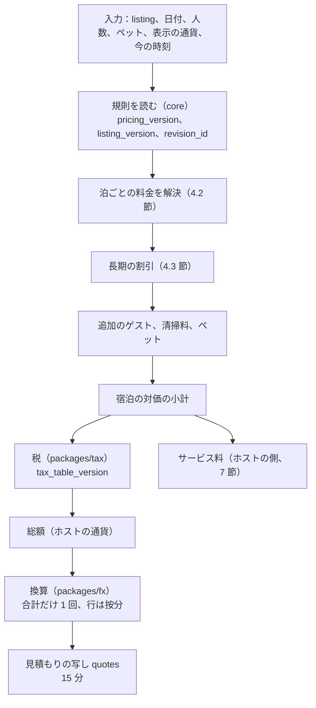

# Pricing and fees: Airbnb

料金と手数料。泊の料金の規則（基本、週末、季節、日付の上書き）と優先の順、長期の割引、清掃料・追加のゲスト・ペットの料金、ホストだけのサービス料、`quoteStay` と見積もりの写し、検索の `quoteSummary`、総額の表示、割引の表示（法務の L13）、料金の提案の境界を決める。

前提となる決定は次のとおり。

- リスティングの価格はホストの通貨（MVP は円）の最小単位の整数。換算は見積もりの時の相場の写しで合計だけを 1 回、`packages/fx` で行う（[ADR-0008](../decisions/0008-multi-currency-and-fx.md)）
- 予約の要求は `quote_id` を持ち、見積もりの写しと金額が一致しなければ 409。見積もりの有効期限は 15 分（[ADR-0004](../decisions/0004-booking-state-machine-and-holds.md)）
- サービス料はホストだけの型、既定 15%。ゲストに見せる額は総額（[architecture/README.md](README.md) の 6 節）
- 料金の提案はホストが有効にし、最低と最高を決めたときだけ、その範囲でカレンダーの料金を書く（[ADR-0009](../decisions/0009-trust-and-safety-and-ml-boundary.md)）
- 料金の規則の表はバージョンの付いた設定にする。フラグにしない（[AGENTS.md](../../AGENTS.md)）

この文書で決めたことは次の ADR にある。

| ADR | 決定 |
| --- | --- |
| [0029](../decisions/0029-nightly-price-rules-and-discounts.md) | 泊の料金は、日付の上書き → 季節の規則（優先度、同じなら範囲の短いほう）→ 週末の料金（既定は金曜と土曜の夜、祝日の前の夜を足せる）→ 基本の料金の順で、泊ごとに 1 つに解決する。長期の割引は週（7 泊以上）と月（28 泊以上）のうち大きいほうだけを、泊の料金の和に当てる。清掃料・ペットの料金は滞在に 1 回、追加のゲストの料金は泊ごと・人ごと |
| [0030](../decisions/0030-quote-stay-pipeline-and-rounding.md) | `quoteStay` は、泊の料金の解決 → 長期の割引 → 追加のゲスト → 清掃料・ペット → 宿泊の対価の小計 → 税（`packages/tax`）→ 総額 → 換算の順の 1 つの純粋な関数で、割合の計算は有理数で持って行ごとに 1 回だけ四捨五入する。見積もりの写しは各行の額と全部の表の ID とバージョンを持つ。検索の `quoteSummary` は同じ関数を換算の固定なしで呼ぶ |
| [0031](../decisions/0031-host-only-service-fee.md) | サービス料はホストだけの型で、既定 15%（消費税を含む）を、宿泊の対価の小計（泊、割引、追加のゲスト、清掃料、ペット）に掛ける。税には掛けない。率はバージョンの付いた `service_fee_schedules` で持ち、見積もりの作成の時のバージョンを写しに固定する。ゲストの明細にサービス料の行は出さない |

## 1. 範囲

- 扱う：泊の料金の規則の型と優先の順、週末と祝日の前の夜、季節の規則、日付の上書き、長期の割引、清掃料・追加のゲスト・ペットの料金、値の上限、`quoteStay`、`quoteSummary`、見積もりの写し、端数、サービス料の表、総額の表示と明細、表示の通貨、料金の写し `prc:` に入れる値、料金の提案の書き込みの境界。
- 扱わない：
  - 税の表と計算（[taxes.md](taxes.md)）。この文書は `quoteStay` から呼ぶ形を書く。
  - 換算と相場の写し（payments-and-fx の領域、[ADR-0008](../decisions/0008-multi-currency-and-fx.md)）。
  - キャンセルの返金と日程の変更の差額（cancellations-and-changes の領域）。見積もりの各行の額を渡す。
  - 台帳の仕訳とホストへの支払い（ledger-and-payouts の領域）。
  - 割引の企画（早割、直前割、クーポン）（MVP の後。[roadmap.md](../roadmap.md) の延期の一覧）。
  - 料金の提案の統計とモデル（MVP の後の ML。この文書は書き込みの境界だけを書く）。

## 2. 事実（確かめたこと）

| 項目 | 事実 | この設計 |
| --- | --- | --- |
| 本家のサービス料 | 分担の型（ホスト 3%、ゲスト 14.1〜16.5%）と、ホストだけの型（多くのホストで 15.5%、14〜16%）。分担の型はなくしていく途中で、PMS を使うホストはホストだけの型が必須（[ヘルプの記事 1857](https://www.airbnb.com/help/article/1857)） | ホストだけの型、既定 15%（ADR-0031） |
| 本家の週末の料金・長期の割引・清掃料 | ホストが設定できることは画面で知られるが、優先の順と端数の扱いは公式の資料で確かめられなかった（**未検証**） | 本システムの順と端数（ADR-0029、ADR-0030） |
| 日本の祝日 | 内閣府が国民の祝日の一覧を公表している（[国民の祝日について](https://www8.cao.go.jp/chosei/shukujitsu/gaiyou.html)） | 祝日の前の夜の判定の表（4.2 節）。取り込みの形は E8 で確かめる |

いずれも 2026-10-10 に確認。

## 3. 要件

| 要件 | 値 | 出どころ |
| --- | --- | --- |
| 総額の一致 | 見積もりの総額と請求の額（通貨を含む）の違い 0 | NFR-015、K5 |
| 見積もりの速さ | p99 500ms | NFR-004 |
| 見積もりの期限 | 15 分 | NFR-015 |
| 明細の和 | 表示の行の和 = 表示の総額（どの通貨でも） | [quality.md](../quality.md) の 2.2.1 節 C |
| 検索の料金の要約 | 300 件で 40ms 以内（写しを使って） | [search-and-ranking.md](search-and-ranking.md) の 5.6 節 |
| 料金の変更の反映 | ホストの変更から検索の料金の写しに効くまで p95 10 秒 | NFR-002 と同じ経路 |

## 4. 泊の料金の規則（ADR-0029）

### 4.1 規則の型

| 型 | 置き場所 | 中身 |
| --- | --- | --- |
| 基本の料金 | `pricing_rules.base_nightly` | 1 泊の料金 |
| 週末の料金 | `pricing_rules.weekend_nightly`、`weekend_nights`（曜日の集合。既定は金曜と土曜）、`holiday_eve_as_weekend`（bool） | 週末の夜の 1 泊の料金 |
| 季節の規則 | `seasonal_rules`（`date_from`、`date_to`（含む）、`nightly`、`weekend_nightly`（任意）、`priority`、`min_nights`（任意。滞在の規則に渡す）） | 期間の 1 泊の料金 |
| 日付の上書き | `calendar_days.nightly_price_override`（availability-and-calendars の領域の泊ごとの設定） | その夜の料金 |
| 追加のゲスト | `pricing_rules.guests_included`、`extra_guest_fee`（泊ごと・人ごと） | 定員の中で、含む人数を超えた人の料金 |
| 清掃料 | `pricing_rules.cleaning_fee` | 滞在に 1 回 |
| ペット | `pricing_rules.pet_fee` | 滞在に 1 回（ペットの数に依らない） |
| 長期の割引 | `pricing_rules.weekly_discount_pct`（7 泊以上）、`monthly_discount_pct`（28 泊以上） | 泊の料金の和への割合 |

- 「夜」はチェックインの日を含む泊の日（物件の現地の日付）。2026-11-27（金）の夜は、11-27 に泊まって 11-28 に出る夜。
- 料金の変更（`pricing_rules`、`seasonal_rules`、日付の上書き）は `pricing_version`（リスティングごと）と `search_version` を上げ、`listing_version` を上げない（[listings-and-content.md](listings-and-content.md) の 4.4 節）。見積もりは `pricing_version` を写しに記録するが、料金の変化では見積もりを無効にしない。15 分の間は見積もりの額で予約できる（[ADR-0037](../decisions/0037-quote-binding-and-idempotency.md)）。

### 4.2 優先の順（`resolveNightlyPrice`）

泊ごとに、上から最初に当たった値を使う。

1. 日付の上書き（`calendar_days.nightly_price_override`）。料金の提案の書き込みもここに入る（10 節）。
2. 季節の規則：その夜を含む規則のうち、`priority` の大きいもの。同じなら期間の短いもの。なお同じなら新しく作ったもの。その夜が週末の夜で、規則に `weekend_nightly` があればそれ、なければ `nightly`。
3. 週末の料金：その夜の曜日が `weekend_nights` に入る、または `holiday_eve_as_weekend` が真で翌日が祝日なら `weekend_nightly`（設定があれば）。
4. 基本の料金。

**例**（京都市の架空のリスティング、円）：基本 12,000、週末（金・土）15,000、季節の規則「紅葉」11-15〜12-05 で 14,000・週末 17,000、11-28（土）の日付の上書き 20,000（近くの催し）。

| 夜 | 曜日 | 当たる規則 | 料金 |
| --- | --- | --- | --- |
| 2026-11-27 | 金 | 季節（週末） | 17,000 |
| 2026-11-28 | 土 | 日付の上書き | 20,000 |
| 2026-11-29 | 日 | 季節 | 14,000 |
| 2026-12-07 | 月 | 基本 | 12,000 |
| 2026-12-11 | 金 | 週末 | 15,000 |

### 4.3 長期の割引と料金

- 長期の割引は、泊数が 28 以上なら `monthly_discount_pct`、7 以上なら `weekly_discount_pct` の、**当たるもののうち大きいほう 1 つ**だけ。重ねない。
- 割引は泊の料金の和だけに当てる。清掃料・ペット・追加のゲストの料金には当てない。
- 追加のゲストの料金 = `extra_guest_fee × max(0, 大人と子どもの数 − guests_included) × 泊数`。乳児は数えない。
- 割引の額 = `round_half_up(泊の料金の和 × pct / 100)`。

**例**：基本 10,000 の 10 泊（週末を含まない架空の例）、週 10%、月 20%。泊の和 100,000、10 泊なので週の割引だけ → 10,000。28 泊なら月の 20% だけが当たり、週の 10% は当てない。

### 4.4 値の上限

| 値 | 範囲（円） |
| --- | --- |
| 1 泊の料金（どの型も） | 1,000〜1,000,000 |
| 清掃料 | 0〜100,000 |
| 追加のゲストの料金 | 0〜50,000（泊・人ごと） |
| ペットの料金 | 0〜50,000 |
| 長期の割引 | 0〜90% |
| 季節の規則 | 1 リスティング 50 件、期間 1〜366 日 |

- 清掃料が 1 泊の基本の料金の 5 倍を超えると、保存の時に注意を出す（安い 1 泊の料金で検索の上に出し、清掃料で取る形を抑える）。総額の表示（8 節）があるので止めはしない。

## 5. 料金の写し `prc:`

- `availability-cache-writer` が、料金の規則・季節の規則・日付の上書きの変化の outbox から、2 年分の泊ごとの解決した料金（4.2 節の結果）、清掃料、追加のゲストの料金、ペット、長期の割引、`pricing_version`、通貨、`tax_zone_ids` を書く（[search-and-ranking.md](search-and-ranking.md) の 5.3 節、[ADR-0025](../decisions/0025-availability-snapshot-layout.md)）。
- 写しは検索の目安にだけ使う。見積もり（`quoteStay`）は core から規則を読む。

## 6. `quoteStay` と `quoteSummary`（ADR-0030）

### 6.1 段

1. 規則を読む：リスティングの `listing_version`・`revision_id`・`pricing_version`、キャンセルポリシーのバージョン、`tax_zone_ids`。
2. 滞在の規則を確かめる（`checkStayRules`。見積もりの時点の目安。予約の時に `reserveStay` が確かめ直す）。
3. 泊ごとの料金を解決し、和を取る。
4. 長期の割引を引く。
5. 追加のゲスト、清掃料、ペットを足す。ここまでの和が**宿泊の対価の小計**（`accommodation_subtotal`）。
6. 税を計算する（[taxes.md](taxes.md) の 5 節の `computeStayTaxes`）。行は税の種類ごと。
7. 総額 = 小計 + 税の行の和（消費税は小計の中に含まれる。8.2 節）。
8. サービス料を計算する（7 節）。ゲストの総額には影響しない。写しに持つ。
9. 表示の通貨が違えば、`packages/fx` の `convert` で合計を換算し、行に按分する（[ADR-0008](../decisions/0008-multi-currency-and-fx.md)）。
10. 写しを書く。

- `quoteStay` は 1〜9 を純粋な関数 `priceStay(rules, stay, guests, tax_tables, fee_schedule, fx_snapshot)` で行い、10 だけが書き込み。`quoteSummary` は同じ `priceStay` を、規則の代わりに料金の写し `prc:`、`fx_snapshot` に最新の相場の写しを入れて呼び、写しを書かない。
- 割合の計算（割引、サービス料、定率の税）は分子と分母の整数で持ち、行ごとに 1 回だけ `round_half_up` で丸める。浮動小数点を使わない。

### 6.2 見積もりの写し（`quotes`）

| 項目 | 中身 |
| --- | --- |
| `id`（`quote_id`）、`guest_id`、`listing_id`、`expires_at`（作成 + 15 分） | |
| `check_in`、`check_out`、`adults`、`children`、`infants`、`pets` | |
| `listing_version`、`revision_id`、`pricing_version`、`cancellation_policy_version` | 古さの確かめ（[ADR-0004](../decisions/0004-booking-state-machine-and-holds.md)） |
| `tax_table_version`（表全体に 1 つ。[taxes.md](taxes.md) の 4.2 節）、`service_fee_schedule_version`、`fx_snapshot_id` | 表の固定 |
| `lines`（行の種類、夜（泊の行）、ホストの通貨の額、請求の通貨の額） | 明細 |
| `listing_currency`、`accommodation_subtotal`、`tax_total`、`total` | ホストの通貨 |
| `charge_currency`、`charge_total` | 請求の通貨 |
| `service_fee`、`service_fee_tax`、`host_payout_estimate` | ホストの側（7 節） |
| `used_at`、`reservation_id` | 1 回だけ使える（`reservations.quote_id` の一意） |

- 写しは消さない（予約・キャンセル・返金の計算の入力。キャンセルの返金は写しの各行の請求の通貨の額から計算する。cancellations-and-changes の領域）。使われなかった写しは 90 日で消す。
- 同じゲストが同じ条件（リスティング、日付、人数、表示の通貨、各バージョン）で 15 分の中にもう一度開いたら、同じ写しを返す（`quote_dedupe_key` の一意）。

## 7. サービス料（ADR-0031）

- **ホストだけの型**。ゲストの総額にサービス料の行はない。ホストへの支払い = 宿泊の対価の小計 − サービス料（税の扱いは [taxes.md](taxes.md) の 7 節）。
- サービス料 = `round_half_up(accommodation_subtotal × rate_bps / 10,000)`。既定 `rate_bps = 1500`（15%）。消費税を含む額で、うち消費税 = `floor(service_fee × 10 / 110)`（本システムが課税の事業者として出す。適格請求書と端数の扱いは法務の L4、[taxes.md](taxes.md) の 7 節）。
- 税（宿泊税・入湯税）にはサービス料を掛けない。
- 率は `service_fee_schedules`（`version`、`rate_bps`、`effective_from`、`applies_to`（ホストのアカウントの区分。MVP は全部 1 つ））で持つ。見積もりは作成の時に有効なバージョンを写しに固定し、予約の後に率を変えても既存の予約は変わらない。
- 本家の多くのホストの 15.5% と違う 15% は、本システムの既定値（[architecture/README.md](README.md) の 6 節）。値は設定で、変更は財務と PM の承認。

## 8. 総額の表示

### 8.1 どこに何を出すか

| 画面 | 主に出す額 | 明細 |
| --- | --- | --- |
| 検索の結果・地図の札 | 日付を決めたとき：総額（税を含む）。日付を決めないとき：選んだ日程の総額 | なし（押すと 1 泊あたりの目安） |
| リスティングの画面 | 日付を決めたとき：総額と明細。決めないとき：基本の料金「1 泊 〜円から」と「総額は日付で決まります」 | 泊の和、割引、追加のゲスト、清掃料、ペット、税の種類ごと |
| 確認の画面 | 見積もりの総額（請求の通貨）と明細。ホストの通貨と違えば、ホストの通貨の総額と換算の注 | 同上と、キャンセルポリシー（法務の L7 の事項） |

- 検索の結果の総額は `quoteSummary` の目安で、確認の画面の見積もりと 1 円も違わないことは約束しない（料金の写しの遅れ、相場の更新）。違いの率を見張る（11 節）。確認の画面の額が請求の額である（NFR-015）。
- 総額の表示の範囲（どの画面で総額を主にしなければならないか、税の内訳の出し方）は法務の確認待ち（L4）。

### 8.2 例：京都の 3 泊、3 人、米ドルで払う

4.2 節のリスティング。2026-11-27〜11-30（3 泊）、大人 3 人、`guests_included = 2`、追加のゲストの料金 2,000、清掃料 6,000、ペットなし、長期の割引なし。京都市の宿泊税の表（[taxes.md](taxes.md) の 5.3 節）。表示の通貨は米ドル、相場の写しは仲値 0.006700 ドル/円、上乗せ 200 bp（2%）。

| 行 | 計算 | 円 |
| --- | --- | --- |
| 泊の和 | 17,000 + 20,000 + 14,000 | 51,000 |
| 長期の割引 | 3 泊なので当たらない | 0 |
| 追加のゲスト | 2,000 × (3 − 2) × 3 | 6,000 |
| 清掃料 | | 6,000 |
| 宿泊の対価の小計 | | 63,000 |
| 宿泊税（京都市） | 夜ごと・人ごとに 400 円 × 3 泊 × 3 人（[taxes.md](taxes.md) の 5.3 節） | 3,600 |
| **総額** | | **66,600** |

換算（合計だけ 1 回）：適用の相場 = 0.006700 × (1 + 0.02) = 0.006834 ドル/円（[payments-and-fx.md](payments-and-fx.md) の 8.1 節の `applied_rate`）。66,600 × 0.006834 = 455.1444 → **455.14 ドル**（セントで四捨五入）。

行への按分（切り捨ての後、残りを大きい行から 1 セントずつ）：

| 行 | 円 × 45,514 ÷ 66,600（セント） | 切り捨て | 残りの割り振り | ドル |
| --- | --- | --- | --- | --- |
| 泊の和 | 34,853.06 | 34,853 | +1（最も大きい行） | 348.54 |
| 追加のゲスト | 4,100.36 | 4,100 | | 41.00 |
| 清掃料 | 4,100.36 | 4,100 | | 41.00 |
| 宿泊税 | 2,460.22 | 2,460 | | 24.60 |
| 和 | | 45,513 | +1 | **455.14** |

ホストの側（ゲストには出さない）：

| 行 | 計算 | 円 |
| --- | --- | --- |
| サービス料 | 63,000 × 15% | 9,450 |
| うち消費税 | floor(9,450 × 10 / 110) | 859 |
| ホストへの支払い（宿泊の対価） | 63,000 − 9,450 | 53,550 |
| 宿泊税（既定はホストが納める。[taxes.md](taxes.md) の 8 節） | ホストへの支払いに含める | 3,600 |
| ホストへの支払いの合計 | | 57,150 |

- ホストの受け取りは見積もりの時の円で決まり、為替の動きの影響を受けない（[ADR-0008](../decisions/0008-multi-currency-and-fx.md)）。

## 9. 割引の表示（枠組み。法務の確認待ち L13）

- 長期の割引があるとき、確認の画面に「週の割引 −10,000 円」の行を出す。割引の前の総額を取り消し線で並べる表示（二重価格）を出すかは、景品表示法の確認（L13）の後に決める。既定は行だけを出し、取り消し線の表示をしない。
- 季節の規則・日付の上書きで下げた料金を「割引」と表示しない（比べる元の価格の根拠がないため）。

## 10. 料金の提案の書き込みの境界

- 料金の提案は、ホストが有効にし（`pricing_suggestion_enabled`）、最低と最高（`suggestion_min`・`suggestion_max`）を決めたときだけ、`calendar_days.nightly_price_override` を書く。主体は `pricing_suggestion`、書き込みは通常のカレンダーの書き込みの関数（[ADR-0009](../decisions/0009-trust-and-safety-and-ml-boundary.md)）。
- `pricing` は、主体が `pricing_suggestion` の書き込みで、値が `[suggestion_min, suggestion_max]` の外なら拒む。ホストが手で書いた日付の上書きは、料金の提案で上書きしない（`calendar_days.set_by_type` が `host`・`cohost`・`pms` の日は書かない）。
- 有効にしていないホストには、提案の値をカレンダーの画面に出すだけ。
- 料金の提案は、サービス料・税・キャンセルの精算の計算に入らない（書いた料金が、ふつうの日付の上書きとして使われるだけ）。

## 11. 失敗と回復

| 事象 | 影響 | 扱い |
| --- | --- | --- |
| 見積もりの期限切れ・バージョンの変化 | 予約の要求が古い | 409 `quote_expired` と新しい見積もり（[ADR-0004](../decisions/0004-booking-state-machine-and-holds.md)） |
| 相場の写しの取り込みの停止 | 換算が古い | 相場の写しが 2 時間より古ければ、ゲストの通貨での見積もりを止め、ホストの通貨で出す（[payments-and-fx.md](payments-and-fx.md) の 8.1 節、[ADR-0043](../decisions/0043-fx-rate-snapshots-markup-and-staleness.md)） |
| 税の表の読み込みの失敗 | 税が出せない | 見積もりを作らない（503）。税のない総額を出さない |
| 料金の写し `prc:` の遅れ | 検索の目安の額が古い | 確認の画面の見積もりが正。検索の目安と見積もりの違いの率を見張る（違いが 1% 超の件の率） |
| 規則の誤り（ホストの入力の誤り：1 泊 1,000 円のつもりが 100,000 円） | 予約が入らない・安く売れる | 前回の値の 5 倍・5 分の 1 を超える変更に確認の画面を出す。予約の後の救済はキャンセルの手順 |

## 12. 上限

| 対象 | 値 |
| --- | --- |
| 値 | 4.4 節 |
| 見積もりの作成 | ゲスト 1 人 1 分 30 回 |
| 見積もりの写し | 使われなかったものは 90 日で消す |
| 料金の規則の変更 | 1 リスティング 1 分 30 回（一括の変更は host-tools-and-api の領域） |

## 13. data-model への項目

| 置き場所 | 中身 | 節 |
| --- | --- | --- |
| Aurora core `pricing_rules`（`listing_id`、`pricing_version`、`currency`、`base_nightly`、`weekend_nightly`、`weekend_nights`、`holiday_eve_as_weekend`、`guests_included`、`extra_guest_fee`、`cleaning_fee`、`pet_fee`、`weekly_discount_pct`、`monthly_discount_pct`、`pricing_suggestion_enabled`、`suggestion_min`、`suggestion_max`）。ホストのアカウントの RLS | 規則 | 4、10 |
| Aurora core `seasonal_rules`（`id`、`listing_id`、`date_from`、`date_to`、`nightly`、`weekend_nightly`、`priority`、`created_at`） | 季節 | 4.2 |
| Aurora core `calendar_days.nightly_price_override`、`set_by_type`（`host`・`cohost`・`pms`・`pricing_suggestion`）（[availability-and-calendars.md](availability-and-calendars.md) の 7 節の表の列） | 日付の上書き | 4.2、10 |
| Aurora core `quotes`（6.2 節の項目）。ゲスト本人の RLS | 見積もりの写し | 6.2 |
| Aurora core `service_fee_schedules`（`version`、`rate_bps`、`effective_from`、`applies_to`） | サービス料の表 | 7 |
| Aurora core `jp_holidays`（`day`、`name`、`source_version`。持ち主は [regulatory-compliance-japan.md](regulatory-compliance-japan.md)） | 祝日 | 4.2 |
| Valkey `prc:{listing_id}`、`qs:…` | 写し | 5 |

## 14. テストと性質

| ID | 性質・試験 |
| --- | --- |
| PROP-PRC-001 | 任意の規則・日付・人数で、`priceStay` の結果は `price-ref`（優先の順と割合を文のとおりに書いた素直な実装）と 1 円も違わない（[quality.md](../quality.md) の 2.2.1 節 C） |
| PROP-PRC-002 | 任意の行の額・通貨・相場で、表示の行の和 = 表示の総額。換算は 1 回だけ（`convert` の呼び出しの数） |
| PROP-PRC-003 | 予約で請求する額は、見積もりの写しの `charge_total` と通貨を含めて一致する。`listing_version`・`rules_version`・`cancellation_policy_version` のどれかが変わると予約は 409。`pricing_version` の変化（料金の上書き）では 409 にしない（[ADR-0037](../decisions/0037-quote-binding-and-idempotency.md)） |
| PROP-PRC-004 | 長期の割引は 1 つだけ当たり、泊数について単調（泊を足して 1 泊あたりの割引の後の料金が上がることはない。同じ料金の夜を足すとき） |
| PROP-PRC-005 | 主体 `pricing_suggestion` の書き込みは、範囲の外の値で必ず拒まれ、`set_by_type` が `host`・`cohost`・`pms` の日を書き換えない |
| PROP-PRC-006 | サービス料は税の行に掛からず、`accommodation_subtotal` の 15% の四捨五入と一致する。ゲストの総額はサービス料の率に依らない |
| PROP-PRC-007 | `quoteSummary` と `quoteStay` は、同じ規則・同じ相場の写しなら同じ総額を出す |
| 試験のベクトル | 4.2 節の解決の表、4.3 節の割引、8.2 節の例（66,600 円、455.14 ドル、按分、57,150 円）、通貨ごとの小数の桁 |
| 仮想の時計 | 見積もりの 15 分の境（14:59 は使える、15:00 は 409） |

## 15. Story の候補

| Epic | Story | 中身 |
| --- | --- | --- |
| E8 | `pricing-rules` | 規則の型、優先の順、季節、週末と祝日の前の夜、長期の割引、料金、上限（4 節） |
| E8 | `service-fee` | サービス料の表とバージョン（7 節） |
| E8 | `quote-stay-and-snapshots` | `priceStay`、`quoteStay`、見積もりの写し、15 分、`price-ref`（6 節） |
| E8 | `price-snapshot-for-search` | `prc:` と `quoteSummary`（5 節、6.1 節） |
| E8 | `total-price-display` | 総額の表示と明細。表示の事項は法務：L4・L13（8・9 節） |
| E8 | `pricing-suggestion-boundary` | 料金の提案の書き込みの範囲の確かめ（10 節。提案の値そのものは MVP の後） |

## 16. 未解決の問い

### 決定（2026-10-10、既定案）

- **優先の順**：日付の上書き → 季節 → 週末 → 基本。長期の割引は大きいほう 1 つ（ADR-0029）。
- **計算の順と端数**：行ごとに 1 回の四捨五入、`quoteSummary` と同じ関数（ADR-0030）。
- **サービス料**：ホストだけの型 15%、税に掛けない、ゲストに行を出さない（ADR-0031）。
- **割引の表示**：行だけ。二重価格の表示は L13 の後。

### 持ち越し

| 問い | いつ・どう決めるか |
| --- | --- |
| 総額の表示の範囲、税の内訳の出し方、為替の手数料の表示 | 法務の L4・L7・L13 の確認待ち |
| 清掃料を滞在の長さで変える（1〜2 泊の短い滞在の清掃料） | S1 の運用でホストの要望を見て PM が決める |
| サービス料の率をホストの区分（PMS を使う事業者）で変えるか | 財務と PM。表の `applies_to` で持てる |
| 本家の優先の順と端数 | 公式の資料で確かめる（**未検証**） |
