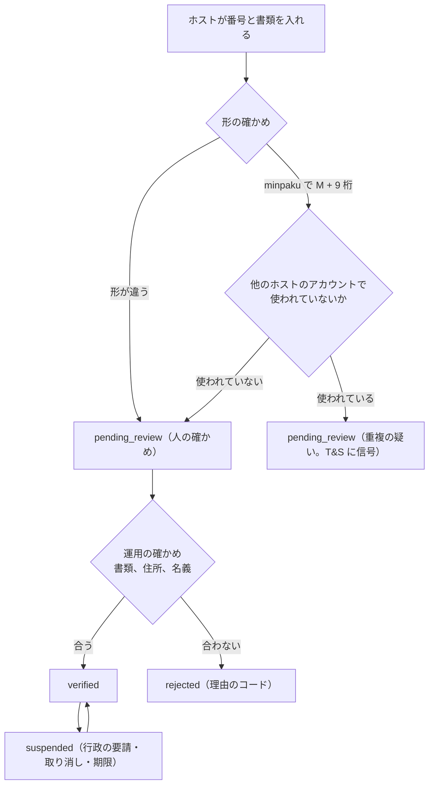
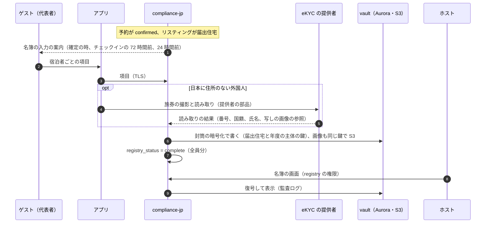

# Regulatory Compliance Japan: Airbnb

日本の法令の対応を決める。届出住宅・旅館業の許可・特区の特定認定の型、番号の確かめと表示、180 日の数え（`regulated_nights` と年度と CHECK 制約）、他の掲載先の泊の扱い、自治体の規則の表（`municipal_rule_sets`）、宿泊者名簿の電子の名簿と旅券の取り込み（vault）、定期報告の補助の書き出し、行政の要請への対応を扱う。法令の解釈に当たる項目は枠組みだけを書き、結論を書かない。どれも **法務の確認待ち** で、[intent.md](../intent.md) の L1・L2・L3・L10 を付ける。

前提となる決定は次のとおり。

- 届出住宅を `regulated_properties` で持ち、泊の日を `regulated_nights`（届出住宅 × 日）に予約と同じトランザクションで挿入し、年度の数を CHECK 制約で守る。自治体の規則はバージョンの付いた表。数え方の解釈と他の掲載先の泊は `legal.*`（[ADR-0006](../decisions/0006-regulatory-night-cap-enforcement.md)）
- 予約のトランザクションのロックの順は、届出住宅 → リスティング → 予約（[ADR-0004](../decisions/0004-booking-state-machine-and-holds.md)。[booking-and-holds.md](booking-and-holds.md) の 6.2 節）
- 宿泊者名簿と旅券の画像は vault に閉じる（[AGENTS.md](../../AGENTS.md)、security の領域）
- 旅券の読み取りと本人確認は eKYC の提供者（identity-verification の領域）

この文書で決めたことは次の ADR にある。

| ADR | 決定 |
| --- | --- |
| [0064](../decisions/0064-registration-types-and-number-verification.md) | 届出住宅・旅館業の施設・特区の施設を `regime` で分けた 1 つの表で持つ。番号は形の確かめ（届出番号は観測した「M + 9 桁」の形。合わない形は拒まず人の確かめへ）、他のホストでの使用の確かめ、書類と運用の確かめで `verified` にする。`verified` でない届出住宅に結んだリスティングは公開しない。取り消し・停止は新しい予約を止め、既存の予約を自動で取り消さない |
| [0065](../decisions/0065-regulated-nights-fiscal-year-and-external-overflow.md) | 年度は `night_date` が 4 月 1 日以後ならその年。数えは 1 泊 1 日を既定にし、境の扱いは `legal.minpaku_day_boundary_rule`。外部の泊は `legal.minpaku_count_external_nights` が数える値のときだけ `regulated_nights` に入れ、上限を超える分は `external_overflow` に数えて CHECK を破らない。値を変えたら年度ごとに数え直す |
| [0066](../decisions/0066-municipal-rule-sets.md) | 自治体の規則は、区域（自治体のコードか条例の区域の多角形）と、禁じる泊の規則（泊の始まりの日の曜日、日付の範囲、祝日の扱い）、上限の値、特区の最短の泊数を、施行の日の付いたバージョンで持つ。届出住宅の区域は正確な位置から登録の時に決めて規則の集まりの ID を持たせる。規則の変更は既存の予約を取り消さず、反する予約の一覧を作る |
| [0067](../decisions/0067-guest-registry-in-vault.md) | 宿泊者名簿は予約ごと・宿泊者ごとの行を vault に、（届出住宅、年度）の主体の鍵の封筒の暗号化で持ち（[ADR-0073](../decisions/0073-key-layout-and-vault-envelope-encryption.md)）、旅券の画像は同じ鍵で S3 に置く。読めるのはホストのアカウントの名簿の権限と、法令の照会の手順（2 人の承認）だけ。入力はゲストがチェックインの 24 時間前までに行う。保存の期間は `legal.guest_registry_retention_days`（開発・検証の既定 1,095 日）で、本番の値は法務の L3 の後 |

## 1. 範囲

- 扱う：
  - 届出住宅・許可・特定認定の型（`regulated_properties`）、番号の確かめ、表示、状態
  - `regulated_nights`・`regulated_years`、年度、数えの関数、外す規則、上限の超えの扱い
  - 他の掲載先の泊（ホストの申告、取り込み）の数え（法務の確認待ち：L1）
  - 自治体の規則の表、区域の決め方、規則の判定、規則の変更
  - 宿泊者名簿の電子の名簿、旅券の取り込み、保存と読み出し（法務の確認待ち：L3）
  - 定期報告の補助の書き出し（法務の確認待ち：L1）
  - 行政の要請（違法な物件の削除の要請、照会）への手順の枠
  - 180 日の照合
- 扱わない：
  - `stay_claims` と予約の流れ（[availability-and-calendars.md](availability-and-calendars.md)、[booking-and-holds.md](booking-and-holds.md)）
  - リスティングの公開の審査の全体（listings-and-content の領域）
  - eKYC の提供者と旅券の読み取りの方式（identity-verification の領域）
  - vault の鍵と運用者の権限（security の領域）
  - 宿泊税・入湯税（taxes の領域）

## 2. 要件

| 要件 | 目標 | NFR |
| --- | --- | --- |
| 上限 | 届出住宅の年度の泊の日数が上限を超えた件数 0。どんな並行度でも | NFR-006、K6 |
| 自治体の規則 | 自治体の規則で禁じた日の泊 0 | NFR-006 |
| 番号のない物件 | 届出番号・許可番号のない日本の物件の公開 0 | NFR-006 |
| 確定の後に取り消さない | 上限・規則を理由に、確定した予約を自動で取り消さない | [ADR-0006](../decisions/0006-regulatory-night-cap-enforcement.md) |
| 名簿の秘匿 | 名簿・旅券がホストのアカウントの名簿の権限と法令の照会の手順の外に出た事象 0 | NFR-016 |
| 速さ | 予約のトランザクションの中の数えと規則の判定 p99 20ms | NFR-004 |

## 3. 制度と本家の形（確かめたこと）

いずれも 2026-10-10 に確認（[intent.md](../intent.md) の出典）。当てはめは法務の確認待ち。

- 住宅宿泊事業は届出で行い、年間の提供日数は 180 日以内。条例で実施の期間を制限できる。宿泊者名簿の作成・保存の義務がある（観光庁の [住宅宿泊事業法の概要](https://www.mlit.go.jp/kankocho/minpaku/overview/minpaku/index.html)）。
- 宿泊者名簿は本人確認のうえ作り、作成日から 3 年保存する。氏名・住所・職業・宿泊日、日本に住所のない外国人は国籍と旅券の番号。2・4・6・8・10・12 月の 15 日までに、前 2 か月の宿泊日数・宿泊者数・延べ宿泊者数・国籍別の内訳を報告する（観光庁の [住宅宿泊事業者の義務](https://www.mlit.go.jp/kankocho/minpaku/business/host/index.html)）。
- 毎年 4 月 1 日の正午から翌年 4 月 1 日の正午までの期間で、正午から翌日の正午までを 1 日と数える（埼玉県の [住宅宿泊事業法の概要](https://www.pref.saitama.lg.jp/a0806/minpaku/jutaku-shukuhaku01.html)。施行規則の条文は e-Gov で取得できなかった）。
- 住宅宿泊仲介業は観光庁長官の登録を受けて営む（観光庁の [住宅宿泊仲介業者の登録](https://www.mlit.go.jp/kankocho/minpaku/business/mediation/registration.html)）。
- 本家は日本のリスティングに届出番号・許可番号の表示を求め、確かめの書類を上げさせる（[ヘルプの記事 2177](https://www.airbnb.com/help/article/2177)、[ヘルプの記事 2274](https://www.airbnb.com/help/article/2274)）。
- 届出番号の形：佐賀県の住宅宿泊事業者の一覧に「M410000109」のような「M + 9 桁」の番号が並ぶ（[佐賀県の一覧の PDF](https://www.pref.saga.lg.jp/kiji00362234/3_62234_398949_up_tbonvujr.pdf)）。品川区・岐阜県の標識の様式は「第 M 号」の欄を持つ（[品川区](https://www.city.shinagawa.tokyo.jp/contentshozon/hyousikiteisei.pdf)、[岐阜県](https://www.pref.gifu.lg.jp/uploaded/attachment/506671.pdf)）。どれも 2026-10-10 に Web の検索の結果の要約で確かめ、PDF の本文は開いていない。桁の数と、M の後の 2 桁が都道府県のコードであることを定めた国の資料は確かめられなかった（**未検証**）。
- 本家の 180 日の数え方、自治体の規則の扱い、名簿の持ち方は公開されていない（**未検証**）。

## 4. 届出住宅・許可・特定認定

[ADR-0064](../decisions/0064-registration-types-and-number-verification.md) で決めた。

### 4.1 型

| `regime` | 根拠 | 上限 | 名簿 | 番号の表示 |
| --- | --- | --- | --- | --- |
| `minpaku` | 住宅宿泊事業法の届出 | `annual_cap`（既定 180、規則の集まりでより少ない値） | 要（L3） | 届出番号（L1） |
| `ryokan` | 旅館業法の許可 | なし | 要（旅館業法の名簿。L2・L3） | 許可番号（L2） |
| `tokku` | 国家戦略特区の特定認定 | なし。最短の泊数（規則の集まりの値） | 要（L2・L3） | 特定認定の番号（L2） |
| `exempt` | 上のどれにも当たらないと運用が確かめた施設（L1・L10 の結論を待つ。MVP では作らない） | — | — | — |

- 日本の物件のリスティングは、どれかの型の `regulated_properties` に結ばなければ公開できない（`listingVisible()` の条件。listings-and-content の領域）。
- 1 つの届出住宅に複数のリスティング（部屋）を結べる。上限は届出住宅で分け合う（[ADR-0006](../decisions/0006-regulatory-night-cap-enforcement.md)）。
- 1 つのリスティングは 1 つの届出住宅にだけ結ぶ。

### 4.2 番号の確かめ



| 確かめ | 中身 |
| --- | --- |
| 形 | `minpaku`：`^M\d{9}$`（全角・空白・「第」「号」を正規化して取り除いてから）。観測した形で、国の定めは**未検証**。合わない形は拒まず、人の確かめに回す。`ryokan`・`tokku`：自治体ごとに形が違うので、文字の正規化だけ |
| 都道府県 | `minpaku` の M の後の 2 桁が、物件の住所の都道府県のコード（01〜47）と合うか。合わなければ印を付けて人の確かめへ（**未検証**の規則なので拒まない） |
| 重複 | 同じ `regime` と正規化した番号の `verified` の行が、他のホストのアカウントにないか（`regulated_properties` の部分一意の索引 `(regime, registration_number_norm) WHERE verification_status IN ('verified','pending_review')` は使わない。共同の事業者がありうるので、重複は人が確かめる） |
| 書類 | 届出の受理の通知、許可書などの画像・PDF（S3、`regulatory-docs/<property_id>/`） |
| 運用の確かめ | 書類の番号・住所・事業者の名義と、ホストのアカウントの本人確認の名義・リスティングの住所が合うか |
| 行政のデータとの照合 | 自治体・観光庁のデータとの照合ができるかは **法務の確認待ち（L1）**。できるなら、照合の結果を `verification_source = 'government_data'` で持つ |

- 確かめの判断は運用（T&S の審査の待ち行列）が行う。エージェントは判断しない。
- `verified` の行の番号・型・住所を変えるには、新しい確かめを要する（`pending_review` に戻る。戻っている間、結んだリスティングは公開のままにし、新しい予約は受ける。72 時間で確かめが終わらなければ運用へ）。

### 4.3 表示

- リスティングの画面・確認の画面・予約の確認のメールに、型の名前（「住宅宿泊事業 届出番号」など）と番号を出す。出す場所と形は **法務の確認待ち（L1・L2）**（[quality.md](../quality.md) の 2.2.1 節 K）。
- 番号は公開の値なので core に持つ（vault でない）。届出住宅の住所は出さない（[ADR-0006](../decisions/0006-regulatory-night-cap-enforcement.md)）。

### 4.4 状態の変化と予約

| 変化 | リスティング | 新しい予約 | 既存の予約 |
| --- | --- | --- | --- |
| `verified` → `suspended`（行政の要請、廃止の届出） | 非公開 | 409 `registration_not_verified` | 取り消さない。運用の待ち行列に一覧を出し、運用とホストで決める（6.2 節の運用のキャンセルを使える） |
| `verified` → `rejected` | 非公開 | 同上 | 同上 |
| `annual_cap` の値の変更（規則の集まりの変更） | — | 新しい値で判定 | 取り消さない。超える年度を `regulatory_exceptions` に記録 |

## 5. 180 日の数え

[ADR-0065](../decisions/0065-regulated-nights-fiscal-year-and-external-overflow.md) で決めた。

### 5.1 泊の日と年度

- 泊 `[check_in, check_out)` の各日 `d` を `night_date` とする（正午から翌日の正午までの 1 日の始まりの日）。チェックインが正午の後、チェックアウトが翌日の正午の前という通常の時刻の前提である。
- 正午の前のチェックイン・正午の後のチェックアウトを 2 日と数えるかは `legal.minpaku_day_boundary_rule`（`one_per_night`・`noon_to_noon_strict`）で持つ。既定は `one_per_night`。本番の値は **法務の確認待ち（L1）**。`noon_to_noon_strict` にするなら、リスティングのチェックインの時刻が正午より前・チェックアウトの時刻が正午より後のとき、前後の日も `night_date` に足す。
- 年度：`fiscal_year(d) = d ≥ 4 月 1 日（d の年） ? d の年 : d の年 − 1`。3 月 31 日の泊（3 月 31 日の正午から 4 月 1 日の正午）は前の年度。

### 5.2 表

[ADR-0006](../decisions/0006-regulatory-night-cap-enforcement.md) の表に、次を足す。

| 表・列 | 意味 |
| --- | --- |
| `regulated_years.external_overflow` | 外部の泊のうち、上限を超えて数えられなかった日の数（CHECK に入れない） |
| `regulated_years.cap_source` | 上限の出どころ（`law_default`・`municipal_rule_set:<id>:<version>`） |
| `regulated_nights.claim_count` | その日を埋める有効な `stay_claims` の数（届出住宅のどの部屋でも） |
| `regulated_external_nights` | 外部の泊の記録（数えない値のときも持つ。数え直しの入力） |

### 5.3 数えの関数

`packages/compliance-jp` の関数だけが書く。どれも呼び出し側のトランザクションの中で、届出住宅の行のロックの後に呼ぶ。

```
countNights(tx, property, nights[], claim_id) -> ok | regulatory_cap_reached | regulatory_day_blocked
uncountNights(tx, property, nights[], claim_id, now)
```

`countNights`：

1. `verification_status = 'verified'` でなければ `registration_not_verified`。
2. 規則の集まり（7 節）で各 `night_date` を判定し、禁じた日があれば `regulatory_day_blocked`。
3. 各 `night_date` について：

```sql
INSERT INTO regulated_nights (property_id, night_date, source, first_claim, claim_count)
VALUES ($p, $d, 'platform', $claim, 1)
ON CONFLICT (property_id, night_date)
  DO UPDATE SET claim_count = regulated_nights.claim_count + 1
RETURNING (xmax = 0) AS inserted;          -- true only when a new day was created
-- for each new day, grouped by fiscal year:
INSERT INTO regulated_years (property_id, fiscal_year, nights_used, external_used, cap, cap_source)
VALUES ($p, $fy, $new_days, 0, $cap, $cap_source)
ON CONFLICT (property_id, fiscal_year)
  DO UPDATE SET nights_used = regulated_years.nights_used + $new_days;
-- CHECK (nights_used + external_used <= cap) -> ROLLBACK -> 409 regulatory_cap_reached
```

`uncountNights`：外す泊のうち `night_date` の正午（物件の現地の時刻）が `now` より後の日だけ、`claim_count` を 1 減らし、0 になった日は行を消して `nights_used` を減らす。過ぎた日は戻さない（泊めた日は戻らない）。

- 呼ぶ所：`reserveStay`（`hold`・`request` の作成）、`alterReservation`（新しい日の `hold`）、遷移の `cancelled`・`declined`・`expired` と変更の断り・入れ替え（`uncountNights`）、PMS の API の予約の作成。ホストのブロックは数えない（泊めていない）。
- `claim_count` で、同じ夜の 2 室は 1 日と数え、片方を外しても日は残る。

### 5.4 例：2 室の届出住宅と年度の境

前提：届出住宅 P（`minpaku`、部屋 A・B のリスティング、上限 180）。2026 年 3 月 20 日の時点で、2025 年度の `nights_used = 178`。

| # | 操作 | 泊の日 | 数え | 結果 |
| --- | --- | --- | --- | --- |
| 1 | 部屋 A：3/30〜4/2 を予約 | 3/30・3/31（2025 年度）、4/1（2026 年度） | 2025 年度 178 → 180、2026 年度 0 → 1 | 入る |
| 2 | 部屋 B：3/31〜4/1 を予約 | 3/31 | 3/31 はすでにある（`claim_count` 1 → 2）。増えない | 入る（同じ夜の 2 室は 1 日） |
| 3 | 部屋 B：3/29〜3/30 を予約 | 3/29 | 新しい日。2025 年度 181 | CHECK に当たり 409 `regulatory_cap_reached` |
| 4 | 3/25 に予約 1 をキャンセル | 3/30・3/31・4/1 を外す | 3/30 は 0 → 消す（179）。3/31 は予約 2 が残る（`claim_count` 2 → 1）。4/1 は 0 → 消す（2026 年度 0） | 2025 年度 179 |
| 5 | 3/26 に部屋 B：3/29〜3/30 をもう一度 | 3/29 | 180 | 入る |

- 予約 1 と予約 3 が同時に来ても、届出住宅の行のロックで直列になり、片方だけが上限の中に入る。

### 5.5 仮押さえとリクエスト

- 仮押さえ（10 分）とリクエスト（最長 24 時間）の泊も数える（[ADR-0006](../decisions/0006-regulatory-night-cap-enforcement.md)）。確定の時に上限で失敗させないため。上限の近い届出住宅では、期限切れまで他の予約が入らない（ADR-0006 の「引き受けるコスト」）。
- 上限の残りが 5 日以下の届出住宅では、リクエストを受けない（即時予約だけ）。24 時間の塞ぎで残りを使い切ることを防ぐ（本システムの値）。

## 6. 他の掲載先の泊

- 外部の泊の入力は、ホストの申告（`external_stay_declarations`）と、`treat_as = external_reservation` の取り込み（[calendar-sync.md](calendar-sync.md) の 7 節）。
- `legal.minpaku_count_external_nights`：`none`（本番の既定）・`declared`・`declared_and_ical`。本システムが外部の泊を数える義務があるかは **法務の確認待ち（L1）**。
- 外部の泊は、値に依らず `regulated_external_nights` に記録する。値が数える値のときだけ、`regulated_nights` に `source = 'external_declared'`・`'external_ical'` で入れる（本システムの泊と同じ日なら `claim_count` を増やすだけ）。
- 外部の新しい日で上限を超えるときは、CHECK を破らないよう `external_used` を上限まで増やし、残りを `external_overflow` に数え、`regulatory_exceptions` に記録して、ホストと運用に知らせる。本システムの既存の予約は取り消さない（[ADR-0006](../decisions/0006-regulatory-night-cap-enforcement.md)）。`nights_used + external_used = cap` になるので、その年度の新しい予約は入らない。
- 値を変えたら、`regulated-recount` のジョブが、届出住宅 × 年度ごとに、ロックの中で `regulated_nights` と `regulated_years` を作り直す。作り直しで上限を超えた年度は `regulatory_exceptions` に記録する（既存の予約は取り消さない）。
- 値が `none` の間も、数えた場合の値をホストの画面に参考として出す（[ADR-0006](../decisions/0006-regulatory-night-cap-enforcement.md)）。

## 7. 自治体の規則の表

[ADR-0066](../decisions/0066-municipal-rule-sets.md) で決めた。

### 7.1 形

| 列 | 意味 |
| --- | --- |
| `id`・`version` | 規則の集まりの ID とバージョンの番号 |
| `municipality_code` | 全国地方公共団体コード |
| `zone` | `whole`（自治体の全体）か、条例の区域の多角形（PostGIS の `MULTIPOLYGON`） |
| `applies_to` | 型の集合（`minpaku`・`tokku`） |
| `effective_from`・`effective_to` | 施行の日（物件の現地の日付） |
| `prohibited_night_weekdays` | 禁じる泊の、始まりの日の曜日の集合 |
| `prohibited_periods` | 禁じる泊の日付の範囲（毎年の `MM-DD` の範囲か、絶対の日付の範囲） |
| `holiday_rule` | 祝日の扱い（`none`・`allow_night_before_holiday`・`prohibit_holidays`） |
| `annual_cap` | 上限（法の 180 より少ない値があれば） |
| `min_nights` | 特区の最短の泊数 |
| `source_ref`・`approved_by` | 条例の出典（文書の参照）と、入れた法務・運用の承認 |

- 規則の中身（どの条例がどの区域に何を定めるか）は、法務と運用が条例を読んで入れる。コードに自治体の名前を書かない（[AGENTS.md](../../AGENTS.md)）。条例の読み取りの責任は **法務の確認待ち（L1）**。
- 祝日の表（`jp_holidays`）は、内閣府の公表する国民の祝日の表を年に 1 回入れる（出どころの URL と形は**未検証**。`municipal-rule-sets` の Story で確かめる）。

### 7.2 区域の決め方

- 届出住宅の登録と住所の変更の時に、正確な位置（vault）で、自治体の全体と条例の区域の多角形を判定し、合う規則の集まりの ID を `regulated_properties.rule_set_id` に書く。判定は vault の位置を読める `compliance-jp` の中で行い、位置そのものを core に写さない。
- 区域の多角形が変われば、その自治体の届出住宅の判定をやり直す。

### 7.3 判定

```
checkMunicipalRules(rule_set_versions[], regime, nights[]) -> blocked_nights[]
```

- 各 `night_date` について、その日に効いている（`effective_from ≤ d < effective_to`）バージョンで判定する。施行の日をまたぐ滞在は、日ごとに効くバージョンで判定する。
- 禁じる条件：`weekday(d) ∈ prohibited_night_weekdays`、`d` が `prohibited_periods` のどれかに入る。`holiday_rule = allow_night_before_holiday` なら、`d + 1` が祝日の泊は曜日の禁止から外す。`prohibit_holidays` なら、`d` が祝日の泊を禁じる。
- 特区の最短の泊数は `checkStayRules` の最短の泊数より強い値として、予約の時に確かめる（`regulatory_min_nights`）。

**例**（形の例で、実在の条例の値ではない）：区域 Z の規則「日曜の正午から金曜の正午まで禁じる」= `prohibited_night_weekdays = {日, 月, 火, 水, 木}`、`holiday_rule = allow_night_before_holiday`。

| 滞在 | 泊の日 | 判定 |
| --- | --- | --- |
| 10/9（金）〜10/11（日） | 金、土 | 入る |
| 10/9（金）〜10/12（月） | 金、土、日（10/11） | 10/12（月）はスポーツの日なので、10/11 の泊は祝日の前の泊として外す → 入る |
| 10/16（金）〜10/19（月） | 金、土、日（10/18） | 10/19 は祝日でない → 10/18 を禁じる → 409 `regulatory_day_blocked` |

- 2026 年 10 月 12 日（月）はスポーツの日（10 月の第 2 月曜日）として例に使った。祝日の表の値で判定する。

### 7.4 規則の変更

- 新しいバージョンは施行の日の前に入れる。入れた時に、施行の日より後に泊のある有効な予約・リクエストのうち、新しい規則に反するものを `regulatory_exceptions` に一覧にし、運用とホストに知らせる。既存の予約を自動で取り消さない（[ADR-0006](../decisions/0006-regulatory-night-cap-enforcement.md)）。扱い（ゲストへの説明、運用のキャンセル）は運用とホストで決める。
- 規則の表の変更は QA と法務の承認で出す（[roadmap.md](../roadmap.md) の「エージェントに任せないこと」）。

## 8. 宿泊者名簿

[ADR-0067](../decisions/0067-guest-registry-in-vault.md) で決めた。名簿の作成の義務はホストにあり、本システムがホストに代わって電子の名簿を持つことの整理、本人確認の方法、項目、旅券の写しの保存、保存の期間、照会への提出は、どれも **法務の確認待ち（L3）**。

### 8.1 項目

| 項目 | 全員 | 日本に住所のない外国人 |
| --- | --- | --- |
| 氏名 | ○ | ○ |
| 住所 | ○ | ○ |
| 職業 | ○ | ○ |
| 宿泊日 | ○（予約から） | ○ |
| 国籍 | — | ○ |
| 旅券の番号 | — | ○ |
| 旅券の写し（画像） | — | ○ |

- 項目の一覧は `legal.guest_registry_fields` に持ち、法務の結論で変える。

### 8.2 流れ



- 入力の期限はチェックインの 24 時間前（`registry_due_at`）。入力が済むまで、入り方の情報を出さない（`legal.registry_gate_arrival_info`。[booking-and-holds.md](booking-and-holds.md) の 10 節）。
- 宿泊者の人数は予約の人数。人数の変更（[cancellations-and-changes.md](cancellations-and-changes.md) の 7 節）で、足りない宿泊者の入力を求め直す。
- 対面の代わりの本人確認（ICT の方法の要件）は **法務の確認待ち（L3）**。チェックインの時の本人確認（顔の照合、映像）は、ホストが行う前提で、本システムは記録の欄（`identity_checked_at`、方法のコード）を持つ。

### 8.3 保存と読み出し

| 項目 | 決定 |
| --- | --- |
| 置き場 | Aurora vault の `guest_registry_entries`。主体の鍵は（届出住宅、年度）ごとで、KMS の `kms-vault-registry` で包む（[ADR-0073](../decisions/0073-key-layout-and-vault-envelope-encryption.md)）。旅券の画像は S3 の `registry/<property_id>/<fiscal_year>/<entry_id>`（同じ主体の鍵で封筒の暗号化。Object Lock なし） |
| 読める主体 | ホストのアカウントの `owner`・`full`、`registry` の権限を与えた共同ホスト（`messages_only`・`calendar` には出さない）。運用者は法令の照会の手順（照会の書類の記録、JIT の権限、2 人の承認）だけ |
| 監査 | 読み出しごとに、主体、名簿の行の ID、目的のコードを監査ログに書く（内容は書かない） |
| ログ | 氏名・住所・旅券の番号・画像の参照を書かない（[AGENTS.md](../../AGENTS.md)） |
| 保存の期間 | `legal.guest_registry_retention_days`。開発・検証の既定 1,095 日（作成から 3 年。観光庁の資料の値で、[ADR-0075](../decisions/0075-data-classes-and-retention.md) の下限）。本番の値は L3・L8 の後 |
| 消し方 | 期間の後、年度の主体の鍵を破棄して、その年度の行と画像をまとめて読めなくする（暗号の消去）。自動の破棄は法務の結論の後に始める（[ADR-0075](../decisions/0075-data-classes-and-retention.md)） |
| 書き出し | ホストは CSV（名簿の項目）と画像の zip を、再認証の後に出せる（署名つきの URL、15 分）。行政の照会への提出の形は L3 |

## 9. 定期報告の補助の書き出し

- 2・4・6・8・10・12 月の 1 日に、前 2 か月の分を作り、ホストに知らせる（観光庁の報告の期限は 15 日。3 節）。
- 届出住宅ごとの CSV：宿泊日数（本システムの泊と、申告・取り込みの外部の泊を分けた 2 つの列と和）、宿泊者数、延べ宿泊者数、国籍別の内訳（名簿の国籍から。日本に住所のある人は「日本」と数えるかは L3）。
- 本システムが報告を代わりに出すか、出す形（行政のシステムへの入力の形）は **法務の確認待ち（L1）**。MVP はホストが使う補助の書き出しだけ。

## 10. 行政の要請への対応

| 要請 | 手順の枠 |
| --- | --- |
| 違法な物件・番号の不正な物件の削除の要請 | 運用が要請の書類を記録し、届出住宅を `suspended`、リスティングを非公開にする。既存の予約は 4.4 節。期限と報告は L1 |
| 物件の情報の照会 | 法務と Ops が照会の書類を確かめ、届出住宅・予約の泊の数を出す。名簿は 8.3 節の手順 |
| 警察からの名簿の照会 | 同上（L3） |
| 定期の報告の求め（仲介業者として） | L1。報告の項目に合わせて書き出しを足す |

- 要請への応答は法務と Ops が行う（[roadmap.md](../roadmap.md) の「エージェントに任せないこと」）。

## 11. 照合

`regulatory-reconciler`（日次。繁忙期は 1 時間ごと）。

| # | 比べるもの | 外れたとき |
| --- | --- | --- |
| G1 | 各年度の `nights_used + external_used ≤ cap`（CHECK があるので真のはず） | page（SEV1 の候補）。その届出住宅の予約を止める |
| G2 | `regulated_nights` の `source = 'platform'` の日の集合 = 有効な `stay_claims`（`hold`・`request`・`reservation`）と過ぎた日の確定した予約から計算した日の集合 | page |
| G3 | `claim_count` = その日を埋める有効な行の数 | ticket |
| G4 | `nights_used` = その年度の `regulated_nights` の数（`platform` の分） | page |
| G5 | 上限の 90% に達した届出住宅 | ホストに知らせる（照合の外れではない） |
| G6 | `verified` でない届出住宅に結んだ公開のリスティング | page |

## 12. 障害のときの振る舞い

| 障害 | 影響 | 振る舞い |
| --- | --- | --- |
| 届出住宅の行のロックの待ち | 予約が遅れる | `lock_timeout` 200ms で 409 `busy`。部屋の多い届出住宅の待ちは `hot-dates-booking-poc` で測る |
| 規則の集まりの誤り | 誤った拒否・許可 | 規則の表は承認つきで出す。誤りが見つかれば新しいバージョンで直し、7.4 節の一覧を作る |
| vault の停止 | 名簿の入力・閲覧ができない | 予約は止めない。入り方の情報の門（`registry_gate_arrival_info`）は、vault の停止の間は名簿の完了の印（core の `registry_status`）だけで判定する |
| eKYC の提供者の停止 | 旅券の読み取りができない | 手で入れる画面に切り替え、画像だけ上げる（後で読み取る） |

## 13. 上限

| 対象 | 値 |
| --- | --- |
| 1 届出住宅のリスティング | 20 |
| 1 ホストのアカウントの届出住宅 | 200 |
| 上限の残りでリクエストを受けない閾値 | 5 日 |
| 名簿の入力の期限 | `check_in_at − 24 時間` |
| 旅券の画像 | 1 人 2 枚、1 枚 10 MiB |
| 数え直しのジョブ | 届出住宅 × 年度ごとに 1 トランザクション |

## 14. data-model への項目

| 表・置き場 | 中身 | 主キー・索引 | 節 |
| --- | --- | --- | --- |
| `regulated_properties`（core、ホストのアカウントの RLS） | [ADR-0006](../decisions/0006-regulatory-night-cap-enforcement.md) の列 ＋ `registration_number_norm`、`verification_source`、`review_flags`、`suspended_reason` | `id`、`(regime, registration_number_norm)`、`(host_account_id)` | 4 |
| `regulatory_documents`（core、同） | 書類の S3 の鍵、種類 | `id`、`(property_id)` | 4.2 |
| `regulated_years`（core） | ＋ `external_overflow`、`cap_source` | `(property_id, fiscal_year)` | 5.2 |
| `regulated_nights`（core） | ＋ `claim_count` | `(property_id, night_date)` | 5.2 |
| `regulated_external_nights`（core） | 外部の泊（出どころ、区間の参照） | `(property_id, night_date, source)` | 6 |
| `regulatory_exceptions`（core） | 種類（`external_overflow`・`rule_change_conflict`・`recount_over_cap`・`registration_suspended`）、届出住宅、予約の一覧、状態 | `id` | 4.4、6、7.4 |
| `municipal_rule_sets`（core） | 7.1 節 | `(id, version)`、`(municipality_code, effective_from)`、GiST `zone` | 7 |
| `jp_holidays`（core） | 祝日 | `day` | 7.1 |
| `guest_registry_entries`（vault、ホストのアカウントの RLS ＋ 名簿の権限） | 予約、届出住宅、年度、宿泊者の番号、暗号化した項目（主体の鍵の ID）、画像の参照、入力の時刻、本人確認の記録 | `id`、`(reservation_id)`、`(property_id, fiscal_year)` | 8 |
| `reservations` の列 | `registry_status`、`registry_due_at` | — | 8.2 |
| S3 | `regulatory-docs/…`、`registry/…`（vault の鍵）、`reports/<property_id>/<period>.csv` | — | 4.2、8.3、9 |
| `legal.*` | `minpaku_day_boundary_rule`、`minpaku_count_external_nights`、`guest_registry_fields`、`guest_registry_retention_days`、`registry_gate_arrival_info` | — | 5、6、8 |

## 15. テスト

- **PROP-REG-001（上限）**：任意の届出住宅（部屋 1〜5、上限 30〜180、規則の集まり）、予約・リクエスト・仮押さえ・期限切れ・キャンセル・日程の変更・年度をまたぐ滞在・外部の申告と `legal.minpaku_count_external_nights` の 3 つの値、並行の実行者 2〜50 で、どの時点でも各年度の `nights_used + external_used ≤ cap`（[quality.md](../quality.md) の 2.2.1 節 B）。
- **PROP-REG-002（日の数）**：`nights_used` は、その年度に有効な行のある日（どの部屋でも）と過ぎた日の数に一致する。2 室の同じ夜は 1 日。
- **PROP-REG-003（過ぎた日）**：過ぎた日はキャンセルで減らない。
- **PROP-REG-004（禁じた日）**：禁じた日を含む予約は作られない。上限に達した後の予約はすべて 409 で、既存の予約は 1 件も取り消されない。
- **PROP-REG-005（参照との一致）**：`cap-ref`（日の集合を素直に数える）と一致する。
- **PROP-REG-006（数え直し）**：`legal.minpaku_count_external_nights` を任意に変えて数え直した結果は、最初からその値で数えた結果と一致する。
- **PROP-REG-007（名簿の秘匿）**：任意の主体で、名簿の行と画像は 8.3 節の主体の外から読めない（同 H）。
- **表駆動**：4.2 節の番号の形（全角、空白、「第」「号」）、7.3 節の例、規則の判定（曜日、祝日、期間、区域、施行の日）。
- **時刻の試験**：年度の境（3 月 31 日のチェックイン、4 月 1 日）、閏日、施行の日をまたぐ滞在。
- **負荷**：部屋 5 の届出住宅の上限の残り 3 日に 20 件の同時の予約で、上限の超え 0、成功 3 日分（同 J）。

## 16. Story の候補

| Epic | Story | 中身 |
| --- | --- | --- |
| E18 | `regulated-properties` | 4.1・4.2・4.4 節（ADR-0064）。法務：L1・L2 |
| E18 | `registration-display` | 4.3 節。法務：L1・L2 |
| E18 | `night-cap-counting` | 5 節（ADR-0065。PROP-REG-001〜005、`cap-ref`）。数え方の値は法務：L1 |
| E18 | `external-nights-counting` | 6 節（ADR-0065。PROP-REG-006）。法務：L1 |
| E18 | `municipal-rule-sets` | 7 節（ADR-0066）。法務：L1 |
| E18 | `guest-registry` | 8 節（ADR-0067。PROP-REG-007）。法務：L3 |
| E18 | `periodic-report-export` | 9 節。法務：L1 |
| E18 | `regulatory-reconciler` | 11 節 |
| E18 | `ryokan-listings` | 4.1 節の `ryokan`・`tokku`。法務：L2・L10 |

## 17. 未解決の問い

### 決定

2026-10-10 の既定案。

- **型**：`regime` で分けた 1 つの表（ADR-0064）。
- **番号の形**：観測した形で確かめ、合わなければ人の確かめへ。拒まない（ADR-0064）。
- **年度と日**：`night_date` の年度、1 泊 1 日、`claim_count` で 2 室を 1 日（ADR-0065）。
- **外部の泊**：値で数え、超えた分は `external_overflow`。値の変更で数え直す（ADR-0065）。
- **上限の近い届出住宅**：残り 5 日以下でリクエストを受けない（ADR-0065）。
- **自治体の規則**：バージョンと施行の日、区域は登録の時に決める（ADR-0066）。
- **名簿**：vault、（届出住宅、年度）の主体の鍵、2 人の承認の照会、チェックインの 24 時間前までの入力（ADR-0067、ADR-0073）。

### 持ち越し

| 問い | いつ・どう決めるか |
| --- | --- |
| 仲介業者の義務、番号の確かめ方、数え方、外部の泊、条例の読み取りの責任、定期報告の範囲 | 法務の確認待ち（L1）。結論まで E18 の全 Story の spec を承認しない |
| 許可・特定認定の番号、特区の最短の泊数、旅館業の施設の仲介 | 法務の確認待ち（L2・L10） |
| 名簿の作成者、本人確認の方法、項目、旅券の写し、保存、照会 | 法務の確認待ち（L3）。保存の期間と越境は L8 も |
| 届出番号の桁と都道府県のコードの規則 | 国の資料で確かめられなかった（**未検証**）。人の確かめで補う |
| 祝日の表の出どころ | `municipal-rule-sets` の Story（**未検証**） |
| 本家の 180 日の数え方、名簿の持ち方 | 公開されていない（**未検証**） |

## 出典

いずれも 2026-10-10 に確認。

- 観光庁, [民泊制度ポータルサイト 住宅宿泊事業法の概要](https://www.mlit.go.jp/kankocho/minpaku/overview/minpaku/index.html)
- 観光庁, [住宅宿泊事業者の義務](https://www.mlit.go.jp/kankocho/minpaku/business/host/index.html)
- 観光庁, [住宅宿泊仲介業者の登録](https://www.mlit.go.jp/kankocho/minpaku/business/mediation/registration.html)
- 埼玉県, [住宅宿泊事業法の概要](https://www.pref.saitama.lg.jp/a0806/minpaku/jutaku-shukuhaku01.html)
- 佐賀県, [住宅宿泊事業者の一覧（PDF）](https://www.pref.saga.lg.jp/kiji00362234/3_62234_398949_up_tbonvujr.pdf)：「M + 9 桁」の番号の並び（検索の結果の要約で確かめた）
- 品川区, [標識の様式（PDF）](https://www.city.shinagawa.tokyo.jp/contentshozon/hyousikiteisei.pdf)、岐阜県, [標識の様式（PDF）](https://www.pref.gifu.lg.jp/uploaded/attachment/506671.pdf)：「第 M 号」の欄
- Airbnb, [ヘルプの記事 2177](https://www.airbnb.com/help/article/2177)、[ヘルプの記事 2274](https://www.airbnb.com/help/article/2274)：[intent.md](../intent.md) の出典のとおり
