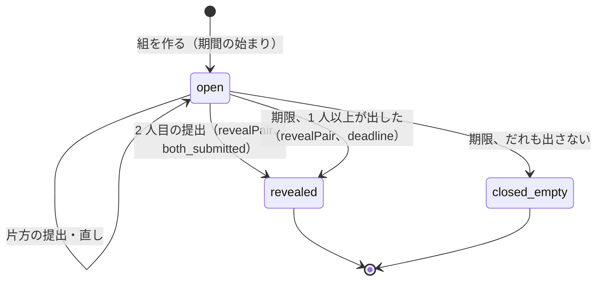

# Reviews: Airbnb

レビュー。`review_pairs` の作り方、期間（チェックアウトから 14 日）と同時の公開、項目ごとの点、公開の前の直し、ホストの返答、集計と表示、操作の検出、削除の基準（法務の L13）を決める。

前提となる決定は次のとおり。

- チェックアウトの時刻を過ぎると、`reviews` は予約ごとに `review_pairs` の行を作り、期限 = チェックアウトの時刻 + 14 日を書く。片方が出しても `revealed_at` は空のまま。2 人目の提出のトランザクションか、期限の処理で `revealed_at` を書く。どちらの経路も同じ関数（[architecture/README.md](README.md) の 1.3 節 H）
- 予約が `completed` になるとレビューの組を作る（[ADR-0004](../decisions/0004-booking-state-machine-and-holds.md)）
- 瞬間は物件のタイムゾーンで UTC に直す。計算は `packages/stay-time`（[ADR-0002](../decisions/0002-availability-representation-and-double-booking.md)）
- 完了まで隠す相互の評価は Mercari の題材を参照する（[ADR-0049](../../../mercari/docs/decisions/0049-mutual-ratings-sealed-until-completion.md)）

この文書で決めたことは次の ADR にある。

| ADR | 決定 |
| --- | --- |
| [0055](../decisions/0055-review-pairs-and-simultaneous-reveal.md) | `review_pairs` は 1 予約 1 行で、期限は物件の現地のチェックアウトの時刻から現地の日付で 14 日の後の同じ時刻。提出は組の行を `FOR UPDATE` で取り、DB の `now()` が期限より前のときだけ受け、2 人目の提出なら同じトランザクションで `revealPair()` を呼ぶ。期限は `deadline-runner` が同じ `revealPair()` を呼ぶ。未公開のレビューは書いた本人の外に、RLS と公開のビューで出さない |
| [0056](../decisions/0056-review-aggregation-and-removal.md) | 表示の点は、公開して削除していないレビューの単純な平均を小数 2 桁で、3 件以上で出す（順位の式はベイズの平均を別に持つ）。集計は `review.revealed`・`review.removed` の事象で core の `listing_review_stats` をレビューの ID の冪等で直し、日次に数え直す。削除は決めた基準の表のどれかに当たり、`moderation_actions` に根拠を書いたときだけで、文を隠して集計から外し、行は残す |

## 1. 範囲

- 扱う：組の作り方と作らない条件、期間、提出と直し、同時の公開、相手が出したことの知らせ、レビューの項目、公開の前の検査、ホストの返答、公開の読み出しの経路、集計と表示、操作の検出の信号、通報と削除の基準の枠組み。
- 扱わない：
  - 予約の状態の機械（booking-and-holds の領域）。
  - 通報の案件の審査と措置の手順（[trust-and-safety.md](trust-and-safety.md) の 5.4・5.5 節）。この文書は削除の基準と、措置の結果の反映を書く。
  - 順位の式でのレビューの使い方（[search-and-ranking.md](search-and-ranking.md) の 7 節）。
  - 優良ホストの段（MVP の後）。

## 2. 事実（確かめたこと）

| 項目 | 事実 | この設計 |
| --- | --- | --- |
| 本家のレビューの期間と公開 | ゲストとホストはチェックアウトから 14 日の間にレビューを書ける。両者が出したとき、または 14 日の期間が終わったときの早いほうで公開する。公開の前は直せる（[ヘルプの記事 13](https://www.airbnb.com/help/article/13)） | 同じ（ADR-0055） |
| 本家の点の表示の件数の下限、返答の期限、削除の基準の全文 | 公式の資料で確かめられなかった（**未検証**） | 本システムの値（ADR-0056） |

いずれも 2026-10-10 に確認。

## 3. 要件

| 要件 | 値 | 出どころ |
| --- | --- | --- |
| 早すぎる公開 | 片方だけの公開・期限の前の公開 0 | NFR-009、K9 |
| 公開の遅れ | 2 人目の提出と同時、または期限から 1 分以内に両方を公開 | NFR-009 |
| 時刻 | 期限を物件のタイムゾーンと tz データベースのバージョンで計算した値と違える件数 0 | NFR-014 |
| 見える範囲 | 未公開のレビューは書いた本人だけが読める | [quality.md](../quality.md) の 2.2.1 節 F・H |
| 可用性 | レビューの提出 月間 99.9%（メッセージと同じ） | NFR-010 |

## 4. 組と提出（ADR-0055）

### 4.1 組を作る

| 予約の終わり方 | 組 | 期間の始まり |
| --- | --- | --- |
| `in_stay → completed`（チェックアウトの時刻） | 作る | `check_out_at` |
| `in_stay → cancelled`（滞在中のキャンセル。1 泊以上泊まった） | 作る。ただし T&S が `review_suppressed` を付けた予約（安全の事故の案件）は作らない | キャンセルの瞬間 |
| チェックインの前の `cancelled`・`declined`・`expired` | 作らない | - |

- 予約の `reservation.completed`・`reservation.cancelled`（滞在中）の事象を `reviews` が受け、`review_pairs` を作る（`reservation_id` の一意。事象の重複で 2 行にならない）。
- 期限 `deadline_at` は、期間の始まりの瞬間を物件の現地の時刻に直し、現地の日付で 14 日を足した同じ現地の時刻を UTC に直した値（`packages/stay-time` の `addLocalDays(instant, 14, time_zone)`）。夏時間の切り替えをまたぐと、14 × 24 時間と 1 時間違う。

### 4.2 状態



- レビューの行（`reviews`）は、`author_role`（`guest`・`host`）ごとに組の中で 1 つ（`(pair_id, author_role)` の一意）。提出は、期限の前なら何度でも直せる（同じ行を書き換え、`edit_count` を上げる）。
- `revealed` の後は、レビューの行を書き換えない（DB のトリガーで、`revealed_at` のある組のレビューの本文と点の更新を拒む）。

### 4.3 同時の公開

```sql
-- 公開の関数（提出と期限の両方の経路がこれだけを呼ぶ）
CREATE FUNCTION reveal_pair(p_pair uuid, p_cause text) RETURNS boolean AS $$
  UPDATE review_pairs
     SET revealed_at = now(), reveal_cause = p_cause
   WHERE id = p_pair AND revealed_at IS NULL
     AND EXISTS (SELECT 1 FROM reviews WHERE pair_id = p_pair AND submitted_at IS NOT NULL)
  RETURNING true;
$$ LANGUAGE sql;
```

**提出の経路（1 つのトランザクション）**

1. `SELECT … FROM review_pairs WHERE id = $1 FOR UPDATE`。
2. `now() >= deadline_at` なら 409 `review_window_closed`。`revealed_at` があれば 409 `review_already_revealed`。
3. 本人の役割を確かめる（ゲスト本人か、ホストのアカウントの成員で役割 `owner`・`full`）。
4. 公開の前の検査（4.4 節）を通し、`reviews` を書く（`submitted_at`）。
5. 両方の `submitted_at` があれば `reveal_pair(pair, 'both_submitted')`。
6. outbox に `review.submitted`（公開なら `review.revealed`）を書く。

**期限の経路**：`deadline-runner` が 1 分ごとに `deadline_at <= now() AND revealed_at IS NULL AND closed_at IS NULL` の組を `FOR UPDATE SKIP LOCKED` で 100 件ずつ取り、提出があれば `reveal_pair(pair, 'deadline')`、なければ `closed_empty` にする。

- 期限の判定は DB の `now()` だけを使う。アプリの時計を使わない（提出と期限の処理が同じ時計で比べる）。
- 組の行のロックで、提出どうし・提出と期限の処理が直列になる。2 人が同時に出しても、2 人目のトランザクションだけが公開する。`revealed_at` は 1 回だけ書かれる。

**読み出しの経路**

- `reviews` の表は FORCE RLS で、書いた本人（ゲスト本人、ホストのアカウントの成員）だけが自分の行を読める。
- 他の人（相手を含む）の読み出しは、公開のビュー `reviews_public`（`revealed_at IS NOT NULL` かつ削除していない行の公開の列）だけを通す。検索の索引・プロフィール・API・通知も、このビューから読む。
- 相手が出したことは知らせてよい（「〇〇さんがレビューを書きました。あなたのレビューを書くと両方が公開されます」）。中身と点は知らせない。

**例**（物件は `Asia/Tokyo`、チェックアウトの時刻 10:00）

| 時刻（日本時間） | 起きること | 見える範囲 |
| --- | --- | --- |
| 2026-12-03 10:00 | 予約が `completed`。組を作り、`deadline_at` = 2026-12-17 10:00 | - |
| 12-05 21:00 | ゲストが出す | ゲストだけが自分のレビューを読める。ホストに「レビューが書かれました」 |
| 12-06 09:00 | ゲストが直す | 同上 |
| 12-09 15:00 | ホストが出す → 同じトランザクションで公開 | 両方が全員に見える |

- ホストが出さなければ、12-17 10:00 から 1 分以内にゲストのレビューだけが公開され、ホストはもう出せない。
- 物件が `America/New_York` で、チェックアウトが 2026-10-25 11:00（夏時間、UTC 15:00）なら、期限は 2026-11-08 11:00（標準時、UTC 16:00）。14 日と 1 時間の後になる。

### 4.4 項目と公開の前の検査

| 書き手 | 公開の項目 | 公開しない項目 |
| --- | --- | --- |
| ゲスト → リスティングとホスト | 総合の点（1〜5）、項目の点（清潔さ、正確さ、チェックイン、連絡、立地、価値。各 1〜5）、本文（0〜1,000 文字） | ホストへの私的な言葉（1,000 文字）、本システムへの意見 |
| ホスト → ゲスト | 総合の点（1〜5）、項目の点（清潔さの扱い、ハウスルールの順守、連絡）、本文（0〜1,000 文字） | ゲストへの私的な言葉、「また泊めたいか」（本システムだけ） |

- 本文は提出の時に、[messaging.md](messaging.md) の 5.3 節の `address`・`phone`・`email`・`url` の検出を当て、当たった部分を伏せ字にする（段に依らない。公開の文に正確な住所・連絡先を残さない。[location-and-geo.md](location-and-geo.md) の 5.2 節）。伏せたことを書き手に示す。
- 禁止の語・差別の語の辞書に当たれば、書き手に確認を出す（`warn`）。送れば保存し、T&S に信号を出す。公開を止めない（止めると、公開の時期を書き手の言葉で操れるため）。
- 点の材料に、ゲストの氏名・顔の写真を表示の材料として使わない。ホストのゲストへのレビューの画面に、確定の前に見せない情報（顔の写真）を出さない（[trust-and-safety.md](trust-and-safety.md) の 11 節）。

### 4.5 ホストの返答

- ホストは、公開されたゲストのレビューに、公開から 30 日の間に 1 回だけ返答できる（1,000 文字）。返答は投稿から 24 時間だけ直せ、その後は変えない。
- 返答にも 4.4 節の伏せ字と辞書の検査を当てる。
- ゲストはホストのレビューに返答できない（本家の振る舞いは**未検証**。MVP は片方だけ）。

## 5. 集計と表示（ADR-0056）

| 表示 | 中身 | 条件 |
| --- | --- | --- |
| リスティングの総合の点 | 公開して削除していないゲストのレビューの総合の点の平均を小数 2 桁（四捨五入） | 3 件以上。2 件以下は「新着」と件数だけ |
| 項目の点 | 項目ごとの平均を小数 1 桁 | 3 件以上 |
| 件数 | 公開して削除していない件数 | 常に |
| ホストの点 | ホストのアカウントの全リスティングのゲストのレビューの平均 | 3 件以上 |
| ゲストのプロフィール | ホストからのレビューの本文と件数。点の平均は出さない | 常に |

- 集計は core の `listing_review_stats`（`listing_id`、`count`、`sum_overall`、項目ごとの `sum_*`、`applied_review_ids` の要約）。`reviews` の `review.revealed`・`review.removed` の事象を受け、レビューの ID で冪等に足し引きする（事象の重複で 2 回足さない。`review_stat_applications` の一意）。日次に content から数え直して照合する。
- 順位の式のレビューの点（[search-and-ranking.md](search-and-ranking.md) の 7 節）は、同じ `listing_review_stats` からベイズの平均を作る。表示の平均とは別の値で、画面に出さない。
- 数字の表示の規則（並べ方、評価の分布の表示、ステルスマーケティングの表示）は法務の確認待ち（L13）。

## 6. 操作の検出

レビューは予約の 2 者だけが書ける（組がない人は書けない）ので、偽のレビューは「偽の予約」を作る形になる。次を T&S の信号にする（[trust-and-safety.md](trust-and-safety.md) の 6 節）。

| 信号 | 中身 |
| --- | --- |
| `self_booking` | ゲストとホストのアカウントの成員が、端末の識別子・支払いの手段の指紋・送金の口座の名義のどれかを共有する |
| `cheap_short_burst` | 同じリスティングで、30 日に 3 件以上の、区域の中央値の 30% 未満の料金の 1 泊の予約と、その後の満点のレビュー |
| `new_account_five_star` | 作成から 30 日未満のアカウントのゲストの満点のレビューが、そのリスティングの直近 10 件の半分以上 |
| `review_extortion` | 予約のメッセージで、レビューの語（「レビュー」「星」`review`・`stars`）と、返金・お金・脅しの語の組（[messaging.md](messaging.md) の 5.5 節と同じ辞書の仕組み） |
| `incentive_offer` | ホストのメッセージで、レビューの語と、割引・返金・贈り物の語の組（見返りの申し出） |

- 信号は規則のエンジンの入力で、レビューを自動で消さない。審査の結果の削除は 7 節の基準で行う。

## 7. 削除の基準（枠組み。法務の確認待ち L13）

| 基準のコード | 中身 |
| --- | --- |
| `not_about_stay` | 滞在と関係のない内容（政治の主張、他のリスティングの話） |
| `personal_info` | 個人の情報（氏名の全部、連絡先、正確な住所）。伏せ字で足りれば伏せ字にして残す |
| `hate_discrimination` | 差別・憎悪の表現 |
| `threat_harassment` | 脅し、嫌がらせ、報復の示唆 |
| `extortion` | レビューを使った脅し（返金しなければ低く書く） |
| `incentivized` | 見返りを受けたレビュー |
| `conflict_of_interest` | 自分・身内・競合のリスティングのレビュー（`self_booking` の確認を含む） |
| `legal_request` | 裁判所の命令、法令による削除の要請（L13・L14） |

- 削除は、T&S の審査が基準のコードと根拠を `moderation_actions` に書いた後に、`removeReview(review_id, action_id)` だけが行う。本文と点を `reviews_public` から外し、集計から引き（`review.removed`）、行は残す（監査と異議）。
- 書き手と相手に削除を知らせる（基準のコードの説明。審査の規則そのものは示さない）。異議の手順は [trust-and-safety.md](trust-and-safety.md) の 5.5 節。
- ホストが低い点を理由に削除を求めても、基準に当たらなければ消さない。
- 削除の申し出への応答の期限（情報流通プラットフォーム対処法の手続き）は法務の確認待ち（L13）。

## 8. 失敗と回復

| 事象 | 影響 | 扱い |
| --- | --- | --- |
| `deadline-runner` の停止 | 期限の公開が遅れる（NFR-009 の 1 分） | 再開で溜まった組を処理する。2 時間止めても二重に公開しない（`reveal_pair` の `revealed_at IS NULL`）。遅れを警告 |
| `reservation.completed` の事象の欠け | 組がない | 日次の照合：`completed` の予約で組のないものを作る（期限は元の期間の始まりから計算する。過ぎていれば `closed_empty` にし、運用に知らせる） |
| 集計の食い違い | 表示の点が違う | 日次の数え直しで直す |
| tz データベースの更新 | 未来の `deadline_at` が変わりうる | 未来の期限の列を計算し直す（[ADR-0002](../decisions/0002-availability-representation-and-double-booking.md)） |
| 誤った削除 | 正しいレビューが消えた | 異議の認容で措置を取り消し、`reviews_public` に戻して集計に足す |

## 9. 上限

| 対象 | 値 |
| --- | --- |
| 期間 | 14 日 |
| 本文 | 1,000 文字 |
| 直し | 公開の前、20 回まで |
| ホストの返答 | 1 件、公開から 30 日、直しは 24 時間 |
| 表示の下限 | 3 件 |

## 10. data-model への項目

| 置き場所 | 中身 | 節 |
| --- | --- | --- |
| Aurora content `review_pairs`（`id`、`reservation_id` 一意、`listing_id`、`guest_id`、`host_account_id`、`window_start_at`、`deadline_at`、`tzdata_version`、`revealed_at`、`reveal_cause`、`closed_at`、`suppressed`） | 組 | 4 |
| Aurora content `reviews`（`id`、`pair_id`、`author_role`、`author_id`、`overall`、`category_scores`、`body`、`private_note`、`system_feedback`、`submitted_at`、`edit_count`、`removed_at`、`removal_action_id`）。一意 `(pair_id, author_role)`。FORCE RLS（本人だけ）。公開の後の更新を拒むトリガー | レビュー | 4.2、4.4 |
| Aurora content ビュー `reviews_public` | 公開の読み出し | 4.3 |
| Aurora content `review_responses`（`review_id` 一意、`body`、`created_at`、`locked_at`） | 返答 | 4.5 |
| Aurora core `listing_review_stats`、`host_review_stats`、`review_stat_applications`（`review_id`、`op` 一意） | 集計 | 5 |
| outbox の話題 `review.submitted`、`review.revealed`、`review.removed` | 事象 | 4.3、5 |

## 11. テストと性質

| ID | 性質・試験 |
| --- | --- |
| PROP-REV-001 | どの時点でも、`revealed_at` が空の組のレビューは、書いた本人の外（相手、他の利用者、検索、プロフィール、API、通知）から読めない（[quality.md](../quality.md) の 2.2.1 節 F） |
| PROP-REV-002 | 2 人が出したら、2 人目の提出と同じトランザクションで公開され、片方だけが公開された時点はない |
| PROP-REV-003 | 期限が来たら、出した分が 1 分以内に公開され、期限の前には公開されない（仮想の時計、`deadline-runner` の停止と再開を混ぜる） |
| PROP-REV-004 | 期限の後の提出は受け付けない。公開の後の本文と点の更新は拒まれる |
| PROP-REV-005 | 2 人が同時に出しても（並行度 2〜50）、`revealed_at` は 1 回だけ書かれ、1 つの値 |
| PROP-REV-006 | 任意の物件のタイムゾーンと期間の始まりで、`deadline_at` は現地の日付で 14 日の後の同じ現地の時刻（夏時間の飛びは後ろ、重なりは早いほう） |
| PROP-REV-007 | 集計は、任意の公開と削除の事象の列（重複、順序の入れ替え）の後に、公開して削除していないレビューから数え直した値と一致する |
| PROP-REV-008 | 公開の本文に、[messaging.md](messaging.md) の 5.3 節の `address`・`phone`・`email` の検出に当たる部分が残らない |
| 試験のベクトル | 4.3 節の例（日本時間と `America/New_York`）、表示の下限（2 件と 3 件）、点の丸め |

## 12. Story の候補

| Epic | Story | 中身 |
| --- | --- | --- |
| E15 | `review-pairs-and-reveal` | 組、期限、提出、`reveal_pair`、RLS と公開のビュー（4 節） |
| E15 | `review-scores-and-display` | 項目、集計、表示。表示は法務：L13（5 節） |
| E15 | `host-responses-and-removal` | ホストの返答、通報と削除の基準。法務：L13（4.5、7 節） |
| E16 | `review-manipulation-signals` | 操作の検出の信号（6 節） |

## 13. 未解決の問い

### 決定（2026-10-10、既定案）

- **公開**：1 つの関数、組の行のロック、DB の時計、現地の日付で 14 日（ADR-0055）。
- **集計**：単純な平均を 3 件以上で表示、冪等な事象の反映と日次の数え直し、削除は基準と根拠で（ADR-0056）。
- **滞在中のキャンセル**：1 泊以上泊まれば組を作る。安全の事故の案件は作らない。

### 持ち越し

| 問い | いつ・どう決めるか |
| --- | --- |
| 削除の基準と、削除の申し出への応答の期限・手続き | 法務の確認待ち（L13・L14） |
| 点の表示の形（分布、並べ方） | 法務の確認待ち（L13） |
| ホストの都合のキャンセルをリスティングの画面に出すか | PM と T&S。S1 の運用の 3 か月のキャンセルの率を見て決める |
| ゲストの返答 | MVP の後。PM |
| 本家の表示の下限・返答の期限 | 公式の資料で確かめる（**未検証**） |
