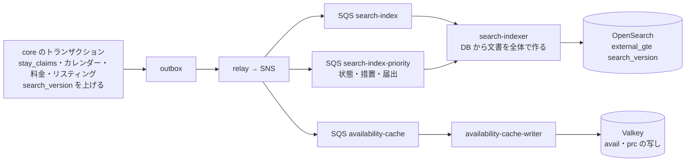

# Search and ranking: Airbnb

検索と順位付け。リスティングの索引の形（ずらした位置、空きの区間、料金の要約、多言語の欄）、索引への反映、ステージ 1 の OpenSearch の問い合わせ、Valkey の空室の写しの形、ステージ 2 の滞在の規則と価格の絞り込み、地図の点と件数、日付を決めない検索、順位の式 v1、検索の誤りの率の計測を決める。

前提となる決定は次のとおり。

- 日付の範囲の検索は 2 段。OpenSearch の `stay_ranges`（`date_range`）の「含む」で候補を 300 件に絞り、Valkey の空室の写し（2 年分の泊のビット列と規則の要約）で `checkStayRules` を回す。価格はステージ 1 で粗く（±30%）、ステージ 2 の料金の要約で正しく絞る。正しさは予約の時の DB で守る（[ADR-0003](../decisions/0003-search-for-date-range-availability.md)）
- `checkStayRules` は予約と検索で同じ関数（[ADR-0002](../decisions/0002-availability-representation-and-double-booking.md)、availability-and-calendars の領域）
- 索引には `approx_point` だけを入れる（[location-and-geo.md](location-and-geo.md) の 5 節）
- 順位付けの ML は MVP の後、影の評価の後。保護される属性とその代わりの値を特徴に使わない（[ADR-0009](../decisions/0009-trust-and-safety-and-ml-boundary.md)）
- 見える範囲は `listingVisible()`（[listings-and-content.md](listings-and-content.md) の 8 節）

この文書で決めたことは次の ADR にある。

| ADR | 決定 |
| --- | --- |
| [0024](../decisions/0024-listing-index-layout-and-stay-ranges.md) | 索引 `listings_v<n>`（別名 `listings`）は S1 で主シャード 2・写し 2、`refresh_interval` 1 秒。文書は DB から毎回全体を作り直し、`search_version` を `external_gte` の外部のバージョンにする。`stay_ranges` は空きの区間 `[a, b)` を `{gte: a, lte: b − p}`（次の予約がない区間の終わりは縮めない）の閉じた範囲で入れ、問い合わせ `{gte: check_in, lte: check_out}` の `contains` で引く。日付を決めない検索のために月ごとの最長の空きの泊数 `month_runs` を持つ |
| [0025](../decisions/0025-availability-snapshot-layout.md) | 空室の写し `avail:{listing_id}` は 1 つの二進の値（見出し 32 バイト、768 ビットの泊のビット列、チェックインの日ごとの上書き 6 バイト × 最大 256）で、平均 250 バイト。料金の写し `prc:{listing_id}` は泊ごとに解決した料金の配列。どちらも `availability-cache-writer` が Lua の比べて書く手順でバージョンの大きいときだけ書く。ステージ 2 は 300 件を 1 回のパイプラインで取る |
| [0026](../decisions/0026-ranking-formula-v1.md) | 順位の式 `rank_v1` = (0.35·Q + 0.25·C + 0.15·H + 0.10·D + 0.15·P) × 苦情の罰 × 表示の言語の原文の 1.05 倍。Q はレビューのベイズの平均（事前 10 件）、C は平滑した転換、H はホストの信頼、D は内容の充実、P は同じ検索の総額の中央値との比。ステージ 1 は P を除いた `rank_static` で並べる。1 ページに同じホストのアカウントは 3 件まで |
| [0027](../decisions/0027-flexible-date-search.md) | 日付を決めない検索（週末、1 週間、月の中の N 泊）は、ステージ 1 で `month_runs` の最長の空きが N + 準備の日以上の件に絞り、ステージ 2 で写しのビット列から日付の順に条件に合う日程を最大 8 つ集め、料金の要約の最も安い日程（同じなら早い日程）でその件を表す |

## 1. 範囲

- 扱う：索引の置き場所・欄・反映・作り直し、`stay_ranges` と `month_runs` の作り方、空室の写しと料金の写しの形、ステージ 1 の問い合わせ、ステージ 2 の判定、価格の絞り込み、地図の点と件数、ページ、日付を決めない検索、順位の式 v1、ブロックした相手の除外、検索の誤りの率の計測、照合。
- 扱わない：
  - `stay_claims`、滞在の規則の中身と決定表（availability-and-calendars の領域）。この文書は写しへの写し方と、同じ関数を呼ぶことを書く。
  - 料金の要約の計算（[pricing-and-fees.md](pricing-and-fees.md) の 6 節の `quoteSummary`）と税の目安（[taxes.md](taxes.md)）。
  - 地名の辞書と範囲への直し方（[location-and-geo.md](location-and-geo.md) の 6・7 節）。
  - OpenSearch のドメインの大きさと費用（capacity、infrastructure の各領域）。この文書は見込みだけを書く。
  - 順位付けの ML（MVP の後）。

## 2. 事実（確かめたこと）

| 項目 | 事実 | この設計 |
| --- | --- | --- |
| 範囲の型の問い合わせ | OpenSearch の `range` の問い合わせは、範囲の型の欄に `relation`（`INTERSECTS`・`CONTAINS`・`WITHIN`）を持てる。`date_range` は範囲の型の 1 つ（[Range field types](https://docs.opensearch.org/latest/field-types/supported-field-types/range/)、[Range query](https://docs.opensearch.org/latest/query-dsl/term/range/)） | `stay_ranges` を `contains` で引く（4.3 節） |
| 本家の検索・順位の内部 | 公開されていない（**未検証**。[architecture/README.md](README.md) の 1.4 節） | 自前の 2 段と規則の式 |

いずれも 2026-10-10 に確認。範囲の型の閉じた端と開いた端の扱い（`lt` で入れた値の内部の表し方）は、`availability-search-poc` で試して確かめる。この設計は閉じた範囲（`gte`・`lte`）だけを使う。

## 3. 要件

| 要件 | 値 | 出どころ |
| --- | --- | --- |
| 検索の速さ | 地図・地名・日付・人数・価格 p95 300ms・p99 800ms。日付を決めない検索 p95 600ms | NFR-001 |
| 空室の鮮度 | 予約・仮押さえ・ブロック・設定の変更から索引と写しに効くまで p95 10 秒・p99 60 秒 | NFR-002 |
| 混入 | 結果に、その日付に泊まれないリスティングが混ざる割合 0.5% 未満（抜き取り） | NFR-002、K3 |
| 可用性 | 検索 月間 99.9% | NFR-010 |
| 公開から検索 | p95 60 秒 | [architecture/README.md](README.md) の 1.3 節 A |
| 見える範囲 | `listingVisible()` が `hidden` の件 0、ブロックした相手の件 0 | [listings-and-content.md](listings-and-content.md) の 8 節 |
| 規模 | S1 で 10 万件、検索の最大 500 件/秒。S3 で 1,000 万件、2 万件/秒 | [architecture/README.md](README.md) の 2 節 |

## 4. 索引（ADR-0024）

### 4.1 置き場所と形

- **ドメイン**：東京の 3 AZ。リスティングの索引、地名の索引（[location-and-geo.md](location-and-geo.md) の 6 節）、写真のハッシュの索引（[listings-and-content.md](listings-and-content.md) の 6.3 節）を同じドメインに置く。
- **索引**：`listings_v<スキーマの番号>` と別名 `listings`。文書はリスティングごとに 1 つ、ID は `listing_id`。`listingVisible()` の行 3〜9 で `hidden` の件は入れない。
- **大きさの見込み（S1）**：文書あたり 12 KB（5 言語の文、`stay_ranges` 最大 200 区間、価格の帯 25 か月）で 10 万件 1.2 GB。主シャード 2、写し 2（3 AZ に 1 つずつ）。検索の量（500 件/秒）を 3 つの写しで分ける。
- **S2**：地域ごとの索引（日本、アジアの他の国）に分け、別名で束ねる（[ADR-0003](../decisions/0003-search-for-date-range-availability.md)）。

### 4.2 欄

| 欄 | 型 | 中身 |
| --- | --- | --- |
| `search_version` | 数 | 外部のバージョン（4.4 節） |
| `calendar_version` | 数 | 写しとの古さの比べに使う |
| `approx_point` | `geo_point` | ずらした位置 |
| `municipality_code` | keyword | 自治体 |
| `stay_ranges` | `date_range`（複数の値、`format: yyyy-MM-dd`） | 4.3 節 |
| `month_runs` | nested `{month: 数 YYYYMM, max_run: 数}` | 月ごとの最長の空きの泊数（6 節） |
| `max_guests`、`bedrooms`、`beds`、`bathrooms` | 数 | 条件 |
| `property_type`、`room_type`、`amenities`、`instant_book` | keyword・bool | 条件 |
| `min_nights_floor` | 数 | 最短の泊数の既定と上書きの最小 |
| `price_bands` | nested `{month, nightly_min, nightly_max}`（円に直した参考の値、25 か月） | 価格の粗い絞り |
| `rank_static`、`rank_q`、`rank_c`、`rank_h`、`rank_d`、`rank_m` | 数 | 順位の式の材料（7 節） |
| `original_langs` | keyword | 原文のある言語 |
| `title_{lang}`、`description_{lang}` | text（言語ごとの解析器） | 原文と機械翻訳。機械翻訳の欄は `_mt` を付けた別の欄に入れ、重み 0.8 |
| `host_account_id` | keyword | ブロックとページの中の偏りの抑え |
| `review_count`、`review_avg` | 数 | 表示 |
| `cover_photo_id`、`currency` | keyword | 表示 |

- 日本語の欄は Sudachi（C の単位）と ICU の正規化、中国語は ICU のトークナイザー、韓国語は ICU、英語は標準。Shopify の題材の日本語の解析を参照する（[ADR-0052](../../../shopify/docs/decisions/0052-search-index-per-pod-and-japanese-analysis.md)）。
- 語での検索（「町家」「温泉」）は MVP では条件の補助で、主な入口は地図と地名と日付である。語の一致は `rank_static` に掛けず、ステージ 1 の `must` の条件として足すだけにする。

### 4.3 `stay_ranges` の作り方

`packages/search/computeStayRanges(claims, rules, today_local)`。`availability-cache-writer` と `search-indexer` が同じ関数を使う。

1. 有効な `stay_claims` の `block_span` の和を取る（[ADR-0002](../decisions/0002-availability-representation-and-double-booking.md)）。
2. 窓 `W = [today_local, today_local + 予約できる期間)` の中の補集合を、空きの区間 `[a, b)` の列にする。
3. 各区間の終わりを縮める：`b` が行の始まり（次の予約・ブロックがある）なら `e = b − p`（`p` はリスティングの準備の日）。`b` が窓の終わりなら縮めない（`e = b`）。窓の終わりをまたぐ滞在はステージ 1 で落ちる（予約できる期間の端の数日の取りこぼしで、引き受ける）。
4. `e − a < min_nights_floor` の区間は捨てる。
5. 区間を `{gte: a, lte: e}` の閉じた範囲で入れる。**チェックアウトの日 `e` を範囲に含める**ことが要点。滞在 `[ci, co)` は `a ≤ ci` かつ `co ≤ e` なら、`block_span = [ci, co + p)` が `[a, b)` に収まる。
6. 区間は 200 まで（日付の順の先頭から）。超えた分は入れず、`stay_ranges_truncated` の数で見る。

問い合わせは `{"range": {"stay_ranges": {"gte": ci, "lte": co, "relation": "contains"}}}`。

**例**：準備の日 `p = 1`、予約できる期間 12 か月、物件の現地の今日 2026-12-01。

| 行 | `nights` | `block_span` |
| --- | --- | --- |
| 予約 A | [12-05, 12-08) | [12-05, 12-09) |
| 予約 B | [12-24, 12-27) | [12-24, 12-28) |
| ホストのブロック（`p = 0`） | [2027-01-10, 2027-01-15) | [2027-01-10, 2027-01-15) |

| 空きの区間 `[a, b)` | `b` は行の始まりか | `stay_ranges` |
| --- | --- | --- |
| [12-01, 12-05) | はい（A） | {12-01, 12-04} |
| [12-09, 12-24) | はい（B） | {12-09, 12-23} |
| [12-28, 2027-01-10) | はい（ブロック） | {12-28, 2027-01-09} |
| [2027-01-15, 2027-12-01) | いいえ（窓の終わり） | {2027-01-15, 2027-12-01} |

- 滞在 12-30〜01-02（3 泊）：{12-30, 01-02} は {12-28, 01-09} に含まれる → 候補。`block_span` [12-30, 01-03) はブロックの 01-10 より前。
- 滞在 12-20〜12-24（4 泊）：{12-20, 12-24} は {12-09, 12-23} に含まれない → 落ちる。実際、`block_span` [12-20, 12-25) は B の 12-24 と重なる。
- 滞在 12-01〜12-04（3 泊）：{12-01, 12-04} に含まれる。`block_span` [12-01, 12-05) は A の 12-05 の前で、準備の日がちょうど収まる。

### 4.4 反映



- `search-indexer` は事象の中身を信じず、`listing_id` で core（書き込みの主）を読み、文書の全体を作って `version_type=external_gte`、`version=search_version` で書く。重複と順序の入れ替えは、バージョンで古い書き込みが捨てられることで吸収する。
- `search_version` は、リスティング・改訂・状態・`stay_claims`・カレンダーの設定・料金の規則・順位の材料のどれかが変わるトランザクションで 1 上げる（[listings-and-content.md](listings-and-content.md) の 4.4 節）。[ADR-0003](../decisions/0003-search-for-date-range-availability.md) の「`calendar_version` を外部のバージョンにする」を、内容の変化も含む数に広げた。
- 状態の変化・措置・届出の失効は `search-index-priority` で先に流す（`hidden` になった件を p99 60 秒で消す）。消すのも `external_gte` の削除で行う。
- 同じリスティングの事象が 1 秒に何度も来たら（一括のブロック）、`search-indexer` は 500ms まとめてから 1 回書く。

### 4.5 日次の更新と照合

- 毎日、物件の現地の 0 時 5 分の後に、その日のタイムゾーンのリスティングの `stay_ranges` の下の端を今日に進める（文書を作り直す）。遅れても、ステージ 2 の締め切りと予約できる期間の判定で落ちるので、正しさに影響しない（[ADR-0003](../decisions/0003-search-for-date-range-availability.md)）。
- 同じ処理で `month_runs` と `price_bands` の窓を 1 日進める。
- 照合：毎日、全リスティングの 1/7 について、DB から作った文書と索引の `search_version`・`stay_ranges` を比べ、違えば作り直す（取りこぼしの率の計測を兼ねる。8 節）。

## 5. 検索（2 段）

### 5.1 入力

| 項目 | 形 | 上限 |
| --- | --- | --- |
| 地理 | `bbox`・`place`・`point_radius`（[location-and-geo.md](location-and-geo.md) の 7 節） | - |
| 日付 | `check_in`・`check_out`（物件の現地の日付として扱う）か、日付を決めない指定（6 節） | 1〜90 泊。今日から 2 年先まで |
| 人数 | 大人・子ども・乳児・ペット | 大人と子どもの和 16 まで |
| 価格 | 1 泊あたりか総額の範囲、表示の通貨 | - |
| 条件 | 物件の種類、部屋の型、寝室の数、設備（10 まで）、即時予約だけ | - |
| 並べ替え | `recommended`（既定）、`price_asc` | - |

- 定員の判定に使う人数は大人と子どもの和。乳児は数えない。ペットは `pets` のハウスルールで絞る。

### 5.2 ステージ 1（OpenSearch）

```json
{
  "size": 300,
  "query": { "bool": { "filter": [
    { "geo_bounding_box": { "approx_point": { "top_left": "…", "bottom_right": "…" } } },
    { "range": { "stay_ranges": { "gte": "2026-12-30", "lte": "2027-01-02", "relation": "contains" } } },
    { "range": { "max_guests": { "gte": 4 } } },
    { "range": { "min_nights_floor": { "lte": 3 } } },
    { "terms": { "room_type": ["entire_home"] } },
    { "nested": { "path": "price_bands", "query": { "bool": { "filter": [
      { "term": { "price_bands.month": 202612 } },
      { "range": { "price_bands.nightly_min": { "lte": 39000 } } },
      { "range": { "price_bands.nightly_max": { "gte": 7000 } } }
    ] } } } }
  ] } },
  "sort": [ { "rank_static": "desc" }, { "listing_id": "asc" } ],
  "track_total_hits": 1000
}
```

- 地名のときは `geo_bounding_box` の代わりに `geo_shape`（多角形）か `geo_distance`（点と半径）。
- 価格の帯：求める 1 泊あたりの範囲 `[lo, hi]`（円に直した値）に対し、`nightly_min ≤ hi × 1.3` かつ `nightly_max ≥ lo × 0.7`。総額の範囲は泊数で割って 1 泊あたりにする。滞在が 2 つの月にまたがるときは、どちらかの月の帯が重なればよい。
- 粗い順位は `rank_static`（7.2 節）。同じ点は `listing_id` の昇順。
- `track_total_hits` は件数の表示（5.6 節）のために 1,000 まで数える。

### 5.3 空室の写しと料金の写し（ADR-0025）

**`avail:{listing_id}`（1 つの二進の値）**

| 部分 | 大きさ | 中身 |
| --- | --- | --- |
| 見出し | 32 バイト | 形式の番号、`calendar_version`（8）、基準の日（物件の現地の今日の月の初め。1970-01-01 からの日数）、タイムゾーンの番号（tz の表の索引）、予約できる期間（月）、準備の日、最短・最長の泊数の既定、チェックイン・チェックアウトの曜日の印（各 7 ビット）、締め切り（種類と値：当日の分か、N 日前）、チェックインの開始の時刻（分）、定員 |
| 泊のビット列 | 96 バイト | 768 ビット。ビット `i` は基準の日 + `i` の夜が `block_span` で埋まっているか（1 が埋まり） |
| 上書きの数 | 2 バイト | |
| 上書き | 6 バイト × 最大 256 | チェックインの日ごとの最短・最長の泊数（`calendar_days` の上書き） |

- 平均 250 バイト。S1 の 10 万件で 25 MB、S3 の 1,000 万件で 2.5 GB（鍵の負担を除く）。
- ビット列は `block_span` を写すので、準備の日を含む。チェックインの日 `ci` から `n` 泊の滞在は、ビット `ci − base` から `ci − base + n + p − 1` がすべて 0 なら空いている（窓の終わりを越えるビットは 0 と見る）。

**`prc:{listing_id}`（料金の写し）**

- 泊ごとに解決した 1 泊の料金（[pricing-and-fees.md](pricing-and-fees.md) の 4 節の優先の順を当てた後の値。uint32 × 761）、清掃料、追加のゲストの料金、長期の割引、`pricing_version`、通貨、`tax_zone_ids`。約 3.1 KB。S1 で 310 MB。
- `quoteSummary` は、この写しと税の表（メモリーの中の設定）から `packages/pricing` の関数で計算する（予約の `quoteStay` と同じ行の計算。為替の固定はしない）。

**書き方**

- `availability-cache-writer` が `availability-cache` の待ち行列から `listing_id` を受け、core（書き込みの主）から `stay_claims`・カレンダーの設定・料金の規則を読み、写しを作り、Lua で「今の値の `calendar_version`（`prc` は `pricing_version`）より大きいときだけ書く」。
- 期限を付けない（失えば作り直す）。毎日の 0 時の後に基準の日を進めて作り直す。

### 5.4 ステージ 2（`search-api` の中）

1. 300 件の `avail:` と `prc:` を 1 回のパイプライン（`MGET` を 2 つ）で取る。
2. 各件で `checkStayRules(rules, nights_bitset, request, now)` を回す（[ADR-0002](../decisions/0002-availability-representation-and-double-booking.md) と同じ関数。理由のコードを数える）。
3. 写しがない・Valkey が使えない件は、core の読み出しの写しに 1 回の問い合わせ（`listing_id = ANY($1)`）で `stay_claims` と規則を読み、同じ関数で判定する。迂回の率を見張る。
4. 写しの `calendar_version` が索引の `calendar_version` より小さければ、写しが古い。そのまま使い、古さを数える。
5. 残った件で `quoteSummary` を求める（Valkey の `qs:{listing_id}:{ci}:{co}:{guests}:{pricing_version}` に 10 分持つ）。表示の通貨への換算は、最新の相場の写しで行う目安（確認の画面の見積もりで固定する。[ADR-0008](../decisions/0008-multi-currency-and-fx.md)）。
6. 価格の範囲で正しく絞る（総額か、総額 ÷ 泊数）。
7. 閲覧者のブロックした相手（とブロックされた相手）のホストのアカウントの件を落とす。
8. 順位の式 `rank_v1`（7 節）で並べ、ページの中の偏りを抑える。
9. 結果の列（ID と選んだ日程）を `ss:{search_id}` に 10 分持ち、1 ページ目（18 件）を返す。次のページはこの列から読む。
10. 残った件が 18 件に満たず、ステージ 1 の件数が 300 を超えていれば、`search_after` で次の 300 件を取り、2〜8 を繰り返す（最大 2 回、600 件まで）。

### 5.5 地図の点と件数

- 地図の点は、ステージ 2 を通った件（最大 300）を `approx_point` と価格の札で返す。点の重なりは端末でまとめる。
- 地図の範囲の対角が 50 km を超えるときは、ステージ 1 の一致を `geotile_grid` で集めた升ごとの数も返す（「約 N 件」。滞在の規則を確かめていない数）。
- 件数の表示：ステージ 1 の一致が 300 以下ならステージ 2 を通った数、300 を超えたら「300 件以上」。

### 5.6 例：年末の 3 泊

ゲストが渋谷区の周辺の地図の範囲で、2026-12-30〜2027-01-02（3 泊）、大人 4 人、家全体、1 泊あたり 1 万〜3 万円で探す（数は架空の見込み）。

| 段 | 件数 | 時間の予算（p95） |
| --- | --- | --- |
| 範囲の中の `listed` の件 | 12,400 | - |
| 定員 4 以上・家全体・最短の泊数 3 以下 | 2,100 | - |
| `stay_ranges` が 12-30〜01-02 を含む | 640 | - |
| 価格の帯（12 月の帯が 7,000〜39,000 と重なる） | 520 | - |
| `rank_static` の上位 | 300 | ステージ 1：120ms |
| 写しの取得 | 300 | 15ms |
| `checkStayRules` で落ちる（年末のチェックインの日の最短 4 泊の上書き 19 件、締め切り 3 件、チェックインの曜日 5 件） | 273 | 5ms |
| `quoteSummary` と価格の正しい絞り（総額 ÷ 3 が 1 万〜3 万円） | 211 | 40ms |
| ブロックした相手 | 210 | 1ms |
| `rank_v1` で並べて 18 件と地図の点 210 | 18 | 10ms |
| 合計（API の層と通信を含む） | - | 約 250ms |

- 写しの取得：300 件 × 平均 250 バイト + 料金の写し 300 × 3.1 KB ≒ 1 MB を 1 回のパイプラインで取る。料金の写しが大きいので、`quoteSummary` の写し（`qs:`）に当たった件は料金の写しを取らない（2 回目以降の地図の操作の多くは当たる）。
- 件数は「300 件以上」と出す（ステージ 1 の一致 520）。

**写しのビット列の判定の例**（上の 1 件、準備の日 1）：基準の日 2026-12-01、12-30 はビット 29。3 泊と準備の日 1 で、ビット 29・30・31・32（12-30、12-31、01-01、01-02 の夜）がすべて 0 なら空いている。ビット 32 は 01-02 の夜で、この滞在の準備の日にあたる。

### 5.7 鮮度：予約の後に検索から消えるまで

上の 1 件に、別のゲストが 12-30〜01-02 の即時予約を始めた（時刻 t0 に `reserveStay` が `hold` の行を挿入してコミット）。

| 時刻（p95） | 起きること | 検索の結果 |
| --- | --- | --- |
| t0 | `stay_claims` に `hold`、`calendar_version` と `search_version` が上がり、outbox を書く | ステージ 1 も 2 も古いまま。結果に出る。予約を押すと DB の排他の制約で 409 `dates_unavailable`（「予約での断り」の SLI に数える） |
| t0 + 1 秒 | relay が SNS に流す | 同上 |
| t0 + 2 秒 | `availability-cache-writer` が写しを書く（ビット 29〜32 が 1） | ステージ 1 には残るが、ステージ 2 で落ちる |
| t0 + 4 秒 | `search-indexer` が文書を書き、1 秒の `refresh` で見える。`stay_ranges` の {12-28, 01-09} が {12-28, 12-29} と {01-03, 01-09} に分かれ、12-30〜01-02 を含む区間がなくなる | ステージ 1 で落ちる |
| t0 + 10 分 | 決済が失敗し `hold` が `released`。同じ経路で 4 秒の後に戻る | 再び出る |

- NFR-002 の p95 10 秒に対し、見込みは p95 4 秒。p99 60 秒は relay・Worker の止まりを含めた上限。

## 6. 日付を決めない検索（ADR-0027）

| 指定 | 日程の候補 |
| --- | --- |
| `weekend`（月を 1〜3 つ） | 金曜のチェックインで 2 泊 |
| `week`（月を 1〜3 つ） | どの曜日のチェックインでも 7 泊 |
| `nights_in_month`（N = 1〜28、月を 1〜3 つ） | どの曜日のチェックインでも N 泊 |

- **ステージ 1**：`stay_ranges` の代わりに、`month_runs` で「求める月のどれかで `max_run ≥ N + p`」の件に絞る（`p` は準備の日。文書に準備の日を持たないので、`N + 2` で粗く絞り、ステージ 2 で正しく判定する）。`month_runs` は 4.3 節の空きの区間から、月ごとに、その月の中にチェックインの日がある区間の最長の泊数（区間の終わりが月を越えてもよい）を数えた値。
- **ステージ 2**：各件の写しのビット列を、求める月の初めから日付の順に走査し、候補の日程（`weekend` は各金曜）ごとに、ビット列の空きと `checkStayRules` を確かめる。合う日程を最大 8 つ集めたら止める。
- 8 つの日程の `quoteSummary`（`qs:` の写しを使う）を求め、最も安い日程を選ぶ。同じ額なら早い日程。その日程の総額と日付をその件の結果として出し、順位の式の P もその日程で計算する。
- 費用：300 件 × 8 日程 = 2,400 回の料金の要約。写しのメモリーの中の計算（1 回 10 マイクロ秒の見込み）で 24ms。p95 600ms に収まる見込みで、`availability-search-poc` で確かめる。

**例**：2027 年 2 月の週末、大人 2 人。ある件（準備の日 0、最短 2 泊、2 月 11 日（木）は祝日で、2 月 12 日のチェックインの最短の泊数の上書きが 3）。

| 金曜 | ビット列 | `checkStayRules` | 総額（目安） |
| --- | --- | --- | --- |
| 2-05 | 2-05 の夜が埋まり | - | - |
| 2-12 | 空き | `min_nights`（3 泊が要る）で落ちる | - |
| 2-19 | 空き | 合う | 30,000 円 |
| 2-26 | 空き | 合う | 34,000 円 |

- 候補は 2 つ（8 に満たないので月の終わりまで走査）。2-19〜2-21 の 30,000 円をこの件の結果にする。

## 7. 順位の式 v1（ADR-0026）

### 7.1 式

```
rank_v1 = (0.35·Q + 0.25·C + 0.15·H + 0.10·D + 0.15·P) × M × (1 + 0.05·L)

Q = clamp((bayes − 3.5) / 1.5, 0, 1)
    bayes = (n × avg + 10 × μ_area) / (n + 10)                 … n はレビューの数、avg は総合の点の平均、μ_area は同じ市区町村の平均（なければ全体の平均）
C = min(1, conv / (2 × area_conv))
    conv = (bookings_90d + 200 × area_conv) / (views_90d + 200)  … 閲覧 200 回分の事前の値で平滑。新しい件は area_conv に寄る
H = clamp(1 − 5 × host_cancel_rate_365d − 0.5 × (1 − response_rate_30d), 0, 1)
    … 新しいホストは cancel 0、response 0.9 を既定にする
D = 0.4 × min(1, photos / 15) + 0.2 × [説明が 300 文字以上] + 0.2 × min(1, amenities / 15) + 0.2 × 写真の質の中央値
P = clamp(1.25 − 0.5 × r, 0, 1)
    r = この件の総額 ÷ この検索のステージ 2 を通った件の総額の中央値（同じ泊数・人数）
M = 1 − min(0.5, 0.15 × 確かめた苦情の数_90d)
L = 1（閲覧者の表示の言語の原文がある）、0（ない）
同じ点は listing_id の昇順
```

- ステージ 1 の `rank_static = (0.35·Q + 0.25·C + 0.15·H + 0.10·D) × M`。索引の作り直しの時と、材料の日次の更新で書く。
- `price_asc` の並べ替えは、総額の昇順（同じなら `rank_v1`）。
- **ページの中の偏りの抑え**：1 ページ（18 件）に同じホストのアカウントの件は 3 件まで。4 件目からは次のページの先頭へ送る。
- **使わない材料**：ゲストの国籍・言語の推定から人を分けること、保護される属性とその代わりの値（[ADR-0009](../decisions/0009-trust-and-safety-and-ml-boundary.md)）。L は内容の言語であって、閲覧者の属性ではない（同じ言語の設定の閲覧者には同じに効く）。
- 苦情は T&S が確かめたもの（`moderation_actions` の根拠のある苦情）だけを数える。
- 式と重みはコードのバージョンとして出し、結果の記録に `rank_version` を書く。重みを変えるときは `rank_v2` を作り、同じ検索で両方の順位を記録して上位 18 件の重なりと予約の率を 14 日比べてから切り替える。

### 7.2 例

京都市の 3 泊、閲覧者の表示の言語は英語。μ_area = 4.70、area_conv = 0.012、ステージ 2 を通った件の総額の中央値 60,000 円。

| | リスティング A | リスティング B（新しい） |
| --- | --- | --- |
| レビュー | 42 件、平均 4.86 | 0 件 |
| 閲覧・予約（90 日） | 1,500・30 | 120・0 |
| ホスト | キャンセル 0%、応答 98% | 新しいホスト |
| 内容 | 写真 24 枚、説明あり、設備 22、写真の質 0.8 | 写真 12 枚、説明あり、設備 10、写真の質 0.9 |
| 総額 | 57,000 円 | 48,000 円 |
| 原文 | 日本語だけ | 英語あり |
| Q | bayes = (42 × 4.86 + 47) / 52 = 4.8292 → (4.8292 − 3.5) / 1.5 = 0.8862 | bayes = 4.70 → 0.8000 |
| C | conv = (30 + 2.4) / 1,700 = 0.019059 → 0.019059 / 0.024 = 0.7941 | conv = 2.4 / 320 = 0.0075 → 0.3125 |
| H | 1 − 0 − 0.5 × 0.02 = 0.9900 | 1 − 0 − 0.5 × 0.1 = 0.9500 |
| D | 0.4 + 0.2 + 0.2 + 0.16 = 0.9600 | 0.32 + 0.2 + 0.1333 + 0.18 = 0.8333 |
| P | r = 0.95 → 0.7750 | r = 0.80 → 0.8500 |
| M、L | 1、0 | 1、1 |
| 和 | 0.31017 + 0.19853 + 0.14850 + 0.09600 + 0.11625 = 0.86945 | 0.28000 + 0.07813 + 0.14250 + 0.08333 + 0.12750 = 0.71146 |
| `rank_v1` | **0.8695** | 0.71146 × 1.05 = **0.7470** |

- A が上に来る。B のレビューが 10 件・平均 4.9 になれば、Q は bayes = 4.80 で 0.8667 に、和は 0.7348、`rank_v1` は 0.7715 に上がる。
- B の総額が 36,000 円（r = 0.6）なら P は 0.95 で、`rank_v1` は 0.7628 になる。安さだけでは A を越えない。

## 8. 検索の誤りの率の計測

| 指標 | 計り方 | 目標 |
| --- | --- | --- |
| 混入の率 | 検索の結果の 0.1% を抜き取り、応答の時刻の DB（`stay_claims` の作成・解除の時刻で、その時刻の状態を再現）で `checkStayRules` を当て直す。泊まれない件の割合 | 0.5% 未満（NFR-002） |
| 予約での断りの率 | 検索の結果から確認の画面に進み、`reserveStay` が 409 `dates_unavailable` を返した割合 | 見張る（混入の率と並べて見る） |
| 取りこぼしの率 | 4.5 節の日次の照合で、DB から作った `stay_ranges` と索引の違いのある件の割合 | 見張る |
| 写しの古さ | ステージ 2 で写しの `calendar_version` が索引より古かった割合 | 見張る |
| DB への迂回の率 | ステージ 2 で写しがなく DB で判定した件の割合 | 1% 未満で、超えたら警告 |
| `stay_ranges` の切り詰め | 200 区間を超えた件の数 | 見張る |

- 抜き取りは、検索の結果の ID と日付と `calendar_version` だけを記録して非同期に行う。検索の語・閲覧者の ID を記録しない。

## 9. 失敗と回復

| 事象 | 影響 | 扱い |
| --- | --- | --- |
| OpenSearch の 1 ノードの喪失 | 写しで続く | 自動で戻る。黄の状態が 30 分を超えたら警告 |
| OpenSearch の全体の停止 | 検索が止まる | 検索の画面に「一時的に検索できない」。予約・閲覧は止めない。復旧の後、止まった間の事象を SQS から流す（保持 4 日）。それを超えたら全件の作り直し |
| Valkey の停止 | 写しがない | ステージ 2 を DB の読み出しの写しへ迂回（p95 1 秒以内、[quality.md](../quality.md) の 2.2.1 節 J）。速さの上限を下げて DB を守る |
| `search-indexer`・`availability-cache-writer` の遅れ | 混入・取りこぼしが増える | 待ち行列の最古の年齢で警告、タスクを増やす。正しさは予約の時の DB が守る |
| 事象の欠け | 文書・写しが古い | 日次の照合（4.5 節）。写しは 0 時の作り直しでも直る |
| 索引の作り直し | - | 新しい `listings_v<n+1>` に全件を入れ、照合の後に別名を切り替える。古い索引は 7 日残す |
| `stay_ranges` の境の誤り（1 日ずれ） | 混入か取りこぼし | 性質ベーステスト（PROP-SRCH-002）で止める。出た後なら全件の作り直し |

## 10. 上限

| 対象 | 値 |
| --- | --- |
| 泊数 | 1〜90（28 泊以上の滞在の扱いは cancellations-and-changes・ledger-and-payouts の各領域） |
| 日付 | 今日から 2 年先まで |
| ステージ 1 の候補 | 300、追加の取得は 2 回（600）まで |
| ページ | 18 件、15 ページまで |
| 設備の条件 | 10 |
| 日付を決めない検索 | 月 3 つ、1 件の日程の候補 8 |
| `stay_ranges` | 1 件 200 区間 |
| 検索の速さの上限 | 1 セッション 1 秒 10 回、1 分 300 回（地図の操作）。IP ごとの上限は WAF（security の領域） |
| 検索の結果の写し `ss:` | 10 分 |

## 11. data-model への項目

| 置き場所 | 中身 | 節 |
| --- | --- | --- |
| OpenSearch `listings_v<n>`（別名 `listings`） | 4.2 節の欄 | 4 |
| Aurora core `listings` の列 `search_version`、`rank_q`・`rank_c`・`rank_h`・`rank_d`・`rank_m`（日次）、`rank_inputs_updated_at` | 外部のバージョンと順位の材料 | 4.4、7 |
| Aurora core `listing_daily_stats`（`listing_id`、`date`、`views`、`bookings`）。データレイクから日次に集める | 転換の材料 | 7.1 |
| Aurora core `area_stats`（`municipality_code`、`review_mean`、`conv_rate`、`updated_at`） | 区域の事前の値 | 7.1 |
| Valkey `avail:{listing_id}`、`prc:{listing_id}`（期限なし）、`qs:{listing_id}:{ci}:{co}:{guests}:{pricing_version}`（10 分）、`ss:{search_id}`（10 分） | 写しとキャッシュ | 5.3、5.4 |
| SQS `search-index`、`search-index-priority`、`availability-cache` | 事象 | 4.4 |
| データレイク `search_samples`（`search_id`、`listing_id`、`check_in`、`check_out`、`calendar_version`、`at`）、`rank_logs`（`search_id`、`rank_version`、上位 18 件の ID と点） | 計測と影の評価 | 7.1、8 |

## 12. テストと性質

| ID | 性質・試験 |
| --- | --- |
| PROP-SRCH-001 | 任意のリスティングの集まり（`stay_claims`、規則、料金）と検索の条件で、ステージ 2 を通った件はすべて `search-ref`（全件に `checkStayRules` と `price-ref` を素直に当てる）でも泊まれて価格の範囲に入る。`search-ref` で泊まれる件のうちステージ 1 の上限の中の件は、ステージ 2 で落ちない（[quality.md](../quality.md) の 2.2.1 節 E） |
| PROP-SRCH-002 | 任意の `stay_claims`・準備の日・予約できる期間・今日と、泊数が `min_nights_floor` 以上の任意の滞在 `[ci, co)` で、滞在が `stay_ranges` のどれかに `contains` で含まれる ⇔ その `block_span` がどの有効な行とも重ならず、`today ≤ ci` かつ `co ≤ 窓の終わり`（4.3 節。区間の数が 200 以下の場合） |
| PROP-SRCH-003 | 写しのビット列から判定した空きは、DB の `stay_claims` から判定した空きと一致する（同じ `calendar_version` で） |
| PROP-SRCH-004 | 予約・ブロック・取り込み・設定の事象を重複と順序の入れ替えで流し、仮想の時計で 60 秒の後に、索引と写しが DB から作った値と一致する。古いバージョンの書き込みは捨てられる |
| PROP-SRCH-005 | Valkey を止めたとき、ステージ 2 の結果は写しのあるときと同じ |
| PROP-SRCH-006 | 日付を決めない検索で選ばれた日程は、指定（週末・N 泊・月）に合い、`search-ref` で泊まれ、集めた候補の中で総額が最小（同じなら最も早い） |
| PROP-SRCH-007 | `rank_v1` は Q・C・H・D・P について単調に増え、苦情の数について単調に減る。同じ点は `listing_id` で決まる。並べ替えは結果の集合を変えない |
| PROP-SRCH-008 | 任意の閲覧者と検索で、ブロックした相手のホストのアカウントの件と、`listingVisible()` が `hidden` の件が結果に 0 件 |
| PROP-SRCH-009 | 1 ページに同じホストのアカウントの件は 3 件以下（そのホストの件しか残らない場合を除く） |
| 試験のベクトル | 4.3 節の例、5.6 節のビット列の例、6 節の例、7.2 節の点（0.8695 と 0.7470） |
| 負荷 | 検索 500 件/秒（地図の操作 70%、日付を決めない検索 10%）で p95 300ms、同時に予約 10 件/秒の写しの更新（[quality.md](../quality.md) の 2.2.1 節 J） |
| 外からの見張り | 見張りのリスティングの予約・解除から、検索の結果に効くまで |

## 13. Story の候補

| Epic | Story | 中身 |
| --- | --- | --- |
| E7 | `availability-search-poc` | `stay_ranges` の境、ステージ 1 の件数、写しの大きさ、日付を決めない検索の費用、混入の率（4.3、5、6 節） |
| E7 | `search-index-and-indexer` | 索引、`search_version`、全体の作り直し、優先の待ち行列、日次の更新と照合（4 節） |
| E7 | `availability-cache` | `avail:`・`prc:` の写し、`availability-cache-writer`、DB への迂回（5.3 節） |
| E7 | `search-query-two-stage` | ステージ 1 と 2、価格の絞り込み、`qs:`、ページ、地図の点と件数（5 節） |
| E7 | `flexible-dates` | `month_runs`、日程の候補と選び方（6 節） |
| E7 | `ranking-formula-v1` | `rank_v1`、材料の日次の計算、影の評価の枠（7 節） |
| E7 | `search-correctness-sampling` | 混入の抜き取り、`search-ref`、照合（8 節） |

## 14. 未解決の問い

### 決定（2026-10-10、既定案）

- **索引**：主シャード 2・写し 2、全体の作り直しと `search_version`、閉じた範囲の `stay_ranges`（ADR-0024）。
- **写し**：`avail:` 平均 250 バイトの二進の値、`prc:` の泊ごとの料金（ADR-0025）。
- **順位**：`rank_v1` の重み（ADR-0026）。
- **日付を決めない検索**：`month_runs` と最大 8 つの日程の最安（ADR-0027）。

### 持ち越し

| 問い | いつ・どう決めるか |
| --- | --- |
| ステージ 1 の 300 件で 1 ページを埋められるか（繁忙期の落ちる率）、`date_range` の `contains` の速さ | E7 の前の `availability-search-poc` |
| `rank_v1` の重み（0.35・0.25・0.15・0.10・0.15）と事前の値（10 件、200 回） | S1 の運用の 1 か月で、影の評価と予約の率を見て `rank_v2` |
| 語の検索の扱い（`must` の条件か、点に足すか） | S1 の検索の記録（語の有無の率だけ）を見て PM と決める |
| 優良ホストの段を順位に入れるか | MVP の後（[roadmap.md](../roadmap.md) の延期の一覧） |
| 料金の写し `prc:` の大きさ（S3 で 31 GB） | capacity の領域。泊ごとの料金を規則の要約で持つ形と比べる |
