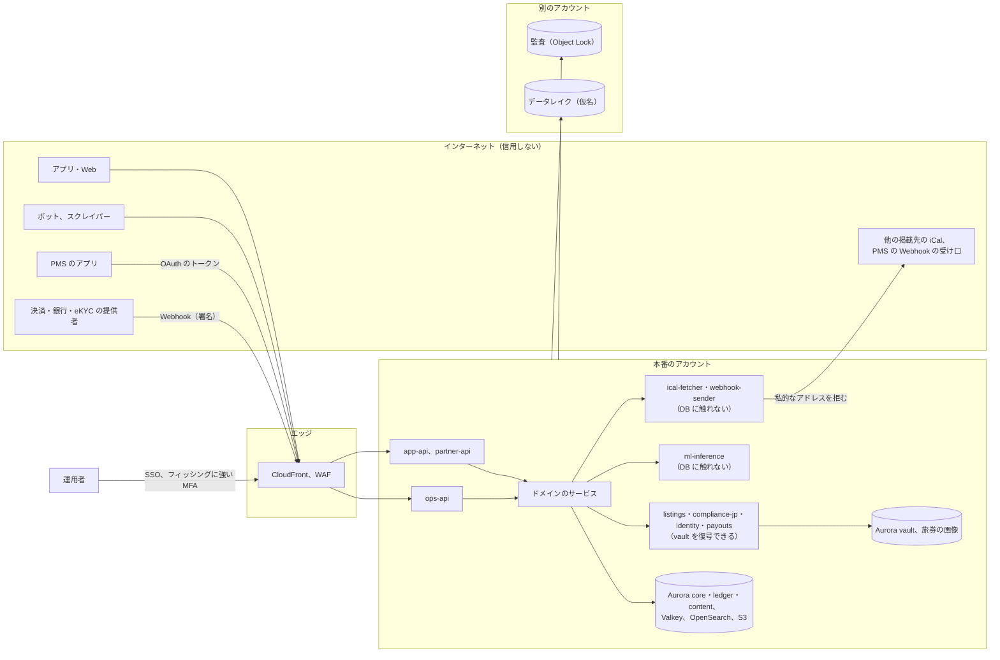
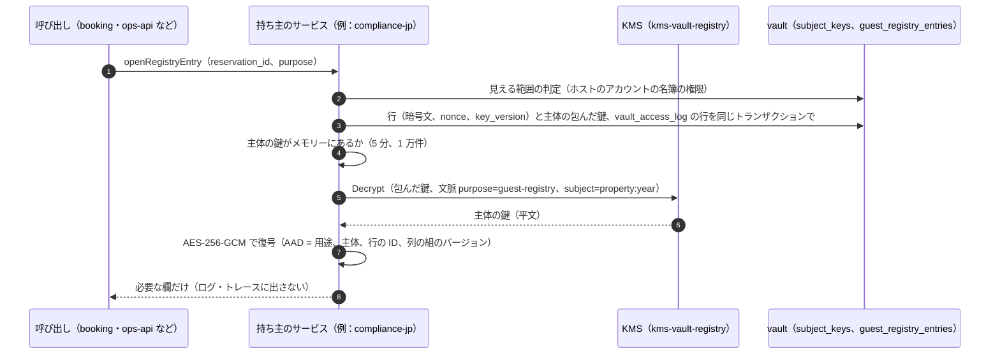

# Security: Airbnb

安全の設計を横断して決める。目標と信頼境界、脅威モデル（送金の乗っ取り、偽のリスティング、位置のスクレイピングと割り出し、正確な住所の漏れ、金庫の旅券のデータ、PMS のアプリの悪用、内部の者のアクセス、外の URL からの SSRF ほか）、データの区分、vault のクラスタの暗号化と鍵の配置、運用者のアクセスと監査、データの寿命と保持（法務の L3・L8）、越境の移転、カード情報の範囲、脆弱性と供給網、インシデントへの対応を扱う。

前提となる決定は次のとおり。

- core・ledger・content・vault の 4 クラスタ。vault は正確な住所と位置、宿泊者名簿、旅券の番号と画像の参照、送金の口座、本人確認の結果を封筒の暗号化で持ち、`listings`・`compliance-jp`・`identity`・`payouts` の 4 つのサービスだけが接続する（[ADR-0001](../decisions/0001-platform-and-stack.md)）
- 本人・ホストのアカウント・予約の 2 者の FORCE RLS、`listingVisible()`・`exactLocationVisible()`、運用者は JIT の権限（[ADR-0007](../decisions/0007-tenancy-host-accounts-and-rls.md)）
- カード番号に触れない（[ADR-0005](../decisions/0005-payments-hold-capture-and-ledger.md)）
- 措置は記録してから効かせる。ML は信号（[ADR-0009](../decisions/0009-trust-and-safety-and-ml-boundary.md)）
- 大事な操作の強い確認と、変更の後の 72 時間の送金の待ち（[ADR-0072](../decisions/0072-sensitive-operations-payout-holds-and-account-deletion.md)）
- 信用しない宛先への egress の経路（[ADR-0076](../decisions/0076-accounts-network-and-egress-with-ssrf-controls.md)）

この文書で決めたことは次の ADR にある。

| ADR | 決定 |
| --- | --- |
| [0073](../decisions/0073-key-layout-and-vault-envelope-encryption.md) | KMS の鍵を用途ごとに分ける（4 クラスタの保存、vault の用途ごとの鍵：位置、名簿、旅券、口座、本人確認、連絡先、PMS の秘密、監査、データレイク、運用の書き出し）。vault の列と旅券の画像は、主体ごとのデータの鍵（AES-256-GCM）を用途の KMS の鍵で包む。主体は、位置はリスティング、名簿と旅券は（届出住宅、年度）、口座はホストのアカウント、本人確認と連絡先は利用者。行ごとに追加の認証データを付け、KMS の暗号化の文脈に用途と主体を入れ、復号の権限は持ち主のサービスの役割だけに置く。人の役割に復号の権限を置かない。消去は主体の鍵の破棄で行い、名簿は年度の鍵の破棄でまとめて消せる。vault の用途の鍵は複数のリージョンの鍵にする |
| [0074](../decisions/0074-operator-access-reveal-and-audit-chain.md) | 運用者は案件に結び付く 2 時間の JIT の権限で見る。正確な住所、名簿の行、旅券の画像、口座の番号、本人確認の結果は「見せる」操作の種類に分け、2 人目の承認、1 回 1 件、運用者ごとの 1 日の上限（20 件、旅券は 5 件）を置く。見せる処理は持ち主のサービスが行い、運用者の端末に平文を残さない。警察・自治体の照会への提出は `legal.respond` の書き出しの手順だけで、法務の責任者の承認を要る。本番の DB への人の接続は 2 人の承認の break-glass の読み出しだけで、vault の復号の権限を持たない。監査の事象は操作と同じトランザクションで書き、流れごとのハッシュの鎖で別のアカウントの S3 Object Lock に写す |
| [0075](../decisions/0075-data-classes-and-retention.md) | データを 10 の区分（秘密、金庫、連絡先、2 者、本人、公開、お金、監査、運用、分析）に分け、区分ごとに置き場所・暗号化・ログに出してよいか・保持の既定を 1 つの表で持つ。保持の値は本システムの既定で、法務の L3・L8 の結論で置き換える。名簿と旅券は作成から 3 年を下限とし、自動の削除は `legal.registry_auto_delete_enabled`（既定 `false`）の後に始め、それまでは期限を過ぎた行を報告だけする。消す処理は `retention-sweeper` が区分ごとに行う。データレイクには金庫・連絡先・2 者の本文を入れず、利用者の ID はレイク専用の鍵の HMAC にする |

ログインと端末は [accounts.md](accounts.md)、PMS のアプリは [host-tools-and-api.md](host-tools-and-api.md)、不正の規則と審査は [trust-and-safety.md](trust-and-safety.md)、位置のずらし方は [location-and-geo.md](location-and-geo.md)、名簿は [regulatory-compliance-japan.md](regulatory-compliance-japan.md)、本人確認と旅券の読み取りは [identity-verification.md](identity-verification.md)、ネットワークと egress は [infrastructure.md](infrastructure.md)、計装の規則は [observability.md](observability.md) にある。

## 1. 目標と前提

| 目標 | 値 | 出どころ |
| --- | --- | --- |
| 正確な住所・位置の秘匿 | 確定した予約のゲスト・ホストのアカウント・権限のある運用者の外に出た事象 0 | NFR-016 |
| 名簿・旅券・口座の分離 | 他の利用者に出た事象 0 | NFR-016 |
| 内部の者の覗き | 理由と監査のない vault の閲覧 0 | [intent.md](../intent.md) の守るべき振る舞い |
| 利用者のデータをログに出さない | ログの走査で、住所・正確な位置・氏名・電話番号・メールアドレス・旅券の番号・口座の番号・カード番号の形の検出 0 | [quality.md](../quality.md) の 2.2.1 節 H |
| 鍵の漏えいの範囲 | 1 つの部品の侵害で復号できる範囲を、その部品の用途に限る | 本システムの既定 |
| 監査 | 運用者の操作の記録の欠け 0、改ざんを検出できる | [quality.md](../quality.md) の 5 節 |
| 脆弱性 | E20 の外部のペンテストで High 以上 0 | [quality.md](../quality.md) の 5 節 E20 |

## 2. 信頼境界

| 境界 | 越えるもの | 守り |
| --- | --- | --- |
| インターネット → `app-api` | 利用者の要求、ボット | WAF、速さの上限、セッション（[accounts.md](accounts.md) の 5 節）、`actor_id` はセッションからだけ |
| PMS → `partner-api` | OAuth のトークン、空室と料金の書き込み | 同意の範囲とリスティングの集合の RLS、速さの上限（[ADR-0068](../decisions/0068-pms-oauth-apps-scopes-and-rate-limits.md)） |
| 提供者 → 本システム | Webhook | 署名の検証、inbox、照会で確かめる（[ADR-0005](../decisions/0005-payments-hold-capture-and-ledger.md)） |
| サービス → vault | 住所・名簿・旅券・口座・本人確認の平文 | vault のクラスタへの接続の許可（4 サービス）、用途ごとの KMS の鍵と暗号化の文脈、読み出しの関数と同じトランザクションの監査（5 節） |
| 本システム → 外の URL | iCal の取得、PMS への Webhook | 信用しない宛先への egress の経路（[infrastructure.md](infrastructure.md) の 2.5 節） |
| 運用者 → 本番 | 人の操作 | JIT の権限、見せる操作の承認、監査（6 節） |
| 本番 → 別のアカウント | 監査、仮名のデータ | 書くだけの権限、Object Lock、仮名（6.4・7.3 節） |
| サービス → `ml-inference` | 特徴の値（予約の泊数、人数、距離の帯など） | 個人のデータ・住所・メッセージの本文を送らない（[infrastructure.md](infrastructure.md) の 5 節） |

## 3. 脅威モデル

| # | 脅威 | 入口 | 影響 | 主な守り |
| --- | --- | --- | --- | --- |
| T1 | 送金の乗っ取り | 一時コードの詐取、SIM の乗っ取り、番号の再利用、外部の ID の乗っ取り、共同ホストの乗っ取り | ホストの売上の詐取 | パスキー、大事な操作の強い確認、72 時間の送金の待ち、送金の口座は `owner` だけ（3.1 節） |
| T2 | 偽のリスティング | 他の物件の写真、存在しない住所、外部への前払いの誘導 | ゲストの金銭の被害と泊まる所の喪失 | ホストの本人確認、公開の審査、写真の知覚ハッシュ、届出番号の確かめ、預かり（3.2 節） |
| T3 | 位置のスクレイピングと割り出し | 地図の範囲の細かい問い合わせ、写真の位置情報、リスティングの文、レビュー | ホストの自宅の特定、空き家の狙い | 索引に `approx_point` だけ、ずらし方の固定、写真の EXIF の除去、速さの上限（3.3 節） |
| T4 | 正確な住所の漏れ | 画面・API・通知・メッセージ・iCal の書き出し・PMS・キャンセルの後の案内・ログ・データレイク | ゲストの安全、ホストの安全 | vault、`exactLocationVisible()`、漏れの経路の表（3.4 節） |
| T5 | 金庫の旅券と名簿のデータ | 名簿の画面、照会の手順、バックアップ、S3 の画像 | 旅券の番号と画像の大量の漏れ（法務の L3・L8） | 用途の鍵、年度の鍵、見せる操作の上限、保持（3.5 節） |
| T6 | PMS のアプリの悪用 | 盗んだトークン、悪い開発者、読み集め、書き込みの連打 | 多くのホストの予約とゲストの名前の持ち出し、空室の破壊 | 審査、短いトークン、同意の範囲、速さの上限、読み出しの量の見張り（3.6 節） |
| T7 | 内部の者のアクセス | 運用の画面、本番の DB、鍵、データレイク | 住所・名簿・旅券の大量の持ち出し | 人に復号の権限なし、見せる操作の承認と上限、監査（3.7 節、6 節） |
| T8 | 外の URL からの SSRF | 取り込む iCal の URL、Webhook の受け口の URL、転送 | 中の機械・メタデータの取得、内部の API の呼び出し | 信用しない宛先への egress の経路（[infrastructure.md](infrastructure.md) の 2.5 節） |
| T9 | カード情報の漏れ | 本システムのサーバー・ログ | 加盟店の義務の違反 | カード番号を受けない（8 節） |
| T10 | 他の利用者の予約・本人のデータの漏れ | RLS の誤り、キャッシュの鍵、エラーの応答 | NFR-016 の違反 | FORCE RLS、2 者の RLS、応答の監査（[ADR-0007](../decisions/0007-tenancy-host-accounts-and-rls.md)） |
| T11 | 供給網 | 依存のライブラリ、ML のモデルの重み、ビルドの経路 | すべて | 依存の許可の一覧、SBOM、署名（9 節） |
| T12 | 仮押さえの連打と予約のボット | 自動の予約、10 分の仮押さえの繰り返し | 日付を塞ぐ、熱い日付の不公平 | 同じゲスト・端末の仮押さえの上限、WAF、T&S の規則（[ADR-0004](../decisions/0004-booking-state-machine-and-holds.md)、[runbooks/](../runbooks/README.md) の 5.1 節） |
| T13 | メッセージでの詐欺と外への誘導 | 予約の前のメッセージ、偽の運用の連絡 | 前払いの詐欺、乗っ取り | 連絡先の絞り込み、リンクを押せる形にしない、運用の印（[messaging.md](messaging.md)） |

### 3.1 T1：送金の乗っ取り

- 乗っ取りの価値は、送金の束が実際に送られたときにだけ現金になる。守りを「送金の前」に置く：大事な操作の強い確認と 72 時間の待ち、待ちの始まりの全経路の通知、「これは私ではない」（[ADR-0072](../decisions/0072-sensitive-operations-payout-holds-and-account-deletion.md)）。
- 送金の口座、共同ホストの追加、PMS の許可は `owner` だけ（[ADR-0007](../decisions/0007-tenancy-host-accounts-and-rls.md)）。共同ホストを乗っ取っても、送金の行き先は変えられない。
- パスキーのない `owner` は、送金の口座の登録でパスキーを登録する。パスキーのあるアカウントは、一時コードだけでは送金の口座を変えられない。
- 新しい口座への最初の送金は、口座の名義の照合を通す（銀行の API の能力は**未検証**）。同じ口座の HMAC が多くのホストのアカウントにあれば T&S の兆しにする。

### 3.2 T2：偽のリスティング

- ホストの本人確認を公開の前に必須にする（[identity-verification.md](identity-verification.md)）。日本の物件は届出番号・許可番号と確かめの書類（[ADR-0006](../decisions/0006-regulatory-night-cap-enforcement.md)）。
- 写真の知覚ハッシュの一致（他のリスティング、確かめた偽のリスティングの集まり）、住所の検索の提供者での住所の確かめ、禁止の語、外の連絡先の検出を公開の審査で行う（[listings-and-content.md](listings-and-content.md)、[trust-and-safety.md](trust-and-safety.md)）。
- 代金はチェックインの予定の時刻 + 24 時間まで預かる。偽のリスティングの被害は、チェックインの前に見つければ全額の返金で戻せる（[ADR-0005](../decisions/0005-payments-hold-capture-and-ledger.md)）。新しいホストの最初の 3 件は、各予約のチェックアウトの後 24 時間まで送金を待たせる（[ADR-0059](../decisions/0059-fake-listing-signals-and-new-host-holds.md)、[ledger-and-payouts.md](ledger-and-payouts.md) の 7.3 節）。

### 3.3 T3：位置のスクレイピングと割り出し

| 経路 | 守り |
| --- | --- |
| 地図・検索 | 索引に `approx_point` だけ。ずらした点はリスティングの ID と秘密の値で決まり、作り直さない（[architecture/README.md](README.md) の 1.3 節 A）。細かい範囲を何度問うても正確な位置に近づかない（[quality.md](../quality.md) の 2.2.1 節 E） |
| 検索の量 | WAF の Bot Control、IP ごと 1 分 120 件、ログインの利用者ごと 1 分 120 件（初期の値）。地図の範囲の検索は 1 ページ 18 件と地図の点だけ |
| 写真 | `media-processor` が EXIF の GPS を消す。元の写真は配らない |
| 文 | 説明・ハウスルール・自動の文の番地と部屋の番号の検出（[listings-and-content.md](listings-and-content.md)）。予約の前のメッセージの住所の絞り込み（[messaging.md](messaging.md)） |
| ずらす秘密の値 | `listings` の役割だけが使える秘密（KMS で守る）。漏れると、ずらし方を逆に計算できる。替えると全部の点が変わり、古い点と新しい点の組で推せるので、替えるのは漏えいの時だけにし、全部の点と索引を作り直す（[location-and-geo.md](location-and-geo.md) の 5 節） |

- 値と検査の詳細は [location-and-geo.md](location-and-geo.md) が持つ。この文書は経路と鍵を持つ。

### 3.4 T4：正確な住所の漏れ

- 正確な住所と位置は vault の `exact_locations` にだけ置く。core・OpenSearch・Valkey・データレイク・通知の本文に置かない。
- 読み出しは `listings` の `readExactLocation(viewer, listing_id, purpose)` の 1 つの関数（[location-and-geo.md](location-and-geo.md) の 4.5 節、[ADR-0016](../decisions/0016-geocoding-adapter-and-confirmed-pin.md)）で、`exactLocationVisible()`（[ADR-0007](../decisions/0007-tenancy-host-accounts-and-rls.md)）で判定し、同じトランザクションで `vault_access_log` を書く。目的のコードは `checkin_instructions`・`host_view`・`ops_reveal`・`legal_request`。
- チェックインの案内は、予約が `cancelled` になった時点で見えなくなる。アプリの端末の中の写しも、次の同期で消す（[booking-and-holds.md](booking-and-holds.md)）。
- 漏れの経路の表（[quality.md](../quality.md) の 2.2.1 節 H）を全経路で回す。iCal の書き出しと PMS の Webhook の本文は住所を含まない（[host-tools-and-api.md](host-tools-and-api.md) の 7.1 節）。

### 3.5 T5：金庫の旅券と名簿のデータ

- 名簿の項目（氏名、住所、職業、国籍、旅券の番号）は vault の `guest_registry_entries` に、主体（届出住宅、年度）の鍵で暗号化して置く。旅券の画像は S3 の `registry` のバケットに、同じ主体の鍵で暗号化した本文を置く（サーバー側の暗号化に加えて、アプリが包む）。
- 読めるのは、ホストのアカウントの名簿の権限（`owner`・`full` と、`registry` の権限を与えた共同ホスト。[host-tools-and-api.md](host-tools-and-api.md) の DT-HST-001、[regulatory-compliance-japan.md](regulatory-compliance-japan.md) の 8 節）の画面と、法令の照会の手順（6.2 節の `legal.respond`）だけ。画像は画面に透かしを入れて出し、ダウンロードの経路を持たない（照会の手順を除く）。
- 名簿の画面は 1 回の表示で 1 予約の行だけを出す。ホストのアカウントごとの 1 日の表示の数を見張り、普段の 5 倍を超えたら T&S の兆しにする（乗っ取ったホストのアカウントからの名簿の持ち出し）。
- 保持は作成から 3 年を下限にする（7 節）。年度の鍵の破棄で、その年度の行と画像をまとめて読めなくできる。

### 3.6 T6：PMS のアプリの悪用

- 審査を通したアプリだけが本番のホストに接続できる。トークンは 1 時間、リフレッシュトークンの再使用で一式を取り消す（[ADR-0068](../decisions/0068-pms-oauth-apps-scopes-and-rate-limits.md)）。
- 範囲は、ゲストの連絡先・本人確認・旅券を出さない。名簿の範囲は法務の結論まで無効（L3・L8）。
- アプリごとの読み出しの量（予約の読み出しの数 ÷ 同意の数）と、同意の急な増え方を見張る（[observability.md](observability.md)）。普段の 5 倍でチケット、アプリの停止は `ops.partner_api_enabled.<app>`。
- 空室の書き込みの悪用（大量の開け閉め）は、アプリの行だけに効き（[ADR-0069](../decisions/0069-pms-availability-and-price-push-and-bulk-operations.md)）、大きな解放はホストに知らせる。

### 3.7 T7：内部の者のアクセス

- 人の IAM の役割（Identity Center の権限のセット）に、vault の用途の鍵（`kms-vault-*`）と `kms-contact-pii` の `kms:Decrypt` を置かない。plan のポリシー検査で拒む（[infrastructure.md](infrastructure.md) の 6 節）。
- 本番の DB に人が入るのは break-glass だけで、vault の列は暗号文しか見えない。vault のクラスタは break-glass の対象にも入れない。
- 運用の画面の「見せる」操作は、案件・理由・2 人目の承認・1 日の上限・監査を通る（6 節）。運用者ごとの見せた数を毎週見る。
- 持ち主のサービスのタスクの中に、平文の主体の鍵が 5 分ある。タスクの侵害で、その間に扱った主体のデータが読める。本番のタスクに ECS Exec を許さない。

## 4. データの区分

ADR-0075。詳しい保持の値は 7 節。

| 区分 | 例 | 置き場所 | 暗号化 | ログ・トレースに出してよいか |
| --- | --- | --- | --- | --- |
| S 秘密 | KMS で包んだ鍵、提供者の API の鍵、Webhook の秘密、HMAC の鍵、ずらす秘密の値 | Secrets Manager、包んだ形で DB | KMS | 出さない |
| V 金庫 | 正確な住所と位置、名簿の項目、旅券の番号と画像、送金の口座の番号、本人確認の結果、事業者のホストの所在地 | vault、S3 の `registry` | 封筒の暗号化（5.3 節）＋保存時の暗号化 | 出さない（ID だけ） |
| C 連絡先 | メールアドレス、電話番号 | core（`users` の `*_ct`） | 封筒の暗号化（`kms-contact-pii`） | 出さない（ID だけ） |
| P 2 者 | 予約、メッセージ、チェックインの案内（住所の参照を除く）、損害の請求、レビューの下書き | core、content | 保存時の暗号化 | ID・状態・理由のコードだけ |
| O 本人 | 保存した検索、閲覧の履歴、通知、セッション、端末、設定 | core、content | 保存時の暗号化 | ID と数だけ。検索の語は出さない |
| U 公開 | 公開のリスティング（ずらした位置）、写真、公開したレビュー、公開のプロフィール | core、content、S3、OpenSearch | 保存時の暗号化 | ID だけ |
| F お金 | 仕訳、残高、送金、照合の結果 | ledger | 保存時の暗号化 | ID と金額 |
| A 監査 | 監査の事象、措置の記録、vault の読み出しの記録 | 各クラスタ、log-archive の S3 | 保存時の暗号化、Object Lock | — |
| M 運用 | ログ、メトリクス、トレース | CloudWatch、AMP、X-Ray | 保存時の暗号化 | — |
| L 分析 | 仮名にした事象 | data のアカウントの S3 | `kms-lake` | — |

## 5. 暗号化と鍵（ADR-0073）

### 5.1 転送中

- 外：TLS 1.2 以上、HSTS（`includeSubDomains`）。アプリは証明書の公開鍵の固定をしない（交換の事故を避ける）。
- 中：サービスの間は TLS（ACM の私的な CA）。Aurora は `rds.force_ssl = 1`。Valkey と OpenSearch も TLS。
- 銀行：TLS と、相手が求めれば mTLS とクライアントの証明書（[infrastructure.md](infrastructure.md) の 2.4 節）。

### 5.2 KMS の鍵の配置

| 鍵 | 用途 | `kms:Decrypt` を持つ役割 | 複数のリージョン |
| --- | --- | --- | --- |
| `kms-core`、`kms-ledger`、`kms-content`、`kms-vault-storage` | Aurora の保存時の暗号化、スナップショット | RDS（サービスの権限） | 大阪に別の鍵 |
| `kms-vault-location` | 正確な住所と位置の主体の鍵を包む | `listings` のタスクの役割だけ | 複数のリージョンの鍵 |
| `kms-vault-registry` | 名簿の項目と旅券の画像の主体の鍵を包む | `compliance-jp` のタスクの役割だけ | 同上 |
| `kms-vault-kyc` | 本人確認の結果と確認した属性 | `identity` の本人確認の Worker だけ | 同上 |
| `kms-vault-bank` | 送金の口座の番号、事業者のホストの所在地 | `payouts`（口座）、`identity`（所在地）。暗号化の文脈で分ける | 同上 |
| `kms-contact-pii` | メールアドレス・電話番号の列の鍵 | `identity`、`notifier` の送信の役割 | 同上 |
| `kms-pms-secrets` | Webhook の署名の秘密、PMS の `client_secret` の照合の鍵 | `partner-api`、`webhook-sender` | 同上 |
| `kms-audit` | 監査の写し（log-archive） | 監査の照合のジョブ（読みだけ） | 同上 |
| `kms-lake` | データレイク | data のアカウントの分析の役割 | 東京だけ |
| `kms-secrets` | Secrets Manager | 各サービス（自分の秘密だけ） | 同上 |
| `kms-ops-exports` | 法令の照会への回答の書き出し | 書き出しのジョブ | 東京だけ |

- 鍵の政策で、`kms:Decrypt` に暗号化の文脈の条件（`kms:EncryptionContext:purpose`）を付ける。`payouts` の役割でも、`purpose = payout-account` 以外の文脈では `kms-vault-bank` を使えない。
- 年 1 回の自動の交換を有効にする。鍵の削除の予約と無効化は SCP で break-glass の外に禁止する（[infrastructure.md](infrastructure.md) の 1 節）。
- 写真は公開のデータなので S3 の既定の暗号化（SSE-S3）。位置情報を消す前の元の写真は `kms-core` の SSE-KMS で、変換の後 24 時間で消す（[listings-and-content.md](listings-and-content.md)）。

### 5.3 vault の封筒の暗号化

| 要素 | 形 |
| --- | --- |
| 主体の鍵 | 用途ごと・主体ごとに 1 つの 256 ビットの鍵。`subject_keys` に包んだ形で置く（`purpose`、`subject_type`、`subject_id`、`key_version`、`wrapped_key`、`kms_key_arn`、`created_at`、`destroyed_at`） |
| 主体 | 位置：リスティング。名簿と旅券：（届出住宅、年度）。口座：ホストのアカウント。本人確認・連絡先：利用者 |
| 行の暗号 | AES-256-GCM。nonce は行ごとの 96 ビットの乱数。暗号文・nonce・`key_version` を同じ行に置く |
| 追加の認証データ | 用途、主体、行の ID、列の組のバージョン。行を別の主体の行へ写しても復号できない |
| 旅券の画像 | 画像ごとのデータの鍵で暗号化し、そのデータの鍵を主体の鍵で包んで、S3 のオブジェクトの付帯の情報に置く。S3 のバケットは `kms-vault-storage` の SSE-KMS も掛ける。署名つきの URL を出さない（画像は `compliance-jp` が読んで、透かしを入れた画面の画像として返す） |
| 平文の鍵のキャッシュ | 持ち主のサービスのタスクのメモリーだけ。5 分、1 万件。ディスク・Valkey に置かない |

- **消去**：主体の鍵の行を消す（`destroyed_at` を残す）。名簿は（届出住宅、年度）の鍵を、保持の期限（7 節）の後に破棄すれば、その年度の行と画像がまとめて読めなくなる。リスティングの削除は位置の鍵の破棄。Aurora の自動のバックアップ（35 日）に包んだ鍵が残るので、完全に読めなくなるのはバックアップの保持の後である。
- **大阪**：用途の鍵は複数のリージョンの鍵にし、大阪の写しの鍵で同じ包んだ鍵を開ける。大阪の持ち主のサービスの役割にだけ復号の権限を置く。

### 5.4 引くための HMAC

| 列 | 鍵 | 用途 |
| --- | --- | --- |
| `email_hmac`、`phone_hmac` | `identity` の HMAC の鍵 | 1 つの宛先に 1 アカウント、再登録の制限 |
| `bank_account_hmac` | `payouts` の HMAC の鍵 | 同じ口座の多くのホストのアカウントの検出 |
| `passport_number_hmac` | `compliance-jp` の HMAC の鍵 | 同じ旅券の番号の多くのアカウントの検出（T&S の兆し。使い方は法務の確認待ち：L3・L8） |
| `registration_number`（届出番号） | なし（公開の値。[ADR-0006](../decisions/0006-regulatory-night-cap-enforcement.md)） | — |
| レイクの利用者の ID | `kms-lake` で包んだレイクの鍵（年ごとに替える） | 分析の仮名（7.3 節） |

- HMAC の鍵は Secrets Manager に置き、交換は新旧の 2 つで両方を引く期間を置く。

### 5.5 秘密

- 提供者・銀行・SMS・APNs・FCM の鍵は Secrets Manager。提供者が許す範囲で 90 日で回す。
- アプリの中に秘密を置かない。決済の提供者の公開の鍵だけを置く。

## 6. 運用者のアクセスと監査（ADR-0074）

### 6.1 権限の種類

| 種類 | 中身 | 持てる役 | 承認 |
| --- | --- | --- | --- |
| `case.view` | 案件の予約・リスティング・措置・送金の状態 | CS、T&S、安全、財務 | 案件の担当で自動 |
| `case.view_messages` | 通報・安全の事故の予約のメッセージ | CS、T&S、安全 | 案件の担当で自動。範囲は**法務の確認待ち：L9** |
| `vault.reveal_location` | 1 件の正確な住所と位置 | CS のリーダー、安全の担当 | 2 人目の承認。安全の事故の緊急の案件は事後の承認（30 分以内） |
| `vault.reveal_registry` | 1 予約の名簿の項目 | 法令の対応の担当 | 2 人目の承認 |
| `vault.reveal_passport` | 1 枚の旅券の画像 | 法令の対応の担当 | 2 人目の承認。1 日 5 件 |
| `vault.reveal_bank` | 口座の番号の全桁 | 財務 | 2 人目の承認。通常は下 4 桁だけ |
| `kyc.view` | 本人確認の結果と確認した属性 | 本人確認の担当 | 2 人目の承認 |
| `ledger.adjust` | 打ち消しの仕訳、補償の仕訳 | 財務 | 2 人の承認（[runbooks/](../runbooks/README.md) の 4 節） |
| `legal.respond` | 警察・自治体・観光庁の照会、開示の請求への回答の書き出し | 法務の担当 | 法務の責任者の承認（法務の確認待ち：L1・L3・L14） |

- JIT の権限は `ops-api` が案件に結び付けて 2 時間で発行する。理由のコードと短い自由文を求める。自由文は監査の事象の中に暗号化して置き、アプリのログに出さない。
- 運用者のログインは IAM Identity Center の SSO と、フィッシングに強い MFA（セキュリティキーかパスキー）。運用の画面はエッジで社の出口の IP に絞る（[infrastructure.md](infrastructure.md) の 3 節）。

### 6.2 見せる操作と照会への提出

- 見せる操作は、`ops-api` が持ち主のサービス（`listings.revealLocation`、`compliance-jp.revealRegistry`、`compliance-jp.revealPassportImage`、`payouts.revealBankAccount`、`identity.viewKyc`）を、運用者の権限の証（署名つき、5 分）とともに呼ぶ。持ち主のサービスが権限の証を確かめ、1 件だけ復号して返す。
- 運用の画面は、見せた値を運用者の ID の透かしを入れて出し、コピーの操作を記録する。閉じると消す（`Cache-Control: no-store`）。
- 1 回の操作で 1 件。運用者ごとに 1 日 20 件（旅券は 5 件）。上限を超える依頼（照会の多くの件数）は `legal.respond` の書き出しを通す。
- **照会への提出**：警察・自治体の宿泊者名簿の照会、取引デジタルプラットフォーム消費者保護法の開示の請求は、`legal.respond` の権限で、対象（届出住宅と期間、または予約）を決めた書き出しのジョブを作る。書き出しは `kms-ops-exports` で暗号化し、7 日で消える署名つきの URL で法務の担当に渡す。どの照会に応じるか、本人への知らせの要否は**法務の確認待ち：L1・L3・L14**（`legal-request.md` の手順。[runbooks/](../runbooks/README.md) の 4 節）。

### 6.3 本番の DB と基盤への人のアクセス

- 平常は、人は本番の DB・ECS のタスク・S3 に入らない。
- break-glass：Identity Center の別の権限のセット（core・ledger・content の読み出しの DB の役割と、ECS のタスクの一覧だけ）を、2 人の承認で 4 時間だけ付ける。SSM Session Manager の記録を log-archive に残す。vault のクラスタと vault の用途の鍵は break-glass にも含めない。
- 書き込みの修正は、レビューを通したデータの修正のスクリプト（冪等、案件の ID 付き）を CI から流す。`stay_claims`・`regulated_nights` はスクリプトでも持ち主の関数を通す（排他の制約と CHECK を外さない）。台帳は打ち消しの仕訳だけ（[ADR-0005](../decisions/0005-payments-hold-capture-and-ledger.md)）。

### 6.4 監査の事象

- 監査の事象は、操作と同じトランザクションで、その表のあるクラスタの `audit_events` に書く（`ops-api` の操作、見せる操作、権限の発行、措置、`legal.*` の変更、手の仕訳、break-glass、PMS のアプリの承認と停止）。vault の読み出しは vault の `vault_access_log` に書く（利用者の操作の経路も含めて全件）。
- `relay` が `audit_events` と `vault_access_log` を読み、流れ（クラスタ × 種類）ごとに `prev_hash` の鎖を付けて、log-archive のアカウントの S3（Object Lock のコンプライアンスのモード）に 5 分ごとに書く。
- 日次の照合のジョブが、鎖の続きと、DB と S3 の件数を照らし、欠けと改ざんを呼び出しにする。
- 保持の既定は 7 年（本システムの値。**法務の確認待ち：L8**）。

## 7. データの寿命（ADR-0075）

### 7.1 保持の既定

どの値も本システムの既定で、**法務の確認待ち（L8。名簿と旅券は L3、本人確認は L3・L8、会計は L4・L5）**。結論で置き換える。

| データ | 区分 | 既定の保持 | 消し方 |
| --- | --- | --- | --- |
| 正確な住所と位置 | V | リスティングの削除から 1 年（予約の後の安全の事故と損害の請求の調べのため） | 位置の主体の鍵の破棄 |
| 名簿の項目と旅券の画像 | V | 作成から 3 年を下限（住宅宿泊事業者の保存の義務。観光庁の [住宅宿泊事業者の義務](https://www.mlit.go.jp/kankocho/minpaku/business/host/index.html)）。上限と、旅館業・特区民泊の扱いは**法務の確認待ち：L3** | 年度の鍵の破棄。自動の削除は `legal.registry_auto_delete_enabled`（既定 `false`）の後。それまでは期限を過ぎた年度を報告する |
| 送金の口座の番号 | V | 口座の削除・退会まで。変更の前の口座は 1 年（「これは私ではない」と照合のため） | 鍵の破棄 |
| 本人確認の結果と確認した属性 | V | **法務の確認待ち：L3・L8**。結論まで消さない。書類と顔の画像の扱いは [identity-verification.md](identity-verification.md) | `legal.kyc_*` の期間の後 |
| メールアドレス・電話番号の平文 | C | 退会まで | 鍵の破棄 |
| 連絡先の HMAC（退会の後） | C | 1 年（`suspended` は T&S の規則の期間） | 行の削除 |
| 予約のメッセージ | P | チェックアウト（予約のないものは最後のメッセージ）から 3 年 | 月の区切りで落とす |
| 予約、予約の事象、損害の請求 | P | 10 年（お金の記録と同じ） | 仮名にして残す |
| 保存した検索、閲覧の履歴 | O | 90 日 | 日次の削除 |
| 通知 | O | 90 日 | 同上 |
| セッション、端末 | O | 失効から 1 年 | 行の削除 |
| 公開のリスティングと写真（削除の後） | U | 削除から 90 日 | 索引から外し、写真を消す |
| 仕訳、送金、照合 | F | 10 年 | 残す（期間の後に別の保管へ） |
| 監査の事象、措置の記録、vault の読み出しの記録 | A | 7 年 | Object Lock の期限 |
| アプリのログ、トレース | M | 30 日（CloudWatch）、その後 1 年（S3）。トレースは 30 日 | ライフサイクル |
| データレイクの仮名の事象 | L | 2 年 | パーティションの削除 |

### 7.2 消す処理

- `retention-sweeper` のジョブが区分ごとの規則を日次で当てる。大きな表（`messages`、`notifications`、`vault_access_log`）は区切り（PostgreSQL の宣言の区切り）にし、区切りを落とす。
- 消した件数と、期限を過ぎて残る件数を指標にする（[observability.md](observability.md)）。期限の 7 日を過ぎた残りはチケット。
- 法令の照会・紛争・損害の請求・安全の事故・措置の対象の行は「保全」の印（`legal_holds`）を付け、印の間は消さない。印の付け外しは `legal.respond` の権限と監査。

### 7.3 データレイク

- outbox の事象の写しを、`data-lake-baseline` の処理で、金庫（V）・連絡先（C）の欄と 2 者（P）の本文を落とし、利用者・ホストの ID をレイクの鍵の HMAC に置き換え、位置は市区町村の単位に丸めてから入れる。
- 検索の語と地図の範囲は、利用者の HMAC と組で 1 年だけ置き、検索の改善と需要の集計だけに使う。
- レイクから元の ID へ戻す表は持たない。退会した利用者の事象は、レイクの鍵の年の替わりで結び付かなくなる。

### 7.4 越境の移転

- データは東京と大阪に置く（[intent.md](../intent.md) の制約）。海外のゲストのデータも同じ。
- 越境になる経路：日本の外に置く PMS のアプリへの提供（[host-tools-and-api.md](host-tools-and-api.md) の 5.1 節）、外部の提供者（決済、eKYC、翻訳、SMS、メール）への送信、日本の外のホスト（MVP の後）。提供者ごとの所在と、外国にある第三者への提供（個人情報保護法第 28 条）の整理は**法務の確認待ち：L8**。結論まで、日本の外の PMS にはゲストの個人のデータを出さない（`legal.pms_cross_border_guest_data = deny`）。
- 翻訳の提供者へ送る文（リスティングの説明、メッセージ）は、送る前に連絡先の形を伏せる（[messaging.md](messaging.md)）。

## 8. カード情報の範囲

- カード番号は、決済の提供者のホストした入力部品（アプリの SDK、Web の iframe）で受ける。本システムのサーバー・ログ・DB・トレースに、カード番号とセキュリティコードが入る経路を作らない（[ADR-0005](../decisions/0005-payments-hold-capture-and-ledger.md)）。
- Web の予約の確認の画面は提供者の iframe を読むので、スクリプトの改ざんの守り（CSP、Subresource Integrity、第三者のスクリプトを置かない）を持つ。PCI DSS の自己の評価の種類は提供者の部品の形で変わるので、E11 の提供者の選定で確かめる（**未検証**）。
- ログの走査で、カード番号の形（Luhn の検査に通る 13〜19 桁）を検出したら呼び出しにする。

## 9. 脆弱性の管理と供給網

| 対象 | 方法 | 頻度 |
| --- | --- | --- |
| 依存（npm、PyPI） | 許可の一覧、固定、SBOM、既知の脆弱性の走査。本家のコード・SDK を禁止（[ADR-0001](../decisions/0001-platform-and-stack.md)） | PR、毎日 |
| コンテナのイメージ | Inspector の走査、署名（[delivery.md](delivery.md) の 3 節） | ビルド、毎日 |
| ML のモデルの重み | 出どころの一覧（本家と関係のない汎用のモデルと自前の学習だけ）、ハッシュと署名 | モデルを出すたび |
| iCal の解析器 | 曖昧な入力の試験（[quality.md](../quality.md) の 2.2.1 節 G）、解析を `ical-fetcher` の中に閉じる（[infrastructure.md](infrastructure.md) の 2.5 節） | PR、夜間 |
| アプリ（iOS・Android） | 静的の検査、依存の走査。秘密を置かない | リリースの列車ごと |
| 外部のペンテスト | 予約、台帳、vault、位置の割り出し、PMS の API、運用の画面、SSRF | E20 と年 1 回 |
| 脆弱性の報告の窓口 | `security.txt` と窓口 | 常時 |

- High 以上の脆弱性は 7 日、Critical は 48 時間で直す（本システムの値）。

## 10. インシデントへの対応

- 種類：住所・名簿・旅券の漏れ（SEV1 の候補）、乗っ取りの波、PMS のアプリの悪用、鍵の漏えいの疑い、内部の者の不正、SSRF の兆し（信用しない宛先への egress の拒否の急増）。
- 漏れの疑いは `privacy-leak-response.md`（計画。それまでは [incident-response.md](../runbooks/incident-response.md)。[runbooks/](../runbooks/README.md) の 4 節）で、経路を止め、範囲を監査の事象と `vault_access_log` と漏れの経路の表で調べる。漏えい等の報告と本人への通知の要否と期限は法務の判断（**法務の確認待ち：L8**）。
- PMS のアプリの悪用の疑い：`ops.partner_api_enabled.<app>` で止め、同意を取り消すかを T&S とセキュリティの担当が決める。取り消したアプリの `api_block` の行は残し、ホストに知らせる。
- 鍵の漏えいの疑い：持ち主のサービスの役割の資格を失効させ、タスクを入れ替える。用途の鍵の新しいバージョンで主体の鍵を包み直す。

## 11. data-model への項目

| 置き場所 | 中身 | 鍵・索引 | 節 |
| --- | --- | --- | --- |
| vault：`subject_keys` | `purpose`（`location`・`registry`・`kyc`・`bank`・`business_address`）、`subject_type`、`subject_id`、`key_version`、`wrapped_key`、`kms_key_arn`、`created_at`、`destroyed_at`。持ち主のサービスの役割ごとの許可 | `(purpose, subject_type, subject_id, key_version)` | 5.3 |
| core：`subject_keys` | 同上（`purpose = contact`。`identity`・`notifier`） | 同上 | 5.3 |
| vault：`exact_locations`（[location-and-geo.md](location-and-geo.md) が持つ）、`guest_registry_entries`（[regulatory-compliance-japan.md](regulatory-compliance-japan.md) が持つ）、`payout_accounts`（[ledger-and-payouts.md](ledger-and-payouts.md) が持つ）、`identity_verifications`（[identity-verification.md](identity-verification.md) が持つ） | 暗号の列 `ciphertext`、`nonce`、`key_version`、`aad_version` は 5.3 節の形 | — | 5.3 |
| vault：`vault_access_log` | 読み出しの主体（利用者・運用者・サービス）、用途、目的のコード、対象、案件、時刻。月の区切り | `(target_type, target_id, created_at)` | 3.4、6.4 |
| S3：`registry` | 旅券の画像（主体の鍵で包んだ本文、`kms-vault-storage` の SSE-KMS）。Object Lock なし | `<property_id>/<fiscal_year>/<entry_id>/<n>` | 5.3 |
| 各クラスタ：`audit_events` | `id`、`stream`、`actor`、`action`、`target`、`case_id`、`reason_code`、`reason_ct`、`grant_id`、`created_at` | `(stream, id)` | 6.4 |
| core：`ops_grants`、`ops_reveals` | JIT の権限（運用者、種類、案件、承認者、期限、取り消し）、見せた記録（数の上限の判定） | `(operator_id, expires_at)`、`(operator_id, created_at)` | 6.1、6.2 |
| core：`legal_requests`、`legal_exports` | 照会・開示の請求（種類、相手の機関、対象、承認者、状態）、書き出し（S3 の鍵、期限） | `(status, created_at)` | 6.2 |
| 各クラスタ：`legal_holds` | 保全の印：対象、理由、付けた人、期限 | `(target_type, target_id)` | 7.2 |
| 各クラスタ：`audit_chain_heads` | 監査の鎖の頭 | `stream` | 6.4 |
| S3（log-archive） | `audit/<stream>/<yyyy>/<mm>/<dd>/` の鎖つきの束（Object Lock） | — | 6.4 |
| Secrets Manager | HMAC の鍵（`email`、`phone`、`bank_account`、`passport_number`）、ずらす秘密の値、レイクの鍵 | — | 3.3、5.4 |
| AppConfig | `legal.registry_auto_delete_enabled`、`legal.guest_registry_retention_days`、`legal.kyc_*`、`legal.pms_cross_border_guest_data` | — | 7 |

## 12. テストと性質

| ID（草案） | 内容 | テスト |
| --- | --- | --- |
| PROP-SEC-001 | vault の行を別の主体・別の行へ写した暗号文は復号できない（追加の認証データ） | 性質ベース |
| PROP-SEC-002 | 主体の鍵を破棄した行と旅券の画像は、どの役割でも復号できない | 結合（LocalStack の KMS） |
| PROP-SEC-003 | 監査の鎖：任意の事象の列で、1 件の欠け・入れ替え・書き換えを日次の照合が検出する | 性質ベース |
| PROP-SEC-004 | vault の読み出しの関数を通るすべての読み出しに、同じトランザクションの `vault_access_log` の行がある（読み出しが成功し、記録がない時点はない） | 性質ベース（障害の注入） |
| — | IAM の検査：`kms-vault-*`・`kms-contact-pii` の `kms:Decrypt` が持ち主のサービスの役割にだけあり、人の権限のセットにない。vault のクラスタへの接続が 4 サービスのセキュリティグループだけ | plan のポリシー検査（CI） |
| — | 見せる操作：承認のない依頼、期限の切れた権限の証、別の案件の対象、21 件目（旅券は 6 件目）は拒む | 表駆動 |
| — | 漏れの経路の表の全行（[quality.md](../quality.md) の 2.2.1 節 H） | 結合・E2E |
| — | ログの走査：住所・正確な位置・氏名・電話番号・メール・旅券の番号・口座・カード番号の形の検出 0（合成の利用者で全経路を流す） | 夜間 |
| — | 保持：期限を過ぎた行が `retention-sweeper` の 1 回の後に残らない（保全の印と、`legal.registry_auto_delete_enabled = false` の名簿を除く） | 仮想の時計 |
| — | E20 の外部のペンテスト | 予約、台帳、vault、位置の割り出し、PMS の API、運用の画面、SSRF |

## 13. Story の候補

| Epic | Story | 中身 |
| --- | --- | --- |
| E1 | `vault-envelope-encryption` | 5.2・5.3 節（ADR-0073）。鍵の政策、暗号化の文脈の条件、plan の検査 |
| E1 | `audit-log-and-ops-shell` | 6 節（ADR-0074）。監査の鎖、JIT の権限 |
| E1 | `data-lake-baseline` | 7.3 節 |
| E4 | `address-and-exact-location`（[location-and-geo.md](location-and-geo.md) と共同） | 3.4 節、位置の主体の鍵 |
| E18 | `guest-registry`（[regulatory-compliance-japan.md](regulatory-compliance-japan.md) と共同） | 3.5 節、年度の鍵、旅券の画像。法務：L3 |
| E16 | `ops-reveal-flows` | 6.2 節。見せる操作の承認と上限 |
| E16 | `disclosure-and-takedown-requests`（[trust-and-safety.md](trust-and-safety.md) と共同） | 6.2 節の `legal.respond`。法務：L1・L3・L14 |
| E2 | `account-deletion`（[accounts.md](accounts.md) と共同） | 鍵の破棄 |
| E20 | `retention-sweeper` | 7.2 節（ADR-0075）。値は法務：L3・L8 |
| E20 | `pentest-external` | 9 節 |

## 14. 未解決の問い

### 決定（2026-10-10、既定案）

- **鍵**：用途ごとの KMS の鍵、主体ごとのデータの鍵、名簿は（届出住宅、年度）の鍵、暗号化の文脈の条件、人に復号の権限なし、複数のリージョンの鍵（ADR-0073）。
- **旅券の画像**：S3 に主体の鍵で包んだ本文、署名つきの URL を出さない、透かしの画面（ADR-0073）。
- **運用者**：案件の JIT 2 時間、見せる操作の 2 人目の承認と 1 日 20 件（旅券 5 件）、照会は `legal.respond` の書き出しだけ、break-glass は読み出しだけで vault を含めない（ADR-0074）。
- **監査**：同じトランザクションで書き、ハッシュの鎖で Object Lock へ。vault の読み出しは全件記録（ADR-0074）。
- **区分と保持**：10 区分、名簿は 3 年を下限、自動の削除は法務の結論の後（ADR-0075）。

### 持ち越し

| 問い | いつ・どう決めるか |
| --- | --- |
| 名簿と旅券の画像の保持の上限、本システムが名簿を持つことの整理、照会への提出 | **法務の確認待ち：L3** |
| 保持の期間（7.1 節の全行）、退会の後の扱い、漏えい等の報告、越境の移転 | **法務の確認待ち：L8** |
| 運用者がメッセージの本文を見る条件 | **法務の確認待ち：L9** |
| 開示の請求への応じ方 | **法務の確認待ち：L14** |
| 旅券の番号の HMAC の T&S での使い方 | **法務の確認待ち：L3・L8** |
| 口座の名義の照合の API | E12 の提携銀行の選定（**未検証**） |
| PCI DSS の自己の評価の種類 | E11 の提供者の選定（**未検証**） |

## 出典

いずれも 2026-10-10 に確認。

- 観光庁, [住宅宿泊事業者の義務](https://www.mlit.go.jp/kankocho/minpaku/business/host/index.html)：宿泊者名簿は本人確認のうえ作り、作成日から 3 年保存する。日本に住所のない外国人は国籍と旅券の番号（[intent.md](../intent.md) の出典と同じ）
- AWS, [Amazon Aurora storage](https://docs.aws.amazon.com/AmazonRDS/latest/AuroraUserGuide/Aurora.Overview.StorageReliability.html)：クラスタのボリュームは 1 つのリージョンの 3 つの AZ に写しを持つ
- W3C, [Web Authentication Level 3](https://www.w3.org/TR/webauthn-3/)
- PCI Security Standards Council, [PCI DSS](https://www.pcisecuritystandards.org/)（自己の評価の種類の当てはめは**未検証**）
- e-Gov 法令検索, [個人情報の保護に関する法律](https://laws.e-gov.go.jp/law/415AC0000000057)：第 28 条の当てはめは法務の確認待ち（L8）
