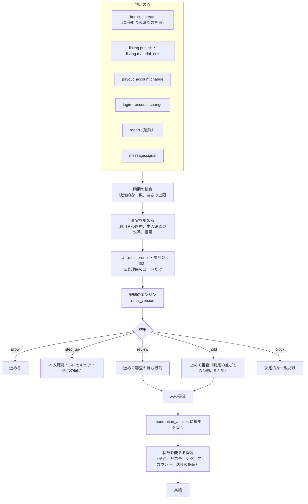
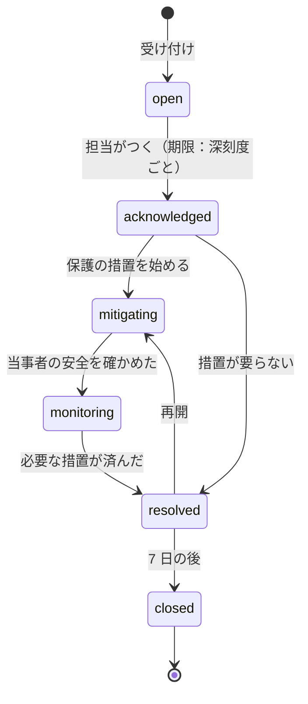

# Trust and safety: Airbnb

T&S。判定の点（予約・公開・送金の口座の変更・ログイン）、同期の検査、信号、規則のエンジンとその結果の意味、審査の待ち行列、措置と異議、偽のリスティング、決済の不正、乗っ取り、パーティーの危険の点と ML の境界、安全の事故と 24 時間の窓口、差別の禁止（法務の L11）、開示の請求と行政の要請（法務の L14・L1）を決める。

前提となる決定は次のとおり。

- T&S は、同期の検査・点・規則のエンジン・人の審査・措置の記録の段に分ける。ML は点と理由のコードだけを返す。自動の措置は `step_up` と `hold` まで。アカウントの停止・予約の取り消し・リスティングの削除は人の審査を通す。例外は決定的な一致だけ（[ADR-0009](../decisions/0009-trust-and-safety-and-ml-boundary.md)）
- 保護される属性とその代わりの値を、不正の点・パーティーの危険の点・順位付けの特徴に使わない。予約の確定の前に、ホストにゲストの顔の写真を見せない（[ADR-0009](../decisions/0009-trust-and-safety-and-ml-boundary.md)）
- T&S の案件・措置・通報・安全の事故は Aurora content に置く（[ADR-0001](../decisions/0001-platform-and-stack.md)）
- 規則の言語と影の評価の手順は Mercari の題材を参照する（[ADR-0051](../../../mercari/docs/decisions/0051-rules-engine-declarative-tables.md)、[ADR-0052](../../../mercari/docs/decisions/0052-review-cases-queues-and-appeals.md)、[trust-and-safety.md](../../../mercari/docs/architecture/trust-and-safety.md) の 7・8 節）

この文書で決めたことは次の ADR にある。

| ADR | 決定 |
| --- | --- |
| [0057](../decisions/0057-ts-decision-points-and-outcomes.md) | 規則のエンジンは判定の点ごとに結果の意味を決める。予約（`booking.create`）の `hold` は、即時予約をリクエストに回して T&S の案件を開き、審査の判定を 4 時間以内に出す（断りは予約の事象 `ts_decline`）。`block` は決定的な一致の規則だけ。措置は `moderation_actions` に根拠を書いてから、状態を変える関数を呼ぶ。異議は別の審査員が 72 時間以内に判定する |
| [0058](../decisions/0058-party-risk-score-and-bounded-ml.md) | パーティーの危険の点 v1 は、許した特徴の一覧だけを使う加点の式（0〜1）で、0.50 以上は `step_up`（ハウスルールの明示の同意と本人確認）、催しの窓の中は 0.75 以上、外は 0.85 以上で `hold`。ML の点は影の評価の後に、式の点から ±0.20 の範囲でだけ動かせる。ゲストの住まいとの距離は `identity` が 3 つの区分に丸めて渡す |
| [0059](../decisions/0059-fake-listing-signals-and-new-host-holds.md) | 偽のリスティングは、写真の使い回し、禁止のハッシュ、位置の食い違い、届出番号の重複、相場から外れた価格、外部への誘導、到着の時の「存在しない」の報告を信号にする。新しいホストのアカウントの最初の 3 件の予約は、ホストの送金をチェックアウトの後 24 時間まで待たせ（送金の待ち `new_host_first_stays`）、内容の食い違いの報告があれば措置の保留にする |
| [0060](../decisions/0060-safety-incidents-and-24x7-line.md) | 安全の事故は `safety_incidents` の案件で、深刻度 S1（差し迫った危険）・S2（急ぎ）・S3 に分ける。S1 は人の応答 p90 2 分、保護の措置の開始 p95 30 分。緊急のボタンは先に 110・119 を示し、その後に安全の窓口へつなぐ。案件から予約の送金の保留、運用のキャンセル、代わりの宿の手配の記録、リスティングの停止の提案を操作する |
| [0061](../decisions/0061-non-discrimination-enforcement.md) | 差別の禁止は、方針への同意（予約とホストの開始の条件）、確定の前の顔の写真の非表示、断りの理由のコードの必須、ホストの断りの率の見張り（同じ区域の中央値の 3 倍かつ 50% 超、90 日に 10 件以上で審査）、特徴の許可の一覧の CI の検査、利用者の段ごとの誤りの率の比 1.25 以下で行う |

## 1. 範囲

- 扱う：判定の点、同期の検査の契約、信号の一覧、規則のエンジンの結果の意味と規則の初めの束、審査の待ち行列と期限、措置の種類と記録、異議、偽のリスティング、決済の不正、乗っ取りの信号の受け方、新しいホストの送金の待ちと報告の後の保留、パーティーの危険の点、安全の事故の案件と窓口、差別の禁止の仕組み、開示の請求と行政の要請の受け付けの枠組み、評価の集まりと公平さの評価の当て方。
- 扱わない：
  - 規則の言語の文法と影の評価の手順の細部（Mercari の題材の [ADR-0051](../../../mercari/docs/decisions/0051-rules-engine-declarative-tables.md) を参照し、同じ形を本システムのコードで書く）。
  - メッセージの絞り込み（[messaging.md](messaging.md) の 5 節）。この文書は信号を受ける。
  - 本人確認の水準と提供者（[identity-verification.md](identity-verification.md)）。この文書は `step_up` で求める。
  - ログイン・セッション・端末の乗っ取りの検出（accounts・security の各領域）。この文書は信号を受け、送金の保留を決める。
  - 予約の状態の機械（booking-and-holds の領域）。この文書は `hold` の時の経路と、T&S の断りの事象を求める。
  - 送金の保留の仕訳（ledger-and-payouts の領域）。
  - 届出番号の確かめと行政の削除の要請の手続き（regulatory-compliance-japan の領域）。

## 2. 事実（確かめたこと）

| 項目 | 事実 | この設計 |
| --- | --- | --- |
| 本家のパーティーの禁止 | 2020 年の一時の禁止を 2022 年に恒久にしたと報道された。公式の文は確かめられなかった（**未検証**。[intent.md](../intent.md) の出典） | ハウスルールの `events` の既定を禁止にし、危険の点で `step_up`・`hold` |
| 本家のパーティーの防止の方式 | 予約の時の自動の判定があると報道されるが、方式は公式の資料で確かめられなかった（**未検証**） | 許した特徴の加点の式と、範囲を限った ML（ADR-0058） |
| Mercari の題材の T&S | 同期の検査・非同期の分類器・規則のエンジン・人の審査・措置の記録。`block` は完全な一致の事実だけ（[ADR-0009](../../../mercari/docs/decisions/0009-trust-and-safety-pipeline-boundary.md)、[ADR-0051](../../../mercari/docs/decisions/0051-rules-engine-declarative-tables.md)） | 同じ段と制約 |

いずれも 2026-10-10 に確認。

## 3. 要件

| 要件 | 値 | 出どころ |
| --- | --- | --- |
| 緊急の安全の連絡 | 人が応じるまで p90 2 分（24 時間 365 日） | NFR-013、K10 |
| 保護の措置 | 安全の事故の報告から、予約の停止・代わりの宿の手配の開始まで p95 30 分 | NFR-013 |
| 同期の検査 | p95 100ms | [ADR-0009](../decisions/0009-trust-and-safety-and-ml-boundary.md) |
| 予約の時の判定 | 規則のエンジンの評価を含めて、`reserveStay` の p99 1.5 秒に収める（判定に 150ms） | NFR-004 |
| 偽のリスティング | `hold` の再現率 90% 以上・適合率 70% 以上 | [quality.md](../quality.md) の 2.2.1 節 I |
| パーティーの危険 | `step_up`・`review` の再現率 80% 以上、全予約に対する `step_up` の率 5% 以下 | 同上 |
| 公平さ | 利用者の段の間の誤りの率の比 1.25 以下 | 同上 |

## 4. 全体の流れ

## 5. 規則のエンジン（ADR-0057）

### 5.1 判定の点

| 判定の点 | いつ | 同期か | 主な事実 |
| --- | --- | --- | --- |
| `booking.create` | 確認の画面で見積もりを作る時と、`reserveStay` の直前 | 同期（150ms） | 決済の提供者の危険の点、パーティーの危険の点、不正の点、アカウントの年齢、本人確認の水準、過去の滞在と苦情、同じ端末・支払いの手段の速さ |
| `listing.publish`・`listing.material_edit` | 公開と重要な項目の編集（[listings-and-content.md](listings-and-content.md) の 7 節） | 同期の検査と非同期の点（60 秒） | 写真の信号、位置の確かめ、届出の確かめ、価格の比、偽のリスティングの点 |
| `payout_account.change` | 送金の口座の変更 | 同期 | 乗っ取りの点、最近のログインの変化、口座の名義と本人確認の名義 |
| `login`・`account.change` | accounts の領域が呼ぶ | 同期 | 乗っ取りの点 |
| `report` | 通報 | 非同期 | 通報の種類、通報者の数、対象の履歴 |
| `message.signal` | 絞り込みの結果の印（[messaging.md](messaging.md) の 5.1 節） | 非同期 | 種類のコードと件数 |
| `review.signal` | レビューの操作の信号（[reviews.md](reviews.md) の 6 節） | 非同期 | 信号のコード |

### 5.2 結果の意味

| 結果 | `booking.create` | `listing.*` | `payout_account.change` |
| --- | --- | --- | --- |
| `allow` | 進める | 公開・入れ替え | 変更する |
| `step_up` | 本人確認（[identity-verification.md](identity-verification.md) の 5 節の水準）、3-D セキュアの要求、ハウスルールの明示の同意。済めば進める | 住所を確かめる書類、本人確認 | 再認証（パスキー）と、`owner` へのメール・SMS の確かめ |
| `review` | 予約を進め、T&S の案件を開く（確定の後の審査）。予約の事象 `ops_hold`（主体 T&S）でホストへの支払いの release を案件の判定まで止め、判定で `ops_release` | 公開・入れ替えを止めて審査（[listings-and-content.md](listings-and-content.md) の 4.3 節） | 変更し、案件を開く。送金は 72 時間の保留（[ADR-0007](../decisions/0007-tenancy-host-accounts-and-rls.md)） |
| `hold` | 即時予約のリスティングでも予約のリクエストに回す（予約の `route = 'request_by_ts'`）。T&S の案件を開き、審査の判定を 4 時間以内に出す。審査が断るなら、措置を書いた後に予約の事象 `ts_decline` で `requested → declined`。認めるなら `ts_clear` で、ホストの承認を待つふつうのリクエストに戻す。期限を過ぎたらホストの判定に任せる（[booking-and-holds.md](booking-and-holds.md) の DT-BKG-001 の行 13a・21a・21b・21c） | 同上 | 変更を止めて審査 |
| `block` | 予約を作らない（既知の盗難のカードの指紋の完全な一致など） | 公開しない（禁止のハッシュの完全な一致） | 変更しない |

- `block` の規則は、`when` が完全な一致の事実（`signal.card_blocklist_exact`、`signal.photo_blocklist_exact`、`signal.term_exact_block`、`signal.registration_revoked`）だけでできていなければ束を作れない（Mercari の題材の束を作る時の検査と同じ）。
- `hold` の予約は、ゲストに「ホストの確認が要る予約になりました」と出し、理由（T&S の規則）は示さない。リクエストの期限 24 時間の中で、T&S の判定（4 時間）とホストの判定の両方が要る。
- 予約の時の判定は、確認の画面を開く時（見積もりの時）に 1 回行い、結果を見積もりに結ぶ（`ts_decision_id`）。`reserveStay` の直前には、見積もりからの事実の変化（支払いの手段の変更）があったときだけやり直す。`step_up` の手続きを確認の画面の中で済ませるため。

### 5.3 規則の初めの束（`rules_version` 1 の草案）

| ID | 判定の点 | 条件 | 結果 |
| --- | --- | --- | --- |
| R-CARD-001 | `booking.create` | カードの指紋が盗難の一覧（チャージバックで確かめた）に完全に一致 | `block` |
| R-CARD-010 | `booking.create` | 決済の提供者の危険の点が高い（提供者の区分 `highest`） | `step_up`（3-D セキュア） |
| R-VEL-010 | `booking.create` | 同じ端末か支払いの手段から 24 時間に 5 件以上の仮押さえの期限切れ | `step_up`（本人確認）と速さの上限 |
| R-PTY-010 | `booking.create` | パーティーの危険の点 ≥ 0.50（7 節） | `step_up`（明示の同意と本人確認） |
| R-PTY-020 | `booking.create` | 点 ≥ 0.75 かつ催しの窓の中 | `hold` |
| R-PTY-030 | `booking.create` | 点 ≥ 0.85 | `hold` |
| R-FRD-010 | `booking.create` | 不正の点 ≥ 0.80 かつ総額 ≥ 200,000 円 | `hold` |
| R-FRD-020 | `booking.create` | 不正の点 0.50〜0.80 | `review` |
| R-LST-001 | `listing.publish` | 禁止のハッシュの完全な一致 | `block` |
| R-LST-010 | `listing.publish` | 他のホストのアカウントの写真と距離 1〜6 が 3 枚以上 | `review` |
| R-LST-020 | `listing.publish` | 位置が `needs_review`、または届出番号が他のホストのアカウントで使用中 | `review` |
| R-LST-030 | `listing.publish` | 偽のリスティングの点 ≥ 0.80 | `review`（優先度を上げる） |
| R-LST-040 | `listing.publish` | 新しいホストのアカウント（30 日未満）かつ価格が区域の中央値の 40% 未満かつ需要の高い区域 | `review` |
| R-PAY-010 | `payout_account.change` | 乗っ取りの点 ≥ 0.70、または 24 時間の中の新しい端末からのログイン | `step_up` と `review` |
| R-RPT-010 | `report` | 「存在しない・入れない」の報告がチェックインの日に来た | `hold`（リスティング）と安全の窓口の S2 の案件（8 節） |
| R-RPT-020 | `report` | 別々の通報者 3 人以上（30 日）、同じ方針 | `review`（優先度を上げる） |

- 閾値は始めの置き値で、評価の集まり（13 節）で 3 節の基準を満たすように E16 の `risk-scores` で決める。
- 規則の変更は Mercari の題材と同じく、PR と表駆動テストの行、7 日の影の評価、T&S の責任者の承認（`ts_rule_approvals`）で出す。エージェントは草案を作るが承認しない。

### 5.4 審査の待ち行列と期限

| 待ち行列 | 中身 | 判定の期限（S1 の目標） |
| --- | --- | --- |
| `booking_hold` | 予約の `hold` | 4 時間 |
| `safety` | 安全の事故（10 節） | 深刻度ごと |
| `listing_integrity` | 偽のリスティング、写真、位置 | 24 時間 |
| `payment_fraud` | 決済の不正、チャージバック | 24 時間 |
| `account_takeover` | 乗っ取り | 4 時間 |
| `discrimination` | 差別の通報と見張り（11 節） | 72 時間 |
| `content` | メッセージ・レビューの通報 | 72 時間 |
| `appeals` | 異議 | 72 時間 |

- 案件（`ts_cases`）は、対象（予約、リスティング、アカウント、メッセージ、レビュー）、待ち行列、優先度、期限、担当、根拠の写し（`rule_evaluations` の ID、通報、証拠）を持つ。期限の 80% で警告、超えたら責任者に上げる。
- 審査の画面には、判断に要る事実だけを出す。ゲストの顔の写真・氏名の全部は、差別の審査と安全の事故の案件の外では出さない（属性で判断しないため）。

### 5.5 措置と異議

| 措置 | 対象 | 自動で効くか | 戻せるか |
| --- | --- | --- | --- |
| `require_verification` | アカウント | はい（`step_up`） | - |
| `route_to_request` | 予約 | はい（`hold`） | - |
| `payout_hold` | ホストのアカウント・予約 | はい（`hold`・`review`。ledger-and-payouts の領域の `host_payable_hold`） | 解除 |
| `listing_suspend` | リスティング | 人の審査の後（決定的な一致の `block` は例外） | 異議 |
| `reservation_cancel_ops` | 予約 | 人の審査の後（cancellations-and-changes の領域の運用のキャンセル） | 戻せない（返金と代わりの宿で扱う） |
| `review_remove` | レビュー | 人の審査の後（[reviews.md](reviews.md) の 7 節） | 異議 |
| `account_restrict`（予約・公開・メッセージの一部を止める） | アカウント | 人の審査の後 | 異議 |
| `account_suspend` | アカウント | 人の審査の後 | 異議 |

- 措置は `applyModerationAction(action)` の 1 つの関数で、`moderation_actions`（対象、種類、根拠：規則のバージョン・点・審査の判定・基準のコード、審査員、期限）を書いた後に、対象の持ち主のサービスの関数（`transitionListing()`、予約の `transition()`、送金の保留）を outbox で呼ぶ。
- 本人に措置と理由の種類を知らせ（[messaging.md](messaging.md) の 9.1 節の `ts.action_notice`）、異議の操作を出す。
- 異議は、元の判定と別の審査員が 72 時間以内に判定する。認容なら措置を取り消す措置（`revert`）を書いて戻す。

### 5.6 同期の検査の辞書と一覧

| 一覧 | 中身 | 持ち主 |
| --- | --- | --- |
| 禁止の語の辞書（`exact_block`・`warn`） | 言語ごと（日本語、英語、中国語、韓国語）。違法な行為、差別・憎悪の語、外部の支払いのサービスの名前（[messaging.md](messaging.md) の 5.5 節と共有） | T&S。バージョンの付いた設定、変更は影の評価を通す |
| 禁止のハッシュの一覧 | 確かめた偽のリスティング・盗用の写真の pHash と dHash（[listings-and-content.md](listings-and-content.md) の 6.3 節） | T&S の責任者の承認で足す |
| 盗難のカードの指紋の一覧 | チャージバックで確かめた提供者のカードの指紋 | T&S と財務 |
| 失効した届出番号 | `compliance-jp` の状態 | regulatory-compliance-japan の領域 |

- 同期の検査は、これらの一覧の完全な一致と、[messaging.md](messaging.md) の 5.3 節の検出の関数を、呼び出し元のプロセスのメモリーの写しで行う（p95 100ms）。一覧の写しは 1 分ごとにバージョンを確かめて読み直す。

## 6. 信号

| 信号 | 出どころ | 形 |
| --- | --- | --- |
| `psp_risk` | 決済の提供者の危険の区分（payments-and-fx の領域） | 区分のコード |
| `fraud_score` | `ml-inference`（MVP は規則の式） | 0〜1 と理由のコード |
| `party_score` | 7 節 | 0〜1 と理由のコード |
| `fake_listing_score` | `ml-inference`（MVP は規則の式） | 0〜1 と理由のコード |
| `ato_score` | accounts・security の各領域 | 0〜1 |
| `photo_reuse`、`photo_blocklist_exact`、`hash_degenerate` | [listings-and-content.md](listings-and-content.md) の 6.3 節 | 距離と件数 |
| `location_review` | [location-and-geo.md](location-and-geo.md) の 4.3 節 | 状態 |
| `registration_duplicate`・`registration_revoked` | `compliance-jp` | bool |
| `message_filter` | [messaging.md](messaging.md) の 5.1 節 | 種類のコードと件数 |
| `review_manipulation` | [reviews.md](reviews.md) の 6 節 | 信号のコード |
| `velocity_*` | Valkey の数（端末、支払いの手段、IP の帯ごとの仮押さえ・見積もり・失敗） | 数 |
| `kyc_level` | `identity` | 水準 |
| `home_distance_bucket` | `identity`（7.2 節） | `local`・`regional`・`far`・`unknown` |

- 信号は ID・数・区分・コードだけで、本文・住所・氏名・画像を持たない。データレイクに入る事象も同じ（[ADR-0009](../decisions/0009-trust-and-safety-and-ml-boundary.md)）。

## 7. パーティーの危険（ADR-0058）

### 7.1 点 v1（規則の式）

予約の時に、許した特徴だけで加点し、0〜1 に切る。

| 特徴 | 加点 |
| --- | --- |
| 部屋の型が家全体 | +0.15 |
| 1 泊 | +0.20（2 泊は +0.08） |
| 金曜・土曜・祝日の前の夜を含む | +0.10 |
| 催しの窓の中（地域ごとの日の表：大晦日、ハロウィン、花火大会など。T&S が持つ設定） | +0.20 |
| ゲストの住まいとの距離が `local`（25 km 未満） | +0.15 |
| アカウントの作成から 30 日未満 | +0.10 |
| 完了した滞在が 0 件 | +0.10 |
| 完了した滞在が 3 件以上で、ホストからのハウスルールの順守の点の平均が 4.5 以上 | −0.20 |
| 過去にハウスルールの違反（パーティー）で確かめた苦情・措置がある | +0.40 |
| 人数が定員と同じで、定員が 6 以上 | +0.05 |
| チェックインまで 2 日未満 | +0.10 |

- **許した特徴の一覧**（`party_features_v1`）はバージョンで持ち、追加は QA と法務の確認を通す。国籍、人種、民族、宗教、性別、性的指向、障害、年齢（成年かどうかの確かめを除く）、氏名、顔の写真、表示の言語、端末の言語、国の推定を使わない（[ADR-0009](../decisions/0009-trust-and-safety-and-ml-boundary.md)）。
- ゲストの住まいとの距離は、`identity` が本人確認の住所か支払いの請求の郵便番号から求め、`local`（25 km 未満）・`regional`（25〜100 km）・`far`（100 km 以上）・`unknown` に丸めて渡す。住所そのものを T&S に渡さない。
- 距離の特徴は、日本に住む人と海外の人の間で結果を偏らせうる（海外の人は `local` にならない）。公平さの評価の段「物件と同じ国か」（[quality.md](../quality.md) の 2.2.1 節 I）で、誤りの率の比を見張る。

**例 1**：大晦日（2026-12-31、木）のチェックインで 1 泊、家全体、定員 8 に 8 人、アカウントは 10 日、完了した滞在 0、住まいは 8 km（`local`）、チェックインの前日の予約。

0.15（家全体）+ 0.20（1 泊）+ 0.10（翌日が祝日の夜）+ 0.20（催しの窓）+ 0.15（`local`）+ 0.10（新しいアカウント）+ 0.10（滞在 0）+ 0.05（人数）+ 0.10（直前）= 1.15 → **1.00**。催しの窓の中で 0.75 以上 → `hold`（リクエストに回し、T&S が 4 時間以内に判定）。

**例 2**：3 月の金曜から 3 泊、家全体、大人 2 人と子ども 2 人、海外の住まい（`far`）、アカウント 2 年、完了した滞在 5 件で順守の点の平均 4.8。

0.15 + 0.10（金曜）− 0.20 = **0.05** → `allow`。

### 7.2 ML の境界

| 段 | 中身 |
| --- | --- |
| 段 0（MVP） | 7.1 節の式だけ。`ml-inference` は使わない |
| 段 1（影） | `ml-inference` の `party_ml`（0〜1 と理由のコード）を計算して記録するだけ。式の点と、確かめた苦情との関係を 30 日以上比べる |
| 段 2（範囲を限って使う） | 最終の点 = clamp(式の点 + clip(`party_ml` − 式の点, −0.20, +0.20), 0, 1)。ML は式の点から ±0.20 までしか動かせない |

- 段 2 へ上げる条件：評価の集まり（13 節）で再現率と `step_up` の率の基準を満たし、公平さの比が 1.25 以下で、T&S の責任者と法務が承認する。
- ML の点だけで `hold` に届く件（式の点 0.65、ML で +0.20 → 0.85）は、`hold` の理由に ML の寄与を記録し、審査の画面に出す。
- 予約の時の判定は `ml-inference` を待たない（段 2 でも、50ms で返らなければ式の点だけで判定する）。

### 7.3 `step_up` の中身

- ハウスルールの明示の同意：パーティー・イベントの禁止、静かな時間、人数の上限の文を表示の言語で出し、「同意する」を押させる（同意の記録は予約に結ぶ）。
- 本人確認：[identity-verification.md](identity-verification.md) の水準 `id_verified` を求める。
- どちらも済めば `allow` と同じに進める。

## 8. 偽のリスティングと新しいホスト（ADR-0059）

| 手口 | 信号 | 結果 |
| --- | --- | --- |
| 他の物件の写真の使い回し | `photo_reuse`（距離 1〜6、他のホストのアカウント） | `review` |
| 確かめた偽のリスティングの写真の再利用 | `photo_blocklist_exact` | `block` |
| 存在しない住所・違う場所 | `location_review`（ピンと候補の距離 300 m 超、精度の低さ、市区町村の食い違い） | `review` |
| 他人の届出番号 | `registration_duplicate`（別のホストのアカウントで使用中） | `review` |
| 相場より極端に安い | 区域の中央値の 40% 未満、新しいホストのアカウント | `review` |
| 外部への誘導 | 説明の文・メッセージの `external_id`・`offplatform_payment` | 文は伏せる・止める（[messaging.md](messaging.md) の 5 節）、件数を信号に |
| 到着して存在しない・入れない | 通報（`report`）、チェックインの日 | リスティングの `hold`、安全の窓口の S2、代わりの宿の手配 |

- **新しいホストの最初の 3 件の予約**：ホストのアカウントの最初の 3 件の予約は、各予約のチェックアウトの後 24 時間まで、そのホストの送金を待たせる（送金の待ち `payout_holds.kind = 'wait'`、理由 `new_host_first_stays`。持ち主は `payouts`、規則の正本は [ledger-and-payouts.md](ledger-and-payouts.md) の 7.3 節）。release は時刻どおりで、仕訳を動かさない。待ちの間に「存在しない・内容が違う」の報告が来たら、T&S が措置の保留（`payout_hold`、`fraud_suspected`）をかける。前払いの詐欺で失うお金を、最初の滞在の確かめまで止める。
- 偽のリスティングと判定したら、措置でリスティングを `suspended`、将来の予約を運用のキャンセル（全額の返金）にし、確定済みのゲストに代わりの宿の手配の連絡をする。写真のハッシュを禁止の一覧に足す（T&S の責任者の承認）。

## 9. 決済の不正と乗っ取り

- 決済の不正：提供者の危険の区分を信号にし、3-D セキュアを `step_up` で求める。チャージバックで確かめたカードの指紋を盗難の一覧に足す（指紋は提供者の値。カード番号を持たない。[ADR-0005](../decisions/0005-payments-hold-capture-and-ledger.md)）。
- 仮押さえで日付を塞ぐ攻撃（[ADR-0004](../decisions/0004-booking-state-machine-and-holds.md) の Consequences）：同じゲスト・端末・支払いの手段の、同時の有効な仮押さえを 2 件まで、24 時間の期限切れが 5 件で `step_up`（R-VEL-010）。WAF の速さの上限は security の領域。
- 乗っ取り：送金の口座の変更は `owner` だけで、変更から 72 時間は送金を保留する（[ADR-0007](../decisions/0007-tenancy-host-accounts-and-rls.md)）。乗っ取りの点が高ければ `step_up` と案件（R-PAY-010）。

## 10. 安全の事故と 24 時間の窓口（ADR-0060）

### 10.1 受け付け

| 入口 | 中身 |
| --- | --- |
| アプリの緊急のボタン（予約の画面、滞在中は上に固定） | まず物件の国の緊急の番号（日本は 110・119）を大きく出し、電話をかけられるようにする。その後に「安全の窓口につなぐ」を出す。押すと S1 の案件を作り、窓口から折り返す |
| 安全の窓口の電話 | 24 時間 365 日。受けた担当が案件を作る |
| メッセージの安全の言葉の検出 | 送り手と受け手に窓口の案内を出す（[messaging.md](messaging.md) の 8 節）。案件は作らない |
| 通報（「存在しない・入れない」「隠しカメラ」「けが」） | 種類で S2 か S3 の案件 |

### 10.2 深刻度と期限

| 深刻度 | 例 | 人の応答 | 保護の措置の開始 |
| --- | --- | --- | --- |
| S1 | 差し迫った危険、暴力、火事、医療の緊急 | p90 2 分（NFR-013） | p95 30 分（NFR-013） |
| S2 | 隠しカメラ、夜間に入れない、物件が存在しない、差別による入室の拒否 | p90 15 分 | p95 2 時間 |
| S3 | 騒音の苦情、清潔さ、設備の故障 | 24 時間 | - |

- 近隣の住民の苦情（騒音、パーティー）は、窓口の別の電話番号とウェブの書式で受け、S2（進行中のパーティー）か S3 にする。

### 10.3 案件の状態

- 期限の 50% で同じ窓口の他の担当、100% で責任者に上げる（呼び出しは runbooks）。
- 案件から操作できるもの：予約の運用の保留（`on_hold`。送金の release を止める、[ADR-0004](../decisions/0004-booking-state-machine-and-holds.md)）、運用のキャンセル（cancellations-and-changes の領域）、代わりの宿の手配の記録（`rebooking_records`：手配した宿、費用、負担）、リスティングの停止の提案（措置の手順へ）、当事者への連絡（`support` のスレッド）、レビューの組の抑制（[reviews.md](reviews.md) の 4.1 節）。
- 警察・消防への連絡は利用者に促す。本システムが代わりに通報する条件と、照会への応答は法務と決める（[ADR-0009](../decisions/0009-trust-and-safety-and-ml-boundary.md)、14 節）。
- 案件の記録（本文、証拠の写真）は content の安全の案件の表に、安全の担当の役割だけが読める RLS で置く。

## 11. 差別の禁止（ADR-0061。枠組み、法務の確認待ち L11・L2）

| 仕組み | 中身 |
| --- | --- |
| 方針への同意 | 全部の利用者が、最初の予約・最初のリスティングの前に、差別の禁止の方針（バージョンつき）に同意する。新しいバージョンは次の予約・公開の前に同意を求める |
| 確定の前の顔の写真 | ホストに、予約の確定の前（リクエスト・問い合わせの間）にゲストの顔の写真を見せない。確定の後に出す。名前の出し方（名だけか）は L11 の後に決め、既定は名だけ |
| 断りの理由 | 予約のリクエストを断るとき、理由のコード（`dates_not_available`、`group_size`、`house_rules_conflict`、`maintenance`、`other`。一覧の正本は [booking-and-holds.md](booking-and-holds.md) の 9 節）を必須にする。`other` の自由な文は差別の語の辞書で調べ、当たれば信号 |
| 断りの率の見張り | ホストのアカウントごとの 90 日のリクエストの断りの率。リクエスト 10 件以上で、断りの率が同じ区域の中央値の 3 倍、かつ 50% を超えたら `discrimination` の案件。断りの直後（24 時間）に同じ日付で別のゲストを承認した件を数える |
| 特徴の許可の一覧 | 順位付け・不正の点・パーティーの危険の点の特徴の一覧をバージョンで持ち、保護される属性とその代わりの値がないことを CI で確かめる（[quality.md](../quality.md) の 2.2.1 節 I） |
| 公平さの評価 | 利用者の段（新しいアカウント、本人確認の有無、表示の言語、物件と同じ国か）ごとの `hold`・`block`・`step_up` の率と誤りの率。段の間の誤りの率の比が 1.25 を超える変更は出さない |
| アクセシビリティの設備 | 段差のない入口、手すりなどの設備のコードを持ち、写真での確かめを求める（合理的配慮の表示の範囲は L11） |
| 通報 | 差別の通報は `discrimination` の待ち行列（72 時間）。入室の拒否は安全の S2 |

- 見張りは属性を使わない。断りの率は、ゲストの属性ではなくホストの振る舞い（断りの数、断りの後の同じ日付の承認）で見る。
- ホストの予約の断り・ゲストの選別を本システムが制限することの法的な根拠、旅館業法の宿泊の拒否の制限との関係は法務の確認待ち（L11、L2）。措置は案件の人の判定で、自動の措置をしない。

## 12. 開示の請求と行政の要請（枠組み。法務の確認待ち L14・L1）

| 要請 | 受け付け | 応答 |
| --- | --- | --- |
| 取引デジタルプラットフォーム消費者保護法の開示の請求（販売業者等の情報） | 運用の書式。案件 `legal_request` | 法務の判断の後、運用者が JIT の権限で応答する（L14） |
| 利用の停止等の要請 | 行政からの文書 | 法務の判断。措置の手順（L14） |
| 自治体・観光庁の違法な物件の削除の要請 | regulatory-compliance-japan の領域 | 届出の状態を変え、`listingVisible()` の行 8 で消す（[listings-and-content.md](listings-and-content.md) の 8 節） |
| 警察の照会 | 運用の窓口 | 法務の判断。応答の記録（L3・L14） |

- どの要請も、エージェントは応答しない（[roadmap.md](../roadmap.md) の「エージェントに任せないこと」）。

## 13. 評価の集まり

- [quality.md](../quality.md) の 2.2.1 節 I のとおり。偽のリスティング、決済の不正、パーティーの危険、乗っ取りの正と負の例を、本システムの審査で確かめたもの（同意の範囲、仮名にしたもの）と生成した素材だけで持つ。本家や他のサービスから取り出したものを使わない。
- 点 v1（規則の式）も、ML と同じ評価の集まりで測る。閾値の変更は評価の結果と影の評価を添えた PR で出す。

## 14. 失敗と回復

| 事象 | 影響 | 扱い |
| --- | --- | --- |
| `trust-safety` の停止・150ms の超過 | 判定ができない | `booking.create` は、`booking` のプロセスの中の写しで決定的な一致（`block` の規則）だけを確かめ、当たれば `block`、当たらなければ進める。後から全部の規則で評価し、`allow` でなければ `review` と同じ扱い（`ops_hold` と案件）にする（[booking-and-holds.md](booking-and-holds.md) の 6.1.1 節と同じ規則）。`listing.publish` は待たせる |
| `ml-inference` の停止・遅れ | 点がない | 式の点だけで判定（7.2 節）。偽のリスティングの点は公開の後の審査 |
| 審査の待ち行列の溢れ（繁忙期、事件） | 期限を超える | 期限の 80% で警告、Ops と応援の手順（runbooks）。`booking_hold` の期限切れの前に、判定が出なければホストの判定に任せる（T&S の断りをしない）ことを既定にする |
| 安全の窓口の電話の障害 | S1 を受けられない | アプリの緊急のボタンは 110・119 を先に出すので、緊急の番号への案内は止まらない。予備の電話の提供者に切り替える（runbooks） |
| 規則の誤り（`hold` の急増） | 予約が止まる | 規則を前の `rules_version` に戻す（束のバージョンを切り替える）。影の評価を通していない規則は `active` にできない |
| 誤った措置 | 正しい利用者の停止 | 異議と取り消しの措置。措置の取り消しの率を見張る |

## 15. 上限

| 対象 | 値 |
| --- | --- |
| 予約の時の判定 | 150ms（超えたら決定的な一致だけで判定し、後から評価して `allow` でなければ `review`） |
| 同時の有効な仮押さえ | 1 ゲスト・1 端末・1 支払いの手段で 2 件 |
| 規則 | 束に 500 本 |
| 通報 | 1 人 1 日 20 件 |
| 異議 | 1 つの措置に 1 回 |
| 新しいホストの送金の待ち | 最初の 3 件、各予約のチェックアウトの後 24 時間まで（ledger-and-payouts の領域） |

## 16. data-model への項目

| 置き場所 | 中身 | 節 |
| --- | --- | --- |
| Aurora content `ts_rules`（`id`、`version`、`state`、`decision_point`、`condition`（規則の `when`）、`outcome`（規則の `then`））、`ts_rule_bundles`（`rules_version`、`approved_by`、`activated_at`）、`ts_rule_approvals` | 規則 | 5 |
| Aurora content `rule_evaluations`（`id`、`decision_point`、`subject`、`rules_version`、`matched`、`outcome`、`facts_snapshot`（ID・点・数だけ）、`at`） | 評価の記録 | 5 |
| Aurora content `ts_cases`（`id`、`queue`、`subject_type`、`subject_id`、`priority`、`due_at`、`assignee`、`state`、`evidence_refs`） | 案件 | 5.4 |
| Aurora content `moderation_actions`（`id`、`subject`、`kind`、`basis`（規則のバージョン、点、判定、基準のコード）、`reviewer`、`applied_at`、`reverted_by`） | 措置 | 5.5 |
| Aurora content `appeals`（`action_id` 一意、`body`、`reviewer`、`decision`、`decided_at`） | 異議 | 5.5 |
| Aurora content `safety_incidents`（`id`、`severity`、`state`、`reservation_id`、`reporter`、`channel`、`acknowledged_at`、`mitigation_started_at`、`resolved_at`、`notes`）、`rebooking_records`。安全の担当の役割だけの RLS | 安全の事故 | 10 |
| Aurora content `policy_acknowledgements`（`user_id`、`policy`、`policy_version`、`at`） | 方針への同意 | 11 |
| Aurora core `reservations.ts_decision_id`・`route`（`instant`・`request`・`request_by_ts`）・`ts_review_due_at`・`ts_cleared_at`、`request_declines`（[booking-and-holds.md](booking-and-holds.md) が持つ） | 予約の判定と断りの理由 | 5.2、11 |
| Valkey `vel:{kind}:{key}`（速さの数） | 速さ | 6 |
| AppConfig `ts.event_windows`、`ts.party_features_v1`、`ts.thresholds` | 設定 | 7 |
| データレイク `ts_eval_sets`（`evalset_version`） | 評価の集まり | 13 |

## 17. テストと性質

| ID | 性質・試験 |
| --- | --- |
| PROP-TS-001 | 任意の事実と規則の束で、`block` に当たる規則は完全な一致の事実だけでできている（束を作る時の検査が拒む） |
| PROP-TS-002 | 予約・リスティング・アカウントの状態の変化のうち T&S が起こしたものは、すべて先に `moderation_actions` の行がある（措置の関数を通らない経路がない） |
| PROP-TS-003 | 同じ事実と同じ `rules_version` なら、評価の結果は同じ（再現） |
| PROP-TS-004 | パーティーの危険の点は、許した特徴の一覧の外の入力に依らない（一覧の外の欄を変えても点が変わらない）。点は加点の特徴について単調 |
| PROP-TS-005 | 段 2 の最終の点と式の点の差は 0.20 以下 |
| PROP-TS-006 | `hold` の予約は即時予約で確定しない（`requested` を経る）。T&S の断りは `moderation_actions` の後にだけ起きる |
| PROP-TS-007 | 確定の前の予約の画面・API・通知・審査の画面（差別と安全の案件の外）に、ゲストの顔の写真が出ない（[quality.md](../quality.md) の 2.2.1 節 H） |
| PROP-TS-008 | 安全の事故の S1 の案件は、期限の超過で必ず上げられる（仮想の時計） |
| 表駆動 | 5.2 節の結果の意味、5.3 節の規則の束（当たる例と当たらない例）、11 節の断りの率の見張りの条件 |
| 試験のベクトル | 7.1 節の例（1.00 と 0.05） |
| 評価の集まり | 3 節の基準、公平さの比（[quality.md](../quality.md) の 2.2.1 節 I） |
| 演習 | 安全の窓口の S1 の訓練（月 1 回、runbooks） |

## 18. Story の候補

| Epic | Story | 中身 |
| --- | --- | --- |
| E16 | `rules-engine` | 規則の言語（Mercari の題材の形）、束、影の評価、承認、判定の点（5 節） |
| E16 | `risk-scores` | 不正・偽のリスティング・乗っ取りの点（規則の式から）、パーティーの危険の点 v1（6、7 節） |
| E16 | `review-queues-and-actions` | 待ち行列、期限、`moderation_actions`、異議（5.4、5.5 節） |
| E16 | `booking-hold-routing` | `hold` のリクエストへの回し、`ts_decline`（booking-and-holds の領域と合わせる。5.2 節） |
| E16 | `fake-listing-detection` | 信号、報告の後の措置の保留（8 節。待ちは E12 の `payout-holds`） |
| E16 | `party-prevention` | 点 v1、催しの窓、`step_up` の同意（7 節） |
| E16 | `safety-incidents-and-24x7-line` | 緊急のボタン、案件、期限と上げ、代わりの宿の手配の記録（10 節） |
| E16 | `non-discrimination-policy` | 同意、確定の前の写真の非表示、断りの理由、断りの率の見張り。法務：L11（11 節） |
| E16 | `disclosure-and-takedown-requests` | 受け付けと案件。法務：L14（12 節） |
| E16 | `ts-evalsets-and-fairness` | 評価の集まりと公平さの評価（13 節） |

## 19. 未解決の問い

### 決定（2026-10-10、既定案）

- **結果の意味**：予約の `hold` はリクエストに回して 4 時間の審査、`block` は決定的な一致だけ（ADR-0057）。DT-BKG-001 に行 13a・21a・21b・21c を足した（2026-10-10、統合）。
- **150ms の超過**：決定的な一致だけで判定し、後から評価して `allow` でなければ `review`（booking-and-holds の領域と同じ規則。2026-10-10、統合）。
- **パーティー**：許した特徴の加点の式、0.50・0.75・0.85、ML は ±0.20 まで（ADR-0058）。
- **偽のリスティング**：信号と、新しいホストの最初の 3 件の送金の待ち（ADR-0059。2026-10-10 の統合で ledger の待ちと 1 つにした）。
- **安全**：S1〜S3、S1 は p90 2 分・p95 30 分（ADR-0060）。
- **差別の禁止**：同意、写真の非表示、断りの理由、断りの率の見張り（ADR-0061）。

### 持ち越し

| 問い | いつ・どう決めるか |
| --- | --- |
| ホストの断り・選別を制限する根拠、旅館業法の宿泊の拒否の制限との関係、確定の前の名前の出し方 | 法務の確認待ち（L11・L2） |
| 本システムが警察・消防に代わりに通報する条件、照会への応答 | 法務と安全の担当 |
| 開示の請求と利用の停止の要請の手続き | 法務の確認待ち（L14） |
| 点の閾値と加点の値 | E16 の `risk-scores` で評価の集まりと影の評価から。T&S の責任者が承認 |
| `booking_hold` の期限切れの既定（ホストに任せる） | S1 の運用の審査の量を見て T&S と PM が見直す |
| 催しの窓の表の作り方（地域の祭り・花火大会） | T&S の運用が季節ごとに入れる |
