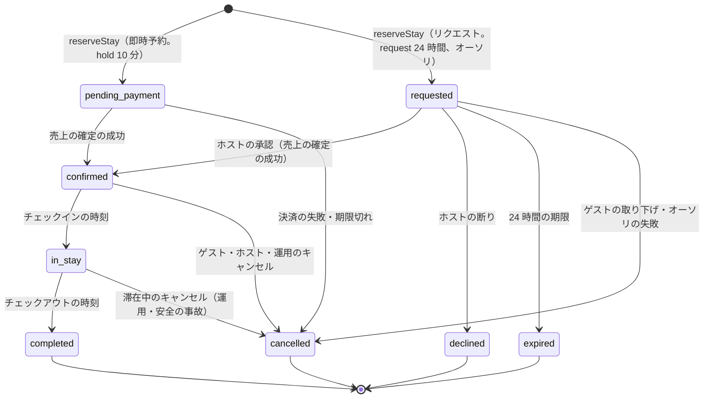

# ADR-0004: 予約を明示の状態の機械にし、作成を `reserveStay` の 1 つの関数と 1 つのトランザクション（見積もりの確かめ、滞在の規則、排他の制約、180 日の数え）に集める。仮押さえは 10 分、リクエストは 24 時間の期限つきの `stay_claims`。冪等キーと見積もりの一意で予約を 1 回に限る。日程の変更は同じ予約の組の行で入れ替える

## Context

予約は、見積もり → 支払い → 確定 → チェックイン → チェックアウト → レビューと送金まで、数日から 1 年以上続く。次を守る（NFR-004、NFR-005、NFR-015）。

- 1 回の予約の操作から作る予約は 1 つ。画面の再送、通信の切れ、提供者の Webhook の重なりで 2 つにならない。
- 請求の額は、ゲストが確認の画面で見た総額と一致する。
- 即時予約とリクエストで、支払いの間・ホストの判断の間に、同じ日付が他に売れない。
- 日程の変更で、新しい日付が取れなければ古い日付を失わない。

本家は即時予約と予約のリクエストを持ち、リクエストへのホストの応答は 24 時間で、過ぎると期限切れになる（[Reservation requests](https://www.airbnb.com/help/topic/1340)、2026-10-10 に確認）。リクエストの間に同じ日付を他のゲストが予約できるかは確かめられなかった（**未検証**）。

## Options

作成の形：

1. **1 つの関数 `reserveStay` と core の 1 つのトランザクション。仮押さえは `stay_claims` の期限つきの行**
2. 仮押さえを Valkey に置き、支払いの成功の後に DB に書く
3. 支払いを先に済ませ、成功の後に空室を確かめて予約を作る（取れなければ返金）

リクエストの間の日付：

- a. **`stay_claims` の `request` の行で塞ぐ（他のゲストに空いて見せない）**
- b. 塞がない（承認の時に空いていれば確定、空いていなければ失敗）

## Decision

1 と a を採用する。

### 見積もり

- 確認の画面を開くと `pricing` が `quoteStay` で見積もりを作り、`quotes` に写しを書く（`quote_id`、リスティングのバージョン、日付、人数、各行の額、通貨、料金の規則・サービス料・税の表・為替の相場の ID とバージョン、キャンセルポリシーのバージョン、期限 15 分）。
- 予約の要求は `quote_id` を持つ。見積もりは 1 回だけ使える（`reservations.quote_id` の一意の索引）。期限切れ・リスティングのバージョンの変化は 409 `quote_expired` で、新しい見積もりを返す。

### `reserveStay`

- 入力：`quote_id`、支払いの方法、ゲストの人数と内訳、ホストへのメッセージ（リクエストのとき）、`Idempotency-Key`。
- 段（core の 1 つのトランザクション）：
  1. `(guest_id, idempotency_key)` の予約があれば、それを返す。
  2. 見積もりを読み、期限・未使用・ゲストを確かめる。
  3. 届出住宅に結んだリスティングなら `regulated_properties` の行を `FOR UPDATE` で取る（ロックの順は届出住宅 → リスティング。全経路で同じ順）。
  4. リスティングの行を `FOR UPDATE` で取り、`listing_version` を見積もりと比べる。`checkStayRules` で規則を確かめる。
  5. 同じリスティングの期限の切れた `hold`・`request` を `released` にする（[ADR-0002](0002-availability-representation-and-double-booking.md)）。
  6. 予約の行を作る（即時予約は `pending_payment`、リクエストは `requested`）。
  7. `stay_claims` に挿入する（即時予約は `kind = 'hold'`・期限 10 分、リクエストは `kind = 'request'`・期限 24 時間、どちらも `claim_group = reservation_id`）。排他の制約に当たれば、トランザクションを戻して 409 `dates_unavailable`。
  8. 届出住宅なら `regulated_nights` を挿入する（[ADR-0006](0006-regulatory-night-cap-enforcement.md)）。上限・自治体の規則に当たれば 409 `regulatory_cap_reached`・`regulatory_day_blocked`。
  9. `reservation_events` と outbox（`reservation.created`）を書く。
- トランザクションの後に、`payments` が支払いを始める（[ADR-0005](0005-payments-hold-capture-and-ledger.md)）。

### 熱い日付

- 催しの日程の発表の直後、同じリスティングの同じチェックインの日に要求が集まる。`booking` は Valkey の `SET claim:{listing_id}:{check_in} <attempt_id> NX PX 15000` を試し、取れなければ写しの空室を見て、すぐに 409 `dates_unavailable` か `in_progress` を返す（p99 300ms）。印は流量を絞るだけで、正しさは DB が守る。Valkey が使えなければ、リスティングごとの同時実行の上限（`booking` のタスクの中のセマフォ、既定 4）を通して DB へ進む（Mercari の題材の [ADR-0002](../../../mercari/docs/decisions/0002-transaction-state-machine-and-single-purchase.md) と同じ形）。

### 状態

- 状態の遷移は `packages/booking` の 1 つの関数 `transition(reservation_id, event, actor, expected_version)` だけが書く。行を `FOR UPDATE` で取り、決定表で遷移を決め、`reservation_events` に行（理由のコード、主体）を足し、outbox を書く。
- `cancelled`・`declined`・`expired` への遷移は、同じトランザクションで `stay_claims` の行を `released` にし、まだ来ていない泊の `regulated_nights` を外す（[ADR-0006](0006-regulatory-night-cap-enforcement.md)）。
- `confirmed` への遷移で、`stay_claims` の行を `kind = 'reservation'`、`hold_expires_at = NULL` に変える。`payout_release_at`、チェックインとチェックアウトの瞬間（物件のタイムゾーンで UTC に直した値）を書く。
- `in_stay`・`completed` は時刻で進む。`completed` でレビューの組を作る（reviews の領域）。
- お金は状態の遷移の outbox から `ledger` が動かす（[ADR-0005](0005-payments-hold-capture-and-ledger.md)）。

### 期限

| 期限の列 | 設定する時 | 既定値 | 期限で起きること |
| --- | --- | --- | --- |
| `hold_expires_at` | `pending_payment` | 10 分 | 提供者に照会し、未確定なら `cancelled`（`payment_expired`） |
| `request_expires_at` | `requested` | 24 時間（本家に寄せる） | `expired`。オーソリを取り消す |
| `check_in_at` | `confirmed` | チェックインの日の物件の現地のチェックインの時刻 | `in_stay` |
| `check_out_at` | `confirmed` | チェックアウトの日の物件の現地のチェックアウトの時刻 | `completed` |
| `payout_release_at` | `confirmed` | `check_in_at` + 24 時間 | release の依頼（[ADR-0005](0005-payments-hold-capture-and-ledger.md)） |

- `deadline-runner` が 1 分ごとに、`next_deadline_at <= now()` の予約を索引で拾い（`FOR UPDATE SKIP LOCKED`、100 件ずつ）、遷移の関数を呼ぶ。
- 運用の保留（`on_hold = true`。安全の事故の調査など）の間は、`payout_release_at` だけを止める。

### 日程と人数の変更

- `alterReservation` は、新しい見積もり（差額）を作り、ゲストかホストの提案として `reservation_alterations` に書く。新しい日付は `stay_claims` に `kind = 'hold'`（期限は相手の応答の 24 時間）、`claim_group = reservation_id` で挿入する。同じ組の行は互いに重なってよいので、古い予約の行と新しい日付が重なっても挿入できる。他の組との重なりは排他の制約が拒む。
- 相手が受けたら、1 つのトランザクションで、古い `reservation` の行を `released`、新しい行を `reservation` にし、`regulated_nights` を差し替え、予約の日付と金額を更新し、outbox に `reservation.altered`（差額と `settlement_seq`）を書く。断り・期限切れなら新しい行を `released` にする。
- 即時予約の条件を満たす変更（規則に合い、差額の支払いが済む）は、ホストの応答を待たずに受ける。

### 決定表（DT-BKG-001 の草案）

上から順に評価し、最初に一致した行を採用する。確定した表は booking-and-holds の領域の spec に書く。

| # | 今の状態 | 事象 | 条件 | → 次の状態 |
| --- | --- | --- | --- | --- |
| 1 | 終わった状態（`completed`・`cancelled`・`declined`・`expired`） | どれでも | - | そのまま（200 で今の状態を返す） |
| 2 | どれでも | どれでも | `expected_version` が違う | そのまま（409） |
| 3 | `pending_payment` | 売上の確定の成功 | - | `confirmed` |
| 4 | `pending_payment` | 決済の失敗 | - | `cancelled` |
| 5 | `pending_payment` | 期限 | 提供者の照会で成功 | `confirmed` |
| 6 | `pending_payment` | 期限 | それ以外 | `cancelled` |
| 7 | `requested` | ホストの承認 | 売上の確定の成功 | `confirmed` |
| 8 | `requested` | ホストの承認 | 売上の確定の失敗 | `cancelled` |
| 9 | `requested` | ホストの断り | - | `declined` |
| 10 | `requested` | 期限 | - | `expired` |
| 11 | `requested` | ゲストの取り下げ | - | `cancelled` |
| 12 | `confirmed` | キャンセル（ゲスト・ホスト・運用） | - | `cancelled` |
| 13 | `confirmed` | 期限 | `check_in_at` を過ぎた | `in_stay` |
| 14 | `in_stay` | キャンセル | 主体は運用 | `cancelled` |
| 15 | `in_stay` | 期限 | `check_out_at` を過ぎた | `completed` |
| 16 | どれでも | 上のどれにも当たらない | - | そのまま（422、理由のコード） |

- 返金とホストの取り分は、遷移ではなく、キャンセルの精算の決定表（cancellations-and-changes の領域）が決める。

### 同じ組の行

- 日程の変更の応答の間は、同じ予約の古い行と新しい行が有効になる。[ADR-0002](0002-availability-representation-and-double-booking.md) の排他の制約は `claim_group WITH <>` を持ち、同じ組の行どうしの重なりだけを許す。
- 同じ組の有効な行が 2 つあるのは、日程の変更の応答の間だけで、照合で見張る（応答の期限を過ぎて 2 つ残っていれば異常）。

### 他の案を選ばなかった理由

- **2（Valkey の仮押さえ）**：Valkey を失うと仮押さえが消え、支払いの間に他の予約が入る。支払いの成功の後に DB で取れず返金になる。
- **3（支払いを先に）**：繁忙期に、負けた予約の売上の確定と返金が大量に出る。ゲストの明細に請求と返金が並び、提供者の手数料もかかる。
- **b（リクエストの間に塞がない）**：ホストが承認した時に他の予約が入っていると、承認が失敗する。ゲストは 24 時間待って断られる。

## Consequences

- 良くなること：
  - 予約の作成・変更・取り消しが 1 つの関数とトランザクションに集まり、排他の制約と上限の数えが同じ時点で効く。
  - 冪等キーと見積もりの一意で、同じ操作から 2 つの予約が作られない。
  - 決定表で遷移の全行を表駆動テストで試せる。
- 引き受けるコスト：
  - リクエストの 24 時間、その日付は他のゲストに売れない。応答の遅いホストは売る機会を失う。応答の率を順位に入れて促す。
  - 支払いの 10 分の仮押さえを、ボットが繰り返して日付を塞ぐ攻撃がありうる。同じゲスト・端末の仮押さえの数の上限と WAF で抑える（trust-and-safety の領域）。
  - `claim_group` の分、排他の制約の索引が 1 列増える。

## Confirmation

- 性質ベーステスト：任意の並行の操作（即時予約、リクエスト、承認、断り、期限、取り下げ、日程の変更の提案・受諾・断り、キャンセル、ブロック、取り込み）で、異なる組の有効な `block_span` は重ならない。同じ冪等キー・同じ見積もりから予約は 1 つ。請求の額は見積もりの額（[quality.md](../quality.md) の 2.2.1 節 A）。
- 表駆動テスト：DT-BKG-001 の全行。
- 仮想の時計の試験：仮押さえ・リクエスト・チェックイン・チェックアウト・送金の振り替えの期限と、期限と利用者の操作の競合（同 D）。
- 本番：予約と `stay_claims` の照合（`confirmed` の予約に有効な `reservation` の行が 1 つ、など）、熱い日付の負けの応答の速さ（[runbooks/](../runbooks/README.md)）。
