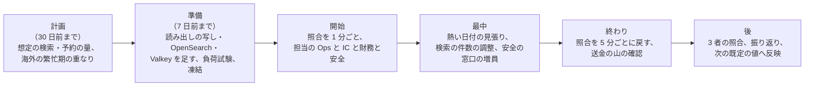

# Runbooks: Airbnb

Ops が持つ運用の文書。品質の判定基準は [quality.md](../quality.md) の 4 節にある。SLI の計測とアラートの条件の実装は [observability.md](../architecture/observability.md) にある。**SLO の値とアラートの一覧の正本はこの文書** で、値を変えるときは、この文書を先に変える。

この題材は、人が泊まる場所とお金を運ぶ。止まれば、予約が取れず、ホストにお金が届かない。同じ夜の二度の販売、届出住宅の上限の超過、お金の誤り、正確な住所の漏れは、止まるより悪い。安全の事故は、システムの障害と別に、24 時間の人の対応が要る。繁忙期の運用は 5 節、安全の事故への対応は 6 節にまとめる。

## 1. SLI と SLO

| SLI | 良いイベント（数える場所） | SLO（S1） | 許容範囲を外れたときの扱い | 品質の判定に使う |
| --- | --- | --- | --- | --- |
| 予約と決済の可用性 | 見積もり・予約・キャンセル・決済の要求のうち、5xx・時間切れでないもの（`dates_unavailable`・`quote_expired`・`regulatory_*` の 409 と、カードの拒否は除く）（ALB、`booking`） | **月間 99.95%**（NFR-010） | 1 時間のバーンレート 14.4 倍・6 時間で 6 倍で呼び出し、3 日で 1 倍でチケット。エラーバジェットを使い切ったら、修正以外のデプロイを止める | |
| 予約の速さ | `reserveStay` が 1.5 秒以内（提供者の時間を除く） | **p99 1.5 秒**（NFR-004） | p99 が 3 秒を 5 分超えたら呼び出し | |
| 負けの応答の速さ | 熱い日付で負けた要求が 300ms 以内 | **p99 300ms**（NFR-004） | p99 が 1 秒を 5 分超えたらチケット | |
| 検索の可用性 | 検索・リスティングの閲覧の要求のうち、5xx・時間切れでないもの | **月間 99.9%**（NFR-010） | バーンレート | |
| 検索の速さ | 検索が 300ms 以内 | **p95 300ms・p99 800ms**（NFR-001） | p95 が 600ms を 15 分超えたらチケット、1.5 秒で呼び出し | |
| 空室の鮮度 | `stay_claims` の変化から索引と写しに効くまで 10 秒以内 | **p95 10 秒・p99 60 秒**（NFR-002） | p99 が 5 分を超えたら呼び出し | |
| 検索の混入 | 抜き取りの再判定で、泊まれないのに出た割合 | **0.5% 未満**（NFR-002、K3） | 1 時間で 1% を超えたらチケット、3% で呼び出し | ○ |
| 二重の予約 | `stay_claims` の照合の不一致 | **0**（NFR-005、K1） | 1 件で呼び出し（SEV1 の候補）。そのリスティングの予約を止める | ○ |
| 外部の食い違いの知らせ | 食い違いの検出から知らせまで 5 分以内 | **p99 5 分**（NFR-003、K2） | p99 が 15 分を超えたらチケット | ○ |
| iCal の取り込み | 予定どおり（15 分）に取れた取り込みの割合（相手の 4xx・5xx を除く） | **99%** | 95% を 1 時間下回ったらチケット | |
| 法令の上限 | 180 日の照合の不一致・上限の超過・禁じた日の泊 | **0**（NFR-006、K6） | 1 件で呼び出し（SEV1 の候補）。その届出住宅の予約を止める | ○ |
| 決着の一回性 | 予約と台帳の照合（重複、チェックインの前の release、15 分超の欠け） | **0**（NFR-007、K7） | 重複・早い release は 1 件で呼び出し（SEV1 の候補）。欠けは 1 件でチケット、10 件で呼び出し | ○ |
| 台帳の不変条件 | 通貨ごとの釣り合い、和 0、決着した預かりの 0 | **0**（NFR-007） | 1 件で呼び出し（SEV1 の候補）。送金を止める | ○ |
| 3 者の照合 | 3 営業日を過ぎた説明のつかない差 | **0 円**（NFR-007） | 1 件でチケット（財務） | ○ |
| 送金の時期 | `payout_release_at` から release まで 5 分以内 | **p99 5 分、最大 1 時間**（NFR-008、K8） | p99 が 30 分を超えたら呼び出し | ○ |
| 見積もりと請求 | 見積もりと請求の差 | **0**（NFR-015、K5） | 1 件でチケット、10 件で呼び出し | ○ |
| レビューの公開 | 片方だけ・早すぎる・期限から 1 分を超えた公開 | **0**（NFR-009、K9） | 1 件でチケット | ○ |
| メッセージの配信 | 送信から相手の端末への依頼まで 5 秒以内 | **p95 5 秒**（NFR-012） | p95 が 1 分を 10 分超えたらチケット | |
| 見える範囲 | 見える範囲の監査の不一致（正確な住所、名簿、口座、未公開のレビュー） | **0**（NFR-016） | 1 件で呼び出し（SEV1 の候補） | ○ |
| 安全の窓口 | 緊急の安全の連絡に人が応じるまで 2 分以内 | **p90 2 分（24 時間）**（NFR-013、K10） | 15 分の窓で p90 が 5 分を超えたら呼び出し（安全の責任者） | ○ |

- SLO の窓は 30 日の移動の窓（報告は暦の月）。エラーバジェットを使い切ったら、信頼性の作業を機能より先にする。デプロイの前に残りを確かめる。
- **数えないもの**：日付が埋まっている、見積もりの期限切れ、法令の上限・禁じた日、提供者の拒否（カードの拒否）、ボットとして拒んだ要求、速さの上限の 429。ただし率の急な上がりは、本システムの食い違いの兆候として見る。見張りの利用者は SLO の計算から除き、別に見る。
- 「品質の判定に使う」に○がある指標は、QA が品質の判定基準に使う（[quality.md](../quality.md) の 4.1 節）。定義を変えるときは QA と合意する。
- 復旧の目標：AZ の障害は RPO 0・RTO 5 分。リージョンの障害は RPO 1 分・RTO 1 時間（NFR-011）。
- 本家のサービスの SLA は、公式の資料で確かめなかった（**未検証**）。

## 2. 上限と容量のパラメーター

値の正本は、各 ADR と領域の文書にある（数値の正本の一覧は [architecture/README.md](../architecture/README.md) の 6 節の「決定（2026-10-10、統合）」）。Ops が運用で変えてよいのは、下の「運用で変えるもの」だけで、変えたら記録を残す。

| 対象 | 値 | 正本 | 運用で変えるもの |
| --- | --- | --- | --- |
| 仮押さえの期限 | 10 分 | [ADR-0004](../decisions/0004-booking-state-machine-and-holds.md) | — |
| リクエストの期限 | 24 時間とチェックインの 2 時間前の早いほう | [ADR-0038](../decisions/0038-booking-requests-and-arrival-info-release.md) | — |
| T&S の `hold` の判定 | 4 時間（リクエストの期限を超えない。過ぎたらホストに任せる） | [ADR-0057](../decisions/0057-ts-decision-points-and-outcomes.md) | — |
| 見積もりの期限 | 15 分 | 同上 | — |
| 熱い日付の先着の印 | 15 秒 | [ADR-0036](../decisions/0036-hot-date-admission-and-hold-limits.md)（`hot-dates-booking-poc` で見直す） | — |
| リスティングごとの予約の同時実行（Valkey の停止の時） | 4（`booking` のタスクの最大 12 で 1 リスティング 48 件まで） | 同上 | — |
| 期限の処理 | 1 分ごと、100 件ずつ | 同上 | 並列の数 |
| 準備の日 | 0〜2 泊（ホストが選ぶ） | [ADR-0002](../decisions/0002-availability-representation-and-double-booking.md) | — |
| 検索のステージ 1 の件数 | 300 | [ADR-0003](../decisions/0003-search-for-date-range-availability.md) | `ops.search_stage1_limit`（150〜600。負荷の時に下げる） |
| 料金の要約の写し | 10 分 | 同上 | — |
| iCal の取り込みの間隔 | 15 分、2 年先まで、1 リスティング 5 件 | [ADR-0021](../decisions/0021-ical-import-pipeline-and-safety.md) | `ops.ical_poll_minutes`（伸ばすだけ。最大 60） |
| 送金の振り替えの時刻 | チェックインの予定の時刻 + 24 時間 | [ADR-0005](../decisions/0005-payments-hold-capture-and-ledger.md) | — |
| 送金の束 | 銀行の営業日の 09:00 に作り 09:30 に依頼 | [ADR-0048](../decisions/0048-release-payout-batching-and-holds.md) | 束の時刻（締めの中で） |
| 送金の待ち | 送金の口座・連絡先の変更、回復の後 72 時間。新しいホストの最初の 3 件は各予約のチェックアウトの後 24 時間まで | [ADR-0072](../decisions/0072-sensitive-operations-payout-holds-and-account-deletion.md)、[ADR-0059](../decisions/0059-fake-listing-signals-and-new-host-holds.md) | — |
| 予約と台帳の照合 | 5 分ごと。欠けは 15 分でアラート | [ADR-0005](../decisions/0005-payments-hold-capture-and-ledger.md) | 繁忙期は 1 分ごと |
| 相場の写しの取り込み | 1 時間ごと | [ADR-0008](../decisions/0008-multi-currency-and-fx.md) | — |
| サービス料の表、料金の表、キャンセルポリシーの表、税の表、自治体の規則の表 | バージョンの付いた設定 | 各領域 | — （変更は PM・財務・法務の承認） |
| 180 日の数え方、他の掲載先の泊、名簿の保存の期間、預かりの型 | 本番は無効・既定 | [ADR-0006](../decisions/0006-regulatory-night-cap-enforcement.md)、[ADR-0005](../decisions/0005-payments-hold-capture-and-ledger.md) | — （`legal.*`。法務・財務の承認） |
| レビューの期間 | チェックアウトから 14 日 | [ADR-0055](../decisions/0055-review-pairs-and-simultaneous-reveal.md) | — |
| 損害の請求の期間 | チェックアウトから 14 日。ゲストの応答 24 時間。運用の判断の目安 7 日 | [ADR-0050](../decisions/0050-damage-claim-lifecycle-and-guest-charge.md) | — |
| 予約の受け付け | — | — | `ops.booking_enabled`（全体・地域・リスティング・届出住宅ごとに止めるだけ） |
| 送金の実行 | — | — | `ops.payouts_enabled`（止めるだけ） |
| iCal の取り込み | — | — | `ops.ical_import_enabled`（全体・相手のドメインごとに止めるだけ。止めても既存の `ical_block` は残す） |
| PMS の API | — | — | `ops.partner_api_enabled.<app>`（アプリごとに止めるだけ） |

## 3. リリースとロールバック

- **デプロイとリリースを分ける。** デプロイは Ops が承認し、リリース（フラグを広げる）は PM が判断する。未完成の振る舞いは `release.*` のフラグの裏に置く。`release.*` は 100% の後 30 日で消す。
- **空室・予約の状態・お金・法令の上限の規則をフラグにしない。** 排他の制約、滞在の規則、予約の遷移、キャンセルの精算、仕訳の型、180 日の数えの変更は、コードのバージョンとして出し、本番の照合の指標で見る。
- **設定の表は別の手順。** 料金・ポリシー・税・自治体の規則の表は、施行の日を持つ新しいバージョンとして入れ、既存の予約・見積もりは古いバージョンのまま動く。入れる前に、影響する予約の一覧を出す。
- **`legal.*` は別の手順。** 値の変更は、法務・財務の承認の記録を添えて、平日の昼に Ops が適用する。適用の前後で台帳と 180 日の照合を回す。
- **段階のデプロイ**：検証 → 見張りの利用者だけ（`canary` の経路）→ 本番の 5% → 25% → 100%。各段で 30 分、自動のロールバックの条件を見る。
- **自動のロールバックの条件**：予約の 5xx、予約の p99、`stay_claims` の照合の不一致、180 日の照合の不一致、決着の重複・早い release、台帳の不変条件、見積もりと請求の差、検索の 5xx と混入の率。
- **デプロイの順**：マイグレーション（広げる段だけ。排他の制約・CHECK 制約を外す変更は禁止）→ Worker（`relay`、`deadline-runner`、`reconcilers`、索引と写しの書き手、`ical-sync`）→ ドメインのサービス（`ledger` は最後に単独で）→ `app-api`・`partner-api`・`ops-api` → Web の資産。アプリは週 1 回の列車でストアに出す（delivery の領域）。
- **ロールバック**：まずフラグで戻す。次に 1 つ前のイメージ。縮める段の後は前へ戻さない。
- **ML のモデルと T&S の規則**：影の評価の後に、予約の 5% → 100% で出す。戻しは 1 つ前のバージョンへの切り替え（デプロイなし）。
- 本番へのデプロイは Ops が承認する（作成者と別の人）。

### 3.1 デプロイの時間帯と凍結

| 対象 | 時間帯（日本時間） | 凍結（修正だけ） |
| --- | --- | --- |
| 検索、リスティング、メッセージ、通知、アプリの資産 | 平日 10〜17 時 | 金曜 15 時以降、日本の祝日の前日、エラーバジェットを使い切っている間 |
| 空室、予約、決済、台帳、送金、法令の対応 | 平日 10〜15 時 | 同上。加えて、5 節の繁忙期の凍結の期間、月末と月初の 2 営業日（送金と照合の山） |
| T&S の規則、ML のモデル | 平日 10〜16 時 | 同上。繁忙期の凍結の期間 |
| Terraform（ネットワーク、DB、OpenSearch） | 平日 10〜16 時。Ops の承認 | 同上 |

- 海外のゲストの夜（日本の昼）も予約が来る。時間帯は日本の運用の人手に合わせた本システムの既定で、本家の運用の値ではない。

## 4. アラートと手順

手順の文書は [templates/runbook.md](../../../../docs/templates/runbook.md) から作る。統合の工程（2026-10-10）で、主な手順を作った。残りは計画で、「作る Story」の列の [roadmap.md](../roadmap.md) の Story の完了の条件に含める（E20 の `runbooks-e20` でまとめて確かめる）。

**作ったもの**

| アラート（重さ） | 手順 |
| --- | --- |
| すべての障害の一般の手順、SEV の決め方、連絡 | [incident-response.md](incident-response.md) |
| デプロイ中の自動ロールバック、手のロールバック | [deploy-and-rollback.md](deploy-and-rollback.md) |
| Aurora Global Database の遅延（`AuroraGlobalDBRPOLag` 10 秒が 5 分。page）、リージョンの障害 | [disaster-recovery.md](disaster-recovery.md) |
| 予定した繁忙期・大きな催しの準備と当日、熱い日付の検知 | [peak-season-operations.md](peak-season-operations.md) |
| 二重の予約（page、SEV1 の候補）、外部の食い違いの確定した予約との重なり、法令の上限の照合の不一致・上限の超過（page、SEV1 の候補） | [double-booking-or-cap-violation.md](double-booking-or-cap-violation.md) |
| 安全の事故（緊急）、安全の窓口の応答の遅れ（page、安全の責任者） | [safety-incident.md](safety-incident.md) |
| 送金の遅れ（`payout_release_at` から p99 30 分超）、送金の失敗の急増、銀行の障害、組戻し | [payout-failure.md](payout-failure.md) |

**計画のもの**

| アラート（重さ） | 手順（予定のファイル名） | 作る Story |
| --- | --- | --- |
| 予約の SLO のバーンレート、予約の遅れ（page） | `booking-degraded.md`（地域・リスティングごとの予約の停止を含む。熱い日付は [peak-season-operations.md](peak-season-operations.md)） | `reserve-stay`、`slo-dashboards-alerts` |
| iCal の取り込みの失敗、外部の食い違いの増加 | `calendar-sync-issues.md`（相手のドメインごとの停止、ホストへの知らせ。確定した予約との重なりは [double-booking-or-cap-violation.md](double-booking-or-cap-violation.md)） | `ical-import`、`calendar-conflicts` |
| 決着の重複・早い release（page、SEV1 の候補）、欠け | `ledger-reconciliation-mismatch.md`（送金の停止、打ち消しの仕訳の承認の手順。それまでは [payout-failure.md](payout-failure.md) の「全体を止める」と [incident-response.md](incident-response.md)） | `reconciliation` |
| 台帳の不変条件の違反（page、SEV1 の候補） | `ledger-invariant-breach.md`（送金の停止） | `ledger-core` |
| 3 者の照合の差（ticket） | `three-way-reconciliation.md`（仮勘定の確かめ、財務への引き継ぎ） | `reconciliation` |
| 期限の処理の遅れ（`deadline_lag_seconds` の p99 10 分。page） | `deadline-runner-lag.md`（再開、溜まった予約の確認） | `booking-state-machine` |
| 決済の提供者の障害（page） | `payment-provider-outage.md`（手段の一時の非表示、照会の確認、仮押さえの延長の判断） | `payment-adapter-contract` |
| 検索の遅れ・混入の率の上昇、索引の遅れ | `search-freshness.md`（索引と写しの作り直し、ステージ 1 の件数の調整） | `search-index-and-indexer`、`availability-cache` |
| 見える範囲・住所・名簿の漏れの疑い（page、SEV1 の候補） | `privacy-leak-response.md`（経路の停止、影響の範囲、漏えい等の報告の判断は法務：L8） | `address-and-exact-location`、`guest-registry` |
| 乗っ取りの兆しの急増、「これは私ではない」 | `account-takeover.md`（`ops.payouts_enabled` を含む） | `account-takeover-signals` |
| 不正・偽のリスティングの急増、`booking_hold` の待ち行列の溢れ | `fraud-surge.md`（`step_up` の強化、審査の人の追加、期限の 80% の警告） | `risk-scores`、`fake-listing-detection` |
| パーティーの苦情の急増 | `party-surge.md`（地域と期間の規則の強化） | `party-prevention` |
| 損害の請求の運用の判断の遅れ（`ops_review` が 7 日を超える。ticket） | `damage-claims-backlog.md` | `claim-decisions-and-charges` |
| PMS のアプリの悪用の疑い、Webhook の `disabled` の急増 | `pms-app-abuse.md`（`ops.partner_api_enabled.<app>`） | `pms-oauth-apps`、`webhooks` |
| 行政・警察からの照会、開示の請求 | `legal-request.md`（法務の L1・L3・L14 の後に確定） | `guest-registry`、`disclosure-and-takedown-requests` |

- すべてのアラートは、対応する手順の URL を注釈に持つ（CI で検査する。[ADR-0079](../decisions/0079-sli-measurement-and-correctness-monitors.md)）。
- 計画の手順を作るまでは、[incident-response.md](incident-response.md) の一般の手順で対応する。利用者への障害の知らせは、お知らせと状況のページで行う（文言は法務の確認の後）。
- お金の障害（決着、台帳、送金）は、財務の担当を必ず呼ぶ。手の仕訳は、財務の承認と 2 人の確認の後に、打ち消しの仕訳だけで行う。
- 二重の予約・上限の超過は、CS と安全の担当を呼ぶ。ゲストが泊まる所を失う前に、代わりの宿を手配する。

## 5. 繁忙期の運用

日本の繁忙期（年末年始、ゴールデンウィーク、お盆、桜と紅葉の時期）と、大きな催し（花火大会、祭り、国際的な大会）は、予約が集まる。海外の繁忙期（旧正月、国慶節、夏の休み）は、海外のゲストの予約が集まる。予定できるものは計画し、予定できない熱い日付（催しの日程の発表の直後）は自動で見つけて守る。

### 5.1 熱い日付

- **見つけ方**：1 つのリスティングの同じチェックインの日への先着の印の取り合い（`SET NX` の失敗）が 1 秒 20 を超えたもの、1 つの都市の同じ日付への見積もりが 1 分 1,000 を超えたものを「熱い日付」として記録する。
- **自動の守り**：熱い日付のリスティングの空室の写しの更新を優先し、負けの応答を写しから返す。DB の接続の使用率が 70% を超えたら、リスティングごとの同時実行の上限で絞る（既定 4）。
- **見るもの**：予約の p99、負けの応答の p99、DB の接続の使用率と行のロックの待ち、`stay_claims` の照合（熱い日付は 1 分ごと）、決済の失敗の後の仮押さえの戻しの数。
- **止める条件**：`stay_claims` の照合の不一致が 1 件でも出たら、`ops.booking_enabled` でそのリスティングの予約を止め、[double-booking-or-cap-violation.md](double-booking-or-cap-violation.md) に従う。手順の全体は [peak-season-operations.md](peak-season-operations.md)。
- **ボット**：同じ端末・カード・ゲストからの仮押さえの連打は、WAF の規則と T&S の規則で絞る。

### 5.2 予定した繁忙期

| いつ | 作業 | 持ち主 |
| --- | --- | --- |
| 30 日前まで | 期間と想定の量（検索、見積もり、予約、iCal、安全の連絡）を PM から受け取る。海外の繁忙期との重なりを確かめる | PM、Ops |
| 7 日前まで | Aurora の読み出しの写し、OpenSearch のデータノード、Valkey のノード、Fargate の最小の数を足す。決済の提供者に量を知らせる。縮めた規模の負荷試験（quality.md の 2.2.1 節 J の繁忙期の場面）。安全の窓口と CS の増員を決める | Ops、安全の責任者 |
| 前日 | 凍結（3.1 節）。見張りの予約。ダッシュボードの確認。担当の Ops・IC・財務・安全を決める | Ops |
| 開始 | 照合（`stay_claims`、180 日、予約と台帳）を 1 分ごとにする | Ops |
| 最中 | 熱い日付の見張り（5.1 節）。検索の p95 が 600ms を超えたら `ops.search_stage1_limit` を下げる。iCal の取り込みが遅れたら `ops.ical_poll_minutes` を伸ばす（PMS の API は止めない） | Ops |
| 終わり | 照合を 5 分ごとに戻す。チェックインの山の後の送金の山（release と送金の束）を見る | Ops、財務 |
| 後（3 営業日） | 3 者の照合。振り返り（予約の最大、熱い日付の数、SLI の消費、検索の混入の率、外部の食い違いの数、安全の事故の数）。次の繁忙期の既定の値へ反映 | Ops、財務、PM |

### 5.3 止める条件

次のどれかで、Ops は予約（全体・地域・リスティング・届出住宅）か送金を止め、利用者に知らせる。

- `stay_claims` の照合の不一致（二重の予約の疑い）。
- 180 日の照合の不一致・上限の超過。
- 決着の重複・早い release、または台帳の不変条件の違反。
- 決済の提供者の失敗が続き、照会でも結果が確かめられない予約が増え続ける。

## 6. 安全の事故への対応

安全の事故は、ゲストやホストの身の安全に関わる事象（けが、病気、暴力、隠しカメラ、不法な侵入、火事、災害、パーティーによる危険）である。システムの障害の手順（4 節）と別に、24 時間 365 日の安全の担当が対応する。手順は [safety-incident.md](safety-incident.md) に書く。ここは枠組みを書く。

| 段 | 内容 | 目標 |
| --- | --- | --- |
| 受け付け | アプリの緊急のボタン、電話の窓口（日本語・英語ほか）、メッセージの通報から `safety_incidents` の案件を作る。命に関わるときは、まず警察・消防・救急への連絡を利用者に促す（110・119 の案内を画面に出す） | 人が応じるまで p90 2 分（NFR-013） |
| 分類 | 緊急（命・身体の危険が今ある）、急ぎ（滞在を続けられない）、通常 | 受け付けから 5 分 |
| 保護の措置 | 予約の停止、ゲストの退去の支援と代わりの宿の手配の記録、ホストの他の予約の停止、ホストの送金の保留、相手のアカウントの一時の制限（規則と人の判断。記録を先に書く） | 緊急は p95 30 分 |
| 調査 | メッセージ・予約・本人確認の記録を、JIT の権限と理由の入力で見る（本文の閲覧の条件は法務の L9） | 急ぎは 24 時間 |
| 措置と知らせ | 措置の記録、相手への知らせ、異議の経路 | — |
| 行政・警察との連携 | 照会への提出（宿泊者名簿を含む）は `legal-request.md`（計画）の手順で、法務の確認の後 | — |
| 事後 | 振り返り、規則・手順の更新、必要なら Intent の起票 | 7 日 |

- 安全の担当は、システムの障害の IC と別の当番にする。大きな災害（地震、台風）は、地域の予約の一括の扱い（運用のキャンセル、全額の返金）を安全の責任者と PM が判断する（cancellations-and-changes の領域）。
- 安全の事故の記録には、利用者の個人のデータを含むので、content の T&S の表に置き、ログ・データレイクには ID と理由のコードだけを出す。
- 本家の安全の窓口の体制と応答の目標は、公式の資料で確かめなかった（**未検証**）。上の目標は本システムの値である。

## 7. 定期作業

| 作業 | 頻度 | 持ち主 |
| --- | --- | --- |
| `stay_claims`・180 日・予約と台帳の照合の結果の確認 | 毎日（自動は 5 分ごと・日次） | Ops |
| 3 者の照合と仮勘定の確認 | 毎営業日 | 財務、Ops |
| 検索の混入の率と、予約での `dates_unavailable` の率の確認 | 毎週 | Ops、QA |
| 外部の食い違いと iCal の取り込みの失敗の相手ごとの確認 | 毎週 | Ops |
| 上限の 90% に達した届出住宅の一覧とホストへの知らせの確認 | 毎週 | Ops、CS |
| 自治体の規則の表の施行の予定の確認 | 毎月 | 法務、Ops |
| 審査の待ち行列の古さ、措置の取り消しの率、公平さの指標の確認 | 毎週 | T&S、QA |
| 安全の窓口の応答の時間と案件の振り返り | 毎週 | 安全の責任者 |
| 為替の損益と `fx_clearing` の残高の確認 | 毎月 | 財務 |
| 利用者の資金（預かり）の合計の確認（保全の基準は法務の L5 の後） | 毎日 | 財務 |
| tz データベースの新しいバージョンの確認と適用 | 毎月 | Ops、Dev |
| 依存・OpenSearch・ML の枠組みのセキュリティの更新の確認 | 毎週 | Ops、Dev |
| DR の訓練（大阪への切り替え） | 半年ごと | Ops |
| 安全の窓口の S1 の訓練 | 毎月（[trust-and-safety.md](../architecture/trust-and-safety.md) の 17 節） | 安全の責任者 |
| 費用の見直し（予約あたり・検索あたりの原価、索引と写しの大きさ、翻訳の量） | 毎月 | Ops、PM |
