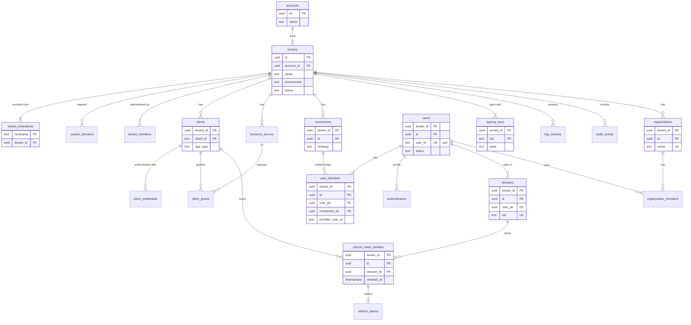

# Data model: Auth0

データモデルの正本。テーブル・列・キー・索引・パーティション・保持と、DB の外のストア（Valkey、S3、SQS、ログの形）を、ここと `data-model/` の各ファイルにまとめる。

- テナントの分け方は [ADR-0002](../decisions/0002-tenancy-and-isolation.md)、トークンと署名鍵は [ADR-0003](../decisions/0003-token-formats-and-signing-keys.md)、資格情報の保存は [ADR-0004](../decisions/0004-credential-storage.md)、認証の経路の縮退は [ADR-0005](../decisions/0005-authentication-path-availability.md)、鍵の階層は [ADR-0045](../decisions/0045-kms-key-hierarchy.md) に従う。
- **形（テーブル・列・キー・索引）はこの文書と `data-model/` を正とする。** 振る舞い（いつ書くか、誰が読めるか、期限の値）は、各領域の文書を正とする。両者が食い違ったら、実装を止めて Dev（テックリード）に確かめる。
- 実装の変更（`changes/`）でマイグレーションを書くときは、この文書と各領域の文書を同じ PR で直す。
- 2026-09-27 に全領域の「data-model への項目」を照合し、2026-09-28 に列の定義まで揃えた。決めたことと、直した領域の文書は 9 節にある。

## 1. 文書の構成

量が多いので、領域ごとにファイルを分けた。

| ファイル | 内容 | テーブル数 | ER 図 |
| --- | --- | --- | --- |
| この文書 | 規約、テナントの外の表、全体の ER 図、テーブルの索引、横断的な不変条件、テナントのコンテキスト、決めたこと | — | 1 |
| [data-model/tenancy-and-applications.md](data-model/tenancy-and-applications.md) | アカウント、テナント、ホスト名の解決、設定の版、メンバー、アプリ、資格情報、API、M2M の許可、カスタムドメイン | 13 | 2 |
| [data-model/users-and-connections.md](data-model/users-and-connections.md) | ユーザー、墓標、ID、接続、パスワード、識別子、チケット、IdP のトークン。後のインポート・エクスポート、SCIM、エンタープライズ接続 | 16 | 2 |
| [data-model/mfa-and-attack-protection.md](data-model/mfa-and-attack-protection.md) | 認証器、TOTP、WebAuthn、リカバリーコード、メールの OTP、登録のチケット、ブルートフォースのブロック、漏えいしたパスワードの版 | 8 | 1 |
| [data-model/login-and-sessions.md](data-model/login-and-sessions.md) | ログインのトランザクション、認可コード、リフレッシュトークン、同意、デバイス認可、`jti`、PAR、セッション、Back-Channel Logout、ブランディング、規約と同意の記録 | 15 | 2 |
| [data-model/keys-and-secrets.md](data-model/keys-and-secrets.md) | 署名鍵（Signer が読む表）、鍵の操作、JWKS の書き出し、外部 IdP の鍵、テナントの DEK、pepper の版 | 8 | 1 |
| [data-model/email-and-logs.md](data-model/email-and-logs.md) | メールのテンプレート・事業者・送信ドメイン・送信の待ち・記録・抑止、ログストリーム、ログのクラスタの表 | 10 | 2 |
| [data-model/organizations-and-actions.md](data-model/organizations-and-actions.md) | Organizations（E14）と Actions（E13） | 12 | 2 |
| [data-model/operations.md](data-model/operations.md) | 監査、outbox、サポートの参照、リーガルホールド、DR、レート制限の上書き、非常用の経路、ダッシュボードの設定 | 10 | 1 |
| [data-model/stores.md](data-model/stores.md) | Valkey のキー、S3 のキー、認証のイベントの形、ログストリームの本文、outbox の事象、SQS | — | — |

合計 92 テーブル（MVP 73、MVP の後 19）。ER 図は、全体図 1 つと領域ごとの図 13 個。

## 2. 規約

### 2.1 使うストア

| ストア | 役割 | 正本か | 失ったとき |
| --- | --- | --- | --- |
| Aurora PostgreSQL 18（主。東京が主、大阪は Global Database の二次） | テナントの設定、ユーザー、資格情報、セッション、トークン、署名鍵の暗号文、監査ログ（1 年）、outbox | 正本 | バックアップと PITR（[infrastructure.md](infrastructure.md) の 6 節） |
| Aurora PostgreSQL 18（ログ。大阪は headless の二次） | 認証のイベント（`logs`）、Action の実行の記録。主のクラスタと接続プールもロールも分ける（[ADR-0043](../decisions/0043-log-storage-and-search.md)） | ログの正本 | SQS に溜まり、回復後に取り込む。検索は 503 |
| Signer の DB のロール `signer`（主の Aurora の中） | Signer が読む 4 つの表だけ（[ADR-0059](../decisions/0059-signer-isolation.md)） | — | 主の Aurora と同じ |
| Valkey（ElastiCache） | セッションのキャッシュ、レート制限、攻撃の防御の数、`jti`、漏えいしたパスワードの範囲のキャッシュ、設定の変更の pub/sub | 正本ではない | 正しさは保たれる（ADR-0005）。形は [data-model/stores.md](data-model/stores.md) の 1 節 |
| 各タスクのメモリー | テナントの設定のスナップショット（[ADR-0032](../decisions/0032-tenant-config-cache.md)）、ホスト名の対応表（[ADR-0039](../decisions/0039-hostname-resolution-and-issuer.md)）、Signer の復号した鍵（[ADR-0063](../decisions/0063-cpu-bound-work-sizing.md)）、pepper、テナントの DEK の LRU | 正本ではない | DB から作り直す |
| S3 | discovery・JWKS、Universal Login の資産、漏えいしたパスワードのデータ（法務の確認の後）、インポート・エクスポート（後）、調査用の Parquet（90 日）、log-archive（Object Lock）、Action の束（後） | JWKS は正本ではない（DB から作る）。log-archive は監査の保管の正本 | バージョニングと大阪への複製。形は [data-model/stores.md](data-model/stores.md) の 2 節 |
| SQS | Relay から Worker へのきっかけ | 正本ではない | Relay が outbox から再送する |
| Secrets Manager | pepper の暗号文、基盤の秘密 | pepper の暗号文の正本（予備は log-archive） | log-archive の暗号文から戻す |
| DynamoDB | 使わない | — | — |

- 開発・ステージング・本番のテナントは、同じクラスタに `tenants.environment` の違いで入る（ADR-0002）。
- 課金と金額は扱わない。金額の型は使わない。

### 2.2 ID

- **ID は UUIDv7**（ADR-0002）。既定値は PostgreSQL 18 の `uuidv7()`。UUIDv7 は作成の時刻を含むので、そのまま外に出さない。
- 例外：

  | 列 | 形 | 理由 |
  | --- | --- | --- |
  | `users.user_id` | `usr_` ＋ 22 文字、またはインポートで指定した値 | `sub`。接続から独立し、再利用しない（[ADR-0018](../decisions/0018-user-identifier-and-profile-store.md)） |
  | `clients.client_id` | 32 文字の base62 の乱数 | 主キーそのもの（2026-09-28 に決めた。外に出す値で結合する） |
  | `signing_keys.kid` | RFC 7638 の thumbprint | 主キーそのもの |
  | `logs.log_id` | 26 文字の Crockford base32 | 取り込みの時点で単調に採番（[ADR-0042](../decisions/0042-log-event-model-and-type-codes.md)） |
  | `outbox` の主キー | `(created_at, id)` | 時刻で分割するため |

- **外に出す ID** は、`uuid` を base62 にして種類の接頭辞を付ける（`org_`・`con_` など。接頭辞の一覧は Management API の領域で決める）。DB には `uuid` で持つ。秘密の接頭辞（`<brand>_rt_`・`<brand>_cs_`・`<brand>_scim_`）は ID ではなくトークンにだけ使う（リポジトリ共通の ADR-0006）。

### 2.3 テナンシーと RLS

テナントテーブルは次の形にそろえる（ADR-0002）。

```sql
CREATE TABLE <t> (
  tenant_id uuid NOT NULL REFERENCES tenants (id),
  id        uuid NOT NULL DEFAULT uuidv7(),
  ...
  PRIMARY KEY (tenant_id, id)
);
ALTER TABLE <t> ENABLE ROW LEVEL SECURITY;
ALTER TABLE <t> FORCE ROW LEVEL SECURITY;
CREATE POLICY tenant_isolation ON <t>
  USING      (tenant_id = current_setting('app.tenant_id')::uuid)
  WITH CHECK (tenant_id = current_setting('app.tenant_id')::uuid);
```

- 主キー・外部キー・索引の先頭は `tenant_id`。外部キーは `tenant_id` を含む複合キーにし、別のテナントの行を参照するデータを DB が拒否する。
- `current_setting` は `missing_ok` なしで呼ぶ。コンテキストの設定を忘れたらエラーになる（安全側）。
- **テナントの解決の前に、テナントテーブルを読まない。** 解決は各タスクのメモリーの対応表で行い、その正本の `tenant_hostnames` は RLS の外（3 節）。
- ログのクラスタも同じ規則。クラスタをまたぐ外部キーは張れないので、`logs.tenant_id` は取り込みのスキーマの検証と `WITH CHECK` で守る。
- パーティションの表と、パーティションの表を指す外部キーは張らない（2.8 節）。

DB のロール：

| ロール | 使うサービス | 権限 | 定めた場所 |
| --- | --- | --- | --- |
| `migrator` | マイグレーション | 所有者。FORCE RLS の対象 | ADR-0002 |
| `auth_app` | Auth | テナントテーブルを RLS の下で読み書き。`BYPASSRLS` なし。解決の関数の実行 | ADR-0002 |
| `mgmt_app` | Management API、ダッシュボードの API | RLS の対象。テナントの外の表のうち、書き込みの関数（テナントの作成、`tenant_hostnames`・`signing_key_state_versions` の遷移）だけを実行できる | ADR-0002 |
| `worker` | Worker | RLS の対象。ジョブごとにテナントのコンテキストを設定する | ADR-0002 |
| `signer` | Signer | `signing_keys`・`signing_key_state_versions`・`signing_key_issuers`・`external_idp_keys` の SELECT と、`signing_keys.last_used_at` の UPDATE だけ | [ADR-0059](../decisions/0059-signer-isolation.md) |
| `relay` | Relay | `outbox`・`email_outbox` の SELECT と送信済みの印、`audit_events.prev_hash` の設定の関数 | ADR-0005、[ADR-0054](../decisions/0054-audit-log.md) |
| `platform` | テナントをまたぐ管理の処理（テナントの作成・削除、保持のジョブ、課金の集計） | RLS を迂回できる。操作はプラットフォームの監査へ | ADR-0002 |
| `log_ingest`・`log_reader`・`log_pseudonymizer`（ログのクラスタ） | 取り込み、検索とストリームの送り手、ユーザーの削除の仮名化 | RLS の対象。書き手は `WITH CHECK` で行ごとの `tenant_id` を確かめる。`log_pseudonymizer` は `logs.user_name` の UPDATE だけ | ADR-0043、この文書（2026-09-28） |

テナントをまたぐ正当な読み取りは、次の `SECURITY DEFINER` の関数だけで行う。関数は引数で必ず絞り、決まった列だけを返す。受け取った側は、返った `tenant_id` でコンテキストを設定してから、行を RLS の下で読み直す。

| 関数 | 用途 | 呼ぶロール |
| --- | --- | --- |
| `resolve_hostnames(since_version)` | ホスト名の対応表の全件と差分 | 全タスク |
| `tenant_create(...)`、`tenant_hostname_transition(...)` | テナントの作成（名前の墓標の確認を含む）、ホスト名の足し引き | `mgmt_app` |
| `dashboard_list_my_tenants(member_user_id)` | ダッシュボードの「自分のテナント」 | `mgmt_app` |
| `scheduler_due_items(kind, until, limit)` | 期限の来た行の `tenant_id` と主キー（カスタムドメインの確認、Back-Channel Logout の再試行、鍵の操作の監視、保持の削除、ユーザーの墓石の物理削除） | `worker` |
| `email_find_by_provider_id(provider_message_id)` | SES の結果の事象からテナントを得る | `worker` |

### 2.4 命名

- テーブル名は複数形の snake_case。列名は snake_case。
- **ユーザーを指す列は `user_pk`**（`users.id`。2026-09-27 に決めた）。`user_id` は外に出す値（`sub`）の列の名前で、`users` と `logs` だけが持つ。
- **管理者を指す列は `member_user_id`（`text`）**。管理者は管理用のテナント（`admin`）のユーザーで、テナントをまたいで属するので、テナントの中の `user_pk` では指せない。値は管理用のテナントの `user_id`（管理者のトークンの `sub`）。使う列：`account_members`・`tenant_members`・`dashboard_preferences` の `member_user_id`、`tenant_members.invited_by`、`email_templates.updated_by`、`support_access_grants.granted_by` など（2026-09-28 に決めた）。
- 外部キーの列は `<参照先の単数>_id`。ただしアプリは `client_id`（外の値）で指す。
- 時刻は `<過去分詞>_at`。真偽値は `is_`・`has_` か、本家の設定の名前（`require_pkce` など）に合わせる。状態は `status` か `state`（領域の文書の呼び方に合わせる）。
- 秘密の列の接尾辞は 2.7 節。
- 本家の製品の内部の表名・項目名は使わない（リポジトリ共通の ADR-0006）。本家の公開の API の項目名（`app_metadata`、`client_metadata` など）は、互換のために使う。

### 2.5 型

| 用途 | 型 | 規則 |
| --- | --- | --- |
| ID | `uuid` | 2.2 節 |
| 件数・連番・版 | `bigint`（小さいものは `integer`・`smallint`） | |
| 時刻 | `timestamptz` | UTC で保存する |
| 期間 | `integer`（秒・分・日） | 列名に単位を付ける（`session_idle_minutes`、`interval_seconds`）。`interval` 型は使わない |
| 列挙 | `text` ＋ `CHECK (x IN (...))` | `ENUM` 型は使わない（値の追加を expand / contract で扱うため） |
| 設定・メタデータ | `jsonb` | Zod で検証してから書く。大きさの上限は `CHECK (octet_length(x::text) <= n)` |
| 小さな集合 | `text[]`・`uuid[]` | スコープ、URL、ロールの名前など。外部キーを張れないので、書き込みの関数で確かめる |
| ハッシュ・暗号文 | `bytea`（PHC の文字列だけ `text`） | 2.7 節 |
| IP | `inet`・`cidr` | |

### 2.6 時刻の列と削除

- ほぼすべての表に `created_at timestamptz NOT NULL DEFAULT now()` を持たせる。更新される表は `updated_at` も持ち、書き込みの関数で更新する（トリガーは使わない）。
- 削除の形：

| 形 | 使う表 | 規則 |
| --- | --- | --- |
| **墓石** | `users` | 行を残してプロフィールを消し、`deleted_at` を付ける。30 日後に物理削除（[ADR-0055](../decisions/0055-data-retention-and-deletion.md)） |
| **墓標（消さない）** | `user_tombstones`、`tenant_name_tombstones` | 再利用の禁止のために、値の HMAC か名前だけを残す |
| **論理削除（猶予）** | `tenants`（`deleting` の 30 日）、`custom_domains`（`deleting` の 30 日） | 猶予の後に `platform` が物理削除する |
| **失効の印** | `refresh_token_families.revoked_at`、`client_credentials.revoked_at`、`signing_keys.state = 'revoked'`、`sessions.ended_at` | 行は保持の期間まで残し、再利用の検知・監査・表示に使う |
| **追記だけ** | `audit_events`、`platform_audit_events`、`consent_records` | UPDATE・DELETE の権限をアプリのロールに与えない |
| **物理削除** | 関係の表、資格情報（ユーザーの削除と同じトランザクション） | その場で `DELETE` |
| **パーティションの `DROP`** | 2.8 節の表 | 期限を過ぎたパーティションごと落とす |

- 保持の期間の正本は [security.md](security.md) の 9 節（ADR-0055）。**期間はすべて既定案で、法務の確認（L1・L5・L7・L8）で確定する。** リーガルホールドは保持の期限に優先する。
- テナントの削除では、全テナントテーブルを子から順に消し、最後に DEK と鍵の暗号文を消す（暗号の消去）。表の一覧は、マイグレーションの lint と同じ定義から得る。

### 2.7 秘密の列と暗号化

**列の型を、秘密の種類で決める**（ADR-0004）。

| 種類 | 列 | 例 |
| --- | --- | --- |
| 人の選ぶ秘密・低エントロピーの秘密 | `*_hash`（`text`、PHC 形式。Argon2id＋pepper の版） | `password_credentials.password_hash`、`password_history.password_hash`、`recovery_codes.code_hash`、`credential_tickets.code_hash` |
| 短いコードの鍵付きハッシュ | `*_hmac`・`*_hash`（`bytea`、HMAC-SHA-256。pepper かテナントの鍵） | `otp_challenges.code_hmac`、`device_authorizations.user_code_hash`、`brute_force_blocks.identifier_hmac`、`email_messages.to_hash`、`user_tombstones.user_id_hmac` |
| 高エントロピーの秘密 | `*_hash`（`bytea`、SHA-256） | `authorization_codes.code_hash`、`refresh_tokens.token_hash`、`client_credentials.secret_hash`、`sessions.secret_hash`、`login_transactions.handle_hash`、`credential_tickets.secret_hash`、`scim_tokens.token_hash`、各種の `ticket_hash`・`token_hash` |
| 戻す必要のある秘密 | `*_ciphertext`（`bytea`、AES-256-GCM、AAD 付き）とテナントの DEK の版 | `totp_secrets.secret_ciphertext`、`connections.secrets_ct`、`idp_tokens.ciphertext`、`log_streams.sink_ciphertext`、`email_providers.secret_ct`、`action_secrets.ciphertext`、`email_outbox.secret_vars_ciphertext` |
| 署名の秘密鍵 | `*_ciphertext`（Signer だけが復号できる） | `signing_keys.private_key_ciphertext`、`external_idp_keys.private_key_ciphertext` |

- マイグレーションの CI で、`password`・`secret`・`token`・`code`・`seed`・`private_key` を含む名前の列が、上のどれかであることを確かめる（[delivery.md](delivery.md) の 2.1 節）。既存の名前の `secrets_ct`・`secret_ct` は `*_ciphertext` と同じ扱いにする。新しい列は `*_ciphertext` にする。
- 秘密の比較は定数時間で行う。

KMS の鍵の階層（正本は [keys-and-secrets.md](keys-and-secrets.md) の 3 節、ADR-0045）：

| KMS の鍵 | 包むもの | DB の列 | 復号できる主体 |
| --- | --- | --- | --- |
| `<brand>-signing-keys` | 署名鍵ごとの DEK、外部 IdP の鍵ごとの DEK | `signing_keys.dek_ciphertext`、`external_idp_keys.dek_ciphertext` | Signer だけ |
| `<brand>-credentials` | テナントごとの DEK（版つき） | `tenant_data_keys.dek_ciphertext` | Auth・Management API・Worker |
| `<brand>-pepper` | pepper（暗号文は Secrets Manager） | `pepper_versions`（版と名前だけ） | Auth・Management API（`Decrypt` だけ） |
| `<brand>-data` | Aurora・S3・SQS・Secrets Manager の保存の暗号化 | — | AWS のサービス（`kms:ViaService`） |

- AAD は、署名鍵が `tenant_id|kid|alg`、テナントの DEK で包む秘密が `tenant_id|行の ID|用途`。DB の行を入れ替えても復号に失敗する。

### 2.8 パーティション

| 表 | クラスタ | 分割 | 単位 | 落とす時期 |
| --- | --- | --- | --- | --- |
| `login_transactions` | 主 | `RANGE (id)` | 1 日 | 2 日より古いもの |
| `authorization_codes` | 主 | `RANGE (id)` | 1 日 | 2 日より古いもの |
| `device_authorizations` | 主 | `RANGE (id)` | 1 日 | 2 日より古いもの |
| `pushed_authorization_requests`（後） | 主 | `RANGE (id)` | 1 日 | 2 日より古いもの |
| `email_outbox` | 主 | `RANGE (id)` | 1 日 | 2 日より古いもの |
| `email_messages` | 主 | `RANGE (id)` | 1 日 | 30 日を過ぎたもの |
| `outbox` | 主 | `RANGE (created_at)` | 1 日 | 全行が送られた日を 2 日後に |
| `audit_events`、`platform_audit_events` | 主 | `RANGE (id)` | 1 か月 | 1 年を過ぎ、log-archive にあると確かめたもの |
| `logs` | ログ | `RANGE (log_id)` | 取り込みの 1 日 | 31 日を過ぎたもの |
| `action_executions`（後） | ログ | `RANGE (id)` | 1 日 | 10 日を過ぎたもの |

- **時間で切る表は、UUIDv7 の `id` の範囲で切る**（2026-09-28 に決めた）。PostgreSQL は、分割した表の主キーと一意の制約に分割の鍵を含めることを求める。`created_at` で切ると主キー `(tenant_id, id)` を作れない。UUIDv7 は先頭 48 ビットが時刻なので、`id` の範囲がそのまま時間の範囲になる。境界は、時刻から作った UUIDv7 の下限（時刻の後を 0 で埋めた値）。
- **分割した表の「ハッシュでの引き当て」は、一意の制約ではなく普通の索引にする**（`login_transactions.handle_hash`、`authorization_codes.code_hash`、`device_authorizations.device_code_hash`、`pushed_authorization_requests.request_uri_hash`）。値は 256 ビットの乱数で、衝突しない前提にする。1 回限りの保証は、行の条件付きの更新（`... WHERE consumed_at IS NULL`）で守る。
- `outbox` は冪等の一意の制約を持たないので、`created_at` で切る（主キー `(created_at, id)`）。`logs` は `log_id` の先頭が取り込みの時刻なので、`log_id` で切る。
- パーティションの作成と削除は、定期のジョブ（`partition-maintenance`、1 日 1 回）で行い、7 日先まで作っておく。失敗は runbook の `log-partition-maintenance` で扱う。

### 2.9 規模の前提（S1）

各表の「S1 の規模」は、次の前提からの見積もり。E12 の負荷試験で置き換える。

| 項目 | 値 | 出典 |
| --- | --- | --- |
| テナント | 1 万（本番 3,000） | [capacity.md](capacity.md) の 1 節 |
| エンドユーザー | 2,000 万 | 同上 |
| 対話のログインのピーク | 500 件/秒（パスキー・ソーシャル 250 件/秒） | 同上 |
| トークンの発行のピーク | 3,000 件/秒（うちリフレッシュ 1,450 件/秒） | 同上 |
| 認証のイベント | ピーク 4,000 件/秒、1 日 約 1 億件 | 同上 |
| 平均とピークの比 | 平均をピークの 1/3〜4 割と仮定 | この文書の仮定 |

### 2.10 スキーマの変更

- 無停止の expand / contract で行う。列の削除・改名・型の変更・既定値のない `NOT NULL` の追加を、同じリリースで行わない。
- テナントテーブルの追加は、`tenant_id`、複合キー、`FORCE ROW LEVEL SECURITY`、ポリシーをマイグレーションの lint で検査する（ADR-0002 の Confirmation）。例外は 3 節の表と一致させる。
- 設定の表（[data-model/tenancy-and-applications.md](data-model/tenancy-and-applications.md) の `tenant_config_versions` の節の一覧）に書く関数が、版を上げる関数を呼んでいることを CI で確かめる（ADR-0032）。
- 個人データの列に、分類と保持の区分の注記を付ける（マイグレーションの lint。ADR-0055）。

## 3. RLS の例外（テナントの外の表）

RLS を掛けない表の全部。**ここにない表は、すべて `tenant_id` と RLS を持つ。** マイグレーションの CI の許可リストは、この表と一致させる。足すときは、この表を更新し、Dev のテックリードとセキュリティの担当の承認を得る（`security:sensitive`）。

| テーブル | RLS の外に置く理由 | 読める主体 | 書ける主体 | 定義 |
| --- | --- | --- | --- | --- |
| `accounts`、`account_members` | テナントの上の単位（請求・契約）。1 つのアカウントが複数のテナントを持つ | `mgmt_app`（関数経由、自分のアカウントだけ）、`platform` | `platform` | [tenancy](data-model/tenancy-and-applications.md) |
| `tenants` | テナントの解決と、コンテキストを決める前の読み取り。秘密を持たない | 解決の関数、`platform` | `platform` | 同上 |
| `tenant_name_tombstones` | 名前の再利用の禁止を、テナントをまたいで確かめる | 作成の関数 | `platform` | 同上 |
| `tenant_hostnames` | ホスト名 → テナントの解決はテナントの決定の前。一意はテナントをまたぐ | 解決の関数 | `mgmt_app` の遷移の関数だけ | 同上 |
| `tenant_config_versions` | 全タスクが全テナントの版を 5 秒ごとに読む。値は版と時刻だけ | 全タスク | 設定を書くトランザクション（関数） | 同上 |
| `signing_key_state_versions` | Signer が全テナントの鍵の版を 2 秒ごとに読む。値は版と時刻だけ（2026-09-28 に追加） | `signer`、`mgmt_app` | `mgmt_app` の遷移の関数だけ | [keys](data-model/keys-and-secrets.md) |
| `outbox`、`email_outbox` | Relay が全テナントの行を順に読む。行は `tenant_id` を持つ。`outbox` に秘密を入れない。`email_outbox` の秘密は暗号文で、送信の後に消す | `relay` | 各サービス（業務のトランザクションの中で。`WITH CHECK` で自分のテナント） | [operations](data-model/operations.md)、[email-and-logs](data-model/email-and-logs.md) |
| `pepper_versions` | pepper はテナントに属さない | `auth_app`、`mgmt_app` | `platform` | [keys](data-model/keys-and-secrets.md) |
| `breached_password_versions` | プラットフォームのデータセットの版 | `auth_app`、`worker` | `worker`（取り込みのジョブ） | [mfa-and-attack-protection](data-model/mfa-and-attack-protection.md) |
| `rate_limit_overrides` | Ops が扱う上書き。全タスクが読む | 全タスク | `platform`（Ops の承認） | [operations](data-model/operations.md) |
| `mgmt_api_deprecations` | 本システムの設定 | `mgmt_app` | `migrator` | 同上 |
| `platform_audit_events` | テナントをまたぐ操作と、`tenant_id` のない操作を含む | `platform`、監査のロール | 各サービス（追記だけ） | 同上 |
| `break_glass_tokens` | 運用者の非常用のトークンの記録（トークンは保存しない） | `platform` | 非常用の CLI | 同上 |
| `dashboard_preferences` | 管理者は複数のテナントに属する | `mgmt_app`（本人の行だけ。関数経由） | 同左 | 同上 |
| `legal_holds` | テナント単位の削除の停止。保持のジョブがテナントをまたいで読む | `platform`、保持のジョブ | `platform`（法務の指示） | 同上 |
| `dr_replay_runs` | DR の後のやり直しの記録。範囲は全テナント | `platform` | DR のジョブ | 同上 |
| `log_shard_state`（ログ） | 書き手の採番の状態。シャードは複数のテナントを含む | `log_ingest` | `log_ingest` | [email-and-logs](data-model/email-and-logs.md) |
| `log_stream_notify`（ログ） | 送り手に「どのテナントに新しいログがあるか」を知らせる。ログの中身を持たない | `log_reader` | `log_ingest` | 同上 |

- RLS の表の上の、テナントをまたぐ一意の索引：`custom_domains_active_hostname`（有効なカスタムドメインのホスト名）と `ldap_connectors (client_cert_fingerprint)`（後）。書き込みは `mgmt_app` の関数だけ。
- 運用者の期限つきの権限（JIT）の割り当ての正本は IAM Identity Center で、DB に持たない（[ADR-0056](../decisions/0056-operator-access.md)）。

## 4. 全体の ER 図

主な実体と関係だけを示す。列と細かい関係は、領域ごとの図にある。



## 5. テーブルの索引

「外」はテナントの外（RLS なし）、「内」はテナントテーブル。「段階」の MVP は S1 の MVP で作るもの、後は MVP の後（Epic は [roadmap.md](../roadmap.md)）。

| テーブル | ファイル | テナント | 段階 | 振る舞いを定める文書 |
| --- | --- | --- | --- | --- |
| `accounts` | [tenancy](data-model/tenancy-and-applications.md) | 外 | MVP | [tenants-and-applications.md](tenants-and-applications.md) の 3 節、ADR-0030 |
| `account_members` | 同上 | 外 | MVP | 同上 |
| `tenants` | 同上 | 外 | MVP | 同上、ADR-0002 |
| `tenant_name_tombstones` | 同上 | 外 | MVP | 同上の 3.2 節 |
| `tenant_config_versions` | 同上 | 外 | MVP | 同上の 7 節、ADR-0032 |
| `tenant_hostnames` | 同上 | 外 | MVP | [custom-domains.md](custom-domains.md) の 3.1 節、ADR-0039 |
| `tenant_members` | 同上 | 内 | MVP | [dashboard.md](dashboard.md) の 5 節 |
| `tenant_member_invitations` | 同上 | 内 | MVP | [tenants-and-applications.md](tenants-and-applications.md) の 3.5 節 |
| `clients` | 同上 | 内 | MVP | 同上の 4 節、ADR-0031 |
| `client_credentials` | 同上 | 内 | MVP | 同上の 4.3 節、ADR-0007 |
| `resource_servers` | 同上 | 内 | MVP | 同上の 5 節 |
| `client_grants` | 同上 | 内 | MVP | 同上の 6 節、ADR-0034 |
| `custom_domains` | 同上 | 内 | MVP | [custom-domains.md](custom-domains.md)、ADR-0038 |
| `users` | [users](data-model/users-and-connections.md) | 内 | MVP | [users-and-profiles.md](users-and-profiles.md) の 3 節、ADR-0018 |
| `user_tombstones` | 同上 | 内 | MVP | 同上の 7 節、ADR-0020 |
| `user_identities` | 同上 | 内 | MVP | 同上の 3・5 節、ADR-0014、ADR-0019 |
| `connections` | 同上 | 内 | MVP | [connections.md](connections.md) の 3 節 |
| `connection_clients` | 同上 | 内 | MVP | 同上 |
| `password_credentials` | 同上 | 内 | MVP | 同上の 4 節、ADR-0004、ADR-0015 |
| `password_history` | 同上 | 内 | MVP | 同上の 4.2 節 |
| `database_identifiers` | 同上 | 内 | MVP | 同上の 4.1 節 |
| `credential_tickets` | 同上 | 内 | MVP | 同上の 4.3〜4.6 節 |
| `idp_tokens` | 同上 | 内 | MVP | 同上の 5.5 節、ADR-0016 |
| `user_import_jobs` | 同上 | 内 | 後 | [users-and-profiles.md](users-and-profiles.md) の 8 節 |
| `user_export_jobs` | 同上 | 内 | 後 | 同上 |
| `scim_tokens` | 同上 | 内 | 後 | 同上の 9 節 |
| `ldap_connectors` | 同上 | 内 | 後（E14） | [connections.md](connections.md) の 6 節、ADR-0017 |
| `connection_domains` | 同上 | 内 | 後（E14） | 同上 |
| `saml_assertion_replay` | 同上 | 内 | 後（E14） | 同上 |
| `authenticators` | [mfa](data-model/mfa-and-attack-protection.md) | 内 | MVP | [mfa-and-passkeys.md](mfa-and-passkeys.md) の 3・7 節、ADR-0021 |
| `totp_secrets` | 同上 | 内 | MVP | 同上の 5.1 節、ADR-0023 |
| `webauthn_credentials` | 同上 | 内 | MVP | 同上の 5.2 節、ADR-0022 |
| `recovery_codes` | 同上 | 内 | MVP | 同上の 5.4 節 |
| `otp_challenges` | 同上 | 内 | MVP | 同上の 5.3 節 |
| `authenticator_enrollment_tickets` | 同上 | 内 | MVP | 同上の 4.3 節 |
| `brute_force_blocks` | 同上 | 内 | MVP | [attack-protection.md](attack-protection.md) の 4 節、ADR-0024 |
| `breached_password_versions` | 同上 | 外 | MVP | 同上の 5.2 節、ADR-0025 |
| `login_transactions` | [login](data-model/login-and-sessions.md) | 内 | MVP | [universal-login.md](universal-login.md) の 4 節、ADR-0011 |
| `authorization_codes` | 同上 | 内 | MVP | [authentication-flows.md](authentication-flows.md) の 5 節、ADR-0006 |
| `refresh_token_families` | 同上 | 内 | MVP | 同上の 7 節、[sessions-and-sso.md](sessions-and-sso.md) の 7 節、ADR-0003、ADR-0029 |
| `refresh_tokens` | 同上 | 内 | MVP | 同上 |
| `grants` | 同上 | 内 | MVP | [authentication-flows.md](authentication-flows.md) の 5.6 節 |
| `device_authorizations` | 同上 | 内 | MVP | [authentication-flows.md](authentication-flows.md) の 7.4 節、ADR-0009 |
| `client_assertion_jtis` | 同上 | 内 | MVP | [authentication-flows.md](authentication-flows.md) の 6.1 節 |
| `pushed_authorization_requests` | 同上 | 内 | 後 | 同上の 10 節、ADR-0010 |
| `sessions` | 同上 | 内 | MVP | [sessions-and-sso.md](sessions-and-sso.md) の 3 節、ADR-0027 |
| `session_clients` | 同上 | 内 | MVP | 同上 |
| `backchannel_logout_deliveries` | 同上 | 内 | MVP | 同上、ADR-0028 |
| `branding_themes` | 同上 | 内 | MVP | [universal-login.md](universal-login.md) の 6 節、ADR-0012 |
| `branding_texts` | 同上 | 内 | MVP | 同上 |
| `legal_documents` | 同上 | 内 | MVP | 同上の 16 節、ADR-0013 |
| `consent_records` | 同上 | 内（追記だけ） | MVP | 同上 |
| `signing_keys` | [keys](data-model/keys-and-secrets.md) | 内 | MVP | [keys-and-secrets.md](keys-and-secrets.md) の 5 節、ADR-0046 |
| `signing_key_state_versions` | 同上 | 外 | MVP | 同上の 6.2 節、ADR-0047 |
| `signing_key_issuers` | 同上 | 内 | MVP | 同上の 6.1 節 |
| `signing_key_operations` | 同上 | 内 | MVP | 同上の 5.2 節、ADR-0060 |
| `jwks_publications` | 同上 | 内 | MVP | 同上の 7 節 |
| `external_idp_keys` | 同上 | 内 | MVP（Apple は E6）、E14 | 同上の 6.3 節、ADR-0047 |
| `tenant_data_keys` | 同上 | 内 | MVP | 同上の 3 節、ADR-0045 |
| `pepper_versions` | 同上 | 外 | MVP | 同上の 4 節 |
| `email_templates` | [email-and-logs](data-model/email-and-logs.md) | 内 | MVP | [email-delivery.md](email-delivery.md) の 6 節、ADR-0041 |
| `email_providers` | 同上 | 内 | MVP | 同上の 7 節 |
| `sending_domains` | 同上 | 内 | E11 | 同上の 5.2 節 |
| `email_outbox` | 同上 | 外 | MVP | 同上の 4 節、ADR-0040 |
| `email_messages` | 同上 | 内 | MVP | 同上の 8 節 |
| `email_suppressions` | 同上 | 内 | MVP | 同上 |
| `log_streams` | 同上 | 内 | MVP | [logs-and-streams.md](logs-and-streams.md) の 6 節、ADR-0044 |
| `logs`（ログ） | 同上 | 内 | MVP | 同上の 3〜5 節、ADR-0042、ADR-0043 |
| `log_shard_state`（ログ） | 同上 | 外 | MVP | 同上の 3.4 節 |
| `log_stream_notify`（ログ） | 同上 | 外 | MVP | 同上の 6.2 節 |
| `organizations` | [orgs-actions](data-model/organizations-and-actions.md) | 内 | 後（E14） | [organizations.md](organizations.md)、ADR-0051 |
| `organization_members` | 同上 | 内 | 後（E14） | 同上、ADR-0052 |
| `organization_roles` | 同上 | 内 | 後（E14） | 同上 |
| `organization_member_roles` | 同上 | 内 | 後（E14） | 同上 |
| `organization_connections` | 同上 | 内 | 後（E14） | 同上 |
| `organization_invitations` | 同上 | 内 | 後（E14） | 同上 |
| `organization_client_grants` | 同上 | 内 | 後（E14 の後） | 同上の 5.2 節 |
| `actions` | 同上 | 内 | 後（E13） | [extensibility.md](extensibility.md)、ADR-0050 |
| `action_versions` | 同上 | 内 | 後（E13） | 同上 |
| `action_secrets` | 同上 | 内 | 後（E13） | 同上 |
| `trigger_bindings` | 同上 | 内 | 後（E13） | 同上、ADR-0048 |
| `action_executions`（ログ） | 同上 | 内 | 後（E13） | 同上 |
| `audit_events` | [operations](data-model/operations.md) | 内（追記だけ） | MVP | [security.md](security.md) の 6 節、ADR-0054 |
| `platform_audit_events` | 同上 | 外（追記だけ） | MVP | 同上 |
| `support_access_grants` | 同上 | 内 | MVP | ADR-0056 |
| `legal_holds` | 同上 | 外 | MVP | ADR-0055 |
| `dr_replay_runs` | 同上 | 外 | MVP | ADR-0060 |
| `outbox` | 同上 | 外 | MVP | ADR-0005 |
| `rate_limit_overrides` | 同上 | 外 | MVP | [management-api-and-rate-limiting.md](management-api-and-rate-limiting.md) の 8 節、ADR-0035 |
| `mgmt_api_deprecations` | 同上 | 外 | MVP | 同上の 15 節 |
| `break_glass_tokens` | 同上 | 外 | MVP | [dashboard.md](dashboard.md) の 4.4 節、ADR-0037 |
| `dashboard_preferences` | 同上 | 外 | MVP | 同上 |

- 漏えいしたパスワードの範囲のデータ（SHA-1 の先頭 5 文字 → 接尾辞の一覧）は DB に置かない（[data-model/stores.md](data-model/stores.md) の 1・2 節）。
- Management API のチェックポイントのページングは DB に保存しない（暗号化した文字列に状態を持たせる）。

## 6. 横断的な不変条件

実装とテストで守る規則。DB の制約で守れるものは制約にし、守れないものは性質ベーステストで確かめる。

| # | 不変条件 | 守り方 | 決めた場所 |
| --- | --- | --- | --- |
| I-1 | テナントの中の行は、別のテナントの行を参照しない | 複合外部キー、RLS、テナントの外の表の許可リスト | [ADR-0002](../decisions/0002-tenancy-and-isolation.md) |
| I-2 | テナントの解決の前に、テナントテーブルを読まない。表にないホスト名は DB を読まずに 404 | メモリーのホスト名の対応表。解決の関数だけが `tenant_hostnames` を読む | ADR-0002、[ADR-0039](../decisions/0039-hostname-resolution-and-issuer.md) |
| I-3 | **`sub`（`user_id`）はテナントの中で再利用しない** | `UNIQUE (tenant_id, user_id)` と、削除のときの `user_tombstones` の HMAC。作成・インポートの関数が両方を見る。性質ベーステスト | [ADR-0018](../decisions/0018-user-identifier-and-profile-store.md)、[ADR-0020](../decisions/0020-user-search-and-lifecycle.md) |
| I-4 | `user_id` は作成の後に変わらない。接続の名前を変えても `sub` は変わらない | 更新の経路を作らない。`user_id` に接続の種類を含めない | ADR-0018 |
| I-5 | ユーザーは 1 つ以上の ID を持ち、（接続、`provider_user_id`）は 1 人のユーザーにだけ結び付く | `UNIQUE (tenant_id, connection_id, provider_user_id)`。解除の関数が主の ID を外さない | [ADR-0014](../decisions/0014-connection-abstraction.md)、[ADR-0019](../decisions/0019-account-linking.md) |
| I-6 | 認可コードは 1 回だけ交換できる。2 回目は、そのコードから作った系列を失効させる | `consumed_at IS NULL` の条件付きの更新。0 行なら `refresh_family_id` を `code_reuse` で失効 | [ADR-0006](../decisions/0006-authorization-code-pkce-and-exact-redirect.md)、[ADR-0003](../decisions/0003-token-formats-and-signing-keys.md) |
| I-7 | **リフレッシュトークンの再利用を検知したら、系列のすべてのトークンが以後の交換に失敗する** | 使用済みの行を系列が消えるまで残す。猶予の外の再使用、または最新の 2 つ以上前の再使用で `revoked_at` を設定（`reuse_detected`）。交換は系列の行の `FOR UPDATE` の下で、`revoked_at IS NULL` を確かめる | ADR-0003 |
| I-8 | 系列は 1 つの API に結び付き、スコープを広げない。`session` の系列はセッションより長く生きない | `audience` は 1 つ。スコープの部分集合の検査。`absolute_expires_at` ≤ セッションの最終の期限。セッションの終了で同じトランザクションに系列の失効 | [ADR-0008](../decisions/0008-token-lifetimes-and-claims.md)、[ADR-0029](../decisions/0029-refresh-token-session-binding.md) |
| I-9 | **署名の秘密鍵は Signer の外に出ない** | DB は暗号文だけ。DEK の `Decrypt` は Signer のロールだけ（KMS のキーポリシー）。`signer` の DB のロールは 4 つの表の SELECT と `last_used_at` の UPDATE だけ。Management API は `keys:generate` の暗号文だけを受け取る。失効で暗号文を消す | ADR-0003、[ADR-0045](../decisions/0045-kms-key-hierarchy.md)、[ADR-0047](../decisions/0047-signer-api-and-jwks-publishing.md)、[ADR-0059](../decisions/0059-signer-isolation.md) |
| I-10 | テナントの `current` と `next` の鍵はそれぞれ 1 つ、`previous` は 2 つまで。`revoked` は戻らない | 部分一意索引、遷移の関数 | [ADR-0046](../decisions/0046-signing-key-lifecycle.md) |
| I-11 | 秘密は種類ごとの形（ハッシュか暗号文）でだけ保存する | 2.7 節の列の規則と、マイグレーションの CI の名前の検査 | [ADR-0004](../decisions/0004-credential-storage.md) |
| I-12 | ログ・outbox・監査の差分・ストリームに秘密を入れない | 許可リストのスキーマ、秘密の形の走査、性質ベーステスト | [ADR-0061](../decisions/0061-secret-free-telemetry.md)、[ADR-0054](../decisions/0054-audit-log.md) |
| I-13 | 有効なカスタムドメインのホスト名は、テナントをまたいで 1 つ | `custom_domains_active_hostname` と `tenant_hostnames` の主キー | [ADR-0038](../decisions/0038-custom-domain-verification-and-certificates.md) |
| I-14 | テナントの名前は、削除の後も再利用しない | `UNIQUE (region, name)` と `tenant_name_tombstones` | [ADR-0030](../decisions/0030-accounts-tenants-and-members.md) |
| I-15 | 設定の表を変えたトランザクションは、同じトランザクションでテナントの設定の版を上げる | 書き込みの関数と CI の静的な検査 | [ADR-0032](../decisions/0032-tenant-config-cache.md) |
| I-16 | 監査の対象の操作が成功したら、同じトランザクションに監査ログが 1 件ある。監査ログは追記だけ | アプリのロールに UPDATE・DELETE を与えない。表駆動の結合テスト | ADR-0054 |
| I-17 | 規約の同意は、ユーザーの作成と同じトランザクションで書く。記録は追記だけ | `consent_records` の INSERT だけの権限 | [ADR-0013](../decisions/0013-consent-records.md) |
| I-18 | TOTP のコード・OTP・リカバリーコード・チケットは 1 回だけ使える | `last_used_step`・`consumed_at`・`used_at` の条件付きの更新（writer） | [ADR-0023](../decisions/0023-otp-and-recovery-codes.md)、ADR-0005 |
| I-19 | WebAuthn の資格情報の ID は、（テナント、RP ID）の中で 1 人のユーザーにだけ結び付く | `UNIQUE (tenant_id, rp_id, credential_id)` | [ADR-0022](../decisions/0022-webauthn-and-passkeys.md) |
| I-20 | テナントの中の `log_id` はコミットの順に単調に増える。ストリームのカーソルは前へだけ進む | シャードの唯一の書き手。カーソルは成功の後にだけ更新 | [ADR-0042](../decisions/0042-log-event-model-and-type-codes.md)、[ADR-0044](../decisions/0044-log-stream-delivery.md) |
| I-21 | 組織の名前は変わらない。組織の系列は、メンバーでなくなったら使えない | 更新の関数が拒否。リフレッシュのたびのメンバーシップの確認と、削除での失効 | [ADR-0052](../decisions/0052-organization-tokens-sessions-and-membership.md) |
| I-22 | ユーザーを消したら、同じトランザクションで資格情報・ID・セッション・系列が消え、以後ログインもトークンの更新もできない | 削除の関数。外部キーの `ON DELETE CASCADE` | [ADR-0055](../decisions/0055-data-retention-and-deletion.md) |
| I-23 | テナントを消したら、DEK と鍵の暗号文が消え、バックアップの暗号文も復号できない | 削除の最後に `tenant_data_keys`・`signing_keys`・`external_idp_keys` を消す | ADR-0045、ADR-0055 |
| I-24 | Valkey・SQS・S3 の JWKS・メモリーを失っても、DB から作り直せる。1 回限りの保証を Valkey に持たせない | 配信経路に正本を置かない | [ADR-0005](../decisions/0005-authentication-path-availability.md) |

## 7. テナントのコンテキスト

```
要求 ─▶ ホスト名 → tenant_id（メモリーの対応表。なければ DB を読まずに 404）
      ─▶ 設定のスナップショット（メモリー。版で確かめる）
      ─▶ DB を使うとき：BEGIN; SET LOCAL app.tenant_id = …
      ─▶ ハンドラー（以降のクエリはすべて RLS の下）
      ─▶ COMMIT（SET LOCAL の値はここで消える）
```

- Management API は、パスのテナント（`/api/v2/*` はホスト名、ダッシュボードの `/api/tenants/{tenant}/v2/*` はパス）で同じ手順を踏み、トークンの許可を `client_grants`・`tenant_members` で確かめる（[ADR-0034](../decisions/0034-management-api-authorization.md)）。
- Worker は、ジョブが持つ `tenant_id` でコンテキストを設定してから処理する。テナントをまたいで行を探すときは 2.3 節の関数を使う。
- Signer は、署名の要求の `tenant_id` でコンテキストを設定してから `signing_keys` を読む。
- Argon2id の計算の間、トランザクションを開いたままにしない（[capacity.md](capacity.md) の 2.5 節）。

## 8. 段階ごとの変化

| 段階 | 変化 |
| --- | --- |
| S2 | ユーザー・資格情報・セッション・リフレッシュトークン・認可コードを、`tenant_id` のハッシュで複数の Aurora のクラスタに分ける（同じテナントの行は同じクラスタ）。大口のテナントを専用のクラスタへ。認証のイベントのログを専用の基盤へ（[architecture/README.md](README.md) の 2 節）。すべての主キー・索引が `tenant_id` で始まるので、表の形は変えない |
| S3 | テナントをセルに固定し、テナントのデータはセルの中に閉じる。ホスト名 → テナント → セルの対応表をセルの外（Global）に置く（[ADR-0060](../decisions/0060-disaster-recovery-and-stages.md)、[infrastructure.md](infrastructure.md) の 11 節） |

## 9. 決めたこと

### 9.1 統合で決めたこと（2026-09-27）

| 論点 | 決定 |
| --- | --- |
| `client_credentials` と `client_secrets`・`client_public_keys` の重なり | `client_credentials` の 1 つの表にした。authentication-flows の 6.1・17 節を揃えた |
| `refresh_token_families` の列が複数の領域に散っていた | 1 つの定義にまとめた（`session_id`・`binding`、`organization_id`、`dpop_jkt` を含む）。今は [login-and-sessions.md](data-model/login-and-sessions.md) にある |
| ユーザーを指す列の名前（`user_id` と `user_pk` の混在） | 参照の列は `user_pk` に揃えた（2.4 節） |
| `grants` と `consent_records` | `grants` は OAuth の同意、`consent_records` は規約への同意。名前はそのまま |
| `tenant_hostnames` と `custom_domains` の分担 | `custom_domains` はテナントテーブルでドメインの状態を持つ。`tenant_hostnames` は解決用の RLS の外の表で、`ready` のドメインと標準のホスト名だけを持つ |
| `email_outbox` と共通の `outbox` | 別の表にした（秘密の暗号文、期限切れの破棄、送信の後の消去があるため） |
| テナントの外の表の一覧 | 3 節にすべて挙げ、理由と主体を書いた |
| Signer の DB のロール | `signing_keys` に、`signing_key_state_versions`・`signing_key_issuers`・`external_idp_keys` を足した（ADR-0059 を揃えた） |
| 外部 IdP の秘密鍵の置き場所 | Signer だけが復号できる `external_idp_keys` に置く（ADR-0047） |

### 9.2 列の定義まで揃えたときに決めたこと（2026-09-28）

PM の方針（既定案・推奨案で進める）により、次のとおり決めた。アーキテクチャの決定（ADR）は変えていない。

| # | 論点 | 決定 | 理由 |
| --- | --- | --- | --- |
| D-1 | この文書の役割 | 索引から、形の正本に変えた。領域ごとに `data-model/` へ分けた | 列・索引・規模を 1 か所で見られるようにする。振る舞いの正本は領域の文書のまま |
| D-2 | 時間で切る表の分割の鍵 | UUIDv7 の `id` の範囲で切る（2.8 節）。旧い `audit_events` の `RANGE (occurred_at)` は作れない定義だったので直した | PostgreSQL は主キーに分割の鍵を求める |
| D-3 | 分割した表のハッシュの引き当て | 一意の制約ではなく普通の索引にし、1 回限りは条件付きの更新で守る。`login_transactions` の `UNIQUE (handle_hash)` を外した | 同上。値は 256 ビットの乱数 |
| D-4 | `signing_key_state_versions` | テナントの外の表にした（3 節） | Signer が全テナントの版を 1 回で読むため。行は版と時刻だけで、`tenant_config_versions` と同じ扱い |
| D-5 | `credential_tickets.secret_hash` が SHA-256 と Argon2id を 1 つの列で持っていた | リンクは `secret_hash`（`bytea`、SHA-256）、コードは `code_hash`（`text`、PHC）に分けた | 2.7 節の型の規則に合わせ、`CHECK` で目的と結ぶ |
| D-6 | `clients` の主キー | `(tenant_id, client_id)`。`uuid` の `id` を持たない | 他の表がすべて `client_id` で指している |
| D-7 | 管理者を指す列 | `member_user_id`（`text`、管理用のテナントの `sub`）に揃えた。`email_templates.updated_by`・`support_access_grants.granted_by` の `uuid` を直した | 管理者はテナントをまたぐので `user_pk` で指せない |
| D-8 | Valkey のキーの形 | `<用途>:{t:<tenant_id>}:...`、IP は HMAC（[stores.md](data-model/stores.md) の 1 節） | sessions-and-sso と attack-protection の形が management-api の規則と違っていた |
| D-9 | ログストリームのリース | DB の行（`log_streams.lease_owner`・`lease_expires_at`）にした | logs-and-streams が「Valkey か DB」と決めていなかった。Valkey は失われうる（ADR-0005） |
| D-10 | `brute_force_blocks` の一意 | `UNIQUE NULLS NOT DISTINCT` にした | `ip_prefix` が NULL（アカウントのロック）の行が重複しうる |
| D-11 | Organizations のブランド、API のスコープ | `organizations.branding`（`jsonb`）と `resource_servers.scopes`（配列）。別の表 `organization_branding`・`resource_server_scopes` は持たない | 領域の文書の列の一覧に合わせ、図の側を直した |
| D-12 | 足りなかった列 | `login_transactions.webauthn_challenge`、`authenticators.lock_count`、`authorization_codes.organization_id`、`email_providers.secret_key_ver`、`action_secrets.data_key_version`、`log_streams.format`・`data_key_version`・`lease_*`、`device_authorizations.interval_seconds`（旧 `interval`）を足した。`device_authorizations.user_code_hash` は HMAC にした | 振る舞いの文書が求めるのに列がなかった |
| D-13 | 定義のなかった表 | `sending_domains`、`authenticator_enrollment_tickets`、`email_outbox`、`user_import_jobs`・`user_export_jobs`、`scim_tokens`、`ldap_connectors`、`connection_domains`、`saml_assertion_replay`、`organization_client_grants`、`breached_password_versions` を最小の形で決めた | 索引に名前だけがあった |
| D-14 | `consent_records.user_pk` の外部キー | 張らない | ユーザーの削除の後の扱いが法務の L7・L8 で未決。外部キーがあると墓石の物理削除を止める |
| D-15 | 外に出す ID の形 | `<接頭辞>_` ＋ `uuid` の base62（`org_` と同じ形）。接頭辞の一覧は Management API の領域で決める | ログの例の `con_...` と、組織の `org_` を揃える |

### 9.3 この日に直した領域の文書

| 文書 | 直したところ |
| --- | --- |
| [tenants-and-applications.md](tenants-and-applications.md) | 3.1 節の図から `resource_server_scopes` を外した（D-11） |
| [organizations.md](organizations.md) | 3 節の図の `organization_branding` を `organizations.branding` の列にした（D-11） |
| [connections.md](connections.md) | 3.1 節の `credential_tickets` を `secret_hash`・`code_hash` に分けた（D-5） |
| [universal-login.md](universal-login.md) | 4 節の `login_transactions` を日ごとの分割にし、`UNIQUE (handle_hash)` を索引にし、`webauthn_challenge` を足した。削除を 1 時間ごとのジョブからパーティションの `DROP` にした（D-2、D-3、D-12） |
| [sessions-and-sso.md](sessions-and-sso.md) | 3.5 節の Valkey のキーを `sess:{t:<tenant_id>}:<secret_hash>` にした（D-8） |
| [attack-protection.md](attack-protection.md) | 4.3 節の Valkey のキーの IP を HMAC にし、`brute_force_blocks` の一意を `NULLS NOT DISTINCT` にした（D-8、D-10） |
| [logs-and-streams.md](logs-and-streams.md) | 6.2 節のリースを DB の行に決めた（D-9） |
| [mfa-and-passkeys.md](mfa-and-passkeys.md) | 3.2 節の `authenticators` に `lock_count` を足した（D-12） |
| [authentication-flows.md](authentication-flows.md) | 17 節の `authorization_codes` に `organization_id`、`device_authorizations` を `interval_seconds` と HMAC に（D-12） |
| [email-delivery.md](email-delivery.md) | 6 節の `updated_by` を `text` に、7 節に `secret_key_ver` を足した（D-7、D-12） |
| [keys-and-secrets.md](keys-and-secrets.md) | 14 節の `signing_key_state_versions` をテナントの外と書いた（D-4） |
| [capacity.md](capacity.md) | 2.6 節の Valkey の用途の「ログインのトランザクションの状態」を、`jti` と PoW のチャレンジに直した（ADR-0011 はトランザクションを Valkey に置かない） |
| [README.md](README.md)、[roadmap.md](../roadmap.md)、[ADR-0013](../decisions/0013-consent-records.md)、organizations・sessions-and-sso・authentication-flows の data-model の節 | この文書の節の番号が変わったので、参照の先を直した（ADR-0013 は参照の節の番号だけ。決定は変えていない）。README の 6 節に 2026-09-28 の決定を足し、7 節の表の役割を「正本」にした |

### 9.4 持ち越し

| 項目 | いつ・どう決めるか |
| --- | --- |
| **`refresh_tokens` の行の数**：再利用の検知のため使用済みの行を系列の寿命まで残すと、S1 で十数億行になりうる（[login-and-sessions.md](data-model/login-and-sessions.md) の `refresh_tokens`）。capacity.md の 2.4 節は数えていない | E12 で実測する。多すぎれば、トークンに系列と `seq` を埋めて最新のハッシュだけを持つ案を、ADR-0003 の改訂として Dev のテックリードに諮る（形の変更はこの文書だけでは決めない） |
| すべてのテナントテーブルに RLS があり、3 節の例外が網羅されていることの照合 | E1 の `ci-pipeline` の Story で、マイグレーションの CI の許可リストと照合する（ADR-0002 の Confirmation） |
| ユーザーの削除の後の同意の証跡（`consent_records` の `user_pk` を残すか、墓標の HMAC と結ぶか） | 法務の L7・L8 の結論と一緒に決める |
| `tenants.settings`（jsonb）に載せる設定と、列にする設定の境目 | E2 の `tenant-config-snapshot` の Story |
| 認証のイベントの log-archive の保持の期間（[stores.md](data-model/stores.md) の 2 節で 90 日の既定案） | 法務の L5 と一緒に決め、security.md の 9 節に行を足す |
| 各表の「S1 の規模」 | E12 の負荷試験で置き換える |
