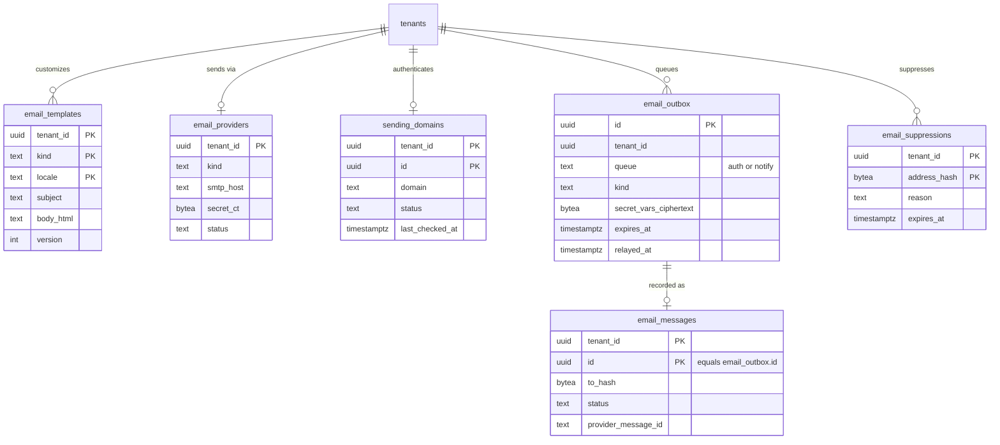
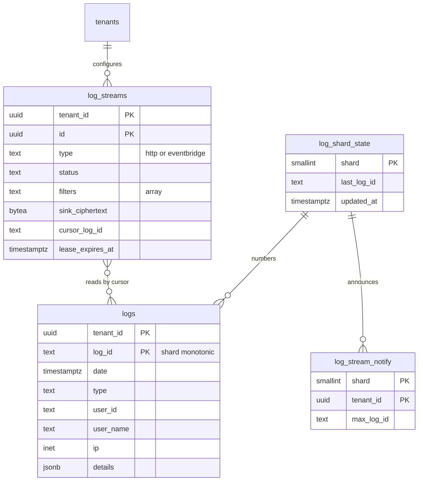

# Data model: メール・認証のイベントのログ・ログストリーム

[data-model.md](../data-model.md) の一部。規約は、そちらの 2 節に従う。振る舞いは [email-delivery.md](../email-delivery.md)、[logs-and-streams.md](../logs-and-streams.md)、[ADR-0040](../../decisions/0040-email-sending-platform.md)〜[ADR-0044](../../decisions/0044-log-stream-delivery.md) を正とする。

**置き場所が 2 つある。** メールの表と `log_streams` は主の Aurora、`logs`・`log_shard_state`・`log_stream_notify` はログの専用の Aurora のクラスタ（ADR-0043）。クラスタをまたぐ外部キーは張れない。ログのクラスタの `tenant_id` は、取り込みのスキーマの検証と RLS の `WITH CHECK` で守る。

## 1. ER 図

### 1.1 メール（主の Aurora）

### 1.2 ログとログストリーム

`log_streams` は主の Aurora、他の 3 つはログのクラスタにある。`log_streams` と `logs` の線は、外部キーではなく「カーソルで読む」関係を示す。

## 2. メール（主の Aurora）

### email_templates

テナントのテンプレート（ADR-0041）。行がなければ本システムの既定（コード）を使う。

| 列 | 型 | NULL | 既定 | 説明 |
| --- | --- | --- | --- | --- |
| `tenant_id` | `uuid` | NO | | |
| `kind` | `text` | NO | | `verify_email_code`・`verify_email_link`・`reset_password_link`・`mfa_otp`・`password_changed`・`blocked_account` など（[email-delivery.md](../email-delivery.md) の 3 節。`already_registered` はテンプレートの対象外） |
| `locale` | `text` | NO | | `ja`・`en` |
| `enabled` | `boolean` | NO | `true` | |
| `from_name` | `text` | YES | | |
| `from_address` | `text` | YES | | `verified` の送信ドメインのものだけ |
| `reply_to` | `text` | YES | | |
| `subject` | `text` | NO | | 200 文字まで |
| `body_html` | `text` | NO | | 100 KB まで |
| `body_text` | `text` | YES | | |
| `version` | `integer` | NO | | |
| `updated_by` | `text` | NO | | 管理者の `member_user_id` |
| `updated_at` | `timestamptz` | NO | `now()` | |

- 主キー：`(tenant_id, kind, locale)`。
- 検査：`CHECK (char_length(subject) <= 200)`、`CHECK (octet_length(body_html) <= 102400)`。
- S1 の規模：数万行。

> 2026-09-28 の統合：email-delivery の 6 節の `updated_by uuid` は、管理者が管理用のテナントのユーザーなので `text`（`member_user_id`）にした（[data-model.md](../data-model.md) の 2.4 節）。

### email_providers

テナントの送信事業者（ADR-0041）。テナントに 0 か 1 行。

| 列 | 型 | NULL | 既定 | 説明 |
| --- | --- | --- | --- | --- |
| `tenant_id` | `uuid` | NO | | |
| `kind` | `text` | NO | | `platform_ses`・`smtp`・`ses_cross_account` |
| `smtp_host` | `text` | YES | | |
| `smtp_port` | `integer` | YES | | `465`・`587` |
| `smtp_username` | `text` | YES | | |
| `secret_ct` | `bytea` | YES | | SMTP のパスワード。テナントの DEK、AAD = `tenant_id|'email_provider'` |
| `secret_key_ver` | `integer` | YES | | `tenant_data_keys.version` |
| `role_arn` | `text` | YES | | `ses_cross_account` |
| `external_id` | `text` | YES | | |
| `fallback_to_platform` | `boolean` | NO | `false` | |
| `status` | `text` | NO | `'active'` | `active`・`failing`・`disabled` |
| `updated_at` | `timestamptz` | NO | `now()` | |

- 主キー：`(tenant_id)`。
- 検査：`CHECK ((secret_ct IS NULL) = (secret_key_ver IS NULL))`。

> 2026-09-28 の統合：email-delivery の 7 節の表に `secret_key_ver` がなかった。復号に DEK のバージョンが要るので足した。

### sending_domains（E11）

テナントの独自の送信ドメイン（[email-delivery.md](../email-delivery.md) の 5.2 節）。この表の列は、この文書で決めた。

| 列 | 型 | NULL | 既定 | 説明 |
| --- | --- | --- | --- | --- |
| `tenant_id` | `uuid` | NO | | |
| `id` | `uuid` | NO | `uuidv7()` | |
| `domain` | `text` | NO | | 小文字、Punycode |
| `mail_from_domain` | `text` | NO | | `send.<domain>` など |
| `status` | `text` | NO | `'registered'` | `registered`・`pending_dns`・`verified`・`degraded`・`failed` |
| `ses_identity_tokyo`、`ses_identity_osaka` | `text` | YES | | SES の識別子 |
| `dns_records` | `jsonb` | NO | `'[]'` | テナントに示す DKIM・MAIL FROM・DMARC のレコード |
| `last_checked_at` | `timestamptz` | YES | | 24 時間ごと |
| `created_at` / `updated_at` | `timestamptz` | NO | `now()` | |

- 主キー：`(tenant_id, id)`。一意：`(tenant_id, domain)`。S1 はテナントに 1 つ（`UNIQUE (tenant_id)`。S2 で外す）。

### email_outbox

メールの送信の待ち。**共通の `outbox` と別の表**で、テナントの外（Relay が全テナントを読む。[data-model.md](../data-model.md) の 3 節）。

| 列 | 型 | NULL | 既定 | 説明 |
| --- | --- | --- | --- | --- |
| `id` | `uuid` | NO | `uuidv7()` | SES のメッセージのタグにも入れる（冪等） |
| `tenant_id` | `uuid` | NO | | 書き手の `WITH CHECK` で自分のテナントに限る |
| `queue` | `text` | NO | | `auth`（優先）・`notify` |
| `kind` | `text` | NO | | テンプレートの種類 |
| `locale` | `text` | NO | | |
| `to_address` | `text` | NO | | 宛先。送信の後に消す |
| `vars` | `jsonb` | NO | `'{}'` | 秘密でない変数（アプリの名前、ホスト名など） |
| `secret_vars_ciphertext` | `bytea` | YES | | コード・リンクのトークン。テナントの DEK、AAD = `tenant_id|id|'email_outbox'`。送信の後に NULL にする |
| `data_key_version` | `integer` | YES | | |
| `trace_context` | `text` | YES | | W3C `traceparent` |
| `expires_at` | `timestamptz` | NO | | 過ぎたら送らずに捨てる（`dropped_expired`） |
| `created_at` | `timestamptz` | NO | `now()` | |
| `relayed_at` | `timestamptz` | YES | | Relay が SQS へ移した時刻 |
| `sent_at` | `timestamptz` | YES | | |

- 主キー：`(id)`。分割：`RANGE (id)` で 1 日ごと。
- 索引：`(created_at) WHERE relayed_at IS NULL`（Relay の読み取り）。
- 検査：`CHECK ((secret_vars_ciphertext IS NULL) = (data_key_version IS NULL))`。
- `relay` のロールは、この表の SELECT と `relayed_at` の UPDATE だけ。送信の Worker は、テナントのコンテキストで `secret_vars_ciphertext`・`to_address` を消す。
- 保持：2 日前より古いパーティションを `DROP`（未送のものは `expires_at` を過ぎている）。
- S1 の規模：1 日 数百万行。

### email_messages

送信の記録。本文と宛先の平文を持たない（ADR-0040）。

| 列 | 型 | NULL | 既定 | 説明 |
| --- | --- | --- | --- | --- |
| `tenant_id` | `uuid` | NO | | |
| `id` | `uuid` | NO | | `email_outbox.id` と同じ値 |
| `kind` | `text` | NO | | |
| `to_hash` | `bytea` | NO | | 正規化した宛先の HMAC（テナントの鍵）。ダッシュボードで宛先から引く |
| `provider` | `text` | NO | | `platform_ses`・`smtp`・`ses_cross_account` |
| `provider_message_id` | `text` | YES | | |
| `status` | `text` | NO | `'queued'` | `queued`・`sent`・`delivered`・`bounced`・`complained`・`dropped_expired`・`dropped_suppressed`・`dropped_quota`・`failed` |
| `status_detail` | `text` | YES | | バウンスの種類、SMTP のコード（宛先を含めない） |
| `created_at` / `updated_at` | `timestamptz` | NO | `now()` | |

- 主キー：`(tenant_id, id)`。分割：`RANGE (id)` で 1 日ごと。
- 索引：`(tenant_id, to_hash, id)`（「コードが届かない」の調べ）、`(provider_message_id)`（SES の結果の事象の引き当て。結果の Worker は `platform` の関数 `email_find_by_provider_id` でテナントを得てから、テナントのコンテキストで更新する）。
- 保持：30 日を過ぎたパーティションを `DROP`。
- S1 の規模：1 日 数百万行、30 日で約 1 億行。

### email_suppressions

抑止の一覧（ハードバウンス、苦情、Apple の中継の停止、手動）。

| 列 | 型 | NULL | 既定 | 説明 |
| --- | --- | --- | --- | --- |
| `tenant_id` | `uuid` | NO | | |
| `address_hash` | `bytea` | NO | | `email_messages.to_hash` と同じ HMAC |
| `reason` | `text` | NO | | `hard_bounce`・`complaint`・`apple_relay_disabled`・`manual` |
| `created_at` | `timestamptz` | NO | `now()` | |
| `expires_at` | `timestamptz` | YES | | NULL は解除まで |

- 主キー：`(tenant_id, address_hash)`。
- 保持：解除か期限で消す。
- S1 の規模：数十万行。

## 3. ログストリームの設定（主の Aurora）

### log_streams

ログストリームの設定とカーソル（ADR-0044）。イベントごとの配信の記録は持たない。

| 列 | 型 | NULL | 既定 | 説明 |
| --- | --- | --- | --- | --- |
| `tenant_id` | `uuid` | NO | | |
| `id` | `uuid` | NO | `uuidv7()` | |
| `name` | `text` | NO | | |
| `type` | `text` | NO | | `http`・`eventbridge` |
| `status` | `text` | NO | `'active'` | `active`・`paused`・`disabled` |
| `filters` | `text[]` | NO | `'{}'` | カテゴリー。空は全件 |
| `pii_config` | `jsonb` | NO | `'{}'` | `mask`・`hash` とフィールドの一覧 |
| `format` | `text` | NO | `'JSONLINES'` | `JSONLINES`・`JSONARRAY`・`JSONOBJECT`（`http` だけ） |
| `sink_ciphertext` | `bytea` | NO | | 宛先（URL と `Authorization` の値、または AWS のアカウント・リージョン）。テナントの DEK |
| `signing_key_ciphertext` | `bytea` | YES | | 本文の署名の鍵（ローテーション中は 2 つ）。`http` だけ |
| `data_key_version` | `integer` | NO | | |
| `cursor_log_id` | `text` | YES | | 送った最後の `log_id` |
| `started_from` | `timestamptz` | NO | | 開始の位置 |
| `last_success_at` | `timestamptz` | YES | | |
| `first_failure_at` | `timestamptz` | YES | | 7 日で `disabled` |
| `last_errors` | `jsonb` | NO | `'[]'` | 直近 10 件（秘密・応答の本文を含めない） |
| `lease_owner` | `text` | YES | | 送り手のタスクの ID |
| `lease_expires_at` | `timestamptz` | YES | | 30 秒のリース |
| `created_at` / `updated_at` | `timestamptz` | NO | `now()` | |

- 主キー：`(tenant_id, id)`。
- 検査：テナントに 10 本まで（作成の関数）。
- リース：`UPDATE ... SET lease_owner = :me, lease_expires_at = now() + 30s WHERE ... AND (lease_expires_at IS NULL OR lease_expires_at < now())`。1 つのストリームは同時に 1 つの送り手だけ（2026-09-28 に DB の行に決めた。[logs-and-streams.md](../logs-and-streams.md) の 6.2 節）。
- 索引：主キーだけ（送り手は `log_stream_notify` からテナントを知り、テナントのコンテキストでそのテナントのストリームを読む）。
- S1 の規模：数千行。

## 4. ログのクラスタ

ロール：`log_ingest`（取り込み。`logs` の INSERT、`log_shard_state`・`log_stream_notify` の読み書き）、`log_reader`（検索と送り手。`logs` の SELECT、`log_stream_notify` の SELECT）、`log_pseudonymizer`（ユーザーの削除の仮名化。`logs` の `user_name` の UPDATE だけ）。どれも `BYPASSRLS` を持たない。

### logs

認証のイベント（ADR-0042、ADR-0043）。形は [stores.md](stores.md) の 3 節のイベントの形と同じ。

| 列 | 型 | NULL | 既定 | 説明 |
| --- | --- | --- | --- | --- |
| `tenant_id` | `uuid` | NO | | |
| `log_id` | `text` | NO | | 26 文字の Crockford base32。`ingest_ms`｜`shard`｜連番｜乱数。テナントの中でコミットの順に単調 |
| `date` | `timestamptz` | NO | | イベントの発生の時刻 |
| `type` | `text` | NO | | 種類のコード（`s`・`fp`・`seccft` など） |
| `description` | `text` | YES | | |
| `client_id` | `text` | YES | | |
| `client_name` | `text` | YES | | |
| `connection` | `text` | YES | | 接続の名前 |
| `connection_id` | `text` | YES | | 外に出す形の接続の ID |
| `strategy`、`strategy_type` | `text` | YES | | |
| `user_id` | `text` | YES | | 外に出す `user_id`（`sub`） |
| `user_name` | `text` | YES | | ログインに使った識別子（メールアドレスを含む）。ユーザーの削除で `deleted-user-<hash>` に置き換える |
| `ip` | `inet` | YES | | |
| `user_agent` | `text` | YES | | 解析した短い形 |
| `hostname` | `text` | YES | | |
| `organization_id` | `text` | YES | | `org_...` |
| `details` | `jsonb` | NO | `'{}'` | 種類ごとの許可リストのスキーマで検証した値 |
| `references` | `jsonb` | NO | `'{}'` | `request_id`・`correlation_id`・`transaction_id` |
| `schema_version` | `text` | NO | | `$event_schema.version` |

- 主キー：`(tenant_id, log_id)`。
- 分割：`RANGE (log_id)` で取り込みの日ごと（`log_id` の先頭が取り込みの時刻なので、日の境界の `log_id` の下限で切る）。31 日を過ぎたパーティションを `DROP`。
- 索引（すべて `tenant_id` が先頭。[logs-and-streams.md](../logs-and-streams.md) の 4.1・5 節）：

  | 索引 | 受ける問い合わせ |
  | --- | --- |
  | `(tenant_id, log_id)`（主キー） | チェックポイント（`from`）、ストリームのカーソル、`sort` なしの一覧 |
  | `(tenant_id, user_id, log_id)` | `/users/{id}/logs`、`user_id:` |
  | `(tenant_id, type, log_id)` | `type:`、フィルター付きのチェックポイント |
  | `(tenant_id, client_id, log_id)` | `client_id:` |
  | `(tenant_id, ip, log_id)` | `ip:` |
  | `(tenant_id, connection_id, log_id)` | `connection_id:` |
  | `(tenant_id, organization_id, log_id)` | `organization_id:` |
  | `(tenant_id, user_name, log_id)` | `user_name:`、フィールドのない語 |
  | `(tenant_id, date)` | `date:[a TO b]`、`sort=date` |

- テナントの検索は `tenants.log_retention_days` で切る（主の Aurora の値を Management API が条件に加える）。
- S1 の規模：1 日 約 1 億行、約 50 GB。31 日で約 31 億行、約 1.5 TB。

### log_shard_state

シャード（64）ごとの採番の状態。テナントの外（シャードは複数のテナントを含む）。

| 列 | 型 | NULL | 既定 | 説明 |
| --- | --- | --- | --- | --- |
| `shard` | `smallint` | NO | | 0〜63。`hash(tenant_id) mod 64` |
| `last_log_id` | `text` | NO | | |
| `updated_at` | `timestamptz` | NO | `now()` | |

- 主キー：`(shard)`。書き手はシャードの advisory lock を持つタスク 1 つだけ。
- S1 の規模：64 行。

### log_stream_notify

送り手への通知。ログの中身を持たない。テナントの外。

| 列 | 型 | NULL | 既定 | 説明 |
| --- | --- | --- | --- | --- |
| `shard` | `smallint` | NO | | |
| `tenant_id` | `uuid` | NO | | |
| `max_log_id` | `text` | NO | | そのテナントの最新の `log_id` |
| `updated_at` | `timestamptz` | NO | `now()` | |

- 主キー：`(shard, tenant_id)`。取り込みと同じトランザクションで `INSERT ... ON CONFLICT DO UPDATE`。
- 索引：`(updated_at)`（送り手の 1 秒ごとの走査）。
- 保持：31 日更新のない行を消す。
- S1 の規模：約 1 万行。
