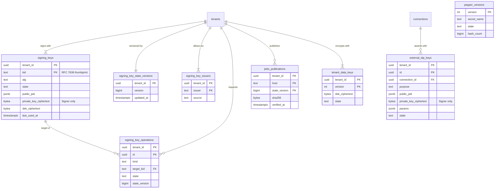

# Data model: 署名鍵・データキー・pepper

[data-model.md](../data-model.md) の一部。規約は、そちらの 2 節に従う。振る舞いは [keys-and-secrets.md](../keys-and-secrets.md)、[ADR-0003](../../decisions/0003-token-formats-and-signing-keys.md)、[ADR-0045](../../decisions/0045-kms-key-hierarchy.md)〜[ADR-0047](../../decisions/0047-signer-api-and-jwks-publishing.md)、[ADR-0059](../../decisions/0059-signer-isolation.md)、[ADR-0063](../../decisions/0063-cpu-bound-work-sizing.md) を正とする。

## 1. ER 図

`pepper_versions` はテナントの外の表。`password_credentials.pepper_version` などからバージョンの番号で参照される（外部キーは張らない）。

## 2. Signer が読む表

Signer の DB のロール `signer` は、`signing_keys`・`signing_key_state_versions`・`signing_key_issuers`・`external_idp_keys` の SELECT と、`signing_keys.last_used_at` の UPDATE だけを持つ（ADR-0059）。書くのは Management API（`mgmt_app`）の関数。`signing_key_state_versions` 以外の 3 つはテナントテーブルで、Signer もテナントのコンテキスト（`SET LOCAL app.tenant_id`）を設定してから読む。

### signing_keys

テナントの署名鍵（ADR-0046）。秘密鍵の暗号文を復号できるのは Signer だけ（`<brand>-signing-keys` の KMS の鍵）。

| 列 | 型 | NULL | 既定 | 説明 |
| --- | --- | --- | --- | --- |
| `tenant_id` | `uuid` | NO | | |
| `kid` | `text` | NO | | 公開鍵の JWK の SHA-256 の thumbprint（RFC 7638）の base64url |
| `alg` | `text` | NO | | `RS256`・`PS256`・`ES256` |
| `state` | `text` | NO | | `next`・`current`・`previous`・`revoked` |
| `public_jwk` | `jsonb` | NO | | |
| `private_key_ciphertext` | `bytea` | YES | | AES-256-GCM、AAD = `tenant_id|kid|alg`。失効で NULL にする |
| `dek_ciphertext` | `bytea` | YES | | KMS の暗号文。暗号化の文脈 `{purpose: signing-key, tenant_id, kid}`。失効で NULL |
| `kms_key_arn` | `text` | NO | | 包んだ KMS の鍵（マルチリージョン） |
| `created_at` | `timestamptz` | NO | `now()` | |
| `published_at` | `timestamptz` | YES | | JWKS に載せた時刻 |
| `ready_at` | `timestamptz` | YES | | エッジでの確かめ＋15 分。`next` の ready |
| `activated_at` | `timestamptz` | YES | | `current` にした時刻 |
| `rotated_out_at` | `timestamptz` | YES | | `previous` にした時刻 |
| `revoked_at` | `timestamptz` | YES | | |
| `revoke_reason` | `text` | YES | | `manual`・`emergency`・`scheduled` |
| `last_used_at` | `timestamptz` | YES | | Signer が 1 分に 1 回まで書く。起動時の先読みに使う |

- 主キー：`(tenant_id, kid)`。
- 一意：`(tenant_id) WHERE state = 'current'`、`(tenant_id) WHERE state = 'next'`（どちらもテナントに 1 つ）。
- 検査：`CHECK ((state = 'revoked') = (private_key_ciphertext IS NULL))`、`CHECK ((private_key_ciphertext IS NULL) = (dek_ciphertext IS NULL))`。`previous` が 2 つまでは遷移の関数で守る。
- 索引：`(tenant_id, state) WHERE state <> 'revoked'`（JWKS の書き出し、Signer の読み込み）、`(tenant_id, last_used_at)`（Signer の起動時の先読み。Signer は `signing_key_state_versions` から全テナントの ID を得て、テナントごとのコンテキストで「直近 24 時間に使った鍵」を読む）。
- 保持：`revoked` の行は公開鍵と履歴のために残す。テナントの削除で消す（暗号の消去）。
- S1 の規模：約 4 万行（テナント 1 万 × 平均 4）。

### signing_key_state_versions

Signer のポーリング（2 秒）のバージョン。遷移のトランザクションが 1 増やす。**テナントの外の表**（2026-09-28 に決めた。[data-model.md](../data-model.md) の 3 節）。Signer は全テナントのバージョンを 1 回の問い合わせで読む必要があり、行はバージョンと時刻だけで鍵の中身を持たないため（`tenant_config_versions` と同じ理由）。

| 列 | 型 | NULL | 既定 | 説明 |
| --- | --- | --- | --- | --- |
| `tenant_id` | `uuid` | NO | | |
| `version` | `bigint` | NO | `1` | |
| `updated_at` | `timestamptz` | NO | `now()` | |

- 主キー：`(tenant_id)`。
- 索引：`(updated_at)`（ポーリングの `updated_at > :last`）。
- 外部キー：`tenant_id` → `tenants (id)`。読める主体は `signer` と `mgmt_app`、書ける主体は `mgmt_app` の遷移の関数だけ。
- S1 の規模：約 1 万行。

### signing_key_issuers

Signer の `iss` の検査の一覧（テナントの標準のホスト名とカスタムドメインの `issuer`）。

| 列 | 型 | NULL | 既定 | 説明 |
| --- | --- | --- | --- | --- |
| `tenant_id` | `uuid` | NO | | |
| `issuer` | `text` | NO | | `https://<host>/` |
| `source` | `text` | NO | | `canonical`・`custom_domain` |
| `custom_domain_id` | `uuid` | YES | | |
| `created_at` | `timestamptz` | NO | `now()` | |

- 主キー：`(tenant_id, issuer)`。
- `tenant_hostnames` の遷移と同じトランザクションで書き、`signing_key_state_versions` を上げる。
- S1 の規模：約 1.3 万行。

### external_idp_keys

外部 IdP へのアサーションの鍵（Apple の `.p8`、OIDC の `private_key_jwt`、SAML の SP の鍵）。接続ごと（ADR-0047）。

| 列 | 型 | NULL | 既定 | 説明 |
| --- | --- | --- | --- | --- |
| `tenant_id` | `uuid` | NO | | |
| `id` | `uuid` | NO | `uuidv7()` | |
| `connection_id` | `uuid` | NO | | |
| `purpose` | `text` | NO | | `apple_client_secret`・`oidc_client_assertion`・`saml_authn_request` |
| `alg` | `text` | NO | | |
| `kid` | `text` | YES | | Apple の Key ID など |
| `public_jwk` | `jsonb` | YES | | |
| `certificate` | `text` | YES | | SAML の SP の自己署名の証明書（PEM） |
| `private_key_ciphertext` | `bytea` | NO | | AES-256-GCM。Signer だけが復号できる |
| `dek_ciphertext` | `bytea` | NO | | 暗号化の文脈 `{purpose: external-idp-key, tenant_id, connection_id}` |
| `params` | `jsonb` | NO | | 登録の値（`iss`・`sub`・`aud`・宛先）。Signer はここから決める |
| `state` | `text` | NO | `'active'` | `active`・`retired` |
| `created_at` | `timestamptz` | NO | `now()` | |
| `retired_at` | `timestamptz` | YES | | |

- 主キー：`(tenant_id, id)`。
- 外部キー：`(tenant_id, connection_id)` → `connections` `ON DELETE CASCADE`。
- 索引：`(tenant_id, connection_id, purpose) WHERE state = 'active'`（有効なものは 2 つまで。関数で守る）。
- 保持：`retired` から 90 日で行を消す（秘密鍵の暗号文は `retired` にした時点で NULL にしない。入れ替えの途中で戻せるように 90 日残す）。
- S1 の規模：数千行（Apple の接続の数）。

## 3. Management API と Worker が持つ表

### signing_key_operations

ローテーション・失効の操作の状態（`pending` → `published` → `completed`）。DR の複製とエッジでの確かめを含む（ADR-0060）。

| 列 | 型 | NULL | 既定 | 説明 |
| --- | --- | --- | --- | --- |
| `tenant_id` | `uuid` | NO | | |
| `id` | `uuid` | NO | `uuidv7()` | |
| `kind` | `text` | NO | | `rotate`・`revoke`・`emergency_rotate`・`emergency_rotate_all`・`change_alg`・`scheduled_rotate` |
| `target_kid` | `text` | YES | | `revoke` の対象 |
| `requested_by` | `text` | NO | | 管理者の `member_user_id`、`client_id`、運用者の ID、`system` |
| `state` | `text` | NO | `'pending'` | `pending`・`published`・`completed`・`failed` |
| `state_version` | `bigint` | NO | | この操作で上げた `signing_key_state_versions.version` |
| `dr_replicated_at` | `timestamptz` | YES | | 大阪への複製を確かめた時刻 |
| `jwks_verified_at` | `timestamptz` | YES | | CloudFront 経由の確かめ |
| `error` | `text` | YES | | |
| `created_at` | `timestamptz` | NO | `now()` | |
| `completed_at` | `timestamptz` | YES | | |

- 主キー：`(tenant_id, id)`。
- 索引：`(state, created_at) WHERE state IN ('pending','published')`（進行の監視。`platform` の関数でテナントをまたいで引く）。
- 保持：2 年（監査は `audit_events` にも残る）。
- S1 の規模：数万行。

### jwks_publications

JWKS と discovery の書き出しと確かめの記録。

| 列 | 型 | NULL | 既定 | 説明 |
| --- | --- | --- | --- | --- |
| `tenant_id` | `uuid` | NO | | |
| `host` | `text` | NO | | 書き出したホスト名 |
| `state_version` | `bigint` | NO | | |
| `sha256` | `bytea` | NO | | 書いた `jwks.json` の SHA-256 |
| `s3_version_id` | `text` | NO | | |
| `published_at` | `timestamptz` | NO | | |
| `verified_at` | `timestamptz` | YES | | CloudFront 経由で一致を確かめた時刻 |

- 主キー：`(tenant_id, host, state_version)`。
- 書き出しは冪等。古い `state_version` の事象は捨てる。
- 保持：ホストごとに最新の 10 件を残す。
- S1 の規模：約 13 万行。

### tenant_data_keys

テナントごとの DEK（バージョンつき。ADR-0045）。戻す必要のある秘密（TOTP の種、接続の秘密、ログストリーム・メールの資格情報、Action の秘密、`email_outbox` の秘密の変数）を包む。

| 列 | 型 | NULL | 既定 | 説明 |
| --- | --- | --- | --- | --- |
| `tenant_id` | `uuid` | NO | | |
| `version` | `integer` | NO | | |
| `dek_ciphertext` | `bytea` | NO | | `<brand>-credentials` の KMS の暗号文。文脈 `{purpose: tenant-dek, tenant_id, version}` |
| `state` | `text` | NO | `'current'` | `current`・`active`・`retired` |
| `created_at` | `timestamptz` | NO | `now()` | |
| `retired_at` | `timestamptz` | YES | | 参照する行が 0 になった時刻 |

- 主キー：`(tenant_id, version)`。一意：`(tenant_id) WHERE state = 'current'`。
- ローテーションは年 1 回。古いバージョンの暗号文は読んだときに書き直す。
- 保持：`retired` の行は消す。テナントの削除で全行を消す（暗号の消去）。
- S1 の規模：約 1 万〜3 万行。

## 4. テナントの外の表

### pepper_versions

pepper のバージョン（[keys-and-secrets.md](../keys-and-secrets.md) の 4 節）。pepper そのものは DB に置かない（暗号文は Secrets Manager）。

| 列 | 型 | NULL | 既定 | 説明 |
| --- | --- | --- | --- | --- |
| `version` | `integer` | NO | | ハッシュの `pv=n` |
| `secret_name` | `text` | NO | | `<brand>/pepper/v{n}` |
| `state` | `text` | NO | | `current`・`active`・`retired` |
| `created_at` | `timestamptz` | NO | `now()` | |
| `hash_count` | `bigint` | YES | | このバージョンのハッシュの数（日次で数える） |
| `counted_at` | `timestamptz` | YES | | |

- 主キー：`(version)`。一意：`(state) WHERE state = 'current'`。
- `retired` にできるのは `hash_count = 0` のときだけ（関数で守る）。
- S1 の規模：数行。
