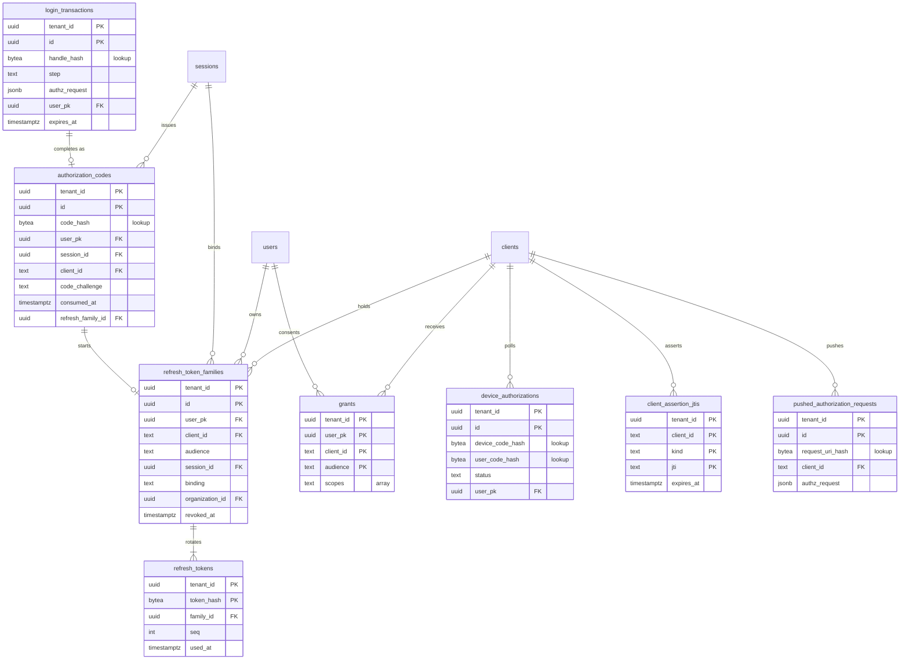
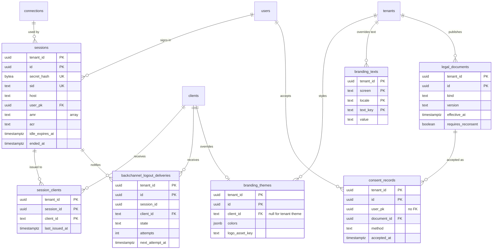

# Data model: ログイン・トークン・セッション・画面

[data-model.md](../data-model.md) の一部。規約は、そちらの 2 節に従う。振る舞いは [authentication-flows.md](../authentication-flows.md)、[universal-login.md](../universal-login.md)、[sessions-and-sso.md](../sessions-and-sso.md)、[ADR-0003](../../decisions/0003-token-formats-and-signing-keys.md)、[ADR-0006](../../decisions/0006-authorization-code-pkce-and-exact-redirect.md)〜[ADR-0013](../../decisions/0013-consent-records.md)、[ADR-0027](../../decisions/0027-server-side-sessions.md)〜[ADR-0029](../../decisions/0029-refresh-token-session-binding.md) を正とする。

## 1. ER 図

### 1.1 ログインとトークン

### 1.2 セッションと画面

## 2. ログインとトークン

### login_transactions

Universal Login のトランザクション（ADR-0011）。持ち主は universal-login の領域。`authz_request` の欄は authentication-flows の領域が持つ。

| 列 | 型 | NULL | 既定 | 説明 |
| --- | --- | --- | --- | --- |
| `tenant_id` | `uuid` | NO | | |
| `id` | `uuid` | NO | `uuidv7()` | パーティションの鍵 |
| `handle_hash` | `bytea` | NO | | 画面の URL の `state` で運ぶ 256 ビットの handle の SHA-256 |
| `hostname` | `text` | NO | | 解決したホスト名。リンクと `issuer` に使う |
| `step` | `text` | NO | | `identifier`・`password`・`signup`・…・`completed`・`expired`・`aborted` |
| `version` | `integer` | NO | `0` | 楽観ロック（2 つのタブの同時の送信） |
| `csrf_secret` | `bytea` | NO | | トランザクションごとの CSRF のトークンの種 |
| `authz_request` | `jsonb` | NO | | `client_id`・`redirect_uri`・`scope`・`audience`・`state`（アプリの値）・`nonce`・`code_challenge`・`response_mode`・`prompt`・`max_age`・`acr_values`・`ui_locales`・`login_hint`・`connection`・`screen_hint`・`organization`（E14）・`invitation`（E14） |
| `locale` | `text` | NO | | `ja`・`en` |
| `connection_id` | `uuid` | YES | | |
| `user_pk` | `uuid` | YES | | 認証が済んだユーザー |
| `amr` | `text[]` | NO | `'{}'` | 満たした要素 |
| `idp_state_hash` | `bytea` | YES | | ソーシャル IdP へ送った `state` の SHA-256 |
| `idp_nonce_hash` | `bytea` | YES | | |
| `webauthn_challenge` | `bytea` | YES | | WebAuthn のチャレンジ（32 バイトの乱数。秘密ではない）。検証で NULL に戻す |
| `failed_attempts` | `smallint` | NO | `0` | 画面の表示だけに使う。ロックの数は attack-protection の Valkey |
| `created_at` | `timestamptz` | NO | `now()` | |
| `expires_at` | `timestamptz` | NO | | 作成＋60 分 |
| `completed_at` | `timestamptz` | YES | | |

- 主キー：`(tenant_id, id)`。
- 分割：`RANGE (id)` で 1 日ごと（[data-model.md](../data-model.md) の 2.8 節）。
- 索引：`(tenant_id, handle_hash)`（handle での引き当て。**一意の制約は置かない**。分割した表では一意に分割の鍵が要るため。handle は 256 ビットの乱数で、衝突は起きない前提にする）、`(tenant_id, idp_state_hash) WHERE idp_state_hash IS NOT NULL`（IdP のコールバック）。
- 保持：`expires_at` から 24 時間を過ぎた日のパーティションを `DROP`（2 日前より古いもの）。
- S1 の規模：1 日 約 5,000 万行（`/authorize` 1,500 件/秒のピーク、平均をその 1/3 と仮定）。パーティション 1 つ 約 25 GB。

### authorization_codes

認可コード（SHA-256、1 回限り、60 秒。ADR-0006）。

| 列 | 型 | NULL | 既定 | 説明 |
| --- | --- | --- | --- | --- |
| `tenant_id` | `uuid` | NO | | |
| `id` | `uuid` | NO | `uuidv7()` | パーティションの鍵 |
| `code_hash` | `bytea` | NO | | コードの SHA-256 |
| `login_transaction_id` | `uuid` | YES | | SSO（画面なし）のときは NULL |
| `user_pk` | `uuid` | NO | | |
| `session_id` | `uuid` | NO | | → `sessions.id` |
| `client_id` | `text` | NO | | |
| `redirect_uri` | `text` | NO | | 交換のときに完全一致で照合 |
| `scope` | `text[]` | NO | | |
| `audience` | `text` | YES | | |
| `code_challenge` | `text` | YES | | S256 だけ。`require_pkce = false` の機密のアプリだけ NULL |
| `nonce` | `text` | YES | | |
| `auth_time` | `timestamptz` | NO | | |
| `amr` | `text[]` | NO | | |
| `acr` | `text` | YES | | |
| `organization_id` | `uuid` | YES | | 組織の文脈のログイン（E14）。トークンの `org_id` の元 |
| `expires_at` | `timestamptz` | NO | | 作成＋60 秒 |
| `consumed_at` | `timestamptz` | YES | | |
| `refresh_family_id` | `uuid` | YES | | 交換で作った系列。再利用で失効させる |
| `created_at` | `timestamptz` | NO | `now()` | |

- 主キー：`(tenant_id, id)`。分割：`RANGE (id)` で 1 日ごと。
- 索引：`(tenant_id, code_hash)`（交換の引き当て。一意の制約は置かない理由は `login_transactions` と同じ）。
- 消費：`UPDATE ... SET consumed_at = now() WHERE ... AND consumed_at IS NULL RETURNING`。0 行なら再利用として `refresh_family_id` の系列を `revoke_reason = 'code_reuse'` で失効させる。
- 外部キー：パーティションの表から他の表へは張らない（`session_id` の行はセッションの終了で消えうる。交換の関数が確かめる）。
- 保持：2 日前より古いパーティションを `DROP`。
- S1 の規模：1 日 約 2,000 万行（ピーク 750 件/秒）。

### refresh_token_families

リフレッシュトークンの系列。**列の正本はここ**（authentication-flows、sessions-and-sso、organizations、ADR-0010 の列を 2026-09-27 に 1 つにまとめた）。振る舞いの正本は各文書。

| 列 | 型 | NULL | 既定 | 説明 |
| --- | --- | --- | --- | --- |
| `tenant_id` | `uuid` | NO | | |
| `id` | `uuid` | NO | `uuidv7()` | |
| `user_pk` | `uuid` | NO | | |
| `client_id` | `text` | NO | | |
| `audience` | `text` | NO | | 系列に 1 つの API（ADR-0008） |
| `scope` | `text[]` | NO | | 許したスコープ。リフレッシュで狭められるが広げられない |
| `origin_grant` | `text` | NO | | `authorization_code`・`device_code` |
| `session_id` | `uuid` | YES | | `binding = 'session'` のとき。デバイスのフローは NULL（ADR-0029） |
| `binding` | `text` | NO | | `session`・`independent` |
| `organization_id` | `uuid` | YES | | 組織の文脈（ADR-0052、E14） |
| `dpop_jkt` | `text` | YES | | JWK の thumbprint（ADR-0010、MVP の後） |
| `rotation` | `boolean` | NO | | 偽は、外すことを選んだ機密のアプリだけ |
| `created_at` | `timestamptz` | NO | `now()` | |
| `absolute_expires_at` | `timestamptz` | NO | | `binding = 'session'` ならセッションの最終の期限以下 |
| `idle_expires_at` | `timestamptz` | NO | | リフレッシュのたびに延ばす |
| `last_used_at` | `timestamptz` | YES | | |
| `revoked_at` | `timestamptz` | YES | | |
| `revoke_reason` | `text` | YES | | `reuse_detected`・`code_reuse`・`logout`・`session_ended`・`revoked_by_client`・`grant_revoked`・`password_changed`・`user_blocked`・`user_deleted`・`membership_removed`・`family_limit`・`admin` |

- 主キー：`(tenant_id, id)`。
- 外部キー：`(tenant_id, user_pk)` → `users` `ON DELETE CASCADE`、`(tenant_id, client_id)` → `clients` `ON DELETE CASCADE`。`session_id` には張らない（セッションと系列は、それぞれの保持のジョブで消す。セッションの終了による失効は `revoked_at` で表す）。
- 検査：`CHECK ((binding = 'session') = (session_id IS NOT NULL))`、`CHECK ((revoked_at IS NULL) = (revoke_reason IS NULL))`。
- 索引：

  | 索引 | 受ける問い合わせ |
  | --- | --- |
  | `(tenant_id, user_pk, client_id) WHERE revoked_at IS NULL` | ユーザー × アプリの 200 個の上限、グラントの取り消し |
  | `(tenant_id, session_id) WHERE revoked_at IS NULL` | ログアウト・セッションの終了での失効 |
  | `(tenant_id, organization_id, user_pk) WHERE organization_id IS NOT NULL` | メンバーの削除での失効（E14） |
  | `(absolute_expires_at)` | 保持の期限の削除のジョブ |

- 失効は `revoked_at` の条件付きの更新だけで行う。失効させる各領域の操作は、この列だけを書く。
- 保持：`absolute_expires_at` か `revoked_at` の遅い方＋30 日で物理削除（子の `refresh_tokens` も）。
- S1 の規模：有効な系列 5,000 万行、約 15 GB（[capacity.md](../capacity.md) の 2.4 節）。

### refresh_tokens

系列の中のトークン。再利用の検知のため、系列が消えるまで使用済みの行を残す（ADR-0003）。

| 列 | 型 | NULL | 既定 | 説明 |
| --- | --- | --- | --- | --- |
| `tenant_id` | `uuid` | NO | | |
| `token_hash` | `bytea` | NO | | `<brand>_rt_...` の SHA-256 |
| `family_id` | `uuid` | NO | | |
| `seq` | `integer` | NO | | 系列の中の 1, 2, 3 … |
| `issued_at` | `timestamptz` | NO | `now()` | |
| `used_at` | `timestamptz` | YES | | ローテーションで設定。猶予の外の再使用で系列を失効させる |

- 主キー：`(tenant_id, token_hash)`（交換の引き当て）。
- 一意：`(tenant_id, family_id, seq)`。
- 外部キー：`(tenant_id, family_id)` → `refresh_token_families` `ON DELETE CASCADE`。
- 並行の要求は、系列の行の `SELECT ... FOR UPDATE` で順に処理する。
- S1 の規模：**1 日 約 5,000 万行が増え、系列の寿命（既定 30 日）まで残る。最大で十数億行**（リフレッシュのピーク 1,450 件/秒、平均をその 4 割と仮定）。[capacity.md](../capacity.md) の 2.4 節はこの行を数えていない。E12 で実測し、S2 のシャードの前に扱いを決める（[data-model.md](../data-model.md) の 8 節の持ち越し）。

### grants

OAuth の同意（ユーザー × アプリ × API → 許したスコープ）。規約への同意（`consent_records`）とは別。

| 列 | 型 | NULL | 既定 | 説明 |
| --- | --- | --- | --- | --- |
| `tenant_id` | `uuid` | NO | | |
| `user_pk` | `uuid` | NO | | |
| `client_id` | `text` | NO | | |
| `audience` | `text` | NO | | API の `identifier`。ID トークンだけのときは `''` |
| `scopes` | `text[]` | NO | | |
| `created_at` / `updated_at` | `timestamptz` | NO | `now()` | |

- 主キー：`(tenant_id, user_pk, client_id, audience)`（同意の画面を出すかの判定）。
- 外部キー：`users`・`clients` へ `ON DELETE CASCADE`。
- 取り消し（Management API）は行を消し、同じトランザクションで該当の系列を `grant_revoked` で失効させる。
- S1 の規模：約 3,000 万行（サードパーティのアプリと `prompt=consent` だけに作るなら少ない）。

### device_authorizations

デバイス認可グラント（ADR-0009）。

| 列 | 型 | NULL | 既定 | 説明 |
| --- | --- | --- | --- | --- |
| `tenant_id` | `uuid` | NO | | |
| `id` | `uuid` | NO | `uuidv7()` | |
| `device_code_hash` | `bytea` | NO | | |
| `user_code_hash` | `bytea` | NO | | 正規化した `user_code` の HMAC（pepper）。短いので鍵付きにする |
| `client_id` | `text` | NO | | |
| `scope` | `text[]` | NO | | |
| `audience` | `text` | YES | | |
| `status` | `text` | NO | `'pending'` | `pending`・`approved`・`denied`・`consumed`・`expired` |
| `user_pk` | `uuid` | YES | | 承認した利用者 |
| `interval_seconds` | `integer` | NO | `5` | `slow_down` で増やす |
| `last_polled_at` | `timestamptz` | YES | | |
| `expires_at` | `timestamptz` | NO | | |
| `created_at` | `timestamptz` | NO | `now()` | |

- 主キー：`(tenant_id, id)`。分割：`RANGE (id)` で 1 日ごと。
- 索引：`(tenant_id, device_code_hash)`（ポーリング）、`(tenant_id, user_code_hash) WHERE status = 'pending'`（`/activate`）。
- 保持：2 日前より古いパーティションを `DROP`。
- S1 の規模：1 日 数万行。

> 2026-09-28 の統合：authentication-flows の 17 節の列 `interval` は、予約語を避けて `interval_seconds` にした。`user_code_hash` は SHA-256 ではなく HMAC にした（短いコードは鍵付きのハッシュ。[data-model.md](../data-model.md) の 2.7 節の規則）。

### client_assertion_jtis

`private_key_jwt` の `jti` の再利用の防止。Valkey が使えないときの置き場所（[authentication-flows.md](../authentication-flows.md) の 6.1 節）。DPoP の `jti`（MVP の後）も同じ表に置く。

| 列 | 型 | NULL | 既定 | 説明 |
| --- | --- | --- | --- | --- |
| `tenant_id` | `uuid` | NO | | |
| `client_id` | `text` | NO | | |
| `kind` | `text` | NO | `'client_assertion'` | `client_assertion`・`dpop` |
| `jti` | `text` | NO | | 秘密ではない |
| `expires_at` | `timestamptz` | NO | | アサーションの `exp` |

- 主キー：`(tenant_id, client_id, kind, jti)`。`INSERT ... ON CONFLICT DO NOTHING` で 2 回目を拒否する。
- 索引：`(expires_at)`（1 時間ごとの削除）。
- S1 の規模：平常は 0 行に近い（Valkey の障害の間だけ書く）。

### pushed_authorization_requests（MVP の後）

PAR（RFC 9126。ADR-0010）。

| 列 | 型 | NULL | 既定 | 説明 |
| --- | --- | --- | --- | --- |
| `tenant_id` | `uuid` | NO | | |
| `id` | `uuid` | NO | `uuidv7()` | |
| `request_uri_hash` | `bytea` | NO | | `request_uri` の乱数の SHA-256 |
| `client_id` | `text` | NO | | |
| `authz_request` | `jsonb` | NO | | 検証済みの認可の要求（`login_transactions.authz_request` と同じ形） |
| `expires_at` | `timestamptz` | NO | | 作成＋60 秒 |
| `consumed_at` | `timestamptz` | YES | | |
| `created_at` | `timestamptz` | NO | `now()` | |

- 主キー：`(tenant_id, id)`。分割：`RANGE (id)` で 1 日ごと。索引：`(tenant_id, request_uri_hash)`。保持：2 日で `DROP`。

## 3. セッション

### sessions

サーバー側のセッション（ADR-0027）。正本は Aurora。Valkey は 60 秒の読み取りのキャッシュ。

| 列 | 型 | NULL | 既定 | 説明 |
| --- | --- | --- | --- | --- |
| `tenant_id` | `uuid` | NO | | |
| `id` | `uuid` | NO | `uuidv7()` | |
| `secret_hash` | `bytea` | NO | | Cookie の値（256 ビット）の SHA-256。認証の段階が変わるたびに作り直す |
| `sid` | `text` | NO | | 公開の値（128 ビットの乱数）。ID トークンとログアウトトークンに載る |
| `host` | `text` | NO | | 作ったときのホスト名 |
| `user_pk` | `uuid` | NO | | |
| `connection_id` | `uuid` | NO | | ログインに使った接続 |
| `authenticated_at` | `timestamptz` | NO | | 最後の対話の認証（`auth_time`） |
| `amr` | `text[]` | NO | | |
| `acr` | `text` | YES | | |
| `factor_auth_times` | `jsonb` | NO | `'{}'` | 要素ごとの最後の認証の時刻 |
| `persistent` | `boolean` | NO | | |
| `last_active_at` | `timestamptz` | NO | | 「5 分」と「使われない期間の 1/10」の短い方ごとに書く |
| `idle_expires_at` | `timestamptz` | NO | | |
| `absolute_expires_at` | `timestamptz` | NO | | |
| `ip` | `inet` | YES | | 作ったときの値 |
| `user_agent` | `text` | YES | | 解析した短い形 |
| `country` | `text` | YES | | |
| `created_at` | `timestamptz` | NO | `now()` | |
| `ended_at` | `timestamptz` | YES | | |
| `end_reason` | `text` | YES | | `logout`・`revoked`・`user_blocked`・`user_deleted`・`superseded`・`refresh_reuse`・`password_changed` |

- 主キー：`(tenant_id, id)`。
- 一意：`(tenant_id, secret_hash)`（Cookie での引き当て）、`(tenant_id, sid)`（`id_token_hint` とログアウト）。
- 外部キー：`(tenant_id, user_pk)` → `users` `ON DELETE CASCADE`。
- 検査：`CHECK ((ended_at IS NULL) = (end_reason IS NULL))`。`idle_expires_at` は `absolute_expires_at` で頭打ちにする（計算は関数で行う）。
- 索引：`(tenant_id, user_pk) WHERE ended_at IS NULL`（100 個の上限、ユーザーのすべてのセッションの終了）、`(absolute_expires_at)`（削除のジョブ）。
- `expired` は列で持たない。読んだときに期限と比べて決める。
- 保持：終わった時刻か期限から 30 日で物理削除（日次）。
- S1 の規模：3,000 万行、約 15 GB。

### session_clients

セッションでトークンを出したアプリ。Back-Channel Logout の送り先を決める。

| 列 | 型 | NULL | 既定 | 説明 |
| --- | --- | --- | --- | --- |
| `tenant_id` | `uuid` | NO | | |
| `session_id` | `uuid` | NO | | |
| `client_id` | `text` | NO | | |
| `first_issued_at` | `timestamptz` | NO | `now()` | |
| `last_issued_at` | `timestamptz` | NO | `now()` | |

- 主キー：`(tenant_id, session_id, client_id)`。
- 外部キー：`sessions` へ `ON DELETE CASCADE`、`clients` へ `ON DELETE CASCADE`。
- S1 の規模：約 4,000 万行。

### backchannel_logout_deliveries

Back-Channel Logout の送信の状態（ADR-0028）。ログアウトトークンは送るたびに Signer で作り、保存しない。

| 列 | 型 | NULL | 既定 | 説明 |
| --- | --- | --- | --- | --- |
| `tenant_id` | `uuid` | NO | | |
| `id` | `uuid` | NO | `uuidv7()` | |
| `session_id` | `uuid` | YES | | 外部キーなし（セッションやユーザーが先に消えうる） |
| `client_id` | `text` | NO | | |
| `logout_claims` | `jsonb` | NO | | ログアウトトークンに入れる `sub` と `sid`。秘密を含めない |
| `state` | `text` | NO | `'pending'` | `pending`・`delivered`・`failed` |
| `attempts` | `integer` | NO | `0` | |
| `next_attempt_at` | `timestamptz` | YES | | |
| `last_status` | `integer` | YES | | RP の HTTP の状態 |
| `last_error` | `text` | YES | | 種類だけ。秘密と応答の本文を含めない |
| `created_at` | `timestamptz` | NO | `now()` | |

- 主キー：`(tenant_id, id)`。
- 索引：`(next_attempt_at) WHERE state = 'pending'`（再試行のジョブ。`platform` の関数でテナントをまたいで取り、テナントのコンテキストで読み直す）。
- 保持：`delivered`・`failed` から 7 日で消す。
- S1 の規模：数十万行。

> `logout_claims.sub` は、外に出す `user_id` の写し。[data-model.md](../data-model.md) の 2.4 節の「`user_id` の列を持つのは `users` と `logs` だけ」の規則には当たらない（列ではなく、送る本文の一部）。ユーザーの削除の後にも送れるよう、写しを持つ。

## 4. 画面（ブランディング・規約・同意）

### branding_themes

テーマ（ADR-0012）。テナントに 1 つと、アプリごとの上書き（ロゴと主色だけ）。組織の上書きは `organizations.branding`。

| 列 | 型 | NULL | 既定 | 説明 |
| --- | --- | --- | --- | --- |
| `tenant_id` | `uuid` | NO | | |
| `id` | `uuid` | NO | `uuidv7()` | |
| `client_id` | `text` | YES | | NULL はテナントのテーマ |
| `colors` | `jsonb` | NO | `'{}'` | 主色・背景・文字・リンク・エラー・成功 |
| `border_radius` | `smallint` | YES | | |
| `logo_asset_key` | `text` | YES | | S3 の資産のキー（[stores.md](stores.md) の 2 節） |
| `favicon_asset_key`、`background_asset_key` | `text` | YES | | |
| `layout` | `text` | YES | | `center`・`left`・`right` |
| `font` | `text` | YES | | 本システムが配る一覧から |
| `version` | `integer` | NO | `1` | |
| `updated_by` | `text` | NO | | |
| `updated_at` | `timestamptz` | NO | `now()` | |

- 主キー：`(tenant_id, id)`。一意：`UNIQUE NULLS NOT DISTINCT (tenant_id, client_id)`。
- 外部キー：`clients` へ `ON DELETE CASCADE`。
- S1 の規模：約 2 万行。

### branding_texts

文言の上書き。値は平文として扱う（500 文字）。

| 列 | 型 | NULL | 既定 | 説明 |
| --- | --- | --- | --- | --- |
| `tenant_id` | `uuid` | NO | | |
| `screen` | `text` | NO | | 画面 |
| `locale` | `text` | NO | | `ja`・`en` |
| `text_key` | `text` | NO | | 文言のキー |
| `value` | `text` | NO | | 500 文字まで。決めた変数だけを展開する |
| `updated_at` | `timestamptz` | NO | `now()` | |

- 主キー：`(tenant_id, screen, locale, text_key)`。検査：`CHECK (char_length(value) <= 500)`。
- S1 の規模：数十万行。

### legal_documents

規約のバージョン（ADR-0013）。バージョンは作ったら変えない。

| 列 | 型 | NULL | 既定 | 説明 |
| --- | --- | --- | --- | --- |
| `tenant_id` | `uuid` | NO | | |
| `id` | `uuid` | NO | `uuidv7()` | |
| `kind` | `text` | NO | | `terms`・`privacy`・`custom` |
| `version` | `text` | NO | | テナントが付ける文字列 |
| `urls` | `jsonb` | NO | | 言語 → URL |
| `effective_at` | `timestamptz` | NO | | |
| `requires_reconsent` | `boolean` | NO | `false` | |
| `created_at` | `timestamptz` | NO | `now()` | |

- 主キー：`(tenant_id, id)`。一意：`(tenant_id, kind, version)`。
- 更新・削除は関数が拒否する（同意の記録から参照されるため）。
- 同意の方式（`checkbox`・`notice`・`none`）は接続ごとに `connections.options.consent_method` に持つ。

### consent_records

規約への同意の記録。追記だけ（ADR-0013）。

| 列 | 型 | NULL | 既定 | 説明 |
| --- | --- | --- | --- | --- |
| `tenant_id` | `uuid` | NO | | |
| `id` | `uuid` | NO | `uuidv7()` | |
| `user_pk` | `uuid` | NO | | `users.id`。外部キーは張らない（ユーザーの削除の後の扱いは法務の L7・L8 で決める） |
| `document_id` | `uuid` | NO | | → `legal_documents.id` |
| `version` | `text` | NO | | 写し |
| `locale` | `text` | NO | | |
| `method` | `text` | NO | | `checkbox`・`notice` |
| `accepted_at` | `timestamptz` | NO | | |
| `client_id` | `text` | YES | | |
| `transaction_id` | `uuid` | YES | | |
| `ip` | `inet` | YES | | |
| `user_agent` | `text` | YES | | |

- 主キー：`(tenant_id, id)`。
- 外部キー：`(tenant_id, document_id)` → `legal_documents` `ON DELETE RESTRICT`。
- 索引：`(tenant_id, user_pk, document_id)`（再同意の要否の判定）。
- 書き込み：`auth_app` に INSERT だけ。UPDATE・DELETE の権限をどのアプリのロールにも与えない。
- 保持：法務の L5・L8 の結論まで消さない。
- S1 の規模：2,000 万行以上（サインアップごとに 1〜2 行）。
