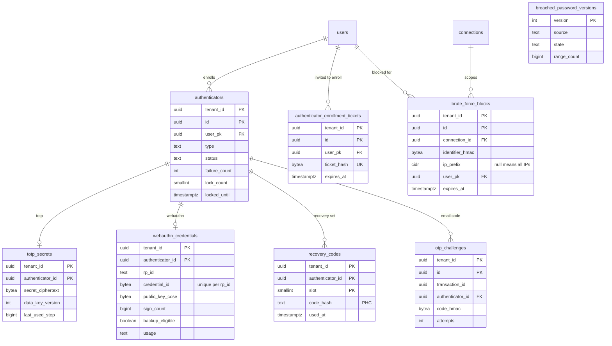

# Data model: MFA・パスキー・攻撃の防御

[data-model.md](../data-model.md) の一部。規約は、そちらの 2 節に従う。振る舞いは [mfa-and-passkeys.md](../mfa-and-passkeys.md)、[attack-protection.md](../attack-protection.md)、[ADR-0021](../../decisions/0021-authenticator-model-and-assurance-levels.md)〜[ADR-0026](../../decisions/0026-bot-detection-and-challenge.md) を正とする。

## 1. ER 図

`breached_password_versions` はテナントの外の表で、他の表と関係を持たない。

## 2. MFA とパスキー

### authenticators

ユーザーの認証器の共通の行（ADR-0021）。種類ごとの秘密は子の表に持つ。

| 列 | 型 | NULL | 既定 | 説明 |
| --- | --- | --- | --- | --- |
| `tenant_id` | `uuid` | NO | | |
| `id` | `uuid` | NO | `uuidv7()` | |
| `user_pk` | `uuid` | NO | | → `users.id` |
| `type` | `text` | NO | | `webauthn`・`totp`・`email`・`recovery_code`・`sms`（後） |
| `status` | `text` | NO | `'pending'` | `pending`・`active`・`locked`・`disabled` |
| `name` | `text` | YES | | 64 文字まで |
| `failure_count` | `integer` | NO | `0` | 連続の失敗。writer に書く（Valkey に頼らない） |
| `lock_count` | `smallint` | NO | `0` | ロックの回数。次のロックの期間を倍にする（15 分〜24 時間。[mfa-and-passkeys.md](../mfa-and-passkeys.md) の 7 節） |
| `locked_until` | `timestamptz` | YES | | |
| `created_at` | `timestamptz` | NO | `now()` | |
| `confirmed_at` | `timestamptz` | YES | | `active` にした時刻 |
| `last_used_at` | `timestamptz` | YES | | |

- 主キー：`(tenant_id, id)`。
- 外部キー：`(tenant_id, user_pk)` → `users` `ON DELETE CASCADE`。
- 索引：`(tenant_id, user_pk)`（ログインでの要素の一覧）、`(created_at) WHERE status = 'pending'`（10 分で消すジョブ）。
- 一意：`(tenant_id, user_pk) WHERE type = 'email'`、`(tenant_id, user_pk) WHERE type = 'recovery_code'`（どちらも 1 ユーザーに 1 つ）。
- 件数の上限（WebAuthn 20、TOTP 5）は登録の関数で守る。
- S1 の規模：約 1,200 万行（MFA の利用者を 3 割、1 人平均 2 要素と仮定）。

### totp_secrets

| 列 | 型 | NULL | 既定 | 説明 |
| --- | --- | --- | --- | --- |
| `tenant_id` | `uuid` | NO | | |
| `authenticator_id` | `uuid` | NO | | |
| `secret_ciphertext` | `bytea` | NO | | 160 ビットの種。AES-256-GCM、AAD = `tenant_id|authenticator_id|'totp'` |
| `data_key_version` | `integer` | NO | | `tenant_data_keys.version` |
| `algorithm` | `text` | NO | `'SHA1'` | |
| `digits` | `integer` | NO | `6` | |
| `period_seconds` | `integer` | NO | `30` | |
| `last_used_step` | `bigint` | YES | | 同じ区間のコードの再利用を拒む |

- 主キー：`(tenant_id, authenticator_id)`。外部キー：`authenticators` へ `ON DELETE CASCADE`。
- 照合の更新は `UPDATE ... SET last_used_step = :step WHERE last_used_step IS NULL OR last_used_step < :step` の条件付きで行う（並行の二重の使用を防ぐ）。

### webauthn_credentials

| 列 | 型 | NULL | 既定 | 説明 |
| --- | --- | --- | --- | --- |
| `tenant_id` | `uuid` | NO | | |
| `authenticator_id` | `uuid` | NO | | |
| `rp_id` | `text` | NO | | 登録時の RP ID（`tenants.webauthn_rp_id`） |
| `credential_id` | `bytea` | NO | | 1,023 バイト以下 |
| `public_key_cose` | `bytea` | NO | | |
| `sign_count` | `bigint` | NO | `0` | |
| `aaguid` | `uuid` | YES | | |
| `transports` | `text[]` | YES | | |
| `discoverable` | `boolean` | NO | | |
| `uv_capable` | `boolean` | NO | | |
| `backup_eligible` | `boolean` | NO | | BE。登録時に固定 |
| `backup_state` | `boolean` | NO | | BS。最新の値 |
| `attestation_fmt` | `text` | NO | `'none'` | |
| `usage` | `text` | NO | | `passkey`・`second_factor` |

- 主キー：`(tenant_id, authenticator_id)`。
- 一意：`(tenant_id, rp_id, credential_id)`（パスキーでのログインの引き当て。他のユーザーと重なる登録を拒む）。
- 外部キー：`authenticators` へ `ON DELETE CASCADE`。
- S1 の規模：約 400 万行。

### recovery_codes

10 個の組。1 つは約 50 ビットなので Argon2id で持つ（ADR-0023）。

| 列 | 型 | NULL | 既定 | 説明 |
| --- | --- | --- | --- | --- |
| `tenant_id` | `uuid` | NO | | |
| `authenticator_id` | `uuid` | NO | | `type = 'recovery_code'` の認証器 |
| `slot` | `smallint` | NO | | 1〜10。表示の `NN-` で秘密ではない |
| `code_hash` | `text` | NO | | Argon2id の PHC ＋ pepper の版 |
| `used_at` | `timestamptz` | YES | | |

- 主キー：`(tenant_id, authenticator_id, slot)`。検査：`CHECK (slot BETWEEN 1 AND 10)`。
- 作り直しは、同じトランザクションで古い 10 行を消して新しい 10 行を入れる。
- S1 の規模：約 6,000 万行（MFA の利用者 600 万 × 10）。

### otp_challenges

メールの OTP（後で SMS）。1 回限りの保証は DB（writer）で持つ（ADR-0005）。

| 列 | 型 | NULL | 既定 | 説明 |
| --- | --- | --- | --- | --- |
| `tenant_id` | `uuid` | NO | | |
| `id` | `uuid` | NO | `uuidv7()` | |
| `transaction_id` | `uuid` | NO | | `login_transactions.id`（外部キーなし） |
| `authenticator_id` | `uuid` | NO | | |
| `code_hmac` | `bytea` | NO | | HMAC-SHA-256（pepper、`tenant_id|id|code`） |
| `expires_at` | `timestamptz` | NO | | 作成＋5 分 |
| `attempts` | `integer` | NO | `0` | 5 回まで |
| `consumed_at` | `timestamptz` | YES | | |

- 主キー：`(tenant_id, id)`。
- 索引：`(tenant_id, transaction_id)`（新しいコードで前のコードを無効にする）、`(expires_at)`（1 時間ごとの削除）。
- S1 の規模：数十万行（1 時間で消える）。

### authenticator_enrollment_tickets

管理者が作る登録のチケット（[mfa-and-passkeys.md](../mfa-and-passkeys.md) の 4.3 節）。この表の列は、この文書で決めた。

| 列 | 型 | NULL | 既定 | 説明 |
| --- | --- | --- | --- | --- |
| `tenant_id` | `uuid` | NO | | |
| `id` | `uuid` | NO | `uuidv7()` | |
| `user_pk` | `uuid` | NO | | |
| `ticket_hash` | `bytea` | NO | | 256 ビットの SHA-256 |
| `expires_at` | `timestamptz` | NO | | 既定 24 時間（5 分〜7 日） |
| `consumed_at` | `timestamptz` | YES | | |
| `created_by` | `text` | NO | | 管理者の `member_user_id` か `client_id` |
| `created_at` | `timestamptz` | NO | `now()` | |

- 主キー：`(tenant_id, id)`。一意：`(tenant_id, ticket_hash)`。
- 外部キー：`users` へ `ON DELETE CASCADE`。
- 保持：期限か消費から 1 日で消す。

## 3. 攻撃の防御

数（失敗の回数、IP のバケツ）は Valkey に持つ（[stores.md](stores.md) の 1 節）。DB に持つのはブロックの正本だけ（ADR-0024）。

### brute_force_blocks

| 列 | 型 | NULL | 既定 | 説明 |
| --- | --- | --- | --- | --- |
| `tenant_id` | `uuid` | NO | | |
| `id` | `uuid` | NO | `uuidv7()` | |
| `connection_id` | `uuid` | NO | | |
| `identifier_hmac` | `bytea` | NO | | 接続と正規化した識別子の HMAC（テナントの鍵）。ユーザーの有無を見ない |
| `ip_prefix` | `cidr` | YES | | IPv4 は /32、IPv6 は /64。NULL はアカウントのロック（全 IP） |
| `user_pk` | `uuid` | YES | | 識別子にユーザーがないときは NULL |
| `blocked_at` | `timestamptz` | NO | | |
| `last_failure_at` | `timestamptz` | NO | | |
| `expires_at` | `timestamptz` | NO | | `last_failure_at` ＋ 30 日 |
| `unblock_token_hash` | `bytea` | YES | | 解除のリンクの SHA-256（1 回限り、24 時間） |

- 主キー：`(tenant_id, id)`。
- 一意：`UNIQUE NULLS NOT DISTINCT (tenant_id, connection_id, identifier_hmac, ip_prefix)`（`ip_prefix` が NULL のロックも 1 行にする。PostgreSQL 15 以降の構文）。
- 一意：`(tenant_id, unblock_token_hash) WHERE unblock_token_hash IS NOT NULL`（解除のリンク）。
- 索引：`(tenant_id, user_pk) WHERE user_pk IS NOT NULL`（再設定の完了・管理者の解除でユーザーのブロックをすべて消す）、`(expires_at)`（期限切れの削除）。
- 外部キー：`users` へ `ON DELETE CASCADE`（ユーザーの削除でブロックも消す）。
- 保持：`expires_at` で消す（日次のジョブ）。
- S1 の規模：平常は数万行。攻撃の波で数百万行に増えうる（上限に達したときだけ書く）。

### breached_password_versions

漏えいしたパスワードのデータセットの版。テナントの外（[data-model.md](../data-model.md) の 3 節）。

| 列 | 型 | NULL | 既定 | 説明 |
| --- | --- | --- | --- | --- |
| `version` | `integer` | NO | | |
| `source` | `text` | NO | | `range_api`（予備の案。データは持たない）・`self_hosted`（法務の確認の後） |
| `s3_prefix` | `text` | YES | | `pwned/v<版>/`（`self_hosted` だけ） |
| `range_count` | `bigint` | YES | | 取り込んだ範囲の数（1,048,576 のはず） |
| `state` | `text` | NO | | `importing`・`current`・`previous`・`retired` |
| `imported_at` | `timestamptz` | YES | | |
| `verified_at` | `timestamptz` | YES | | 件数と抜き取りの照合 |
| `created_at` | `timestamptz` | NO | `now()` | |

- 主キー：`(version)`。一意：`(state) WHERE state = 'current'`、`(state) WHERE state = 'previous'`。
- 保持：`current` と `previous` の 2 つだけ S3 のデータを残す。
- S1 の規模：数十行。
