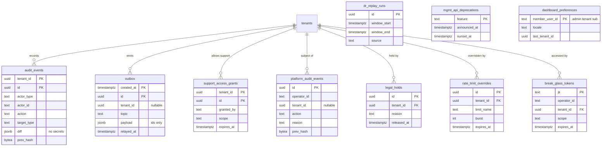

# Data model: 監査・outbox・運用・管理の経路

[data-model.md](../data-model.md) の一部。規約は、そちらの 2 節に従う。振る舞いは [security.md](../security.md)、[management-api-and-rate-limiting.md](../management-api-and-rate-limiting.md)、[dashboard.md](../dashboard.md)、[infrastructure.md](../infrastructure.md)、[ADR-0005](../../decisions/0005-authentication-path-availability.md)、[ADR-0035](../../decisions/0035-rate-limiting.md)、[ADR-0037](../../decisions/0037-break-glass-and-admin-roles.md)、[ADR-0054](../../decisions/0054-audit-log.md)〜[ADR-0056](../../decisions/0056-operator-access.md)、[ADR-0060](../../decisions/0060-disaster-recovery-and-stages.md) を正とする。

## 1. ER 図

`audit_events`・`support_access_grants` だけがテナントテーブル。他はテナントの外（[data-model.md](../data-model.md) の 3 節）。

## 2. 監査

### audit_events

テナントの監査（ADR-0054）。操作と同じトランザクションで追記する。差分に秘密を入れない。

| 列 | 型 | NULL | 既定 | 説明 |
| --- | --- | --- | --- | --- |
| `tenant_id` | `uuid` | NO | | |
| `id` | `uuid` | NO | `uuidv7()` | パーティションの鍵 |
| `occurred_at` | `timestamptz` | NO | `now()` | |
| `actor_type` | `text` | NO | | `member`・`client`・`operator`・`system` |
| `actor_id` | `text` | NO | | `member_user_id`、`client_id`、運用者の ID |
| `action` | `text` | NO | | 例：`signing_key.revoke`、`client.secret_rotate` |
| `target_type` | `text` | NO | | |
| `target_id` | `text` | YES | | |
| `outcome` | `text` | NO | | `success`・`failure` |
| `ip` | `inet` | YES | | |
| `user_agent` | `text` | YES | | |
| `request_id` | `text` | YES | | |
| `diff` | `jsonb` | YES | | 変更の前後。秘密は「変更した」とだけ書く |
| `prev_hash` | `bytea` | YES | | ハッシュの連鎖。Relay が log-archive へ送るときに埋める |

- 主キー：`(tenant_id, id)`。
- 分割：`RANGE (id)` で 1 か月ごと。

  > 2026-09-28 の統合：旧い定義の `PARTITION BY RANGE (occurred_at)` は、主キー `(tenant_id, id)` が分割の鍵を含まず、PostgreSQL で作れない。UUIDv7 の `id` の範囲で切る形にした（[data-model.md](../data-model.md) の 2.8 節）。

- 索引：`(tenant_id, id)`（主キー。新しい順の一覧）、`(tenant_id, target_type, target_id, id)`（対象ごとの履歴）、`(tenant_id, actor_id, id)`（行為者ごと）。
- 書き込み：各サービスは INSERT だけ。UPDATE・DELETE の権限をアプリのロールに与えない。`prev_hash` の設定は `relay` のロールの関数だけ。
- 保持：DB に 1 年。log-archive にあることを確かめてから、1 年より古いパーティションを `DROP`。テナントの管理者が見られるのは 90 日。log-archive は 7 年（法務の L5 で確定）。
- S1 の規模：1 日 数万行、1 年で約 20 GB。

### platform_audit_events

プラットフォームの監査。テナントの外（テナントをまたぐ操作と、`tenant_id` のない操作を含む）。

| 列 | 型 | NULL | 既定 | 説明 |
| --- | --- | --- | --- | --- |
| `id` | `uuid` | NO | `uuidv7()` | |
| `occurred_at` | `timestamptz` | NO | `now()` | |
| `operator_id` | `text` | NO | | IAM Identity Center の利用者、または `system` |
| `tenant_id` | `uuid` | YES | | プラットフォーム全体の操作は NULL |
| `action` | `text` | NO | | 例：`jit.grant`、`support.view`、`break_glass.use`、`tenant.suspend`、`legal_hold.place` |
| `reason` | `text` | NO | | |
| `incident_id` | `text` | YES | | |
| `approved_by` | `text` | YES | | 2 人の承認のとき |
| `diff` | `jsonb` | YES | | |
| `prev_hash` | `bytea` | YES | | |

- 主キー：`(id)`。分割：`RANGE (id)` で 1 か月ごと。
- 索引：`(tenant_id, id) WHERE tenant_id IS NOT NULL`（テナントの調査）、`(operator_id, id)`（アクセスレビュー）。
- 書き込み：各サービスは INSERT だけ（関数経由）。
- 保持：`audit_events` と同じ。
- S1 の規模：1 日 数百行。

### support_access_grants

テナントの管理者が許したサポートの参照（ADR-0056）。

| 列 | 型 | NULL | 既定 | 説明 |
| --- | --- | --- | --- | --- |
| `tenant_id` | `uuid` | NO | | |
| `id` | `uuid` | NO | `uuidv7()` | |
| `granted_by` | `text` | NO | | テナントの管理者の `member_user_id` |
| `scope` | `text` | NO | | `config`・`users`・`logs` |
| `expires_at` | `timestamptz` | NO | | |
| `revoked_at` | `timestamptz` | YES | | |
| `created_at` | `timestamptz` | NO | `now()` | |

- 主キー：`(tenant_id, id)`。
- 索引：`(tenant_id, expires_at) WHERE revoked_at IS NULL`（有効な許可の確認）。
- 保持：期限から 1 年。

> 2026-09-28 の統合：旧い定義の `granted_by uuid` は、管理者が管理用のテナントのユーザーなので `text`（`member_user_id`）にした（[data-model.md](../data-model.md) の 2.4 節）。

### legal_holds

テナント単位の削除の停止（ADR-0055）。テナントの外。

| 列 | 型 | NULL | 既定 | 説明 |
| --- | --- | --- | --- | --- |
| `id` | `uuid` | NO | `uuidv7()` | |
| `tenant_id` | `uuid` | NO | | |
| `reason` | `text` | NO | | |
| `placed_by` | `text` | NO | | |
| `placed_at` | `timestamptz` | NO | `now()` | |
| `released_at` | `timestamptz` | YES | | |

- 主キー：`(id)`。外部キー：`tenant_id` → `tenants (id)`（テナントの行はホールドの間は消えない）。
- 索引：`(tenant_id) WHERE released_at IS NULL`（保持のジョブがテナントごとに確かめる）。
- 保持：解除から 7 年。

### dr_replay_runs

DR の後の、失った範囲のやり直しの記録（ADR-0060）。テナントの外。

| 列 | 型 | NULL | 既定 | 説明 |
| --- | --- | --- | --- | --- |
| `id` | `uuid` | NO | `uuidv7()` | |
| `window_start`、`window_end` | `timestamptz` | NO | | 失った範囲 |
| `source` | `text` | NO | | `audit_archive`・`auth_event_archive`・`snapshot` |
| `extracted_count` | `integer` | NO | | |
| `replayed_count` | `integer` | NO | | |
| `approved_by` | `text` | NO | | |
| `started_at` | `timestamptz` | NO | | |
| `finished_at` | `timestamptz` | YES | | |

- 主キー：`(id)`。保持：消さない。

## 3. outbox

非同期の連携の出口（ADR-0005）。テナントの外（Relay が全テナントの行を読む）。事象の種類と本文の形は [stores.md](stores.md) の 5 節。

| 列 | 型 | NULL | 既定 | 説明 |
| --- | --- | --- | --- | --- |
| `id` | `uuid` | NO | `uuidv7()` | |
| `tenant_id` | `uuid` | YES | | プラットフォームの事象は NULL |
| `topic` | `text` | NO | | 例：`log_event`、`session.ended`、`jwks.changed`、`tenant.config_changed` |
| `payload` | `jsonb` | NO | | ID と種類だけ。秘密を入れない |
| `trace_context` | `text` | YES | | W3C `traceparent`（[observability.md](../observability.md) の 2.2 節） |
| `created_at` | `timestamptz` | NO | `now()` | |
| `relayed_at` | `timestamptz` | YES | | |

- 主キー：`(created_at, id)`。分割：`RANGE (created_at)` で 1 日ごと（冪等の一意の制約を持たないので、時刻で切る）。
- 索引：`(created_at) WHERE relayed_at IS NULL`（Relay の読み取り。最古の未送が 30 秒を超えたら呼び出す）。
- 書き込み：各サービスは業務のトランザクションの中で、自分のテナントの行だけを入れる（`WITH CHECK (tenant_id = current_setting('app.tenant_id')::uuid OR tenant_id IS NULL AND current_user = 'platform')` の形のポリシーを、INSERT のためだけに持つ）。`relay` は SELECT と `relayed_at` の UPDATE だけ。
- 保持：すべての行が `relayed_at` を持つ日のパーティションを、2 日後に `DROP`。
- S1 の規模：ピーク 約 6,000 行/秒（ログの事象が大半）、1 日 約 2 億行。

## 4. 管理の経路とダッシュボード

### rate_limit_overrides

レート制限の上書き（ADR-0035）。Ops が扱う。テナントの外。

| 列 | 型 | NULL | 既定 | 説明 |
| --- | --- | --- | --- | --- |
| `id` | `uuid` | NO | `uuidv7()` | |
| `tenant_id` | `uuid` | NO | | |
| `limit_name` | `text` | NO | | 制限の名前（[management-api-and-rate-limiting.md](../management-api-and-rate-limiting.md) の 6 節） |
| `burst` | `integer` | NO | | |
| `rate_per_sec` | `numeric(10,3)` | NO | | |
| `reason` | `text` | NO | | |
| `expires_at` | `timestamptz` | NO | | 期限を必須にする |
| `approved_by` | `text` | NO | | |
| `created_at` | `timestamptz` | NO | `now()` | |

- 主キー：`(id)`。一意：`(tenant_id, limit_name)`（期限切れの行は日次のジョブが消すので、有効な上書きは 1 つ）。
- 変更はプラットフォームの監査に残す。全タスクが設定のバージョンと一緒に読む。
- S1 の規模：数百行。

### mgmt_api_deprecations

Management API の廃止の予定。本システムの設定（テナントに属さない）。`depnote` の判定に使う。

| 列 | 型 | NULL | 既定 | 説明 |
| --- | --- | --- | --- | --- |
| `feature` | `text` | NO | | |
| `announced_at` | `timestamptz` | NO | | |
| `sunset_at` | `timestamptz` | NO | | |

- 主キー：`(feature)`。書くのは `migrator` だけ。

### break_glass_tokens

運用者の非常用のトークンの発行の記録（ADR-0037）。トークンは保存しない。

| 列 | 型 | NULL | 既定 | 説明 |
| --- | --- | --- | --- | --- |
| `jti` | `text` | NO | | |
| `operator_id` | `text` | NO | | |
| `tenant_id` | `uuid` | NO | | |
| `scope` | `text` | NO | | |
| `incident_id` | `text` | NO | | |
| `issued_at` | `timestamptz` | NO | `now()` | |
| `expires_at` | `timestamptz` | NO | | |

- 主キー：`(jti)`。プラットフォームの監査の行と対にする。
- 保持：7 年（監査と同じ）。

### dashboard_preferences

管理者の設定。管理者はテナントをまたいで属するので、テナントの外。

| 列 | 型 | NULL | 既定 | 説明 |
| --- | --- | --- | --- | --- |
| `member_user_id` | `text` | NO | | 管理用のテナントの `sub` |
| `locale` | `text` | YES | | |
| `last_tenant_id` | `uuid` | YES | | |
| `saved_filters` | `jsonb` | NO | `'{}'` | |
| `updated_at` | `timestamptz` | NO | `now()` | |

- 主キー：`(member_user_id)`。`mgmt_app` は本人の行だけを関数で読み書きする。
- S1 の規模：数万行。
