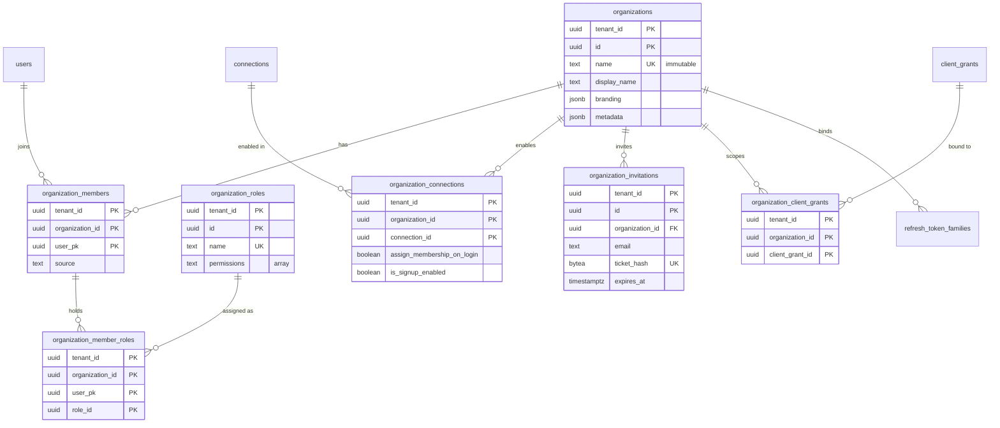
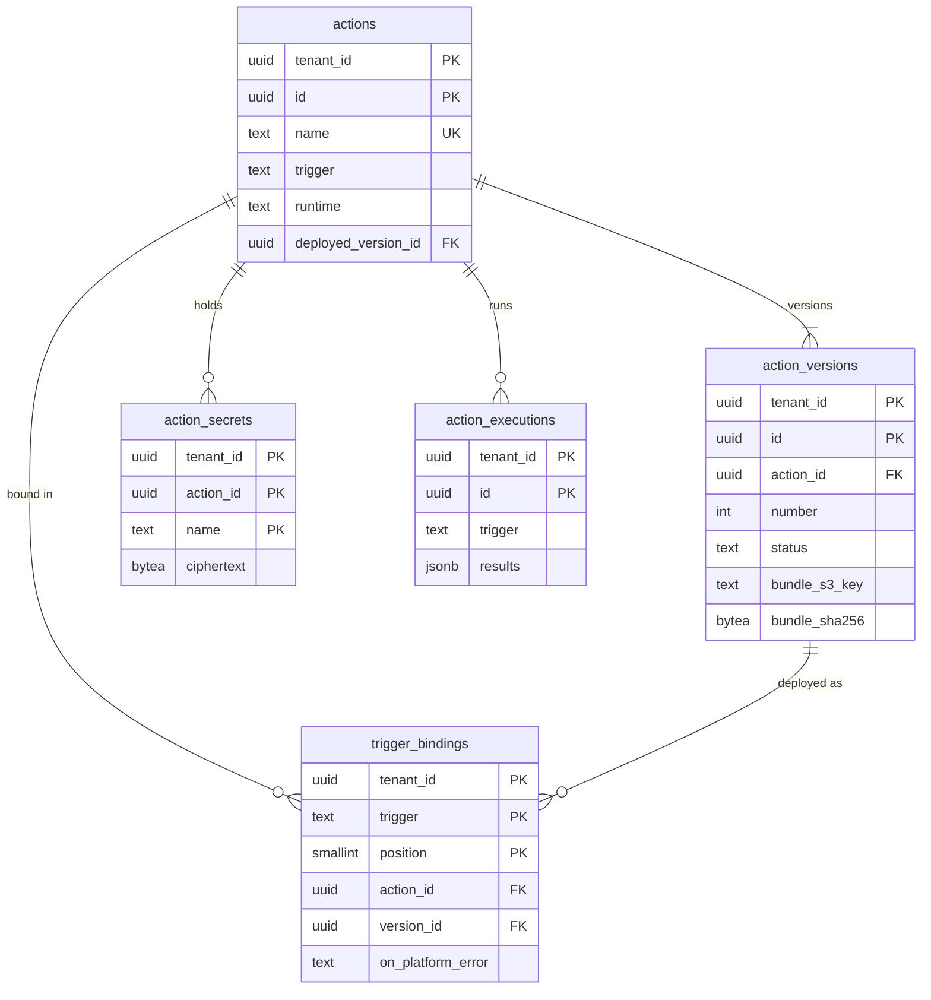

# Data model: Organizations（E14）・Actions（E13）

[data-model.md](../data-model.md) の一部。規約は、そちらの 2 節に従う。どちらも MVP の後。振る舞いは [organizations.md](../organizations.md)、[extensibility.md](../extensibility.md)、[ADR-0048](../../decisions/0048-extensibility-triggers-and-failure-policy.md)〜[ADR-0052](../../decisions/0052-organization-tokens-sessions-and-membership.md) を正とする。

## 1. ER 図

### 1.1 Organizations

### 1.2 Actions

`action_executions` はログのクラスタにあり、`actions` への外部キーを持たない。

## 2. Organizations

### organizations

| 列 | 型 | NULL | 既定 | 説明 |
| --- | --- | --- | --- | --- |
| `tenant_id` | `uuid` | NO | | |
| `id` | `uuid` | NO | `uuidv7()` | 外には `org_` ＋ base62 で出す |
| `name` | `text` | NO | | 1〜50 文字、`^[a-z0-9][a-z0-9-_]*$`。**変えられない**（ADR-0052） |
| `display_name` | `text` | YES | | 変えられる |
| `branding` | `jsonb` | NO | `'{}'` | ロゴと色（`branding_themes` の上書き） |
| `metadata` | `jsonb` | NO | `'{}'` | |
| `created_at` / `updated_at` | `timestamptz` | NO | `now()` | |

- 主キー：`(tenant_id, id)`。一意：`(tenant_id, name)`。
- 検査：`name` の更新はトリガーではなく関数で拒否する。
- S1 の規模：E14 の後。テナントあたり最大 10 万（上書きで 200 万）。

> 2026-09-28 の統合：organizations.md の 3 節の図の `organization_branding` は、別の表ではなく `organizations.branding` の列にした（14 節の列の一覧に合わせた）。

### organization_members

| 列 | 型 | NULL | 既定 | 説明 |
| --- | --- | --- | --- | --- |
| `tenant_id` | `uuid` | NO | | |
| `organization_id` | `uuid` | NO | | |
| `user_pk` | `uuid` | NO | | |
| `source` | `text` | NO | | `manual`・`auto`・`invitation` |
| `created_at` | `timestamptz` | NO | `now()` | |

- 主キー：`(tenant_id, organization_id, user_pk)`（メンバーシップの確認）。
- 索引：`(tenant_id, user_pk)`（利用者の属する組織の一覧。`post_login_prompt`）。
- 外部キー：`organizations`・`users` へ `ON DELETE CASCADE`。
- 削除は、同じトランザクションで outbox に `organization.member_removed` を入れ、Worker が系列を `membership_removed` で失効させる。

### organization_roles

| 列 | 型 | NULL | 既定 | 説明 |
| --- | --- | --- | --- | --- |
| `tenant_id` | `uuid` | NO | | |
| `id` | `uuid` | NO | `uuidv7()` | |
| `name` | `text` | NO | | |
| `description` | `text` | YES | | |
| `permissions` | `text[]` | NO | `'{}'` | 権限の文字列 |
| `created_at` / `updated_at` | `timestamptz` | NO | `now()` | |

- 主キー：`(tenant_id, id)`。一意：`(tenant_id, name)`。テナントに 1,000 まで。

### organization_member_roles

| 列 | 型 | NULL | 既定 | 説明 |
| --- | --- | --- | --- | --- |
| `tenant_id` | `uuid` | NO | | |
| `organization_id` | `uuid` | NO | | |
| `user_pk` | `uuid` | NO | | |
| `role_id` | `uuid` | NO | | |

- 主キー：`(tenant_id, organization_id, user_pk, role_id)`。
- 外部キー：`(tenant_id, organization_id, user_pk)` → `organization_members` `ON DELETE CASCADE`、`(tenant_id, role_id)` → `organization_roles` `ON DELETE CASCADE`。
- メンバーあたり 50 まで（関数）。

### organization_connections

| 列 | 型 | NULL | 既定 | 説明 |
| --- | --- | --- | --- | --- |
| `tenant_id` | `uuid` | NO | | |
| `organization_id` | `uuid` | NO | | |
| `connection_id` | `uuid` | NO | | |
| `assign_membership_on_login` | `boolean` | NO | `false` | |
| `is_signup_enabled` | `boolean` | NO | `false` | |
| `show_as_button` | `boolean` | NO | `true` | |
| `is_enabled` | `boolean` | NO | `true` | |

- 主キー：`(tenant_id, organization_id, connection_id)`。組織に 10 まで。
- 外部キー：`organizations`・`connections` へ `ON DELETE CASCADE`。

### organization_invitations

| 列 | 型 | NULL | 既定 | 説明 |
| --- | --- | --- | --- | --- |
| `tenant_id` | `uuid` | NO | | |
| `id` | `uuid` | NO | `uuidv7()` | |
| `organization_id` | `uuid` | NO | | |
| `email` | `text` | NO | | 小文字に正規化 |
| `roles` | `uuid[]` | NO | `'{}'` | `organization_roles.id` |
| `connection_id` | `uuid` | YES | | |
| `client_id` | `text` | NO | | 招待のリンクのアプリ |
| `ticket_hash` | `bytea` | NO | | SHA-256 |
| `inviter` | `text` | NO | | 招待した人の表示名 |
| `expires_at` | `timestamptz` | NO | | 既定 7 日、最大 30 日 |
| `used_at` | `timestamptz` | YES | | |
| `created_at` | `timestamptz` | NO | `now()` | |

- 主キー：`(tenant_id, id)`。一意：`(tenant_id, ticket_hash)`。
- 索引：`(tenant_id, organization_id) WHERE used_at IS NULL`（未処理の招待は組織に 1,000 まで）。
- 保持：期限か使用から 30 日で消す。

### organization_client_grants（E14 の後）

組織に結ぶ M2M の許可。

| 列 | 型 | NULL | 既定 | 説明 |
| --- | --- | --- | --- | --- |
| `tenant_id` | `uuid` | NO | | |
| `organization_id` | `uuid` | NO | | |
| `client_grant_id` | `uuid` | NO | | → `client_grants.id` |
| `created_at` | `timestamptz` | NO | `now()` | |

- 主キー：`(tenant_id, organization_id, client_grant_id)`。
- 外部キー：両方の親へ `ON DELETE CASCADE`。

## 3. Actions

### actions

| 列 | 型 | NULL | 既定 | 説明 |
| --- | --- | --- | --- | --- |
| `tenant_id` | `uuid` | NO | | |
| `id` | `uuid` | NO | `uuidv7()` | |
| `name` | `text` | NO | | |
| `trigger` | `text` | NO | | `post-login`・`pre-user-registration`・`post-user-registration`・`post-change-password`・`credentials-exchange` など |
| `runtime` | `text` | NO | | `node22` など |
| `deployed_version_id` | `uuid` | YES | | 配備中の版 |
| `created_at` / `updated_at` | `timestamptz` | NO | `now()` | |

- 主キー：`(tenant_id, id)`。一意：`(tenant_id, name)`。
- 外部キー：`(tenant_id, deployed_version_id)` → `action_versions` `DEFERRABLE`。

### action_versions

| 列 | 型 | NULL | 既定 | 説明 |
| --- | --- | --- | --- | --- |
| `tenant_id` | `uuid` | NO | | |
| `id` | `uuid` | NO | `uuidv7()` | |
| `action_id` | `uuid` | NO | | |
| `number` | `integer` | NO | | Action の中の 1, 2, 3 … |
| `code` | `text` | NO | | テナントのコード（秘密を入れない。ビルドの成果物にも入れない） |
| `dependencies` | `jsonb` | NO | `'[]'` | 解決した具体の版（10 個まで） |
| `status` | `text` | NO | `'draft'` | `draft`・`built`・`deployed`・`failed` |
| `bundle_s3_key` | `text` | YES | | actions のアカウントの S3 |
| `bundle_sha256` | `bytea` | YES | | |
| `build_log` | `text` | YES | | |
| `created_at` | `timestamptz` | NO | `now()` | |
| `deployed_at` | `timestamptz` | YES | | |

- 主キー：`(tenant_id, id)`。一意：`(tenant_id, action_id, number)`。
- 外部キー：`actions` へ `ON DELETE CASCADE`。
- 検査：`CHECK ((status IN ('built','deployed')) = (bundle_sha256 IS NOT NULL))`。

### action_secrets

| 列 | 型 | NULL | 既定 | 説明 |
| --- | --- | --- | --- | --- |
| `tenant_id` | `uuid` | NO | | |
| `action_id` | `uuid` | NO | | |
| `name` | `text` | NO | | 128 文字まで |
| `ciphertext` | `bytea` | NO | | 値（4,096 文字まで）。テナントの DEK、AAD = `tenant_id|action_id|name` |
| `data_key_version` | `integer` | NO | | |
| `updated_at` | `timestamptz` | NO | `now()` | |

- 主キー：`(tenant_id, action_id, name)`。Action に 30 まで。読み取りの API は名前だけを返す。

> 2026-09-28 の統合：extensibility の 14 節の列に `data_key_version` がなかった。復号に要るので足した。

### trigger_bindings

トリガーごとの Action の並び。配備でテナントの設定の版を上げる（ADR-0032）。

| 列 | 型 | NULL | 既定 | 説明 |
| --- | --- | --- | --- | --- |
| `tenant_id` | `uuid` | NO | | |
| `trigger` | `text` | NO | | |
| `position` | `smallint` | NO | | 1 から |
| `action_id` | `uuid` | NO | | |
| `version_id` | `uuid` | NO | | 固定した版 |
| `on_platform_error` | `text` | NO | `'deny'` | `deny`・`allow`（ADR-0048） |

- 主キー：`(tenant_id, trigger, position)`。一意：`(tenant_id, trigger, action_id)`。
- 外部キー：`actions`・`action_versions` へ（Action の削除は、先に並びから外すことを求める `ON DELETE RESTRICT`）。

### action_executions（ログのクラスタ）

実行の記録。10 日。

| 列 | 型 | NULL | 既定 | 説明 |
| --- | --- | --- | --- | --- |
| `tenant_id` | `uuid` | NO | | |
| `id` | `uuid` | NO | `uuidv7()` | |
| `trigger` | `text` | NO | | |
| `results` | `jsonb` | NO | | Action ごとの時間・エラー・256 文字のログ（秘密の値は伏せる） |
| `created_at` | `timestamptz` | NO | `now()` | |

- 主キー：`(tenant_id, id)`。分割：`RANGE (id)` で 1 日ごと。10 日を過ぎたパーティションを `DROP`。
- 認証のイベントのログの `details.execution_id` から引く。
